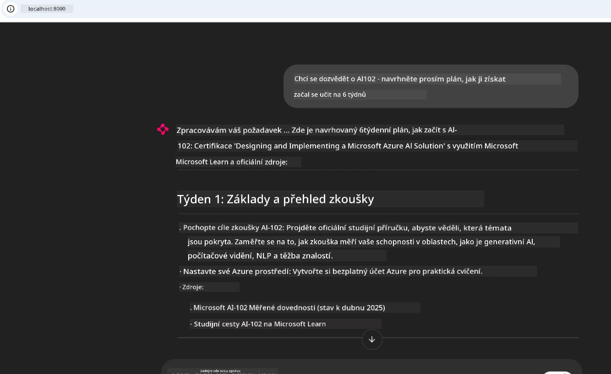
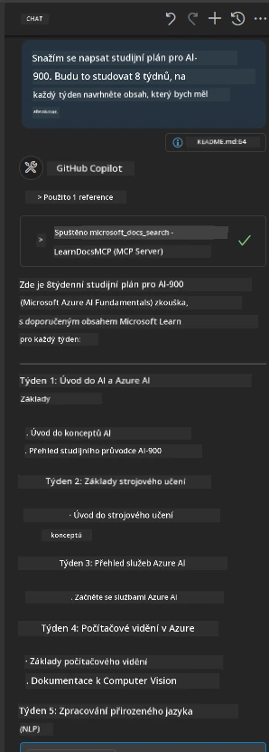

# Případová studie: Připojení k Microsoft Learn Docs MCP serveru z klienta

Znáte ten pocit, když mezi dokumentačními weby, Stack Overflow a nekonečnými kartami ve vyhledávači přepínáte a snažíte se vyřešit problém v kódu? Možná máte druhý monitor jen na dokumentaci, nebo neustále přepínáte mezi IDE a prohlížečem pomocí Alt+Tab. Nebylo by lepší, kdybyste měli dokumentaci přímo v pracovním toku—integrovanou do svých aplikací, IDE nebo dokonce vlastních nástrojů? V této případové studii si ukážeme, jak to udělat — připojit se přímo k Microsoft Learn Docs MCP serveru z vlastní klientské aplikace.

## Přehled

Moderní vývoj není jen o psaní kódu—jde o nalezení správných informací ve správný čas. Dokumentace je všude, ale málokdy tam, kde ji nejvíce potřebujete: přímo ve svých nástrojích a pracovních postupech. Integrací získávání dokumentace přímo do vašich aplikací ušetříte čas, snížíte přepínání kontextu a zvýšíte produktivitu. V této části vám ukážeme, jak připojit klienta k Microsoft Learn Docs MCP serveru, abyste mohli přistupovat k dokumentaci v reálném čase a relevantní k aktuálnímu kontextu, aniž byste opustili aplikaci.

Provedeme vás procesem navázání připojení, odeslání požadavku a efektivní práce s průběžnými odpověďmi. Tento přístup nejen zjednodušuje váš pracovní tok, ale otevírá dveře k vytváření chytřejších a užitečnějších vývojářských nástrojů.

## Cíle učení

Proč to děláme? Protože nejlepší vývojářské zážitky odstraní překážky. Představte si svět, kde váš kódovací editor, chatbot nebo webová aplikace umí okamžitě odpovídat na dotazy ohledně dokumentace pomocí nejnovějšího obsahu z Microsoft Learn. Na konci této kapitoly budete umět:

- Porozumět základům komunikace klient-server MCP pro dokumentaci
- Implementovat konzolovou nebo webovou aplikaci pro připojení k Microsoft Learn Docs MCP serveru
- Používat streamovací HTTP klienty pro získávání dokumentace v reálném čase
- Protokolovat a interpretovat odpovědi dokumentace ve vaší aplikaci

Uvidíte, jak tyto dovednosti pomohou vytvářet nástroje, které nejsou jen reaktivní, ale skutečně interaktivní a kontextově uvědomělé.

## Scénář 1 - Získávání dokumentace v reálném čase přes MCP

V tomto scénáři vám ukážeme, jak připojit klienta k Microsoft Learn Docs MCP serveru, abyste mohli získávat dokumentaci v reálném čase a kontextově relevantní, aniž byste opustili aplikaci.

Pusťme se do toho. Vaším úkolem je napsat aplikaci, která se připojí k Microsoft Learn Docs MCP serveru, zavolá nástroj `microsoft_docs_search` a zaznamená streamovanou odpověď do konzole.

### Proč tento přístup?
Protože je to základ pro vytváření pokročilejších integrací — ať už chcete pohánět chatbota, rozšíření IDE nebo webovou ovládací desku.

Kód a instrukce pro tento scénář najdete v adresáři [`solution`](./solution/README.md) v rámci této případové studie. Kroky vás provedou nastavením připojení:
- Použijte oficiální MCP SDK a streamovací HTTP klienta pro připojení
- Zavolejte nástroj `microsoft_docs_search` s parametrem dotazu pro získání dokumentace
- Implementujte řádné protokolování a zpracování chyb
- Vytvořte interaktivní konzolové rozhraní, které umožní uživatelům zadávat více vyhledávacích dotazů

Tento scénář demonstruje, jak:
- Připojit se k Docs MCP serveru
- Odeslat dotaz
- Zpracovat a vypsat výsledky

Takto může vypadat spuštění řešení:

```
Prompt> What is Azure Key Vault?
Answer> Azure Key Vault is a cloud service for securely storing and accessing secrets. ...
```

Níže je minimální vzorové řešení. Kompletní kód a podrobnosti jsou k dispozici ve složce solution.

<details>
<summary>Python</summary>

```python
import asyncio
from mcp.client.streamable_http import streamablehttp_client
from mcp import ClientSession

async def main():
    async with streamablehttp_client("https://learn.microsoft.com/api/mcp") as (read_stream, write_stream, _):
        async with ClientSession(read_stream, write_stream) as session:
            await session.initialize()
            result = await session.call_tool("microsoft_docs_search", {"query": "Azure Functions best practices"})
            print(result.content)

if __name__ == "__main__":
    asyncio.run(main())
```

- Pro kompletní implementaci a protokolování viz [`scenario1.py`](../../../../09-CaseStudy/docs-mcp/solution/python/scenario1.py).
- Pro instrukce instalace a použití viz soubor [`README.md`](./solution/python/README.md) ve stejném adresáři.
</details>


## Scénář 2 - Webová aplikace pro interaktivní generování studijního plánu s MCP

V tomto scénáři se naučíte, jak integrovat Docs MCP do webového vývojového projektu. Cílem je umožnit uživatelům vyhledávat dokumentaci Microsoft Learn přímo z webového rozhraní a mít ji okamžitě k dispozici přímo ve vaší aplikaci nebo na webu.

Uvidíte, jak:
- Nastavit webovou aplikaci
- Připojit se k Docs MCP serveru
- Zpracovat vstup uživatele a zobrazit výsledky

Takto může vypadat spuštění řešení:

```
User> I want to learn about AI102 - so suggest the roadmap to get it started from learn for 6 weeks

Assistant> Here’s a detailed 6-week roadmap to start your preparation for the AI-102: Designing and Implementing a Microsoft Azure AI Solution certification, using official Microsoft resources and focusing on exam skills areas:

---
## Week 1: Introduction & Fundamentals
- **Understand the Exam**: Review the [AI-102 exam skills outline](https://learn.microsoft.com/en-us/credentials/certifications/exams/ai-102/).
- **Set up Azure**: Sign up for a free Azure account if you don't have one.
- **Learning Path**: [Introduction to Azure AI services](https://learn.microsoft.com/en-us/training/modules/intro-to-azure-ai/)
- **Focus**: Get familiar with Azure portal, AI capabilities, and necessary tools.

....more weeks of the roadmap...

Let me know if you want module-specific recommendations or need more customized weekly tasks!
```

Níže je minimální vzorové řešení. Kompletní kód a podrobnosti jsou k dispozici ve složce solution.



<details>
<summary>Python (Chainlit)</summary>

Chainlit je framework pro tvorbu konverzačních AI webových aplikací. Umožňuje snadno vytvořit interaktivní chatboty a asistenty, kteří mohou volat MCP nástroje a zobrazovat výsledky v reálném čase. Je ideální pro rychlé prototypování a uživatelsky přívětivá rozhraní.

```python
import chainlit as cl
import requests

MCP_URL = "https://learn.microsoft.com/api/mcp"

@cl.on_message
def handle_message(message):
    query = {"question": message}
    response = requests.post(MCP_URL, json=query)
    if response.ok:
        result = response.json()
        cl.Message(content=result.get("answer", "No answer found.")).send()
    else:
        cl.Message(content="Error: " + response.text).send()
```

- Kompletní implementaci najdete v [`scenario2.py`](../../../../09-CaseStudy/docs-mcp/solution/python/scenario2.py).
- Instrukce k nastavení a spuštění viz [`README.md`](./solution/python/README.md).
</details>


## Scénář 3: Dokumentace v editoru s MCP serverem ve VS Code

Pokud chcete mít Microsoft Learn Docs přímo ve VS Code (místo přepínání mezi kartami v prohlížeči), můžete použít MCP server ve svém editoru. To vám umožní:
- Vyhledávat a číst dokumentaci ve VS Code, aniž byste opustili své programovací prostředí.
- Odkazovat dokumentaci a vkládat odkazy přímo do README nebo studijních souborů.
- Využívat GitHub Copilot a MCP společně pro bezproblémový, AI-poháněný pracovní postup s dokumentací.

**Ukážeme si, jak:**
- Přidat platný soubor `.vscode/mcp.json` do kořenové složky vašeho workspace (příklad níže).
- Otevřít MCP panel nebo použít příkazovou paletu VS Code k vyhledávání a vkládání dokumentace.
- Odkazovat dokumentaci přímo ve vašich markdown souborech při práci.
- Kombinovat tento pracovní postup s GitHub Copilot pro ještě větší produktivitu.

Zde je příklad, jak nastavit MCP server ve VS Code:

```json
{
  "servers": {
    "LearnDocsMCP": {
      "url": "https://learn.microsoft.com/api/mcp"
    }
  }
}
```

</details>

> Pro podrobný návod s obrázky a krok za krokem si přečtěte [`README.md`](./solution/scenario3/README.md).



Tento přístup je ideální pro všechny, kdo vytvářejí technické kurzy, píší dokumentaci nebo vyvíjejí kód s častou potřebou odkazování.

## Klíčová zjištění

Integrace dokumentace přímo do vašich nástrojů není jen pohodlí—je to zásadní zlepšení produktivity. Připojením se k Microsoft Learn Docs MCP serveru z klienta můžete:

- Odstranit přepínání kontextu mezi kódem a dokumentací
- Získat aktuální, kontextově relevantní dokumentaci v reálném čase
- Vytvářet chytřejší, interaktivní vývojářské nástroje

Tyto dovednosti vám pomohou vytvořit řešení, která nejsou jen efektivní, ale také příjemná na používání.

## Další zdroje

Pro hlubší pochopení prozkoumejte tyto oficiální zdroje:

- [Microsoft Learn Docs MCP Server (GitHub)](https://github.com/MicrosoftDocs/mcp)
- [Začínáme s Azure MCP Serverem (mcp-python)](https://learn.microsoft.com/en-us/azure/developer/azure-mcp-server/get-started#create-the-python-app)
- [Co je Azure MCP Server?](https://learn.microsoft.com/en-us/azure/developer/azure-mcp-server/)
- [Úvod do Model Context Protocol (MCP)](https://modelcontextprotocol.io/introduction)
- [Přidání pluginů z MCP Serveru (Python)](https://learn.microsoft.com/en-us/semantic-kernel/concepts/plugins/adding-mcp-plugins)

## Co dál

- Zpět na: [Přehled případových studií](../README.md)
- Pokračovat na: [Modul 10: Zjednodušení AI pracovních toků s AI Toolkit](../../10-StreamliningAIWorkflowsBuildingAnMCPServerWithAIToolkit/README.md)

---

<!-- CO-OP TRANSLATOR DISCLAIMER START -->
**Prohlášení o vyloučení odpovědnosti**:  
Tento dokument byl přeložen pomocí AI překladatelské služby [Co-op Translator](https://github.com/Azure/co-op-translator). Přestože usilujeme o přesnost, mějte prosím na paměti, že automatické překlady mohou obsahovat chyby nebo nepřesnosti. Původní dokument v jeho mateřském jazyce by měl být považován za autoritativní zdroj. Pro důležité informace je doporučen profesionální lidský překlad. Nejsme odpovědní za jakákoliv nedorozumění nebo nesprávné interpretace vzniklé použitím tohoto překladu.
<!-- CO-OP TRANSLATOR DISCLAIMER END -->