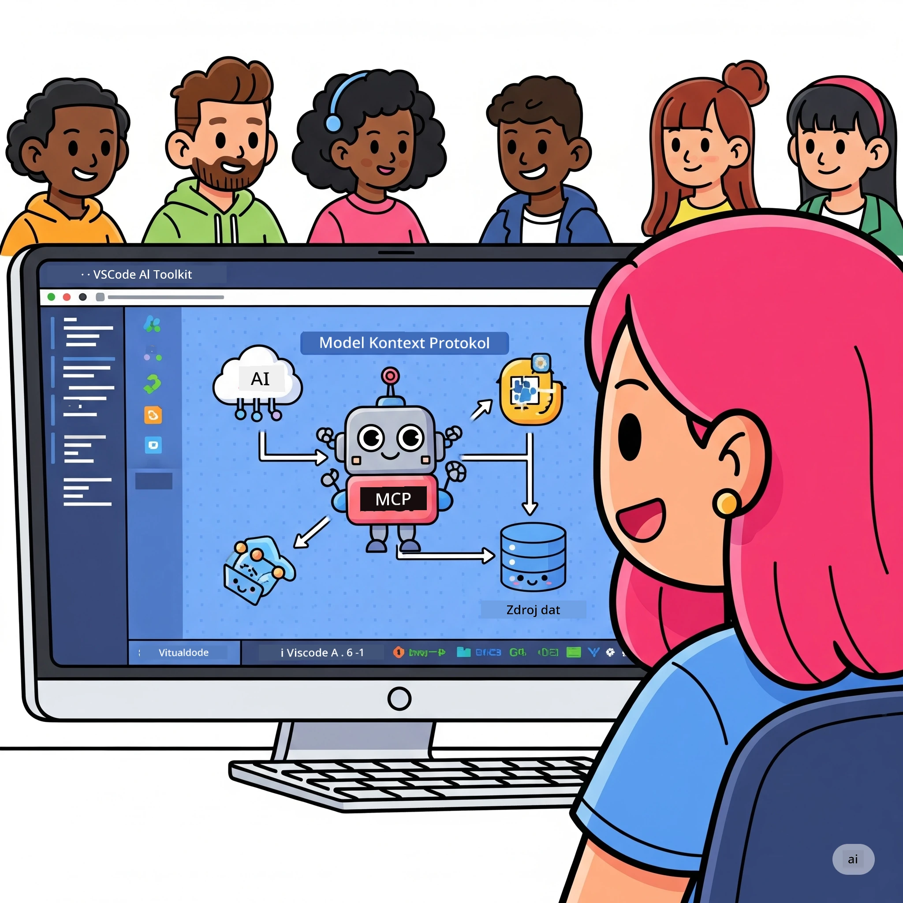
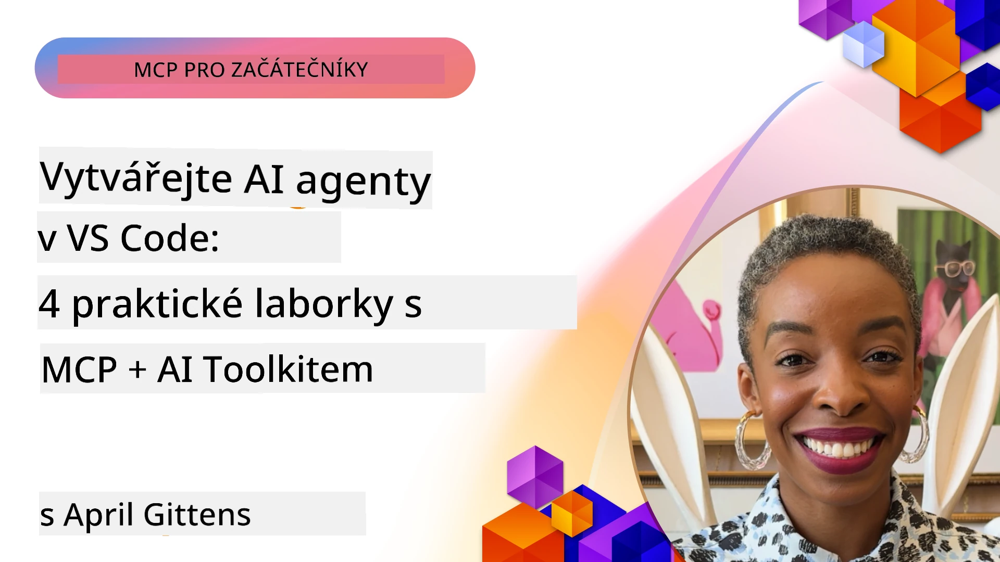

# Zefektivnění pracovních postupů AI: Vytvoření MCP serveru s AI Toolkit

## 🎯 Přehled

_(Klikněte na obrázek výše pro zobrazení videa této lekce)_

Vítejte na **Model Context Protocol (MCP) Workshopu**! Tento komplexní praktický workshop kombinuje dvě špičkové technologie, které revolučně mění vývoj AI aplikací:

- **🔗 Model Context Protocol (MCP)**: Otevřený standard pro bezproblémovou integraci AI nástrojů
- **🛠️ AI Toolkit pro Visual Studio Code (AITK)**: Výkonné rozšíření pro vývoj AI od Microsoftu

### 🎓 Co se naučíte

Na konci tohoto workshopu ovládnete umění vytváření inteligentních aplikací, které propojují AI modely s reálnými nástroji a službami. Od automatizovaného testování po vlastní integrace API získáte praktické dovednosti pro řešení složitých obchodních výzev.

## 🏗️ Technologie

### 🔌 Model Context Protocol (MCP)

MCP je **„USB-C pro AI“** – univerzální standard, který připojuje AI modely k externím nástrojům a zdrojům dat.

**✨ Klíčové vlastnosti:**

- 🔄 **Standardizovaná integrace**: Univerzální rozhraní pro připojení AI nástrojů
- 🏛️ **Flexibilní architektura**: Lokální i vzdálené servery přes stdio/SSE přenos
- 🧰 **Bohatý ekosystém**: Nástroje, výzvy a zdroje v jednom protokolu
- 🔒 **Podniková připravenost**: Vestavěná bezpečnost a spolehlivost

**🎯 Proč je MCP důležitý:**
Stejně jako USB-C odstranil chaos s kabely, MCP odstraňuje složitost integrace AI. Jeden protokol, nekonečné možnosti.

### 🤖 AI Toolkit pro Visual Studio Code (AITK)

Vlajková AI vývojářská rozšíření Microsoftu, které promění VS Code v AI centrum.

**🚀 Hlavní schopnosti:**

- 📦 **Katalog modelů**: Přístup k modelům z Azure AI, GitHub, Hugging Face, Ollama
- ⚡ **Lokální inferenční běh**: ONNX optimalizovaná CPU/GPU/NPU exekuce
- 🏗️ **Stavitel agentů**: Vizualní vývoj AI agentů s integrací MCP
- 🎭 **Multimodální**: Podpora textu, obrazu a strukturovaného výstupu

**💡 Výhody vývoje:**

- Nasazení modelů bez konfigurace
- Vizualní tvorba výzev
- Testování v reálném čase
- Bezproblémová integrace s MCP servery

## 📚 Výuková cesta

### [🚀 Modul 1: Základy AI Toolkit](./lab1/README.md)

**Délka trvání**: 15 minut

- 🛠️ Instalace a konfigurace AI Toolkit pro VS Code
- 🗂️ Prozkoumání Katalogu modelů (100+ modelů z GitHub, ONNX, OpenAI, Anthropic, Google)
- 🎮 Ovládnutí Interaktivního hřiště pro testování modelů v reálném čase
- 🤖 Vytvoření prvního AI agenta pomocí Stavitele agentů
- 📊 Hodnocení výkonu modelů pomocí vestavěných metrik (F1, relevance, podobnost, koherence)
- ⚡ Seznámení s dávkovým zpracováním a multimodální podporou

**🎯 Výsledek učení**: Vytvořit funkčního AI agenta s komplexním porozuměním možností AITK

### [🌐 Modul 2: MCP se základy AI Toolkit](./lab2/README.md)

**Délka trvání**: 20 minut

- 🧠 Ovládnutí architektury a konceptů Model Context Protocol (MCP)
- 🌐 Prozkoumání ekosystému MCP serverů Microsoftu
- 🤖 Vytvoření agenta pro automatizaci prohlížeče pomocí Playwright MCP serveru
- 🔧 Integrace MCP serverů s AI Toolkit Stavitelem agentů
- 📊 Konfigurace a testování MCP nástrojů v agentů
- 🚀 Export a nasazení agentů poháněných MCP do produkce

**🎯 Výsledek učení**: Nasadit AI agenta posíleného externími nástroji přes MCP

### [🔧 Modul 3: Pokročilý vývoj MCP s AI Toolkit](./lab3/README.md)

**Délka trvání**: 20 minut

- 💻 Vytvoření vlastních MCP serverů pomocí AI Toolkit
- 🐍 Konfigurace a používání nejnovějšího MCP Python SDK (v1.9.3)
- 🔍 Nastavení a použití MCP Inspector pro ladění
- 🛠️ Vytvoření Weather MCP Serveru s profesionálními ladícími postupy
- 🧪 Ladění MCP serverů v Agent Builderu i Inspectoru

**🎯 Výsledek učení**: Vyvíjet a ladit vlastní MCP servery s moderními nástroji

### [🐙 Modul 4: Praktický vývoj MCP - Vlastní GitHub Clone Server](./lab4/README.md)

**Délka trvání**: 30 minut

- 🏗️ Vytvoření reálného GitHub Clone MCP Serveru pro vývojové workflow
- 🔄 Implementace inteligentního klonování repozitářů s validací a zpracováním chyb
- 📁 Vytvoření inteligentní správy adresářů a integrace s VS Code
- 🤖 Použití GitHub Copilot agenta s vlastními MCP nástroji
- 🛡️ Použití produkčně připravené spolehlivosti a multiplatformní kompatibility

**🎯 Výsledek učení**: Nasadit produkčně připravený MCP server, který zefektivňuje skutečné vývojové procesy

## 💡 Reálné aplikace a dopad

### 🏢 Podnikové případy použití

#### 🔄 Automatizace DevOps

Proměňte svůj vývojový proces inteligentní automatizací:

- **Chytrá správa repozitářů**: AI řízené revize kódu a rozhodování o slučování
- **Inteligentní CI/CD**: Automatická optimalizace pipeline na základě změn v kódu
- **Řízení incidentů**: Automatická klasifikace chyb a přiřazení

#### 🧪 Revoluce v zajištění kvality

Zvyšte testování pomocí AI poháněné automatizace:

- **Inteligentní generování testů**: Automatické vytváření komplexních testovacích sad
- **Vizualní regresní testy**: AI detekce změn UI
- **Monitorování výkonu**: Proaktivní identifikace a řešení problémů

#### 📊 Inteligentní datové toky

Budujte chytřejší pracovní postupy zpracování dat:

- **Adaptivní ETL procesy**: Samooptimalizační datové transformace
- **Detekce anomálií**: Monitorování kvality dat v reálném čase
- **Inteligentní směrování**: Chytré řízení datového toku

#### 🎧 Zlepšení zákaznické zkušenosti

Vytvářejte výjimečné interakce se zákazníky:

- **Podpora kontextově uvědomělá**: AI agenti s přístupem k historii zákazníka
- **Proaktivní řešení problémů**: Prediktivní zákaznický servis
- **Vícekanálová integrace**: Jednotný AI zážitek napříč platformami

## 🛠️ Předpoklady a nastavení

### 💻 Systémové požadavky

| Komponenta        | Požadavek               | Poznámky                    |
|-------------------|------------------------|-----------------------------|
| **Operační systém** | Windows 10+, macOS 10.15+, Linux | Jakýkoliv moderní OS         |
| **Visual Studio Code** | Nejnovější stabilní verze | Vyžadováno pro AITK          |
| **Node.js**        | v18.0+ a npm           | Pro vývoj MCP serveru        |
| **Python**         | 3.10+                  | Volitelné pro Python MCP servery |
| **Paměť**          | Minimálně 8GB RAM      | Doporučeno 16GB pro lokální modely |

### 🔧 Vývojové prostředí

#### Doporučené rozšíření pro VS Code

- **AI Toolkit** (ms-windows-ai-studio.windows-ai-studio)
- **Python** (ms-python.python)
- **Python Debugger** (ms-python.debugpy)
- **GitHub Copilot** (GitHub.copilot) - volitelné, ale užitečné

#### Volitelné nástroje

- **uv**: Moderní správa balíčků pro Python
- **MCP Inspector**: Vizualní nástroj pro ladění MCP serverů
- **Playwright**: Pro příklady webové automatizace

## 🎖️ Výsledky učení a certifikační cesta

### 🏆 Kontrolní seznam dosažených dovedností

Dokončením tohoto workshopu získáte mistrovství v:

#### 🎯 Základní kompetence

- [ ] **MCP protokol**: Hluboké porozumění architektuře a implementačním vzorům
- [ ] **AITK znalosti**: Odborné používání AI Toolkit pro rychlý vývoj
- [ ] **Vývoj vlastních serverů**: Vytváření, nasazování a údržba produkčních MCP serverů
- [ ] **Výborná integrace nástrojů**: Bezproblémové propojení AI s existujícími vývojovými postupy
- [ ] **Aplikace řešení problémů**: Použití naučených dovedností na reálné obchodní výzvy

#### 🔧 Technické dovednosti

- [ ] Nastavení a konfigurace AI Toolkit ve VS Code
- [ ] Návrh a implementace vlastních MCP serverů
- [ ] Integrace GitHub modelů s architekturou MCP
- [ ] Vytváření workflow pro automatizované testování s Playwright
- [ ] Nasazení AI agentů do produkce
- [ ] Ladění a optimalizace výkonu MCP serverů

#### 🚀 Pokročilé schopnosti

- [ ] Návrh podnikových AI integrací ve velkém měřítku
- [ ] Implementace bezpečnostních best practices pro AI aplikace
- [ ] Návrh škálovatelných architektur MCP serverů
- [ ] Vytváření vlastních řetězců nástrojů pro konkrétní oblasti
- [ ] Mentorování ostatních v AI-native vývoji

## 📖 Další zdroje

- [MCP Specifikace (2025-11-25)](https://spec.modelcontextprotocol.io/specification/2025-11-25/)
- [AI Toolkit GitHub repozitář](https://github.com/microsoft/vscode-ai-toolkit)
- [Kolekce vzorových MCP serverů](https://github.com/modelcontextprotocol/servers)
- [Průvodce nejlepšími praktikami](https://modelcontextprotocol.io/docs/best-practices)
- [OWASP MCP Top 10](https://microsoft.github.io/mcp-azure-security-guide/mcp/) - Bezpečnostní best practices

---

**🚀 Jste připraveni revolučně změnit svůj vývoj AI?**

Pojďme společně budovat budoucnost inteligentních aplikací s MCP a AI Toolkit!

## Co dál

Pokračujte na: [Modul 11: MCP Server Hands-On Labs](../11-MCPServerHandsOnLabs/README.md)

---

<!-- CO-OP TRANSLATOR DISCLAIMER START -->
**Prohlášení o vyloučení odpovědnosti**:  
Tento dokument byl přeložen pomocí AI překladatelské služby [Co-op Translator](https://github.com/Azure/co-op-translator). I když usilujeme o přesnost, mějte prosím na paměti, že automatické překlady mohou obsahovat chyby nebo nepřesnosti. Původní dokument v jeho mateřském jazyce by měl být považován za autoritativní zdroj. Pro zásadní informace se doporučuje profesionální lidský překlad. Nejsme odpovědni za jakékoliv nedorozumění nebo mylné výklady vyplývající z použití tohoto překladu.
<!-- CO-OP TRANSLATOR DISCLAIMER END -->