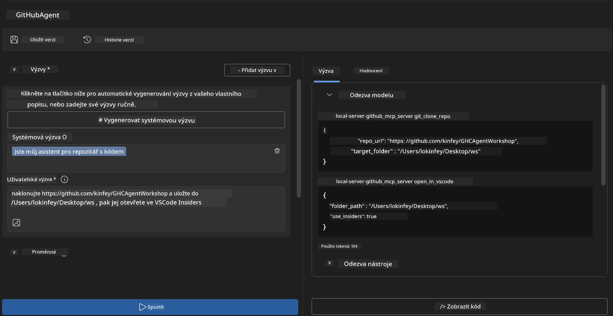
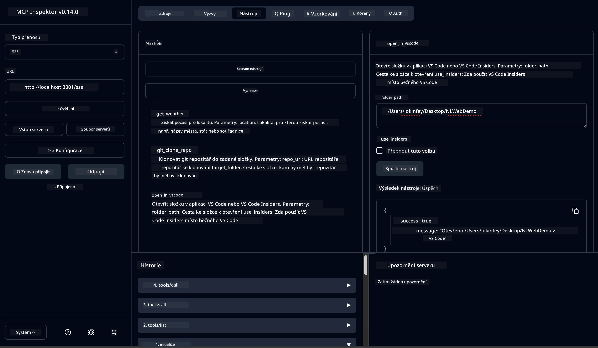

# 🐙 Modul 4: Praktický vývoj MCP – Vlastní server pro klonování GitHubu


> **⚡ Rychlý start:** Vytvořte produkčně připravený MCP server, který automatizuje klonování repozitářů z GitHubu a integraci do VS Code během pouhých 30 minut!

## 🎯 Výukové cíle

Na konci tohoto cvičení budete schopni:

- ✅ Vytvořit vlastní MCP server pro reálné vývojové workflow  
- ✅ Implementovat funkci klonování GitHub repozitářů přes MCP  
- ✅ Integrovat vlastní MCP servery s VS Code a Agent Builderem  
- ✅ Používat režim GitHub Copilot Agenta s vlastními MCP nástroji  
- ✅ Testovat a nasazovat vlastní MCP servery v produkčním prostředí  

## 📋 Požadavky

- Dokončení cvičení 1-3 (základy MCP a pokročilý vývoj)  
- Předplatné GitHub Copilot ([registrace zdarma zde](https://github.com/github-copilot/signup))  
- VS Code s extenzemi AI Toolkit a GitHub Copilot  
- Nainstalovaný a nakonfigurovaný Git CLI  

## 🏗️ Přehled projektu

### **Reálná vývojová výzva**  
Jako vývojáři často používáme GitHub k tomu, abychom klonovali repozitáře a otevírali je ve VS Code nebo VS Code Insiders. Tento manuální proces zahrnuje:  
1. Otevření terminálu/cmd  
2. Navigaci do požadovaného adresáře  
3. Spuštění příkazu `git clone`  
4. Otevření VS Code ve složce s naklonovaným projektem  

**Naše MCP řešení zjednodušuje vše do jediného inteligentního příkazu!**

### **Co vytvoříte**  
**GitHub Clone MCP Server** (`git_mcp_server`), který nabídne:  

| Funkce | Popis | Přínos |
|---------|-------------|---------|
| 🔄 **Chytré klonování repozitářů** | Klonování GitHub repozitářů s validací | Automatická kontrola chyb |
| 📁 **Inteligentní správa adresářů** | Kontrola a bezpečné vytvoření složek | Zabraňuje přepsání |
| 🚀 **Víceplatformní integrace VS Code** | Otevření projektů ve VS Code/Insiders | Plynulý přechod v pracovním toku |
| 🛡️ **Robustní ošetření chyb** | Řešení síťových, oprávnění a cestových problémů | Spolehlivost pro produkční prostředí |

---

## 📖 Postupná implementace

### Krok 1: Vytvoření GitHub agenta v Agent Builderu

1. **Spusťte Agent Builder** přes rozšíření AI Toolkit  
2. **Vytvořte nového agenta** s následující konfigurací:  
   ```
   Agent Name: GitHubAgent
   ```
  
3. **Inicializujte vlastní MCP server:**  
   - Přejděte na **Nástroje** → **Přidat nástroj** → **MCP Server**  
   - Zvolte **„Vytvořit nový MCP server“**  
   - Vyberte **šablonu Python** pro maximální flexibilitu  
   - **Název serveru:** `git_mcp_server`  

### Krok 2: Konfigurace režimu GitHub Copilot Agenta

1. **Otevřete GitHub Copilot** ve VS Code (Ctrl/Cmd + Shift + P → „GitHub Copilot: Open“)  
2. **Vyberte model agenta** v rozhraní Copilota  
3. **Zvolte model Claude 3.7** pro vylepšené schopnosti dedukce  
4. **Povolte integraci MCP** pro přístup k nástrojům  

> **💡 Tip:** Claude 3.7 poskytuje lepší porozumění vývojovým workflow a vzorům ošetření chyb.

### Krok 3: Implementujte základní funkce MCP serveru

**Použijte následující podrobný prompt s GitHub Copilot Agent Mode:**  

```
Create two MCP tools with the following comprehensive requirements:

🔧 TOOL A: clone_repository
Requirements:
- Clone any GitHub repository to a specified local folder
- Return the absolute path of the successfully cloned project
- Implement comprehensive validation:
  ✓ Check if target directory already exists (return error if exists)
  ✓ Validate GitHub URL format (https://github.com/user/repo)
  ✓ Verify git command availability (prompt installation if missing)
  ✓ Handle network connectivity issues
  ✓ Provide clear error messages for all failure scenarios

🚀 TOOL B: open_in_vscode
Requirements:
- Open specified folder in VS Code or VS Code Insiders
- Cross-platform compatibility (Windows/Linux/macOS)
- Use direct application launch (not terminal commands)
- Auto-detect available VS Code installations
- Handle cases where VS Code is not installed
- Provide user-friendly error messages

Additional Requirements:
- Follow MCP 1.9.3 best practices
- Include proper type hints and documentation
- Implement logging for debugging purposes
- Add input validation for all parameters
- Include comprehensive error handling
```
  

### Krok 4: Testování vašeho MCP serveru

#### 4a. Test v Agent Builderu

1. **Spusťte ladicí konfiguraci** pro Agent Builder  
2. **Nakonfigurujte agenta tímto systémovým promptem:**  

```
SYSTEM_PROMPT:
You are my intelligent coding repository assistant. You help developers efficiently clone GitHub repositories and set up their development environment. Always provide clear feedback about operations and handle errors gracefully.
```
  
3. **Testujte realistickými uživatelskými scénáři:**  

```
USER_PROMPT EXAMPLES:

Scenario : Basic Clone and Open
"Clone {Your GitHub Repo link such as https://github.com/kinfey/GHCAgentWorkshop
 } and save to {The global path you specify}, then open it with VS Code Insiders"
```
  


**Očekávané výsledky:**  
- ✅ Úspěšné klonování s potvrzením cesty  
- ✅ Automatické spuštění VS Code  
- ✅ Jasné chybové zprávy pro neplatné scénáře  
- ✅ Správné řešení okrajových případů  

#### 4b. Test v MCP Inspector



---

**🎉 Gratulujeme!** Úspěšně jste vytvořili praktický, produkčně připravený MCP server, který řeší skutečné výzvy ve vývojových workflow. Váš vlastní server pro klonování GitHub repozitářů ukazuje sílu MCP pro automatizaci a zvýšení produktivity vývojářů.

### 🏆 Odemčené úspěchy:  
- ✅ **MCP Developer** – Vytvořeno vlastní MCP server  
- ✅ **Workflow Automator** – Zefektivněné vývojové procesy  
- ✅ **Integration Expert** – Připojení více vývojových nástrojů  
- ✅ **Production Ready** – Postavená řešení připravená k nasazení  

---

## 🎓 Dokončení workshopu: Vaše cesta s Model Context Protocol

**Vážený účastníku workshopu,**

Gratulujeme k dokončení všech čtyř modulů workshopu Model Context Protocol! Ušel jste dlouhou cestu od základů AI Toolkit až po tvorbu produkčně připravených MCP serverů, které řeší reálné vývojové výzvy.

### 🚀 Rekapitulace vaší učební cesty:

**[Modul 1](../lab1/README.md)**: Prozkoumali jste základy AI Toolkit, testování modelů a vytvořili svého prvního AI agenta.

**[Modul 2](../lab2/README.md)**: Naučili jste se architekturu MCP, integrovali Playwright MCP a vytvořili prvního agenta pro automatizaci prohlížeče.

**[Modul 3](../lab3/README.md)**: Pokročili jste ve vývoji vlastních MCP serverů s Weather MCP serverem a osvojili si ladicí nástroje.

**[Modul 4](../lab4/README.md)**: Nyní jste vše aplikovali pro vytvoření praktického nástroje pro automatizaci workflow s GitHub repozitáři.

### 🌟 Co jste ovládli:

- ✅ **Ekosystém AI Toolkit**: Modely, agenti a integrační vzory  
- ✅ **Architektura MCP**: Klient-server design, transportní protokoly a bezpečnost  
- ✅ **Vývojářské nástroje**: Od Playground po Inspector a produkční nasazení  
- ✅ **Vlastní vývoj**: Výstavba, testování a nasazení vlastních MCP serverů  
- ✅ **Praktické aplikace**: Řešení reálných vývojových výzev s AI  

### 🔮 Vaše další kroky:

1. **Vytvořte si vlastní MCP server:** Aplikujte tyto dovednosti k automatizaci svých unikátních workflow  
2. **Připojte se ke komunitě MCP:** Sdílejte své výtvory a učte se od ostatních  
3. **Prozkoumejte pokročilou integraci:** Prepojte MCP servery s podnikový́mi systémy  
4. **Přispívejte do open source:** Pomáhejte zlepšovat nástroje a dokumentaci MCP  

Pamatujte, že tento workshop je teprve začátek. Ekosystém Model Context Protocol se rychle vyvíjí a vy máte nyní šanci být v čele AI-nástrojů pro vývoj.

**Děkujeme za vaši účast a odhodlání učit se!**

Doufáme, že vám workshop přinesl nápady, které změní způsob, jakým tvoříte a pracujete s AI nástroji ve své vývojové cestě.

**Přejeme hodně zdaru při kódování!**

---

## Co dál

Gratulujeme k dokončení všech cvičení modulu 10!

- Zpět na: [Přehled modulu 10](../README.md)  
- Pokračujte na: [Modul 11: Praktická cvičení MCP serveru](../../11-MCPServerHandsOnLabs/README.md)

---

<!-- CO-OP TRANSLATOR DISCLAIMER START -->
**Prohlášení o vyloučení odpovědnosti**:  
Tento dokument byl přeložen pomocí AI překladatelské služby [Co-op Translator](https://github.com/Azure/co-op-translator). I když usilujeme o přesnost, mějte prosím na paměti, že automatizované překlady mohou obsahovat chyby nebo nepřesnosti. Původní dokument v jeho mateřském jazyce by měl být považován za autoritativní zdroj. Pro důležité informace se doporučuje profesionální lidský překlad. Nebudeme nést odpovědnost za jakákoliv nedorozumění nebo nesprávné výklady vyplývající z použití tohoto překladu.
<!-- CO-OP TRANSLATOR DISCLAIMER END -->