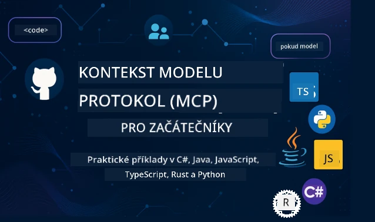

 

[](https://GitHub.com/microsoft/mcp-for-beginners/graphs/contributors)
[](https://GitHub.com/microsoft/mcp-for-beginners/issues)
[](https://GitHub.com/microsoft/mcp-for-beginners/pulls)
[](http://makeapullrequest.com)

[](https://GitHub.com/microsoft/mcp-for-beginners/watchers)
[](https://GitHub.com/microsoft/mcp-for-beginners/fork)
[](https://GitHub.com/microsoft/mcp-for-beginners/stargazers)


[](https://discord.gg/nTYy5BXMWG)

Postupujte podle těchto kroků, abyste začali používat tyto zdroje:
1. **Vytvořte fork repozitáře**: Klikněte na [](https://GitHub.com/microsoft/mcp-for-beginners/fork)
2. **Klonujte repozitář**:   `git clone https://github.com/microsoft/mcp-for-beginners.git`
3. **Připojte se k** [](https://discord.gg/nTYy5BXMWG)


### 🌐 Podpora více jazyků

#### Podporováno pomocí GitHub Action (automatizované a vždy aktuální)

<!-- CO-OP TRANSLATOR LANGUAGES TABLE START -->
[Arabština](../ar/README.md) | [Bengálština](../bn/README.md) | [Bulharština](../bg/README.md) | [Barmština (Myanmar)](../my/README.md) | [Čínština (zjednodušená)](../zh-CN/README.md) | [Čínština (tradiční, Hong Kong)](../zh-HK/README.md) | [Čínština (tradiční, Macau)](../zh-MO/README.md) | [Čínština (tradiční, Taiwan)](../zh-TW/README.md) | [Chorvatština](../hr/README.md) | [Čeština](./README.md) | [Dánština](../da/README.md) | [Nizozemština](../nl/README.md) | [Estonština](../et/README.md) | [Finština](../fi/README.md) | [Francouzština](../fr/README.md) | [Němčina](../de/README.md) | [Řečtina](../el/README.md) | [Hebrejština](../he/README.md) | [Hindština](../hi/README.md) | [Maďarština](../hu/README.md) | [Indonéština](../id/README.md) | [Italština](../it/README.md) | [Japanština](../ja/README.md) | [Kannadština](../kn/README.md) | [Korejština](../ko/README.md) | [Litevština](../lt/README.md) | [Malajština](../ms/README.md) | [Malajálam](../ml/README.md) | [Maráthština](../mr/README.md) | [Nepálština](../ne/README.md) | [Nigerijská pidžinština](../pcm/README.md) | [Norština](../no/README.md) | [Perština (Farsi)](../fa/README.md) | [Polština](../pl/README.md) | [Portugalština (Brazílie)](../pt-BR/README.md) | [Portugalština (Portugalsko)](../pt-PT/README.md) | [Paňdžábština (Gurmuchi)](../pa/README.md) | [Rumunština](../ro/README.md) | [Ruština](../ru/README.md) | [Srbština (cyrilice)](../sr/README.md) | [Slovenština](../sk/README.md) | [Slovinština](../sl/README.md) | [Španělština](../es/README.md) | [Svahilština](../sw/README.md) | [Švédština](../sv/README.md) | [Tagalog (Filipino)](../tl/README.md) | [Tamilština](../ta/README.md) | [Telugština](../te/README.md) | [Thajština](../th/README.md) | [Turečtina](../tr/README.md) | [Ukrajinština](../uk/README.md) | [Urdština](../ur/README.md) | [Vietnamština](../vi/README.md)

> **Raději klonovat lokálně?**
>
> Tento repozitář obsahuje přes 50 překladů jazyků, což výrazně zvětšuje velikost stahování. Pro klonování bez překladů použijte sparse checkout:
>
> **Bash / macOS / Linux:**
> ```bash
> git clone --filter=blob:none --sparse https://github.com/microsoft/mcp-for-beginners.git
> cd mcp-for-beginners
> git sparse-checkout set --no-cone '/*' '!translations' '!translated_images'
> ```
>
> **CMD (Windows):**
> ```cmd
> git clone --filter=blob:none --sparse https://github.com/microsoft/mcp-for-beginners.git
> cd mcp-for-beginners
> git sparse-checkout set --no-cone "/*" "!translations" "!translated_images"
> ```
>
> Tím získáte vše potřebné pro dokončení kurzu se mnohem rychlejším stahováním.
<!-- CO-OP TRANSLATOR LANGUAGES TABLE END -->

# 🚀 Kurikulum Model Context Protocol (MCP) pro začátečníky

## **Naučte se MCP s praktickými příklady kódu v C#, Java, JavaScript, Rust, Python a TypeScript**

## 🧠 Přehled kurikula Model Context Protocol
Vítejte na vaší cestě do Model Context Protocol! Pokud jste se někdy zamýšleli nad tím, jak AI aplikace komunikují s různými nástroji a službami, právě se chystáte objevit elegantní řešení, které mění způsob, jakým vývojáři vytvářejí inteligentní systémy.

Představte si MCP jako univerzální překladač pro AI aplikace – podobně jako USB porty umožňují připojit jakékoli zařízení k počítači, MCP umožňuje AI modelům připojit se ke kterémukoli nástroji nebo službě standardizovaným způsobem. Ať už stavíte svého prvního chatbota, nebo pracujete na složitých AI pracovních postupech, pochopení MCP vám dá sílu vytvářet schopnější a flexibilnější aplikace.

Toto kurikulum je navrženo s trpělivostí a péčí pro vaši učební cestu. Začneme s jednoduchými koncepty, které už znáte, a postupně rozvíjíme vaše odborné znalosti prostřednictvím praktických cvičení v oblíbeném programovacím jazyce. Každý krok obsahuje jasná vysvětlení, praktické příklady a spoustu povzbuzení na cestě.

Až dokončíte tuto cestu, budete mít důvěru budovat vlastní MCP servery, integrovat je s populárními AI platformami a porozumět tomu, jak tato technologie přetváří budoucnost vývoje AI. Pojďme společně začít toto vzrušující dobrodružství!

### Oficiální dokumentace a specifikace

Toto kurikulum je sladěno s **specifikací MCP 2025-11-25** (aktuální stabilní verze). Specifikace MCP používá verze založené na datu (formát RRRR-MM-DD), aby bylo zajištěno jasné sledování verzí protokolu.

Tyto zdroje se stanou cennějšími, jak poroste vaše pochopení, ale necítíte se pod tlakem číst vše najednou. Začněte oblastmi, které vás zajímají nejvíce!
- 📘 [MCP Dokumentace](https://modelcontextprotocol.io/) – Toto je váš hlavní zdroj pro krok za krokem návody a uživatelské příručky. Dokumentace je napsána s ohledem na začátečníky a poskytuje jasné příklady, které můžete sledovat vlastním tempem.
- 📜 [Specifikace MCP](https://modelcontextprotocol.io/specification/2025-11-25) – Považujte to za svůj komplexní referenční manuál. Během práce s kurikulem se sem budete vracet pro hledání specifických detailů a zkoumání pokročilých funkcí.
- 📜 [Verzování specifikace MCP](https://modelcontextprotocol.io/specification/versioning) – Obsahuje informace o historii verzí protokolu a jak MCP používá verze založené na datu (formát RRRR-MM-DD).
- 🧑‍💻 [GitHub repozitář MCP](https://github.com/modelcontextprotocol) – Zde najdete SDK, nástroje a ukázky kódu v několika programovacích jazycích. Je to vlastně pokladnice praktických příkladů a připravených komponent.
- 🌐 [Komunita MCP](https://github.com/orgs/modelcontextprotocol/discussions) – Připojte se k ostatním studentům a zkušeným vývojářům v diskuzích o MCP. Je to podpůrná komunita, kde jsou otázky vítány a znalosti se volně sdílejí.
  
## Cíle učení

Na konci tohoto kurikula se budete cítit sebejistě a nadšeně ze svých nových schopností. Zde je to, čeho dosáhnete:

• **Pochopit základy MCP**: Pochopíte, co je Model Context Protocol a proč mění způsob, jak AI aplikace spolupracují, pomocí analogií a příkladů, které dávají smysl.

• **Vytvořit svůj první MCP server**: Vytvoříte funkční MCP server ve vámi zvoleném programovacím jazyce, začnete s jednoduchými příklady a krok za krokem rozvíjíte své dovednosti.

• **Propojit AI modely s reálnými nástroji**: Naučíte se, jak překlenout mezeru mezi AI modely a skutečnými službami, což dává vašim aplikacím nové mocné schopnosti.

• **Implementovat bezpečnostní nejlepší praktiky**: Porozumíte, jak udržet vaše MCP implementace bezpečné, chránit své aplikace i uživatele.

• **Nasazovat s jistotou**: Budete vědět, jak přenést MCP projekty z vývoje do produkce s praktickými strategiemi nasazení, které fungují v reálném světě.

• **Připojit se ke komunitě MCP**: Stanete se součástí rostoucí komunity vývojářů, kteří formují budoucnost vývoje AI aplikací.

## Základní znalosti

Než se ponoříme do detailů MCP, ujistíme se, že se cítíte komfortně s některými základními koncepty. Nebojte se, pokud v těchto oblastech nejste odborník – všechno potřebné vysvětlíme za pochodu!

### Pochopení protokolů (základ)

Představte si protokol jako pravidla pro konverzaci. Když voláte příteli, oba víte, že když zvednete telefon, řeknete „ahoj“, mluvíte po sobě a na konci řeknete „nashledanou“. Počítačové programy potřebují podobná pravidla, aby mohly efektivně komunikovat.

MCP je protokol – soubor dohodnutých pravidel, která pomáhají AI modelům a aplikacím vést produktivní „konverzace“ s nástroji a službami. Stejně jako pravidla konverzace usnadňují lidskou komunikaci, MCP dělá komunikaci AI aplikací spolehlivější a mocnější.

### Vztahy klient-server (jak spolu programy spolupracují)

Používáte vztahy klient-server každý den! Když používáte webový prohlížeč (klient) a navštívíte webovou stránku, jste připojeni k webovému serveru, který vám stránku doručí. Prohlížeč ví, jak požádat o informace, a server ví, jak reagovat.

V MCP máme podobný vztah: AI modely fungují jako klienti, kteří žádají o informace nebo akce, zatímco MCP servery tyto schopnosti poskytují. Je to jako mít pomocníka (server), kterého se AI může zeptat, aby provedl konkrétní úkoly.

### Proč standardizace záleží (jak věci fungují společně)

Představte si, kdyby každý výrobce aut používal jinak tvarované benzínové nástavce – museli byste pro každé auto jiný adaptér! Standardizace znamená dohodnout se na společných přístupech, aby věci fungovaly bez problémů.

MCP poskytuje tuto standardizaci pro AI aplikace. Místo aby každý AI model potřeboval vlastní kód pro každý nástroj, MCP vytváří univerzální způsob komunikace. To znamená, že vývojáři mohou vytvořit nástroj jednou a ten bude fungovat s mnoha různými AI systémy.

## 🧭 Přehled vaší učební cesty

Vaše cesta MCP je pečlivě strukturovaná, aby postupně budovala vaši důvěru a schopnosti. Každá fáze představuje nové koncepty a zároveň upevňuje to, co jste se už naučili.

### 🌱 Základní fáze: Pochopení základů (moduly 0-2)

Tady začíná vaše dobrodružství! Seznámíme vás s koncepty MCP pomocí známých analogií a jednoduchých příkladů. Porozumíte, co MCP je, proč existuje a jak zapadá do širšího světa vývoje AI.

• **Modul 0 – Úvod do MCP**: Začneme tím, že prozkoumáme, co je MCP a proč je tak důležitý pro moderní AI aplikace. Uvidíte reálné příklady MCP v akci a pochopíte, jak řeší běžné problémy, se kterými se vývojáři potýkají.

• **Modul 1 – Vysvětlení základních pojmů**: Naučíte se základní stavební kameny MCP. Použijeme spoustu analogií a vizuálních příkladů, aby tyto koncepty byly přirozené a pochopitelné.

• **Modul 2 – Bezpečnost v MCP**: Bezpečnost může znít zastrašujícím dojmem, ale ukážeme vám, jak MCP obsahuje vestavěné bezpečnostní funkce, a naučíme vás nejlepší postupy na ochranu vašich aplikací od samého začátku.

### 🔨 Fáze budování: Vytváření prvních implementací (modul 3)

Teď začíná ta pravá zábava! Získáte praktické zkušenosti s tvorbou skutečných MCP serverů a klientů. Nebojte se – začneme jednoduše a provedeme vás každým krokem.
Tento modul obsahuje několik praktických průvodců, které vám umožní procvičovat ve vašem oblíbeném programovacím jazyce. Vytvoříte svůj první server, sestavíte klienta pro jeho připojení a dokonce integrujete s populárními vývojovými nástroji jako VS Code.

Každý průvodce obsahuje kompletní příklady kódu, tipy pro řešení problémů a vysvětlení, proč volíme konkrétní designová řešení. Na konci této fáze budete mít funkční implementace MCP, na které můžete být hrdí!

### 🚀 Fáze růstu: Pokročilé koncepty a reálné použití (moduly 4-5)

Po zvládnutí základů jste připraveni prozkoumat pokročilejší funkce MCP. Projdeme praktické strategie implementace, techniky ladění a pokročelá témata jako multimodální AI integrace.

Také se naučíte, jak škálovat vaše MCP implementace pro produkční použití a integrovat je s cloudovými platformami jako Azure. Tyto moduly vás připraví na stavbu MCP řešení, která zvládnou požadavky reálného světa.

### 🌟 Fáze mistrovství: Komunita a specializace (moduly 6-11)

Závěrečná fáze se zaměřuje na připojení ke komunitě MCP a specializaci v oblastech, které vás zajímají nejvíce. Naučíte se, jak přispívat do open-source MCP projektů, implementovat pokročilé vzory autentizace a stavět komplexní řešení integrovaná s databázemi.

Modul 11 zasluhuje zvláštní zmínku – je to kompletní 13-laboratorní praktická cesta, která vás naučí stavět produkčně připravené MCP servery s integrací PostgreSQL. Je to jako závěrečný projekt, který shrnuje vše, co jste se naučili!

### 📚 Kompletní struktura učebního plánu

| Modul | Téma | Popis | Odkaz |
|--------|-------|-------------|------|
| **Moduly 0-3: Základy** | | | |
| 00 | Úvod do MCP | Přehled Model Context Protocol a jeho význam v AI pipelinech | [Číst více](./00-Introduction/README.md) |
| 01 | Vysvětlení základních konceptů | Hloubkový průzkum základních konceptů MCP | [Číst více](./01-CoreConcepts/README.md) |
| 02 | Bezpečnost v MCP | Hrozby bezpečnosti a osvědčené postupy | [Číst více](./02-Security/README.md) |
| 03 | Začínáme s MCP | Nastavení prostředí, základní servery/klienti, integrace | [Číst více](./03-GettingStarted/README.md) |
| **Modul 3: Vytvoření prvního serveru a klienta** | | | |
| 3.1 | První server | Vytvořte svůj první MCP server | [Průvodce](./03-GettingStarted/01-first-server/README.md) |
| 3.2 | První klient | Vyvíjejte základního MCP klienta | [Průvodce](./03-GettingStarted/02-client/README.md) |
| 3.3 | Klient s LLM | Integrace velkých jazykových modelů | [Průvodce](./03-GettingStarted/03-llm-client/README.md) |
| 3.4 | Integrace VS Code | Používání MCP serverů ve VS Code | [Průvodce](./03-GettingStarted/04-vscode/README.md) |
| 3.5 | stdio server | Vytváření serverů pomocí stdio transportu | [Průvodce](./03-GettingStarted/05-stdio-server/README.md) |
| 3.6 | HTTP streamování | Implementace HTTP streamování v MCP | [Průvodce](./03-GettingStarted/06-http-streaming/README.md) |
| 3.7 | AI Toolkit | Použití AI Toolkit s MCP | [Průvodce](./03-GettingStarted/07-aitk/README.md) |
| 3.8 | Testování | Testování implementace MCP serveru | [Průvodce](./03-GettingStarted/08-testing/README.md) |
| 3.9 | Nasazení | Nasazení MCP serverů do produkce | [Průvodce](./03-GettingStarted/09-deployment/README.md) |
| 3.10 | Pokročilé využití serveru | Použití pokročilých serverů pro rozšířené funkce a lepší architekturu | [Průvodce](./03-GettingStarted/10-advanced/README.md) |
| 3.11 | Jednoduchá autentizace | Kapitola ukazující autentizaci od začátku a RBAC | [Průvodce](./03-GettingStarted/11-simple-auth/README.md) |
| 3.12 | MCP hostitelé | Konfigurace Claude Desktop, Cursor, Cline a dalších MCP hostitelů | [Průvodce](./03-GettingStarted/12-mcp-hosts/README.md) |
| 3.13 | MCP Inspector | Ladění a testování MCP serverů s nástrojem Inspector | [Průvodce](./03-GettingStarted/13-mcp-inspector/README.md) |
| **Moduly 4-5: Praktické a pokročilé** | | | |
| 04 | Praktická implementace | SDK, ladění, testování, znovupoužitelné šablony promptů | [Číst více](./04-PracticalImplementation/README.md) |
| 4.1 | Stránkování | Práce s velkými výslednými sadami pomocí stránkování na základě kurzoru | [Průvodce](./04-PracticalImplementation/pagination/README.md) |
| 05 | Pokročilá témata v MCP | Multimodální AI, škálování, podnikové použití | [Číst více](./05-AdvancedTopics/README.md) |
| 5.1 | Integrace Azure | MCP integrace s Azure | [Průvodce](./05-AdvancedTopics/mcp-integration/README.md) |
| 5.2 | Multimodalita | Práce s více modalitami | [Průvodce](./05-AdvancedTopics/mcp-multi-modality/README.md) |
| 5.3 | Demo OAuth2 | Implementace OAuth2 autentizace | [Průvodce](./05-AdvancedTopics/mcp-oauth2-demo/README.md) |
| 5.4 | Root kontexty | Porozumění a implementace root kontextů | [Průvodce](./05-AdvancedTopics/mcp-root-contexts/README.md) |
| 5.5 | Směrování | Strategie směrování MCP | [Průvodce](./05-AdvancedTopics/mcp-routing/README.md) |
| 5.6 | Vzorkování | Techniky vzorkování v MCP | [Průvodce](./05-AdvancedTopics/mcp-sampling/README.md) |
| 5.7 | Škálování | Škálování MCP implementací | [Průvodce](./05-AdvancedTopics/mcp-scaling/README.md) |
| 5.8 | Bezpečnost | Pokročilé bezpečnostní aspekty | [Průvodce](./05-AdvancedTopics/mcp-security/README.md) |
| 5.9 | Webové vyhledávání | Implementace webového vyhledávání | [Průvodce](./05-AdvancedTopics/web-search-mcp/README.md) |
| 5.10 | Realtime streaming | Budování funkčnosti realtime streamování | [Průvodce](./05-AdvancedTopics/mcp-realtimestreaming/README.md) |
| 5.11 | Realtime vyhledávání | Implementace realtime vyhledávání | [Průvodce](./05-AdvancedTopics/mcp-realtimesearch/README.md) |
| 5.12 | Autentizace Entra ID | Autentizace s Microsoft Entra ID | [Průvodce](./05-AdvancedTopics/mcp-security-entra/README.md) |
| 5.13 | Integrace Foundry | Integrace s Azure AI Foundry | [Průvodce](./05-AdvancedTopics/mcp-foundry-agent-integration/README.md) |
| 5.14 | Inženýrství kontextu | Techniky efektivního inženýrství kontextů | [Průvodce](./05-AdvancedTopics/mcp-contextengineering/README.md) |
| 5.15 | Vlastní transport MCP | Implementace vlastních transportů | [Průvodce](./05-AdvancedTopics/mcp-transport/README.md) |
| 5.16 | Funkce protokolu | Notifikace o pokroku, zrušení, šablony zdrojů | [Průvodce](./05-AdvancedTopics/mcp-protocol-features/README.md) |
| **Moduly 6-10: Komunita a osvědčené postupy** | | | |
| 06 | Příspěvky komunity | Jak přispívat do ekosystému MCP | [Průvodce](./06-CommunityContributions/README.md) |
| 07 | Zkušenosti z raného přijetí | Příběhy reálných implementací | [Průvodce](./07-LessonsfromEarlyAdoption/README.md) |
| 08 | Osvědčené postupy MCP | Výkon, odolnost vůči chybám, rezilience | [Průvodce](./08-BestPractices/README.md) |
| 09 | Případové studie MCP | Praktické příklady implementací | [Průvodce](./09-CaseStudy/README.md) |
| 10 | Praktický workshop | Stavba MCP serveru s AI Toolkit | [Laboratoř](./10-StreamliningAIWorkflowsBuildingAnMCPServerWithAIToolkit/README.md) |
| **Modul 11: MCP Server Hands On Laboratoř** | | | |
| 11 | Integrace MCP serveru s databází | Komplexní 13-laboratorní praktická cesta pro integraci PostgreSQL | [Laboratoře](./11-MCPServerHandsOnLabs/README.md) |
| 11.1 | Úvod | Přehled MCP s databázovou integrací a retail analytický případ užití | [Laboratoř 00](./11-MCPServerHandsOnLabs/00-Introduction/README.md) |
| 11.2 | Základní architektura | Porozumění architektuře MCP serveru, databázovým vrstvám a bezpečnostním vzorům | [Laboratoř 01](./11-MCPServerHandsOnLabs/01-Architecture/README.md) |
| 11.3 | Bezpečnost a multi-tenancy | Row Level Security, autentizace, přístup k datům pro více tenantů | [Laboratoř 02](./11-MCPServerHandsOnLabs/02-Security/README.md) |
| 11.4 | Nastavení prostředí | Nastavení vývojového prostředí, Docker, Azure zdroje | [Laboratoř 03](./11-MCPServerHandsOnLabs/03-Setup/README.md) |
| 11.5 | Návrh databáze | Nastavení PostgreSQL, návrh retail schématu a ukázková data | [Laboratoř 04](./11-MCPServerHandsOnLabs/04-Database/README.md) |
| 11.6 | Implementace MCP serveru | Stavba FastMCP serveru s databázovou integrací | [Laboratoř 05](./11-MCPServerHandsOnLabs/05-MCP-Server/README.md) |
| 11.7 | Vývoj nástrojů | Vytváření nástrojů pro databázové dotazy a introspekci schématu | [Laboratoř 06](./11-MCPServerHandsOnLabs/06-Tools/README.md) |
| 11.8 | Sémantické vyhledávání | Implementace vektorových embeddingů s Azure OpenAI a pgvector | [Laboratoř 07](./11-MCPServerHandsOnLabs/07-Semantic-Search/README.md) |
| 11.9 | Testování a ladění | Testovací strategie, nástroje pro ladění a ověřovací přístupy | [Laboratoř 08](./11-MCPServerHandsOnLabs/08-Testing/README.md) |
| 11.10 | Integrace VS Code | Konfigurace MCP integrace ve VS Code a používání AI Chat | [Laboratoř 09](./11-MCPServerHandsOnLabs/09-VS-Code/README.md) |
| 11.11 | Strategie nasazení | Nasazení Docker, Azure Container Apps a úvahy o škálování | [Laboratoř 10](./11-MCPServerHandsOnLabs/10-Deployment/README.md) |
| 11.12 | Monitorování | Application Insights, logování, monitorování výkonu | [Laboratoř 11](./11-MCPServerHandsOnLabs/11-Monitoring/README.md) |
| 11.13 | Osvědčené postupy | Optimalizace výkonu, zpevnění bezpečnosti a tipy pro produkční provoz | [Laboratoř 12](./11-MCPServerHandsOnLabs/12-Best-Practices/README.md) |

### 💻 Ukázkové projekty kódu

Jedna z nejzajímavějších částí učení MCP je sledovat, jak se vaše dovednosti v kódování postupně rozvíjejí. Naše příklady kódu jsou navrženy tak, aby začínaly jednoduše a postupně přecházely k sofistikovanějším ukázkám podle toho, jak prohlubujete své porozumění. Takto představujeme koncepty - s kódem, který je snadno pochopitelný, ale zároveň demonstruje reálné principy MCP, budete rozumět nejen tomu, co tento kód dělá, ale i proč je takto strukturován a jak zapadá do větších MCP aplikací.

#### Základní ukázky MCP kalkulačky

| Jazyk | Popis | Odkaz |
|----------|-------------|------|
| C# | Příklad MCP serveru | [Zobrazit kód](./03-GettingStarted/samples/csharp/README.md) |
| Java | MCP kalkulačka | [Zobrazit kód](./03-GettingStarted/samples/java/calculator/README.md) |
| JavaScript | MCP demo | [Zobrazit kód](./03-GettingStarted/samples/javascript/README.md) |
| Python | MCP server | [Zobrazit kód](../../03-GettingStarted/samples/python/mcp_calculator_server.py) |
| TypeScript | MCP příklad | [Zobrazit kód](./03-GettingStarted/samples/typescript/README.md) |
| Rust | MCP příklad | [Zobrazit kód](./03-GettingStarted/samples/rust/README.md) |

#### Pokročilé MCP implementace

| Jazyk | Popis | Odkaz |
|----------|-------------|------|
| C# | Pokročilý příklad | [Zobrazit kód](./04-PracticalImplementation/samples/csharp/README.md) |
| Java se Springem | Příklad kontejnerové aplikace | [Zobrazit kód](./04-PracticalImplementation/samples/java/containerapp/README.md) |
| JavaScript | Pokročilý příklad | [Zobrazit kód](./04-PracticalImplementation/samples/javascript/README.md) |
| Python | Složitá implementace | [Zobrazit kód](./04-PracticalImplementation/samples/python/README.md) |
| TypeScript | Kontejnerový příklad | [Zobrazit kód](./04-PracticalImplementation/samples/typescript/README.md) |


## 🎯 Předpoklady pro učení MCP

Aby vám tento učební plán přinesl co nejvíce, měli byste mít:

- Základní znalosti programování alespoň v jednom z následujících jazyků: C#, Java, JavaScript, Python nebo TypeScript
- Pochopení modelu klient-server a API
- Znalost konceptů REST a HTTP
- (Volitelné) Základní znalosti AI/ML konceptů

- Účast v diskuzích naší komunity pro podporu

## 📚 Studijní průvodce a zdroje

Tento repozitář obsahuje několik zdrojů, které vám pomohou efektivně se orientovat a učit: 

### Studijní průvodce
Komplexní [Studijní průvodce](./study_guide.md) je k dispozici, aby vám pomohl efektivně se orientovat v tomto repozitáři. Tento vizuální mapový plán kurikula ukazuje, jak jsou všechny témata propojena, a poskytuje návod, jak efektivně využívat ukázkové projekty. Je to zvláště užitečné, pokud jste vizuální učenec a rádi vidíte širší souvislosti.

Průvodce obsahuje:
- Vizuální mapu kurikula zobrazující všechna probíraná témata
- Podrobný rozpis jednotlivých částí repozitáře
- Návod, jak používat ukázkové projekty
- Doporučené učební cesty pro různé úrovně dovedností
- Další zdroje k doplnění vašeho učebního procesu

### Změny v kurikulu

Udržujeme podrobný [Záznam změn](./changelog.md), který sleduje všechny významné aktualizace materiálů kurikula, abyste mohli být vždy informováni o nejnovějších vylepšeních a doplňcích.
- Přidání nového obsahu
- Strukturální změny
- Vylepšení funkcí
- Aktualizace dokumentace

## 🛠️ Jak efektivně používat toto kurikulum

Každá lekce v tomto průvodci obsahuje:

1. Jasná vysvětlení konceptů MCP  
2. Živé ukázky kódu v několika jazycích  
3. Cvičení na tvorbu skutečných MCP aplikací  
4. Dodatečné zdroje pro pokročilé studenty

### Naučme se MCP s C# - série tutoriálů
Naučíme se o Model Context Protocol (MCP), moderním rámci navrženém ke standardizaci interakcí mezi AI modely a klientskými aplikacemi. V této přívětivé úvodní lekci vás seznámíme s MCP a provedeme vás vytvořením vašeho prvního MCP serveru.
#### C#: [https://aka.ms/letslearnmcp-csharp](https://aka.ms/letslearnmcp-csharp)
#### Java: [https://aka.ms/letslearnmcp-java](https://aka.ms/letslearnmcp-java)
#### JavaScript: [https://aka.ms/letslearnmcp-javascript](https://aka.ms/letslearnmcp-javascript)
#### Python: [https://aka.ms/letslearnmcp-python](https://aka.ms/letslearnmcp-python)

## 🎓 Vaše cesta k MCP začíná

Gratulujeme! Právě jste udělali první krok na vzrušující cestě, která rozšíří vaše programátorské schopnosti a spojí vás s nejmodernějšími trendy ve vývoji AI.

### Co jste již dokázali

Pročtením tohoto úvodu jste již začali budovat základy svých znalostí MCP. Rozumíte, co MCP je, proč je důležité, a jak vám toto kurikulum pomůže během učení. To je významný úspěch a začátek vaší odbornosti v této důležité technologii.

### Dobrodružství před vámi

Jak budete postupovat jednotlivými moduly, pamatujte, že každý expert byl jednou začátečník. Koncepty, které se teď mohou zdát složité, se stanou přirozenými, jakmile je budete procvičovat a aplikovat. Každý malý krok buduje silné schopnosti, které vám poslouží během celé vaší vývojářské kariéry.

### Vaše podpůrná síť

Připojujete se ke komunitě učících se a odborníků, kteří jsou nadšení pro MCP a ochotní pomáhat ostatním uspět. Ať už jste uvízli na programátorské výzvě, nebo chcete sdílet průlomový objev, komunita je tu, aby vás podpořila na vaší cestě.

Pokud narazíte na problémy nebo máte dotazy ohledně vytváření AI aplikací, připojte se ke spolužákům a zkušeným vývojářům v diskusích o MCP. Je to podpůrná komunita, kde jsou otázky vítány a znalosti jsou volně sdíleny.

[](https://discord.gg/nTYy5BXMWG)

Pokud máte zpětnou vazbu k produktu nebo narazíte na chyby při vývoji, navštivte:

[](https://aka.ms/foundry/forum)

### Připravení začít?

Vaše MCP dobrodružství začíná nyní! Začněte Modul 0 a ponořte se do prvních praktických zkušeností s MCP, nebo prozkoumejte ukázkové projekty a zjistěte, co budete vytvářet. Pamatujte - každý expert začínal přesně tam, kde jste vy, a s trpělivostí a praxí budete ohromeni, čeho můžete dosáhnout.

Vítejte ve světě vývoje Model Context Protocol. Postavme spolu něco úžasného!

## 🤝 Přispívání do učební komunity

Toto kurikulum sílí díky příspěvkům od studentů jako jste vy! Ať už opravujete překlep, navrhujete jasnější vysvětlení nebo přidáváte nový příklad, vaše příspěvky pomáhají ostatním začátečníkům uspět.

Díky Microsoft Valued Professional [Shivam Goyal](https://www.linkedin.com/in/shivam2003/) za příspěvek vzorových kódů.

Proces přispívání je navržen tak, aby byl přívětivý a podporující. Většina příspěvků vyžaduje Dohodu o licenci přispěvatele (CLA), ale automatizované nástroje vás bezpečně provedou celým procesem.

## 📜 Open Source učení

Celé toto kurikulum je dostupné pod MIT [LICENCÍ](../../LICENSE), což znamená, že jej můžete svobodně používat, upravovat a sdílet. Podporuje to naši misi zpřístupnit znalosti MCP vývojářům po celém světě.
## 🤝 Pokyny pro přispívání

Tento projekt vítá příspěvky a návrhy. Většina příspěvků vyžaduje souhlas s
Dohodou o licenci přispěvatele (CLA), která potvrzuje, že máte právo a skutečně nám
udělujete práva používat váš příspěvek. Pro detaily navštivte <https://cla.opensource.microsoft.com>.

Při odeslání pull requestu automatický CLA bot zjistí, zda musíte poskytnout
CLA a označí PR podle potřeby (např. kontrola stavu, komentář). Postupujte jednoduše podle instrukcí
bota. To budete muset udělat pouze jednou pro všechny repozitáře s naší CLA.

Tento projekt přijal [Microsoft Open Source Code of Conduct](https://opensource.microsoft.com/codeofconduct/).
Pro více informací si přečtěte [Často kladené otázky k pravidlům chování](https://opensource.microsoft.com/codeofconduct/faq/) nebo
kontaktujte [opencode@microsoft.com](mailto:opencode@microsoft.com) s dalšími dotazy či připomínkami.

---

*Připravení zahájit svou cestu MCP? Začněte s [Modulem 00 - Úvod do MCP](./00-Introduction/README.md) a udělejte první kroky ve světě vývoje Model Context Protocol!*

 

## 🎒 Další kurzy
Náš tým nabízí i další kurzy! Podívejte se na:

<!-- CO-OP TRANSLATOR OTHER COURSES START -->
### LangChain
[](https://aka.ms/langchain4j-for-beginners)
[](https://aka.ms/langchainjs-for-beginners?WT.mc_id=m365-94501-dwahlin)
[](https://github.com/microsoft/langchain-for-beginners?WT.mc_id=m365-94501-dwahlin)
---

### Azure / Edge / MCP / Agentky
[](https://github.com/microsoft/AZD-for-beginners?WT.mc_id=academic-105485-koreyst)
[](https://github.com/microsoft/edgeai-for-beginners?WT.mc_id=academic-105485-koreyst)
[](https://github.com/microsoft/mcp-for-beginners?WT.mc_id=academic-105485-koreyst)
[](https://github.com/microsoft/ai-agents-for-beginners?WT.mc_id=academic-105485-koreyst)

---
 
### Série Generativní AI
[](https://github.com/microsoft/generative-ai-for-beginners?WT.mc_id=academic-105485-koreyst)
[-9333EA?style=for-the-badge&labelColor=E5E7EB&color=9333EA)](https://github.com/microsoft/Generative-AI-for-beginners-dotnet?WT.mc_id=academic-105485-koreyst)
[-C084FC?style=for-the-badge&labelColor=E5E7EB&color=C084FC)](https://github.com/microsoft/generative-ai-for-beginners-java?WT.mc_id=academic-105485-koreyst)
[-E879F9?style=for-the-badge&labelColor=E5E7EB&color=E879F9)](https://github.com/microsoft/generative-ai-with-javascript?WT.mc_id=academic-105485-koreyst)

---
 
### Základní učení
[](https://aka.ms/ml-beginners?WT.mc_id=academic-105485-koreyst)
[](https://aka.ms/datascience-beginners?WT.mc_id=academic-105485-koreyst)
[](https://aka.ms/ai-beginners?WT.mc_id=academic-105485-koreyst)
[](https://github.com/microsoft/Security-101?WT.mc_id=academic-96948-sayoung)
[](https://aka.ms/webdev-beginners?WT.mc_id=academic-105485-koreyst)
[](https://aka.ms/iot-beginners?WT.mc_id=academic-105485-koreyst)
[](https://github.com/microsoft/xr-development-for-beginners?WT.mc_id=academic-105485-koreyst)

---
 
### Série Copilot
[](https://aka.ms/GitHubCopilotAI?WT.mc_id=academic-105485-koreyst)
[](https://github.com/microsoft/mastering-github-copilot-for-dotnet-csharp-developers?WT.mc_id=academic-105485-koreyst)
[](https://github.com/microsoft/CopilotAdventures?WT.mc_id=academic-105485-koreyst)
<!-- CO-OP TRANSLATOR OTHER COURSES END -->

---

<!-- CO-OP TRANSLATOR DISCLAIMER START -->
**Prohlášení o vyloučení odpovědnosti**:
Tento dokument byl přeložen pomocí AI překladatelské služby [Co-op Translator](https://github.com/Azure/co-op-translator). Přestože usilujeme o přesnost, mějte prosím na paměti, že automatizované překlady mohou obsahovat chyby nebo nepřesnosti. Původní dokument v jeho mateřském jazyce by měl být považován za autoritativní zdroj. Pro zásadní informace se doporučuje odborný lidský překlad. Nejsme odpovědní za žádné nedorozumění nebo nesprávné výklady vyplývající z používání tohoto překladu.
<!-- CO-OP TRANSLATOR DISCLAIMER END -->