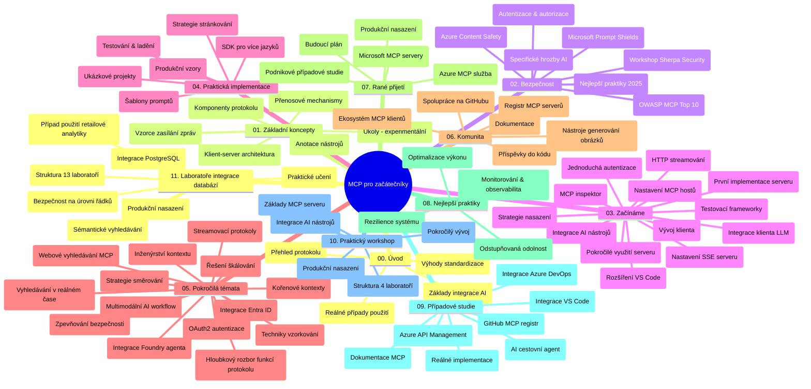

# Model Context Protocol (MCP) pro začátečníky – studijní průvodce

Tento studijní průvodce poskytuje přehled struktury a obsahu repozitáře pro kurz „Model Context Protocol (MCP) pro začátečníky“. Použijte tento průvodce k efektivní orientaci v repozitáři a plnému využití dostupných zdrojů.

## Přehled repozitáře

Model Context Protocol (MCP) je standardizovaný rámec pro interakce mezi AI modely a klientskými aplikacemi. Původně vytvořený společností Anthropic je MCP nyní udržován širší komunitou MCP prostřednictvím oficiální organizace na GitHubu. Tento repozitář nabízí komplexní kurz s praktickými příklady kódu v C#, Java, JavaScriptu, Pythonu a TypeScriptu, navržený pro vývojáře AI, systémové architekty a softwarové inženýry.

## Vizualizace kurikula

## Struktura repozitáře

Repozitář je rozčleněn do jedenácti hlavních sekcí, z nichž každá se zaměřuje na různé aspekty MCP:

1. **Úvod (00-Introduction/)**
   - Přehled Model Context Protocol
   - Proč je standardizace důležitá v AI pipelines
   - Praktické případy použití a výhody

2. **Základní koncepty (01-CoreConcepts/)**
   - Klient-server architektura
   - Klíčové komponenty protokolu
   - Komunikační vzory v MCP

3. **Zabezpečení (02-Security/)**
   - Bezpečnostní hrozby v systémech založených na MCP
   - Nejlepší postupy pro zabezpečení implementací
   - Strategie autentizace a autorizace
   - **Komplexní dokumentace k zabezpečení**:
     - MCP Security Best Practices 2025
     - Průvodce implementací Azure Content Safety
     - MCP bezpečnostní kontroly a techniky
     - Rychlá reference MCP Best Practices
   - **Klíčová bezpečnostní témata**:
     - Útoky typu prompt injection a tool poisoning
     - Únos relace a problém zmateného zprostředkovatele
     - Zranitelnosti při předávání tokenů
     - Nadměrná oprávnění a kontrola přístupu
     - Zabezpečení dodavatelského řetězce AI komponent
     - Integrace Microsoft Prompt Shields

4. **Začínáme (03-GettingStarted/)**
   - Nastavení a konfigurace prostředí
   - Vytvoření základních MCP serverů a klientů
   - Integrace s existujícími aplikacemi
   - Obsahuje sekce pro:
     - První implementaci serveru
     - Vývoj klienta
     - Integraci klienta LLM
     - Integraci s VS Code
     - Server-Sent Events (SSE) server
     - Pokročilé použití serveru
     - HTTP streamování
     - Integraci AI Toolkit
     - Testovací strategie
     - Pokyny pro nasazení

5. **Praktická implementace (04-PracticalImplementation/)**
   - Používání SDK v různých programovacích jazycích
   - Ladění, testování a ověřovací techniky
   - Vytváření znovupoužitelných šablon promptů a workflow
   - Ukázkové projekty s příklady implementací

6. **Pokročilá témata (05-AdvancedTopics/)**
   - Techniky inženýrství kontextu
   - Integrace agenta Foundry
   - Více-modalitní AI pracovní postupy
   - Ukázky autentizace OAuth2
   - Možnosti vyhledávání v reálném čase
   - Streamování v reálném čase
   - Implementace kořenových kontextů
   - Strategie směrování
   - Techniky vzorkování
   - Přístupy ke škálování
   - Bezpečnostní úvahy
   - Integrace zabezpečení Entra ID
   - Integrace webového vyhledávání

7. **Příspěvky komunity (06-CommunityContributions/)**
   - Jak přispívat kód a dokumentaci
   - Spolupráce přes GitHub
   - Vylepšení a zpětná vazba řízená komunitou
   - Používání různých MCP klientů (Claude Desktop, Cline, VSCode)
   - Práce s populárními MCP servery včetně generování obrázků

8. **Lekce z prvních adopcí (07-LessonsfromEarlyAdoption/)**
   - Implementace a příběhy úspěchu z praxe
   - Budování a nasazování řešení založených na MCP
   - Trendy a budoucí roadmapa
   - **Průvodce Microsoft MCP servery**: Komplexní průvodce 10 produkčně připravených Microsoft MCP serverů včetně:
     - Microsoft Learn Docs MCP Server
     - Azure MCP Server (15+ specializovaných konektorů)
     - GitHub MCP Server
     - Azure DevOps MCP Server
     - MarkItDown MCP Server
     - SQL Server MCP Server
     - Playwright MCP Server
     - Dev Box MCP Server
     - Azure AI Foundry MCP Server
     - Microsoft 365 Agents Toolkit MCP Server

9. **Best Practices (08-BestPractices/)**
   - Ladění výkonu a optimalizace
   - Návrh odolných MCP systémů
   - Strategie testování a odolnosti

10. **Případové studie (09-CaseStudy/)**
    - **Sedm komplexních případových studií** demonstrujících všestrannost MCP v různých scénářích:
    - **Azure AI Travel Agents**: Víceagentní orchestraci s Azure OpenAI a AI Search
    - **Integrace Azure DevOps**: Automatizace pracovních procesů s aktualizacemi dat z YouTube
    - **Vyhledávání dokumentace v reálném čase**: Python konzolový klient s HTTP streamováním
    - **Interaktivní generátor studijního plánu**: Chainlit webová aplikace s konverzační AI
    - **Dokumentace přímo v editoru**: VS Code integrace s GitHub Copilot workflow
    - **Správa API Azure**: Enterprise integrace API s vytvořením MCP serveru
    - **GitHub MCP Registry**: Vývoj ekosystému a platforma pro agentní integraci
    - Implementační příklady pokrývající enterprise integraci, produktivitu vývojářů a rozvoj ekosystému

11. **Praktický workshop (10-StreamliningAIWorkflowsBuildingAnMCPServerWithAIToolkit/)**
    - Komplexní praktický workshop kombinující MCP s AI Toolkit
    - Budování inteligentních aplikací propojujících AI modely s reálnými nástroji
    - Praktické moduly pokrývající základy, vývoj vlastních serverů a strategie produkčního nasazení
    - **Struktura laboratoře**:
      - Laboratoř 1: Základy MCP serveru
      - Laboratoř 2: Pokročilý vývoj MCP serveru
      - Laboratoř 3: Integrace AI Toolkit
      - Laboratoř 4: Produkční nasazení a škálování
    - Výukový přístup založený na laboratorních cvičeních s krok za krokem instrukcemi

12. **Laboratoře integrace MCP serveru s databází (11-MCPServerHandsOnLabs/)**
    - **Komplexní 13-laboratorní vzdělávací cesta** pro budování produkčně připravených MCP serverů s integrací PostgreSQL
    - **Reálná implementace v retail analytice** s využitím případu použití Zava Retail
    - **Enterprise vzory** zahrnující Row Level Security (RLS), sémantické vyhledávání a multi-tenant přístup k datům
    - **Kompletní struktura laboratoří**:
      - **Laboratoře 00-03: Základy** – Úvod, architektura, zabezpečení, nastavení prostředí
      - **Laboratoře 04-06: Výstavba MCP serveru** – Návrh databáze, implementace MCP serveru, vývoj nástrojů
      - **Laboratoře 07-09: Pokročilé funkce** – Sémantické vyhledávání, testování & ladění, integrace VS Code
      - **Laboratoře 10-12: Produkce & Best Practices** – Nasazení, monitorování, optimalizace
    - **Použité technologie**: FastMCP framework, PostgreSQL, Azure OpenAI, Azure Container Apps, Application Insights
    - **Výsledky učení**: Produkčně připravené MCP servery, vzory integrace databází, AI-poháněná analytika, enterprise bezpečnost

## Další zdroje

Repozitář obsahuje podpůrné zdroje:

- **Složka obrázků**: Obsahuje diagramy a ilustrace použité v rámci kurikula
- **Překlady**: Vícejazyčná podpora s automatizovanými překlady dokumentace
- **Oficiální MCP zdroje**:
  - [MCP Dokumentace](https://modelcontextprotocol.io/)
  - [Specifikace MCP](https://spec.modelcontextprotocol.io/)
  - [GitHub repozitář MCP](https://github.com/modelcontextprotocol)

## Jak používat tento repozitář

1. **Sekvenční učení**: Postupujte kapitolami v pořadí (00 až 11) pro strukturovaný průběh studia.
2. **Jazykový fokus**: Pokud vás zajímá konkrétní programovací jazyk, prozkoumejte složky s příklady daného jazyka.
3. **Praktická implementace**: Začněte sekcí „Začínáme“ pro nastavení prostředí a vytvoření vašeho prvního MCP serveru a klienta.
4. **Pokročilý výzkum**: Jakmile budete mít základy, ponořte se do pokročilých témat pro rozšíření znalostí.
5. **Zapojení komunity**: Přidejte se ke komunitě MCP přes diskuse na GitHubu a Discord kanály, abyste se spojili s odborníky a dalšími vývojáři.

## MCP klienti a nástroje

Kurikulum pokrývá různé MCP klienty a nástroje:

1. **Oficiální klienti**:
   - Visual Studio Code
   - MCP ve Visual Studio Code
   - Claude Desktop
   - Claude ve VSCode
   - Claude API

2. **Klienti komunity**:
   - Cline (terminálový)
   - Cursor (editor kódu)
   - ChatMCP
   - Windsurf

3. **Správní nástroje MCP**:
   - MCP CLI
   - MCP Manager
   - MCP Linker
   - MCP Router

## Oblíbené MCP servery

Repozitář představuje různé MCP servery, včetně:

1. **Oficiální Microsoft MCP servery**:
   - Microsoft Learn Docs MCP Server
   - Azure MCP Server (15+ specializovaných konektorů)
   - GitHub MCP Server
   - Azure DevOps MCP Server
   - MarkItDown MCP Server
   - SQL Server MCP Server
   - Playwright MCP Server
   - Dev Box MCP Server
   - Azure AI Foundry MCP Server
   - Microsoft 365 Agents Toolkit MCP Server

2. **Oficiální referenční servery**:
   - Filesystem
   - Fetch
   - Memory
   - Sequential Thinking

3. **Generování obrázků**:
   - Azure OpenAI DALL-E 3
   - Stable Diffusion WebUI
   - Replicate

4. **Vývojové nástroje**:
   - Git MCP
   - Terminal Control
   - Code Assistant

5. **Specializované servery**:
   - Salesforce
   - Microsoft Teams
   - Jira & Confluence

## Přispívání

Tento repozitář vítá příspěvky od komunity. Podívejte se do sekce Příspěvky komunity pro pokyny, jak účinně přispívat do MCP ekosystému.

----

*Tento studijní průvodce byl naposledy aktualizován 5. února 2026 a odráží nejnovější specifikaci MCP 2025-11-25. Poskytuje přehled repozitáře ke dni aktualizace. Obsah repozitáře může být po tomto datu aktualizován.*

---

<!-- CO-OP TRANSLATOR DISCLAIMER START -->
**Prohlášení o vyloučení odpovědnosti**:  
Tento dokument byl přeložen pomocí AI překladatelské služby [Co-op Translator](https://github.com/Azure/co-op-translator). Přestože usilujeme o přesnost, upozorňujeme, že automatizované překlady mohou obsahovat chyby nebo nepřesnosti. Originální dokument v jeho rodném jazyce by měl být považován za závazný zdroj. Pro důležité informace se doporučuje profesionální lidský překlad. Nejsme odpovědní za jakákoli nedorozumění či nesprávné výklady vyplývající z používání tohoto překladu.
<!-- CO-OP TRANSLATOR DISCLAIMER END -->