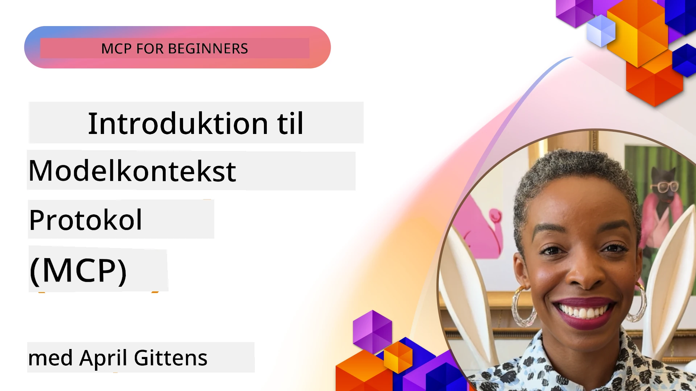
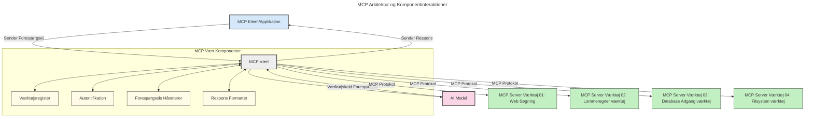

# Introduktion til Model Context Protocol (MCP): Hvorfor det betyder noget for skalerbare AI-applikationer

[](https://youtu.be/agBbdiOPLQA)

_(Klik på billedet ovenfor for at se videoen til denne lektion)_

Generative AI-applikationer er et stort skridt fremad, da de ofte lader brugeren interagere med appen ved hjælp af naturlige sprogkommandoer. Men efterhånden som der investeres mere tid og ressourcer i sådanne apps, vil du sikre dig, at du nemt kan integrere funktioner og ressourcer på en måde, så det er nemt at udvide, at din app kan håndtere mere end én model, der bruges, og klare forskellige modelkompleksiteter. Kort sagt er det let at bygge Gen AI-apps til at begynde med, men efterhånden som de vokser og bliver mere komplekse, skal du begynde at definere en arkitektur og vil sandsynligvis være afhængig af en standard for at sikre, at dine apps bygges på en ensartet måde. Her kommer MCP ind for at organisere tingene og tilbyde en standard.

---

## **🔍 Hvad er Model Context Protocol (MCP)?**

**Model Context Protocol (MCP)** er en **åben, standardiseret grænseflade**, der tillader Large Language Models (LLMs) at interagere gnidningsløst med eksterne værktøjer, API’er og datakilder. Den leverer en konsistent arkitektur til at forbedre AI-modellers funktionalitet ud over deres træningsdata og muliggør smartere, skalerbare og mere responsive AI-systemer.

---

## **🎯 Hvorfor standardisering i AI er vigtig**

Efterhånden som generative AI-applikationer bliver mere komplekse, er det vigtigt at anvende standarder, der sikrer **skalerbarhed, udvidelsesmuligheder, vedligeholdelse** og **undgå leverandørlåsning**. MCP løser disse behov ved at:

- Forene model-værktøjs-integrationer  
- Reducere skrøbelige, engangsløsninger  
- Tillade flere modeller fra forskellige leverandører at eksistere i ét økosystem  

**Note:** Selvom MCP markedsføres som en åben standard, er der ingen planer om at standardisere MCP gennem nogen eksisterende standardiseringsorganer såsom IEEE, IETF, W3C, ISO eller andre standardorganer.

---

## **📚 Læringsmål**

Når du er færdig med denne artikel, vil du kunne:

- Definere **Model Context Protocol (MCP)** og dets anvendelsestilfælde  
- Forstå hvordan MCP standardiserer model-til-værktøj-kommunikation  
- Identificere de centrale komponenter i MCP-arkitekturen  
- Udforske virkelige anvendelser af MCP i virksomheder og udviklingskontekster  

---

## **💡 Hvorfor Model Context Protocol (MCP) er en game-changer**

### **🔗 MCP løser fragmentering i AI-interaktioner**

Før MCP krævede integration af modeller og værktøjer:

- Specialskrevet kode pr. værktøj-model par  
- Ikke-standardiserede API’er fra hver leverandør  
- Hyppige afbrydelser pga. opdateringer  
- Dårlig skalerbarhed med flere værktøjer  

### **✅ Fordele ved MCP-standardisering**

| **Fordel**               | **Beskrivelse**                                                               |
|-------------------------|-------------------------------------------------------------------------------|
| Interoperabilitet        | LLM’er arbejder gnidningsløst med værktøjer fra forskellige leverandører      |
| Konsistens               | Ensartet adfærd på tværs af platforme og værktøjer                            |
| Genbrug                  | Værktøjer bygget én gang kan bruges på tværs af projekter og systemer         |
| Accelereret udvikling    | Reduceret udviklingstid ved brug af standardiserede, plug-and-play grænseflader|

---

## **🧱 Overblik over højniveau MCP-arkitektur**

MCP følger en **client-server model**, hvor:

- **MCP Hosts** kører AI-modellerne  
- **MCP Clients** initierer forespørgsler  
- **MCP Servers** leverer kontekst, værktøjer og kapabiliteter  

### **Nøglekomponenter:**

- **Ressourcer** – Statisk eller dynamisk data for modeller  
- **Prompts** – Foruddefinerede workflows til guidet generering  
- **Værktøjer** – Udførbare funktioner som søgning, beregninger  
- **Sampling** – Agentisk adfærd via recursive interaktioner  
- **Elicitation** – Server-initierede forespørgsler om brugerinput  
- **Roots** – Fil-system-grænser til serveradgangskontrol  

### **Protokolarkitektur:**

MCP bruger en to-lags arkitektur:  
- **Data Layer**: JSON-RPC 2.0 baseret kommunikation med livscyklusstyring og primitivfunktioner  
- **Transport Layer**: STDIO (lokal) og Streamable HTTP med SSE (fjern) kommunikationskanaler  

---

## Hvordan MCP-servere fungerer

MCP-servere fungerer på følgende måde:

- **Forespørgselsflow**:  
    1. En forespørgsel initieres af en slutbruger eller software, der handler på deres vegne.  
    2. **MCP Client** sender forespørgslen til en **MCP Host**, som styrer AI-model runtime.  
    3. **AI-modellen** modtager brugerprompten og kan anmode om adgang til eksterne værktøjer eller data via et eller flere værktøjskald.  
    4. **MCP Host**, ikke modellen direkte, kommunikerer med passende **MCP Server(e)** ved hjælp af den standardiserede protokol.  
- **MCP Host funktionalitet**:  
    - **Tool Registry**: Vedligeholder katalog over tilgængelige værktøjer og deres kapabiliteter.  
    - **Autentificering**: Verificerer rettigheder til værktøjsadgang.  
    - **Request Handler**: Behandler indkommende værktøjsforespørgsler fra modellen.  
    - **Response Formatter**: Strukturerer værktøjsoutput i et format, som modellen kan forstå.  
- **MCP Server eksekvering**:  
    - **MCP Host** ruter værktøjskald til en eller flere **MCP Servere**, der hver eksponerer specialiserede funktioner (fx søgning, beregninger, databaseforespørgsler).  
    - **MCP Servere** udfører deres respektive operationer og returnerer resultater til **MCP Host** i et ensartet format.  
    - **MCP Host** formaterer og videresender disse resultater til **AI-modellen**.  
- **Svarafslutning**:  
    - **AI-modellen** inkorporerer værktøjsuddataene i et endeligt svar.  
    - **MCP Host** sender dette svar tilbage til **MCP Client**, som leverer det til slutbrugeren eller kaldende software.  
    


## 👨‍💻 Sådan bygger du en MCP-server (med eksempler)

MCP-servere giver dig mulighed for at udvide LLM-kapabiliteter ved at levere data og funktionalitet.

Klar til at prøve? Her er sprog- og/eller stak-specifikke SDK’er med eksempler på at oprette simple MCP-servere i forskellige sprog/stakke:

- **Python SDK**: https://github.com/modelcontextprotocol/python-sdk

- **TypeScript SDK**: https://github.com/modelcontextprotocol/typescript-sdk

- **Java SDK**: https://github.com/modelcontextprotocol/java-sdk

- **C#/.NET SDK**: https://github.com/modelcontextprotocol/csharp-sdk


## 🌍 Virkelige brugstilfælde for MCP

MCP muliggør en bred vifte af applikationer ved at udvide AI-kapabiliteter:

| **Anvendelse**                | **Beskrivelse**                                                           |
|------------------------------|---------------------------------------------------------------------------|
| Enterprise data integration   | Forbind LLM’er til databaser, CRM’er eller interne værktøjer              |
| Agentiske AI-systemer         | Muliggør autonome agenter med værktøjsadgang og beslutningsflows           |
| Multimodale applikationer     | Kombiner tekst-, billede- og lydværktøjer i én samlet AI-app               |
| Real-time data integration    | Bring live data ind i AI-interaktioner for mere præcise, aktuelle resultater|


### 🧠 MCP = Universel standard for AI-interaktioner

Model Context Protocol (MCP) fungerer som en universel standard for AI-interaktioner, ligesom USB-C standardiserede fysiske forbindelser til enheder. I AI-verdenen giver MCP en ensartet grænseflade, der tillader modeller (clients) at integrere gnidningsløst med eksterne værktøjer og dataleverandører (servers). Dette eliminerer behovet for forskellige, brugerdefinerede protokoller for hver API eller datakilde.

Under MCP følger et MCP-kompatibelt værktøj (kaldet en MCP-server) en ensartet standard. Disse servere kan liste de værktøjer eller handlinger, de tilbyder, og udføre disse handlinger, når de anmodes af en AI-agent. AI-agentplatforme, der understøtter MCP, kan opdage tilgængelige værktøjer fra serverne og anmode om dem via denne standardprotokol.

### 💡 Tilgængeliggør adgang til viden

Udover at tilbyde værktøjer faciliterer MCP også adgang til viden. Den gør det muligt for applikationer at give kontekst til store sprogmodeller (LLM’er) ved at forbinde dem med forskellige datakilder. For eksempel kan en MCP-server repræsentere et firmas dokumentlager, så agenter kan hente relevant information efter behov. En anden server kan håndtere specifikke handlinger som at sende e-mails eller opdatere poster. Fra agentens perspektiv er disse bare værktøjer, der kan bruges – nogle værktøjer returnerer data (videns kontekst), mens andre udfører handlinger. MCP håndterer begge effektivt.

En agent, der forbinder til en MCP-server, lærer automatisk serverens tilgængelige kapabiliteter og adgang til data via et standardformat. Denne standardisering muliggør dynamisk tilgængelighed af værktøjer. For eksempel, hvis man tilføjer en ny MCP-server til en agents system, bliver dens funktioner straks brugbare uden yderligere tilpasning af agentens instruktioner.

Denne strømlinede integration stemmer overens med flowet vist i følgende diagram, hvor servere leverer både værktøjer og viden og sikrer gnidningsløs samarbejde på tværs af systemer.

### 👉 Eksempel: Skalerbar agentsløsning

```mermaid
---
title: Skalerbar Agentløsning med MCP
description: Et diagram, der illustrerer, hvordan en bruger interagerer med en LLM, der forbinder til flere MCP-servere, hvor hver server leverer både viden og værktøjer, hvilket skaber en skalerbar AI-arkitektur
---
graph TD
    User -->|Prompt| LLM
    LLM -->|Svar| User
    LLM -->|MCP| ServerA
    LLM -->|MCP| ServerB
    ServerA -->|Universal connector| ServerB
    ServerA --> KnowledgeA
    ServerA --> ToolsA
    ServerB --> KnowledgeB
    ServerB --> ToolsB

    subgraph Server A
        KnowledgeA[Viden]
        ToolsA[Værktøjer]
    end

    subgraph Server B
        KnowledgeB[Viden]
        ToolsB[Værktøjer]
    end
```Universal Connector muliggør, at MCP-servere kommunikerer og deler kapabiliteter med hinanden, så ServerA kan delegere opgaver til ServerB eller få adgang til dets værktøjer og viden. Dette federerer værktøjer og data på tværs af servere, hvilket understøtter skalerbare og modulære agentarkitekturer. Fordi MCP standardiserer udstilling af værktøjer, kan agenter dynamisk opdage og dirigere forespørgsler mellem servere uden hårdkodede integrationer.

Værktøjs- og viden-federation: Værktøjer og data kan tilgås på tværs af servere, hvilket muliggør mere skalerbare og modulære agentiske arkitekturer.

### 🔄 Avancerede MCP-scenarier med klient-side LLM-integration

Ud over den grundlæggende MCP-arkitektur findes avancerede scenarier, hvor både klient og server indeholder LLM’er, hvilket muliggør mere sofistikeret interaktion. I følgende diagram kunne **Client App** være en IDE med en række MCP-værktøjer tilgængelige for brugeren via LLM:

```mermaid
---
title: Avancerede MCP-scenarier med klient-server LLM-integration
description: Et sekvensdiagram, der viser den detaljerede interaktionsflow mellem bruger, klientapplikation, klient LLM, flere MCP-servere og server LLM, der illustrerer værktøjsopdagelse, brugerinteraktion, direkte værktøjsopkald og funktionsforhandlingsfaser
---
sequenceDiagram
    autonumber
    actor User as 👤 Bruger
    participant ClientApp as 🖥️ Klientapp
    participant ClientLLM as 🧠 Klient LLM
    participant Server1 as 🔧 MCP-server 1
    participant Server2 as 📚 MCP-server 2
    participant ServerLLM as 🤖 Server LLM
    
    %% Discovery Phase
    rect rgb(220, 240, 255)
        Note over ClientApp, Server2: VÆRKTØJSOPDAGELSESFASE
        ClientApp->>+Server1: Anmod om tilgængelige værktøjer/ressourcer
        Server1-->>-ClientApp: Returner værktøjsliste (JSON)
        ClientApp->>+Server2: Anmod om tilgængelige værktøjer/ressourcer
        Server2-->>-ClientApp: Returner værktøjsliste (JSON)
        Note right of ClientApp: Gem kombineret værktøjs<br/>katalog lokalt
    end
    
    %% User Interaction
    rect rgb(255, 240, 220)
        Note over User, ClientLLM: BRUGERINTERAKTIONSFASE
        User->>+ClientApp: Indtast prompt på naturligt sprog
        ClientApp->>+ClientLLM: Videreformidling af prompt + værktøjskatalog
        ClientLLM->>-ClientLLM: Analyser prompt & vælg værktøjer
    end
    
    %% Scenario A: Direct Tool Calling
    alt Direkte værktøjsopkald
        rect rgb(220, 255, 220)
            Note over ClientApp, Server1: SCENARIE A: DIREKTE VÆRKTØJSOPKALD
            ClientLLM->>+ClientApp: Anmod om værktøjsudførelse
            ClientApp->>+Server1: Udfør specifikt værktøj
            Server1-->>-ClientApp: Returner resultater
            ClientApp->>+ClientLLM: Behandl resultater
            ClientLLM-->>-ClientApp: Generer svar
            ClientApp-->>-User: Vis endeligt svar
        end
    
    %% Scenario B: Feature Negotiation (VS Code style)
    else Funktionsforhandling (VS Code-stil)
        rect rgb(255, 220, 220)
            Note over ClientApp, ServerLLM: SCENARIE B: FUNKTIONSFORHANDLING
            ClientLLM->>+ClientApp: Identificer nødvendige kapaciteter
            ClientApp->>+Server2: Forhandl funktioner/kapaciteter
            Server2->>+ServerLLM: Anmod om yderligere kontekst
            ServerLLM-->>-Server2: Lever kontekst
            Server2-->>-ClientApp: Returner tilgængelige funktioner
            ClientApp->>+Server2: Kald forhandlede værktøjer
            Server2-->>-ClientApp: Returner resultater
            ClientApp->>+ClientLLM: Behandl resultater
            ClientLLM-->>-ClientApp: Generer svar
            ClientApp-->>-User: Vis endeligt svar
        end
    end
```
## 🔐 Praktiske fordele ved MCP

Her er de praktiske fordele ved at bruge MCP:

- **Opdateret information**: Modeller kan tilgå opdateret information ud over deres træningsdata  
- **Udvidet kapabilitet**: Modeller kan udnytte specialiserede værktøjer til opgaver, de ikke blev trænet til  
- **Reducerede hallucinationer**: Eksterne datakilder giver faktuel forankring  
- **Privatliv**: Følsomme data kan forblive i sikre miljøer i stedet for at blive indlejret i prompts  

## 📌 Væsentlige pointer

Følgende er væsentlige pointer ved brug af MCP:

- **MCP** standardiserer hvordan AI-modeller interagerer med værktøjer og data  
- Fremmer **udvidelsesmuligheder, konsistens og interoperabilitet**  
- MCP hjælper med at **forkorte udviklingstid, forbedre pålidelighed og udvide modelkapabiliteter**  
- Client-server arkitekturen **muliggør fleksible, udvidelsesbare AI-applikationer**  

## 🧠 Øvelse

Tænk på en AI-applikation, du er interesseret i at bygge.

- Hvilke **eksterne værktøjer eller data** kunne forbedre dens kapabiliteter?  
- Hvordan kunne MCP gøre integrationen **simpeltere og mere pålidelig?**  

## Yderligere ressourcer

- [MCP GitHub Repository](https://github.com/modelcontextprotocol)


## Hvad der kommer næste

Næste: [Kapitel 1: Kernebegreber](../01-CoreConcepts/README.md)

---

<!-- CO-OP TRANSLATOR DISCLAIMER START -->
**Ansvarsfraskrivelse**:
Dette dokument er blevet oversat ved hjælp af AI-oversættelsestjenesten [Co-op Translator](https://github.com/Azure/co-op-translator). Selvom vi bestræber os på nøjagtighed, bedes du være opmærksom på, at automatiserede oversættelser kan indeholde fejl eller unøjagtigheder. Det oprindelige dokument på dets modersmål bør betragtes som den autoritative kilde. For kritisk information anbefales professionel menneskelig oversættelse. Vi kan ikke holdes ansvarlige for eventuelle misforståelser eller fejltolkninger, der opstår som følge af brugen af denne oversættelse.
<!-- CO-OP TRANSLATOR DISCLAIMER END -->