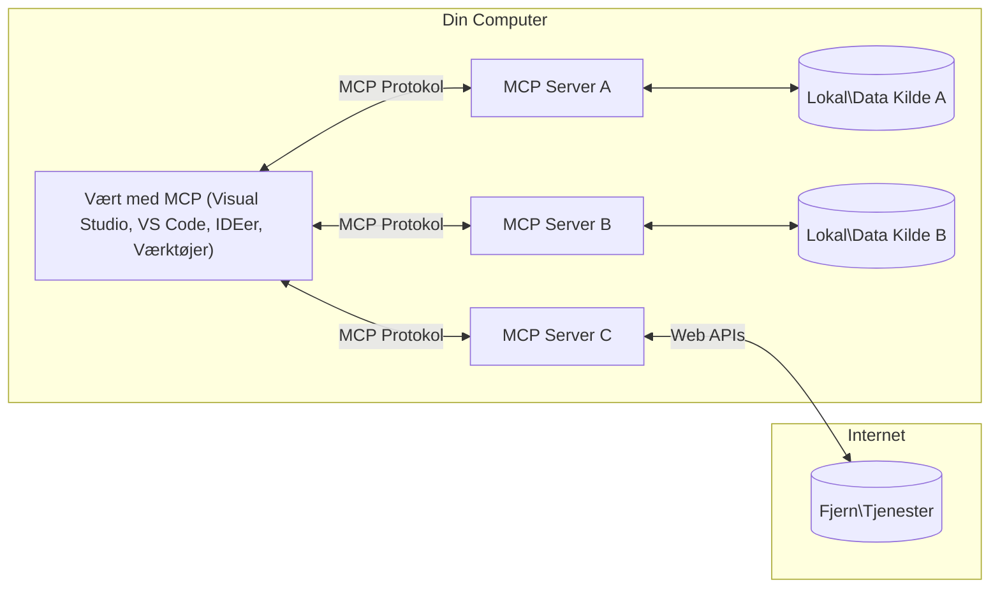

# MCP Core Concepts: Mestring af Model Context Protocol for AI-integration

[](https://youtu.be/earDzWGtE84)

_(Klik på billedet ovenfor for at se video af denne lektion)_

[Model Context Protocol (MCP)](https://github.com/modelcontextprotocol) er et kraftfuldt, standardiseret rammeværk, der optimerer kommunikationen mellem store sprogmodeller (LLM'er) og eksterne værktøjer, applikationer og datakilder.  
Denne vejledning gennemgår dig de grundlæggende koncepter i MCP. Du vil lære om dets klient-server-arkitektur, essentielle komponenter, kommunikationsmekanik og implementerings bedste praksis.

- **Udtrykkeligt brugersamtykke**: Al dataadgang og operationer kræver udtrykkeligt bruger-godkendelse før eksekvering. Brugere skal klart forstå, hvilke data der tilgås, og hvilke handlinger der udføres, med detaljeret kontrol over tilladelser og autorisationer.

- **Beskyttelse af dataprivatliv**: Brugerdata udsættes kun med udtrykkeligt samtykke og skal beskyttes med robuste adgangskontrolmekanismer gennem hele interaktionens livscyklus. Implementeringer skal forhindre uautoriseret dataoverførsel og opretholde strenge privatlivsgrænser.

- **Sikker udførelse af værktøjer**: Hver værktøjsopkald kræver udtrykkeligt samtykke med klar forståelse af værktøjets funktionalitet, parametre og potentiel indvirkning. Robuste sikkerhedsbarrierer skal forhindre utilsigtet, usikker eller ondsindet værktøjsudførelse.

- **Sikkerhed på transportlaget**: Alle kommunikationskanaler bør benytte passende kryptering og autentifikationsmekanismer. Fjernforbindelser skal implementere sikre transportprotokoller og korrekt håndtering af legitimationsoplysninger.

#### Implementeringsretningslinjer:

- **Tilladelsesstyring**: Implementer finmaskede tilladelsessystemer, der giver brugere kontrol over, hvilke servere, værktøjer og ressourcer der er tilgængelige  
- **Autentifikation & Autorisation**: Brug sikre autentifikationsmetoder (OAuth, API-nøgler) med korrekt tokenhåndtering og udløbstider  
- **Inputvalidering**: Valider alle parametre og dataindtastninger i overensstemmelse med definerede skemaer for at forhindre injektionsangreb  
- **Revisionslogning**: Vedligehold omfattende logfiler over alle operationer til sikkerhedsovervågning og overholdelse

## Oversigt

Denne lektion undersøger den fundamentale arkitektur og de komponenter, der udgør Model Context Protocol (MCP) økosystemet. Du vil lære om klient-server-arkitekturen, nøglekomponenterne og de kommunikationsmekanismer, der driver MCP-interaktioner.

## Centrale læringsmål

Ved slutningen af denne lektion vil du:

- Forstå MCP klient-server arkitektur.  
- Identificere roller og ansvar for Hosts, Clients og Servers.  
- Analysere kernefunktionerne, der gør MCP til et fleksibelt integrationslag.  
- Lære, hvordan information flyder inden for MCP-økosystemet.  
- Opnå praktiske indsigter gennem kodeeksempler i .NET, Java, Python og JavaScript.

## MCP Arkitektur: Et dybere kig

MCP-økosystemet bygger på en klient-server-model. Denne modulære struktur gør det muligt for AI-applikationer effektivt at interagere med værktøjer, databaser, API'er og kontekstuelle ressourcer. Lad os gennemgå denne arkitektur i dens kernekomponenter.

Kernen i MCP følger en klient-server-arkitektur, hvor en vært-applikation kan oprette forbindelse til flere servere:


- **MCP Hosts**: Programmer som VSCode, Claude Desktop, IDE'er eller AI-værktøjer, der ønsker at tilgå data gennem MCP  
- **MCP Clients**: Protokolklienter, der opretholder 1:1 forbindelser med servere  
- **MCP Servers**: Letvægtsprogrammer, der hver udsætter specifikke funktioner gennem den standardiserede Model Context Protocol  
- **Lokale datakilder**: Din computers filer, databaser og tjenester, som MCP-servere kan tilgå sikkert  
- **Fjernservices**: Eksterne systemer tilgængelige over internettet, som MCP-servere kan forbinde til via API'er.

MCP-protokollen er en evolverende standard, der bruger datobaseret versionsstyring (YYYY-MM-DD format). Den aktuelle protokolversion er **2025-11-25**. Du kan se de seneste opdateringer til [protokolspecifikationen](https://modelcontextprotocol.io/specification/2025-11-25/)

### 1. Hosts

I Model Context Protocol (MCP) er **Hosts** AI-applikationer, der tjener som den primære grænseflade, hvor brugere interagerer med protokollen. Hosts koordinerer og håndterer forbindelser til flere MCP-servere ved at oprette dedikerede MCP-klienter for hver serverforbindelse. Eksempler på Hosts inkluderer:

- **AI-applikationer**: Claude Desktop, Visual Studio Code, Claude Code  
- **Udviklingsmiljøer**: IDE'er og kodeeditorer med MCP-integration  
- **Specialbyggede applikationer**: Formålsbyggede AI-agenter og værktøjer  

**Hosts** er applikationer, der koordinerer AI-model-interaktioner. De:

- **Orkestrerer AI-modeller**: Udfører eller interagerer med LLM'er for at generere svar og koordinere AI-arbejdsgange  
- **Håndterer klientforbindelser**: Opretter og vedligeholder en MCP-klient pr. MCP-serverforbindelse  
- **Kontrollerer brugergrænsefladen**: Håndterer samtaleforløb, brugerinteraktioner og præsentation af svar  
- **Håndhæver sikkerhed**: Kontrollerer tilladelser, sikkerhedskontraints og autentifikation  
- **Håndterer brugersamtykke**: Administrerer brugerens godkendelse til datadeling og værktøjsudførelse

### 2. Clients

**Clients** er essentielle komponenter, der opretholder dedikerede en-til-en forbindelser mellem Hosts og MCP-servere. Hver MCP-klient instansieres af Host'en for at forbinde til en specifik MCP-server og sikrer organiserede og sikre kommunikationskanaler. Flere klienter gør det muligt for Hosts at forbinde til flere servere samtidigt.

**Clients** er forbindelseskomponenter inden for vært-applikationen. De:

- **Protokolkommunikation**: Sender JSON-RPC 2.0 forespørgsler til servere med prompts og instruktioner  
- **Kapabilitetsforhandling**: Forhandler understøttede funktioner og protokolversioner med servere under initialisering  
- **Værktøjsudførelse**: Håndterer værktøjsudførelsesanmodninger fra modeller og behandler svar  
- **Realtidsopdateringer**: Håndterer notifikationer og realtidsopdateringer fra servere  
- **Svarbehandling**: Behandler og formaterer serversvar til visning for brugere

### 3. Servers

**Servers** er programmer, der leverer kontekst, værktøjer og kapabiliteter til MCP-klienter. De kan køre lokalt (på samme maskine som Host'en) eller fjernstyret (på eksterne platforme), og er ansvarlige for at håndtere klientanmodninger og levere strukturerede svar. Servere udsætter specifik funktionalitet via den standardiserede Model Context Protocol.

**Servers** er tjenester, der tilbyder kontekst og funktionalitet. De:

- **Registrerer funktioner**: Registrerer og eksponerer tilgængelige primitivsæt (ressourcer, prompts, værktøjer) til klienter  
- **Behandler anmodninger**: Modtager og udfører værktøjskald, ressourceanmodninger og prompt-forespørgsler fra klienter  
- **Tilvejebringer kontekst**: Leverer kontekstuel information og data for at forbedre modelsvar  
- **Tilstandsadministration**: Vedligeholder sessionsstatus og håndterer tilstandsbaserede interaktioner efter behov  
- **Realtidsnotifikationer**: Sender notifikationer om funktionalitetsændringer og opdateringer til tilsluttede klienter  

Servere kan udvikles af alle for at udvide modelkapabiliteter med specialiseret funktionalitet og understøtter både lokal og fjernudrulning.

### 4. Server Primitives

Servere i Model Context Protocol (MCP) leverer tre kerne**primitiver**, der definerer de grundlæggende byggesten for rige interaktioner mellem klienter, hosts og sprogmodeller. Disse primitivsæt specificerer typer af kontekstuel information og handlinger tilgængelige via protokollen.

MCP-servere kan udsætte enhver kombination af følgende tre kerneprimitiver:

#### Ressourcer

**Ressourcer** er datakilder, der leverer kontekstuel information til AI-applikationer. De repræsenterer statisk eller dynamisk indhold, som kan forbedre modelforståelse og beslutningstagning:

- **Kontekstuel data**: Struktureret information og kontekst til AI-modelforbrug  
- **Vidensbaser**: Dokumentarkiver, artikler, manualer og forskningspapirer  
- **Lokale datakilder**: Filer, databaser og lokal systeminformation  
- **Ekstern data**: API-svar, webservices og fjernsystemdata  
- **Dynamisk indhold**: Realtidsdata, der opdateres baseret på eksterne forhold  

Ressourcer identificeres ved URI'er og understøtter opdagelse via `resources/list` og hentning via `resources/read` metoder:

```text
file://documents/project-spec.md
database://production/users/schema
api://weather/current
```
  
#### Prompts

**Prompts** er genanvendelige skabeloner, der hjælper med at strukturere interaktioner med sprogmodeller. De tilbyder standardiserede interaktionsmønstre og skabelonbaserede arbejdsgange:

- **Skabelonbaserede interaktioner**: Forudstrukturerede beskeder og samtalestartere  
- **Arbejdsflow-skabeloner**: Standardiserede sekvenser til almindelige opgaver og interaktioner  
- **Få-skud-eksempler**: Eksempelbaserede skabeloner til modelinstruktion  
- **Systemprompts**: Grundlæggende prompts, der definerer modeladfærd og kontekst  
- **Dynamiske skabeloner**: Parametriserede prompts, der tilpasser sig specifikke kontekster  

Prompts understøtter variabel substitution og kan findes via `prompts/list` og hentes med `prompts/get`:

```markdown
Generate a {{task_type}} for {{product}} targeting {{audience}} with the following requirements: {{requirements}}
```
  
#### Værktøjer

**Værktøjer** er eksekverbare funktioner, som AI-modeller kan kalde for at udføre specifikke handlinger. De repræsenterer "verberne" i MCP-økosystemet og gør det muligt for modeller at interagere med eksterne systemer:

- **Eksekverbare funktioner**: Diskrete operationer, som modeller kan kalde med specifikke parametre  
- **Integration med eksterne systemer**: API-kald, databaseforespørgsler, filoperationer, beregninger  
- **Unik identitet**: Hvert værktøj har et særskilt navn, beskrivelse og parameterskema  
- **Struktureret I/O**: Værktøjer accepterer validerede parametre og returnerer strukturerede, typerede svar  
- **Handlingskapabiliteter**: Gør det muligt for modeller at udføre handlinger i den virkelige verden og hente live data  

Værktøjer defineres med JSON Schema til parameter-validering og findes gennem `tools/list` og udføres via `tools/call`. Værktøjer kan også inkludere **ikoner** som yderligere metadata for bedre UI-præsentation.

**Værktøjsannoteringer**: Værktøjer understøtter adfærdsannoteringer (f.eks. `readOnlyHint`, `destructiveHint`), der beskriver om et værktøj er skrivebeskyttet eller destruktivt, hvilket hjælper klienter med at træffe informerede beslutninger om værktøjsudførelse.

Eksempel på værktøjsdefinition:

```typescript
server.tool(
  "search_products", 
  {
    query: z.string().describe("Search query for products"),
    category: z.string().optional().describe("Product category filter"),
    max_results: z.number().default(10).describe("Maximum results to return")
  }, 
  async (params) => {
    // Udfør søgning og returner strukturerede resultater
    return await productService.search(params);
  }
);
```
  
## Klientprimitiver

I Model Context Protocol (MCP) kan **klienter** udsætte primitivsæt, der gør det muligt for servere at anmode om yderligere kapabiliteter fra vært-applikationen. Disse klient-side primitivsæt tillader rigere, mere interaktive serverimplementeringer, som kan tilgå AI-modelkapabiliteter og brugerinteraktioner.

### Sampling

**Sampling** tillader servere at anmode om sprogmodel-fuldførelser fra klientens AI-applikation. Denne primitiv muliggør, at servere kan tilgå LLM-kapabiliteter uden at have egne modelafhængigheder:

- **Model-uafhængig adgang**: Servere kan anmode om fuldførelser uden at inkludere LLM-SDK'er eller styre modeladgang  
- **Server-initieret AI**: Muliggør, at servere autonomt kan generere indhold ved hjælp af klientens AI-model  
- **Rekursive LLM-interaktioner**: Understøtter komplekse scenarier, hvor servere har brug for AI-assistance til behandling  
- **Dynamisk indholdsgenerering**: Sætter servere i stand til at skabe kontekstuelle svar ved hjælp af værtens model  
- **Værktøjskaldunderstøttelse**: Servere kan inkludere `tools` og `toolChoice` parametre for at lade klientens model kalde værktøjer under sampling  

Sampling initieres via `sampling/complete` metoden, hvor servere sender fuldførelsesanmodninger til klienter.

### Roots

**Roots** giver en standardiseret måde for klienter til at udsætte filsystem-grænser for servere, hvilket hjælper servere med at forstå, hvilke mapper og filer de har adgang til:

- **Filsystemgrænser**: Definerer grænserne for, hvor servere kan operere inden for filsystemet  
- **Adgangskontrol**: Hjælper servere med at forstå, hvilke mapper og filer de har tilladelse til at tilgå  
- **Dynamiske opdateringer**: Klienter kan notificere servere, når listen over roots ændres  
- **URI-baseret identifikation**: Roots bruger `file://` URI'er til at identificere tilgængelige mapper og filer  

Roots opdages via `roots/list` metoden, med klienter, der sender `notifications/roots/list_changed`, når roots ændres.

### Elicitation

**Elicitation** gør det muligt for servere at anmode om yderligere oplysninger eller bekræftelse fra brugere via klientgrænsefladen:

- **Forespørgsler om brugerinput**: Servere kan bede om yderligere oplysninger, når det er nødvendigt for værktøjsudførelse  
- **Bekræftelsesdialoger**: Anmoder om brugerens godkendelse til følsomme eller betydningsfulde operationer  
- **Interaktive arbejdsgange**: Gør det muligt for servere at skabe trin-for-trin brugerinteraktioner  
- **Dynamisk parameterindsamling**: Indsamler manglende eller valgfrie parametre under værktøjsudførelse  

Elicitation-anmodninger sendes via `elicitation/request` metoden til indsamling af brugerinput gennem klientens grænseflade.

**URL-tilstand Elicitation**: Servere kan også anmode om URL-baserede brugerinteraktioner, som gør det muligt for servere at dirigere brugere til eksterne websider til autentifikation, bekræftelse eller dataindtastning.

### Logging

**Logging** gør det muligt for servere at sende strukturerede logbeskeder til klienter til debugging, overvågning og operationel synlighed:

- **Fejlfinding**: Giver servere mulighed for at levere detaljerede eksekveringslogs til fejlsøgning  
- **Operationel overvågning**: Sender statusopdateringer og præstationsmålinger til klienter  
- **Fejlrapportering**: Leverer detaljeret fejlkontekst og diagnostisk information  
- **Revisionsspor**: Opretter omfattende logfiler over serveroperationer og beslutninger  

Logging-beskeder sendes til klienter for at sikre gennemsigtighed i serveroperationer og lette fejlfinding.

## Informationsflow i MCP

Model Context Protocol (MCP) definerer et struktureret informationsflow mellem hosts, clients, servers og modeller. At forstå dette flow hjælper med at klarlægge, hvordan brugerforespørgsler behandles, og hvordan eksterne værktøjer og data integreres i modelsvar.

- **Host initierer forbindelse**  
  Vært-applikationen (såsom en IDE eller chatgrænseflade) etablerer forbindelse til en MCP-server, typisk via STDIO, WebSocket eller en anden understøttet transport.

- **Kapabilitetsforhandling**  
  Klienten (embedder i vært) og serveren udveksler oplysninger om deres understøttede funktioner, værktøjer, ressourcer og protokolversioner. Dette sikrer, at begge parter forstår, hvilke kapabiliteter der er tilgængelige for sessionen.

- **Brugerforespørgsel**  
  Brugeren interagerer med vært (f.eks. indtaster et prompt eller en kommando). Værten indsamler input og videresender det til klienten til behandling.

- **Ressource- eller værktøjsbrug**  
  - Klienten kan anmode om yderligere kontekst eller ressourcer fra serveren (som filer, databaseposter eller vidensbaseartikler) for at berige modelens forståelse.  
  - Hvis modellen vurderer, at et værktøj er nødvendigt (f.eks. for at hente data, udføre en beregning eller kalde en API), sender klienten en værktøjskaldsanmodning til serveren med angivelse af værktøjets navn og parametre.

- **Servereksekvering**  

Serveren modtager anmodningen om ressourcen eller værktøjet, udfører de nødvendige operationer (såsom at køre en funktion, forespørge en database eller hente en fil) og returnerer resultaterne til klienten i et struktureret format.

- **Svargenerering**  
  Klienten integrerer serverens svar (ressourcedata, værktøjsuddata osv.) i den igangværende modelinteraktion. Modellen bruger disse oplysninger til at generere et omfattende og kontekstuelt relevant svar.

- **Resultatfremvisning**  
  Værten modtager det endelige output fra klienten og præsenterer det for brugeren, ofte med både den genererede tekst fra modellen og eventuelle resultater fra værktøjskald eller opslag i ressourcer.

Denne flow gør det muligt for MCP at understøtte avancerede, interaktive og kontekstbevidste AI-applikationer ved sømløst at forbinde modeller med eksterne værktøjer og datakilder.

## Protokolarkitektur & Lag

MCP består af to adskilte arkitekturlag, der arbejder sammen om at levere en komplet kommunikationsramme:

### Datalag

**Datalaget** implementerer den kerne MCP-protokol ved at bruge **JSON-RPC 2.0** som fundament. Dette lag definerer beskedstruktur, semantik og interaktionsmønstre:

#### Kernekomponenter:

- **JSON-RPC 2.0 Protokol**: Al kommunikation bruger standardiseret JSON-RPC 2.0 beskedformat til metodekald, svar og notifikationer
- **Livscyklusstyring**: Håndterer forbindelse initialisering, kapabilitetsforhandling og sessionsterminering mellem klienter og servere
- **Serverlavn**: Muliggør, at servere kan tilbyde kernefunktionalitet gennem værktøjer, ressourcer og prompts
- **Klientlavn**: Muliggør, at servere kan anmode om sampling fra LLM’er, fremkalde brugerinput og sende logbeskeder
- **Realtidsnotifikationer**: Understøtter asynkrone notifikationer til dynamiske opdateringer uden polling

#### Nøglefunktioner:

- **Protokolversionsforhandling**: Bruger datobaseret versionering (ÅÅÅÅ-MM-DD) for at sikre kompatibilitet
- **Kapabilitetsopdagelse**: Klienter og servere udveksler oplysninger om understøttede funktioner under initialisering
- **Tilstandsfulde sessioner**: Opretholder forbindelsestilstand på tværs af flere interaktioner for kontekstkontinuitet

### Transportlag

**Transportlaget** håndterer kommunikationskanaler, beskedindramning og autentifikation mellem MCP-deltagere:

#### Understøttede transportmekanismer:

1. **STDIO-transport**:
   - Bruger standard input/output-strømme til direkte proceskommunikation
   - Optimalt til lokale processer på samme maskine uden netværksoverhead
   - Almindeligt anvendt til lokale MCP-serverimplementeringer

2. **Streambar HTTP-transport**:
   - Bruger HTTP POST til beskeder fra klient til server  
   - Valgfrie Server-Sent Events (SSE) til streaming fra server til klient
   - Muliggør fjernserverkommunikation på tværs af netværk
   - Understøtter almindelig HTTP-autentifikation (bearer tokens, API nøgler, brugerdefinerede headers)
   - MCP anbefaler OAuth til sikker tokenbaseret autentifikation

#### Transportabstraktion:

Transportlaget abstraherer kommunikationsdetaljer fra datalaget, hvilket muliggør brug af samme JSON-RPC 2.0 beskedformat på tværs af alle transportmekanismer. Denne abstraktion gør det muligt for applikationer nemt at skifte mellem lokale og fjernservere.

### Sikkerhedsovervejelser

MCP-implementeringer skal overholde flere kritiske sikkerhedsprincipper for at sikre sikre, pålidelige og trygge interaktioner på tværs af alle protokoloperationer:

- **Brugerens samtykke og kontrol**: Brugere skal give eksplicit samtykke, før nogen data tilgås eller operationer udføres. De skal have klar kontrol over, hvilke data der deles, og hvilke handlinger der er autoriserede, understøttet af intuitive brugergrænseflader til gennemgang og godkendelse af aktiviteter.

- **Dataprivatliv**: Brugerdata må kun eksponeres med eksplicit samtykke og skal beskyttes af passende adgangskontrol. MCP-implementeringer skal beskytte mod uautoriseret dataoverførsel og sikre, at privatliv opretholdes i alle interaktioner.

- **Værktøjssikkerhed**: Inden ethvert værktøj påkaldes, kræves eksplicit brugeraccept. Brugere skal have klar forståelse af hvert værktøjs funktionalitet, og robuste sikkerhedsbarrierer skal håndhæves for at forhindre utilsigtet eller usikker udførelse.

Ved at følge disse sikkerhedsprincipper sikrer MCP brugerens tillid, privatliv og sikkerhed på tværs af alle protokolinteraktioner samtidig med at muliggøre kraftfulde AI-integrationer.

## Kodeeksempler: Nøglekomponenter

Nedenfor findes kodeeksempler i flere populære programmeringssprog, der illustrerer hvordan man implementerer nøglekomponenter til MCP-servere og værktøjer.

### .NET Eksempel: Oprettelse af en simpel MCP-server med værktøjer

Her er et praktisk .NET kodeeksempel, der demonstrerer, hvordan man implementerer en simpel MCP-server med tilpassede værktøjer. Dette eksempel viser, hvordan man definerer og registrerer værktøjer, håndterer forespørgsler og forbinder serveren via Model Context Protocol.

```csharp
using System;
using System.Threading.Tasks;
using ModelContextProtocol.Server;
using ModelContextProtocol.Server.Transport;
using ModelContextProtocol.Server.Tools;

public class WeatherServer
{
    public static async Task Main(string[] args)
    {
        // Create an MCP server
        var server = new McpServer(
            name: "Weather MCP Server",
            version: "1.0.0"
        );
        
        // Register our custom weather tool
        server.AddTool<string, WeatherData>("weatherTool", 
            description: "Gets current weather for a location",
            execute: async (location) => {
                // Call weather API (simplified)
                var weatherData = await GetWeatherDataAsync(location);
                return weatherData;
            });
        
        // Connect the server using stdio transport
        var transport = new StdioServerTransport();
        await server.ConnectAsync(transport);
        
        Console.WriteLine("Weather MCP Server started");
        
        // Keep the server running until process is terminated
        await Task.Delay(-1);
    }
    
    private static async Task<WeatherData> GetWeatherDataAsync(string location)
    {
        // This would normally call a weather API
        // Simplified for demonstration
        await Task.Delay(100); // Simulate API call
        return new WeatherData { 
            Temperature = 72.5,
            Conditions = "Sunny",
            Location = location
        };
    }
}

public class WeatherData
{
    public double Temperature { get; set; }
    public string Conditions { get; set; }
    public string Location { get; set; }
}
```

### Java Eksempel: MCP Serverkomponenter

Dette eksempel demonstrerer samme MCP-server og værktøjsregistrering som .NET-eksemplet ovenfor, men implementeret i Java.

```java
import io.modelcontextprotocol.server.McpServer;
import io.modelcontextprotocol.server.McpToolDefinition;
import io.modelcontextprotocol.server.transport.StdioServerTransport;
import io.modelcontextprotocol.server.tool.ToolExecutionContext;
import io.modelcontextprotocol.server.tool.ToolResponse;

public class WeatherMcpServer {
    public static void main(String[] args) throws Exception {
        // Opret en MCP-server
        McpServer server = McpServer.builder()
            .name("Weather MCP Server")
            .version("1.0.0")
            .build();
            
        // Registrer et vejrværktøj
        server.registerTool(McpToolDefinition.builder("weatherTool")
            .description("Gets current weather for a location")
            .parameter("location", String.class)
            .execute((ToolExecutionContext ctx) -> {
                String location = ctx.getParameter("location", String.class);
                
                // Hent vejrdata (forenklet)
                WeatherData data = getWeatherData(location);
                
                // Returner formateret svar
                return ToolResponse.content(
                    String.format("Temperature: %.1f°F, Conditions: %s, Location: %s", 
                    data.getTemperature(), 
                    data.getConditions(), 
                    data.getLocation())
                );
            })
            .build());
        
        // Forbind serveren ved hjælp af stdio-transport
        try (StdioServerTransport transport = new StdioServerTransport()) {
            server.connect(transport);
            System.out.println("Weather MCP Server started");
            // Hold serveren kørende indtil processen afsluttes
            Thread.currentThread().join();
        }
    }
    
    private static WeatherData getWeatherData(String location) {
        // Implementeringen ville kalde en vejrtjeneste-API
        // Forenklet til eksempelbrug
        return new WeatherData(72.5, "Sunny", location);
    }
}

class WeatherData {
    private double temperature;
    private String conditions;
    private String location;
    
    public WeatherData(double temperature, String conditions, String location) {
        this.temperature = temperature;
        this.conditions = conditions;
        this.location = location;
    }
    
    public double getTemperature() {
        return temperature;
    }
    
    public String getConditions() {
        return conditions;
    }
    
    public String getLocation() {
        return location;
    }
}
```

### Python Eksempel: Opbygning af en MCP-server

Dette eksempel bruger fastmcp, så sørg for at installere det først:

```python
pip install fastmcp
```
Kodeeksempel:

```python
#!/usr/bin/env python3
import asyncio
from fastmcp import FastMCP
from fastmcp.transports.stdio import serve_stdio

# Opret en FastMCP-server
mcp = FastMCP(
    name="Weather MCP Server",
    version="1.0.0"
)

@mcp.tool()
def get_weather(location: str) -> dict:
    """Gets current weather for a location."""
    return {
        "temperature": 72.5,
        "conditions": "Sunny",
        "location": location
    }

# Alternativ tilgang med en klasse
class WeatherTools:
    @mcp.tool()
    def forecast(self, location: str, days: int = 1) -> dict:
        """Gets weather forecast for a location for the specified number of days."""
        return {
            "location": location,
            "forecast": [
                {"day": i+1, "temperature": 70 + i, "conditions": "Partly Cloudy"}
                for i in range(days)
            ]
        }

# Registrer klasseværktøjer
weather_tools = WeatherTools()

# Start serveren
if __name__ == "__main__":
    asyncio.run(serve_stdio(mcp))
```

### JavaScript Eksempel: Oprettelse af en MCP-server

Dette eksempel viser oprettelse af MCP-server i JavaScript og hvordan man registrerer to vejrrelaterede værktøjer.

```javascript
// Brug af den officielle Model Context Protocol SDK
import { McpServer } from "@modelcontextprotocol/sdk/server/mcp.js";
import { StdioServerTransport } from "@modelcontextprotocol/sdk/server/stdio.js";
import { z } from "zod"; // Til parametervalidering

// Opret en MCP-server
const server = new McpServer({
  name: "Weather MCP Server",
  version: "1.0.0"
});

// Definer et vejrværktøj
server.tool(
  "weatherTool",
  {
    location: z.string().describe("The location to get weather for")
  },
  async ({ location }) => {
    // Dette ville normalt kalde en vejr-API
    // Forenklet til demonstration
    const weatherData = await getWeatherData(location);
    
    return {
      content: [
        { 
          type: "text", 
          text: `Temperature: ${weatherData.temperature}°F, Conditions: ${weatherData.conditions}, Location: ${weatherData.location}` 
        }
      ]
    };
  }
);

// Definer et vejrudsigtværktøj
server.tool(
  "forecastTool",
  {
    location: z.string(),
    days: z.number().default(3).describe("Number of days for forecast")
  },
  async ({ location, days }) => {
    // Dette ville normalt kalde en vejr-API
    // Forenklet til demonstration
    const forecast = await getForecastData(location, days);
    
    return {
      content: [
        { 
          type: "text", 
          text: `${days}-day forecast for ${location}: ${JSON.stringify(forecast)}` 
        }
      ]
    };
  }
);

// Hjælpefunktioner
async function getWeatherData(location) {
  // Simuler API-kald
  return {
    temperature: 72.5,
    conditions: "Sunny",
    location: location
  };
}

async function getForecastData(location, days) {
  // Simuler API-kald
  return Array.from({ length: days }, (_, i) => ({
    day: i + 1,
    temperature: 70 + Math.floor(Math.random() * 10),
    conditions: i % 2 === 0 ? "Sunny" : "Partly Cloudy"
  }));
}

// Forbind serveren ved hjælp af stdio-transport
const transport = new StdioServerTransport();
server.connect(transport).catch(console.error);

console.log("Weather MCP Server started");
```

Dette JavaScript-eksempel demonstrerer, hvordan man opretter en MCP-klient, der forbinder til en server, sender en prompt og behandler svaret inklusive eventuelle værktøjskald, der blev foretaget.

## Sikkerhed og autorisation

MCP inkluderer flere indbyggede koncepter og mekanismer til styring af sikkerhed og autorisation gennem hele protokollen:

1. **Værktøjstilladelseskontrol**:  
  Klienter kan specificere, hvilke værktøjer en model må bruge under en session. Dette sikrer, at kun eksplicit autoriserede værktøjer er tilgængelige, hvilket reducerer risikoen for utilsigtede eller usikre operationer. Tilladelser kan konfigureres dynamisk baseret på brugerpræferencer, organisationspolitikker eller interaktionskontekst.

2. **Autentifikation**:  
  Servere kan kræve autentifikation, før adgang til værktøjer, ressourcer eller følsomme operationer gives. Dette kan involvere API-nøgler, OAuth-tokens eller andre autentifikationsordninger. Korrekt autentifikation sikrer, at kun betroede klienter og brugere kan anvende serverside-funktionaliteter.

3. **Validering**:  
  Parameter-validering håndhæves for alle værktøjskald. Hvert værktøj definerer forventede typer, formater og begrænsninger for sine parametre, og serveren validerer indkommende forespørgsler derefter. Dette forhindrer dårligt formateret eller ondsindet input i at nå værktøjsimplementeringerne og hjælper med at bevare operationernes integritet.

4. **Ratelimiting**:  
  For at forhindre misbrug og sikre fair brug af serverressourcer kan MCP-servere implementere ratebegrænsning for værktøjskald og ressourceadgang. Ratelimiter kan anvendes pr. bruger, pr. session eller globalt og hjælper med at beskytte mod denial-of-service-angreb eller overdreven ressourceforbrug.

Ved at kombinere disse mekanismer giver MCP et sikkert fundament for integration af sprogmodeller med eksterne værktøjer og datakilder, samtidig med at brugere og udviklere får detaljeret kontrol over adgang og brug.

## Protokolbeskeder & kommunikationsflow

MCP-kommunikation bruger strukturerede **JSON-RPC 2.0** beskeder til at muliggøre klare og pålidelige interaktioner mellem værter, klienter og servere. Protokollen definerer specifikke beskedmønstre til forskellige typer operationer:

### Kernebeskedtyper:

#### **Initialiseringsbeskeder**
- **`initialize` Forespørgsel**: Etablerer forbindelse og forhandler protokolversion og kapabiliteter
- **`initialize` Svar**: Bekræfter understøttede funktioner og serverinformation  
- **`notifications/initialized`**: Signalerer at initialisering er færdig og sessionen er klar

#### **Opdagelsesbeskeder**
- **`tools/list` Forespørgsel**: Opdager tilgængelige værktøjer fra serveren
- **`resources/list` Forespørgsel**: Lister tilgængelige ressourcer (datakilder)
- **`prompts/list` Forespørgsel**: Henter tilgængelige promptskabeloner

#### **Eksekveringsbeskeder**  
- **`tools/call` Forespørgsel**: Udfører et specifikt værktøj med angivne parametre
- **`resources/read` Forespørgsel**: Henter indhold fra en specifik ressourcer
- **`prompts/get` Forespørgsel**: Henter en promptskabelon med valgfrie parametre

#### **Klientsidebeskeder**
- **`sampling/complete` Forespørgsel**: Server anmoder om LLM-completion fra klienten
- **`elicitation/request`**: Server anmoder om brugerinput via klientgrænsefladen
- **Logbeskeder**: Server sender strukturerede logbeskeder til klienten

#### **Notifikationsbeskeder**
- **`notifications/tools/list_changed`**: Server underretter klient om ændringer i værktøjslisten  
- **`notifications/resources/list_changed`**: Server underretter klient om ændringer i ressourcelisten  
- **`notifications/prompts/list_changed`**: Server underretter klient om ændringer i promptlisten

### Beskedstruktur:

Alle MCP-beskeder følger JSON-RPC 2.0 format med:
- **Forespørgselsbeskeder**: Inkluderer `id`, `method` og valgfrie `params`
- **Svarbeskeder**: Inkluderer `id` og enten `result` eller `error`  
- **Notifikationsbeskeder**: Inkluderer `method` og valgfrie `params` (ingen `id` eller svar forventet)

Denne strukturerede kommunikation sikrer pålidelige, sporbare og udvidelige interaktioner, der understøtter avancerede scenarier som realtidsopdateringer, værktøjskæder og robust fejlhåndtering.

### Opgaver (Eksperimentelt)

**Opgaver** er en eksperimentel funktion, der tilbyder holdbare eksekveringsindpakninger, som muliggør udsat resultatfremskaffelse og statussporing for MCP-forespørgsler:

- **Langvarige operationer**: Sporer kostbare beregninger, workflow-automatisering og batchbehandling
- **Udsatte resultater**: Kan polle opgave-status og hente resultater, når operationer er fuldførte
- **Statussporing**: Overvåger procesfremskridt gennem definerede livscyklusstadier
- **Flertrinsoperationer**: Understøtter komplekse workflows, der strækker sig over flere interaktioner

Opgaver omslutter standard MCP-forespørgsler for at muliggøre asynkrone udførelsesmønstre for operationer, der ikke kan færdiggøres øjeblikkeligt.

## Vigtige pointer

- **Arkitektur**: MCP bruger en klient-server arkitektur, hvor værter administrerer flere klientforbindelser til servere
- **Deltagere**: Økosystemet omfatter værter (AI-applikationer), klienter (protokolforbindelser) og servere (kapabilitetsudbydere)
- **Transportmekanismer**: Kommunikation understøtter STDIO (lokalt) og Streambar HTTP med valgfri SSE (fjern)
- **Kerneredskaber**: Servere eksponerer værktøjer (udførelsesfunktioner), ressourcer (datakilder) og prompts (skabeloner)
- **Klientredskaber**: Servere kan anmode om sampling (LLM-completions med værktøjskaldsstøtte), elicitation (brugerinput inklusiv URL-tilstand), roots (filsystemgrænser) og logging fra klienter
- **Eksperimentelle funktioner**: Opgaver tilbyder holdbare eksekveringsindpakninger til langvarige operationer
- **Protokolfundament**: Bygget på JSON-RPC 2.0 med datobaseret versionering (nuværende: 2025-11-25)
- **Realtidskapabiliteter**: Understøtter notifikationer til dynamiske opdateringer og realtidssynkronisering
- **Sikkerhed først**: Eksplicit brugeraccept, dataprivatlivsbeskyttelse og sikker transport er kernekrav

## Øvelse

Design et simpelt MCP-værktøj, der ville være nyttigt i dit domæne. Definér:
1. Hvad værktøjet skal hedde
2. Hvilke parametre det skal acceptere
3. Hvilket output det skal returnere
4. Hvordan en model kunne bruge dette værktøj til at løse brugerproblemer


---

## Hvad kommer herefter

Næste: [Kapitel 2: Sikkerhed](../02-Security/README.md)

---

<!-- CO-OP TRANSLATOR DISCLAIMER START -->
**Ansvarsfraskrivelse**:
Dette dokument er blevet oversat ved hjælp af AI-oversættelsestjenesten [Co-op Translator](https://github.com/Azure/co-op-translator). Selvom vi bestræber os på nøjagtighed, skal du være opmærksom på, at automatiserede oversættelser kan indeholde fejl eller unøjagtigheder. Det oprindelige dokument på dets modersmål bør betragtes som den autoritative kilde. For kritisk information anbefales professionel menneskelig oversættelse. Vi er ikke ansvarlige for eventuelle misforståelser eller fejltolkninger, der opstår som følge af brugen af denne oversættelse.
<!-- CO-OP TRANSLATOR DISCLAIMER END -->