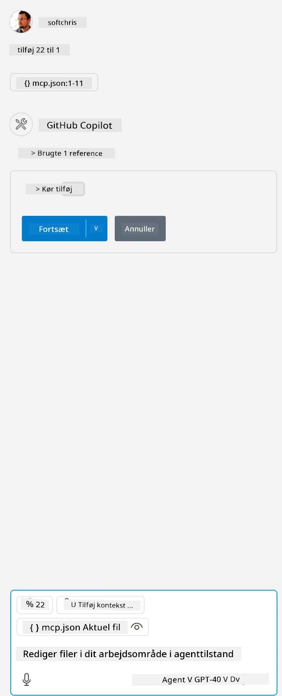

Dette svarer til at køre en kommando som: `node build/index.js`.

- Ændr denne serverpost, så den passer til, hvor din serverfil er placeret, eller hvad der er nødvendigt for at starte din server afhængigt af dit valgte runtime og serverplacering.

## Brug funktionerne i serveren

- Klik på `play`-ikonet, når du har tilføjet *mcp.json* til *./vscode*-mappen,

    Bemærk, at værktøjsikonet ændrer sig for at øge antallet af tilgængelige værktøjer. Værktøjsikonet er placeret lige over chatfeltet i GitHub Copilot.

## Kør et værktøj

- Skriv en prompt i dit chatvindue, der matcher beskrivelsen af dit værktøj. For eksempel for at aktivere værktøjet `add` kan du skrive noget som "add 3 to 20".

    Du skulle se et værktøj blive vist over chattekstboksen, som indikerer, at du kan vælge at køre værktøjet, som vist i denne illustration:

    

    At vælge værktøjet skulle give et numerisk resultat, der siger "23", hvis din prompt var som nævnt tidligere.

**Ansvarsfraskrivelse**:  
Dette dokument er blevet oversat ved hjælp af AI-oversættelsestjenesten [Co-op Translator](https://github.com/Azure/co-op-translator). Selvom vi bestræber os på nøjagtighed, bedes du være opmærksom på, at automatiserede oversættelser kan indeholde fejl eller unøjagtigheder. Det oprindelige dokument på dets oprindelige sprog bør betragtes som den autoritative kilde. For kritisk information anbefales professionel menneskelig oversættelse. Vi påtager os intet ansvar for misforståelser eller fejltolkninger, der opstår som følge af brugen af denne oversættelse.