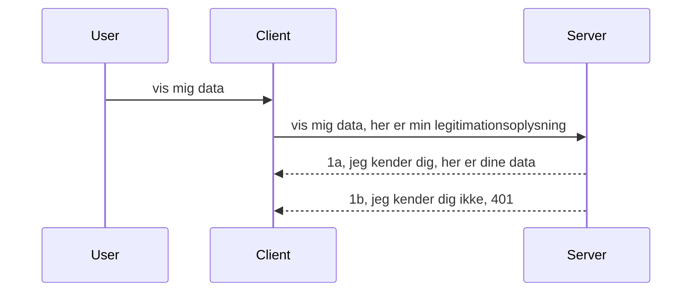

# Simple auth

MCP SDK'er understøtter brugen af OAuth 2.1, som for at være fair er en ret omfattende proces, der involverer koncepter som auth-server, resource-server, afsendelse af legitimationsoplysninger, modtagelse af en kode, udveksling af koden for et bærertoken, indtil du endelig kan få dine ressourcedata. Hvis du ikke er vant til OAuth, som er en fantastisk ting at implementere, er det en god idé at starte med et grundlæggende niveau af auth og bygge op til bedre og bedre sikkerhed. Det er derfor, dette kapitel eksisterer, for at opbygge dig til mere avanceret auth.

## Auth, hvad mener vi?

Auth er en forkortelse for authentication og authorization. Ideen er, at vi skal gøre to ting:

- **Authentication**, som er processen med at finde ud af, om vi lader en person komme ind i vores hus, at de har ret til at være "her", det vil sige have adgang til vores resource-server, hvor vores MCP Server-funktioner lever.
- **Authorization**, er processen med at finde ud af, om en bruger skal have adgang til disse specifikke ressourcer, de efterspørger, for eksempel disse ordrer eller disse produkter, eller om de må læse indholdet, men ikke slette det som et andet eksempel.

## Legitimationsoplysninger: hvordan vi fortæller systemet, hvem vi er

Nå, de fleste webudviklere tænker på at give en credential til serveren, normalt en hemmelighed, der siger, om de har tilladelse til at være her "Authentication". Denne credential er normalt en base64-kodet version af brugernavn og adgangskode eller en API-nøgle, der entydigt identificerer en specifik bruger.

Dette involverer at sende det via en header kaldet "Authorization" sådan her:

```json
{ "Authorization": "secret123" }
```

Dette kaldes normalt basic authentication. Sådan fungerer det overordnede flow på følgende måde:


Nu hvor vi forstår, hvordan det fungerer fra et flow-synspunkt, hvordan implementerer vi det? Nå, de fleste webservere har et koncept kaldet middleware, et stykke kode, der kører som en del af forespørgslen, som kan verificere legitimationsoplysninger, og hvis legitimationsoplysningerne er gyldige, kan lade forespørgslen passere igennem. Hvis forespørgslen ikke har gyldige legitimationsoplysninger, får du en auth-fejl. Lad os se, hvordan dette kan implementeres:

**Python**

```python
class AuthMiddleware(BaseHTTPMiddleware):
    async def dispatch(self, request, call_next):

        has_header = request.headers.get("Authorization")
        if not has_header:
            print("-> Missing Authorization header!")
            return Response(status_code=401, content="Unauthorized")

        if not valid_token(has_header):
            print("-> Invalid token!")
            return Response(status_code=403, content="Forbidden")

        print("Valid token, proceeding...")
       
        response = await call_next(request)
        # tilføj eventuelle kundespecifikke headers eller ændringer i svaret på en eller anden måde
        return response


starlette_app.add_middleware(CustomHeaderMiddleware)
```

Her har vi:

- Oprettet middleware kaldet `AuthMiddleware`, hvor dens `dispatch`-metode bliver kaldt af webserveren.
- Tilføjet middleware til webserveren:

    ```python
    starlette_app.add_middleware(AuthMiddleware)
    ```

- Skrevet valideringslogik, der tjekker, om Authorization-headeren er til stede, og om den hemmelighed, der sendes, er gyldig:

    ```python
    has_header = request.headers.get("Authorization")
    if not has_header:
        print("-> Missing Authorization header!")
        return Response(status_code=401, content="Unauthorized")

    if not valid_token(has_header):
        print("-> Invalid token!")
        return Response(status_code=403, content="Forbidden")
    ```

  hvis den hemmelighed er til stede og gyldig, lader vi forespørgslen passere ved at kalde `call_next` og returnerer svaret.

    ```python
    response = await call_next(request)
    # tilføj eventuelle brugerdefinerede overskrifter eller ændringer i svaret på en eller anden måde
    return response
    ```

Sådan fungerer det: Hvis der foretages en webforespørgsel mod serveren, bliver middleware kaldt, og givet dens implementering vil den enten lade forespørgslen passere igennem eller ende med at returnere en fejl, der indikerer, at klienten ikke har tilladelse til at fortsætte.

**TypeScript**

Her opretter vi middleware med det populære framework Express og afbryder forespørgslen, før den når MCP Server. Her er koden til det:

```typescript
function isValid(secret) {
    return secret === "secret123";
}

app.use((req, res, next) => {
    // 1. Autorisationsheader til stede?
    if(!req.headers["Authorization"]) {
        res.status(401).send('Unauthorized');
    }
    
    let token = req.headers["Authorization"];

    // 2. Tjek gyldighed.
    if(!isValid(token)) {
        res.status(403).send('Forbidden');
    }

   
    console.log('Middleware executed');
    // 3. Sender forespørgslen videre til det næste trin i forespørgselsprocessen.
    next();
});
```

I denne kode:

1. Tjekker vi, om Authorization-headeren overhovedet er til stede; hvis ikke, sender vi en 401-fejl.
2. Sikrer vi, at legitimationsoplysningerne/token er gyldige; hvis ikke, sender vi en 403-fejl.
3. Endelig sender vi forespørgslen videre i pipeline og returnerer den ønskede ressource.

## Øvelse: Implementer authentication

Lad os tage vores viden og prøve at implementere det. Her er planen:

Server

- Opret en webserver og MCP-instans.
- Implementer middleware for serveren.

Klient

- Send webforespørgsel med legitimationsoplysninger via header.

### -1- Opret en webserver og MCP-instans

I det første trin skal vi oprette webserverinstansen og MCP Server.

**Python**

Her opretter vi en MCP-serverinstans, opretter en starlette webapp og hoster den med uvicorn.

```python
# opretter MCP-server

app = FastMCP(
    name="MCP Resource Server",
    instructions="Resource Server that validates tokens via Authorization Server introspection",
    host=settings["host"],
    port=settings["port"],
    debug=True
)

# opretter starlette webapp
starlette_app = app.streamable_http_app()

# serverer app via uvicorn
async def run(starlette_app):
    import uvicorn
    config = uvicorn.Config(
            starlette_app,
            host=app.settings.host,
            port=app.settings.port,
            log_level=app.settings.log_level.lower(),
        )
    server = uvicorn.Server(config)
    await server.serve()

run(starlette_app)
```

I denne kode:

- Opretter vi MCP Server.
- Konstruerer vi starlette webappen fra MCP Server, `app.streamable_http_app()`.
- Hoster og serverer vi webappen ved hjælp af uvicorn `server.serve()`.

**TypeScript**

Her opretter vi en MCP Server-instans.

```typescript
const server = new McpServer({
      name: "example-server",
      version: "1.0.0"
    });

    // ... opsæt serverressourcer, værktøjer og prompts ...
```

Denne oprettelse af MCP Server skal ske inden for vores POST /mcp route-definition, så lad os tage ovenstående kode og flytte den sådan her:

```typescript
import express from "express";
import { randomUUID } from "node:crypto";
import { McpServer } from "@modelcontextprotocol/sdk/server/mcp.js";
import { StreamableHTTPServerTransport } from "@modelcontextprotocol/sdk/server/streamableHttp.js";
import { isInitializeRequest } from "@modelcontextprotocol/sdk/types.js"

const app = express();
app.use(express.json());

// Kort til at gemme transporter efter session ID
const transports: { [sessionId: string]: StreamableHTTPServerTransport } = {};

// Håndter POST-forespørgsler for klient-til-server kommunikation
app.post('/mcp', async (req, res) => {
  // Tjek for eksisterende session ID
  const sessionId = req.headers['mcp-session-id'] as string | undefined;
  let transport: StreamableHTTPServerTransport;

  if (sessionId && transports[sessionId]) {
    // Genbrug eksisterende transport
    transport = transports[sessionId];
  } else if (!sessionId && isInitializeRequest(req.body)) {
    // Ny initialiseringsanmodning
    transport = new StreamableHTTPServerTransport({
      sessionIdGenerator: () => randomUUID(),
      onsessioninitialized: (sessionId) => {
        // Gem transporten efter session ID
        transports[sessionId] = transport;
      },
      // DNS rebinding beskyttelse er som standard deaktiveret for bagudkompatibilitet. Hvis du kører denne server
      // lokalt, skal du sørge for at sætte:
      // enableDnsRebindingProtection: true,
      // allowedHosts: ['127.0.0.1'],
    });

    // Ryd op i transporten når den lukkes
    transport.onclose = () => {
      if (transport.sessionId) {
        delete transports[transport.sessionId];
      }
    };
    const server = new McpServer({
      name: "example-server",
      version: "1.0.0"
    });

    // ... opsæt serverressourcer, værktøjer og prompts ...

    // Forbind til MCP serveren
    await server.connect(transport);
  } else {
    // Ugyldig forespørgsel
    res.status(400).json({
      jsonrpc: '2.0',
      error: {
        code: -32000,
        message: 'Bad Request: No valid session ID provided',
      },
      id: null,
    });
    return;
  }

  // Håndter forespørgslen
  await transport.handleRequest(req, res, req.body);
});

// Genanvendelig håndtering for GET og DELETE forespørgsler
const handleSessionRequest = async (req: express.Request, res: express.Response) => {
  const sessionId = req.headers['mcp-session-id'] as string | undefined;
  if (!sessionId || !transports[sessionId]) {
    res.status(400).send('Invalid or missing session ID');
    return;
  }
  
  const transport = transports[sessionId];
  await transport.handleRequest(req, res);
};

// Håndter GET-forespørgsler for server-til-klient notifikationer via SSE
app.get('/mcp', handleSessionRequest);

// Håndter DELETE-forespørgsler for session afslutning
app.delete('/mcp', handleSessionRequest);

app.listen(3000);
```

Nu ser du, hvordan MCP Server-oprettelsen blev flyttet inden for `app.post("/mcp")`.

Lad os gå videre til næste trin med at oprette middleware, så vi kan validere den indkommende credential.

### -2- Implementer middleware for serveren

Lad os komme til middleware-delen næste. Her opretter vi en middleware, der leder efter en credential i `Authorization`-headeren og validerer den. Hvis den er acceptabel, vil forespørgslen fortsætte med at gøre, hvad den skal (f.eks. liste værktøjer, læse en ressource eller hvad end MCP-funktionaliteten klinten efterspurgte).

**Python**

For at oprette middleware skal vi oprette en klasse, der arver fra `BaseHTTPMiddleware`. Der er to interessante dele:

- Forespørgslen `request`, hvorfra vi læser header-info.
- `call_next`, callbacken vi skal kalde, hvis klienten har medbragt en credential, vi accepterer.

Først skal vi håndtere tilfælde, hvor `Authorization`-headeren mangler:

```python
has_header = request.headers.get("Authorization")

# ingen header til stede, fejler med 401, ellers gå videre.
if not has_header:
    print("-> Missing Authorization header!")
    return Response(status_code=401, content="Unauthorized")
```

Her sender vi en 401 unauthorized-meddelelse, da klienten fejler i authentication.

Dernæst, hvis en credential blev sendt, skal vi tjekke dens gyldighed sådan her:

```python
 if not valid_token(has_header):
    print("-> Invalid token!")
    return Response(status_code=403, content="Forbidden")
```

Bemærk hvordan vi sender en 403 forbidden-meddelelse ovenfor. Lad os se den fulde middleware nedenfor, der implementerer alt, vi nævnte ovenfor:

```python
class AuthMiddleware(BaseHTTPMiddleware):
    async def dispatch(self, request, call_next):

        has_header = request.headers.get("Authorization")
        if not has_header:
            print("-> Missing Authorization header!")
            return Response(status_code=401, content="Unauthorized")

        if not valid_token(has_header):
            print("-> Invalid token!")
            return Response(status_code=403, content="Forbidden")

        print("Valid token, proceeding...")
        print(f"-> Received {request.method} {request.url}")
        response = await call_next(request)
        response.headers['Custom'] = 'Example'
        return response

```

Fint, men hvad med `valid_token`-funktionen? Her er den nedenfor:

```python
# BRUG IKKE til produktion - forbedr det !!
def valid_token(token: str) -> bool:
    # fjern "Bearer " præfikset
    if token.startswith("Bearer "):
        token = token[7:]
        return token == "secret-token"
    return False
```

Det bør selvfølgelig forbedres.

VIGTIGT: Du bør ALDRIG have hemmeligheder som denne i kode. Du bør ideelt set hente værdien at sammenligne med fra en datakilde eller fra en IDP (identity service provider) eller endnu bedre, lade IDP’en udføre valideringen.

**TypeScript**

For at implementere dette med Express skal vi kalde `use`-metoden, som tager middleware-funktioner.

Vi skal:

- Interagere med request-variablen for at kontrollere den overførte credential i `Authorization`-ejendommen.
- Validere credential, og hvis det er i orden, lade forespørgslen fortsætte og lade klientens MCP-forespørgsel gøre, hvad den skal (f.eks. liste værktøjer, læse ressourcer eller andet MCP-relateret).

Her tjekker vi, om `Authorization`-headeren er til stede, og hvis ikke, stopper vi forespørgslen fra at gå igennem:

```typescript
if(!req.headers["authorization"]) {
    res.status(401).send('Unauthorized');
    return;
}
```

Hvis headeren ikke er sendt i første omgang, får du en 401.

Dernæst tjekker vi, om credential er gyldig; hvis ikke stopper vi igen forespørgslen med en lidt anden meddelelse:

```typescript
if(!isValid(token)) {
    res.status(403).send('Forbidden');
    return;
} 
```

Bemærk, hvordan du nu får en 403-fejl.

Her er hele koden:

```typescript
app.use((req, res, next) => {
    console.log('Request received:', req.method, req.url, req.headers);
    console.log('Headers:', req.headers["authorization"]);
    if(!req.headers["authorization"]) {
        res.status(401).send('Unauthorized');
        return;
    }
    
    let token = req.headers["authorization"];

    if(!isValid(token)) {
        res.status(403).send('Forbidden');
        return;
    }  

    console.log('Middleware executed');
    next();
});
```

Vi har opsat webserveren til at acceptere middleware, der tjekker det credential, som klienten forhåbentlig sender os. Hvad med klienten selv?

### -3- Send webforespørgsel med credential via header

Vi skal sikre, at klienten sender credential gennem headeren. Da vi vil bruge en MCP-klient til det, skal vi finde ud af, hvordan det gøres.

**Python**

For klienten skal vi sende en header med vores credential sådan her:

```python
# INDTEGNE IKKE værdien direkte, hav den mindst i en miljøvariabel eller en mere sikker opbevaring
token = "secret-token"

async with streamablehttp_client(
        url = f"http://localhost:{port}/mcp",
        headers = {"Authorization": f"Bearer {token}"}
    ) as (
        read_stream,
        write_stream,
        session_callback,
    ):
        async with ClientSession(
            read_stream,
            write_stream
        ) as session:
            await session.initialize()
      
            # TODO, hvad du ønsker gjort i klienten, f.eks. liste værktøjer, kalde værktøjer osv.
```

Bemærk, hvordan vi udfylder `headers`-egenskaben sådan her ` headers = {"Authorization": f"Bearer {token}"}`.

**TypeScript**

Vi kan løse dette i to trin:

1. Fyld en konfigurationsobjekt med vores credential.
2. Send konfigurationsobjektet til transporten.

```typescript

// MÅ IKKE hardkode værdien som vist her. Mindst skal den være en miljøvariabel, og brug noget som dotenv (i udviklingstilstand).
let token = "secret123"

// definer et client transport options objekt
let options: StreamableHTTPClientTransportOptions = {
  sessionId: sessionId,
  requestInit: {
    headers: {
      "Authorization": "secret123"
    }
  }
};

// send options objektet til transporten
async function main() {
   const transport = new StreamableHTTPClientTransport(
      new URL(serverUrl),
      options
   );
```

Her ser du ovenfor, hvordan vi skulle oprette et `options`-objekt og placere vores headers under `requestInit`-egenskaben.

VIGTIGT: Hvordan forbedrer vi så dette? Nå, den nuværende implementering har nogle problemer. For det første er det ret risikabelt at sende en credential på denne måde, medmindre du mindst har HTTPS. Selv da kan credential stjæles, så du har brug for et system, hvor du nemt kan tilbagekalde token og tilføje yderligere kontroller som, hvor i verden token kommer fra, om forespørgslen sker alt for ofte (bot-lignende adfærd), kort sagt, der er en hel række bekymringer.

Det bør dog siges, at for meget simple API’er, hvor du ikke vil have nogen til at kalde din API uden at være autentificeret, og det vi har her, er en god start.

Når det er sagt, lad os prøve at styrke sikkerheden lidt ved at bruge et standardiseret format som JSON Web Token, også kendt som JWT eller "JOT"-tokens.

## JSON Web Tokens, JWT

Så vi prøver at forbedre tingene fra at sende meget simple legitimationsoplysninger. Hvad er de umiddelbare forbedringer, vi får ved at adoptere JWT?

- **Sikkerhedsforbedringer**. I basic auth sender du brugernavn og adgangskode som en base64-kodet token (eller du sender en API-nøgle) igen og igen, hvilket øger risikoen. Med JWT sender du dit brugernavn og din adgangskode og får en token til gengæld, og den er også tidsbegrænset, hvilket betyder, at den udløber. JWT lader dig nemt bruge finmasket adgangskontrol ved hjælp af roller, scopes og rettigheder.
- **Statelessness og skalerbarhed**. JWT’er er selvstændige, de bærer al brugerinfo og eliminerer behovet for at gemme session på serveren. Token kan også valideres lokalt.
- **Interoperabilitet og federation**. JWT’er er centrale for Open ID Connect og bruges med kendte identity providers som Entra ID, Google Identity og Auth0. De gør det også muligt at bruge single sign-on og meget mere, hvilket gør det enterprise-grade.
- **Modularitet og fleksibilitet**. JWT’er kan også bruges med API-gateways som Azure API Management, NGINX og mere. Det understøtter også brugergodkendelsesscenarier og server-til-service-kommunikation, inklusive efterlignings- og delegeringsscenarier.
- **Ydeevne og caching**. JWT’er kan caches efter dekodning, hvilket reducerer behovet for parsing. Dette hjælper især med højtrafik-apps, da det forbedrer gennemløb og mindsker belastning på din valgte infrastruktur.
- **Avancerede funktioner**. Det understøtter også introspektion (tjek af gyldighed på server) og tilbagekaldelse (at gøre en token ugyldig).

Med alle disse fordele, lad os se, hvordan vi kan tage vores implementering til næste niveau.

## Omdannelse af basic auth til JWT

Så de ændringer, vi skal lave på et overordnet plan, er at:

- **Lære at konstruere en JWT-token** og gøre den klar til at blive sendt fra klient til server.
- **Validere en JWT-token**, og hvis det lykkes, lade klienten få adgang til vores ressourcer.
- **Sikker token-opbevaring**. Hvordan vi opbevarer denne token.
- **Beskytte ruterne**. Vi skal beskytte ruterne, i vores tilfælde skal vi beskytte ruter og specifikke MCP-funktioner.
- **Tilføje refresh tokens**. Sikre vi skaber tokens, der er kortlivede, men også refresh tokens, der er langlivede og kan bruges til at erhverve nye tokens, hvis de udløber. Sørg også for, at der er en refresh-endpoint og en rotationsstrategi.

### -1- Konstruer en JWT-token

Først og fremmest har en JWT-token følgende dele:

- **header**, anvendt algoritme og token-type.
- **payload**, claims, som sub (brugeren eller entiteten, token repræsenterer. I et auth-scenarie er dette typisk bruger-id), exp (udløbstidspunkt), role (rollen)
- **signature**, signeret med en hemmelighed eller en privat nøgle.

Til dette skal vi konstruere header, payload og den kodede token.

**Python**

```python

import jwt
import jwt
from jwt.exceptions import ExpiredSignatureError, InvalidTokenError
import datetime

# Hemmelig nøgle brugt til at signere JWT'en
secret_key = 'your-secret-key'

header = {
    "alg": "HS256",
    "typ": "JWT"
}

# brugeroplysningerne og dets påstande og udløbstid
payload = {
    "sub": "1234567890",               # Emne (bruger-ID)
    "name": "User Userson",                # Brugerdefineret påstand
    "admin": True,                     # Brugerdefineret påstand
    "iat": datetime.datetime.utcnow(),# Udstedt den
    "exp": datetime.datetime.utcnow() + datetime.timedelta(hours=1)  # Udløb
}

# kod det
encoded_jwt = jwt.encode(payload, secret_key, algorithm="HS256", headers=header)
```

I ovenstående kode har vi:

- Defineret en header med HS256 som algoritme og type JWT.
- Konstrueret en payload, der indeholder et subject eller bruger-id, et brugernavn, en rolle, hvornår token er udstedt, og hvornår den udløber og dermed implementerer den tidsbegrænsede aspekt, vi nævnte tidligere.

**TypeScript**

Her vil vi have nogle afhængigheder, der hjælper os med at konstruere JWT-tokenen.

Afhængigheder

```sh

npm install jsonwebtoken
npm install --save-dev @types/jsonwebtoken
```

Nu hvor vi har det på plads, lad os oprette header, payload og gennem det oprette den kodede token.

```typescript
import jwt from 'jsonwebtoken';

const secretKey = 'your-secret-key'; // Brug miljøvariable i produktionen

// Definer nyttelasten
const payload = {
  sub: '1234567890',
  name: 'User usersson',
  admin: true,
  iat: Math.floor(Date.now() / 1000), // Udstedt på
  exp: Math.floor(Date.now() / 1000) + 60 * 60 // Udløber om 1 time
};

// Definer headeren (valgfri, jsonwebtoken sætter standarder)
const header = {
  alg: 'HS256',
  typ: 'JWT'
};

// Opret tokenet
const token = jwt.sign(payload, secretKey, {
  algorithm: 'HS256',
  header: header
});

console.log('JWT:', token);
```

Denne token er:

Signerede med HS256
Gyldig i 1 time
Indeholder claims som sub, name, admin, iat og exp.

### -2- Validér en token

Vi skal også validere en token, dette skal vi gøre på serveren for at sikre, at det klienten sender os rent faktisk er gyldigt. Der er mange tjek, vi skal foretage, fra at validere dens struktur til dens gyldighed. Du opfordres også til at tilføje yderligere tjek for at se, om brugeren er i dit system, og mere.

For at validere en token skal vi dekode den, så vi kan læse den og derefter begynde at tjekke dens gyldighed:

**Python**

```python

# Dekod og verificer JWT'en
try:
    decoded = jwt.decode(token, secret_key, algorithms=["HS256"])
    print("✅ Token is valid.")
    print("Decoded claims:")
    for key, value in decoded.items():
        print(f"  {key}: {value}")
except ExpiredSignatureError:
    print("❌ Token has expired.")
except InvalidTokenError as e:
    print(f"❌ Invalid token: {e}")

```

I denne kode kalder vi `jwt.decode` med token, den hemmelige nøgle og den valgte algoritme som input. Bemærk, at vi bruger et try-catch-konstrukt, da en fejlet validering fører til en fejl.

**TypeScript**

Her skal vi kalde `jwt.verify` for at få en dekodet version af tokenen, som vi kan analysere yderligere. Hvis dette kald fejler, betyder det, at tokenens struktur er forkert eller den ikke længere er gyldig.

```typescript

try {
  const decoded = jwt.verify(token, secretKey);
  console.log('Decoded Payload:', decoded);
} catch (err) {
  console.error('Token verification failed:', err);
}
```

BEMÆRK: som nævnt tidligere bør vi udføre yderligere tjek for at sikre, at denne token peger på en bruger i vores system og sikre, at brugeren har de rettigheder, den hævder at have.
Next, lad os kigge på rollebaseret adgangskontrol, også kendt som RBAC.

## Tilføjelse af rollebaseret adgangskontrol

Idéen er, at vi ønsker at udtrykke, at forskellige roller har forskellige tilladelser. For eksempel antager vi, at en admin kan alt, en normal bruger kan læse/skrive, og en gæst kun kan læse. Derfor er her nogle mulige adgangsniveauer:

- Admin.Write 
- User.Read
- Guest.Read

Lad os se på, hvordan vi kan implementere sådan en kontrol med middleware. Middleware kan tilføjes pr. rute såvel som for alle ruter.

**Python**

```python
from starlette.middleware.base import BaseHTTPMiddleware
from starlette.responses import JSONResponse
import jwt

# HAV IKKE hemmeligheden i koden som, dette er kun til demonstrationsformål. Læs den fra et sikkert sted.
SECRET_KEY = "your-secret-key" # sæt dette i en miljøvariabel
REQUIRED_PERMISSION = "User.Read"

class JWTPermissionMiddleware(BaseHTTPMiddleware):
    async def dispatch(self, request, call_next):
        auth_header = request.headers.get("Authorization")
        if not auth_header or not auth_header.startswith("Bearer "):
            return JSONResponse({"error": "Missing or invalid Authorization header"}, status_code=401)

        token = auth_header.split(" ")[1]
        try:
            decoded = jwt.decode(token, SECRET_KEY, algorithms=["HS256"])
        except jwt.ExpiredSignatureError:
            return JSONResponse({"error": "Token expired"}, status_code=401)
        except jwt.InvalidTokenError:
            return JSONResponse({"error": "Invalid token"}, status_code=401)

        permissions = decoded.get("permissions", [])
        if REQUIRED_PERMISSION not in permissions:
            return JSONResponse({"error": "Permission denied"}, status_code=403)

        request.state.user = decoded
        return await call_next(request)


```

Der er et par forskellige måder at tilføje middleware på som nedenfor:

```python

# Mulighed 1: tilføj middleware under opbygning af starlette-app
middleware = [
    Middleware(JWTPermissionMiddleware)
]

app = Starlette(routes=routes, middleware=middleware)

# Mulighed 2: tilføj middleware efter at starlette-app allerede er opbygget
starlette_app.add_middleware(JWTPermissionMiddleware)

# Mulighed 3: tilføj middleware pr. rute
routes = [
    Route(
        "/mcp",
        endpoint=..., # håndterer
        middleware=[Middleware(JWTPermissionMiddleware)]
    )
]
```

**TypeScript**

Vi kan bruge `app.use` og en middleware, der vil køre for alle forespørgsler.

```typescript
app.use((req, res, next) => {
    console.log('Request received:', req.method, req.url, req.headers);
    console.log('Headers:', req.headers["authorization"]);

    // 1. Tjek om autorisationsheader er blevet sendt

    if(!req.headers["authorization"]) {
        res.status(401).send('Unauthorized');
        return;
    }
    
    let token = req.headers["authorization"];

    // 2. Tjek om token er gyldigt
    if(!isValid(token)) {
        res.status(403).send('Forbidden');
        return;
    }  

    // 3. Tjek om token-bruger findes i vores system
    if(!isExistingUser(token)) {
        res.status(403).send('Forbidden');
        console.log("User does not exist");
        return;
    }
    console.log("User exists");

    // 4. Bekræft at token har de rigtige tilladelser
    if(!hasScopes(token, ["User.Read"])){
        res.status(403).send('Forbidden - insufficient scopes');
    }

    console.log("User has required scopes");

    console.log('Middleware executed');
    next();
});

```

Der er en del ting, vi kan lade vores middleware gøre, og som vores middleware SKAL gøre, nemlig:

1. Tjekke om authorizeringsheader er til stede
2. Tjekke om token er gyldigt, vi kalder `isValid` som er en metode, vi har skrevet, der tjekker integritet og gyldighed af JWT-token.
3. Verificere at brugeren findes i vores system, det bør vi tjekke.

   ```typescript
    // brugere i DB
   const users = [
     "user1",
     "User usersson",
   ]

   function isExistingUser(token) {
     let decodedToken = verifyToken(token);

     // TODO, tjek om bruger findes i DB
     return users.includes(decodedToken?.name || "");
   }
   ```

   Ovenfor har vi oprettet en meget simpel `users` liste, som selvfølgelig burde være i en database.

4. Derudover bør vi også tjekke, at token har de rigtige tilladelser.

   ```typescript
   if(!hasScopes(token, ["User.Read"])){
        res.status(403).send('Forbidden - insufficient scopes');
   }
   ```

   I koden ovenfor fra middleware tjekker vi, at token indeholder User.Read tilladelse, hvis ikke sender vi en 403 fejl. Nedenfor er `hasScopes` hjælpermetoden.

   ```typescript
   function hasScopes(scope: string, requiredScopes: string[]) {
     let decodedToken = verifyToken(scope);
    return requiredScopes.every(scope => decodedToken?.scopes.includes(scope));
  }
   ```

Have a think which additional checks you should be doing, but these are the absolute minimum of checks you should be doing.

Using Express as a web framework is a common choice. There are helpers library when you use JWT so you can write less code.

- `express-jwt`, helper library that provides a middleware that helps decode your token.
- `express-jwt-permissions`, this provides a middleware `guard` that helps check if a certain permission is on the token.

Here's what these libraries can look like when used:

```typescript
const express = require('express');
const jwt = require('express-jwt');
const guard = require('express-jwt-permissions')();

const app = express();
const secretKey = 'your-secret-key'; // put this in env variable

// Decode JWT and attach to req.user
app.use(jwt({ secret: secretKey, algorithms: ['HS256'] }));

// Check for User.Read permission
app.use(guard.check('User.Read'));

// multiple permissions
// app.use(guard.check(['User.Read', 'Admin.Access']));

app.get('/protected', (req, res) => {
  res.json({ message: `Welcome ${req.user.name}` });
});

// Error handler
app.use((err, req, res, next) => {
  if (err.code === 'permission_denied') {
    return res.status(403).send('Forbidden');
  }
  next(err);
});

```

Nu har du set, hvordan middleware kan bruges både til autentifikation og autorisation, men hvad med MCP, ændrer det hvordan vi laver auth? Lad os finde ud af det i næste sektion.

### -3- Tilføj RBAC til MCP

Du har indtil videre set, hvordan du kan tilføje RBAC via middleware, men for MCP er der ikke en nem måde at tilføje RBAC pr. MCP-funktion, så hvad gør vi? Vi skal bare tilføje kode som denne, der i dette tilfælde tjekker, om klienten har rettighederne til at kalde et specifikt værktøj:

Du har et par forskellige valgmuligheder for at opnå RBAC pr. funktion, her er nogle:

- Tilføj et tjek for hvert værktøj, ressource, prompt hvor du har brug for at tjekke adgangsniveau.

   **python**

   ```python
   @tool()
   def delete_product(id: int):
      try:
          check_permissions(role="Admin.Write", request)
      catch:
        pass # klienten mislykkedes i autorisation, forårsag autorisationsfejl
   ```

   **typescript**

   ```typescript
   server.registerTool(
    "delete-product",
    {
      title: Delete a product",
      description: "Deletes a product",
      inputSchema: { id: z.number() }
    },
    async ({ id }) => {
      
      try {
        checkPermissions("Admin.Write", request);
        // skal gøres, send id til productService og remote entry
      } catch(Exception e) {
        console.log("Authorization error, you're not allowed");  
      }

      return {
        content: [{ type: "text", text: `Deletected product with id ${id}` }]
      };
    }
   );
   ```


- Brug avanceret server-tilgang og request handlers, så du minimerer hvor mange steder du skal lave tjekket.

   **Python**

   ```python
   
   tool_permission = {
      "create_product": ["User.Write", "Admin.Write"],
      "delete_product": ["Admin.Write"]
   }

   def has_permission(user_permissions, required_permissions) -> bool:
      # bruger_tilladelser: liste over tilladelser brugeren har
      # nødvendige_tilladelser: liste over tilladelser, der kræves for værktøjet
      return any(perm in user_permissions for perm in required_permissions)

   @server.call_tool()
   async def handle_call_tool(
     name: str, arguments: dict[str, str] | None
   ) -> list[types.TextContent]:
    # Antag at request.user.permissions er en liste over tilladelser for brugeren
     user_permissions = request.user.permissions
     required_permissions = tool_permission.get(name, [])
     if not has_permission(user_permissions, required_permissions):
        # Kald fejl "Du har ikke tilladelse til at bruge værktøjet {name}"
        raise Exception(f"You don't have permission to call tool {name}")
     # fortsæt og kald værktøj
     # ...
   ```   
   

   **TypeScript**

   ```typescript
   function hasPermission(userPermissions: string[], requiredPermissions: string[]): boolean {
       if (!Array.isArray(userPermissions) || !Array.isArray(requiredPermissions)) return false;
       // Returner sandt hvis brugeren har mindst en påkrævet tilladelse
       
       return requiredPermissions.some(perm => userPermissions.includes(perm));
   }
  
   server.setRequestHandler(CallToolRequestSchema, async (request) => {
      const { params: { name } } = request;
  
      let permissions = request.user.permissions;
  
      if (!hasPermission(permissions, toolPermissions[name])) {
         return new Error(`You don't have permission to call ${name}`);
      }
  
      // fortsæt..
   });
   ```

   Bemærk, du skal sikre, at din middleware tildeler et dekodet token til forespørgslens bruger-egenskab, så koden ovenfor bliver nem.

### Opsummering

Nu hvor vi har diskuteret, hvordan man tilføjer support for RBAC generelt og for MCP specifikt, er det tid til at prøve at implementere sikkerhed selv, for at sikre, at du har forstået de præsenterede koncepter.

## Opgave 1: Byg en mcp-server og mcp-klient med grundlæggende autentifikation

Her vil du bruge det, du har lært om at sende legitimationsoplysninger via headers.

## Løsning 1

[Løsning 1](./code/basic/README.md)

## Opgave 2: Opgrader løsningen fra Opgave 1 til at bruge JWT

Tag den første løsning, men denne gang skal vi forbedre den.

I stedet for at bruge Basic Auth, lad os bruge JWT.

## Løsning 2

[Løsning 2](./solution/jwt-solution/README.md)

## Udfordring

Tilføj RBAC pr. værktøj som vi beskriver i sektionen "Tilføj RBAC til MCP".

## Resume

Du har forhåbentlig lært meget i dette kapitel, fra ingen sikkerhed overhovedet, til grundlæggende sikkerhed, til JWT og hvordan det kan tilføjes til MCP.

Vi har bygget et solidt fundament med brugerdefinerede JWT'er, men når vi skalerer, bevæger vi os hen imod en standardbaseret identitetsmodel. Ved at anvende en IdP som Entra eller Keycloak kan vi overlade token-udstedelse, validering og livscyklusstyring til en betroet platform — så vi kan fokusere på applogik og brugeroplevelse.

For det har vi et mere [avanceret kapitel om Entra](../../05-AdvancedTopics/mcp-security-entra/README.md)

## Hvad er næste skridt

- Næste: [Opsætning af MCP Hosts](../12-mcp-hosts/README.md)

---

<!-- CO-OP TRANSLATOR DISCLAIMER START -->
**Ansvarsfraskrivelse**:
Dette dokument er blevet oversat ved hjælp af AI-oversættelsestjenesten [Co-op Translator](https://github.com/Azure/co-op-translator). Selvom vi stræber efter nøjagtighed, bedes du være opmærksom på, at automatiserede oversættelser kan indeholde fejl eller unøjagtigheder. Det oprindelige dokument på dets modersmål bør betragtes som den autoritative kilde. For kritisk information anbefales professionel menneskelig oversættelse. Vi påtager os intet ansvar for misforståelser eller fejltolkninger, der opstår som følge af brugen af denne oversættelse.
<!-- CO-OP TRANSLATOR DISCLAIMER END -->