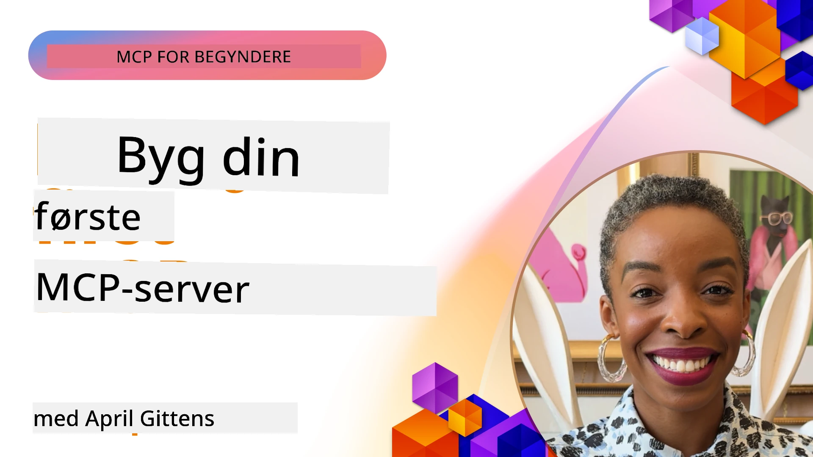

## Kom godt i gang  

_(Klik på billedet ovenfor for at se video af denne lektion)_

Denne sektion består af flere lektioner:

- **1 Din første server**, i denne første lektion vil du lære at oprette din første server og inspicere den med inspektørværktøjet, en værdifuld måde at teste og fejlfinde din server på, [til lektionen](01-first-server/README.md)

- **2 Klient**, i denne lektion vil du lære at skrive en klient, der kan oprette forbindelse til din server, [til lektionen](02-client/README.md)

- **3 Klient med LLM**, en endnu bedre måde at skrive en klient på er ved at tilføje en LLM, så den kan "forhandle" med din server om, hvad der skal gøres, [til lektionen](03-llm-client/README.md)

- **4 Forbrug af en server GitHub Copilot Agent-tilstand i Visual Studio Code**. Her ser vi på at køre vores MCP-server fra Visual Studio Code, [til lektionen](04-vscode/README.md)

- **5 stdio Transport Server** stdio transport er den anbefalede standard for lokal MCP server-til-klient kommunikation, som giver sikker kommunikation baseret på subprocesses med indbygget procesisolation [til lektionen](05-stdio-server/README.md)

- **6 HTTP Streaming med MCP (Streamable HTTP)**. Lær om moderne HTTP streaming transport (den anbefalede tilgang til fjern-MCP-servere ifølge [MCP Specification 2025-11-25](https://spec.modelcontextprotocol.io/specification/2025-11-25/basic/transports/#streamable-http)), fremskridtsmeddelelser og hvordan man implementerer skalerbare, realtids MCP-servere og klienter ved brug af Streamable HTTP. [til lektionen](06-http-streaming/README.md)

- **7 Anvendelse af AI Toolkit til VSCode** for at forbruge og teste dine MCP-klienter og servere [til lektionen](07-aitk/README.md)

- **8 Testning**. Her vil vi især fokusere på, hvordan vi kan teste vores server og klient på forskellige måder, [til lektionen](08-testing/README.md)

- **9 Deployment**. Dette kapitel ser på forskellige måder at udrulle dine MCP-løsninger på, [til lektionen](09-deployment/README.md)

- **10 Avanceret serverbrug**. Dette kapitel omhandler avanceret brug af servere, [til lektionen](./10-advanced/README.md)

- **11 Auth**. Dette kapitel handler om, hvordan man tilføjer simpel autentifikation, fra Basic Auth til brug af JWT og RBAC. Du opfordres til at starte her og derefter se nærmere på Avancerede emner i kapitel 5 og udføre yderligere sikkerhedshærdning via anbefalingerne i kapitel 2, [til lektionen](./11-simple-auth/README.md)

- **12 MCP Hosts**. Konfigurer og brug populære MCP host-klienter inklusiv Claude Desktop, Cursor, Cline og Windsurf. Lær om transporttyper og fejlfinding, [til lektionen](./12-mcp-hosts/README.md)

- **13 MCP Inspector**. Debug og test dine MCP-servere interaktivt ved brug af MCP Inspector-værktøjet. Lær at fejlfinde værktøjer, ressourcer og protokolmeddelelser, [til lektionen](./13-mcp-inspector/README.md)

Model Context Protocol (MCP) er en åben protokol, der standardiserer, hvordan applikationer leverer kontekst til LLM'er. Tænk på MCP som en USB-C-port for AI-applikationer – den leverer en standardiseret måde at forbinde AI-modeller til forskellige datakilder og værktøjer.

## Læringsmål

Ved slutningen af denne lektion vil du være i stand til at:

- Sætte udviklingsmiljøer op for MCP i C#, Java, Python, TypeScript og JavaScript
- Bygge og udrulle grundlæggende MCP-servere med tilpassede funktioner (ressourcer, prompts og værktøjer)
- Oprette host-applikationer, der kan oprette forbindelse til MCP-servere
- Teste og fejlfinde MCP-implementeringer
- Forstå almindelige opsætningsudfordringer og deres løsninger
- Forbinde dine MCP-implementeringer til populære LLM-tjenester

## Opsætning af dit MCP-miljø

Før du begynder at arbejde med MCP, er det vigtigt at forberede dit udviklingsmiljø og forstå den grundlæggende arbejdsproces. Denne sektion vil guide dig gennem de indledende opsætningstrin for at sikre en glidende start med MCP.

### Forudsætninger

Inden du dykker ned i MCP-udvikling, skal du sikre, at du har:

- **Udviklingsmiljø**: For dit valgte sprog (C#, Java, Python, TypeScript eller JavaScript)
- **IDE/Editor**: Visual Studio, Visual Studio Code, IntelliJ, Eclipse, PyCharm eller anden moderne kodeeditor
- **Pakkehåndterere**: NuGet, Maven/Gradle, pip eller npm/yarn
- **API-nøgler**: Til eventuelle AI-tjenester, du planlægger at bruge i dine host-applikationer

### Officielle SDK'er

I de kommende kapitler vil du se løsninger bygget med Python, TypeScript, Java og .NET. Her er alle de officielt understøttede SDK'er.

MCP tilbyder officielle SDK'er til flere sprog (i overensstemmelse med [MCP Specification 2025-11-25](https://spec.modelcontextprotocol.io/specification/2025-11-25/)):
- [C# SDK](https://github.com/modelcontextprotocol/csharp-sdk) - Vedligeholdt i samarbejde med Microsoft
- [Java SDK](https://github.com/modelcontextprotocol/java-sdk) - Vedligeholdt i samarbejde med Spring AI
- [TypeScript SDK](https://github.com/modelcontextprotocol/typescript-sdk) - Den officielle TypeScript-implementering
- [Python SDK](https://github.com/modelcontextprotocol/python-sdk) - Den officielle Python-implementering (FastMCP)
- [Kotlin SDK](https://github.com/modelcontextprotocol/kotlin-sdk) - Den officielle Kotlin-implementering
- [Swift SDK](https://github.com/modelcontextprotocol/swift-sdk) - Vedligeholdt i samarbejde med Loopwork AI
- [Rust SDK](https://github.com/modelcontextprotocol/rust-sdk) - Den officielle Rust-implementering
- [Go SDK](https://github.com/modelcontextprotocol/go-sdk) - Den officielle Go-implementering

## Vigtige pointer

- Opsætning af et MCP-udviklingsmiljø er enkelt med sprog-specifikke SDK'er
- Opbygning af MCP-servere indebærer at oprette og registrere værktøjer med klare skemaer
- MCP-klienter opretter forbindelse til servere og modeller for at udnytte udvidede kapabiliteter
- Test og fejlfinding er afgørende for pålidelige MCP-implementeringer
- Udrulningsmuligheder spænder fra lokal udvikling til cloud-baserede løsninger

## Øvelse

Vi har et sæt eksempler, der supplerer øvelserne, du vil se i alle kapitler i denne sektion. Derudover har hvert kapitel også deres egne øvelser og opgaver

- [Java Calculator](./samples/java/calculator/README.md)
- [.Net Calculator](../../../03-GettingStarted/samples/csharp)
- [JavaScript Calculator](./samples/javascript/README.md)
- [TypeScript Calculator](./samples/typescript/README.md)
- [Python Calculator](../../../03-GettingStarted/samples/python)

## Yderligere ressourcer

- [Byg agenter med Model Context Protocol på Azure](https://learn.microsoft.com/azure/developer/ai/intro-agents-mcp)
- [Remote MCP med Azure Container Apps (Node.js/TypeScript/JavaScript)](https://learn.microsoft.com/samples/azure-samples/mcp-container-ts/mcp-container-ts/)
- [.NET OpenAI MCP Agent](https://learn.microsoft.com/samples/azure-samples/openai-mcp-agent-dotnet/openai-mcp-agent-dotnet/)

## Hvad er næste skridt

Start med den første lektion: [Opret din første MCP server](01-first-server/README.md)

Når du har gennemført denne modul, fortsæt til: [Modul 4: Praktisk implementering](../04-PracticalImplementation/README.md)

---

<!-- CO-OP TRANSLATOR DISCLAIMER START -->
**Ansvarsfraskrivelse**:
Dette dokument er oversat ved hjælp af AI-oversættelsestjenesten [Co-op Translator](https://github.com/Azure/co-op-translator). Selvom vi bestræber os på nøjagtighed, bedes du være opmærksom på, at automatiserede oversættelser kan indeholde fejl eller unøjagtigheder. Det originale dokument på dets oprindelige sprog bør betragtes som den autoritative kilde. For væsentlige oplysninger anbefales professionel menneskelig oversættelse. Vi påtager os intet ansvar for misforståelser eller fejltolkninger, der måtte opstå som følge af brugen af denne oversættelse.
<!-- CO-OP TRANSLATOR DISCLAIMER END -->