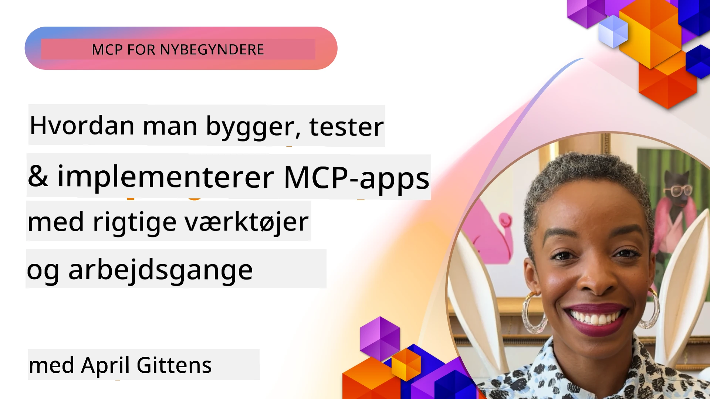
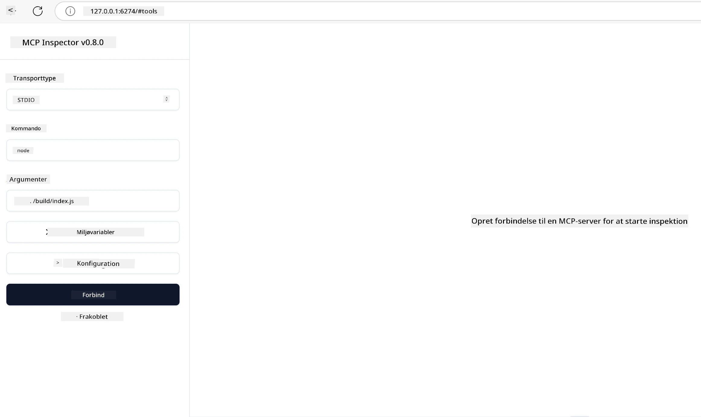

# Praktisk implementering

[](https://youtu.be/vCN9-mKBDfQ)

_(Klik på billedet ovenfor for at se videoen til denne lektion)_

Praktisk implementering er, hvor Model Context Protocols (MCP) kraft bliver håndgribelig. Selvom det er vigtigt at forstå teorien og arkitekturen bag MCP, opstår den virkelige værdi, når du anvender disse koncepter til at bygge, teste og implementere løsninger, der løser virkelige problemer. Dette kapitel bygger bro mellem konceptuel viden og praktisk udvikling og leder dig gennem processen med at bringe MCP-baserede applikationer til live.

Uanset om du udvikler intelligente assistenter, integrerer AI i forretningsprocesser eller bygger specialværktøjer til databehandling, giver MCP et fleksibelt fundament. Dets sprogagnostiske design og officielle SDK’er til populære programmeringssprog gør det tilgængeligt for en bred vifte af udviklere. Ved at udnytte disse SDK’er kan du hurtigt prototype, iterere og skalere dine løsninger på tværs af forskellige platforme og miljøer.

I de følgende sektioner finder du praktiske eksempler, eksempelkode og implementeringsstrategier, der demonstrerer, hvordan man implementerer MCP i C#, Java med Spring, TypeScript, JavaScript og Python. Du lærer også, hvordan du fejlsøger og tester dine MCP-servere, administrerer API’er og implementerer løsninger i skyen ved hjælp af Azure. Disse praktiske ressourcer er designet til at fremskynde din læring og hjælpe dig med sikkert at bygge robuste, produktionsklare MCP-applikationer.

## Oversigt

Denne lektion fokuserer på praktiske aspekter af MCP-implementering på tværs af flere programmeringssprog. Vi vil udforske, hvordan man bruger MCP SDK’er i C#, Java med Spring, TypeScript, JavaScript og Python til at bygge robuste applikationer, fejlsøge og teste MCP-servere samt skabe genanvendelige ressourcer, prompts og værktøjer.

## Læringsmål

Når du er færdig med denne lektion, vil du kunne:

- Implementere MCP-løsninger ved hjælp af officielle SDK’er på forskellige programmeringssprog
- Fejlsøge og teste MCP-servere systematisk
- Oprette og bruge serverfunktioner (Ressourcer, Prompts og Værktøjer)
- Designe effektive MCP-arbejdsprocesser til komplekse opgaver
- Optimere MCP-implementeringer for ydeevne og pålidelighed

## Officielle SDK-ressourcer

Model Context Protocol tilbyder officielle SDK’er til flere sprog (i overensstemmelse med [MCP Specification 2025-11-25](https://spec.modelcontextprotocol.io/specification/2025-11-25/)):

- [C# SDK](https://github.com/modelcontextprotocol/csharp-sdk)
- [Java med Spring SDK](https://github.com/modelcontextprotocol/java-sdk) **Bemærk:** kræver afhængighed af [Project Reactor](https://projectreactor.io). (Se [diskussionsissue 246](https://github.com/orgs/modelcontextprotocol/discussions/246).)
- [TypeScript SDK](https://github.com/modelcontextprotocol/typescript-sdk)
- [Python SDK](https://github.com/modelcontextprotocol/python-sdk)
- [Kotlin SDK](https://github.com/modelcontextprotocol/kotlin-sdk)
- [Go SDK](https://github.com/modelcontextprotocol/go-sdk)

## Arbejde med MCP SDK’er

Denne sektion giver praktiske eksempler på implementering af MCP på tværs af flere programmeringssprog. Du kan finde eksempelkode i `samples`-mappen organiseret efter sprog.

### Tilgængelige eksempler

Arkivet inkluderer [eksempelmulpdateringer](../../../04-PracticalImplementation/samples) i følgende sprog:

- [C#](./samples/csharp/README.md)
- [Java med Spring](./samples/java/containerapp/README.md)
- [TypeScript](./samples/typescript/README.md)
- [JavaScript](./samples/javascript/README.md)
- [Python](./samples/python/README.md)

Hvert eksempel demonstrerer nøglekoncepter og implementeringsmønstre for MCP for det specifikke sprog og økosystem.

### Praktiske guider

Yderligere guider til praktisk MCP-implementering:

- [Pagination og store resultatmængder](./pagination/README.md) – Håndter cursor-baseret paginering for værktøjer, ressourcer og store datamængder

## Kernefunktioner i server

MCP-servere kan implementere enhver kombination af disse funktioner:

### Ressourcer

Ressourcer giver kontekst og data til brugeren eller AI-modellen:

- Dokumentarkiver
- Vidensdatabaser
- Strukturerede datakilder
- Filsystemer

### Prompts

Prompts er skabelonbaserede beskeder og arbejdsprocesser til brugere:

- Foruddefinerede samtaleskabeloner
- Guidede interaktionsmønstre
- Specialiserede dialogstrukturer

### Værktøjer

Værktøjer er funktioner, som AI-modellen kan udføre:

- Databehandlingsværktøjer
- Integrationer med eksterne API’er
- Beregningsfunktioner
- Søgefunktionalitet

## Eksempelleverancer: C#-implementering

Det officielle C# SDK-repository indeholder flere eksempelleverancer, der demonstrerer forskellige aspekter af MCP:

- **Basic MCP Client**: Simpelt eksempel der viser, hvordan man opretter en MCP-klient og kalder værktøjer
- **Basic MCP Server**: Minimal serverimplementering med grundlæggende registrering af værktøjer
- **Advanced MCP Server**: Fuld funktionsdygtig server med registrering af værktøjer, autentificering og fejlhåndtering
- **ASP.NET Integration**: Eksempler, der demonstrerer integration med ASP.NET Core
- **Tool Implementation Patterns**: Forskellige mønstre for implementering af værktøjer med forskellig kompleksitet

MCP C# SDK'et er i preview, og API’er kan ændre sig. Vi vil løbende opdatere denne blog, når SDK’et udvikler sig.

### Nøglefunktioner

- [C# MCP Nuget ModelContextProtocol](https://www.nuget.org/packages/ModelContextProtocol)
- Byg din [første MCP-server](https://devblogs.microsoft.com/dotnet/build-a-model-context-protocol-mcp-server-in-csharp/).

For komplette C# implementeringseksempler, besøg det [officielle C# SDK-eksemplarrepository](https://github.com/modelcontextprotocol/csharp-sdk)

## Eksempelleverance: Java med Spring-implementering

Java med Spring SDK tilbyder robuste MCP-implementeringsmuligheder med features i virksomhedsformat.

### Nøglefunktioner

- Integration med Spring Framework
- Stærk typesikkerhed
- Support for reaktiv programmering
- Omfattende fejlhåndtering

For et komplet Java med Spring implementeringseksempel, se [Java med Spring-eksempel](samples/java/containerapp/README.md) i sample-mappen.

## Eksempelleverance: JavaScript-implementering

JavaScript SDK giver en let og fleksibel tilgang til MCP-implementering.

### Nøglefunktioner

- Node.js og browser-support
- Promise-baseret API
- Nem integration med Express og andre frameworks
- WebSocket-support til streaming

For et komplet JavaScript implementeringseksempel, se [JavaScript-eksempel](samples/javascript/README.md) i sample-mappen.

## Eksempelleverance: Python-implementering

Python SDK tilbyder en Pythonisk tilgang til MCP-implementering med fremragende integrationer til ML-frameworks.

### Nøglefunktioner

- Async/await-support med asyncio
- FastAPI-integration
- Enkel værktøjsregistrering
- Native integration med populære ML-biblioteker

For et komplet Python implementeringseksempel, se [Python-eksempel](samples/python/README.md) i sample-mappen.

## API-administration

Azure API Management er en fremragende løsning på, hvordan vi kan sikre MCP-servere. Ideen er at sætte en Azure API Management-instans foran din MCP-server og lade den håndtere funktioner, du sandsynligvis vil have, som:

- rate limiting
- tokenstyring
- overvågning
- load balancing
- sikkerhed

### Azure-eksempel

Her er et Azure-eksempel, der gør præcis det, altså [opretter en MCP-server og sikrer den med Azure API Management](https://github.com/Azure-Samples/remote-mcp-apim-functions-python).

Se hvordan autorisationsflowet foregår i nedenstående billede:


I det foranstående billede sker følgende:

- Autentificering/autorisation sker ved hjælp af Microsoft Entra.
- Azure API Management fungerer som en gateway og bruger politikker til at dirigere og styre trafik.
- Azure Monitor logger alle anmodninger til yderligere analyse.

#### Autorisationsflow

Lad os kigge nærmere på autorisationsflowet:


#### MCP-autorisationsspecifikation

Læs mere om [MCP Authorization specification](https://spec.modelcontextprotocol.io/specification/2025-11-25/basic/authorization/)

## Implementer fjern-MCP-server til Azure

Lad os se, om vi kan implementere det eksempel, vi nævnte tidligere:

1. Clone repo

    ```bash
    git clone https://github.com/Azure-Samples/remote-mcp-apim-functions-python.git
    cd remote-mcp-apim-functions-python
    ```

1. Registrer `Microsoft.App` resource provider.

   - Hvis du bruger Azure CLI, kør `az provider register --namespace Microsoft.App --wait`.
   - Hvis du bruger Azure PowerShell, kør `Register-AzResourceProvider -ProviderNamespace Microsoft.App`. Kør derefter `(Get-AzResourceProvider -ProviderNamespace Microsoft.App).RegistrationState` efter noget tid for at tjekke, om registreringen er færdig.

1. Kør denne [azd](https://aka.ms/azd) kommando for at provisionere API-managementtjenesten, funktionapp (med kode) og alle andre nødvendige Azure-ressourcer

    ```shell
    azd up
    ```

    Denne kommando skulle implementere alle cloud-ressourcerne på Azure

### Test af din server med MCP Inspector

1. I et **nyt terminalvindue**, installer og kør MCP Inspector

    ```shell
    npx @modelcontextprotocol/inspector
    ```

    Du skulle se en brugerflade, der ligner:

    

1. CTRL-klik for at åbne MCP Inspector webappen via den URL, der vises i appen (fx [http://127.0.0.1:6274/#resources](http://127.0.0.1:6274/#resources))
1. Sæt transporttypen til `SSE`
1. Sæt URL’en til dit kørende API Management SSE-endpoint, der vises efter `azd up`, og **forbind**:

    ```shell
    https://<apim-servicename-from-azd-output>.azure-api.net/mcp/sse
    ```

1. **List Tools**. Klik på et værktøj og **Kør værktøj**.

Hvis alt er gået som det skal, er du nu forbundet til MCP-serveren, og du har kunnet kalde et værktøj.

## MCP-servere til Azure

[Remote-mcp-functions](https://github.com/Azure-Samples/remote-mcp-functions-dotnet): Denne sæt af repositories er et hurtigstarts-template til at bygge og implementere tilpassede fjern-MCP (Model Context Protocol) servere ved hjælp af Azure Functions med Python, C# .NET eller Node/TypeScript.

Eksemplerne giver en komplet løsning, der tillader udviklere at:

- Bygge og køre lokalt: Udvikle og fejlsøge en MCP-server på en lokal maskine
- Implementere til Azure: Let implementere til skyen med en simpel azd up-kommando
- Forbinde fra klienter: Forbinde til MCP-serveren fra forskellige klienter, herunder VS Code’s Copilot agent-tilstand og MCP Inspector-værktøjet

### Nøglefunktioner

- Sikkerhed fra starten: MCP-serveren sikres ved hjælp af nøgler og HTTPS
- Autentificeringsmuligheder: Understøtter OAuth ved brug af indbygget auth og/eller API Management
- Netværksisolation: Tillader netværksisolation ved hjælp af Azure Virtual NETworks (VNET)
- Serverløs arkitektur: Udnytter Azure Functions til skalerbar, hændelsesdrevet udførelse
- Lokal udvikling: Omfattende lokal udvikling og fejlsøgning
- Simpel implementering: Strømlinet implementeringsproces til Azure

Repository’et inkluderer alle nødvendige konfigurationsfiler, kildekode og infrastruktudefinitioner for hurtigt at komme i gang med en produktionsklar MCP-serverimplementering.

- [Azure Remote MCP Functions Python](https://github.com/Azure-Samples/remote-mcp-functions-python) - Eksempelimplementering af MCP ved brug af Azure Functions med Python

- [Azure Remote MCP Functions .NET](https://github.com/Azure-Samples/remote-mcp-functions-dotnet) - Eksempelimplementering af MCP ved brug af Azure Functions med C# .NET

- [Azure Remote MCP Functions Node/Typescript](https://github.com/Azure-Samples/remote-mcp-functions-typescript) - Eksempelimplementering af MCP ved brug af Azure Functions med Node/TypeScript.

## Vigtige pointer

- MCP SDK’er giver sprog-specifikke værktøjer til at implementere robuste MCP-løsninger
- Fejlsøgnings- og testprocessen er afgørende for pålidelige MCP-applikationer
- Genanvendelige promptskabeloner muliggør konsistente AI-interaktioner
- Veludformede arbejdsprocesser kan orkestrere komplekse opgaver ved brug af flere værktøjer
- Implementering af MCP-løsninger kræver overvejelse af sikkerhed, ydeevne og fejlhåndtering

## Øvelse

Design en praktisk MCP-arbejdsproces, der adresserer et virkeligt problem inden for dit område:

1. Identificer 3-4 værktøjer, der ville være nyttige til at løse dette problem
2. Lav et arbejdsprocesskema, der viser, hvordan disse værktøjer interagerer
3. Implementer en grundlæggende version af et af værktøjerne med dit foretrukne sprog
4. Opret en promptskabelon, der vil hjælpe modellen med effektivt at bruge dit værktøj

## Yderligere ressourcer

---

## Hvad kommer der herefter

Næste: [Avancerede emner](../05-AdvancedTopics/README.md)

---

<!-- CO-OP TRANSLATOR DISCLAIMER START -->
**Ansvarsfraskrivelse**:
Dette dokument er blevet oversat ved hjælp af AI-oversættelsestjenesten [Co-op Translator](https://github.com/Azure/co-op-translator). Selvom vi bestræber os på nøjagtighed, bedes du være opmærksom på, at automatiserede oversættelser kan indeholde fejl eller unøjagtigheder. Det oprindelige dokument på dets originale sprog bør betragtes som den autoritative kilde. For kritisk information anbefales professionel menneskelig oversættelse. Vi påtager os intet ansvar for misforståelser eller fejltolkninger, der måtte opstå som følge af brugen af denne oversættelse.
<!-- CO-OP TRANSLATOR DISCLAIMER END -->