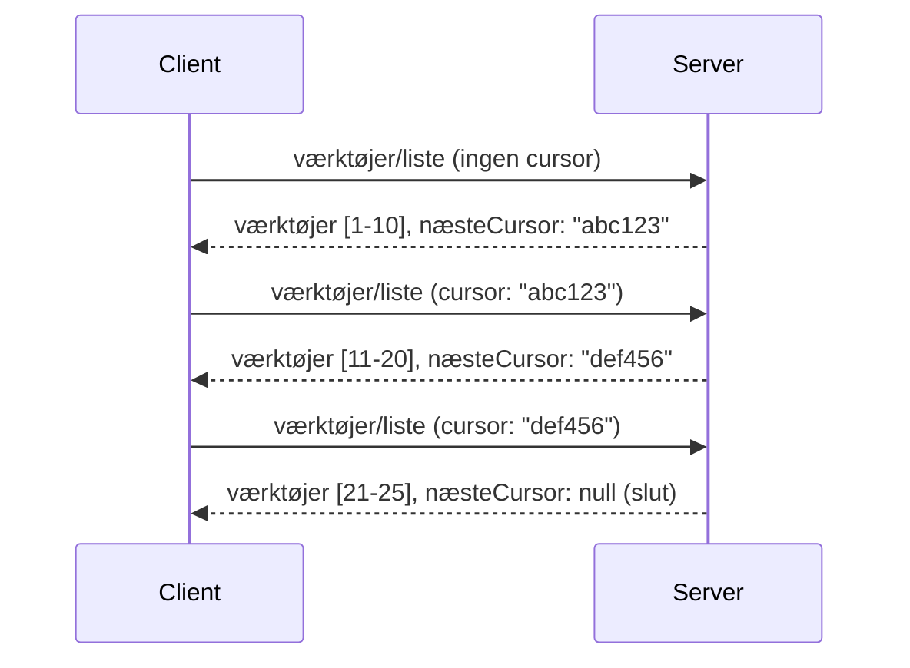

# Paginering og Store Resultatsæt i MCP

Når din MCP-server håndterer store datasæt - hvad enten det er tusindvis af filer, databaseposter eller søgeresultater - har du brug for paginering for effektivt at administrere hukommelsen og levere hurtige brugeroplevelser. Denne vejledning dækker, hvordan du implementerer og bruger paginering i MCP.

## Hvorfor Paginering Er Vigtigt

Uden paginering kan store svar medføre:

- **Hukommelsesudtømning** - Indlæsning af millioner af poster på én gang  
- **Langsomme svartider** - Brugere venter mens alle data indlæses  
- **Timeout-fejl** - Anmodninger overskrider timeout-grænser  
- **Dårlig AI-præstation** - LLM’er har svært ved massiv kontekst  

MCP bruger **cursor-baseret paginering** for pålidelig og konsistent navigation gennem resultatsæt.

---

## Hvordan MCP Paginering Fungerer

### Cursor-konceptet

En **cursor** er en uigennemsigtig streng, der markerer din position i et resultatsæt. Tænk på den som et bogmærke i en lang bog.


### Paginering i MCP-metoder

Disse MCP-metoder understøtter paginering:

| Metode | Returnerer | Cursor-understøttelse |
|--------|------------|-----------------------|
| `tools/list` | Værktøjsdefinitioner | ✅ |
| `resources/list` | Ressourcedefinitioner | ✅ |
| `prompts/list` | Promptdefinitioner | ✅ |
| `resources/templates/list` | Ressemplar skabeloner | ✅ |

---

## Serverimplementering

### Python (FastMCP)

```python
from mcp.server import Server
from mcp.types import Tool, ListToolsResult
import math

app = Server("paginated-server")

# Simuleret stort datasæt
ALL_TOOLS = [
    Tool(name=f"tool_{i}", description=f"Tool number {i}", inputSchema={})
    for i in range(100)
]

PAGE_SIZE = 10

@app.list_tools()
async def list_tools(cursor: str | None = None) -> ListToolsResult:
    """List tools with pagination support."""
    
    # Dekod cursor for at få startindeks
    start_index = 0
    if cursor:
        try:
            start_index = int(cursor)
        except ValueError:
            start_index = 0
    
    # Hent side med resultater
    end_index = min(start_index + PAGE_SIZE, len(ALL_TOOLS))
    page_tools = ALL_TOOLS[start_index:end_index]
    
    # Beregn næste cursor
    next_cursor = None
    if end_index < len(ALL_TOOLS):
        next_cursor = str(end_index)
    
    return ListToolsResult(
        tools=page_tools,
        nextCursor=next_cursor
    )
```

### TypeScript

```typescript
import { Server } from "@modelcontextprotocol/sdk/server/index.js";
import { ListToolsResultSchema } from "@modelcontextprotocol/sdk/types.js";

const server = new Server({
  name: "paginated-server",
  version: "1.0.0"
});

// Simuleret stort datasæt
const ALL_TOOLS = Array.from({ length: 100 }, (_, i) => ({
  name: `tool_${i}`,
  description: `Tool number ${i}`,
  inputSchema: { type: "object", properties: {} }
}));

const PAGE_SIZE = 10;

server.setRequestHandler(ListToolsResultSchema, async (request) => {
  // Dekod cursor
  let startIndex = 0;
  if (request.params?.cursor) {
    startIndex = parseInt(request.params.cursor, 10) || 0;
  }
  
  // Hent side med resultater
  const endIndex = Math.min(startIndex + PAGE_SIZE, ALL_TOOLS.length);
  const pageTools = ALL_TOOLS.slice(startIndex, endIndex);
  
  // Beregn næste cursor
  const nextCursor = endIndex < ALL_TOOLS.length ? String(endIndex) : undefined;
  
  return {
    tools: pageTools,
    nextCursor
  };
});
```

### Java (Spring MCP)

```java
@Service
public class PaginatedToolService {
    
    private static final int PAGE_SIZE = 10;
    private final List<Tool> allTools;
    
    public PaginatedToolService() {
        // Initialiser stort datasæt
        this.allTools = IntStream.range(0, 100)
            .mapToObj(i -> new Tool("tool_" + i, "Tool number " + i, Map.of()))
            .collect(Collectors.toList());
    }
    
    @McpMethod("tools/list")
    public ListToolsResult listTools(@Param("cursor") String cursor) {
        // Dekod cursor
        int startIndex = 0;
        if (cursor != null && !cursor.isEmpty()) {
            try {
                startIndex = Integer.parseInt(cursor);
            } catch (NumberFormatException e) {
                startIndex = 0;
            }
        }
        
        // Hent side med resultater
        int endIndex = Math.min(startIndex + PAGE_SIZE, allTools.size());
        List<Tool> pageTools = allTools.subList(startIndex, endIndex);
        
        // Beregn næste cursor
        String nextCursor = endIndex < allTools.size() ? String.valueOf(endIndex) : null;
        
        return new ListToolsResult(pageTools, nextCursor);
    }
}
```

---

## Klientimplementering

### Python-klient

```python
from mcp import ClientSession

async def get_all_tools(session: ClientSession) -> list:
    """Fetch all tools using pagination."""
    all_tools = []
    cursor = None
    
    while True:
        result = await session.list_tools(cursor=cursor)
        all_tools.extend(result.tools)
        
        if result.nextCursor is None:
            break
        cursor = result.nextCursor
    
    return all_tools

# Anvendelse
async with client_session as session:
    tools = await get_all_tools(session)
    print(f"Found {len(tools)} tools")
```

### TypeScript-klient

```typescript
import { Client } from "@modelcontextprotocol/sdk/client/index.js";

async function getAllTools(client: Client): Promise<Tool[]> {
  const allTools: Tool[] = [];
  let cursor: string | undefined = undefined;
  
  do {
    const result = await client.listTools({ cursor });
    allTools.push(...result.tools);
    cursor = result.nextCursor;
  } while (cursor);
  
  return allTools;
}

// Brug
const tools = await getAllTools(client);
console.log(`Found ${tools.length} tools`);
```

### Lazy loading-mønster

For meget store datasæt kan du indlæse sider efter behov:

```python
class PaginatedToolIterator:
    """Lazily iterate through paginated tools."""
    
    def __init__(self, session: ClientSession):
        self.session = session
        self.cursor = None
        self.buffer = []
        self.exhausted = False
    
    async def __anext__(self):
        # Returner fra buffer hvis tilgængelig
        if self.buffer:
            return self.buffer.pop(0)
        
        # Tjek om vi har gennemgået alle sider
        if self.exhausted:
            raise StopAsyncIteration
        
        # Hent næste side
        result = await self.session.list_tools(cursor=self.cursor)
        self.buffer = list(result.tools)
        self.cursor = result.nextCursor
        
        if self.cursor is None:
            self.exhausted = True
        
        if not self.buffer:
            raise StopAsyncIteration
        
        return self.buffer.pop(0)
    
    def __aiter__(self):
        return self

# Brug - hukommelseseffektiv til store datasæt
async for tool in PaginatedToolIterator(session):
    process_tool(tool)
```

---

## Paginering for Ressourcer

Ressourcer har ofte brug for paginering til mapper eller store datasæt:

```python
from mcp.server import Server
from mcp.types import Resource, ListResourcesResult
import os

app = Server("file-server")

@app.list_resources()
async def list_resources(cursor: str | None = None) -> ListResourcesResult:
    """List files in directory with pagination."""
    
    directory = "/data/files"
    all_files = sorted(os.listdir(directory))
    
    # Dekod cursor (filindeks)
    start_index = int(cursor) if cursor else 0
    page_size = 20
    end_index = min(start_index + page_size, len(all_files))
    
    # Opret ressource liste for denne side
    resources = []
    for filename in all_files[start_index:end_index]:
        filepath = os.path.join(directory, filename)
        resources.append(Resource(
            uri=f"file://{filepath}",
            name=filename,
            mimeType="application/octet-stream"
        ))
    
    # Beregn næste cursor
    next_cursor = str(end_index) if end_index < len(all_files) else None
    
    return ListResourcesResult(
        resources=resources,
        nextCursor=next_cursor
    )
```

---

## Cursor Designstrategier

### Strategi 1: Indeksbaseret (Simpel)

```python
# Cursor er bare indekset
cursor = "50"  # Start ved element 50
```

**Fordele:** Simpel, tilstandsløs  
**Ulemper:** Resultater kan flytte sig, hvis elementer tilføjes/fjernes  

### Strategi 2: ID-baseret (Stabil)

```python
# Cursor er det sidst sete ID
cursor = "item_abc123"  # Start efter dette element
```

**Fordele:** Stabil selvom elementer ændres  
**Ulemper:** Kræver ordnede IDs  

### Strategi 3: Encoded State (Kompleks)

```python
import base64
import json

def encode_cursor(state: dict) -> str:
    return base64.b64encode(json.dumps(state).encode()).decode()

def decode_cursor(cursor: str) -> dict:
    return json.loads(base64.b64decode(cursor).decode())

# Markøren indeholder flere tilstandsfelter
cursor = encode_cursor({
    "offset": 50,
    "filter": "active",
    "sort": "name"
})
```

**Fordele:** Kan kode kompleks tilstand  
**Ulemper:** Mere kompleks, større cursor-strenge  

---

## Bedste Praksis

### 1. Vælg passende sidestørrelser

```python
# Overvej datastørrelsen
PAGE_SIZE_SMALL_ITEMS = 100   # Enkel metadata
PAGE_SIZE_MEDIUM_ITEMS = 20   # Rigere objekter
PAGE_SIZE_LARGE_ITEMS = 5     # Kompleks indhold
```

### 2. Håndter ugyldige cursors yndefuldt

```python
@app.list_tools()
async def list_tools(cursor: str | None = None) -> ListToolsResult:
    try:
        start_index = int(cursor) if cursor else 0
        if start_index < 0 or start_index >= len(ALL_TOOLS):
            start_index = 0  # Nulstil til begyndelsen
    except (ValueError, TypeError):
        start_index = 0  # Ugyldig markør, start forfra
    # ...
```

### 3. Inkluder total antal (valgfrit)

```python
return ListToolsResult(
    tools=page_tools,
    nextCursor=next_cursor,
    # Nogle implementeringer inkluderer total for UI-fremdrift
    _meta={"total": len(ALL_TOOLS)}
)
```

### 4. Test kanttilfælde

```python
async def test_pagination():
    # Tomt resultatsæt
    result = await session.list_tools()
    assert result.tools == []
    assert result.nextCursor is None
    
    # Enkeltside
    result = await session.list_tools()
    assert len(result.tools) <= PAGE_SIZE
    
    # Ugyldig cursor
    result = await session.list_tools(cursor="invalid")
    assert result.tools  # Skal returnere første side
```

---

## Almindelige Faldgruber

### ❌ Returner alle resultater og paginer på klientsiden

```python
# DÅRLIGT: Indlæser alt i hukommelsen
@app.list_tools()
async def list_tools() -> ListToolsResult:
    all_tools = load_all_tools()  # 1 million værktøjer!
    return ListToolsResult(tools=all_tools)
```

### ✅ Paginér ved datakilden

```python
# GODT: Indlæser kun det, der er nødvendigt
@app.list_tools()
async def list_tools(cursor: str | None = None) -> ListToolsResult:
    offset = int(cursor) if cursor else 0
    tools = await db.query_tools(offset=offset, limit=PAGE_SIZE)
    return ListToolsResult(tools=tools, nextCursor=...)
```

---

## Hvad Kommer Nu

- [Modul 5.14 - Context Engineering](../../05-AdvancedTopics/mcp-contextengineering/README.md)  
- [Modul 8 - Bedste praksis](../../08-BestPractices/README.md)  
- [3.8 - Test af din MCP-server](../../03-GettingStarted/08-testing/README.md)  

---

## Yderligere Ressourcer

- [MCP-specifikation - Paginering](https://spec.modelcontextprotocol.io/specification/2025-11-25/)  
- [Cursor-baseret paginering forklaret](https://slack.engineering/evolving-api-pagination-at-slack/)  
- [Python SDK paginerings-tests](https://github.com/modelcontextprotocol/python-sdk/blob/main/tests/client/test_list_methods_cursor.py)

---

<!-- CO-OP TRANSLATOR DISCLAIMER START -->
**Ansvarsfraskrivelse**:
Dette dokument er oversat ved hjælp af AI-oversættelsestjenesten [Co-op Translator](https://github.com/Azure/co-op-translator). Selvom vi stræber efter nøjagtighed, opfordres du til at være opmærksom på, at automatiserede oversættelser kan indeholde fejl eller unøjagtigheder. Det oprindelige dokument på originalsproget bør betragtes som den autoritative kilde. For vigtig information anbefales professionel menneskelig oversættelse. Vi påtager os intet ansvar for eventuelle misforståelser eller fejltolkninger, der opstår som følge af brugen af denne oversættelse.
<!-- CO-OP TRANSLATOR DISCLAIMER END -->