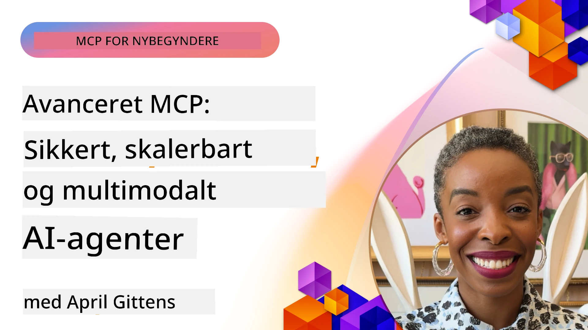

# Avancerede emner i MCP

_(Klik på billedet ovenfor for at se videoen til denne lektion)_

Dette kapitel dækker en række avancerede emner i implementeringen af Model Context Protocol (MCP), herunder multimodal integration, skalerbarhed, sikkerheds bedste praksis og virksomhedsintegration. Disse emner er afgørende for at bygge robuste og produktionsklare MCP-applikationer, som kan opfylde kravene i moderne AI-systemer.

## Oversigt

Denne lektion udforsker avancerede koncepter i implementeringen af Model Context Protocol med fokus på multimodal integration, skalerbarhed, sikkerheds bedste praksis og virksomhedsintegration. Disse emner er væsentlige for at bygge produktionsklare MCP-applikationer, der kan håndtere komplekse krav i virksomhedsmiljøer.

## Læringsmål

Ved slutningen af denne lektion vil du kunne:

- Implementere multimodale kapaciteter inden for MCP-rammer
- Designe skalerbare MCP-arkitekturer til højbelastede scenarier
- Anvende sikkerheds bedste praksis i overensstemmelse med MCP's sikkerhedsprincipper
- Integrere MCP med virksomheders AI-systemer og -rammer
- Optimere ydeevne og pålidelighed i produktionsmiljøer

## Lektioner og eksempler på Projekter

| Link | Titel | Beskrivelse |
|------|-------|-------------|
| [5.1 Integration med Azure](./mcp-integration/README.md) | Integrer med Azure | Lær hvordan du integrerer din MCP Server på Azure |
| [5.2 Multimodal eksempel](./mcp-multi-modality/README.md) | MCP Multimodale eksempler | Eksempler på lyd, billede og multimodal respons |
| [5.3 MCP OAuth2 eksempel](../../../05-AdvancedTopics/mcp-oauth2-demo) | MCP OAuth2 Demo | Minimalt Spring Boot-app, der viser OAuth2 med MCP, både som Autorisations- og Ressourceserver. Demonstrerer sikker tokenudstedelse, beskyttede endpoints, Azure Container Apps-udrulning og API Management-integration. |
| [5.4 Root Contexts](./mcp-root-contexts/README.md) | Root contexts | Lær mere om root context og hvordan man implementerer dem |
| [5.5 Routing](./mcp-routing/README.md) | Routing | Lær om forskellige typer routing |
| [5.6 Sampling](./mcp-sampling/README.md) | Sampling | Lær hvordan man arbejder med sampling |
| [5.7 Skalering](./mcp-scaling/README.md) | Skalering | Lær om skalering |
| [5.8 Sikkerhed](./mcp-security/README.md) | Sikkerhed | Sikr din MCP Server |
| [5.9 Web Search eksempel](./web-search-mcp/README.md) | Web Search MCP | Python MCP-server og klient, der integrerer med SerpAPI til realtids web-, nyheds- og produktsøgning samt Q&A. Demonstrerer multi-værktøj orkestrering, ekstern API-integration og robust fejlhåndtering. |
| [5.10 Realtidsstreaming](./mcp-realtimestreaming/README.md) | Streaming | Realtids data streaming er blevet afgørende i nutidens datadrevne verden, hvor virksomheder og applikationer kræver øjeblikkelig adgang til information for at træffe rettidige beslutninger. |
| [5.11 Realtid Web Search](./mcp-realtimesearch/README.md) | Web Search | Realtid web search og hvordan MCP omformer realtid websearch ved at tilbyde en standardiseret tilgang til kontekststyring på tværs af AI-modeller, søgemaskiner og applikationer. |
| [5.12 Entra ID-autentificering for Model Context Protocol Servers](./mcp-security-entra/README.md) | Entra ID-autentificering | Microsoft Entra ID leverer en robust cloud-baseret identitets- og adgangsstyringsløsning, der hjælper med at sikre, at kun autoriserede brugere og applikationer kan interagere med din MCP-server. |
| [5.13 Azure AI Foundry Agent Integration](./mcp-foundry-agent-integration/README.md) | Azure AI Foundry Integration | Lær hvordan du integrerer Model Context Protocol-servers med Azure AI Foundry-agenter, hvilket muliggør kraftfuld værktøjsorkestrering og virksomheders AI-kapaciteter med standardiserede eksterne datakilde-forbindelser. |
| [5.14 Context Engineering](./mcp-contextengineering/README.md) | Context Engineering | Fremtidige muligheder for teknikker til kontekst engineering for MCP-servere, herunder kontekstoptimering, dynamisk kontekststyring og strategier til effektiv prompt engineering inden for MCP-rammer. |
| [5.15 MCP Custom Transport](./mcp-transport/README.md) | Custom Transport | Lær hvordan man implementerer brugerdefinerede transportmekanismer til specialiserede MCP-kommunikationsscenarier. |
| [5.16 Protokolfunktioner dybdegående](./mcp-protocol-features/README.md) | Protokolfunktioner | Mestring af avancerede protokolfunktioner, inklusiv fremdriftsnotifikationer, anmodningsaflysning, ressource skabeloner og fejlhåndteringsmønstre. |

> **Ny i MCP-specifikationen 2025-11-25**: Specifikationen inkluderer nu eksperimentel understøttelse for **Tasks** (langvarige operationer med sporbar fremdrift), **Tool Annotations** (metadata om værktøjsadfærd for sikkerhed), **URL Mode Elicitation** (anmodning om specifikt URL-indhold fra klienter), og forbedrede **Roots** (til arbejdspladskontekststyring). Se [MCP Specification changelog](https://spec.modelcontextprotocol.io/) for fulde detaljer.

## Yderligere referencer

For den mest opdaterede information om avancerede MCP-emner henvises til:
- [MCP Dokumentation](https://modelcontextprotocol.io/)
- [MCP Specifikation (2025-11-25)](https://spec.modelcontextprotocol.io/specification/2025-11-25/)
- [GitHub Repository](https://github.com/modelcontextprotocol)
- [OWASP MCP Top 10](https://microsoft.github.io/mcp-azure-security-guide/mcp/) - Sikkerhedsrisici og afbødninger
- [MCP Security Summit Workshop (Sherpa)](https://azure-samples.github.io/sherpa/) - Praktisk sikkerhedstræning

## Vigtige punkter

- Multimodale MCP-implementeringer udvider AI-kapaciteter ud over tekstbehandling
- Skalerbarhed er afgørende for virksomheders udrulninger og kan håndteres via horisontal og vertikal skalering
- Omfattende sikkerhedsforanstaltninger beskytter data og sikrer korrekt adgangskontrol
- Virksomhedsintegration med platforme som Azure OpenAI og Microsoft AI Foundry forbedrer MCP-kapaciteter
- Avancerede MCP-implementeringer drager fordel af optimerede arkitekturer og omhyggelig ressourcehåndtering

## Øvelse

Design en MCP-implementering i virksomhedsklasse til et specifikt brugsscenarie:

1. Identificer multimodale krav til dit brugsscenarie
2. Skitser sikkerhedskontroller, der er nødvendige for at beskytte følsomme data
3. Design en skalerbar arkitektur, der kan håndtere varierende belastning
4. Planlæg integrationspunkter med virksomheders AI-systemer
5. Dokumenter potentielle ydeevneflaskehalse og strategier til afhjælpning

## Ekstra ressourcer

- [Azure OpenAI Dokumentation](https://learn.microsoft.com/en-us/azure/ai-services/openai/)
- [Microsoft AI Foundry Dokumentation](https://learn.microsoft.com/en-us/ai-services/)

---

## Hvad er det næste

Udforsk lektionerne i dette modul med start på: [5.1 MCP Integration](./mcp-integration/README.md)

Når du er færdig med dette modul, fortsæt til: [Modul 6: Community Contributions](../06-CommunityContributions/README.md)

---

<!-- CO-OP TRANSLATOR DISCLAIMER START -->
**Ansvarsfraskrivelse**:
Dette dokument er blevet oversat ved hjælp af AI-oversættelsestjenesten [Co-op Translator](https://github.com/Azure/co-op-translator). Selvom vi bestræber os på nøjagtighed, skal du være opmærksom på, at automatiserede oversættelser kan indeholde fejl eller unøjagtigheder. Det oprindelige dokument på dets oprindelige sprog bør betragtes som den autoritative kilde. For kritiske oplysninger anbefales professionel menneskelig oversættelse. Vi påtager os intet ansvar for eventuelle misforståelser eller fejltolkninger, der opstår som følge af brugen af denne oversættelse.
<!-- CO-OP TRANSLATOR DISCLAIMER END -->