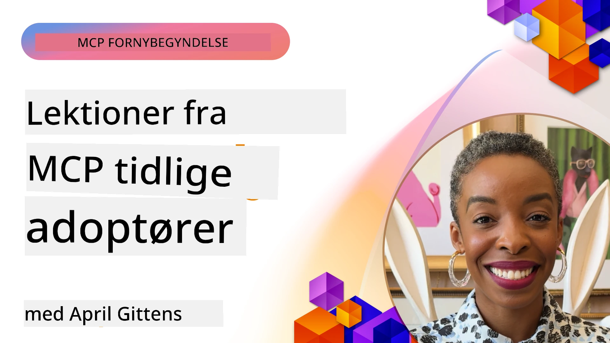

# 🌟 Erfaringer fra Tidlige Brugere

[](https://youtu.be/jds7dSmNptE)

_(Klik på billedet ovenfor for at se videoen af denne lektion)_

## 🎯 Hvad Denne Modul Dækker

Denne modul udforsker, hvordan virkelige organisationer og udviklere udnytter Model Context Protocol (MCP) til at løse faktiske udfordringer og drive innovation. Gennem detaljerede casestudier, praktiske projekter og konkrete eksempler vil du opdage, hvordan MCP muliggør sikker, skalerbar AI-integration, der forbinder sprogmodeller, værktøjer og virksomhedens data.

### 📚 Se MCP i Aktion

Vil du se disse principper anvendt på produktionsklare værktøjer? Tjek vores [**10 Microsoft MCP Servers Der Transformerer Udviklerproduktivitet**](microsoft-mcp-servers.md), som fremviser ægte Microsoft MCP-servere, du kan bruge i dag.

## Oversigt

Denne lektion udforsker, hvordan tidlige brugere har udnyttet Model Context Protocol (MCP) til at løse virkelige udfordringer og fremme innovation på tværs af brancher. Gennem detaljerede casestudier og praktiske projekter vil du se, hvordan MCP muliggør standardiseret, sikker og skalerbar AI-integration — som forbinder store sprogmodeller, værktøjer og virksomhedens data i en samlet ramme. Du får praktisk erfaring med at designe og bygge MCP-baserede løsninger, lærer af velafprøvede implementeringsmønstre og opdager bedste praksis for udrulning af MCP i produktionsmiljøer. Lektionen fremhæver også nye tendenser, fremtidige retninger og open source-ressourcer for at hjælpe dig med at holde dig på forkant med MCP-teknologien og dens udviklende økosystem.

## Læringsmål

- Analysere virkelige MCP-implementeringer på tværs af forskellige brancher  
- Designe og bygge komplette MCP-baserede applikationer  
- Udforske nye tendenser og fremtidige retninger inden for MCP-teknologi  
- Anvende bedste praksis i faktiske udviklingsscenarier  

## Virkelige MCP-Implementeringer

### Casestudie 1: Automatisering af Enterprise Kundesupport

En multinational virksomhed implementerede en MCP-baseret løsning for at standardisere AI-interaktioner på tværs af deres kundesupportsystemer. Dette gjorde det muligt for dem at:

- Oprette en samlet grænseflade for flere LLM-udbydere  
- Opretholde konsistent promptstyring på tværs af afdelinger  
- Implementere robuste sikkerheds- og compliance-kontroller  
- Nem skift mellem forskellige AI-modeller baseret på specifikke behov  

**Teknisk Implementering:**

```python
# Python MCP serverimplementering til kundesupport
import logging
import asyncio
from modelcontextprotocol import create_server, ServerConfig
from modelcontextprotocol.server import MCPServer
from modelcontextprotocol.transports import create_http_transport
from modelcontextprotocol.resources import ResourceDefinition
from modelcontextprotocol.prompts import PromptDefinition
from modelcontextprotocol.tool import ToolDefinition

# Konfigurer logging
logging.basicConfig(level=logging.INFO)

async def main():
    # Opret serverkonfiguration
    config = ServerConfig(
        name="Enterprise Customer Support Server",
        version="1.0.0",
        description="MCP server for handling customer support inquiries"
    )
    
    # Initialiser MCP-server
    server = create_server(config)
    
    # Registrer vidensbase ressourcer
    server.resources.register(
        ResourceDefinition(
            name="customer_kb",
            description="Customer knowledge base documentation"
        ),
        lambda params: get_customer_documentation(params)
    )
    
    # Registrer promptskabeloner
    server.prompts.register(
        PromptDefinition(
            name="support_template",
            description="Templates for customer support responses"
        ),
        lambda params: get_support_templates(params)
    )
    
    # Registrer supportværktøjer
    server.tools.register(
        ToolDefinition(
            name="ticketing",
            description="Create and update support tickets"
        ),
        handle_ticketing_operations
    )
    
    # Start server med HTTP-transport
    transport = create_http_transport(port=8080)
    await server.run(transport)

if __name__ == "__main__":
    asyncio.run(main())
```
  
**Resultater:** 30% reduktion i modelomkostninger, 45% forbedring i svarens konsistens og forbedret compliance på tværs af globale operationer.

### Casestudie 2: Sundhedsdiagnostisk Assistent

En sundhedsudbyder udviklede en MCP-infrastruktur for at integrere flere specialiserede medicinske AI-modeller, samtidig med at følsomme patientdata forblev beskyttet:

- Problemfrit skift mellem generalist- og specialistmedicinske modeller  
- Strenge privatlivskontroller og revisionsspor  
- Integration med eksisterende Electronic Health Record (EHR) systemer  
- Konsistent prompt-udvikling for medicinsk terminologi  

**Teknisk Implementering:**

```csharp
// C# MCP host application implementation in healthcare application
using Microsoft.Extensions.DependencyInjection;
using ModelContextProtocol.SDK.Client;
using ModelContextProtocol.SDK.Security;
using ModelContextProtocol.SDK.Resources;

public class DiagnosticAssistant
{
    private readonly MCPHostClient _mcpClient;
    private readonly PatientContext _patientContext;
    
    public DiagnosticAssistant(PatientContext patientContext)
    {
        _patientContext = patientContext;
        
        // Configure MCP client with healthcare-specific settings
        var clientOptions = new ClientOptions
        {
            Name = "Healthcare Diagnostic Assistant",
            Version = "1.0.0",
            Security = new SecurityOptions
            {
                Encryption = EncryptionLevel.Medical,
                AuditEnabled = true
            }
        };
        
        _mcpClient = new MCPHostClientBuilder()
            .WithOptions(clientOptions)
            .WithTransport(new HttpTransport("https://healthcare-mcp.example.org"))
            .WithAuthentication(new HIPAACompliantAuthProvider())
            .Build();
    }
    
    public async Task<DiagnosticSuggestion> GetDiagnosticAssistance(
        string symptoms, string patientHistory)
    {
        // Create request with appropriate resources and tool access
        var resourceRequest = new ResourceRequest
        {
            Name = "patient_records",
            Parameters = new Dictionary<string, object>
            {
                ["patientId"] = _patientContext.PatientId,
                ["requestingProvider"] = _patientContext.ProviderId
            }
        };
        
        // Request diagnostic assistance using appropriate prompt
        var response = await _mcpClient.SendPromptRequestAsync(
            promptName: "diagnostic_assistance",
            parameters: new Dictionary<string, object>
            {
                ["symptoms"] = symptoms,
                patientHistory = patientHistory,
                relevantGuidelines = _patientContext.GetRelevantGuidelines()
            });
            
        return DiagnosticSuggestion.FromMCPResponse(response);
    }
}
```
  
**Resultater:** Forbedrede diagnostiske forslag til læger samtidig med fuld HIPAA-compliance og markant reduktion i kontekstskift mellem systemer.

### Casestudie 3: Risikostyring i Finansielle Tjenester

En finansiel institution implementerede MCP for at standardisere deres risikostyringsprocesser på tværs af forskellige afdelinger:

- Oprettede en samlet grænseflade for kreditrisiko, svindeldetektion og investeringsrisikomodeller  
- Implementerede strenge adgangskontroller og versionsstyring af modeller  
- Sikrede revisionsevne for alle AI-anbefalinger  
- Opretholdt konsistent dataformat på tværs af forskellige systemer  

**Teknisk Implementering:**

```java
// Java MCP-server til finansiel risikovurdering
import org.mcp.server.*;
import org.mcp.security.*;

public class FinancialRiskMCPServer {
    public static void main(String[] args) {
        // Opret MCP-server med funktioner til finansiel overholdelse
        MCPServer server = new MCPServerBuilder()
            .withModelProviders(
                new ModelProvider("risk-assessment-primary", new AzureOpenAIProvider()),
                new ModelProvider("risk-assessment-audit", new LocalLlamaProvider())
            )
            .withPromptTemplateDirectory("./compliance/templates")
            .withAccessControls(new SOCCompliantAccessControl())
            .withDataEncryption(EncryptionStandard.FINANCIAL_GRADE)
            .withVersionControl(true)
            .withAuditLogging(new DatabaseAuditLogger())
            .build();
            
        server.addRequestValidator(new FinancialDataValidator());
        server.addResponseFilter(new PII_RedactionFilter());
        
        server.start(9000);
        
        System.out.println("Financial Risk MCP Server running on port 9000");
    }
}
```
  
**Resultater:** Forbedret regulatorisk compliance, 40% hurtigere udrulningscyklusser for modeller og forbedret konsistens i risikovurdering på tværs af afdelinger.

### Casestudie 4: Microsoft Playwright MCP Server til Browserautomatisering

Microsoft udviklede [Playwright MCP-serveren](https://github.com/microsoft/playwright-mcp) for at muliggøre sikker, standardiseret browserautomatisering gennem Model Context Protocol. Denne produktionsklare server tillader AI-agenter og LLM'er at interagere med webbrowsere på en kontrolleret, reviderbar og udvidelig måde — hvilket åbner for brugstilfælde som automatiseret webtest, dataudtræk og end-to-end workflows.

> **🎯 Produktionsklart Værktøj**  
>  
> Dette casestudie viser en ægte MCP-server, du kan bruge i dag! Læs mere om Playwright MCP Server og 9 andre produktionsklare Microsoft MCP-servere i vores [**Microsoft MCP Servers Guide**](microsoft-mcp-servers.md#8--playwright-mcp-server).

**Nøglefunktioner:**  
- Eksponerer browserautomatiseringsfunktioner (navigation, formularudfyldning, screenshot-optagelse osv.) som MCP-værktøjer  
- Implementerer strenge adgangskontroller og sandkassemiljø for at forhindre uautoriserede handlinger  
- Leverer detaljerede revisionslogge for alle browserinteraktioner  
- Understøtter integration med Azure OpenAI og andre LLM-udbydere til agent-drevet automatisering  
- Driver GitHub Copilot's Coding Agent med browserfunktioner

**Teknisk Implementering:**

```typescript
// TypeScript: Registrering af Playwright browser-automatiseringsværktøjer i en MCP-server
import { createServer, ToolDefinition } from 'modelcontextprotocol';
import { launch } from 'playwright';

const server = createServer({
  name: 'Playwright MCP Server',
  version: '1.0.0',
  description: 'MCP server for browser automation using Playwright'
});

// Registrer et værktøj til at navigere til en URL og tage et screenshot
server.tools.register(
  new ToolDefinition({
    name: 'navigate_and_screenshot',
    description: 'Navigate to a URL and capture a screenshot',
    parameters: {
      url: { type: 'string', description: 'The URL to visit' }
    }
  }),
  async ({ url }) => {
    const browser = await launch();
    const page = await browser.newPage();
    await page.goto(url);
    const screenshot = await page.screenshot();
    await browser.close();
    return { screenshot };
  }
);

// Start MCP-serveren
server.listen(8080);
```
  
**Resultater:**

- Muliggjorde sikker, programmativ browserautomatisering for AI-agenter og LLM'er  
- Reducerede manuel testindsats og forbedrede testdækningen for webapplikationer  
- Leverede en genanvendelig, udvidelig ramme for browserbaseret værktøjsintegration i virksomheds-miljøer  
- Driver GitHub Copilot's browserfunktioner

**Referencer:**

- [Playwright MCP Server GitHub Repository](https://github.com/microsoft/playwright-mcp)  
- [Microsoft AI and Automation Solutions](https://azure.microsoft.com/en-us/products/ai-services/)

### Casestudie 5: Azure MCP – Enterprise-Grade Model Context Protocol as a Service

Azure MCP Server ([https://aka.ms/azmcp](https://aka.ms/azmcp)) er Microsofts styrede, enterprise-klassificerede implementering af Model Context Protocol designet til at levere skalerbare, sikre og compliant MCP-serverfunktioner som en cloud service. Azure MCP gør det muligt for organisationer hurtigt at udrulle, administrere og integrere MCP-servere med Azure AI, data og sikkerhedstjenester, hvilket reducerer driftsomkostninger og fremskynder AI-adoption.

> **🎯 Produktionsklart Værktøj**  
>  
> Dette er en ægte MCP-server, du kan bruge i dag! Læs mere om Azure AI Foundry MCP Server i vores [**Microsoft MCP Servers Guide**](microsoft-mcp-servers.md).

- Fuldt styret MCP-serverhosting med indbygget skalering, overvågning og sikkerhed  
- Indbygget integration med Azure OpenAI, Azure AI Search og andre Azure-tjenester  
- Enterprise-autentificering og -autorisation via Microsoft Entra ID  
- Understøttelse af brugerdefinerede værktøjer, promptskabeloner og ressourceforbindelser  
- Overholdelse af virksomhedssikkerheds- og regulatoriske krav

**Teknisk Implementering:**

```yaml
# Example: Azure MCP server deployment configuration (YAML)
apiVersion: mcp.microsoft.com/v1
kind: McpServer
metadata:
  name: enterprise-mcp-server
spec:
  modelProviders:
    - name: azure-openai
      type: AzureOpenAI
      endpoint: https://<your-openai-resource>.openai.azure.com/
      apiKeySecret: <your-azure-keyvault-secret>
  tools:
    - name: document_search
      type: AzureAISearch
      endpoint: https://<your-search-resource>.search.windows.net/
      apiKeySecret: <your-azure-keyvault-secret>
  authentication:
    type: EntraID
    tenantId: <your-tenant-id>
  monitoring:
    enabled: true
    logAnalyticsWorkspace: <your-log-analytics-id>
```
  
**Resultater:**  
- Forkortet time-to-value for enterprise AI-projekter ved at levere en klar-til-brug, compliant MCP-serverplatform  
- Forenklet integration af LLM'er, værktøjer og virksomhedens datakilder  
- Forbedret sikkerhed, overvågning og driftseffektivitet for MCP-arbejdsbelastninger  
- Forbedret kodekvalitet med Azure SDK bedste praksisser og aktuelle autentificeringsmønstre

**Referencer:**  
- [Azure MCP Dokumentation](https://aka.ms/azmcp)  
- [Azure MCP Server GitHub Repository](https://github.com/Azure/azure-mcp)  
- [Azure AI Services](https://azure.microsoft.com/en-us/products/ai-services/)  
- [Microsoft MCP Center](https://mcp.azure.com)

## Casestudie 6: NLWeb  
MCP (Model Context Protocol) er en fremspirende protokol for chatbots og AI-assistenter til at interagere med værktøjer. Hver NLWeb-instanse er også en MCP-server, som understøtter én kerne-metode, ask, der bruges til at stille et spørgsmål til et website i naturligt sprog. Det returnerede svar udnytter schema.org, et bredt anvendt vokabularium til beskrivelse af webdata. Løst sagt er MCP for NLWeb, hvad Http er for HTML. NLWeb kombinerer protokoller, Schema.org-formater og eksempel kode for at hjælpe sites med hurtigt at skabe disse endpoints, så både mennesker via konversationelle grænseflader og maskiner via naturlig agent-til-agent-interaktion får forbedret adgang.

Der er to adskilte komponenter i NLWeb.  
- En protokol, meget simpel i starten, til at interfacere med et site i naturligt sprog og et format, der udnytter json og schema.org for det returnerede svar. Se dokumentationen om REST API for flere detaljer.  
- En ligetil implementering af (1), der udnytter eksisterende markup, for sites, som kan abstraheres som lister over elementer (produkter, opskrifter, seværdigheder, anmeldelser osv.). Sammen med et sæt brugergrænsefladevægte kan sites nemt tilbyde konversationelle grænseflader til deres indhold. Se dokumentationen om Life of a chat query for flere detaljer om hvordan dette fungerer.

**Referencer:**  
- [Azure MCP Dokumentation](https://aka.ms/azmcp)  
- [NLWeb](https://github.com/microsoft/NlWeb)

### Casestudie 7: Azure AI Foundry MCP Server – Enterprise AI Agent Integration

Azure AI Foundry MCP-servere demonstrerer, hvordan MCP kan bruges til at orkestrere og administrere AI-agenter og workflows i virksomheds-miljøer. Ved at integrere MCP med Azure AI Foundry kan organisationer standardisere agentinteraktioner, udnytte Foundrys workflowstyring og sikre sikre, skalerbare udrulninger.

> **🎯 Produktionsklart Værktøj**  
>  
> Dette er en ægte MCP-server, du kan bruge i dag! Læs mere om Azure AI Foundry MCP Server i vores [**Microsoft MCP Servers Guide**](microsoft-mcp-servers.md#9--azure-ai-foundry-mcp-server).

**Nøglefunktioner:**  
- Omfattende adgang til Azures AI-økosystem, inklusive modelkataloger og udrulningsstyring  
- Videnindeksering med Azure AI Search til RAG-applikationer  
- Evalueringsværktøjer til AI-modellers ydeevne og kvalitetskontrol  
- Integration med Azure AI Foundry Catalog og Labs til avancerede forskningsmodeller  
- Agentstyring og evalueringskapaciteter til produktionsscenarier  

**Resultater:**  
- Hurtig prototyping og robust overvågning af workflows med AI-agenter  
- Problemfri integration med Azure AI-tjenester til avancerede scenarier  
- En samlet grænseflade til at bygge, udrulle og overvåge agent-pipelines  
- Forbedret sikkerhed, compliance og driftseffektivitet for virksomheder  
- Acceleration af AI-adoption samtidig med kontrol over komplekse agentdrevne processer  

**Referencer:**  
- [Azure AI Foundry MCP Server GitHub Repository](https://github.com/azure-ai-foundry/mcp-foundry)  
- [Integrating Azure AI Agents with MCP (Microsoft Foundry Blog)](https://devblogs.microsoft.com/foundry/integrating-azure-ai-agents-mcp/)

### Casestudie 8: Foundry MCP Playground – Eksperimentering og Prototyping

Foundry MCP Playground tilbyder et klar-til-brug-miljø til at eksperimentere med MCP-servere og Azure AI Foundry-integrationer. Udviklere kan hurtigt prototype, teste og evaluere AI-modeller og agentworkflows ved brug af ressourcer fra Azure AI Foundry Catalog og Labs. Playgrounden effektiviserer opsætning, leverer eksempler på projekter og understøtter samarbejdsdrevet udvikling, hvilket gør det nemt at udforske bedste praksis og nye scenarier med minimal overhead. Den er særligt nyttig for teams, der ønsker at validere idéer, dele eksperimenter og fremskynde læring uden behov for kompleks infrastruktur. Ved at sænke adgangsbarrieren hjælper playgrounden med at fremme innovation og fællesskabsbidrag inden for MCP- og Azure AI Foundry-økosystemet.

**Referencer:**  

- [Foundry MCP Playground GitHub Repository](https://github.com/azure-ai-foundry/foundry-mcp-playground)

### Casestudie 9: Microsoft Learn Docs MCP Server – AI-drevet Dokumentationsadgang

Microsoft Learn Docs MCP Server er en cloud-hosted service, der giver AI-assistenter realtidsadgang til officielt Microsoft-dokumentation via Model Context Protocol. Denne produktionsklare server forbinder til det omfattende Microsoft Learn-økosystem og muliggør semantisk søgning på tværs af alle officielle Microsoft-kilder.

> **🎯 Produktionsklart Værktøj**  
>  
> Dette er en ægte MCP-server, du kan bruge i dag! Læs mere om Microsoft Learn Docs MCP Server i vores [**Microsoft MCP Servers Guide**](microsoft-mcp-servers.md#1--microsoft-learn-docs-mcp-server).

**Nøglefunktioner:**  
- Realtidsadgang til officiel Microsoft dokumentation, Azure-dokumenter og Microsoft 365-dokumentation  
- Avancerede semantiske søgefunktioner, der forstår kontekst og hensigt  
- Altid opdateret information, efterhånden som Microsoft Learn-indhold udgives  
- Omfattende dækning på tværs af Microsoft Learn, Azure-dokumentation og Microsoft 365-kilder  
- Returnerer op til 10 indholdsstykker af høj kvalitet med artikeltitler og URL'er  

**Hvorfor Det Er Kritisk:**  
- Løser problemet med "forældet AI-viden" for Microsoft-teknologier  
- Sikrer, at AI-assistenter har adgang til de nyeste .NET, C#, Azure og Microsoft 365-funktioner  
- Tilbyder autoritativ, førstepartsinformation til præcis kodegenerering  
- Vigtig for udviklere, der arbejder med hurtigt udviklende Microsoft-teknologier  

**Resultater:**  
- Markant forbedret nøjagtighed af AI-genereret kode for Microsoft-teknologier  
- Mindsket tid brugt på at søge efter aktuel dokumentation og bedste praksis  
- Forbedret udviklerproduktivitet med kontekstbevidst dokumentationshentning  
- Problemfri integration med udviklingsarbejdsgange uden at forlade IDE  

**Referencer:**  
- [Microsoft Learn Docs MCP Server GitHub Repository](https://github.com/MicrosoftDocs/mcp)  
- [Microsoft Learn Dokumentation](https://learn.microsoft.com/)

## Praktiske Projekter

### Projekt 1: Byg en Multi-Provider MCP Server

**Mål:** Skab en MCP-server, der kan rute forespørgsler til flere AI-modeludbydere baseret på specifikke kriterier.

**Krav:**

- Understøt mindst tre forskellige modeludbydere (f.eks. OpenAI, Anthropic, lokale modeller)  
- Implementer en routing-mekanisme baseret på forespørgselsmetadata  
- Opret et konfigurationssystem til styring af udbyder-legitimationsoplysninger  
- Tilføj caching for at optimere ydeevne og omkostninger  
- Byg et simpelt dashboard til overvågning af brug  

**Implementeringstrin:**

1. Opsæt grundlæggende MCP-serverinfrastruktur  
2. Implementer udbyder-adaptere for hver AI-modeltjeneste  
3. Opret routing-logikken baseret på forespørgselsattributter  
4. Tilføj caching-mekanismer for hyppige forespørgsler  
5. Udvikl overvågningsdashboard  
6. Test med forskellige forespørgselsmønstre  

**Teknologier:** Vælg mellem Python (.NET/Java/Python efter eget valg), Redis til caching og et simpelt webframework til dashboard.

### Projekt 2: Enterprise Prompt Management System
**Mål:** Udvikle et MCP-baseret system til håndtering, versionering og implementering af promptskabeloner på tværs af en organisation.

**Krav:**

- Opret et centraliseret repository til promptskabeloner
- Implementer versionering og godkendelses-workflows
- Byg testfunktioner til skabeloner med eksemplariske input
- Udvikl rollebaseret adgangskontrol
- Opret en API til hentning og implementering af skabeloner

**Implementeringstrin:**

1. Design databaseskemaet til skabelonlagring
2. Opret kernens API til CRUD-operationer på skabeloner
3. Implementer versionsstyringssystemet
4. Byg godkendelsesworkflowet
5. Udvikl testframeworket
6. Opret en simpel webgrænseflade til administration
7. Integrer med en MCP-server

**Teknologier:** Dit valg af backend-framework, SQL- eller NoSQL-database samt et frontend-framework til administrationsgrænsefladen.

### Projekt 3: MCP-baseret platform til indholdsgenerering

**Mål:** Byg en platform til indholdsgenerering, der udnytter MCP til at levere konsistente resultater på tværs af forskellige indholdstyper.

**Krav:**

- Understøt flere indholdsformater (blogindlæg, sociale medier, marketingtekst)
- Implementer skabelonbaseret generering med tilpasningsmuligheder
- Opret et system til indholdsfeedback og gennemgang
- Spor præstationsmålinger for indhold
- Understøt versionering og iteration af indhold

**Implementeringstrin:**

1. Sæt MCP-klientinfrastrukturen op
2. Opret skabeloner til forskellige indholdstyper
3. Byg indholdsgenereringspipeline
4. Implementer gennemgangssystemet
5. Udvikl systemet til sporing af målinger
6. Opret en brugergrænseflade til skabelonstyring og indholdsgenerering

**Teknologier:** Dit foretrukne programmeringssprog, webframework og databasesystem.

## Fremtidige retninger for MCP-teknologi

### Fremspirende trends

1. **Multi-modal MCP**
   - Udvidelse af MCP til at standardisere interaktioner med billed-, lyd- og videomodeller
   - Udvikling af tvær-modal ræsonneringsevner
   - Standardiserede promptformater til forskellige modaliteter

2. **Federeret MCP-infrastruktur**
   - Distribuerede MCP-netværk, der kan dele ressourcer på tværs af organisationer
   - Standardiserede protokoller til sikker modelldeling
   - Privatlivsbevarende beregningsteknikker

3. **MCP-markedspladser**
   - Økosystemer til deling og kommercialisering af MCP-skabeloner og plugins
   - Kvalitetssikring og certificeringsprocesser
   - Integration med modelmarkedspladser

4. **MCP til edge computing**
   - Tilpasning af MCP-standarder til ressourcebegrænsede edge-enheder
   - Optimerede protokoller til lavbåndsbredde-miljøer
   - Specialiserede MCP-implementeringer til IoT-økosystemer

5. **Regulatoriske rammer**
   - Udvikling af MCP-udvidelser til overholdelse af regler
   - Standardiserede revisionsspor og forklaringsgrænseflader
   - Integration med fremspirende AI-styringsrammer

### MCP-løsninger fra Microsoft

Microsoft og Azure har udviklet flere open source-repositorier for at hjælpe udviklere med at implementere MCP i forskellige scenarier:

#### Microsoft-organisationen

1. [playwright-mcp](https://github.com/microsoft/playwright-mcp) - En Playwright MCP-server til browserautomatisering og test
2. [files-mcp-server](https://github.com/microsoft/files-mcp-server) - En OneDrive MCP-serverimplementering til lokal test og fællesskabsbidrag
3. [NLWeb](https://github.com/microsoft/NlWeb) - NLWeb er en samling af åbne protokoller og associerede open source-værktøjer. Hovedfokus er at etablere et grundlæggende lag til AI Web

#### Azure-Samples organisationen

1. [mcp](https://github.com/Azure-Samples/mcp) - Links til eksempler, værktøjer og ressourcer til at bygge og integrere MCP-servere på Azure med flere sprog
2. [mcp-auth-servers](https://github.com/Azure-Samples/mcp-auth-servers) - Reference MCP-servere, der demonstrerer autentificering med den aktuelle Model Context Protocol-specifikation
3. [remote-mcp-functions](https://github.com/Azure-Samples/remote-mcp-functions) - Landingsside for Remote MCP Server-implementeringer i Azure Functions med links til sprogspecifikke repositories
4. [remote-mcp-functions-python](https://github.com/Azure-Samples/remote-mcp-functions-python) - Quickstart-skabelon til at bygge og implementere brugerdefinerede remote MCP-servere med Azure Functions i Python
5. [remote-mcp-functions-dotnet](https://github.com/Azure-Samples/remote-mcp-functions-dotnet) - Quickstart-skabelon til at bygge og implementere brugerdefinerede remote MCP-servere med Azure Functions i .NET/C#
6. [remote-mcp-functions-typescript](https://github.com/Azure-Samples/remote-mcp-functions-typescript) - Quickstart-skabelon til at bygge og implementere brugerdefinerede remote MCP-servere med Azure Functions i TypeScript
7. [remote-mcp-apim-functions-python](https://github.com/Azure-Samples/remote-mcp-apim-functions-python) - Azure API Management som AI Gateway til Remote MCP-servere med Python
8. [AI-Gateway](https://github.com/Azure-Samples/AI-Gateway) - APIM ❤️ AI-eksperimenter inklusive MCP-funktionalitet, integration med Azure OpenAI og AI Foundry

Disse repositories giver forskellige implementeringer, skabeloner og ressourcer til arbejde med Model Context Protocol på tværs af forskellige programmeringssprog og Azure-tjenester. De dækker et bredt anvendelsesområde fra grundlæggende serverimplementeringer til autentificering, cloud-implementering og enterprise-integration.

#### MCP Resources Directory

[Zdokumentationsmappen MCP Resources](https://github.com/microsoft/mcp/tree/main/Resources) i det officielle Microsoft MCP-repository tilbyder en kurateret samling af eksempler på ressourcer, promptskabeloner og værktøjsdefinitioner til brug med Model Context Protocol-servere. Denne mappe er designet til at hjælpe udviklere hurtigt i gang med MCP ved at tilbyde genanvendelige byggesten og best practice-eksempler for:

- **Promptskabeloner:** Klar-til-brug skabeloner til almindelige AI-opgaver og scenarier, som kan tilpasses dine egne MCP-serverimplementeringer.
- **Værktøjsdefinitioner:** Eksempelværktøjsskemaer og metadata til standardisering af værktøjsintegration og -kald på tværs af forskellige MCP-servere.
- **Ressourceeksempler:** Eksempeldefinitioner til at forbinde til datakilder, API’er og eksterne tjenester inden for MCP-rammen.
- **Referenceimplementeringer:** Praktiske eksempler, der demonstrerer, hvordan man strukturerer og organiserer ressourcer, prompts og værktøjer i virkelige MCP-projekter.

Disse ressourcer fremmer hurtigere udvikling, standardisering og sikrer best practices ved opbygning og implementering af MCP-baserede løsninger.

#### MCP Resources Directory

- [MCP ressourcer (eksempelpå prompts, værktøjer og ressourcedefinitioner)](https://github.com/microsoft/mcp/tree/main/Resources)

### Forskningsmuligheder

- Effektive promptoptimeringsteknikker inden for MCP-rammer
- Sikkerhedsmodeller til multi-tenant MCP-implementeringer
- Ydelsesmålinger på tværs af forskellige MCP-implementeringer
- Formelle verifikationsmetoder til MCP-servere

## Konklusion

Model Context Protocol (MCP) former hurtigt fremtiden for standardiseret, sikker og interoperabel AI-integration på tværs af brancher. Gennem casestudier og praktiske projekter i denne lektion har du set, hvordan tidlige brugere - inklusive Microsoft og Azure - udnytter MCP til at løse virkelige udfordringer, fremskynde AI-adoption og sikre overholdelse, sikkerhed og skalerbarhed. MCP’s modulære tilgang gør det muligt for organisationer at forbinde store sprogmodeller, værktøjer og virksomhedsdata i en samlet, reviderbar ramme. Efterhånden som MCP udvikler sig, vil det være afgørende at forblive engageret i fællesskabet, udforske open source-ressourcer og anvende best practices til at bygge robuste, fremtidsklare AI-løsninger.

## Yderligere ressourcer

- [MCP Foundry GitHub-repository](https://github.com/azure-ai-foundry/mcp-foundry)
- [Foundry MCP Playground](https://github.com/azure-ai-foundry/foundry-mcp-playground)
- [Integration af Azure AI-agenter med MCP (Microsoft Foundry Blog)](https://devblogs.microsoft.com/foundry/integrating-azure-ai-agents-mcp/)
- [MCP GitHub-repository (Microsoft)](https://github.com/microsoft/mcp)
- [MCP Resources Directory (eksempelpå prompts, værktøjer og ressourcedefinitioner)](https://github.com/microsoft/mcp/tree/main/Resources)
- [MCP-fællesskab & dokumentation](https://modelcontextprotocol.io/introduction)
- [MCP specifikation (2025-11-25)](https://spec.modelcontextprotocol.io/specification/2025-11-25/)
- [Azure MCP dokumentation](https://aka.ms/azmcp)
- [OWASP MCP Top 10](https://microsoft.github.io/mcp-azure-security-guide/mcp/) - Sikkerhedsbest practices
- [Playwright MCP Server GitHub-repository](https://github.com/microsoft/playwright-mcp)
- [Files MCP Server (OneDrive)](https://github.com/microsoft/files-mcp-server)
- [Azure-Samples MCP](https://github.com/Azure-Samples/mcp)
- [MCP Auth Servers (Azure-Samples)](https://github.com/Azure-Samples/mcp-auth-servers)
- [Remote MCP Functions (Azure-Samples)](https://github.com/Azure-Samples/remote-mcp-functions)
- [Remote MCP Functions Python (Azure-Samples)](https://github.com/Azure-Samples/remote-mcp-functions-python)
- [Remote MCP Functions .NET (Azure-Samples)](https://github.com/Azure-Samples/remote-mcp-functions-dotnet)
- [Remote MCP Functions TypeScript (Azure-Samples)](https://github.com/Azure-Samples/remote-mcp-functions-typescript)
- [Remote MCP APIM Functions Python (Azure-Samples)](https://github.com/Azure-Samples/remote-mcp-apim-functions-python)
- [AI-Gateway (Azure-Samples)](https://github.com/Azure-Samples/AI-Gateway)
- [Microsoft AI og automatiseringsløsninger](https://azure.microsoft.com/en-us/products/ai-services/)

## Øvelser

1. Analyser et af casestudierne og foreslå en alternativ implementeringsmetode.
2. Vælg et af projektidéerne og skab en detaljeret teknisk specifikation.
3. Undersøg en branche, der ikke er dækket i casestudierne, og skitser hvordan MCP kunne løse dens specifikke udfordringer.
4. Undersøg en af de fremtidige retninger og udvikl et koncept for en ny MCP-udvidelse til støtte heraf.

## Hvad er næste skridt

Udforsk mere: [Microsoft MCP Servers](./microsoft-mcp-servers.md)

Fortsæt til: [Modul 8: Best Practices](../08-BestPractices/README.md)

---

<!-- CO-OP TRANSLATOR DISCLAIMER START -->
**Ansvarsfraskrivelse**:
Dette dokument er blevet oversat ved hjælp af AI-oversættelsestjenesten [Co-op Translator](https://github.com/Azure/co-op-translator). Selvom vi bestræber os på nøjagtighed, skal du være opmærksom på, at automatiserede oversættelser kan indeholde fejl eller unøjagtigheder. Det oprindelige dokument på dets oprindelige sprog bør betragtes som den autoritative kilde. For kritisk information anbefales professionel menneskelig oversættelse. Vi påtager os intet ansvar for misforståelser eller fejltolkninger, der opstår som følge af brugen af denne oversættelse.
<!-- CO-OP TRANSLATOR DISCLAIMER END -->