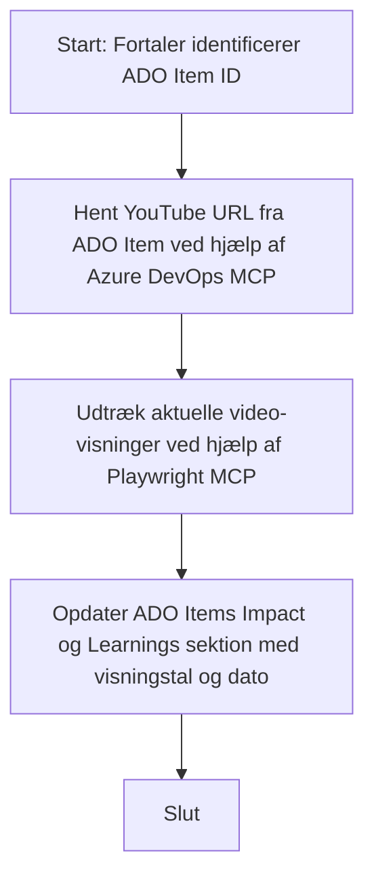

# Case Study: Opdatering af Azure DevOps-elementer med YouTube-data ved hjælp af MCP

> **Ansvarsfraskrivelse:** Der findes eksisterende onlineværktøjer og rapporter, der kan automatisere processen med at opdatere Azure DevOps-elementer med data fra platforme som YouTube. Det følgende scenarie er udelukkende givet som en eksempelbrugssag for at illustrere, hvordan MCP-værktøjer kan anvendes til automatisering og integration.

## Oversigt

Denne case study demonstrerer et eksempel på, hvordan Model Context Protocol (MCP) og dets værktøjer kan bruges til at automatisere processen med at opdatere Azure DevOps (ADO) arbejdsopgaver med information hentet fra onlineplatforme som YouTube. Det beskrevne scenarie er blot en illustration af de bredere muligheder for disse værktøjer, som kan tilpasses mange lignende automatiseringsbehov.

I dette eksempel sporer en Advocate online sessioner ved hjælp af ADO-elementer, hvor hvert element indeholder en YouTube-video-URL. Ved at udnytte MCP-værktøjer kan Advocaten holde ADO-elementer opdateret med de seneste videometrier, såsom visningstal, på en gentagelig og automatiseret måde. Denne tilgang kan generaliseres til andre brugssager, hvor information fra onlinekilder skal integreres i ADO eller andre systemer.

## Scenarie

En Advocate er ansvarlig for at spore effekten af online sessioner og fællesskabsengagementer. Hver session registreres som et ADO-arbejdsitem i 'DevRel'-projektet, og arbejdsitemet indeholder et felt til YouTube-videoens URL. For præcist at rapportere sessionens rækkevidde skal Advocaten opdatere ADO-elementet med det aktuelle antal videovisninger og datoen, hvor denne information blev hentet.

## Anvendte værktøjer

- [Azure DevOps MCP](https://github.com/microsoft/azure-devops-mcp): Muliggør programmatisk adgang til og opdatering af ADO-arbejdsopgaver via MCP.
- [Playwright MCP](https://github.com/microsoft/playwright-mcp): Automatiserer browserhandlinger for at udtrække live data fra websider, såsom YouTube-video-statistik.

## Trinvise arbejdsgang

1. **Identificer ADO-elementet**: Start med ADO-arbejdsitem-ID (f.eks. 1234) i 'DevRel'-projektet.
2. **Hent YouTube-URL**: Brug Azure DevOps MCP-værktøjet til at få YouTube-URL'en fra arbejdsitemet.
3. **Udtræk visninger af video**: Brug Playwright MCP-værktøjet til at navigere til YouTube-URL'en og udtrække det aktuelle antal visninger.
4. **Opdater ADO-elementet**: Skriv det seneste antal visninger og datoen for hentningen i sektionen 'Impact and Learnings' på ADO-arbejdsitemet ved hjælp af Azure DevOps MCP-værktøjet.

## Eksempelprompt

```bash
- Work with the ADO Item ID: 1234
- The project is '2025-Awesome'
- Get the YouTube URL for the ADO item
- Use Playwright to get the current views from the YouTube video
- Update the ADO item with the current video views and the updated date of the information
```

## Mermaid Flowchart


## Teknisk implementering

- **MCP Orkestrering**: Arbejdsgangen orkestreres af en MCP-server, som koordinerer brugen af både Azure DevOps MCP og Playwright MCP-værktøjer.
- **Automatisering**: Processen kan trigges manuelt eller planlægges til at køre med regelmæssige intervaller for at holde ADO-elementer opdaterede.
- **Udvidelsesmuligheder**: Det samme mønster kan udvides til at opdatere ADO-elementer med andre online metrikker (fx likes, kommentarer) eller fra andre platforme.

## Resultater og effekt

- **Effektivitet**: Reducerer manuel indsats for Advocates ved at automatisere hentning og opdatering af videometrier.
- **Nøjagtighed**: Sikrer, at ADO-elementer afspejler de mest aktuelle data tilgængelige fra onlinekilder.
- **Gentagelighed**: Giver en genanvendelig arbejdsgang til lignende scenarier med andre datakilder eller metrikker.

## Referencer

- [Azure DevOps MCP](https://github.com/microsoft/azure-devops-mcp)
- [Playwright MCP](https://github.com/microsoft/playwright-mcp)
- [Model Context Protocol (MCP)](https://modelcontextprotocol.io/)

## Hvad er næste skridt

- Tilbage til: [Case Studies Overview](./README.md)
- Næste: [Real-Time Documentation Retrieval with MCP](./docs-mcp/README.md)

---

<!-- CO-OP TRANSLATOR DISCLAIMER START -->
**Ansvarsfraskrivelse**:
Dette dokument er oversat ved hjælp af AI-oversættelsestjenesten [Co-op Translator](https://github.com/Azure/co-op-translator). Selvom vi bestræber os på nøjagtighed, bedes du være opmærksom på, at automatiserede oversættelser kan indeholde fejl eller unøjagtigheder. Det originale dokument på dets oprindelige sprog bør betragtes som den autoritative kilde. For kritiske oplysninger anbefales professionel menneskelig oversættelse. Vi er ikke ansvarlige for eventuelle misforståelser eller fejltolkninger, der opstår som følge af brugen af denne oversættelse.
<!-- CO-OP TRANSLATOR DISCLAIMER END -->