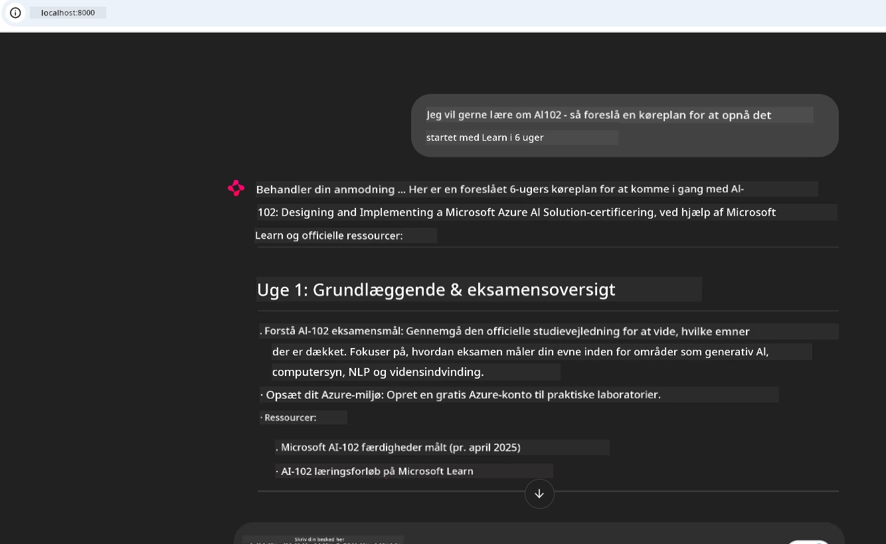

# Case Study: Opret forbindelse til Microsoft Learn Docs MCP-serveren fra en klient

Har du nogensinde prøvet at jonglere mellem dokumentationssider, Stack Overflow og uendelige søgemaskinefaner, alt imens du forsøger at løse et problem i din kode? Måske har du en anden skærm kun til dokumentation, eller du skifter konstant mellem din IDE og en browser. Ville det ikke være bedre, hvis du kunne få dokumentationen direkte ind i din arbejdsproces—integreret i dine apps, din IDE eller endda dine egne brugerdefinerede værktøjer? I denne case study vil vi udforske, hvordan du gør netop det ved at oprette forbindelse direkte til Microsoft Learn Docs MCP-serveren fra din egen klientapplikation.

## Oversigt

Moderne udvikling handler om mere end bare at skrive kode—det handler om at finde den rigtige information på det rigtige tidspunkt. Dokumentation findes overalt, men sjældent hvor du har mest brug for det: inde i dine værktøjer og arbejdsprocesser. Ved at integrere dokumentationshentning direkte i dine applikationer kan du spare tid, reducere kontekstskift og øge produktiviteten. I denne sektion vil vi vise dig, hvordan du opretter forbindelse til Microsoft Learn Docs MCP-serveren, så du kan få adgang til realtids-, kontekstbevidst dokumentation uden nogensinde at forlade din app.

Vi vil gennemgå processen med at etablere en forbindelse, sende en forespørgsel og håndtere streaming-svar effektivt. Denne tilgang effektiviserer ikke kun din arbejdsproces, men åbner også døren for at bygge smartere, mere hjælpsomme udviklerværktøjer.

## Læringsmål

Hvorfor gør vi dette? Fordi de bedste udvikleroplevelser er dem, der fjerner friktion. Forestil dig en verden, hvor din kodeeditor, chatbot eller webapp kan besvare dine dokumentationsspørgsmål øjeblikkeligt ved hjælp af det nyeste indhold fra Microsoft Learn. Når du har gennemgået dette kapitel, vil du kunne:

- Forstå grundlæggende MCP-server-klient kommunikation for dokumentation
- Implementere en konsol- eller webapplikation til at forbinde til Microsoft Learn Docs MCP-serveren
- Bruge streaming HTTP-klienter til realtidsdokumentationshentning
- Logge og fortolke dokumentationssvar i din applikation

Du vil se, hvordan disse færdigheder kan hjælpe dig med at bygge værktøjer, som ikke blot er reaktive, men virkelig interaktive og kontekstbevidste.

## Scenario 1 - Realtidsdokumentationshentning med MCP

I dette scenarie viser vi, hvordan du opretter forbindelse til Microsoft Learn Docs MCP-serveren, så du kan få adgang til realtids-, kontekstbevidst dokumentation uden nogensinde at forlade din app. 

Lad os omsætte det til praksis. Din opgave er at skrive en app, der opretter forbindelse til Microsoft Learn Docs MCP-serveren, kalder værktøjet `microsoft_docs_search` og logger det streamede svar til konsollen.

### Hvorfor denne tilgang?
Fordi det er fundamentet for at bygge mere avancerede integrationer—uanset om du ønsker at drive en chatbot, en IDE-udvidelse eller et webdashboard.

Du finder koden og instruktionerne for dette scenarie i [`solution`](./solution/README.md) mappen i denne case study. Trinnene guider dig gennem oprettelsen af forbindelsen:
- Brug den officielle MCP SDK og en streambar HTTP-klient til forbindelse
- Kald værktøjet `microsoft_docs_search` med en søgeparameter for at hente dokumentation
- Implementer korrekt logning og fejlbehandling
- Opret en interaktiv konsolgrænseflade, der tillader brugere at indtaste flere søgeforespørgsler

Dette scenarie demonstrerer, hvordan man:
- Opretter forbindelse til Docs MCP-serveren
- Sender en forespørgsel
- Parser og udskriver resultaterne

Sådan kunne en kørsel af løsningen se ud:

```
Prompt> What is Azure Key Vault?
Answer> Azure Key Vault is a cloud service for securely storing and accessing secrets. ...
```

Nedenfor er en minimal eksempel-løsning. Den fulde kode og detaljer findes i løsningsmappen.

<details>
<summary>Python</summary>

```python
import asyncio
from mcp.client.streamable_http import streamablehttp_client
from mcp import ClientSession

async def main():
    async with streamablehttp_client("https://learn.microsoft.com/api/mcp") as (read_stream, write_stream, _):
        async with ClientSession(read_stream, write_stream) as session:
            await session.initialize()
            result = await session.call_tool("microsoft_docs_search", {"query": "Azure Functions best practices"})
            print(result.content)

if __name__ == "__main__":
    asyncio.run(main())
```

- For den komplette implementering og logning, se [`scenario1.py`](../../../../09-CaseStudy/docs-mcp/solution/python/scenario1.py).
- For installations- og brugsvejledning, se [`README.md`](./solution/python/README.md) filen i samme mappe.
</details>


## Scenario 2 - Interaktiv studieplan-generator webapp med MCP

I dette scenarie lærer du, hvordan du integrerer Docs MCP i et webudviklingsprojekt. Målet er at give brugerne mulighed for at søge i Microsoft Learn-dokumentation direkte fra en webgrænseflade og gøre dokumentationen øjeblikkeligt tilgængelig inden for din app eller hjemmeside.

Du vil se, hvordan man:
- Sætter en webapp op
- Opretter forbindelse til Docs MCP-serveren
- Håndterer brugerinput og viser resultater

Sådan kunne en kørsel af løsningen se ud:

```
User> I want to learn about AI102 - so suggest the roadmap to get it started from learn for 6 weeks

Assistant> Here’s a detailed 6-week roadmap to start your preparation for the AI-102: Designing and Implementing a Microsoft Azure AI Solution certification, using official Microsoft resources and focusing on exam skills areas:

---
## Week 1: Introduction & Fundamentals
- **Understand the Exam**: Review the [AI-102 exam skills outline](https://learn.microsoft.com/en-us/credentials/certifications/exams/ai-102/).
- **Set up Azure**: Sign up for a free Azure account if you don't have one.
- **Learning Path**: [Introduction to Azure AI services](https://learn.microsoft.com/en-us/training/modules/intro-to-azure-ai/)
- **Focus**: Get familiar with Azure portal, AI capabilities, and necessary tools.

....more weeks of the roadmap...

Let me know if you want module-specific recommendations or need more customized weekly tasks!
```

Nedenfor er en minimal eksempel-løsning. Den fulde kode og detaljer findes i løsningsmappen.



<details>
<summary>Python (Chainlit)</summary>

Chainlit er et framework til at bygge konversationelle AI-webapps. Det gør det nemt at skabe interaktive chatbots og assistenter, som kan kalde MCP-værktøjer og vise resultater i realtid. Det er ideelt til hurtig prototyping og brugervenlige grænseflader.

```python
import chainlit as cl
import requests

MCP_URL = "https://learn.microsoft.com/api/mcp"

@cl.on_message
def handle_message(message):
    query = {"question": message}
    response = requests.post(MCP_URL, json=query)
    if response.ok:
        result = response.json()
        cl.Message(content=result.get("answer", "No answer found.")).send()
    else:
        cl.Message(content="Error: " + response.text).send()
```

- For den komplette implementering, se [`scenario2.py`](../../../../09-CaseStudy/docs-mcp/solution/python/scenario2.py).
- For opsætnings- og kørselsinstruktioner, se [`README.md`](./solution/python/README.md).
</details>


## Scenario 3: In-Editor Docs med MCP Server i VS Code

Hvis du ønsker at få Microsoft Learn Docs direkte ind i din VS Code (i stedet for at skifte browserfaner), kan du bruge MCP-serveren i din editor. Det gør det muligt at:
- Søge og læse dokumenter i VS Code uden at forlade dit kode-miljø.
- Referere dokumentation og indsætte links direkte i din README eller kursusfiler.
- Kombinere GitHub Copilot og MCP for en problemfri, AI-drevet dokumentationsarbejdsgang.

**Du vil lære at:**
- Tilføje en gyldig `.vscode/mcp.json` fil til din arbejdsrod (se eksempel nedenfor).
- Åbne MCP-panelet eller bruge kommandopaletten i VS Code til at søge og indsætte dokumenter.
- Referere dokumentationen direkte i dine markdown-filer, mens du arbejder.
- Kombinere denne arbejdsgang med GitHub Copilot for endnu større produktivitet.

Her er et eksempel på, hvordan du sætter MCP-serveren op i VS Code:

```json
{
  "servers": {
    "LearnDocsMCP": {
      "url": "https://learn.microsoft.com/api/mcp"
    }
  }
}
```

</details>

> For en detaljeret gennemgang med skærmbilleder og trin-for-trin vejledning, se [`README.md`](./solution/scenario3/README.md).


Denne tilgang er ideel for alle, der bygger tekniske kurser, skriver dokumentation eller udvikler kode med hyppige henvisningsbehov.

## Vigtige pointer

At integrere dokumentation direkte i dine værktøjer er ikke blot en bekvemmelighed—det er en omvæltning for produktiviteten. Ved at oprette forbindelse til Microsoft Learn Docs MCP-serveren fra din klient kan du:

- Eliminere kontekstskift mellem din kode og dokumentationen
- Hente opdateret, kontekstbevidst dokumentation i realtid
- Bygge smartere, mere interaktive udviklerværktøjer

Disse færdigheder vil hjælpe dig med at skabe løsninger, der ikke kun er effektive, men også behagelige at bruge.

## Yderligere ressourcer

For at uddybe din forståelse, udforsk disse officielle ressourcer:

- [Microsoft Learn Docs MCP Server (GitHub)](https://github.com/MicrosoftDocs/mcp)
- [Kom godt i gang med Azure MCP Server (mcp-python)](https://learn.microsoft.com/en-us/azure/developer/azure-mcp-server/get-started#create-the-python-app)
- [Hvad er Azure MCP Serveren?](https://learn.microsoft.com/en-us/azure/developer/azure-mcp-server/)
- [Model Context Protocol (MCP) Introduktion](https://modelcontextprotocol.io/introduction)
- [Tilføj plugins fra en MCP Server (Python)](https://learn.microsoft.com/en-us/semantic-kernel/concepts/plugins/adding-mcp-plugins)

## Hvad er det næste

- Tilbage til: [Case Studies Oversigt](../README.md)
- Fortsæt til: [Modul 10: Strømlining af AI-arbejdsgange med AI Toolkit](../../10-StreamliningAIWorkflowsBuildingAnMCPServerWithAIToolkit/README.md)

---

<!-- CO-OP TRANSLATOR DISCLAIMER START -->
**Ansvarsfraskrivelse**:
Dette dokument er blevet oversat ved hjælp af AI-oversættelsestjenesten [Co-op Translator](https://github.com/Azure/co-op-translator). Selvom vi stræber efter nøjagtighed, skal du være opmærksom på, at automatiserede oversættelser kan indeholde fejl eller unøjagtigheder. Det oprindelige dokument på dets oprindelige sprog bør betragtes som den autoritative kilde. For kritisk information anbefales professionel menneskelig oversættelse. Vi påtager os intet ansvar for misforståelser eller fejltolkninger som følge af brugen af denne oversættelse.
<!-- CO-OP TRANSLATOR DISCLAIMER END -->