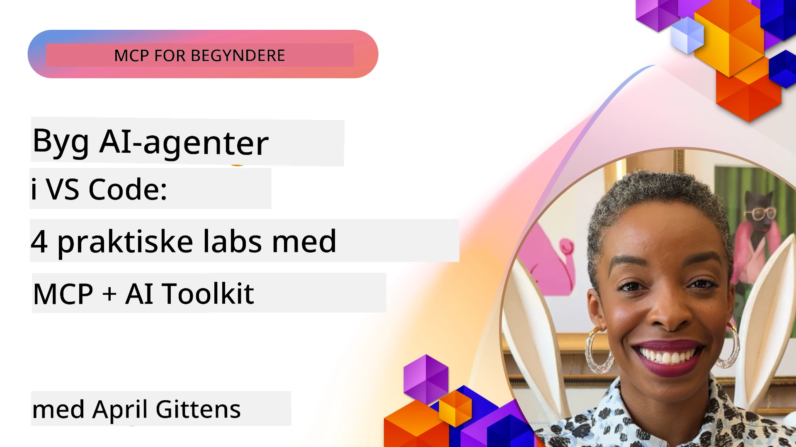

# Effektivisering af AI-arbejdsgange: Bygning af en MCP-server med AI Toolkit

## 🎯 Oversigt

_(Klik på billedet ovenfor for at se videoen til denne lektion)_

Velkommen til **Model Context Protocol (MCP) Workshoppen**! Denne omfattende hands-on workshop kombinerer to banebrydende teknologier for at revolutionere AI-applikationsudvikling:

- **🔗 Model Context Protocol (MCP)**: En åben standard til sømløs AI-værktøjsintegration
- **🛠️ AI Toolkit til Visual Studio Code (AITK)**: Microsofts kraftfulde AI-udviklingsudvidelse

### 🎓 Hvad du vil lære

Ved slutningen af denne workshop vil du mestre kunsten at bygge intelligente applikationer, der forbinder AI-modeller med virkelige værktøjer og services. Fra automatiseret test til tilpassede API-integrationer får du praktiske færdigheder til at løse komplekse forretningsudfordringer.

## 🏗️ Teknologistak

### 🔌 Model Context Protocol (MCP)

MCP er **"USB-C for AI"** - en universel standard, der forbinder AI-modeller til eksterne værktøjer og datakilder.

**✨ Nøglefunktioner:**

- 🔄 **Standardiseret Integration**: Universelt interface til AI-værktøjsforbindelser
- 🏛️ **Fleksibel Arkitektur**: Lokale og fjernservere via stdio/SSE transport
- 🧰 **Rigt Økosystem**: Værktøjer, prompts og ressourcer i ét protokol
- 🔒 **Klar til Enterprise**: Indbygget sikkerhed og pålidelighed

**🎯 Hvorfor MCP betyder noget:**
Ligesom USB-C eliminerede kabelkaos, fjerner MCP kompleksiteten ved AI-integrationer. Én protokol, uendelige muligheder.

### 🤖 AI Toolkit til Visual Studio Code (AITK)

Microsofts flagskibs AI-udviklingsudvidelse, der forvandler VS Code til en AI-kraftstation.

**🚀 Kernefunktioner:**

- 📦 **Modelkatalog**: Adgang til modeller fra Azure AI, GitHub, Hugging Face, Ollama
- ⚡ **Lokal Inferens**: ONNX-optimeret CPU/GPU/NPU eksekvering
- 🏗️ **Agent Builder**: Visuel AI-agent udvikling med MCP-integration
- 🎭 **Multi-Modal**: Tekst, vision og struktureret output support

**💡 Udviklingsfordele:**

- Ingen konfiguration for modeludrulning
- Visuel prompt-udformning
- Real-time testmiljø
- Sømløs MCP-server integration

## 📚 Læringsrejse

### [🚀 Modul 1: AI Toolkit Grundlæggende](./lab1/README.md)

**Varighed**: 15 minutter

- 🛠️ Installer og konfigurer AI Toolkit til VS Code
- 🗂️ Udforsk Modelkataloget (100+ modeller fra GitHub, ONNX, OpenAI, Anthropic, Google)
- 🎮 Mestr det Interaktive Testmiljø til real-time modeltest
- 🤖 Byg din første AI-agent med Agent Builder
- 📊 Evaluer modelpræstation med indbyggede målinger (F1, relevans, lighed, sammenhæng)
- ⚡ Lær batch-behandling og multi-modal support funktioner

**🎯 Læringsmål**: Skab en funktionel AI-agent med omfattende forståelse af AITK-funktioner

### [🌐 Modul 2: MCP med AI Toolkit Grundlæggende](./lab2/README.md)

**Varighed**: 20 minutter

- 🧠 Mestre Model Context Protocol (MCP) arkitektur og koncepter
- 🌐 Udforsk Microsofts MCP server-økosystem
- 🤖 Byg en browser-automatiseringsagent med Playwright MCP server
- 🔧 Integrer MCP-servere med AI Toolkit Agent Builder
- 📊 Konfigurer og test MCP-værktøjer i dine agenter
- 🚀 Eksportér og deployér MCP-drevne agenter til produktion

**🎯 Læringsmål**: Udrul en AI-agent med eksterne værktøjer via MCP

### [🔧 Modul 3: Avanceret MCP-udvikling med AI Toolkit](./lab3/README.md)

**Varighed**: 20 minutter

- 💻 Opret tilpassede MCP-servere med AI Toolkit
- 🐍 Konfigurer og brug den nyeste MCP Python SDK (v1.9.3)
- 🔍 Opsæt og brug MCP Inspector til debugging
- 🛠️ Byg en Weather MCP Server med professionelle debugging-arbejdsgange
- 🧪 Debug MCP-servere i både Agent Builder og Inspector miljøer

**🎯 Læringsmål**: Udvikl og fejlret tilpassede MCP-servere med moderne værktøjer

### [🐙 Modul 4: Praktisk MCP-udvikling - Tilpasset GitHub Clone Server](./lab4/README.md)

**Varighed**: 30 minutter

- 🏗️ Byg en virkelighedsnær GitHub Clone MCP Server til udviklingsarbejdsgange
- 🔄 Implementér smart repository-kloning med validering og fejlbehandling
- 📁 Opret intelligent bibliotekshåndtering og VS Code integration
- 🤖 Brug GitHub Copilot Agent Mode med tilpassede MCP-værktøjer
- 🛡️ Anvend produktionsklar pålidelighed og tværplatform-kompatibilitet

**🎯 Læringsmål**: Udrul en produktionsklar MCP-server, der effektiviserer reelle udviklingsarbejdsgange

## 💡 Virkelige Anvendelser & Indvirkning

### 🏢 Enterprise Use Cases

#### 🔄 DevOps-automatisering

Transformer din udviklingsarbejdsgang med intelligent automation:

- **Smart Repository Management**: AI-drevet kodegennemgang og merge-beslutninger
- **Intelligent CI/CD**: Automatiseret pipeline-optimering baseret på kodeændringer
- **Issue Triage**: Automatisk klassificering og tildeling af fejl

#### 🧪 Kvalitetssikringsrevolution

Hæv testningen med AI-drevet automation:

- **Intelligent Testgenerering**: Automatisk opbygning af omfattende testsuiter
- **Visuel Regressionstest**: AI-drevet UI-ændringsdetektion
- **Performance Monitorering**: Proaktiv identifikation og løsning af problemer

#### 📊 Data Pipeline Intelligence

Byg smartere databehandlingsarbejdsgange:

- **Adaptive ETL-processer**: Selvovervågende data transformationer
- **Anomalidetektion**: Real-time overvågning af datakvalitet
- **Intelligent Routing**: Smart styring af dataflow

#### 🎧 Forbedret kundeoplevelse

Skab exceptionelle kundeinteraktioner:

- **Kontekstbevidst Support**: AI-agenter med adgang til kundehistorik
- **Proaktiv Problemløsning**: Forudsigende kundesupport
- **Multi-Channel Integration**: Enhedlig AI-oplevelse på tværs af platforme

## 🛠️ Forudsætninger & Opsætning

### 💻 Systemkrav

| Komponent | Krav | Bemærkninger |
|-----------|-------------|--------------|
| **Operativsystem** | Windows 10+, macOS 10.15+, Linux | Enhver moderne OS |
| **Visual Studio Code** | Nyeste stabile version | Nødvendig til AITK |
| **Node.js** | v18.0+ og npm | Til MCP-serverudvikling |
| **Python** | 3.10+ | Valgfrit til Python MCP-servere |
| **Hukommelse** | Minimum 8GB RAM | 16GB anbefales til lokale modeller |

### 🔧 Udviklingsmiljø

#### Anbefalede VS Code-udvidelser

- **AI Toolkit** (ms-windows-ai-studio.windows-ai-studio)
- **Python** (ms-python.python)
- **Python Debugger** (ms-python.debugpy)
- **GitHub Copilot** (GitHub.copilot) - Valgfri men nyttig

#### Valgfrie værktøjer

- **uv**: Moderne Python-pakkestyring
- **MCP Inspector**: Visuelt debugging-værktøj til MCP-servere
- **Playwright**: Til webautomatiseringseksempler

## 🎖️ Læringsmål & Certificeringsvej

### 🏆 Færdighedsmestrings tjekliste

Ved færdiggørelse af denne workshop opnår du mestring i:

#### 🎯 Kernekompetencer

- [ ] **MCP Protokolmestring**: Dyb forståelse af arkitektur og implementeringsmønstre
- [ ] **AITK Ekspertise**: Ekspertbrug af AI Toolkit til hurtig udvikling
- [ ] **Tilpasset Serverudvikling**: Byg, deployer og vedligehold produktions-MCP-servere
- [ ] **Værktøjsintegration**: Sømløs forbindelse af AI med eksisterende udviklingsarbejdsgange
- [ ] **Problemløsning**: Anvend lærte færdigheder på reelle forretningsudfordringer

#### 🔧 Tekniske Færdigheder

- [ ] Opsæt og konfigurer AI Toolkit i VS Code
- [ ] Design og implementer tilpassede MCP-servere
- [ ] Integrer GitHub-modeller med MCP-arkitektur
- [ ] Byg automatiserede testarbejdsgange med Playwright
- [ ] Deploy AI-agenter til produktion
- [ ] Debug og optimer MCP-serverpræstation

#### 🚀 Avancerede Evner

- [ ] Arkitekt virksomhedsskala AI-integrationer
- [ ] Implementer sikkerhedspraksis for AI-applikationer
- [ ] Design skalerbare MCP-serverarkitekturer
- [ ] Skab tilpassede værktøjskæder til specifikke domæner
- [ ] Mentorér andre i AI-native udvikling

## 📖 Yderligere Ressourcer

- [MCP-specifikation (2025-11-25)](https://spec.modelcontextprotocol.io/specification/2025-11-25/)
- [AI Toolkit GitHub Repository](https://github.com/microsoft/vscode-ai-toolkit)
- [Sample MCP Servers Collection](https://github.com/modelcontextprotocol/servers)
- [Best Practices Guide](https://modelcontextprotocol.io/docs/best-practices)
- [OWASP MCP Top 10](https://microsoft.github.io/mcp-azure-security-guide/mcp/) - Sikkerhedspraksis

---

**🚀 Klar til at revolutionere din AI-udviklingsarbejdsgang?**

Lad os sammen bygge fremtiden for intelligente applikationer med MCP og AI Toolkit!

## Hvad sker der nu

Fortsæt til: [Modul 11: MCP Server Hands-On Labs](../11-MCPServerHandsOnLabs/README.md)

---

<!-- CO-OP TRANSLATOR DISCLAIMER START -->
**Ansvarsfraskrivelse**:
Dette dokument er blevet oversat ved hjælp af AI-oversættelsestjenesten [Co-op Translator](https://github.com/Azure/co-op-translator). Selvom vi stræber efter nøjagtighed, bedes du være opmærksom på, at automatiserede oversættelser kan indeholde fejl eller unøjagtigheder. Det oprindelige dokument på dets modersmål skal betragtes som den autoritative kilde. For kritisk information anbefales professionel menneskelig oversættelse. Vi påtager os intet ansvar for eventuelle misforståelser eller fejltolkninger, der måtte opstå som følge af brugen af denne oversættelse.
<!-- CO-OP TRANSLATOR DISCLAIMER END -->