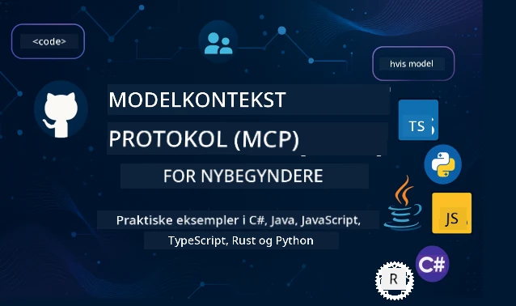

 

[](https://GitHub.com/microsoft/mcp-for-beginners/graphs/contributors)
[](https://GitHub.com/microsoft/mcp-for-beginners/issues)
[](https://GitHub.com/microsoft/mcp-for-beginners/pulls)
[](http://makeapullrequest.com)

[](https://GitHub.com/microsoft/mcp-for-beginners/watchers)
[](https://GitHub.com/microsoft/mcp-for-beginners/fork)
[](https://GitHub.com/microsoft/mcp-for-beginners/stargazers)


[](https://discord.gg/nTYy5BXMWG)

Følg disse trin for at komme i gang med at bruge disse ressourcer:
1. **Fork Repositoryet**: Klik [](https://GitHub.com/microsoft/mcp-for-beginners/fork)
2. **Klon Repositoryet**:   `git clone https://github.com/microsoft/mcp-for-beginners.git`
3. **Deltag i** [](https://discord.gg/nTYy5BXMWG)


### 🌐 Multisproget Support

#### Understøttet via GitHub Action (Automatiseret & Altid Opdateret)

<!-- CO-OP TRANSLATOR LANGUAGES TABLE START -->
[Arabic](../ar/README.md) | [Bengali](../bn/README.md) | [Bulgarian](../bg/README.md) | [Burmese (Myanmar)](../my/README.md) | [Chinese (Simplified)](../zh-CN/README.md) | [Chinese (Traditional, Hong Kong)](../zh-HK/README.md) | [Chinese (Traditional, Macau)](../zh-MO/README.md) | [Chinese (Traditional, Taiwan)](../zh-TW/README.md) | [Croatian](../hr/README.md) | [Czech](../cs/README.md) | [Danish](./README.md) | [Dutch](../nl/README.md) | [Estonian](../et/README.md) | [Finnish](../fi/README.md) | [French](../fr/README.md) | [German](../de/README.md) | [Greek](../el/README.md) | [Hebrew](../he/README.md) | [Hindi](../hi/README.md) | [Hungarian](../hu/README.md) | [Indonesian](../id/README.md) | [Italian](../it/README.md) | [Japanese](../ja/README.md) | [Kannada](../kn/README.md) | [Korean](../ko/README.md) | [Lithuanian](../lt/README.md) | [Malay](../ms/README.md) | [Malayalam](../ml/README.md) | [Marathi](../mr/README.md) | [Nepali](../ne/README.md) | [Nigerian Pidgin](../pcm/README.md) | [Norwegian](../no/README.md) | [Persian (Farsi)](../fa/README.md) | [Polish](../pl/README.md) | [Portuguese (Brazil)](../pt-BR/README.md) | [Portuguese (Portugal)](../pt-PT/README.md) | [Punjabi (Gurmukhi)](../pa/README.md) | [Romanian](../ro/README.md) | [Russian](../ru/README.md) | [Serbian (Cyrillic)](../sr/README.md) | [Slovak](../sk/README.md) | [Slovenian](../sl/README.md) | [Spanish](../es/README.md) | [Swahili](../sw/README.md) | [Swedish](../sv/README.md) | [Tagalog (Filipino)](../tl/README.md) | [Tamil](../ta/README.md) | [Telugu](../te/README.md) | [Thai](../th/README.md) | [Turkish](../tr/README.md) | [Ukrainian](../uk/README.md) | [Urdu](../ur/README.md) | [Vietnamese](../vi/README.md)

> **Foretrækker du at klone lokalt?**
>
> Dette repository inkluderer 50+ sprogoversættelser, hvilket øger downloadstørrelsen betydeligt. For at klone uden oversættelser, brug sparse checkout:
>
> **Bash / macOS / Linux:**
> ```bash
> git clone --filter=blob:none --sparse https://github.com/microsoft/mcp-for-beginners.git
> cd mcp-for-beginners
> git sparse-checkout set --no-cone '/*' '!translations' '!translated_images'
> ```
>
> **CMD (Windows):**
> ```cmd
> git clone --filter=blob:none --sparse https://github.com/microsoft/mcp-for-beginners.git
> cd mcp-for-beginners
> git sparse-checkout set --no-cone "/*" "!translations" "!translated_images"
> ```
>
> Dette giver dig alt, hvad du behøver for at gennemføre kurset med en meget hurtigere download.
<!-- CO-OP TRANSLATOR LANGUAGES TABLE END -->

# 🚀 Model Context Protocol (MCP) Læreplan for Begyndere

## **Lær MCP med praktiske kodeeksempler i C#, Java, JavaScript, Rust, Python og TypeScript**

## 🧠 Oversigt over Model Context Protocol Læreplanen
Velkommen til din rejse ind i Model Context Protocol! Hvis du nogensinde har spekuleret på, hvordan AI-applikationer kommunikerer med forskellige værktøjer og tjenester, er du ved at opdage den elegante løsning, der forvandler måden, udviklere bygger intelligente systemer på.

Tænk på MCP som en universel oversætter for AI-applikationer - ligesom USB-porte lader dig tilslutte enhver enhed til din computer, lader MCP AI-modeller forbinde til ethvert værktøj eller service på en standardiseret måde. Uanset om du bygger din første chatbot eller arbejder på komplekse AI-workflows, vil forståelse af MCP give dig magten til at skabe mere kapable og fleksible applikationer.

Denne læreplan er designet med tålmodighed og omsorg for din læringsrejse. Vi starter med simple koncepter, du allerede forstår, og bygger gradvist din ekspertise gennem praktisk øvelse i dit foretrukne programmeringssprog. Hvert trin indeholder klare forklaringer, praktiske eksempler og rigeligt med opmuntring undervejs.

Når du har gennemført denne rejse, vil du have tillid til at bygge dine egne MCP-servere, integrere dem med populære AI-platforme og forstå, hvordan denne teknologi omformer fremtiden for AI-udvikling. Lad os begynde dette spændende eventyr sammen!

### Officiel Dokumentation og Specifikationer

Denne læreplan er tilpasset **MCP Specification 2025-11-25** (den nyeste stabile udgivelse). MCP-specifikationen bruger datobaseret versionsstyring (YYYY-MM-DD-format) for at sikre klar protokolversionssporing.

Disse ressourcer bliver mere værdifulde, efterhånden som din forståelse vokser, men føl dig ikke presset til at læse alt med det samme. Start med de områder, der interesserer dig mest!
- 📘 [MCP Dokumentation](https://modelcontextprotocol.io/) – Dette er din go-to ressourceside med trin-for-trin tutorials og brugervejledninger. Dokumentationen er skrevet med begyndere i tankerne og giver klare eksempler, du kan følge i dit eget tempo.
- 📜 [MCP Specifikation](https://modelcontextprotocol.io/specification/2025-11-25) – Tænk på dette som din omfattende referencehåndbog. Når du arbejder dig gennem læreplanen, vil du ofte vende tilbage hertil for at slå detaljer op og udforske avancerede funktioner.
- 📜 [MCP Specifikations Versionsstyring](https://modelcontextprotocol.io/specification/versioning) – Indeholder information om protokolversionshistorik og hvordan MCP bruger datobaseret versionsstyring (YYYY-MM-DD-format).
- 🧑‍💻 [MCP GitHub Repository](https://github.com/modelcontextprotocol) – Her finder du SDK’er, værktøjer og kodeeksempler i flere programmeringssprog. Det er som en skattekiste af praktiske eksempler og færdiglavede komponenter.
- 🌐 [MCP Community](https://github.com/orgs/modelcontextprotocol/discussions) – Deltag med andre lærende og erfarne udviklere i diskussioner om MCP. Det er et støttende fællesskab, hvor spørgsmål er velkomne, og viden deles frit.
  
## Læringsmål

Når du er færdig med denne læreplan, vil du føle dig tryg og begejstret over dine nye evner. Her er, hvad du vil opnå:

• **Forstå MCP grundprincipper**: Du vil forstå, hvad Model Context Protocol er, og hvorfor det revolutionerer, hvordan AI-applikationer arbejder sammen, med analogier og eksempler, der giver mening.

• **Byg din første MCP-server**: Du vil skabe en fungerende MCP-server i dit foretrukne programmeringssprog, startende med simple eksempler og gradvist opbygge dine færdigheder.

• **Forbind AI-modeller til virkelige værktøjer**: Du lærer at bygge bro mellem AI-modeller og faktiske tjenester, hvilket giver dine applikationer stærke nye evner.

• **Implementer sikkerhedsbest practices**: Du forstår, hvordan du holder dine MCP-implementeringer sikre, så både dine applikationer og brugere beskyttes.

• **Deploy med tillid**: Du ved, hvordan du tager dine MCP-projekter fra udvikling til produktion med praktiske deploymentsstrategier, der virker i den virkelige verden.

• **Bliv en del af MCP-fællesskabet**: Du bliver en del af et voksende fællesskab af udviklere, der former fremtiden for AI-applikationsudvikling.

## Vigtig Baggrundsviden

Før vi dykker ned i MCP-specifikationerne, lad os sikre, at du føler dig tryg ved nogle grundlæggende begreber. Bare rolig, hvis du ikke er ekspert i disse områder – vi forklarer alt, hvad du behøver at vide undervejs!

### Forståelse af Protokoller (Grundlaget)

Tænk på en protokol som reglerne for en samtale. Når du ringer til en ven, ved I begge, at I skal sige "hej", når I svarer, skiftes til at tale og sige "farvel" til sidst. Computerprogrammer har brug for lignende regler for at kommunikere effektivt.

MCP er en protokol – et sæt aftalte regler, som hjælper AI-modeller og applikationer med at have produktive "samtaler" med værktøjer og tjenester. På samme måde som samtaleregler gør menneskelig kommunikation glattere, gør MCP AI-applikationskommunikation mere pålidelig og stærk.

### Client-Server Forhold (Hvordan Programmer Arbejder Sammen)

Du bruger allerede client-server-forhold hver dag! Når du bruger en webbrowser (client) til at besøge et websted, forbinder du til en webserver, der sender dig sidelayoutet. Browseren ved, hvordan man anmoder om information, og serveren ved, hvordan man returnerer den.

I MCP har vi en lignende relation: AI-modeller handler som klienter, der anmoder om information eller handlinger, mens MCP-servere leverer de muligheder. Det er som at have en hjælpsom assistent (serveren), som AI’en kan bede om at udføre specifikke opgaver.

### Hvorfor Standardisering Er Vigtigt (At Få Ting Til at Virke Sammen)

Forestil dig, at hver bilproducent brugte forskelligt formede benzinpumper – så ville du få brug for en forskellig adapter til hver bil! Standardisering betyder at blive enige om fælles metoder, så ting arbejder sammen problemfrit.

MCP tilbyder denne standardisering for AI-applikationer. I stedet for at hver AI-model skal bruge kode lavet specielt til hvert værktøj, skaber MCP en universel måde at kommunikere på. Det betyder, at udviklere kan bygge værktøjer én gang og få dem til at virke med mange forskellige AI-systemer.

## 🧭 Din Læringsvej Oversigt

Din MCP-rejse er omhyggeligt struktureret til gradvist at opbygge din tillid og færdigheder. Hver fase introducerer nye koncepter, mens den styrker det, du allerede har lært.

### 🌱 Grundlæggende Fase: Forstå det Basale (Moduler 0-2)

Her begynder dit eventyr! Vi vil introducere MCP-koncepter med velkendte analogier og simple eksempler. Du vil forstå, hvad MCP er, hvorfor det eksisterer, og hvordan det passer ind i den større verden af AI-udvikling.

• **Modul 0 - Introduktion til MCP**: Vi starter med at udforske, hvad MCP er, og hvorfor det er så vigtigt for moderne AI-applikationer. Du vil se virkelige eksempler på MCP i brug og forstå, hvordan det løser almindelige problemer udviklere møder.

• **Modul 1 - Kernekoncepter Forklaret**: Her lærer du de essentielle byggeklodser i MCP. Vi bruger masser af analogier og visuelle eksempler for at sikre, at disse koncepter føles naturlige og forståelige.

• **Modul 2 - Sikkerhed i MCP**: Sikkerhed kan lyde skræmmende, men vi viser dig, hvordan MCP inkluderer indbyggede sikkerhedsfunktioner og lærer dig best practices, der beskytter dine applikationer fra starten.

### 🔨 Byggefasen: Skab dine Første Implementeringer (Modul 3)

Nu begynder det sjove! Du får hands-on erfaring med at bygge rigtige MCP-servere og klienter. Bare rolig – vi starter simpelt og guider dig gennem hvert trin.
Dette modul indeholder flere praktiske vejledninger, der lader dig øve dig i dit foretrukne programmeringssprog. Du vil oprette din første server, bygge en klient til at forbinde til den og endda integrere med populære udviklingsværktøjer som VS Code.

Hver vejledning indeholder komplette kodeeksempler, fejlfindingstips og forklaringer på, hvorfor vi træffer specifikke designvalg. Ved afslutningen af denne fase vil du have fungerende MCP-implementeringer, som du kan være stolt af!

### 🚀 Vækstfase: Avancerede koncepter og praktisk anvendelse (Moduler 4-5)

Når du har mestret det basale, er du klar til at udforske mere sofistikerede MCP-funktioner. Vi dækker praktiske implementeringsstrategier, fejlfindingsteknikker og avancerede emner som multimodal AI-integration.

Du vil også lære, hvordan du skalerer dine MCP-implementeringer til produktionsbrug og integrerer med cloud-platforme som Azure. Disse moduler forbereder dig til at bygge MCP-løsninger, der kan håndtere virkelige krav.

### 🌟 Mesterfase: Fællesskab og specialisering (Moduler 6-11)

Den sidste fase fokuserer på at blive en del af MCP-fællesskabet og specialisere dig inden for områder, der interesserer dig mest. Du lærer, hvordan du bidrager til open-source MCP-projekter, implementerer avancerede autentificeringsmønstre og bygger omfattende database-integrerede løsninger.

Modul 11 fortjener særlig omtale – det er et komplet 13-labs praktisk læringsforløb, der lærer dig at bygge produktionsklare MCP-servere med PostgreSQL-integration. Det er som et afsluttende projekt, der samler alt det, du har lært!

### 📚 Fuldstændig pensumstruktur

| Modul | Emne | Beskrivelse | Link |
|--------|-------|-------------|------|
| **Modul 0-3: Grundlæggende** | | | |
| 00 | Introduktion til MCP | Oversigt over Model Context Protocol og dets betydning i AI-pipelines | [Læs mere](./00-Introduction/README.md) |
| 01 | Forklaring af kernekoncepter | Indgående gennemgang af kernekoncepter i MCP | [Læs mere](./01-CoreConcepts/README.md) |
| 02 | Sikkerhed i MCP | Sikkerhedstrusler og bedste praksis | [Læs mere](./02-Security/README.md) |
| 03 | Kom godt i gang med MCP | Opsætning af miljø, grundlæggende servere/klienter, integration | [Læs mere](./03-GettingStarted/README.md) |
| **Modul 3: Byg din første server & klient** | | | |
| 3.1 | Første server | Opret din første MCP-server | [Vejledning](./03-GettingStarted/01-first-server/README.md) |
| 3.2 | Første klient | Udvikl en grundlæggende MCP-klient | [Vejledning](./03-GettingStarted/02-client/README.md) |
| 3.3 | Klient med LLM | Integrer store sprogmodeller | [Vejledning](./03-GettingStarted/03-llm-client/README.md) |
| 3.4 | VS Code-integration | Brug MCP-servere i VS Code | [Vejledning](./03-GettingStarted/04-vscode/README.md) |
| 3.5 | stdio-server | Opret servere ved hjælp af stdio-transport | [Vejledning](./03-GettingStarted/05-stdio-server/README.md) |
| 3.6 | HTTP-streaming | Implementer HTTP-streaming i MCP | [Vejledning](./03-GettingStarted/06-http-streaming/README.md) |
| 3.7 | AI Toolkit | Brug AI Toolkit med MCP | [Vejledning](./03-GettingStarted/07-aitk/README.md) |
| 3.8 | Test | Test din MCP-serverimplementering | [Vejledning](./03-GettingStarted/08-testing/README.md) |
| 3.9 | Udrulning | Udrul MCP-servere til produktion | [Vejledning](./03-GettingStarted/09-deployment/README.md) |
| 3.10 | Avanceret serverbrug | Brug avancerede servere til avanceret funktionsbrug og forbedret arkitektur | [Vejledning](./03-GettingStarted/10-advanced/README.md) |
| 3.11 | Enkel autentifikation | Et kapitel der viser dig autentifikation fra begyndelsen og RBAC | [Vejledning](./03-GettingStarted/11-simple-auth/README.md) |
| 3.12 | MCP Hosts | Konfigurer Claude Desktop, Cursor, Cline og andre MCP-hosts | [Vejledning](./03-GettingStarted/12-mcp-hosts/README.md) |
| 3.13 | MCP Inspector | Fejlfinding og test af MCP-servere med Inspector-værktøjet | [Vejledning](./03-GettingStarted/13-mcp-inspector/README.md) |
| **Modul 4-5: Praktisk & Avanceret** | | | |
| 04 | Praktisk implementering | SDK’er, fejlfinding, test, genanvendelige promptskabeloner | [Læs mere](./04-PracticalImplementation/README.md) |
| 4.1 | Paginering | Håndtering af store resultatsæt med cursor-baseret paginering | [Vejledning](./04-PracticalImplementation/pagination/README.md) |
| 05 | Avancerede emner i MCP | Multimodal AI, skalering, enterprise brug | [Læs mere](./05-AdvancedTopics/README.md) |
| 5.1 | Azure-integration | MCP-integration med Azure | [Vejledning](./05-AdvancedTopics/mcp-integration/README.md) |
| 5.2 | Multimodalitet | Arbejde med flere modaliteter | [Vejledning](./05-AdvancedTopics/mcp-multi-modality/README.md) |
| 5.3 | OAuth2 Demo | Implementer OAuth2-godkendelse | [Vejledning](./05-AdvancedTopics/mcp-oauth2-demo/README.md) |
| 5.4 | Root-kontekster | Forstå og implementer root-kontekster | [Vejledning](./05-AdvancedTopics/mcp-root-contexts/README.md) |
| 5.5 | Routing | MCP-routingstrategier | [Vejledning](./05-AdvancedTopics/mcp-routing/README.md) |
| 5.6 | Sampling | Sampling-teknikker i MCP | [Vejledning](./05-AdvancedTopics/mcp-sampling/README.md) |
| 5.7 | Skalering | Skaler MCP-implementeringer | [Vejledning](./05-AdvancedTopics/mcp-scaling/README.md) |
| 5.8 | Sikkerhed | Avancerede sikkerhedsovervejelser | [Vejledning](./05-AdvancedTopics/mcp-security/README.md) |
| 5.9 | Websøgning | Implementer websøgningsfunktioner | [Vejledning](./05-AdvancedTopics/web-search-mcp/README.md) |
| 5.10 | Realtime streaming | Byg realtidsstreamingfunktionalitet | [Vejledning](./05-AdvancedTopics/mcp-realtimestreaming/README.md) |
| 5.11 | Realtime søgning | Implementer realtidssøgning | [Vejledning](./05-AdvancedTopics/mcp-realtimesearch/README.md) |
| 5.12 | Entra ID-godkendelse | Godkendelse med Microsoft Entra ID | [Vejledning](./05-AdvancedTopics/mcp-security-entra/README.md) |
| 5.13 | Foundry-integration | Integrer med Azure AI Foundry | [Vejledning](./05-AdvancedTopics/mcp-foundry-agent-integration/README.md) |
| 5.14 | Context Engineering | Teknikker til effektiv kontekstengineering | [Vejledning](./05-AdvancedTopics/mcp-contextengineering/README.md) |
| 5.15 | MCP Custom Transport | Tilpassede transportimplementeringer | [Vejledning](./05-AdvancedTopics/mcp-transport/README.md) |
| 5.16 | Protokolfunktioner | Statusmeddelelser, annullering, ressourcetemplates | [Vejledning](./05-AdvancedTopics/mcp-protocol-features/README.md) |
| **Modul 6-10: Fællesskab & Bedste praksis** | | | |
| 06 | Fællesskabsbidrag | Sådan bidrager du til MCP-økosystemet | [Vejledning](./06-CommunityContributions/README.md) |
| 07 | Erfaringer fra tidlig adoption | Virkelige implementeringshistorier | [Vejledning](./07-LessonsfromEarlyAdoption/README.md) |
| 08 | Bedste praksis for MCP | Ydeevne, fejltolerance, robusthed | [Vejledning](./08-BestPractices/README.md) |
| 09 | MCP case-studier | Praktiske implementeringseksempler | [Vejledning](./09-CaseStudy/README.md) |
| 10 | Praktisk workshop | Bygning af en MCP-server med AI Toolkit | [Lab](./10-StreamliningAIWorkflowsBuildingAnMCPServerWithAIToolkit/README.md) |
| **Modul 11: MCP Server Hands On Lab** | | | |
| 11 | MCP Servers databaseintegration | Omfattende 13-labs praktisk læringsforløb for PostgreSQL-integration | [Labs](./11-MCPServerHandsOnLabs/README.md) |
| 11.1 | Introduktion | Oversigt over MCP med databaseintegration og brugsscenarie inden for detailhandel | [Lab 00](./11-MCPServerHandsOnLabs/00-Introduction/README.md) |
| 11.2 | Kernearkitektur | Forståelse af MCP-serverarkitektur, databasedele og sikkerhedsmønstre | [Lab 01](./11-MCPServerHandsOnLabs/01-Architecture/README.md) |
| 11.3 | Sikkerhed & multi-tenancy | Row Level Security, autentifikation og multi-tenant dataadgang | [Lab 02](./11-MCPServerHandsOnLabs/02-Security/README.md) |
| 11.4 | Miljøopsætning | Opsætning af udviklingsmiljø, Docker, Azure-ressourcer | [Lab 03](./11-MCPServerHandsOnLabs/03-Setup/README.md) |
| 11.5 | Databasedesign | PostgreSQL-opsætning, detailhandelsskema design og eksempeldata | [Lab 04](./11-MCPServerHandsOnLabs/04-Database/README.md) |
| 11.6 | MCP-serverimplementering | Bygning af FastMCP-serveren med databaseintegration | [Lab 05](./11-MCPServerHandsOnLabs/05-MCP-Server/README.md) |
| 11.7 | Værktøjsudvikling | Oprettelse af værktøjer til databaseforespørgsler og skemainspektion | [Lab 06](./11-MCPServerHandsOnLabs/06-Tools/README.md) |
| 11.8 | Semantisk søgning | Implementering af vektorembedding med Azure OpenAI og pgvector | [Lab 07](./11-MCPServerHandsOnLabs/07-Semantic-Search/README.md) |
| 11.9 | Test & fejlretning | Teststrategier, debug-værktøjer og valideringstilgange | [Lab 08](./11-MCPServerHandsOnLabs/08-Testing/README.md) |
| 11.10 | VS Code-integration | Konfigurering af VS Code MCP-integration og AI Chat-brug | [Lab 09](./11-MCPServerHandsOnLabs/09-VS-Code/README.md) |
| 11.11 | Udrulningsstrategier | Docker-udrulning, Azure Container Apps og skaleringsovervejelser | [Lab 10](./11-MCPServerHandsOnLabs/10-Deployment/README.md) |
| 11.12 | Overvågning | Application Insights, logning, performanceovervågning | [Lab 11](./11-MCPServerHandsOnLabs/11-Monitoring/README.md) |
| 11.13 | Bedste praksis | Optimering af ydeevne, sikkerhedshærdning og produktionstips | [Lab 12](./11-MCPServerHandsOnLabs/12-Best-Practices/README.md) |

### 💻 Eksempelkodeprojekter

En af de mest spændende dele ved at lære MCP er at se dine kodefærdigheder udvikle sig gradvist. Vi har designet vores kodeeksempler, så de starter enkelt og bliver mere sofistikerede, efterhånden som din forståelse dybtgående forbedres. Sådan introducerer vi koncepter – med kode, der er nem at forstå, men som demonstrerer reelle MCP-principper, vil du ikke blot forstå, hvad denne kode gør, men også hvorfor den er struktureret sådan, og hvordan den passer ind i større MCP-applikationer.

#### Grundlæggende MCP lommeregner-eksempler

| Sprog | Beskrivelse | Link |
|----------|-------------|------|
| C# | MCP Server Eksempel | [Se kode](./03-GettingStarted/samples/csharp/README.md) |
| Java | MCP Lommeregner | [Se kode](./03-GettingStarted/samples/java/calculator/README.md) |
| JavaScript | MCP Demo | [Se kode](./03-GettingStarted/samples/javascript/README.md) |
| Python | MCP Server | [Se kode](../../03-GettingStarted/samples/python/mcp_calculator_server.py) |
| TypeScript | MCP Eksempel | [Se kode](./03-GettingStarted/samples/typescript/README.md) |
| Rust | MCP Eksempel | [Se kode](./03-GettingStarted/samples/rust/README.md) |

#### Avancerede MCP-implementeringer

| Sprog | Beskrivelse | Link |
|----------|-------------|------|
| C# | Avanceret eksempel | [Se kode](./04-PracticalImplementation/samples/csharp/README.md) |
| Java med Spring | Container App Eksempel | [Se kode](./04-PracticalImplementation/samples/java/containerapp/README.md) |
| JavaScript | Avanceret eksempel | [Se kode](./04-PracticalImplementation/samples/javascript/README.md) |
| Python | Komplekse implementeringer | [Se kode](./04-PracticalImplementation/samples/python/README.md) |
| TypeScript | Container-eksempel | [Se kode](./04-PracticalImplementation/samples/typescript/README.md) |


## 🎯 Forudsætninger for at lære MCP

For at få mest muligt ud af dette pensum bør du have:

- Grundlæggende kendskab til programmering i mindst et af følgende sprog: C#, Java, JavaScript, Python eller TypeScript
- Forståelse for klient-server-model og API’er
- Fortrolighed med REST- og HTTP-koncepter
- (Valgfrit) Baggrund inden for AI/ML-koncepter

- Deltagelse i vores fællesskabsdiskussioner for support

## 📚 Studieguide & ressourcer

Dette depot indeholder flere ressourcer til at hjælpe dig med at navigere og lære effektivt:

### Studieguide
En omfattende [Studieguide](./study_guide.md) er tilgængelig for at hjælpe dig med at navigere effektivt i dette repository. Dette visuelle pensumkort viser, hvordan alle emner hænger sammen, og giver vejledning i, hvordan du bruger eksempelprojekterne effektivt. Det er især nyttigt, hvis du er en visuel lærende, der kan lide at se det store billede.

Guiden inkluderer:
- Et visuelt pensumkort, der viser alle dækkede emner
- Detaljeret opdeling af hver repository-sektion
- Vejledning i, hvordan du bruger eksempelprojekter
- Anbefalede læringsveje for forskellige færdighedsniveauer
- Yderligere ressourcer til at supplere din læringsrejse

### Ændringslog

Vi vedligeholder en detaljeret [Ændringslog](./changelog.md), der følger alle væsentlige opdateringer til pensummaterialerne, så du kan holde dig opdateret med de seneste forbedringer og tilføjelser.
- Nye indholdstilføjelser
- Strukturelle ændringer
- Forbedringer af funktioner
- Opdateringer af dokumentation

## 🛠️ Sådan Bruger Du Dette Pensum Effektivt

Hver lektion i denne guide inkluderer:

1. Klare forklaringer af MCP-koncepter  
2. Live kodeeksempler på flere sprog  
3. Øvelser til at bygge rigtige MCP-applikationer  
4. Ekstra ressourcer til avancerede lærende

### Lad Os Lære MCP med C# - Tutorials-serie
Lad os lære om Model Context Protocol (MCP), et banebrydende framework designet til at standardisere interaktioner mellem AI-modeller og klientapplikationer. Gennem denne begynder-venlige session introducerer vi dig til MCP og guider dig gennem at oprette din første MCP-server.
#### C#: [https://aka.ms/letslearnmcp-csharp](https://aka.ms/letslearnmcp-csharp)
#### Java: [https://aka.ms/letslearnmcp-java](https://aka.ms/letslearnmcp-java)
#### JavaScript: [https://aka.ms/letslearnmcp-javascript](https://aka.ms/letslearnmcp-javascript)
#### Python: [https://aka.ms/letslearnmcp-python](https://aka.ms/letslearnmcp-python)

## 🎓 Din MCP-rejse Begynder

Tillykke! Du har netop taget det første skridt på en spændende rejse, der vil udvide dine programmeringsevner og forbinde dig med den nyeste udvikling inden for AI.

### Hvad Du Allerede Har Opnået

Ved at læse denne introduktion er du allerede begyndt at opbygge dit MCP-vidensgrundlag. Du forstår, hvad MCP er, hvorfor det er vigtigt, og hvordan dette pensum vil støtte din læringsrejse. Det er en betydelig bedrift og begyndelsen på din ekspertise i denne vigtige teknologi.

### Eventyret Foran Dig

Mens du skrider frem gennem modulerne, så husk, at enhver ekspert engang var begynder. De koncepter, der måske virker komplekse nu, bliver anden natur, efterhånden som du øver dig og anvender dem. Hvert lille skridt bygger op mod kraftfulde kompetencer, der vil tjene dig gennem hele din udviklerkarriere.

### Dit Supportnetværk

Du slutter dig til et community af lærende og eksperter, som er passionerede omkring MCP og ivrige efter at hjælpe andre med at lykkes. Uanset om du sidder fast i en kodningsudfordring eller er begejstret for at dele et gennembrud, er fællesskabet her for at støtte din rejse.

Hvis du sidder fast eller har spørgsmål om at bygge AI-apps, kan du deltage i samtaler med medstuderende og erfarne udviklere om MCP. Det er et støttende community, hvor spørgsmål er velkomne, og viden deles frit.

[](https://discord.gg/nTYy5BXMWG)

Hvis du har produktfeedback eller oplever fejl under udviklingen, besøg:

[](https://aka.ms/foundry/forum)

### Klar til at Begynde?

Din MCP-eventyr starter nu! Begynd med Modul 0 for at dykke ned i dine første praktiske MCP-erfaringer, eller udforsk eksempelprojekterne for at se, hvad du vil bygge. Husk – enhver ekspert startede præcis, hvor du er nu, og med tålmodighed og øvelse vil du blive forbavset over, hvad du kan opnå.

Velkommen til verdenen af Model Context Protocol-udvikling. Lad os bygge noget fantastisk sammen!

## 🤝 Bidrag til Læringsfællesskabet

Dette pensum bliver stærkere med bidrag fra lærende som dig! Uanset om du retter en slåfejl, foreslår en klarere forklaring eller tilføjer et nyt eksempel, hjælper dine bidrag andre begyndere til succes.

Tak til Microsoft Valued Professional [Shivam Goyal](https://www.linkedin.com/in/shivam2003/) for at bidrage med kodeeksempler.

Bidragsprocessen er designet til at være indbydende og støttende. De fleste bidrag kræver en Contributor License Agreement (CLA), men de automatiske værktøjer guider dig trygt igennem processen.

## 📜 Open Source Læring

Hele dette pensum er tilgængeligt under MIT [LICENSE](../../LICENSE), hvilket betyder, at du frit kan bruge, ændre og dele det. Dette støtter vores mission om at gøre MCP-viden tilgængelig for udviklere alle steder.
## 🤝 Retningslinjer for Bidrag

Dette projekt byder på bidrag og forslag velkommen. De fleste bidrag kræver, at du accepterer en Contributor License Agreement (CLA), der erklærer, at du har ret til og faktisk giver os retten til at anvende dit bidrag. For detaljer, besøg <https://cla.opensource.microsoft.com>.

Når du indsender en pull request, vil en CLA-bot automatisk afgøre, om du skal aflevere en CLA og dekorere PR’en passende (fx status-check, kommentar). Følg blot instruktionerne fra botten. Du skal kun gøre dette én gang på tværs af alle repos, der bruger vores CLA.

Dette projekt har tilsluttet sig [Microsoft Open Source Code of Conduct](https://opensource.microsoft.com/codeofconduct/).
For mere information, se [Code of Conduct FAQ](https://opensource.microsoft.com/codeofconduct/faq/) eller kontakt [opencode@microsoft.com](mailto:opencode@microsoft.com) for yderligere spørgsmål eller kommentarer.

---

*Klar til at starte din MCP-rejse? Begynd med [Modul 00 - Introduktion til MCP](./00-Introduction/README.md) og tag dine første skridt ind i Model Context Protocol-udviklingens verden!*


## 🎒 Andre Kurser
Vores team producerer også andre kurser! Tjek dem ud:

<!-- CO-OP TRANSLATOR OTHER COURSES START -->
### LangChain
[](https://aka.ms/langchain4j-for-beginners)
[](https://aka.ms/langchainjs-for-beginners?WT.mc_id=m365-94501-dwahlin)
[](https://github.com/microsoft/langchain-for-beginners?WT.mc_id=m365-94501-dwahlin)
---

### Azure / Edge / MCP / Agenter
[](https://github.com/microsoft/AZD-for-beginners?WT.mc_id=academic-105485-koreyst)
[](https://github.com/microsoft/edgeai-for-beginners?WT.mc_id=academic-105485-koreyst)
[](https://github.com/microsoft/mcp-for-beginners?WT.mc_id=academic-105485-koreyst)
[](https://github.com/microsoft/ai-agents-for-beginners?WT.mc_id=academic-105485-koreyst)

---
 
### Generativ AI Serie
[](https://github.com/microsoft/generative-ai-for-beginners?WT.mc_id=academic-105485-koreyst)
[-9333EA?style=for-the-badge&labelColor=E5E7EB&color=9333EA)](https://github.com/microsoft/Generative-AI-for-beginners-dotnet?WT.mc_id=academic-105485-koreyst)
[-C084FC?style=for-the-badge&labelColor=E5E7EB&color=C084FC)](https://github.com/microsoft/generative-ai-for-beginners-java?WT.mc_id=academic-105485-koreyst)
[-E879F9?style=for-the-badge&labelColor=E5E7EB&color=E879F9)](https://github.com/microsoft/generative-ai-with-javascript?WT.mc_id=academic-105485-koreyst)

---
 
### Kerne Læring
[](https://aka.ms/ml-beginners?WT.mc_id=academic-105485-koreyst)
[](https://aka.ms/datascience-beginners?WT.mc_id=academic-105485-koreyst)
[](https://aka.ms/ai-beginners?WT.mc_id=academic-105485-koreyst)
[](https://github.com/microsoft/Security-101?WT.mc_id=academic-96948-sayoung)
[](https://aka.ms/webdev-beginners?WT.mc_id=academic-105485-koreyst)
[](https://aka.ms/iot-beginners?WT.mc_id=academic-105485-koreyst)
[](https://github.com/microsoft/xr-development-for-beginners?WT.mc_id=academic-105485-koreyst)

---
 
### Copilot Serie
[](https://aka.ms/GitHubCopilotAI?WT.mc_id=academic-105485-koreyst)
[](https://github.com/microsoft/mastering-github-copilot-for-dotnet-csharp-developers?WT.mc_id=academic-105485-koreyst)
[](https://github.com/microsoft/CopilotAdventures?WT.mc_id=academic-105485-koreyst)
<!-- CO-OP TRANSLATOR ANDRE KURSER SLUT -->

---

<!-- CO-OP TRANSLATOR DISCLAIMER START -->
**Ansvarsfraskrivelse**:
Dette dokument er blevet oversat ved hjælp af AI-oversættelsestjenesten [Co-op Translator](https://github.com/Azure/co-op-translator). Selvom vi stræber efter nøjagtighed, skal du være opmærksom på, at automatiserede oversættelser kan indeholde fejl eller unøjagtigheder. Det oprindelige dokument på dets originale sprog bør betragtes som den autoritative kilde. For kritiske informationer anbefales professionel menneskelig oversættelse. Vi påtager os intet ansvar for misforståelser eller fejltolkninger, der måtte opstå som følge af brugen af denne oversættelse.
<!-- CO-OP TRANSLATOR DISCLAIMER END -->