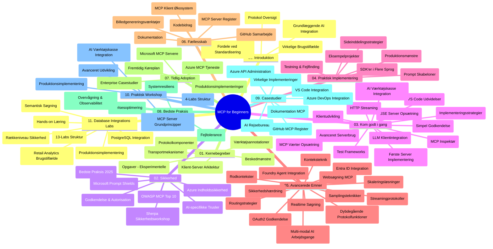

# Model Context Protocol (MCP) for Begyndere - Studieguide

Denne studieguide giver en oversigt over repositoriets struktur og indhold for læseplanen "Model Context Protocol (MCP) for Begyndere". Brug denne guide til effektivt at navigere i repositoriet og få mest muligt ud af de tilgængelige ressourcer.

## Repositorieoversigt

Model Context Protocol (MCP) er en standardiseret ramme for interaktioner mellem AI-modeller og klientapplikationer. Oprindeligt skabt af Anthropic, vedligeholdes MCP nu af det bredere MCP-fællesskab gennem den officielle GitHub-organisation. Dette repositorium leverer en omfattende læseplan med praktiske kodeeksempler i C#, Java, JavaScript, Python og TypeScript, designet til AI-udviklere, systemarkitekter og softwareingeniører.

## Visuelt Læseplanskort

## Repositoriestruktur

Repositoriet er organiseret i elleve hovedsektioner, som hver fokuserer på forskellige aspekter af MCP:

1. **Introduktion (00-Introduction/)**
   - Oversigt over Model Context Protocol
   - Hvorfor standardisering er vigtigt i AI-pipelines
   - Praktiske anvendelsestilfælde og fordele

2. **Kernebegreber (01-CoreConcepts/)**
   - Klient-server arkitektur
   - Centrale protokolkomponenter
   - Messaging-mønstre i MCP

3. **Sikkerhed (02-Security/)**
   - Sikkerhedstrusler i MCP-baserede systemer
   - Bedste praksis for sikring af implementeringer
   - Autentificerings- og autorisationsstrategier
   - **Omfattende sikkerhedsdokumentation**:
     - MCP Security Best Practices 2025
     - Azure Content Safety Implementeringsvejledning
     - MCP Security Controls and Techniques
     - MCP Best Practices Quick Reference
   - **Vigtige sikkerhedsemner**:
     - Prompt injection og tool poisoning-angreb
     - Session hijacking og confused deputy-problemer
     - Token passthrough-sårbarheder
     - Overdrevne tilladelser og adgangskontrol
     - Supply chain sikkerhed for AI-komponenter
     - Microsoft Prompt Shields integration

4. **Kom godt i gang (03-GettingStarted/)**
   - Miljøopsætning og konfiguration
   - Oprettelse af grundlæggende MCP-servere og klienter
   - Integration med eksisterende applikationer
   - Indeholder sektioner for:
     - Første server-implementering
     - Klientudvikling
     - LLM klientintegration
     - VS Code integration
     - Server-Sent Events (SSE) server
     - Avanceret serverbrug
     - HTTP-streaming
     - AI Toolkit integration
     - Teststrategier
     - Udrulningsretningslinjer

5. **Praktisk implementering (04-PracticalImplementation/)**
   - Brug af SDK’er på tværs af forskellige programmeringssprog
   - Debugging, testning og valideringsteknikker
   - Udarbejdelse af genanvendelige promptskabeloner og workflows
   - Eksempelsprojekter med implementations-eksempler

6. **Avancerede emner (05-AdvancedTopics/)**
   - Context engineering-teknikker
   - Foundry agent integration
   - Multi-modal AI workflows
   - OAuth2 autentificeringsdemos
   - Real-time søgefunktioner
   - Real-time streaming
   - Root contexts-implementering
   - Routing-strategier
   - Sampling-teknikker
   - Skaleringsmetoder
   - Sikkerhedsovervejelser
   - Entra ID sikkerhedsintegration
   - Websøgning integration

7. **Fællesskabsbidrag (06-CommunityContributions/)**
   - Hvordan man bidrager med kode og dokumentation
   - Samarbejde via GitHub
   - Fællesskabets forbedringer og feedback
   - Brug af forskellige MCP-klienter (Claude Desktop, Cline, VSCode)
   - Arbejde med populære MCP-servere inkl. billedgenerering

8. **Erfaringer fra tidlig adoption (07-LessonsfromEarlyAdoption/)**
   - Virkelige implementeringer og succeshistorier
   - Opbygning og udrulning af MCP-baserede løsninger
   - Tendenser og fremtidig roadmap
   - **Microsoft MCP Servers Guide**: Omfattende guide til 10 produktionsklar Microsoft MCP-servere inkl.:
     - Microsoft Learn Docs MCP Server
     - Azure MCP Server (15+ specialiserede connectors)
     - GitHub MCP Server
     - Azure DevOps MCP Server
     - MarkItDown MCP Server
     - SQL Server MCP Server
     - Playwright MCP Server
     - Dev Box MCP Server
     - Azure AI Foundry MCP Server
     - Microsoft 365 Agents Toolkit MCP Server

9. **Bedste praksis (08-BestPractices/)**
   - Performance tuning og optimering
   - Design af fejltolerante MCP-systemer
   - Test- og robusthedsstrategier

10. **Case studier (09-CaseStudy/)**
    - **Syv omfattende case studier** der demonstrerer MCPs alsidighed på tværs af forskellige scenarier:
    - **Azure AI Travel Agents**: Multi-agent orkestrering med Azure OpenAI og AI Search
    - **Azure DevOps Integration**: Automatisering af workflow-processer med YouTube dataopdateringer
    - **Real-Time dokumenthentning**: Python konsolklient med streaming HTTP
    - **Interaktiv studieplan-generator**: Chainlit webapp med konverserende AI
    - **Dokumentation i editoren**: VS Code integration med GitHub Copilot workflows
    - **Azure API Management**: Enterprise API integration med MCP-server oprettelse
    - **GitHub MCP Registry**: Økosystemudvikling og agentisk integrationsplatform
    - Implementeringseksempler der spænder over enterprise integration, udviklerproduktivitet og økosystemudvikling

11. **Hands-on workshop (10-StreamliningAIWorkflowsBuildingAnMCPServerWithAIToolkit/)**
    - Omfattende hands-on workshop, der kombinerer MCP med AI Toolkit
    - Opbygning af intelligente applikationer, der forbinder AI-modeller med virkelige værktøjer
    - Praktiske moduler, der dækker grundlæggende, brugerdefineret serverudvikling og produktionsudrulningsstrategier
    - **Lab struktur**:
      - Lab 1: MCP Server Fundamentals
      - Lab 2: Avanceret MCP Serverudvikling
      - Lab 3: AI Toolkit Integration
      - Lab 4: Produktionsudrulning og skalering
    - Lab-baseret læringsmetode med trin-for-trin instruktioner

12. **MCP Server Database Integration Labs (11-MCPServerHandsOnLabs/)**
    - **Omfattende 13-labs læringsforløb** til opbygning af produktionsklare MCP-servere med PostgreSQL-integration
    - **Virkelige detailanalysetilfælde** med Zava Retail use case
    - **Enterprise-grade mønstre** inkl. Row Level Security (RLS), semantisk søgning og multi-tenant dataadgang
    - **Komplet lab-struktur**:
      - **Labs 00-03: Grundlag** - Introduktion, Arkitektur, Sikkerhed, Miljøopsætning
      - **Labs 04-06: Opbygning af MCP Server** - Database design, MCP server implementering, værktøjsudvikling
      - **Labs 07-09: Avancerede funktioner** - Semantisk søgning, test & debugging, VS Code integration
      - **Labs 10-12: Produktion & Bedste praksis** - Udrulning, overvågning, optimering
    - **Teknologier dækket**: FastMCP framework, PostgreSQL, Azure OpenAI, Azure Container Apps, Application Insights
    - **Læringsresultater**: Produktionsklare MCP-servere, databaseintegrationsmønstre, AI-drevet analyse, enterprise sikkerhed

## Yderligere Ressourcer

Repositoriet inkluderer støtteressourcer:

- **Billedmappe**: Indeholder diagrammer og illustrationer brugt gennem læseplanen
- **Oversættelser**: Multisproget support med automatiserede oversættelser af dokumentationen
- **Officielle MCP-ressourcer**:
  - [MCP Documentation](https://modelcontextprotocol.io/)
  - [MCP Specification](https://spec.modelcontextprotocol.io/)
  - [MCP GitHub Repository](https://github.com/modelcontextprotocol)

## Sådan Bruges Dette Repositorium

1. **Sekventiel læring**: Følg kapitlerne i rækkefølge (00 til 11) for en struktureret læringsoplevelse.
2. **Sprog-specifik fokus**: Hvis du er interesseret i et bestemt programmeringssprog, udforsk eksempelmapperne for implementeringer på dit foretrukne sprog.
3. **Praktisk implementering**: Start med afsnittet "Kom godt i gang" for opsætning af dit miljø og oprettelse af din første MCP-server og klient.
4. **Avanceret udforskning**: Når du er fortrolig med grundlæggende emner, kan du dykke ned i de avancerede emner for at udvide din viden.
5. **Fællesskabsengagement**: Deltag i MCP-fællesskabet via GitHub-diskussioner og Discord-kanaler for at forbinde med eksperter og andre udviklere.

## MCP-klienter og værktøjer

Læseplanen dækker forskellige MCP-klienter og værktøjer:

1. **Officielle klienter**:
   - Visual Studio Code
   - MCP i Visual Studio Code
   - Claude Desktop
   - Claude i VSCode
   - Claude API

2. **Fællesskabsklienter**:
   - Cline (terminalbaseret)
   - Cursor (kodeeditor)
   - ChatMCP
   - Windsurf

3. **MCP-styringsværktøjer**:
   - MCP CLI
   - MCP Manager
   - MCP Linker
   - MCP Router

## Populære MCP-servere

Repositoriet introducerer forskellige MCP-servere, inkl.:

1. **Officielle Microsoft MCP-servere**:
   - Microsoft Learn Docs MCP Server
   - Azure MCP Server (15+ specialiserede connectors)
   - GitHub MCP Server
   - Azure DevOps MCP Server
   - MarkItDown MCP Server
   - SQL Server MCP Server
   - Playwright MCP Server
   - Dev Box MCP Server
   - Azure AI Foundry MCP Server
   - Microsoft 365 Agents Toolkit MCP Server

2. **Officielle reference-servere**:
   - Filesystem
   - Fetch
   - Memory
   - Sequential Thinking

3. **Billedgenerering**:
   - Azure OpenAI DALL-E 3
   - Stable Diffusion WebUI
   - Replicate

4. **Udviklingsværktøjer**:
   - Git MCP
   - Terminal Control
   - Code Assistant

5. **Specialiserede servere**:
   - Salesforce
   - Microsoft Teams
   - Jira & Confluence

## Bidrag

Dette repositorium byder fællesskabsbidrag velkommen. Se afsnittet Fællesskabsbidrag for vejledning om, hvordan du effektivt kan bidrage til MCP-økosystemet.

----

*Denne studieguide blev senest opdateret den 5. februar 2026 og afspejler den nyeste MCP Specification 2025-11-25 samt giver en oversigt over repositoriet per denne dato. Repositorieindhold kan blive opdateret efter denne dato.*

---

<!-- CO-OP TRANSLATOR DISCLAIMER START -->
**Ansvarsfraskrivelse**:
Dette dokument er blevet oversat ved hjælp af AI-oversættelsestjenesten [Co-op Translator](https://github.com/Azure/co-op-translator). Selvom vi bestræber os på nøjagtighed, skal du være opmærksom på, at automatiserede oversættelser kan indeholde fejl eller unøjagtigheder. Det originale dokument på dets oprindelige sprog skal betragtes som den autoritative kilde. For vigtig information anbefales professionel menneskelig oversættelse. Vi er ikke ansvarlige for eventuelle misforståelser eller fejltolkninger, der opstår som følge af brugen af denne oversættelse.
<!-- CO-OP TRANSLATOR DISCLAIMER END -->