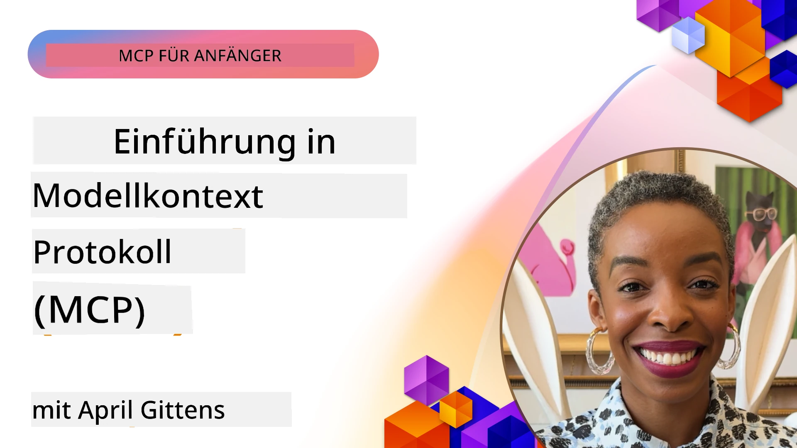
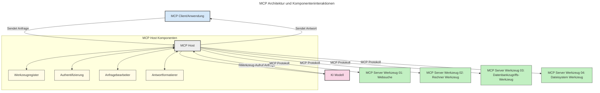

# Einführung in das Model Context Protocol (MCP): Warum es für skalierbare KI-Anwendungen wichtig ist

[](https://youtu.be/agBbdiOPLQA)

_(Klicken Sie auf das Bild oben, um das Video dieser Lektion anzusehen)_

Generative KI-Anwendungen sind ein großer Fortschritt, da sie dem Benutzer oft erlauben, mit der App über natürlichsprachliche Eingaben zu interagieren. Allerdings möchte man, wenn mehr Zeit und Ressourcen in solche Apps investiert werden, sicherstellen, dass man Funktionalitäten und Ressourcen so integrieren kann, dass es einfach erweitert werden kann, die App mehr als ein Modell unterstützt und verschiedene Modellbesonderheiten handhaben kann. Kurz gesagt, das Erstellen von Gen KI-Apps ist anfangs einfach, doch wenn sie wachsen und komplexer werden, muss man anfangen, eine Architektur zu definieren und wird wahrscheinlich auf einen Standard angewiesen sein, um sicherzustellen, dass die Apps einheitlich gebaut werden. Hier kommt MCP ins Spiel, um die Dinge zu organisieren und einen Standard bereitzustellen.

---

## **🔍 Was ist das Model Context Protocol (MCP)?**

Das **Model Context Protocol (MCP)** ist eine **offene, standardisierte Schnittstelle**, die es großen Sprachmodellen (LLMs) ermöglicht, nahtlos mit externen Tools, APIs und Datenquellen zu interagieren. Es bietet eine konsistente Architektur, um die Funktionalität von KI-Modellen über ihre Trainingsdaten hinaus zu erweitern und so intelligentere, skalierbare und reaktionsfähigere KI-Systeme zu ermöglichen.

---

## **🎯 Warum Standardisierung in der KI wichtig ist**

Da generative KI-Anwendungen komplexer werden, ist es wichtig, Standards einzuführen, die **Skalierbarkeit, Erweiterbarkeit, Wartbarkeit** sicherstellen und **Vendor Lock-in vermeiden**. MCP adressiert diese Bedürfnisse durch:

- Vereinheitlichung der Integration von Modellen und Tools  
- Reduzierung von anfälligen, einmaligen Sonderlösungen  
- Ermöglichung der Koexistenz mehrerer Modelle verschiedener Anbieter in einem Ökosystem  

**Hinweis:** Obwohl MCP sich als offener Standard versteht, gibt es keine Pläne, MCP über bestehende Standardisierungsorganisationen wie IEEE, IETF, W3C, ISO oder andere zu standardisieren.

---

## **📚 Lernziele**

Am Ende dieses Artikels werden Sie in der Lage sein:

- Das **Model Context Protocol (MCP)** und seine Anwendungsfälle zu definieren  
- Zu verstehen, wie MCP die Kommunikation zwischen Modell und Tool standardisiert  
- Die Kernkomponenten der MCP-Architektur zu identifizieren  
- Anwendungsfälle von MCP in Unternehmen und Entwicklungsumgebungen zu erkunden  

---

## **💡 Warum das Model Context Protocol (MCP) ein Game-Changer ist**

### **🔗 MCP löst Fragmentierung bei KI-Interaktionen**

Vor MCP erforderte die Integration von Modellen mit Tools:

- individuellen Code pro Tool-Modell-Paar  
- nicht-standardisierte APIs für jeden Anbieter  
- häufige Unterbrechungen durch Updates  
- schlechte Skalierbarkeit bei mehr Tools  

### **✅ Vorteile der MCP-Standardisierung**

| **Vorteil**              | **Beschreibung**                                                                |
|--------------------------|--------------------------------------------------------------------------------|
| Interoperabilität        | LLMs funktionieren nahtlos mit Tools verschiedener Anbieter                    |
| Konsistenz               | Einheitliches Verhalten über Plattformen und Tools hinweg                      |
| Wiederverwendbarkeit     | Einmal erstellte Tools können in verschiedenen Projekten und Systemen genutzt werden |
| Schnellere Entwicklung   | Entwicklungszeit durch standardisierte, Plug-and-Play-Schnittstellen verkürzen |

---

## **🧱 Überblick über die MCP-Architektur auf hoher Ebene**

MCP folgt einem **Client-Server-Modell**, bei dem:

- **MCP Hosts** die KI-Modelle betreiben  
- **MCP Clients** Anfragen initiieren  
- **MCP Server** Kontext, Tools und Fähigkeiten bereitstellen  

### **Wichtige Komponenten:**

- **Ressourcen** – Statische oder dynamische Daten für Modelle  
- **Prompts** – Vorgefertigte Workflows für geführte Generierung  
- **Tools** – Ausführbare Funktionen wie Suche, Berechnungen  
- **Sampling** – Agentic-Verhalten über rekursive Interaktionen  
- **Elicitation** – Server-initiierte Anfragen zur Nutzerinteraktion  
- **Roots** – Dateisystem-Grenzen für Zugriffskontrolle durch Server  

### **Protokollarchitektur:**

MCP nutzt eine zweischichtige Architektur:  
- **Datenebene**: JSON-RPC 2.0-basierte Kommunikation mit Lifecycle-Management und Primitiven  
- **Transportschicht**: STDIO (lokal) und Streamable HTTP mit SSE (remote) Kommunikationskanäle  

---

## Wie MCP-Server funktionieren

MCP-Server arbeiten folgendermaßen:

- **Anfragefluss**:  
    1. Eine Anfrage wird vom Endnutzer oder einer Software in dessen Auftrag initiiert.  
    2. Der **MCP Client** sendet die Anfrage an einen **MCP Host**, der die Laufzeitumgebung des KI-Modells verwaltet.  
    3. Das **KI-Modell** erhält den Nutzereingabe-Prompt und kann den Zugriff auf externe Tools oder Daten über einen oder mehrere Tool-Aufrufe anfordern.  
    4. Der **MCP Host**, nicht das Modell direkt, kommuniziert über das standardisierte Protokoll mit den entsprechenden **MCP Server(s)**.  
- **Funktionalität des MCP Host**:  
    - **Tool-Register**: Pflegt einen Katalog verfügbarer Tools und deren Fähigkeiten.  
    - **Authentifizierung**: Überprüft Berechtigungen für Tool-Zugriffe.  
    - **Anfrage-Handler**: Bearbeitet eingehende Tool-Anfragen vom Modell.  
    - **Antwort-Formatter**: Strukturiert Tool-Ausgaben in einem für das Modell verständlichen Format.  
- **Ausführung der MCP Server**:  
    - Der **MCP Host** leitet Tool-Aufrufe an einen oder mehrere **MCP Server** weiter, die spezialisierte Funktionen anbieten (z.B. Suche, Berechnungen, Datenbankabfragen).  
    - Die **MCP Server** führen ihre jeweiligen Operationen aus und geben Ergebnisse im konsistenten Format an den **MCP Host** zurück.  
    - Der **MCP Host** formatiert und übermittelt diese Ergebnisse an das **KI-Modell**.  
- **Abschluss der Antwort:**  
    - Das **KI-Modell** integriert die Tool-Ausgaben in eine finale Antwort.  
    - Der **MCP Host** sendet diese Antwort an den **MCP Client**, der sie an den Endnutzer oder die aufrufende Software überträgt.  
    


## 👨‍💻 Wie man einen MCP-Server erstellt (Mit Beispielen)

MCP-Server erlauben es, die Fähigkeiten von LLMs durch Bereitstellung von Daten und Funktionalität zu erweitern. 

Bereit zum Ausprobieren? Hier sind sprach- und/oder stack-spezifische SDKs mit Beispielen, wie man einfache MCP-Server in verschiedenen Sprachen/Stacks erstellt:

- **Python SDK**: https://github.com/modelcontextprotocol/python-sdk

- **TypeScript SDK**: https://github.com/modelcontextprotocol/typescript-sdk

- **Java SDK**: https://github.com/modelcontextprotocol/java-sdk

- **C#/.NET SDK**: https://github.com/modelcontextprotocol/csharp-sdk


## 🌍 Anwendungsfälle aus der Praxis für MCP

MCP ermöglicht eine Vielzahl von Anwendungen, indem es KI-Fähigkeiten erweitert:

| **Anwendung**               | **Beschreibung**                                                               |
|------------------------------|--------------------------------------------------------------------------------|
| Integration von Unternehmensdaten | Anbindung von LLMs an Datenbanken, CRM-Systeme oder interne Tools             |
| Agentische KI-Systeme        | Ermöglicht autonome Agenten mit Tool-Zugriff und Entscheidungs-Workflows       |
| Multimodale Anwendungen      | Kombination von Text-, Bild- und Audio-Tools in einer einzigen KI-App          |
| Echtzeit-Datenintegration    | Einbindung von Live-Daten für genauere und aktuelle Ausgaben in KI-Interaktionen |


### 🧠 MCP = Universeller Standard für KI-Interaktionen

Das Model Context Protocol (MCP) fungiert als universeller Standard für KI-Interaktionen, ähnlich wie USB-C physische Verbindungen für Geräte standardisiert hat. In der KI-Welt bietet MCP eine konsistente Schnittstelle, die es Modellen (Clients) erlaubt, sich nahtlos mit externen Tools und Datenanbietern (Servern) zu integrieren. Dadurch entfällt die Notwendigkeit vielfältiger, individueller Protokolle für jede API oder Datenquelle.

Unter MCP folgt ein MCP-kompatibles Tool (bezeichnet als MCP-Server) einem einheitlichen Standard. Diese Server können die von ihnen angebotenen Tools oder Aktionen auflisten und diese ausführen, wenn ein KI-Agent darum bittet. KI-Agentenplattformen, die MCP unterstützen, können verfügbare Tools der Server entdecken und sie über dieses Standardprotokoll aufrufen.

### 💡 Erleichtert den Zugang zu Wissen

Über das Bereitstellen von Tools hinaus erleichtert MCP auch den Zugang zu Wissen. Es ermöglicht Anwendungen, großen Sprachmodellen (LLMs) Kontext bereitzustellen, indem sie an verschiedene Datenquellen angebunden werden. Beispielsweise könnte ein MCP-Server das Dokumentenarchiv eines Unternehmens repräsentieren, sodass Agenten bei Bedarf relevante Informationen abrufen können. Ein anderer Server könnte spezifische Aktionen wie das Versenden von E-Mails oder das Aktualisieren von Datensätzen übernehmen. Aus Sicht des Agenten sind das einfach nur Tools, die er verwenden kann – einige Tools geben Daten (Wissenskontext) zurück, andere führen Aktionen aus. MCP verwaltet beides effizient.

Ein Agent, der sich mit einem MCP-Server verbindet, lernt automatisch die verfügbaren Fähigkeiten und zugänglichen Daten des Servers über ein Standardformat kennen. Diese Standardisierung ermöglicht eine dynamische Verfügbarkeit von Tools. Zum Beispiel ist das Hinzufügen eines neuen MCP-Servers zum System eines Agenten sofort nutzbar, ohne dass eine weitere Anpassung der Agentenanweisungen nötig wäre.

Diese vereinfachte Integration entspricht dem Ablauf, der im folgenden Diagramm gezeigt wird, in dem Server sowohl Tools als auch Wissen bereitstellen und so eine nahtlose Zusammenarbeit zwischen Systemen gewährleisten. 

### 👉 Beispiel: Skalierbare Agentenlösung

```mermaid
---
title: Skalierbare Agentenlösung mit MCP
description: Ein Diagramm, das zeigt, wie ein Benutzer mit einem LLM interagiert, das mit mehreren MCP-Servern verbunden ist. Jeder Server stellt sowohl Wissen als auch Werkzeuge bereit und schafft so eine skalierbare KI-Systemarchitektur.
---
graph TD
    User -->|Eingabeaufforderung| LLM
    LLM -->|Antwort| User
    LLM -->|MCP| ServerA
    LLM -->|MCP| ServerB
    ServerA -->|Universeller Verbinder| ServerB
    ServerA --> KnowledgeA
    ServerA --> ToolsA
    ServerB --> KnowledgeB
    ServerB --> ToolsB

    subgraph Server A
        KnowledgeA[Wissen]
        ToolsA[Werkzeuge]
    end

    subgraph Server B
        KnowledgeB[Wissen]
        ToolsB[Werkzeuge]
    end
```Der Universal Connector ermöglicht MCP-Servern die Kommunikation und das Teilen von Fähigkeiten miteinander, sodass ServerA Aufgaben an ServerB delegieren oder dessen Tools und Wissen nutzen kann. Dies föderiert Tools und Daten über Server hinweg und unterstützt skalierbare und modulare Agentenarchitekturen. Da MCP die Tool-Exposition standardisiert, können Agenten dynamisch Tools entdecken und Anfragen zwischen Servern weiterleiten, ohne hartcodierte Integrationen.

Tool- und Wissensföderation: Tools und Daten können über Server hinweg zugänglich gemacht werden, was skalierbarere und modularere agentische Architekturen ermöglicht.

### 🔄 Erweiterte MCP-Szenarien mit clientseitiger LLM-Integration

Über die grundlegende MCP-Architektur hinaus gibt es erweiterte Szenarien, in denen sowohl Client als auch Server LLMs enthalten und so komplexere Interaktionen möglich sind. Im folgenden Diagramm könnte die **Client-App** beispielsweise eine IDE sein, die eine Reihe von MCP-Tools für die Nutzung durch das LLM bereitstellt:

```mermaid
---
title: Erweiterte MCP-Szenarien mit Client-Server-LLM-Integration
description: Ein Sequenzdiagramm, das den detaillierten Interaktionsablauf zwischen Benutzer, Client-Anwendung, Client-LLM, mehreren MCP-Servern und Server-LLM zeigt, und Tool-Erkennung, Benutzerinteraktion, direkten Tool-Aufruf und Funktionsverhandlungsphasen veranschaulicht
---
sequenceDiagram
    autonumber
    actor User as 👤 Benutzer
    participant ClientApp as 🖥️ Client-App
    participant ClientLLM as 🧠 Client-LLM
    participant Server1 as 🔧 MCP-Server 1
    participant Server2 as 📚 MCP-Server 2
    participant ServerLLM as 🤖 Server-LLM
    
    %% Discovery Phase
    rect rgb(220, 240, 255)
        Note over ClientApp, Server2: TOOL-ERKENNUNGSPHASE
        ClientApp->>+Server1: Verfügbare Werkzeuge/Ressourcen anfragen
        Server1-->>-ClientApp: Werkzeugliste zurückgeben (JSON)
        ClientApp->>+Server2: Verfügbare Werkzeuge/Ressourcen anfragen
        Server2-->>-ClientApp: Werkzeugliste zurückgeben (JSON)
        Note right of ClientApp: Kombinierten Werkzeugkatalog<br/>lokal speichern
    end
    
    %% User Interaction
    rect rgb(255, 240, 220)
        Note over User, ClientLLM: BENUTZERINTERAKTIONSPHASE
        User->>+ClientApp: Natürliche Sprachabfrage eingeben
        ClientApp->>+ClientLLM: Abfrage + Werkzeugkatalog weiterleiten
        ClientLLM->>-ClientLLM: Abfrage analysieren & Werkzeuge auswählen
    end
    
    %% Scenario A: Direct Tool Calling
    alt Direkter Werkzeugaufruf
        rect rgb(220, 255, 220)
            Note over ClientApp, Server1: SZENARIO A: DIREKTER WERKZEUGAUFRUF
            ClientLLM->>+ClientApp: Werkzeugausführung anfragen
            ClientApp->>+Server1: Spezifisches Werkzeug ausführen
            Server1-->>-ClientApp: Ergebnisse zurückgeben
            ClientApp->>+ClientLLM: Ergebnisse verarbeiten
            ClientLLM-->>-ClientApp: Antwort generieren
            ClientApp-->>-User: Endergebnis anzeigen
        end
    
    %% Scenario B: Feature Negotiation (VS Code style)
    else Funktionsverhandlung (VS Code-Stil)
        rect rgb(255, 220, 220)
            Note over ClientApp, ServerLLM: SZENARIO B: FUNKTIONSVERHANDLUNG
            ClientLLM->>+ClientApp: Benötigte Fähigkeiten identifizieren
            ClientApp->>+Server2: Funktionen/Fähigkeiten verhandeln
            Server2->>+ServerLLM: Zusätzlichen Kontext anfragen
            ServerLLM-->>-Server2: Kontext bereitstellen
            Server2-->>-ClientApp: Verfügbare Funktionen zurückgeben
            ClientApp->>+Server2: Verhandelte Werkzeuge aufrufen
            Server2-->>-ClientApp: Ergebnisse zurückgeben
            ClientApp->>+ClientLLM: Ergebnisse verarbeiten
            ClientLLM-->>-ClientApp: Antwort generieren
            ClientApp-->>-User: Endergebnis anzeigen
        end
    end
```
## 🔐 Praktische Vorteile von MCP

Hier sind die praktischen Vorteile der Nutzung von MCP:

- **Aktualität**: Modelle können auf aktuelle Informationen zugreifen, die über ihre Trainingsdaten hinausgehen  
- **Erweiterung der Fähigkeiten**: Modelle können spezialisierte Tools für Aufgaben nutzen, für die sie nicht trainiert wurden  
- **Reduzierte Halluzinationen**: Externe Datenquellen bieten faktische Grundlage  
- **Datenschutz**: Sensible Daten bleiben in sicheren Umgebungen statt in Prompts eingebettet  

## 📌 Wichtige Erkenntnisse

Folgende Kernpunkte sind bei der Verwendung von MCP wichtig:

- **MCP** standardisiert, wie KI-Modelle mit Tools und Daten interagieren  
- Fördert **Erweiterbarkeit, Konsistenz und Interoperabilität**  
- MCP hilft, **Entwicklungszeit zu reduzieren, Zuverlässigkeit zu verbessern und Modellfähigkeiten zu erweitern**  
- Die Client-Server-Architektur **ermöglicht flexible, erweiterbare KI-Anwendungen**  

## 🧠 Übung

Denken Sie an eine KI-Anwendung, die Sie bauen möchten.

- Welche **externen Tools oder Daten** könnten ihre Fähigkeiten verbessern?  
- Wie könnte MCP die Integration **einfacher und zuverlässiger** machen?  

## Zusätzliche Ressourcen

- [MCP GitHub Repository](https://github.com/modelcontextprotocol)


## Was kommt als Nächstes

Weiter: [Kapitel 1: Kernkonzepte](../01-CoreConcepts/README.md)

---

<!-- CO-OP TRANSLATOR DISCLAIMER START -->
**Haftungsausschluss**:  
Dieses Dokument wurde mit dem KI-Übersetzungsdienst [Co-op Translator](https://github.com/Azure/co-op-translator) übersetzt. Obwohl wir uns um Genauigkeit bemühen, beachten Sie bitte, dass automatisierte Übersetzungen Fehler oder Ungenauigkeiten enthalten können. Das Originaldokument in seiner Ursprungssprache gilt als maßgebliche Quelle. Für kritische Informationen empfehlen wir eine professionelle menschliche Übersetzung. Wir übernehmen keine Haftung für Missverständnisse oder Fehlinterpretationen, die durch die Nutzung dieser Übersetzung entstehen.
<!-- CO-OP TRANSLATOR DISCLAIMER END -->