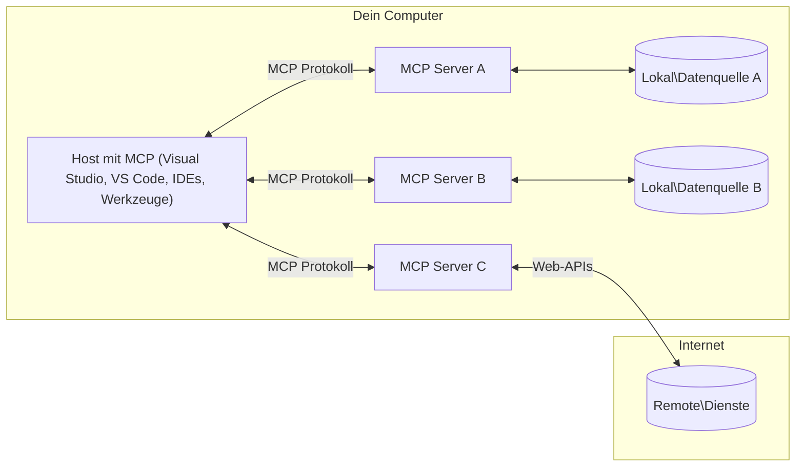

# MCP Kernkonzepte: Das Model Context Protocol für die AI-Integration meistern

[](https://youtu.be/earDzWGtE84)

_(Klicken Sie auf das obige Bild, um das Video zu dieser Lektion anzusehen)_

Das [Model Context Protocol (MCP)](https://github.com/modelcontextprotocol) ist ein leistungsstarkes, standardisiertes Framework, das die Kommunikation zwischen großen Sprachmodellen (LLMs) und externen Werkzeugen, Anwendungen und Datenquellen optimiert.  
Dieser Leitfaden führt Sie durch die Kernkonzepte von MCP. Sie lernen seine Client-Server-Architektur, wesentliche Komponenten, Kommunikationsmechanismen und bewährte Implementierungspraktiken kennen.

- **Explizite Zustimmung des Nutzers**: Alle Datenzugriffe und Operationen erfordern vor der Ausführung die ausdrückliche Zustimmung des Nutzers. Nutzer müssen klar verstehen, welche Daten abgerufen werden und welche Aktionen ausgeführt werden, mit granularer Kontrolle über Berechtigungen und Autorisierungen.

- **Schutz der Datenprivatsphäre**: Nutzerdaten werden nur mit expliziter Zustimmung offengelegt und müssen durch robuste Zugriffskontrollen während des gesamten Interaktionslebenszyklus geschützt sein. Implementierungen müssen unautorisierte Datenübertragungen verhindern und strikte Datenschutzgrenzen einhalten.

- **Sicherheit bei Werkzeugausführung**: Jede Werkzeugausführung bedarf der ausdrücklichen Zustimmung des Nutzers mit klarem Verständnis der Funktion, Parameter und möglichen Auswirkungen des Werkzeugs. Robuste Sicherheitsgrenzen verhindern unbeabsichtigte, unsichere oder bösartige Ausführungen.

- **Transportschicht-Sicherheit**: Alle Kommunikationskanäle sollten geeignete Verschlüsselungs- und Authentifizierungsmechanismen verwenden. Remote-Verbindungen sollten sichere Transportprotokolle und ordnungsgemäße Anmeldeinformationen verwenden.

#### Implementierungsrichtlinien:

- **Berechtigungsmanagement**: Implementieren Sie fein granulare Berechtigungssysteme, die es Nutzern erlauben, zu steuern, welche Server, Werkzeuge und Ressourcen zugänglich sind  
- **Authentifizierung & Autorisierung**: Verwenden Sie sichere Authentifizierungsmethoden (OAuth, API-Schlüssel) mit ordnungsgemäßem Token-Management und Ablauf  
- **Eingabevalidierung**: Validieren Sie alle Parameter und Eingabedaten gemäß definierten Schemata, um Injektionsangriffe zu verhindern  
- **Audit-Logging**: Führen Sie umfassende Protokolle über alle Vorgänge für Sicherheitsüberwachung und Compliance

## Übersicht

Diese Lektion untersucht die grundlegende Architektur und Komponenten, die das Model Context Protocol (MCP)-Ökosystem bilden. Sie lernen die Client-Server-Architektur, Schlüsselkomponenten und Kommunikationsmechanismen kennen, die MCP-Interaktionen antreiben.

## Zentrale Lernziele

Am Ende dieser Lektion werden Sie:

- Die MCP Client-Server-Architektur verstehen.  
- Rollen und Verantwortlichkeiten von Hosts, Clients und Servern identifizieren.  
- Die Kernmerkmale analysieren, die MCP zu einer flexiblen Integrationsschicht machen.  
- Lernen, wie Informationen innerhalb des MCP-Ökosystems fließen.  
- Praktische Einblicke durch Codebeispiele in .NET, Java, Python und JavaScript gewinnen.

## MCP Architektur: Ein genauerer Blick

Das MCP-Ökosystem basiert auf einem Client-Server-Modell. Diese modulare Struktur ermöglicht es KI-Anwendungen, effektiv mit Werkzeugen, Datenbanken, APIs und kontextuellen Ressourcen zu interagieren. Lassen Sie uns diese Architektur in ihre Kernkomponenten zerlegen.

Im Kern folgt MCP einer Client-Server-Architektur, bei der eine Host-Anwendung mehrere Server verbinden kann:


- **MCP Hosts**: Programme wie VSCode, Claude Desktop, IDEs oder KI-Werkzeuge, die Daten über MCP zugreifen möchten  
- **MCP Clients**: Protokoll-Clients, die 1:1-Verbindungen mit Servern aufrechterhalten  
- **MCP Servers**: Leichtgewichtige Programme, die jeweils bestimmte Funktionen über das standardisierte Model Context Protocol bereitstellen  
- **Lokale Datenquellen**: Dateien, Datenbanken und Dienste Ihres Computers, auf die MCP-Server sicher zugreifen können  
- **Remote-Dienste**: Externe Systeme über das Internet, zu denen MCP-Server über APIs eine Verbindung herstellen können.

Das MCP-Protokoll ist ein sich weiterentwickelnder Standard mit datumsbasierter Versionierung (Format JJJJ-MM-TT). Die aktuelle Protokollversion ist **2025-11-25**. Die neuesten Updates zur [Protokollspezifikation](https://modelcontextprotocol.io/specification/2025-11-25/) können Sie einsehen.

### 1. Hosts

Im Model Context Protocol (MCP) sind **Hosts** KI-Anwendungen, die als primäre Schnittstelle dienen, über die Nutzer mit dem Protokoll interagieren. Hosts koordinieren und verwalten Verbindungen zu mehreren MCP-Servern, indem sie für jede Serververbindung dedizierte MCP-Clients erstellen. Beispiele für Hosts umfassen:

- **KI-Anwendungen**: Claude Desktop, Visual Studio Code, Claude Code  
- **Entwicklungsumgebungen**: IDEs und Code-Editoren mit MCP-Integration  
- **Benutzerdefinierte Anwendungen**: Speziell entwickelte KI-Agenten und Werkzeuge

**Hosts** sind Anwendungen, die die Interaktion mit KI-Modellen koordinieren. Sie:

- **Orchestrieren KI-Modelle**: Führen LLMs aus oder interagieren mit ihnen, um Antworten zu erzeugen und KI-Workflows zu steuern  
- **Verwalten Client-Verbindungen**: Erstellen und erhalten je eine MCP-Client-Verbindung pro MCP-Server  
- **Steuern die Benutzeroberfläche**: Handhaben Gesprächsfluss, Nutzerinteraktionen und Antwortdarstellung  
- **Setzen Sicherheit durch**: Kontrollieren Berechtigungen, Sicherheitsauflagen und Authentifizierung  
- **Verwalten Nutzereinwilligung**: Steuern Nutzerfreigaben für Datenfreigabe und Werkzeugausführung

### 2. Clients

**Clients** sind wesentliche Komponenten, die dedizierte Eins-zu-eins-Verbindungen zwischen Hosts und MCP-Servern aufrechterhalten. Jeder MCP-Client wird vom Host instanziiert, um sich mit einem bestimmten MCP-Server zu verbinden und so organisierte und sichere Kommunikationskanäle zu gewährleisten. Mehrere Clients ermöglichen Hosts, sich gleichzeitig mit mehreren Servern zu verbinden.

**Clients** sind Verbindungs-Komponenten innerhalb der Host-Anwendung. Sie:

- **Protokollkommunikation**: Senden JSON-RPC 2.0-Anfragen mit Prompts und Anweisungen an Server  
- **Fähigkeitsverhandlung**: Verhandeln unterstützte Features und Protokollversionen während der Initialisierung mit Servern  
- **Werkzeugausführung**: Verwalten Anfragen zur Werkzeugausführung von Modellen und verarbeiten Antworten  
- **Echtzeitaktualisierungen**: Verarbeiten Benachrichtigungen und Echtzeit-Updates von Servern  
- **Antwortverarbeitung**: Verarbeiten und formatieren Serverantworten für die Anzeige an Nutzer

### 3. Server

**Server** sind Programme, die Kontext, Werkzeuge und Funktionalitäten für MCP-Clients bereitstellen. Sie können lokal (auf demselben Rechner wie der Host) oder remote (auf externen Plattformen) ausgeführt werden und sind verantwortlich für die Abwicklung von Client-Anfragen sowie das Bereitstellen strukturierter Antworten. Server stellen spezifische Funktionalitäten über das standardisierte Model Context Protocol bereit.

**Server** sind Dienste, die Kontext und Fähigkeiten bereitstellen. Sie:

- **Feature-Registrierung**: Registrieren und stellen verfügbare Primitiven (Ressourcen, Prompts, Werkzeuge) für Clients bereit  
- **Anfrageverarbeitung**: Empfangen und führen Werkzeugaufrufe, Ressourcenanfragen und Prompt-Anfragen von Clients aus  
- **Kontextbereitstellung**: Stellen kontextuelle Informationen und Daten bereit, um Modellantworten zu verbessern  
- **Zustandsverwaltung**: Pflegen Sitzungszustände und handhaben zustandsbehaftete Interaktionen bei Bedarf  
- **Echtzeit-Benachrichtigungen**: Senden Benachrichtigungen über Fähigkeitsänderungen und Updates an verbundene Clients

Server können von jedem entwickelt werden, um Modellfähigkeiten mit spezialisierter Funktionalität zu erweitern, und unterstützen sowohl lokale als auch remote Einsatzszenarien.

### 4. Server-Primitiven

Server im Model Context Protocol (MCP) stellen drei Kern-**Primitive** bereit, die die fundamentalen Bausteine für reichhaltige Interaktionen zwischen Clients, Hosts und Sprachmodellen definieren. Diese Primitiven legen fest, welche Arten von kontextuellen Informationen und Aktionen über das Protokoll verfügbar sind.

MCP-Server können eine beliebige Kombination der folgenden drei Kern-Primitiven bereitstellen:

#### Ressourcen

**Ressourcen** sind Datenquellen, die kontextuelle Informationen für KI-Anwendungen bereitstellen. Sie repräsentieren statische oder dynamische Inhalte, die das Modellverständnis und die Entscheidungsfindung verbessern können:

- **Kontextbezogene Daten**: Strukturierte Informationen und Kontext zur KI-Modell-Verarbeitung  
- **Wissensdatenbanken**: Dokumentenarchive, Artikel, Handbücher und Forschungspapiere  
- **Lokale Datenquellen**: Dateien, Datenbanken und lokale Systeminformationen  
- **Externe Daten**: API-Antworten, Webdienste und entfernte Systemdaten  
- **Dynamische Inhalte**: Echtzeitdaten, die sich aufgrund externer Bedingungen aktualisieren

Ressourcen werden durch URIs identifiziert und unterstützen Entdeckung via `resources/list` und Abruf via `resources/read`:

```text
file://documents/project-spec.md
database://production/users/schema
api://weather/current
```

#### Prompts

**Prompts** sind wiederverwendbare Vorlagen, die dabei helfen, Interaktionen mit Sprachmodellen zu strukturieren. Sie liefern standardisierte Interaktionsmuster und vorgefertigte Workflows:

- **Vorlagenbasierte Interaktionen**: Vorgefertigte Nachrichten und Gesprächseinstiege  
- **Workflow-Vorlagen**: Standardisierte Sequenzen für häufige Aufgaben und Interaktionen  
- **Few-shot-Beispiele**: Beispielbasierte Vorlagen zur Modellanleitung  
- **Systemprompts**: Basis-Prompts, die das Modellverhalten und den Kontext definieren  
- **Dynamische Vorlagen**: Parameterisierte Prompts, die sich an spezifische Kontexte anpassen

Prompts unterstützen Variablenersetzung und sind über `prompts/list` auffindbar und mit `prompts/get` abrufbar:

```markdown
Generate a {{task_type}} for {{product}} targeting {{audience}} with the following requirements: {{requirements}}
```

#### Werkzeuge

**Werkzeuge** sind ausführbare Funktionen, die KI-Modelle aufrufen können, um spezifische Aktionen auszuführen. Sie repräsentieren die "Verben" im MCP-Ökosystem und ermöglichen Modellen die Interaktion mit externen Systemen:

- **Ausführbare Funktionen**: Einzelne Operationen, die Modelle mit spezifischen Parametern aufrufen können  
- **Integration externer Systeme**: API-Aufrufe, Datenbankabfragen, Dateioperationen, Berechnungen  
- **Einzigartige Identität**: Jedes Werkzeug besitzt einen eindeutigen Namen, Beschreibung und Parameterschema  
- **Strukturierte Ein- und Ausgabe**: Werkzeuge akzeptieren validierte Parameter und liefern strukturierte, typisierte Antworten  
- **Aktionsfähigkeiten**: Ermöglichen Modellen reale Aktionen und das Abrufen von Live-Daten

Werkzeuge sind mit JSON Schema zur Parametervalidierung definiert, über `tools/list` auffindbar und werden via `tools/call` ausgeführt. Werkzeuge können auch **Icons** als zusätzliche Metadaten zur besseren UI-Darstellung enthalten.

**Werkzeugannotationen**: Werkzeuge unterstützen Verhaltensannotationen (z.B. `readOnlyHint`, `destructiveHint`), die beschreiben, ob ein Werkzeug nur lesend oder destruktiv ist, und helfen Clients, fundierte Entscheidungen über die Ausführung zu treffen.

Beispiel für eine Werkzeugdefinition:

```typescript
server.tool(
  "search_products", 
  {
    query: z.string().describe("Search query for products"),
    category: z.string().optional().describe("Product category filter"),
    max_results: z.number().default(10).describe("Maximum results to return")
  }, 
  async (params) => {
    // Suche ausführen und strukturierte Ergebnisse zurückgeben
    return await productService.search(params);
  }
);
```

## Client-Primitiven

Im Model Context Protocol (MCP) können **Clients** Primitiven bereitstellen, die Servern ermöglichen, zusätzliche Fähigkeiten von der Host-Anwendung anzufordern. Diese clientseitigen Primitiven erlauben reichhaltigere, interaktivere Serverimplementierungen, die Zugang zu KI-Modellfähigkeiten und Nutzerinteraktionen erhalten.

### Sampling

**Sampling** ermöglicht Servern, vom Client abgeschlossene Sprachmodell-Antworten anzufordern. Diese Primitive erlaubt Servern, LLM-Fähigkeiten zu nutzen, ohne eigene Modelldependencies einzubetten:

- **Modellunabhängiger Zugang**: Server können Abschlüsse anfordern, ohne LLM-SDKs einzuschließen oder Modellzugang zu verwalten  
- **Serverinitiierte KI**: Erlaubt Servern, autonom Inhalte mit dem KI-Modell des Clients zu generieren  
- **Rekursive LLM-Interaktionen**: Unterstützt komplexe Szenarien, in denen Server KI-Unterstützung für die Verarbeitung benötigen  
- **Dynamische Inhaltserzeugung**: Ermöglicht Servern, kontextuelle Antworten mit dem Modell des Hosts zu erstellen  
- **Werkzeugaufruf-Unterstützung**: Server können Parameter `tools` und `toolChoice` einschließen, damit das Client-Modell Werkzeuge während des Samplings aufruft

Sampling wird über die Methode `sampling/complete` initiiert, bei der Server Abschlussanfragen an Clients senden.

### Roots

**Roots** bieten eine standardisierte Möglichkeit für Clients, Dateisystem-Grenzen gegenüber Servern offenzulegen und Servern damit helfen zu verstehen, auf welche Verzeichnisse und Dateien sie Zugriff haben:

- **Dateisystemgrenzen**: Definieren den Bereich, in dem Server im Dateisystem operieren dürfen  
- **Zugriffskontrolle**: Helfen Servern zu verstehen, auf welche Verzeichnisse und Dateien sie zugreifen dürfen  
- **Dynamische Aktualisierungen**: Clients können Server benachrichtigen, wenn sich die Liste der Roots ändert  
- **URI-basierte Identifikation**: Roots nutzen `file://`-URIs zur Identifikation zugänglicher Verzeichnisse und Dateien

Roots werden über die Methode `roots/list` entdeckt; Clients senden `notifications/roots/list_changed`, wenn sich Roots ändern.

### Elicitation  

**Elicitation** ermöglicht Servern, über die Client-Oberfläche zusätzliche Informationen oder Bestätigungen von Nutzern anzufordern:

- **Anfragen nach Nutzerinput**: Server können zusätzliche Informationen erfragen, die für die Werkzeugausführung benötigt werden  
- **Bestätigungsdialoge**: Fordern Nutzerfreigaben für sensible oder wirkungsvolle Operationen an  
- **Interaktive Workflows**: Ermöglichen Servern, schrittweise Nutzerinteraktionen zu gestalten  
- **Dynamische Parametererfassung**: Erfassen fehlende oder optionale Parameter während der Werkzeugausführung

Elicitation-Anfragen erfolgen mit der Methode `elicitation/request`, um Nutzerinput über die Client-Oberfläche einzuholen.

**URL-Modus Elicitation**: Server können auch URL-basierte Nutzerinteraktionen anfordern, um Nutzer zu externen Webseiten für Authentifizierung, Bestätigung oder Dateneingabe zu leiten.

### Logging

**Logging** erlaubt Servern, strukturierte Lognachrichten an Clients zu senden zum Debugging, Monitoring und zur operativen Sichtbarkeit:

- **Debugging-Unterstützung**: Ermöglicht Servern, detaillierte Ausführungsprotokolle für Fehlerbehebung bereitzustellen  
- **Operative Überwachung**: Sendet Statusupdates und Leistungskennzahlen an Clients  
- **Fehlermeldung**: Liefert detaillierten Fehlerkontext und Diagnoseinformationen  
- **Audit-Trails**: Erstellt umfassende Protokolle über Serveroperationen und Entscheidungen

Logging-Nachrichten werden an Clients gesendet, um Transparenz in Serverprozesse zu schaffen und Debugging zu erleichtern.

## Informationsfluss in MCP

Das Model Context Protocol (MCP) definiert einen strukturierten Informationsfluss zwischen Hosts, Clients, Servern und Modellen. Das Verständnis dieses Flusses hilft zu klären, wie Nutzeranfragen verarbeitet werden und wie externe Werkzeuge und Daten in Modellantworten integriert werden.

- **Host initiiert Verbindung**  
  Die Host-Anwendung (z.B. eine IDE oder Chat-Oberfläche) stellt eine Verbindung zu einem MCP-Server her, typischerweise via STDIO, WebSocket oder einem anderen unterstützten Transport.

- **Fähigkeitsverhandlung**  
  Client (eingebettet im Host) und Server tauschen Informationen über ihre unterstützten Features, Werkzeuge, Ressourcen und Protokollversionen aus. So wird sichergestellt, dass beide Seiten wissen, welche Funktionen für die Sitzung verfügbar sind.

- **Nutzeranfrage**  
  Der Nutzer interagiert mit dem Host (z.B. durch Eingabe eines Prompts oder Befehls). Der Host sammelt diese Eingabe und leitet sie zur Verarbeitung an den Client weiter.

- **Ressourcen- oder Werkzeugnutzung**  
  - Der Client kann zusätzliche Kontexte oder Ressourcen vom Server anfordern (z.B. Dateien, Datenbankeinträge oder Wissensbasis-Artikel), um das Modellverständnis zu erweitern.  
  - Wenn das Modell feststellt, dass ein Werkzeug benötigt wird (z.B. um Daten abzurufen, eine Berechnung durchzuführen oder eine API aufzurufen), sendet der Client eine Werkzeugaufruf-Anfrage an den Server mit Werkzeugnamen und Parametern.

- **Serverausführung**  

Der Server empfängt die Anfrage für Ressourcen oder Werkzeuge, führt die notwendigen Operationen aus (wie das Ausführen einer Funktion, Abfragen einer Datenbank oder Abrufen einer Datei) und sendet die Ergebnisse in einem strukturierten Format an den Client zurück.

- **Antwortgenerierung**  
  Der Client integriert die Antworten des Servers (Ressourcendaten, Werkzeugausgaben usw.) in die laufende Modellinteraktion. Das Modell nutzt diese Informationen, um eine umfassende und kontextuell relevante Antwort zu erzeugen.

- **Ergebnispräsentation**  
  Der Host empfängt die endgültige Ausgabe vom Client und stellt sie dem Benutzer dar, oft sowohl den generierten Text des Modells als auch Ergebnisse von Werkzeugaufrufen oder Ressourcenzugriffen.

Dieser Ablauf ermöglicht es MCP, fortschrittliche, interaktive und kontextbewusste KI-Anwendungen zu unterstützen, indem Modelle nahtlos mit externen Werkzeugen und Datenquellen verbunden werden.

## Protokollarchitektur & Schichten

MCP besteht aus zwei unterschiedlichen Architekturschichten, die zusammen ein vollständiges Kommunikationsframework bereitstellen:

### Datenschicht

Die **Datenschicht** implementiert das Kernprotokoll MCP basierend auf **JSON-RPC 2.0**. Diese Schicht definiert Nachrichtenstruktur, Semantik und Interaktionsmuster:

#### Kernkomponenten:

- **JSON-RPC 2.0 Protokoll**: Alle Kommunikationen verwenden das standardisierte JSON-RPC 2.0 Nachrichtenformat für Methodenaufrufe, Antworten und Benachrichtigungen  
- **Lifecycle-Management**: Handhabt Verbindungsinitialisierung, Fähigkeitsverhandlung und Sitzungsbeendigung zwischen Clients und Servern  
- **Server-Primitiven**: Ermöglicht Servern, Kernfunktionalität über Werkzeuge, Ressourcen und Eingabeaufforderungen bereitzustellen  
- **Client-Primitiven**: Ermöglicht Servern das Anfordern von LLM-Sampling, Einholen von Benutzereingaben und Senden von Log-Nachrichten  
- **Echtzeit-Benachrichtigungen**: Unterstützt asynchrone Benachrichtigungen für dynamische Updates ohne Polling

#### Hauptmerkmale:

- **Protokollversions-Verhandlung**: Verwendet datumsbasierte Versionierung (JJJJ-MM-TT) zur Sicherstellung der Kompatibilität  
- **Fähigkeitsentdeckung**: Client und Server tauschen unterstützte Funktionalitäten während der Initialisierung aus  
- **Zustandsbehaftete Sitzungen**: Behält Verbindungszustände über mehrere Interaktionen hinweg für Kontextkontinuität bei

### Transportschicht

Die **Transportschicht** verwaltet Kommunikationskanäle, Nachrichtenrahmung und Authentifizierung zwischen MCP-Teilnehmern:

#### Unterstützte Transportmechanismen:

1. **STDIO Transport**:  
   - Verwendet Standard-Ein-/Ausgabeströme für direkte Prozesskommunikation  
   - Optimal für lokale Prozesse auf demselben Rechner ohne Netzwerk-Overhead  
   - Häufig verwendet für lokale MCP-Serverimplementierungen

2. **Streambarer HTTP Transport**:  
   - Verwendet HTTP POST für Client-zu-Server-Nachrichten  
   - Optional Server-Sent Events (SSE) für Server-zu-Client-Streaming  
   - Ermöglicht Kommunikation mit entfernten Servern über Netzwerke  
   - Unterstützt Standard-HTTP-Authentifizierung (Bearer-Tokens, API-Schlüssel, benutzerdefinierte Header)  
   - MCP empfiehlt OAuth für sichere tokenbasierte Authentifizierung

#### Transport-Abstraktion:

Die Transportschicht abstrahiert Kommunikationsdetails von der Datenschicht und ermöglicht das gleiche JSON-RPC 2.0 Nachrichtenformat über alle Transportmechanismen hinweg. Diese Abstraktion erlaubt Anwendungen einen nahtlosen Wechsel zwischen lokalen und entfernten Servern.

### Sicherheitsüberlegungen

MCP-Implementierungen müssen mehrere kritische Sicherheitsprinzipien einhalten, um sichere, vertrauenswürdige und geschützte Interaktionen in allen Protokolloperationen zu gewährleisten:

- **Nutzerzustimmung und -kontrolle**: Nutzer müssen explizite Zustimmung geben, bevor Daten abgerufen oder Operationen ausgeführt werden. Sie sollten klare Kontrolle darüber haben, welche Daten geteilt und welche Aktionen autorisiert werden, unterstützt durch intuitive Benutzeroberflächen zur Überprüfung und Genehmigung von Aktivitäten. 

- **Datenschutz**: Nutzerdaten dürfen nur mit expliziter Zustimmung offengelegt werden und müssen durch geeignete Zugriffssteuerungen geschützt sein. MCP-Implementierungen müssen unbefugte Datenübertragung verhindern und sicherstellen, dass die Privatsphäre in allen Interaktionen gewahrt bleibt.

- **Werkzeugsicherheit**: Vor dem Aufruf eines Werkzeugs ist eine explizite Nutzerzustimmung erforderlich. Nutzer sollten die Funktionalität jedes Werkzeugs klar verstehen, und robuste Sicherheitsgrenzen müssen durchgesetzt werden, um unbeabsichtigte oder unsichere Werkzeugausführungen zu verhindern.

Indem diese Sicherheitsprinzipien befolgt werden, gewährleistet MCP Nutzervertrauen, Datenschutz und Sicherheit in allen Protokollinteraktionen und ermöglicht gleichzeitig leistungsstarke KI-Integrationen.

## Code-Beispiele: Schlüsselkomponenten

Nachfolgend einige Codebeispiele in mehreren populären Programmiersprachen, die zeigen, wie wichtige MCP-Serverkomponenten und Werkzeuge implementiert werden.

### .NET Beispiel: Erstellen eines einfachen MCP-Servers mit Werkzeugen

Hier ein praxisnahes .NET-Codebeispiel, das zeigt, wie ein einfacher MCP-Server mit benutzerdefinierten Werkzeugen implementiert wird. Dieses Beispiel demonstriert die Definition und Registrierung von Werkzeugen, das Verarbeiten von Anfragen und die Verbindung des Servers über das Model Context Protocol.

```csharp
using System;
using System.Threading.Tasks;
using ModelContextProtocol.Server;
using ModelContextProtocol.Server.Transport;
using ModelContextProtocol.Server.Tools;

public class WeatherServer
{
    public static async Task Main(string[] args)
    {
        // Create an MCP server
        var server = new McpServer(
            name: "Weather MCP Server",
            version: "1.0.0"
        );
        
        // Register our custom weather tool
        server.AddTool<string, WeatherData>("weatherTool", 
            description: "Gets current weather for a location",
            execute: async (location) => {
                // Call weather API (simplified)
                var weatherData = await GetWeatherDataAsync(location);
                return weatherData;
            });
        
        // Connect the server using stdio transport
        var transport = new StdioServerTransport();
        await server.ConnectAsync(transport);
        
        Console.WriteLine("Weather MCP Server started");
        
        // Keep the server running until process is terminated
        await Task.Delay(-1);
    }
    
    private static async Task<WeatherData> GetWeatherDataAsync(string location)
    {
        // This would normally call a weather API
        // Simplified for demonstration
        await Task.Delay(100); // Simulate API call
        return new WeatherData { 
            Temperature = 72.5,
            Conditions = "Sunny",
            Location = location
        };
    }
}

public class WeatherData
{
    public double Temperature { get; set; }
    public string Conditions { get; set; }
    public string Location { get; set; }
}
```


### Java Beispiel: MCP-Serverkomponenten

Dieses Beispiel zeigt dieselbe MCP-Server- und Werkzeugregistrierung wie das obige .NET-Beispiel, jedoch umgesetzt in Java.

```java
import io.modelcontextprotocol.server.McpServer;
import io.modelcontextprotocol.server.McpToolDefinition;
import io.modelcontextprotocol.server.transport.StdioServerTransport;
import io.modelcontextprotocol.server.tool.ToolExecutionContext;
import io.modelcontextprotocol.server.tool.ToolResponse;

public class WeatherMcpServer {
    public static void main(String[] args) throws Exception {
        // Erstelle einen MCP-Server
        McpServer server = McpServer.builder()
            .name("Weather MCP Server")
            .version("1.0.0")
            .build();
            
        // Registriere ein Wetter-Tool
        server.registerTool(McpToolDefinition.builder("weatherTool")
            .description("Gets current weather for a location")
            .parameter("location", String.class)
            .execute((ToolExecutionContext ctx) -> {
                String location = ctx.getParameter("location", String.class);
                
                // Hole Wetterdaten (vereinfacht)
                WeatherData data = getWeatherData(location);
                
                // Gib die formatierte Antwort zurück
                return ToolResponse.content(
                    String.format("Temperature: %.1f°F, Conditions: %s, Location: %s", 
                    data.getTemperature(), 
                    data.getConditions(), 
                    data.getLocation())
                );
            })
            .build());
        
        // Verbinde den Server über stdio-Transport
        try (StdioServerTransport transport = new StdioServerTransport()) {
            server.connect(transport);
            System.out.println("Weather MCP Server started");
            // Halte den Server am Laufen, bis der Prozess beendet wird
            Thread.currentThread().join();
        }
    }
    
    private static WeatherData getWeatherData(String location) {
        // Die Implementierung würde eine Wetter-API aufrufen
        // Für Beispielzwecke vereinfacht
        return new WeatherData(72.5, "Sunny", location);
    }
}

class WeatherData {
    private double temperature;
    private String conditions;
    private String location;
    
    public WeatherData(double temperature, String conditions, String location) {
        this.temperature = temperature;
        this.conditions = conditions;
        this.location = location;
    }
    
    public double getTemperature() {
        return temperature;
    }
    
    public String getConditions() {
        return conditions;
    }
    
    public String getLocation() {
        return location;
    }
}
```


### Python Beispiel: Aufbau eines MCP-Servers

Dieses Beispiel verwendet fastmcp, bitte stelle sicher, dass du es vorher installierst:

```python
pip install fastmcp
```
Code Sample:

```python
#!/usr/bin/env python3
import asyncio
from fastmcp import FastMCP
from fastmcp.transports.stdio import serve_stdio

# Erstelle einen FastMCP-Server
mcp = FastMCP(
    name="Weather MCP Server",
    version="1.0.0"
)

@mcp.tool()
def get_weather(location: str) -> dict:
    """Gets current weather for a location."""
    return {
        "temperature": 72.5,
        "conditions": "Sunny",
        "location": location
    }

# Alternative Vorgehensweise mit einer Klasse
class WeatherTools:
    @mcp.tool()
    def forecast(self, location: str, days: int = 1) -> dict:
        """Gets weather forecast for a location for the specified number of days."""
        return {
            "location": location,
            "forecast": [
                {"day": i+1, "temperature": 70 + i, "conditions": "Partly Cloudy"}
                for i in range(days)
            ]
        }

# Klassenwerkzeuge registrieren
weather_tools = WeatherTools()

# Starte den Server
if __name__ == "__main__":
    asyncio.run(serve_stdio(mcp))
```


### JavaScript Beispiel: Erstellen eines MCP-Servers

Dieses Beispiel zeigt die Erstellung eines MCP-Servers in JavaScript und wie zwei wetterbezogene Werkzeuge registriert werden.

```javascript
// Verwendung des offiziellen Model Context Protocol SDK
import { McpServer } from "@modelcontextprotocol/sdk/server/mcp.js";
import { StdioServerTransport } from "@modelcontextprotocol/sdk/server/stdio.js";
import { z } from "zod"; // Zur Parameterüberprüfung

// Erstellen eines MCP-Servers
const server = new McpServer({
  name: "Weather MCP Server",
  version: "1.0.0"
});

// Definieren eines Wetter-Tools
server.tool(
  "weatherTool",
  {
    location: z.string().describe("The location to get weather for")
  },
  async ({ location }) => {
    // Dies würde normalerweise eine Wetter-API aufrufen
    // Vereinfacht zur Demonstration
    const weatherData = await getWeatherData(location);
    
    return {
      content: [
        { 
          type: "text", 
          text: `Temperature: ${weatherData.temperature}°F, Conditions: ${weatherData.conditions}, Location: ${weatherData.location}` 
        }
      ]
    };
  }
);

// Definieren eines Vorhersage-Tools
server.tool(
  "forecastTool",
  {
    location: z.string(),
    days: z.number().default(3).describe("Number of days for forecast")
  },
  async ({ location, days }) => {
    // Dies würde normalerweise eine Wetter-API aufrufen
    // Vereinfacht zur Demonstration
    const forecast = await getForecastData(location, days);
    
    return {
      content: [
        { 
          type: "text", 
          text: `${days}-day forecast for ${location}: ${JSON.stringify(forecast)}` 
        }
      ]
    };
  }
);

// Hilfsfunktionen
async function getWeatherData(location) {
  // API-Aufruf simulieren
  return {
    temperature: 72.5,
    conditions: "Sunny",
    location: location
  };
}

async function getForecastData(location, days) {
  // API-Aufruf simulieren
  return Array.from({ length: days }, (_, i) => ({
    day: i + 1,
    temperature: 70 + Math.floor(Math.random() * 10),
    conditions: i % 2 === 0 ? "Sunny" : "Partly Cloudy"
  }));
}

// Verbinden des Servers über stdio-Transport
const transport = new StdioServerTransport();
server.connect(transport).catch(console.error);

console.log("Weather MCP Server started");
```


Dieses JavaScript-Beispiel demonstriert, wie ein MCP-Client erstellt wird, der eine Verbindung zu einem Server herstellt, einen Prompt sendet und die Antwort einschließlich aller aufgerufenen Werkzeuge verarbeitet.

## Sicherheit und Autorisierung

MCP umfasst mehrere eingebaute Konzepte und Mechanismen zur Verwaltung von Sicherheit und Autorisierung im gesamten Protokoll:

1. **Werkzeug-Berechtigungskontrolle**:  
  Clients können spezifizieren, welche Werkzeuge ein Modell während einer Sitzung verwenden darf. Dies stellt sicher, dass nur explizit autorisierte Werkzeuge zugänglich sind, wodurch das Risiko unbeabsichtigter oder unsicherer Operationen reduziert wird. Berechtigungen können dynamisch basierend auf Nutzerpräferenzen, Organisationsrichtlinien oder dem Kontext der Interaktion konfiguriert werden.

2. **Authentifizierung**:  
  Server können vor dem Zugriff auf Werkzeuge, Ressourcen oder sensible Operationen eine Authentifizierung verlangen. Dies kann API-Schlüssel, OAuth-Tokens oder andere Authentifizierungsschemata umfassen. Richtige Authentifizierung stellt sicher, dass nur vertrauenswürdige Clients und Nutzer serverseitige Funktionen aufrufen können.

3. **Validierung**:  
  Parametervalidierung wird für alle Werkzeugaufrufe durchgesetzt. Jedes Werkzeug definiert erwartete Typen, Formate und Einschränkungen für seine Parameter, und der Server validiert eingehende Anfragen entsprechend. Dies verhindert fehlerhafte oder bösartige Eingaben und hilft, die Integrität der Operationen zu wahren.

4. **Rate-Limiting**:  
  Um Missbrauch zu verhindern und eine faire Nutzung der Serverressourcen zu gewährleisten, können MCP-Server Rate-Limits für Werkzeugaufrufe und Ressourcenzugriffe implementieren. Rate-Limits können pro Nutzer, pro Sitzung oder global angewendet werden und schützen vor Denial-of-Service-Attacken oder übermäßigem Ressourcenverbrauch.

Durch die Kombination dieser Mechanismen bietet MCP eine sichere Grundlage für die Integration von Sprachmodellen mit externen Werkzeugen und Datenquellen und gibt Nutzern und Entwicklern feingranulare Kontrolle über Zugriff und Nutzung.

## Protokollnachrichten & Kommunikationsablauf

Die MCP-Kommunikation verwendet strukturierte **JSON-RPC 2.0** Nachrichten, um klare und zuverlässige Interaktionen zwischen Hosts, Clients und Servern zu ermöglichen. Das Protokoll definiert spezifische Nachrichtenmuster für verschiedene Operationsarten:

### Kernnachrichtentypen:

#### **Initialisierungsnachrichten**
- **`initialize` Anfrage**: Stellt Verbindung her und verhandelt Protokollversion und Fähigkeiten  
- **`initialize` Antwort**: Bestätigt unterstützte Features und Serverinformationen  
- **`notifications/initialized`**: Signalisiert, dass die Initialisierung abgeschlossen ist und die Sitzung bereitsteht

#### **Entdeckungsnachrichten**
- **`tools/list` Anfrage**: Ermittelt verfügbare Werkzeuge vom Server  
- **`resources/list` Anfrage**: Listet verfügbare Ressourcen (Datenquellen)  
- **`prompts/list` Anfrage**: Ruft verfügbare Prompt-Vorlagen ab

#### **Ausführungsnachrichten**  
- **`tools/call` Anfrage**: Führt ein spezifisches Werkzeug mit bereitgestellten Parametern aus  
- **`resources/read` Anfrage**: Ruft Inhalte einer spezifischen Ressource ab  
- **`prompts/get` Anfrage**: Holt eine Prompt-Vorlage mit optionalen Parametern

#### **Client-seitige Nachrichten**
- **`sampling/complete` Anfrage**: Server fordert LLM-Vervollständigung vom Client an  
- **`elicitation/request`**: Server fordert Benutzereingabe über die Client-Schnittstelle an  
- **Logging-Nachrichten**: Server sendet strukturierte Log-Nachrichten an den Client

#### **Benachrichtigungsnachrichten**
- **`notifications/tools/list_changed`**: Server informiert Client über Änderungen bei Werkzeugen  
- **`notifications/resources/list_changed`**: Server informiert Client über Änderungen bei Ressourcen  
- **`notifications/prompts/list_changed`**: Server informiert Client über Änderungen bei Prompts

### Nachrichtenstruktur:

Alle MCP-Nachrichten folgen dem JSON-RPC 2.0-Format mit:  
- **Anfragenachrichten**: Enthalten `id`, `method` und optional `params`  
- **Antwortnachrichten**: Enthalten `id` und entweder `result` oder `error`  
- **Benachrichtigungsnachrichten**: Enthalten `method` und optional `params` (kein `id` oder Antwort erwartet)

Diese strukturierte Kommunikation stellt zuverlässige, nachvollziehbare und erweiterbare Interaktionen sicher, die fortschrittliche Szenarien wie Echtzeit-Updates, Werkzeugverkettung und robuste Fehlerbehandlung unterstützen.

### Tasks (Experimentell)

**Tasks** sind eine experimentelle Funktion, die dauerhafte Ausführungshüllen bereitstellt, welche verzögertes Abrufen von Ergebnissen und Statusverfolgung für MCP-Anfragen ermöglichen:

- **Langandauernde Operationen**: Verfolgt aufwändige Berechnungen, Workflow-Automatisierungen und Batch-Verarbeitung  
- **Verzögerte Ergebnisse**: Ermöglicht das Abfragen des Task-Status und Abrufen von Ergebnissen nach Abschluss der Operationen  
- **Statusverfolgung**: Überwacht den Fortschritt von Tasks durch definierte Lifecycle-Stadien  
- **Mehrstufige Operationen**: Unterstützt komplexe Workflows, die mehrere Interaktionen umfassen

Tasks kapseln Standard-MCP-Anfragen für asynchrone Ausführungsmuster von Operationen, die nicht sofort abgeschlossen werden können.

## Wichtige Erkenntnisse

- **Architektur**: MCP nutzt eine Client-Server-Architektur, bei der Hosts mehrere Client-Verbindungen zu Servern verwalten  
- **Teilnehmer**: Das Ökosystem umfasst Hosts (KI-Anwendungen), Clients (Protokollverbindungen) und Server (Fähigkeitenanbieter)  
- **Transportmechanismen**: Kommunikation unterstützt STDIO (lokal) und streambaren HTTP mit optionalem SSE (entfernt)  
- **Kernprimitiven**: Server stellen Werkzeuge (ausführbare Funktionen), Ressourcen (Datenquellen) und Prompts (Vorlagen) bereit  
- **Client-Primitiven**: Server können Sampling (LLM-Vervollständigungen mit Werkzeugaufrufen), Elicitation (Benutzereingabe einschließlich URL-Modus), Roots (Dateisystemgrenzen) und Logging vom Client anfordern  
- **Experimentelle Funktionen**: Tasks bieten dauerhafte Ausführungshüllen für langandauernde Operationen  
- **Protokollgrundlage**: Basierend auf JSON-RPC 2.0 mit datumsbasierter Versionierung (aktuell: 2025-11-25)  
- **Echtzeit-Fähigkeiten**: Unterstützt Benachrichtigungen für dynamische Updates und Echtzeitsynchronisation  
- **Sicherheit zuerst**: Explizite Nutzerzustimmung, Datenschutz und sichere Transportwege sind Kernanforderungen

## Übung

Entwerfe ein einfaches MCP-Werkzeug, das in deinem Bereich nützlich wäre. Definiere:  
1. Wie das Werkzeug heißen würde  
2. Welche Parameter es akzeptieren würde  
3. Welche Ausgabe es zurückgeben würde  
4. Wie ein Modell dieses Werkzeug zur Lösung von Benutzerproblemen nutzen könnte

---

## Was kommt als Nächstes

Weiter: [Kapitel 2: Sicherheit](../02-Security/README.md)

---

<!-- CO-OP TRANSLATOR DISCLAIMER START -->
**Haftungsausschluss**:  
Dieses Dokument wurde mit dem KI-Übersetzungsdienst [Co-op Translator](https://github.com/Azure/co-op-translator) übersetzt. Obwohl wir uns um Genauigkeit bemühen, sollten Sie beachten, dass automatisierte Übersetzungen Fehler oder Ungenauigkeiten enthalten können. Das Originaldokument in seiner Ausgangssprache gilt als maßgebliche Quelle. Für wichtige Informationen wird eine professionelle menschliche Übersetzung empfohlen. Wir übernehmen keine Haftung für Missverständnisse oder Fehlinterpretationen, die sich aus der Verwendung dieser Übersetzung ergeben.
<!-- CO-OP TRANSLATOR DISCLAIMER END -->