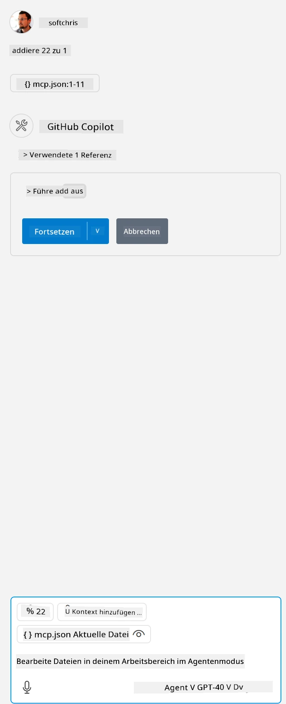

Dies entspricht dem Ausführen eines Befehls wie: `node build/index.js`.

- Ändern Sie diesen Server-Eintrag so, dass er auf den absoluten Pfad Ihrer Serverdatei zeigt oder passen Sie ihn an, um den Start Ihres Servers entsprechend Ihrer gewählten Laufzeit und Serverposition zu ermöglichen.

## Die Funktionen im Server nutzen

- Klicken Sie auf das `Play`-Symbol, nachdem Sie *mcp.json* im Ordner *./vscode* hinzugefügt haben,

    Beobachten Sie, wie sich das Symbol für die Werkzeuge ändert und die Anzahl der verfügbaren Tools erhöht. Das Werkzeug-Symbol befindet sich direkt über dem Chat-Feld in GitHub Copilot.

## Ein Tool ausführen

- Geben Sie eine Eingabeaufforderung in Ihr Chatfenster ein, die zur Beschreibung Ihres Tools passt. Um beispielsweise das Tool `add` auszulösen, tippen Sie etwas wie „add 3 to 20“.

    Sie sollten ein Tool sehen, das über dem Chat-Textfeld angezeigt wird und Sie auffordert, das Tool auszuwählen, um es auszuführen, wie in dieser Darstellung:

    

    Wenn Sie das Tool auswählen, sollte ein numerisches Ergebnis mit „23“ erscheinen, falls Ihre Eingabeaufforderung wie oben beschrieben war.

**Haftungsausschluss**:  
Dieses Dokument wurde mit dem KI-Übersetzungsdienst [Co-op Translator](https://github.com/Azure/co-op-translator) übersetzt. Obwohl wir uns um Genauigkeit bemühen, beachten Sie bitte, dass automatisierte Übersetzungen Fehler oder Ungenauigkeiten enthalten können. Das Originaldokument in seiner Ursprungssprache gilt als maßgebliche Quelle. Für wichtige Informationen wird eine professionelle menschliche Übersetzung empfohlen. Wir übernehmen keine Haftung für Missverständnisse oder Fehlinterpretationen, die aus der Nutzung dieser Übersetzung entstehen.