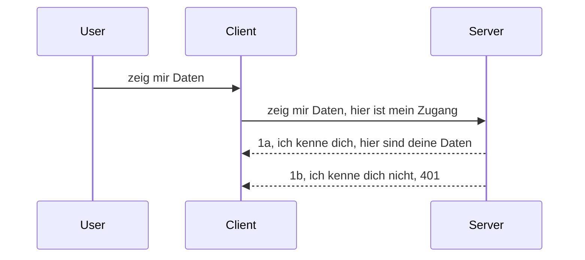

# Einfache Authentifizierung

MCP SDKs unterstützen die Verwendung von OAuth 2.1, was zugegebenermaßen ein ziemlich komplexer Prozess ist, der Konzepte wie Authentifizierungsserver, Ressourcenserver, das Senden von Anmeldedaten, den Erhalt eines Codes, das Austauschen des Codes gegen ein Bearer-Token umfasst, bis man schließlich auf die Ressourcendaten zugreifen kann. Wenn Sie OAuth nicht gewohnt sind, was eine großartige Sache zum Implementieren ist, ist es eine gute Idee, mit einer einfachen Authentifizierung zu beginnen und sich zu immer besserer Sicherheit vorzuarbeiten. Deshalb existiert dieses Kapitel, um Sie zu einer fortgeschritteneren Authentifizierung hinzuführen.

## Auth, was meinen wir?

Auth ist eine Abkürzung für Authentifizierung und Autorisierung. Die Idee ist, dass wir zwei Dinge tun müssen:

- **Authentifizierung**, das ist der Prozess herauszufinden, ob wir einer Person erlauben, unser Haus zu betreten, ob sie das Recht hat, "hier" zu sein, also Zugriff auf unseren Ressourcenserver zu haben, auf dem unsere MCP Server-Funktionen laufen.
- **Autorisierung**, ist der Prozess herauszufinden, ob ein Benutzer Zugriff auf genau diese angefragten Ressourcen haben sollte, zum Beispiel diese Bestellungen oder diese Produkte, oder ob er nur den Inhalt lesen, aber nicht löschen darf, als ein weiteres Beispiel.

## Anmeldedaten: wie wir dem System mitteilen, wer wir sind

Nun, die meisten Webentwickler denken dabei daran, dem Server eine Anmeldeinformation zu übermitteln, meist ein Geheimnis, das aussagt, ob sie hier sein dürfen "Authentifizierung". Diese Anmeldedaten sind üblicherweise eine base64-kodierte Version von Benutzername und Passwort oder ein API-Schlüssel, der einen bestimmten Benutzer eindeutig identifiziert.

Dies geschieht in der Regel über einen Header namens "Authorization", so:

```json
{ "Authorization": "secret123" }
```

Dies wird üblicherweise als Basic Authentication bezeichnet. Der Gesamtablauf funktioniert dann folgendermaßen:


Nun, da wir aus Sicht des Ablaufs verstehen, wie es funktioniert, wie implementieren wir es? Die meisten Webserver haben das Konzept von Middleware, einem Codeabschnitt, der als Teil der Anfrage ausgeführt wird und Anmeldedaten überprüfen kann, und wenn die Anmeldedaten gültig sind, lässt er die Anfrage passieren. Wenn die Anfrage keine gültigen Anmeldedaten hat, erhält man einen Authentifizierungsfehler. Sehen wir uns an, wie das implementiert werden kann:

**Python**

```python
class AuthMiddleware(BaseHTTPMiddleware):
    async def dispatch(self, request, call_next):

        has_header = request.headers.get("Authorization")
        if not has_header:
            print("-> Missing Authorization header!")
            return Response(status_code=401, content="Unauthorized")

        if not valid_token(has_header):
            print("-> Invalid token!")
            return Response(status_code=403, content="Forbidden")

        print("Valid token, proceeding...")
       
        response = await call_next(request)
        # Fügen Sie beliebige Kundenkopfzeilen hinzu oder ändern Sie die Antwort auf irgendeine Weise
        return response


starlette_app.add_middleware(CustomHeaderMiddleware)
```

Hier haben wir:

- Eine Middleware namens `AuthMiddleware` erstellt, wobei die Methode `dispatch` vom Webserver aufgerufen wird.
- Die Middleware dem Webserver hinzugefügt:

    ```python
    starlette_app.add_middleware(AuthMiddleware)
    ```

- Validierungslogik geschrieben, die überprüft, ob der Authorization-Header vorhanden ist und ob das gesendete Geheimnis gültig ist:

    ```python
    has_header = request.headers.get("Authorization")
    if not has_header:
        print("-> Missing Authorization header!")
        return Response(status_code=401, content="Unauthorized")

    if not valid_token(has_header):
        print("-> Invalid token!")
        return Response(status_code=403, content="Forbidden")
    ```

    Wenn das Geheimnis vorhanden und gültig ist, lassen wir die Anfrage passieren, indem wir `call_next` aufrufen und die Antwort zurückgeben.

    ```python
    response = await call_next(request)
    # Fügen Sie beliebige Kunden-Header hinzu oder ändern Sie die Antwort auf irgendeine Weise
    return response
    ```

Es funktioniert so, dass wenn eine Webanfrage an den Server gestellt wird, die Middleware aufgerufen wird und je nach Implementierung entweder die Anfrage durchlässt oder einen Fehler zurückgibt, der anzeigt, dass der Client nicht fortfahren darf.

**TypeScript**

Hier erstellen wir eine Middleware mit dem populären Framework Express und fangen die Anfrage ab, bevor sie zum MCP Server gelangt. Hier ist der Code dazu:

```typescript
function isValid(secret) {
    return secret === "secret123";
}

app.use((req, res, next) => {
    // 1. Autorisierungsheader vorhanden?
    if(!req.headers["Authorization"]) {
        res.status(401).send('Unauthorized');
    }
    
    let token = req.headers["Authorization"];

    // 2. Gültigkeit prüfen.
    if(!isValid(token)) {
        res.status(403).send('Forbidden');
    }

   
    console.log('Middleware executed');
    // 3. Übergibt die Anfrage an den nächsten Schritt in der Anforderungspipeline.
    next();
});
```

In diesem Code:

1. Prüfen wir, ob der Authorization-Header überhaupt vorhanden ist. Falls nicht, senden wir einen 401 Fehler.
2. Stellen sicher, dass die Anmeldedaten bzw. der Token gültig sind, falls nicht, schicken wir einen 403 Fehler.
3. Leiten schließlich die Anfrage weiter in der Request-Pipeline und liefern die angeforderte Ressource zurück.

## Übung: Implementiere Authentifizierung

Lassen Sie uns unser Wissen anwenden und es implementieren. Das ist der Plan:

Server

- Erstelle einen Webserver und eine MCP-Instanz.
- Implementiere eine Middleware für den Server.

Client

- Sende eine Webanfrage mit Anmeldedaten im Header.

### -1- Erstelle einen Webserver und eine MCP-Instanz

In unserem ersten Schritt müssen wir eine Webserverinstanz und den MCP Server erstellen.

**Python**

Hier erstellen wir eine MCP Server-Instanz, eine starlette Web-App und hosten sie mit uvicorn.

```python
# MCP-Server wird erstellt

app = FastMCP(
    name="MCP Resource Server",
    instructions="Resource Server that validates tokens via Authorization Server introspection",
    host=settings["host"],
    port=settings["port"],
    debug=True
)

# starlette Web-App wird erstellt
starlette_app = app.streamable_http_app()

# App wird über uvicorn bereitgestellt
async def run(starlette_app):
    import uvicorn
    config = uvicorn.Config(
            starlette_app,
            host=app.settings.host,
            port=app.settings.port,
            log_level=app.settings.log_level.lower(),
        )
    server = uvicorn.Server(config)
    await server.serve()

run(starlette_app)
```

In diesem Code:

- Erstellen wir den MCP Server.
- Konstruieren die starlette Web-App aus dem MCP Server, `app.streamable_http_app()`.
- Host und Dienst der Web-App mit uvicorn `server.serve()`.

**TypeScript**

Hier erstellen wir eine MCP Server-Instanz.

```typescript
const server = new McpServer({
      name: "example-server",
      version: "1.0.0"
    });

    // ... richte Server-Ressourcen, Werkzeuge und Aufforderungen ein ...
```

Diese Erstellung des MCP Servers muss innerhalb unserer POST /mcp Routen-Definition stattfinden, also verschieben wir den obigen Code so:

```typescript
import express from "express";
import { randomUUID } from "node:crypto";
import { McpServer } from "@modelcontextprotocol/sdk/server/mcp.js";
import { StreamableHTTPServerTransport } from "@modelcontextprotocol/sdk/server/streamableHttp.js";
import { isInitializeRequest } from "@modelcontextprotocol/sdk/types.js"

const app = express();
app.use(express.json());

// Karte zum Speichern von Transporten nach Sitzungs-ID
const transports: { [sessionId: string]: StreamableHTTPServerTransport } = {};

// Bearbeite POST-Anfragen für die Kommunikation vom Client zum Server
app.post('/mcp', async (req, res) => {
  // Prüfe auf vorhandene Sitzungs-ID
  const sessionId = req.headers['mcp-session-id'] as string | undefined;
  let transport: StreamableHTTPServerTransport;

  if (sessionId && transports[sessionId]) {
    // Wiederverwenden des vorhandenen Transports
    transport = transports[sessionId];
  } else if (!sessionId && isInitializeRequest(req.body)) {
    // Neue Initialisierungsanfrage
    transport = new StreamableHTTPServerTransport({
      sessionIdGenerator: () => randomUUID(),
      onsessioninitialized: (sessionId) => {
        // Speicher den Transport nach Sitzungs-ID
        transports[sessionId] = transport;
      },
      // DNS-Rebinding-Schutz ist standardmäßig zur Abwärtskompatibilität deaktiviert. Wenn Sie diesen Server lokal ausführen,
      // stellen Sie sicher, dass Sie Folgendes setzen:
      // enableDnsRebindingProtection: true,
      // allowedHosts: ['127.0.0.1'],
    });

    // Transport beim Schließen bereinigen
    transport.onclose = () => {
      if (transport.sessionId) {
        delete transports[transport.sessionId];
      }
    };
    const server = new McpServer({
      name: "example-server",
      version: "1.0.0"
    });

    // ... richte Serverressourcen, Werkzeuge und Eingabeaufforderungen ein ...

    // Verbinde zum MCP-Server
    await server.connect(transport);
  } else {
    // Ungültige Anfrage
    res.status(400).json({
      jsonrpc: '2.0',
      error: {
        code: -32000,
        message: 'Bad Request: No valid session ID provided',
      },
      id: null,
    });
    return;
  }

  // Bearbeite die Anfrage
  await transport.handleRequest(req, res, req.body);
});

// Wiederverwendbarer Handler für GET- und DELETE-Anfragen
const handleSessionRequest = async (req: express.Request, res: express.Response) => {
  const sessionId = req.headers['mcp-session-id'] as string | undefined;
  if (!sessionId || !transports[sessionId]) {
    res.status(400).send('Invalid or missing session ID');
    return;
  }
  
  const transport = transports[sessionId];
  await transport.handleRequest(req, res);
};

// Bearbeite GET-Anfragen für serverseitige Benachrichtigungen an den Client über SSE
app.get('/mcp', handleSessionRequest);

// Bearbeite DELETE-Anfragen zur Sitzungsbeendigung
app.delete('/mcp', handleSessionRequest);

app.listen(3000);
```

Jetzt sehen Sie, wie die Erstellung des MCP Servers in `app.post("/mcp")` verschoben wurde.

Kommen wir zum nächsten Schritt, der Erstellung der Middleware, um die eingehenden Anmeldedaten zu validieren.

### -2- Implementiere eine Middleware für den Server

Kommen wir zum Middleware-Teil. Hier erstellen wir eine Middleware, die nach Anmeldedaten im `Authorization` Header sucht und diese validiert. Wenn sie akzeptabel sind, wird die Anfrage weitergeleitet, um zu tun, was sie tun soll (z.B. Werkzeuge auflisten, eine Ressource lesen oder welche MCP-Funktionalität der Client auch immer anfordert).

**Python**

Um die Middleware zu erstellen, brauchen wir eine Klasse, die von `BaseHTTPMiddleware` erbt. Es gibt zwei interessante Bestandteile:

- Die Anfrage `request`, von der wir die Header-Informationen lesen.
- `call_next`, den Callback, den wir aufrufen müssen, wenn der Client eine akzeptierte Anmeldedaten mitbringt.

Zuerst behandeln wir den Fall, wenn der `Authorization` Header fehlt:

```python
has_header = request.headers.get("Authorization")

# kein Header vorhanden, mit 401 fehlschlagen, sonst weitermachen.
if not has_header:
    print("-> Missing Authorization header!")
    return Response(status_code=401, content="Unauthorized")
```

Hier senden wir eine 401 Unauthorized Nachricht, weil die Authentifizierung des Clients fehlschlägt.

Als nächstes, wenn Anmeldedaten übermittelt wurden, prüfen wir deren Gültigkeit so:

```python
 if not valid_token(has_header):
    print("-> Invalid token!")
    return Response(status_code=403, content="Forbidden")
```

Beachten Sie, dass wir oben eine 403 Forbidden Nachricht senden. Kommen wir zur kompletten Middleware, die alles oben Genannte implementiert:

```python
class AuthMiddleware(BaseHTTPMiddleware):
    async def dispatch(self, request, call_next):

        has_header = request.headers.get("Authorization")
        if not has_header:
            print("-> Missing Authorization header!")
            return Response(status_code=401, content="Unauthorized")

        if not valid_token(has_header):
            print("-> Invalid token!")
            return Response(status_code=403, content="Forbidden")

        print("Valid token, proceeding...")
        print(f"-> Received {request.method} {request.url}")
        response = await call_next(request)
        response.headers['Custom'] = 'Example'
        return response

```

Prima, aber was ist mit der Funktion `valid_token`? Hier ist sie:

```python
# NICHT für die Produktion verwenden - verbessern Sie es !!
def valid_token(token: str) -> bool:
    # Entfernen Sie das Präfix "Bearer "
    if token.startswith("Bearer "):
        token = token[7:]
        return token == "secret-token"
    return False
```

Das sollte natürlich verbessert werden.

WICHTIG: Sie sollten NIEMALS geheime Werte wie diese im Code speichern. Idealerweise holen Sie den zu vergleichenden Wert aus einer Datenquelle oder einem IDP (Identitätsanbieter) oder noch besser lassen Sie den IDP die Validierung durchführen.

**TypeScript**

Um dies mit Express zu implementieren, müssen wir die `use` Methode verwenden, die Middleware-Funktionen akzeptiert.

Wir müssen:

- Mit der Anfragevariable interagieren, um die übergebenen Anmeldedaten im `Authorization` Feld zu prüfen.
- Die Anmeldedaten validieren, und falls gültig, die Anfrage weiterleiten, damit die MCP-Anfrage des Clients das tut, was sie soll (z.B. Werkzeuge auflisten, Ressource lesen oder anderes MCP-bezogenes).

Hier prüfen wir, ob der `Authorization` Header vorhanden ist, und wenn nicht, stoppen wir die Anfrage:

```typescript
if(!req.headers["authorization"]) {
    res.status(401).send('Unauthorized');
    return;
}
```

Wenn der Header überhaupt nicht gesendet wird, bekommt man einen 401.

Als nächstes prüfen wir, ob die Anmeldedaten gültig sind, wenn nicht, stoppen wir die Anfrage erneut, aber mit einer anderen Nachricht:

```typescript
if(!isValid(token)) {
    res.status(403).send('Forbidden');
    return;
} 
```

Beachten Sie, dass Sie nun einen 403 Fehler erhalten.

Hier ist der vollständige Code:

```typescript
app.use((req, res, next) => {
    console.log('Request received:', req.method, req.url, req.headers);
    console.log('Headers:', req.headers["authorization"]);
    if(!req.headers["authorization"]) {
        res.status(401).send('Unauthorized');
        return;
    }
    
    let token = req.headers["authorization"];

    if(!isValid(token)) {
        res.status(403).send('Forbidden');
        return;
    }  

    console.log('Middleware executed');
    next();
});
```

Wir haben den Webserver so eingerichtet, dass er eine Middleware akzeptiert, um die Anmeldedaten zu überprüfen, die uns der Client hoffentlich sendet. Wie sieht es mit dem Client selbst aus?

### -3- Sende eine Webanfrage mit Anmeldedaten im Header

Wir müssen dafür sorgen, dass der Client die Anmeldedaten im Header übergibt. Da wir einen MCP Client verwenden wollen, müssen wir herausfinden, wie das geht.

**Python**

Für den Client müssen wir einen Header mit unseren Anmeldedaten übermitteln, so:

```python
# SCHREIBE den Wert NICHT fest, behalte ihn mindestens in einer Umgebungsvariable oder einem sichereren Speicher
token = "secret-token"

async with streamablehttp_client(
        url = f"http://localhost:{port}/mcp",
        headers = {"Authorization": f"Bearer {token}"}
    ) as (
        read_stream,
        write_stream,
        session_callback,
    ):
        async with ClientSession(
            read_stream,
            write_stream
        ) as session:
            await session.initialize()
      
            # TODO, was im Client gemacht werden soll, z.B. Werkzeuge auflisten, Werkzeuge aufrufen etc.
```

Beachten Sie, wie wir die Property `headers` so füllen: ` headers = {"Authorization": f"Bearer {token}"}`.

**TypeScript**

Wir können das in zwei Schritten lösen:

1. Wir erstellen ein Konfigurationsobjekt mit unseren Anmeldedaten.
2. Wir übergeben das Konfigurationsobjekt an den Transport.

```typescript

// HACKEN Sie den Wert nicht so fest ein wie hier gezeigt. Verwenden Sie mindestens eine Umgebungsvariable und etwas wie dotenv (im Entwicklungsmodus).
let token = "secret123"

// Definieren Sie ein Client-Transportoptionenobjekt
let options: StreamableHTTPClientTransportOptions = {
  sessionId: sessionId,
  requestInit: {
    headers: {
      "Authorization": "secret123"
    }
  }
};

// Übergeben Sie das Optionsobjekt an den Transport
async function main() {
   const transport = new StreamableHTTPClientTransport(
      new URL(serverUrl),
      options
   );
```

Hier sehen Sie, wie wir ein `options` Objekt anlegen mussten und unsere Header unter `requestInit` platzieren.

WICHTIG: Wie können wir das von hier aus verbessern? Nun, die aktuelle Implementierung hat einige Probleme. Erstens ist es ziemlich riskant, Anmeldedaten so zu senden, außer man hat mindestens HTTPS. Selbst dann können die Anmeldedaten gestohlen werden. Daher braucht man ein System, in dem man Tokens leicht zurückrufen kann und zusätzliche Prüfungen durchführt, z.B. woher auf der Welt die Anfrage kommt, ob die Anfrage zu oft erfolgt (bot-ähnliches Verhalten), kurz gesagt, es gibt viele Aspekte, die bedacht werden müssen.

Man muss aber sagen, dass für sehr einfache APIs, bei denen man nicht will, dass jemand die API ohne Authentifizierung aufruft, das hier ein guter Anfang ist.

Damit sind wir nun bereit, die Sicherheit etwas zu erhöhen, indem wir ein standardisiertes Format wie JSON Web Token verwenden, auch bekannt als JWT- oder "JOT"-Tokens.

## JSON Web Tokens, JWT

Also, wir versuchen, die Dinge zu verbessern im Vergleich zu sehr einfachen Anmeldedaten. Was sind die unmittelbaren Verbesserungen, wenn man JWT einsetzt?

- **Sicherheitsverbesserungen**. Bei Basic Auth sendet man Benutzername und Passwort base64-kodiert (oder einen API-Key) immer wieder, was das Risiko erhöht. Mit JWT sendet man seinen Benutzernamen und Passwort, erhält ein Token zurück, das zudem zeitlich begrenzt ist und somit abläuft. JWT ermöglicht granulare Zugangskontrollen mit Rollen, Scopes und Berechtigungen.
- **Zustandslosigkeit und Skalierbarkeit**. JWTs sind selbstenthaltend, sie tragen alle Nutzerinformationen und ersparen serverseitigen Session-Speicher. Tokens können auch lokal validiert werden.
- **Interoperabilität und Föderation**. JWT ist zentral für OpenID Connect und wird bei bekannten Identitätsanbietern wie Entra ID, Google Identity und Auth0 verwendet. Sie ermöglichen Single Sign-On und mehr, machen es also auf Enterprise-Niveau einsetzbar.
- **Modularität und Flexibilität**. JWTs können mit API-Gateways wie Azure API Management, NGINX usw. verwendet werden. Sie unterstützen Authentifizierungsszenarien und auch Kommunikation von Server zu Server inklusive Imitation und Delegation.
- **Performance und Caching**. JWTs können nach dem Decodieren gecached werden, was die Notwendigkeit für wiederholtes Parsen reduziert. Das hilft besonders bei stark frequentierten Anwendungen, indem es Durchsatz verbessert und die Belastung der Infrastruktur verringert.
- **Erweiterte Funktionen**. JWT unterstützt auch Introspektion (Gültigkeitsprüfung am Server) und das Zurückziehen (Revocation, Ungültigmachen eines Tokens).

Mit all diesen Vorteilen schauen wir, wie wir unsere Implementierung auf das nächste Level bringen.

## Von Basic Auth zu JWT

Die grundlegenden Änderungen, die wir vornehmen müssen, sind:

- **Lernen ein JWT-Token zu erzeugen** und es so zu bauen, dass es vom Client an den Server geschickt werden kann.
- **Ein JWT-Token validieren** und falls gültig, dem Client Zugriff auf unsere Ressourcen gewähren.
- **Sichere Token-Speicherung**. Wie wir das Token speichern.
- **Schützen der Routen**. Wir müssen Routen und bestimmte MCP-Funktionen schützen.
- **Refresh-Tokens hinzufügen**. Sicherstellen, dass es kurzlebige Tokens gibt, aber auch lange lebendige Refresh-Tokens, um neue Tokens anzufordern, wenn die ablaufen. Außerdem braucht es eine Refresh-Schnittstelle und eine Rotationsstrategie.

### -1- JWT-Token erzeugen

Zuerst hat ein JWT-Token folgende Teile:

- **header**, Algorithmus und Token-Typ.
- **payload**, Claims wie sub (der Benutzer oder die Entität, die das Token repräsentiert, typischerweise die Benutzer-ID), exp (Ablaufzeit), role (Rolle)
- **signature**, signiert mit einem Geheimnis oder Private Key.

Wir müssen deswegen den Header, Payload und das kodierte Token erzeugen.

**Python**

```python

import jwt
import jwt
from jwt.exceptions import ExpiredSignatureError, InvalidTokenError
import datetime

# Geheimer Schlüssel zum Signieren des JWT
secret_key = 'your-secret-key'

header = {
    "alg": "HS256",
    "typ": "JWT"
}

# die Benutzerinformationen sowie deren Ansprüche und Ablaufzeit
payload = {
    "sub": "1234567890",               # Subjekt (Benutzer-ID)
    "name": "User Userson",                # Benutzerdefinierter Anspruch
    "admin": True,                     # Benutzerdefinierter Anspruch
    "iat": datetime.datetime.utcnow(),# Ausgestellt am
    "exp": datetime.datetime.utcnow() + datetime.timedelta(hours=1)  # Ablauf
}

# kodieren
encoded_jwt = jwt.encode(payload, secret_key, algorithm="HS256", headers=header)
```

Im obigen Code haben wir:

- Einen Header definiert mit dem Algorithmus HS256 und Typ JWT.
- Einen Payload gebaut, der ein Subjekt oder User-ID, Benutzername, Rolle, Ausgabezeitpunkt und Ablaufzeitpunkt enthält und damit den zeitlich begrenzten Aspekt umsetzt.

**TypeScript**

Hier brauchen wir Dependencies, die uns helfen, das JWT-Token zu erstellen.

Dependencies

```sh

npm install jsonwebtoken
npm install --save-dev @types/jsonwebtoken
```

Jetzt, da wir das haben, erstellen wir den Header, Payload und damit das kodierte Token.

```typescript
import jwt from 'jsonwebtoken';

const secretKey = 'your-secret-key'; // Verwenden Sie Umgebungsvariablen in der Produktion

// Definieren Sie die Nutzlast
const payload = {
  sub: '1234567890',
  name: 'User usersson',
  admin: true,
  iat: Math.floor(Date.now() / 1000), // Ausgestellt um
  exp: Math.floor(Date.now() / 1000) + 60 * 60 // Läuft in 1 Stunde ab
};

// Definieren Sie den Header (optional, jsonwebtoken setzt Standardwerte)
const header = {
  alg: 'HS256',
  typ: 'JWT'
};

// Erstellen Sie das Token
const token = jwt.sign(payload, secretKey, {
  algorithm: 'HS256',
  header: header
});

console.log('JWT:', token);
```

Dieses Token ist:

Mit HS256 signiert
Gültig für 1 Stunde
Enthält Claims wie sub, name, admin, iat und exp.

### -2- Token validieren

Wir müssen auch ein Token validieren, das sollte auf dem Server passieren, um sicherzustellen, dass das, was der Client schickt, tatsächlich gültig ist. Es gibt viele Prüfungen vom Aufbau bis zur Gültigkeit, die man durchführen sollte. Außerdem wird empfohlen, weitere Prüfungen hinzuzufügen, um etwa zu prüfen, ob der Nutzer in unserem System ist und die entsprechenden Rechte besitzt.

Zur Validierung müssen wir das Token dekodieren, um es lesen zu können und dann mit der Validierung beginnen:

**Python**

```python

# JWT dekodieren und verifizieren
try:
    decoded = jwt.decode(token, secret_key, algorithms=["HS256"])
    print("✅ Token is valid.")
    print("Decoded claims:")
    for key, value in decoded.items():
        print(f"  {key}: {value}")
except ExpiredSignatureError:
    print("❌ Token has expired.")
except InvalidTokenError as e:
    print(f"❌ Invalid token: {e}")

```

In diesem Code rufen wir `jwt.decode` mit Token, dem Geheimschlüssel und dem angegebenen Algorithmus auf. Beachten Sie, dass wir eine try-catch-Struktur verwenden, da eine fehlgeschlagene Validierung einen Fehler auslöst.

**TypeScript**

Hier müssen wir `jwt.verify` aufrufen, um eine dekodierte Version des Tokens zu erhalten, die wir weiter analysieren können. Schlägt dieser Aufruf fehl, ist das Token entweder falsch aufgebaut oder nicht mehr gültig.

```typescript

try {
  const decoded = jwt.verify(token, secretKey);
  console.log('Decoded Payload:', decoded);
} catch (err) {
  console.error('Token verification failed:', err);
}
```

HINWEIS: Wie bereits erwähnt sollten Sie weitere Prüfungen durchführen, um sicherzustellen, dass dieses Token auf einen Nutzer in Ihrem System verweist und der Nutzer wirklich die angegebenen Rechte besitzt.
Als Nächstes betrachten wir rollenbasierte Zugriffskontrolle, auch bekannt als RBAC.

## Rollenbasierte Zugriffskontrolle hinzufügen

Die Idee ist, dass wir ausdrücken wollen, dass unterschiedliche Rollen unterschiedliche Berechtigungen haben. Zum Beispiel nehmen wir an, dass ein Admin alles machen kann, ein normaler Benutzer lesen/schreiben darf und ein Gast nur lesen kann. Daher gibt es hier einige mögliche Berechtigungsstufen:

- Admin.Write 
- User.Read
- Guest.Read

Schauen wir uns an, wie wir eine solche Kontrolle mit Middleware implementieren können. Middleware kann pro Route sowie für alle Routen hinzugefügt werden.

**Python**

```python
from starlette.middleware.base import BaseHTTPMiddleware
from starlette.responses import JSONResponse
import jwt

# HABEN Sie das Geheimnis nicht im Code, dies ist nur zu Demonstrationszwecken. Lesen Sie es von einem sicheren Ort.
SECRET_KEY = "your-secret-key" # Legen Sie dies in eine Umgebungsvariable.
REQUIRED_PERMISSION = "User.Read"

class JWTPermissionMiddleware(BaseHTTPMiddleware):
    async def dispatch(self, request, call_next):
        auth_header = request.headers.get("Authorization")
        if not auth_header or not auth_header.startswith("Bearer "):
            return JSONResponse({"error": "Missing or invalid Authorization header"}, status_code=401)

        token = auth_header.split(" ")[1]
        try:
            decoded = jwt.decode(token, SECRET_KEY, algorithms=["HS256"])
        except jwt.ExpiredSignatureError:
            return JSONResponse({"error": "Token expired"}, status_code=401)
        except jwt.InvalidTokenError:
            return JSONResponse({"error": "Invalid token"}, status_code=401)

        permissions = decoded.get("permissions", [])
        if REQUIRED_PERMISSION not in permissions:
            return JSONResponse({"error": "Permission denied"}, status_code=403)

        request.state.user = decoded
        return await call_next(request)


```

Es gibt verschiedene Möglichkeiten, die Middleware wie unten hinzuzufügen:

```python

# Alternative 1: Middleware beim Erstellen der Starlette-App hinzufügen
middleware = [
    Middleware(JWTPermissionMiddleware)
]

app = Starlette(routes=routes, middleware=middleware)

# Alternative 2: Middleware hinzufügen, nachdem die Starlette-App bereits erstellt wurde
starlette_app.add_middleware(JWTPermissionMiddleware)

# Alternative 3: Middleware pro Route hinzufügen
routes = [
    Route(
        "/mcp",
        endpoint=..., # Handler
        middleware=[Middleware(JWTPermissionMiddleware)]
    )
]
```

**TypeScript**

Wir können `app.use` und eine Middleware verwenden, die für alle Anfragen ausgeführt wird. 

```typescript
app.use((req, res, next) => {
    console.log('Request received:', req.method, req.url, req.headers);
    console.log('Headers:', req.headers["authorization"]);

    // 1. Überprüfen, ob der Autorisierungs-Header gesendet wurde

    if(!req.headers["authorization"]) {
        res.status(401).send('Unauthorized');
        return;
    }
    
    let token = req.headers["authorization"];

    // 2. Überprüfen, ob das Token gültig ist
    if(!isValid(token)) {
        res.status(403).send('Forbidden');
        return;
    }  

    // 3. Überprüfen, ob der Token-Benutzer in unserem System existiert
    if(!isExistingUser(token)) {
        res.status(403).send('Forbidden');
        console.log("User does not exist");
        return;
    }
    console.log("User exists");

    // 4. Überprüfen, ob das Token die richtigen Berechtigungen hat
    if(!hasScopes(token, ["User.Read"])){
        res.status(403).send('Forbidden - insufficient scopes');
    }

    console.log("User has required scopes");

    console.log('Middleware executed');
    next();
});

```

Unsere Middleware kann und SOLLTE einige Dinge tun, nämlich:

1. Prüfen, ob der Authorization-Header vorhanden ist
2. Prüfen, ob das Token gültig ist; wir rufen `isValid` auf, eine Methode, die wir geschrieben haben, die die Integrität und Gültigkeit des JWT-Tokens überprüft.
3. Verifizieren, ob der Benutzer in unserem System existiert; dies sollten wir prüfen.

   ```typescript
    // Benutzer in der DB
   const users = [
     "user1",
     "User usersson",
   ]

   function isExistingUser(token) {
     let decodedToken = verifyToken(token);

     // TODO, prüfen, ob Benutzer in der DB existiert
     return users.includes(decodedToken?.name || "");
   }
   ```

Oben haben wir eine sehr einfache `users`-Liste erstellt, die natürlich in einer Datenbank liegen sollte.

4. Zusätzlich sollten wir prüfen, ob das Token die richtigen Berechtigungen enthält.

   ```typescript
   if(!hasScopes(token, ["User.Read"])){
        res.status(403).send('Forbidden - insufficient scopes');
   }
   ```

Im obigen Code der Middleware prüfen wir, dass das Token die User.Read-Berechtigung enthält, sonst senden wir einen 403-Fehler. Unten ist die Hilfsmethode `hasScopes`.

   ```typescript
   function hasScopes(scope: string, requiredScopes: string[]) {
     let decodedToken = verifyToken(scope);
    return requiredScopes.every(scope => decodedToken?.scopes.includes(scope));
  }
   ```

Have a think which additional checks you should be doing, but these are the absolute minimum of checks you should be doing.

Using Express as a web framework is a common choice. There are helpers library when you use JWT so you can write less code.

- `express-jwt`, helper library that provides a middleware that helps decode your token.
- `express-jwt-permissions`, this provides a middleware `guard` that helps check if a certain permission is on the token.

Here's what these libraries can look like when used:

```typescript
const express = require('express');
const jwt = require('express-jwt');
const guard = require('express-jwt-permissions')();

const app = express();
const secretKey = 'your-secret-key'; // put this in env variable

// Decode JWT and attach to req.user
app.use(jwt({ secret: secretKey, algorithms: ['HS256'] }));

// Check for User.Read permission
app.use(guard.check('User.Read'));

// multiple permissions
// app.use(guard.check(['User.Read', 'Admin.Access']));

app.get('/protected', (req, res) => {
  res.json({ message: `Welcome ${req.user.name}` });
});

// Error handler
app.use((err, req, res, next) => {
  if (err.code === 'permission_denied') {
    return res.status(403).send('Forbidden');
  }
  next(err);
});

```

Nun haben Sie gesehen, wie Middleware für Authentifizierung und Autorisierung verwendet werden kann. Aber wie sieht das bei MCP aus, ändert sich dadurch unsere Authentifizierung? Finden wir das im nächsten Abschnitt heraus.

### -3- RBAC zu MCP hinzufügen

Sie haben bisher gesehen, wie Sie RBAC über Middleware hinzufügen können. Für MCP gibt es jedoch keine einfache Möglichkeit, RBAC für jede MCP-Funktion hinzuzufügen. Was tun wir also? Nun, wir müssen einfach Code hinzufügen, der in diesem Fall prüft, ob der Client die Rechte hat, ein bestimmtes Tool aufzurufen:

Sie haben verschiedene Möglichkeiten, RBAC pro Funktion umzusetzen, hier einige davon:

- Fügen Sie für jedes Tool, jede Ressource, jeden Prompt eine Prüfung hinzu, bei der die Berechtigungsstufe kontrolliert wird.

   **python**

   ```python
   @tool()
   def delete_product(id: int):
      try:
          check_permissions(role="Admin.Write", request)
      catch:
        pass # Client hat die Autorisierung nicht bestanden, Autorisierungsfehler auslösen
   ```

   **typescript**

   ```typescript
   server.registerTool(
    "delete-product",
    {
      title: Delete a product",
      description: "Deletes a product",
      inputSchema: { id: z.number() }
    },
    async ({ id }) => {
      
      try {
        checkPermissions("Admin.Write", request);
        // todo, sende ID an productService und Remote-Eintrag
      } catch(Exception e) {
        console.log("Authorization error, you're not allowed");  
      }

      return {
        content: [{ type: "text", text: `Deletected product with id ${id}` }]
      };
    }
   );
   ```


- Verwenden Sie einen erweiterten Serveransatz und die Request-Handler, um die Anzahl der Orte zu minimieren, an denen Sie die Prüfung durchführen müssen.

   **Python**

   ```python
   
   tool_permission = {
      "create_product": ["User.Write", "Admin.Write"],
      "delete_product": ["Admin.Write"]
   }

   def has_permission(user_permissions, required_permissions) -> bool:
      # user_permissions: Liste der Berechtigungen, die der Benutzer hat
      # required_permissions: Liste der für das Tool erforderlichen Berechtigungen
      return any(perm in user_permissions for perm in required_permissions)

   @server.call_tool()
   async def handle_call_tool(
     name: str, arguments: dict[str, str] | None
   ) -> list[types.TextContent]:
    # Gehe davon aus, dass request.user.permissions eine Liste der Berechtigungen des Benutzers ist
     user_permissions = request.user.permissions
     required_permissions = tool_permission.get(name, [])
     if not has_permission(user_permissions, required_permissions):
        # Fehler auslösen "Sie haben keine Berechtigung, das Tool {name} aufzurufen"
        raise Exception(f"You don't have permission to call tool {name}")
     # fortfahren und Tool aufrufen
     # ...
   ```   
   

   **TypeScript**

   ```typescript
   function hasPermission(userPermissions: string[], requiredPermissions: string[]): boolean {
       if (!Array.isArray(userPermissions) || !Array.isArray(requiredPermissions)) return false;
       // Gibt true zurück, wenn der Benutzer mindestens eine erforderliche Berechtigung hat
       
       return requiredPermissions.some(perm => userPermissions.includes(perm));
   }
  
   server.setRequestHandler(CallToolRequestSchema, async (request) => {
      const { params: { name } } = request;
  
      let permissions = request.user.permissions;
  
      if (!hasPermission(permissions, toolPermissions[name])) {
         return new Error(`You don't have permission to call ${name}`);
      }
  
      // Mach weiter..
   });
   ```

   Hinweis: Sie müssen sicherstellen, dass Ihre Middleware dem Benutzer-Property der Anfrage ein dekodiertes Token zuweist, damit der obige Code vereinfacht wird.

### Zusammenfassung

Nachdem wir nun besprochen haben, wie man Unterstützung für RBAC im Allgemeinen und für MCP im Besonderen hinzufügt, ist es Zeit, selbst Sicherheit zu implementieren, um sicherzustellen, dass Sie die vorgestellten Konzepte verstanden haben.

## Aufgabe 1: Erstellen Sie einen MCP-Server und einen MCP-Client mit einfacher Authentifizierung

Hier wenden Sie an, was Sie beim Senden von Anmeldeinformationen über Header gelernt haben.

## Lösung 1

[Lösung 1](./code/basic/README.md)

## Aufgabe 2: Aktualisieren Sie die Lösung aus Aufgabe 1 auf die Verwendung von JWT

Nehmen Sie die erste Lösung, aber verbessern Sie sie diesmal.

Anstatt Basic Auth zu verwenden, verwenden wir JWT.

## Lösung 2

[Lösung 2](./solution/jwt-solution/README.md)

## Herausforderung

Fügen Sie das pro Werkzeug beschriebene RBAC hinzu, wie in Abschnitt "RBAC zu MCP hinzufügen" erläutert.

## Zusammenfassung

Sie haben hoffentlich in diesem Kapitel viel gelernt, von keiner Sicherheit über Basis-Sicherheit bis hin zu JWT und wie es zu MCP hinzugefügt wird.

Wir haben eine solide Grundlage mit benutzerdefinierten JWTs gebaut, aber wenn wir skalieren, bewegen wir uns zu einem standardisierten Identitätsmodell. Die Verwendung eines IdP wie Entra oder Keycloak ermöglicht es uns, Token-Ausgabe, Validierung und Lifecycle-Management einer vertrauenswürdigen Plattform zu überlassen — so können wir uns auf die Anwendungslogik und Benutzererfahrung konzentrieren.

Dafür haben wir ein weiterführendes [Kapitel zu Entra](../../05-AdvancedTopics/mcp-security-entra/README.md)

## Was kommt als Nächstes

- Nächstes: [MCP-Hosts einrichten](../12-mcp-hosts/README.md)

---

<!-- CO-OP TRANSLATOR DISCLAIMER START -->
**Haftungsausschluss**:  
Dieses Dokument wurde mit dem KI-Übersetzungsdienst [Co-op Translator](https://github.com/Azure/co-op-translator) übersetzt. Obwohl wir uns um Genauigkeit bemühen, beachten Sie bitte, dass automatisierte Übersetzungen Fehler oder Ungenauigkeiten enthalten können. Das Originaldokument in seiner Ausgangssprache gilt als maßgebliche Quelle. Für wichtige Informationen wird eine professionelle menschliche Übersetzung empfohlen. Wir übernehmen keine Haftung für Missverständnisse oder Fehlinterpretationen, die durch die Nutzung dieser Übersetzung entstehen.
<!-- CO-OP TRANSLATOR DISCLAIMER END -->