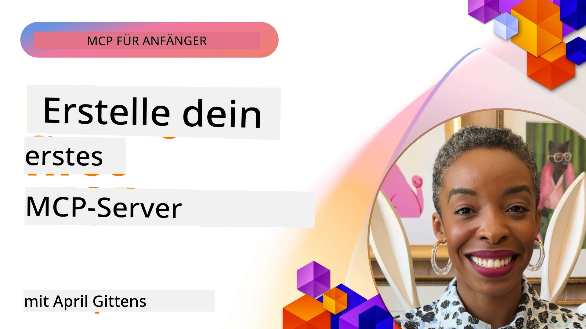

## Erste Schritte  

_(Klicken Sie auf das obige Bild, um das Video zu dieser Lektion anzusehen)_

Dieser Abschnitt besteht aus mehreren Lektionen:

- **1 Ihr erster Server**, in dieser ersten Lektion lernen Sie, wie Sie Ihren ersten Server erstellen und ihn mit dem Inspektor-Tool untersuchen, eine wertvolle Methode, um Ihren Server zu testen und zu debuggen, [zur Lektion](01-first-server/README.md)

- **2 Client**, in dieser Lektion lernen Sie, wie Sie einen Client schreiben, der sich mit Ihrem Server verbinden kann, [zur Lektion](02-client/README.md)

- **3 Client mit LLM**, eine noch bessere Methode, einen Client zu schreiben, besteht darin, ihm ein LLM hinzuzufügen, damit er mit Ihrem Server "verhandeln" kann, was zu tun ist, [zur Lektion](03-llm-client/README.md)

- **4 Nutzung des server GitHub Copilot Agent-Modus in Visual Studio Code**. Hier sehen wir uns an, wie wir unseren MCP-Server von Visual Studio Code aus ausführen, [zur Lektion](04-vscode/README.md)

- **5 stdio Transportserver** stdio-Transport ist der empfohlene Standard für die lokale MCP-Server-Client-Kommunikation und bietet sichere subprocess-basierte Kommunikation mit integrierter Prozessisolation [zur Lektion](05-stdio-server/README.md)

- **6 HTTP-Streaming mit MCP (Streamable HTTP)**. Lernen Sie moderne HTTP-Streaming-Transporte kennen (die empfohlene Methode für entfernte MCP-Server gemäß [MCP-Spezifikation 2025-11-25](https://spec.modelcontextprotocol.io/specification/2025-11-25/basic/transports/#streamable-http)), Fortschrittsbenachrichtigungen und wie man skalierbare, Echtzeit-MCP-Server und Clients mit Streamable HTTP implementiert. [zur Lektion](06-http-streaming/README.md)

- **7 Nutzung des AI Toolkits für VSCode** zum Konsumieren und Testen Ihrer MCP-Clients und Server [zur Lektion](07-aitk/README.md)

- **8 Testen**. Hier konzentrieren wir uns besonders darauf, wie wir unseren Server und Client auf verschiedene Arten testen können, [zur Lektion](08-testing/README.md)

- **9 Bereitstellung**. Dieses Kapitel behandelt verschiedene Methoden zur Bereitstellung Ihrer MCP-Lösungen, [zur Lektion](09-deployment/README.md)

- **10 Erweiterte Servernutzung**. Dieses Kapitel behandelt fortgeschrittene Servernutzung, [zur Lektion](./10-advanced/README.md)

- **11 Auth**. Dieses Kapitel behandelt, wie man einfache Authentifizierung hinzufügt, von Basic Auth bis zur Verwendung von JWT und RBAC. Sie werden ermutigt, hier zu beginnen und dann weiter zu den erweiterten Themen in Kapitel 5 zu gehen sowie zusätzliche Sicherheitsmaßnahmen gemäß den Empfehlungen in Kapitel 2 durchzuführen, [zur Lektion](./11-simple-auth/README.md)

- **12 MCP Hosts**. Konfigurieren und verwenden Sie beliebte MCP Host-Clients wie Claude Desktop, Cursor, Cline und Windsurf. Lernen Sie Transporttypen und Fehlerbehebung kennen, [zur Lektion](./12-mcp-hosts/README.md)

- **13 MCP Inspector**. Debuggen und testen Sie Ihre MCP-Server interaktiv mit dem MCP Inspector-Tool. Lernen Sie Tools, Ressourcen und Protokollnachrichten zur Fehlerbehebung kennen, [zur Lektion](./13-mcp-inspector/README.md)

Das Model Context Protocol (MCP) ist ein offenes Protokoll, das standardisiert, wie Anwendungen Kontext für LLMs bereitstellen. Man kann MCP als USB-C-Anschluss für KI-Anwendungen betrachten – es bietet eine standardisierte Möglichkeit, KI-Modelle mit verschiedenen Datenquellen und Werkzeugen zu verbinden.

## Lernziele

Am Ende dieser Lektion werden Sie in der Lage sein:

- Entwicklungsumgebungen für MCP in C#, Java, Python, TypeScript und JavaScript einzurichten
- Grundlegende MCP-Server mit benutzerdefinierten Funktionen (Ressourcen, Prompts und Tools) zu erstellen und bereitzustellen
- Host-Anwendungen zu erstellen, die sich mit MCP-Servern verbinden
- MCP-Implementierungen zu testen und zu debuggen
- Häufige Einrichtungsprobleme und deren Lösungen zu verstehen
- Ihre MCP-Implementierungen mit beliebten LLM-Diensten zu verbinden

## Einrichtung Ihrer MCP-Umgebung

Bevor Sie mit MCP arbeiten, ist es wichtig, Ihre Entwicklungsumgebung vorzubereiten und den grundlegenden Arbeitsablauf zu verstehen. Dieser Abschnitt führt Sie durch die ersten Schritte, um einen reibungslosen Einstieg in MCP zu gewährleisten.

### Voraussetzungen

Bevor Sie mit der MCP-Entwicklung beginnen, stellen Sie sicher, dass Sie Folgendes haben:

- **Entwicklungsumgebung**: Für Ihre gewählte Sprache (C#, Java, Python, TypeScript oder JavaScript)
- **IDE/Editor**: Visual Studio, Visual Studio Code, IntelliJ, Eclipse, PyCharm oder jeden modernen Code-Editor
- **Paketmanager**: NuGet, Maven/Gradle, pip oder npm/yarn
- **API-Schlüssel**: Für alle KI-Dienste, die Sie in Ihren Host-Anwendungen verwenden möchten

### Offizielle SDKs

In den kommenden Kapiteln sehen Sie Lösungen, die mit Python, TypeScript, Java und .NET erstellt wurden. Hier sind alle offiziell unterstützten SDKs.

MCP bietet offizielle SDKs für mehrere Sprachen (im Einklang mit der [MCP-Spezifikation 2025-11-25](https://spec.modelcontextprotocol.io/specification/2025-11-25/)):
- [C# SDK](https://github.com/modelcontextprotocol/csharp-sdk) – Wird in Zusammenarbeit mit Microsoft gepflegt
- [Java SDK](https://github.com/modelcontextprotocol/java-sdk) – Wird in Zusammenarbeit mit Spring AI gepflegt
- [TypeScript SDK](https://github.com/modelcontextprotocol/typescript-sdk) – Die offizielle TypeScript-Implementierung
- [Python SDK](https://github.com/modelcontextprotocol/python-sdk) – Die offizielle Python-Implementierung (FastMCP)
- [Kotlin SDK](https://github.com/modelcontextprotocol/kotlin-sdk) – Die offizielle Kotlin-Implementierung
- [Swift SDK](https://github.com/modelcontextprotocol/swift-sdk) – Wird in Zusammenarbeit mit Loopwork AI gepflegt
- [Rust SDK](https://github.com/modelcontextprotocol/rust-sdk) – Die offizielle Rust-Implementierung
- [Go SDK](https://github.com/modelcontextprotocol/go-sdk) – Die offizielle Go-Implementierung

## Wichtige Erkenntnisse

- Die Einrichtung einer MCP-Entwicklungsumgebung ist mit sprachspezifischen SDKs unkompliziert
- Der Aufbau von MCP-Servern umfasst das Erstellen und Registrieren von Tools mit klaren Schemata
- MCP-Clients verbinden sich mit Servern und Modellen, um erweiterte Fähigkeiten zu nutzen
- Testen und Debuggen sind unerlässlich für zuverlässige MCP-Implementierungen
- Bereitstellungsoptionen reichen von lokaler Entwicklung bis zu cloudbasierten Lösungen

## Üben

Wir haben eine Reihe von Beispielen, die die Übungen ergänzen, die Sie in allen Kapiteln dieses Abschnitts sehen werden. Zusätzlich hat jedes Kapitel eigene Übungen und Aufgaben.

- [Java Rechner](./samples/java/calculator/README.md)
- [.Net Rechner](../../../03-GettingStarted/samples/csharp)
- [JavaScript Rechner](../../../03-GettingStarted/samples/javascript)
- [TypeScript Rechner](./samples/typescript/README.md)
- [Python Rechner](../../../03-GettingStarted/samples/python)

## Zusätzliche Ressourcen

- [Erstellen von Agents mit dem Model Context Protocol auf Azure](https://learn.microsoft.com/azure/developer/ai/intro-agents-mcp)
- [Remote MCP mit Azure Container Apps (Node.js/TypeScript/JavaScript)](https://learn.microsoft.com/samples/azure-samples/mcp-container-ts/mcp-container-ts/)
- [.NET OpenAI MCP Agent](https://learn.microsoft.com/samples/azure-samples/openai-mcp-agent-dotnet/openai-mcp-agent-dotnet/)

## Was kommt als Nächstes

Beginnen Sie mit der ersten Lektion: [Erstellen Ihres ersten MCP-Servers](01-first-server/README.md)

Nachdem Sie dieses Modul abgeschlossen haben, fahren Sie fort mit: [Modul 4: Praktische Umsetzung](../04-PracticalImplementation/README.md)

---

<!-- CO-OP TRANSLATOR DISCLAIMER START -->
**Haftungsausschluss**:  
Dieses Dokument wurde mit dem KI-Übersetzungsdienst [Co-op Translator](https://github.com/Azure/co-op-translator) übersetzt. Obwohl wir uns um Genauigkeit bemühen, weisen wir darauf hin, dass automatische Übersetzungen Fehler oder Ungenauigkeiten enthalten können. Das Originaldokument in seiner Ausgangssprache gilt als maßgebliche Quelle. Für kritische Informationen wird eine professionelle menschliche Übersetzung empfohlen. Wir übernehmen keine Haftung für Missverständnisse oder Fehlinterpretationen, die durch die Nutzung dieser Übersetzung entstehen.
<!-- CO-OP TRANSLATOR DISCLAIMER END -->