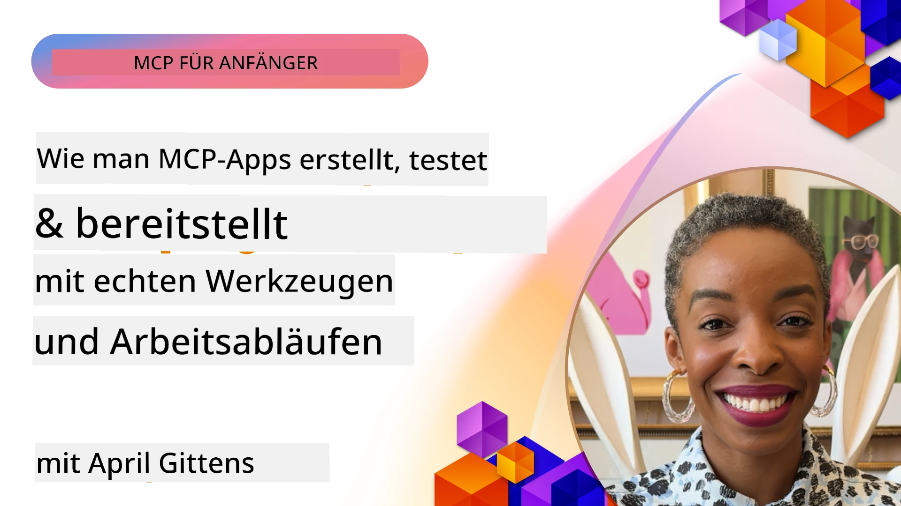
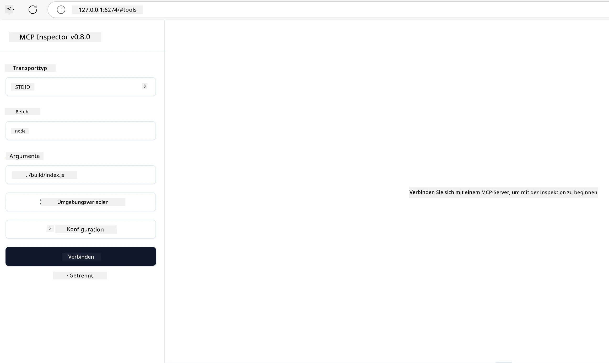

# Praktische Umsetzung

[](https://youtu.be/vCN9-mKBDfQ)

_(Klicken Sie auf das Bild oben, um das Video dieser Lektion anzusehen)_

Die praktische Umsetzung macht die Kraft des Model Context Protocol (MCP) greifbar. Während das Verständnis der Theorie und Architektur hinter MCP wichtig ist, zeigt sich der wahre Wert, wenn Sie diese Konzepte anwenden, um Lösungen zu entwickeln, zu testen und bereitzustellen, die reale Probleme lösen. Dieses Kapitel überbrückt die Lücke zwischen konzeptionellem Wissen und praktischer Entwicklung und führt Sie durch den Prozess, MCP-basierte Anwendungen zum Leben zu erwecken.

Egal, ob Sie intelligente Assistenten entwickeln, KI in Geschäftsabläufe integrieren oder kundenspezifische Werkzeuge für die Datenverarbeitung erstellen – MCP bietet eine flexible Grundlage. Sein sprachunabhängiges Design und offizielle SDKs für beliebte Programmiersprachen machen es einer breiten Entwicklergruppe zugänglich. Durch die Nutzung dieser SDKs können Sie schnell Prototypen erstellen, iterieren und Ihre Lösungen über verschiedene Plattformen und Umgebungen skalieren.

In den folgenden Abschnitten finden Sie praktische Beispiele, Beispielcode und Bereitstellungsstrategien, die zeigen, wie MCP in C#, Java mit Spring, TypeScript, JavaScript und Python implementiert wird. Sie lernen auch, wie Sie Ihre MCP-Server debuggen und testen, APIs verwalten und Lösungen mit Azure in der Cloud bereitstellen. Diese praxisnahen Ressourcen sollen Ihr Lernen beschleunigen und Ihnen helfen, robuste, produktionsreife MCP-Anwendungen selbstbewusst zu erstellen.

## Überblick

Diese Lektion konzentriert sich auf praktische Aspekte der MCP-Implementierung in mehreren Programmiersprachen. Wir werden untersuchen, wie man MCP-SDKs in C#, Java mit Spring, TypeScript, JavaScript und Python verwendet, um robuste Anwendungen zu entwickeln, MCP-Server zu debuggen und zu testen sowie wiederverwendbare Ressourcen, Prompts und Werkzeuge zu erstellen.

## Lernziele

Am Ende dieser Lektion werden Sie in der Lage sein:

- MCP-Lösungen mit offiziellen SDKs in verschiedenen Programmiersprachen umzusetzen
- MCP-Server systematisch zu debuggen und zu testen
- Serverfunktionen (Ressourcen, Prompts und Werkzeuge) zu erstellen und zu nutzen
- Effektive MCP-Workflows für komplexe Aufgaben zu entwerfen
- MCP-Implementierungen hinsichtlich Leistung und Zuverlässigkeit zu optimieren

## Offizielle SDK-Ressourcen

Das Model Context Protocol bietet offizielle SDKs für mehrere Sprachen (entsprechend der [MCP-Spezifikation 2025-11-25](https://spec.modelcontextprotocol.io/specification/2025-11-25/)):

- [C# SDK](https://github.com/modelcontextprotocol/csharp-sdk)
- [Java mit Spring SDK](https://github.com/modelcontextprotocol/java-sdk) **Hinweis:** benötigt Abhängigkeit zu [Project Reactor](https://projectreactor.io). (Siehe [Diskussion Issue 246](https://github.com/orgs/modelcontextprotocol/discussions/246).)
- [TypeScript SDK](https://github.com/modelcontextprotocol/typescript-sdk)
- [Python SDK](https://github.com/modelcontextprotocol/python-sdk)
- [Kotlin SDK](https://github.com/modelcontextprotocol/kotlin-sdk)
- [Go SDK](https://github.com/modelcontextprotocol/go-sdk)

## Arbeit mit MCP SDKs

Dieser Abschnitt liefert praktische Beispiele für die Implementierung von MCP in mehreren Programmiersprachen. Beispielcode finden Sie im Verzeichnis `samples`, das nach Sprache organisiert ist.

### Verfügbare Beispiele

Das Repository enthält [Beispielimplementierungen](../../../04-PracticalImplementation/samples) in den folgenden Sprachen:

- [C#](./samples/csharp/README.md)
- [Java mit Spring](./samples/java/containerapp/README.md)
- [TypeScript](./samples/typescript/README.md)
- [JavaScript](./samples/javascript/README.md)
- [Python](./samples/python/README.md)

Jedes Beispiel demonstriert wichtige MCP-Konzepte und Implementierungsmuster für die jeweilige Sprache und ihr Ökosystem.

### Praktische Leitfäden

Zusätzliche Leitfäden zur praktischen MCP-Implementierung:

- [Paginierung und große Ergebnislisten](./pagination/README.md) – Handhabung von Cursor-basierter Paginierung für Werkzeuge, Ressourcen und große Datensätze

## Kernserverfunktionen

MCP-Server können eine beliebige Kombination dieser Funktionen implementieren:

### Ressourcen

Ressourcen bieten Kontext und Daten zur Nutzung durch den Benutzer oder das KI-Modell:

- Dokumentenarchiven
- Wissensdatenbanken
- Strukturierte Datenquellen
- Dateisysteme

### Prompts

Prompts sind vorgefertigte Nachrichten und Workflows für Benutzer:

- Vorgegebene Gesprächsvorlagen
- Geführte Interaktionsmuster
- Spezialisierte Dialogstrukturen

### Werkzeuge

Werkzeuge sind Funktionen, die das KI-Modell ausführen kann:

- Datenverarbeitungsprogramme
- Integration externer APIs
- Rechenfunktionalitäten
- Suchfunktionen

## Beispielimplementierungen: C# Implementierung

Das offizielle C# SDK-Repository enthält mehrere Beispielimplementierungen, die verschiedene Aspekte von MCP demonstrieren:

- **Basic MCP Client**: Einfaches Beispiel zur Erstellung eines MCP-Clients und zur Nutzung von Werkzeugen
- **Basic MCP Server**: Minimale Serverimplementierung mit einfacher Werkzeugregistrierung
- **Advanced MCP Server**: Voll ausgestatteter Server mit Werkzeugregistrierung, Authentifizierung und Fehlerbehandlung
- **ASP.NET Integration**: Beispiele zur Integration mit ASP.NET Core
- **Werkzeug-Implementierungsmuster**: Verschiedene Muster zur Umsetzung von Werkzeugen mit unterschiedlichen Komplexitätsgraden

Das MCP C# SDK befindet sich im Preview-Stadium und APIs können sich ändern. Dieser Blog wird mit der Weiterentwicklung des SDK kontinuierlich aktualisiert.

### Schlüsselmerkmale

- [C# MCP Nuget ModelContextProtocol](https://www.nuget.org/packages/ModelContextProtocol)
- Erstellung Ihres [ersten MCP-Servers](https://devblogs.microsoft.com/dotnet/build-a-model-context-protocol-mcp-server-in-csharp/).

Für vollständige C# Implementierungsbeispiele besuchen Sie das [offizielle C# SDK Beispiel-Repository](https://github.com/modelcontextprotocol/csharp-sdk).

## Beispielimplementierung: Java mit Spring Implementierung

Das Java mit Spring SDK bietet robuste Optionen für die MCP-Implementierung mit unternehmensgerechten Funktionen.

### Schlüsselmerkmale

- Integration in das Spring Framework
- Starke Typsicherheit
- Unterstützung reaktiver Programmierung
- Umfassende Fehlerbehandlung

Für ein vollständiges Java mit Spring Implementierungsbeispiel siehe [Java mit Spring Beispiel](samples/java/containerapp/README.md) im Beispielverzeichnis.

## Beispielimplementierung: JavaScript Implementierung

Das JavaScript SDK bietet einen leichten und flexiblen Ansatz für die MCP-Implementierung.

### Schlüsselmerkmale

- Unterstützung für Node.js und Browser
- Promise-basierte API
- Einfache Integration mit Express und anderen Frameworks
- WebSocket-Unterstützung für Streaming

Für ein vollständiges JavaScript-Implementierungsbeispiel siehe [JavaScript Beispiel](samples/javascript/README.md) im Beispielverzeichnis.

## Beispielimplementierung: Python Implementierung

Das Python SDK bietet einen „pythonischen“ Ansatz zur MCP-Implementierung mit exzellenter Integration von ML-Frameworks.

### Schlüsselmerkmale

- Async/await Unterstützung mit asyncio
- FastAPI-Integration
- Einfache Werkzeugregistrierung
- Native Integration mit populären ML-Bibliotheken

Für ein vollständiges Python-Implementierungsbeispiel siehe [Python Beispiel](samples/python/README.md) im Beispielverzeichnis.

## API-Verwaltung

Azure API Management ist eine hervorragende Lösung, um MCP-Server abzusichern. Die Idee ist, eine Azure API Management Instanz vor Ihren MCP-Server zu setzen und Funktionen zu überlassen, die Sie wahrscheinlich benötigen, wie zum Beispiel:

- Ratenbegrenzung
- Tokenverwaltung
- Überwachung
- Lastverteilung
- Sicherheit

### Azure-Beispiel

Hier ist ein Azure-Beispiel, das genau das macht, also [einen MCP-Server erstellt und mit Azure API Management absichert](https://github.com/Azure-Samples/remote-mcp-apim-functions-python).

Sehen Sie unten im Bild, wie der Autorisierungsablauf funktioniert:


Im obigen Bild geschieht Folgendes:

- Die Authentifizierung/Autorisierung erfolgt über Microsoft Entra.
- Azure API Management fungiert als Gateway und verwendet Regeln zur Steuerung und Verwaltung des Verkehrs.
- Azure Monitor protokolliert alle Anfragen zur weiteren Analyse.

#### Autorisierungsablauf

Werfen wir einen genaueren Blick auf den Autorisierungsablauf:


#### MCP-Autorisierungsspezifikation

Erfahren Sie mehr über die [MCP-Autorisierungsspezifikation](https://spec.modelcontextprotocol.io/specification/2025-11-25/basic/authorization/)

## Remote MCP Server auf Azure bereitstellen

Sehen wir, ob wir das zuvor erwähnte Beispiel bereitstellen können:

1. Klonen Sie das Repository

    ```bash
    git clone https://github.com/Azure-Samples/remote-mcp-apim-functions-python.git
    cd remote-mcp-apim-functions-python
    ```

1. Registrieren Sie den Ressourcenanbieter `Microsoft.App`.

   - Wenn Sie die Azure CLI verwenden, führen Sie `az provider register --namespace Microsoft.App --wait` aus.
   - Wenn Sie Azure PowerShell verwenden, führen Sie `Register-AzResourceProvider -ProviderNamespace Microsoft.App` aus. Danach führen Sie nach kurzer Zeit `(Get-AzResourceProvider -ProviderNamespace Microsoft.App).RegistrationState` aus, um zu prüfen, ob die Registrierung abgeschlossen ist.

1. Führen Sie diesen [azd](https://aka.ms/azd)-Befehl aus, um den API Management Dienst, Function App (mit Code) und alle anderen erforderlichen Azure-Ressourcen bereitzustellen

    ```shell
    azd up
    ```

    Dieser Befehl sollte alle Cloud-Ressourcen auf Azure bereitstellen

### Testen Ihres Servers mit MCP Inspector

1. Öffnen Sie ein **neues Terminalfenster**, installieren und starten Sie MCP Inspector

    ```shell
    npx @modelcontextprotocol/inspector
    ```

    Sie sollten eine Benutzeroberfläche sehen, die so aussieht:

    

1. CTRL-Klick, um die MCP Inspector Web-App von der von der App angezeigten URL zu laden (z.B. [http://127.0.0.1:6274/#resources](http://127.0.0.1:6274/#resources))
1. Stellen Sie den Transporttyp auf `SSE` ein
1. Geben Sie die URL Ihres laufenden API Management SSE-Endpunkts ein, die nach `azd up` angezeigt wird, und **Verbinden**:

    ```shell
    https://<apim-servicename-from-azd-output>.azure-api.net/mcp/sse
    ```

1. **Werkzeuge auflisten**. Klicken Sie auf ein Werkzeug und **Werkzeug ausführen**.

Wenn alle Schritte funktioniert haben, sind Sie jetzt mit dem MCP-Server verbunden und konnten ein Werkzeug aufrufen.

## MCP-Server für Azure

[Remote-mcp-functions](https://github.com/Azure-Samples/remote-mcp-functions-dotnet): Diese Sammlung von Repositories ist eine Schnellstartvorlage zum Erstellen und Bereitstellen benutzerdefinierter Remote-MCP (Model Context Protocol) Server mit Azure Functions in Python, C# .NET oder Node/TypeScript.

Die Beispiele bieten eine vollständige Lösung, die Entwicklern ermöglicht:

- Lokal entwickeln und ausführen: Entwickeln und debuggen Sie einen MCP-Server auf einem lokalen Rechner
- Bereitstellen in Azure: Einfaches Deployment in die Cloud mit einem einfachen azd up Befehl
- Verbindung von Clients: Verbinden Sie verschiedene Clients mit dem MCP-Server, einschließlich des Copilot-Agent-Modus in VS Code und des MCP Inspector Tools

### Schlüsselmerkmale

- Sicherheit von Grund auf: Der MCP-Server ist mit Schlüsseln und HTTPS abgesichert
- Authentifizierungsoptionen: Unterstützt OAuth über integrierte Authentifizierung und/oder API Management
- Netzwerkisolierung: Erlaubt Netzwerkisolierung über Azure Virtual Networks (VNET)
- Serverlose Architektur: Nutzt Azure Functions für skalierbare, ereignisgesteuerte Ausführung
- Lokale Entwicklung: Umfassende Unterstützung für lokale Entwicklung und Debugging
- Einfaches Deployment: Optimierter Bereitstellungsprozess für Azure

Das Repository enthält alle notwendigen Konfigurationsdateien, Quellcode und Infrastrukturdefinitionen, um schnell mit einer produktionsreifen MCP-Server-Implementierung zu starten.

- [Azure Remote MCP Functions Python](https://github.com/Azure-Samples/remote-mcp-functions-python) – Beispielimplementierung von MCP mit Azure Functions in Python

- [Azure Remote MCP Functions .NET](https://github.com/Azure-Samples/remote-mcp-functions-dotnet) – Beispielimplementierung von MCP mit Azure Functions in C# .NET

- [Azure Remote MCP Functions Node/Typescript](https://github.com/Azure-Samples/remote-mcp-functions-typescript) – Beispielimplementierung von MCP mit Azure Functions in Node/TypeScript

## Wichtige Erkenntnisse

- MCP SDKs bieten sprachspezifische Werkzeuge zur Implementierung robuster MCP-Lösungen
- Debugging- und Testprozesse sind entscheidend für zuverlässige MCP-Anwendungen
- Wiederverwendbare Prompt-Vorlagen ermöglichen konsistente KI-Interaktionen
- Gut gestaltete Workflows können komplexe Aufgaben mit mehreren Werkzeugen orchestrieren
- Bei der Implementierung von MCP-Lösungen müssen Sicherheit, Leistung und Fehlerbehandlung berücksichtigt werden

## Übung

Entwerfen Sie einen praktischen MCP-Workflow, der ein reales Problem in Ihrem Fachgebiet adressiert:

1. Identifizieren Sie 3–4 Werkzeuge, die für die Lösung dieses Problems nützlich wären
2. Erstellen Sie ein Workflow-Diagramm, das zeigt, wie diese Werkzeuge zusammenarbeiten
3. Implementieren Sie eine Basisversion eines der Werkzeuge in Ihrer bevorzugten Sprache
4. Erstellen Sie eine Prompt-Vorlage, die dem Modell hilft, Ihr Werkzeug effektiv zu nutzen

## Weitere Ressourcen

---

## Was kommt als Nächstes

Weiter: [Fortgeschrittene Themen](../05-AdvancedTopics/README.md)

---

<!-- CO-OP TRANSLATOR DISCLAIMER START -->
**Haftungsausschluss**:  
Dieses Dokument wurde mit dem KI-Übersetzungsdienst [Co-op Translator](https://github.com/Azure/co-op-translator) übersetzt. Obwohl wir uns um Genauigkeit bemühen, können automatisierte Übersetzungen Fehler oder Ungenauigkeiten enthalten. Das Originaldokument in seiner Ursprungssprache ist als maßgebliche Quelle zu betrachten. Für wichtige Informationen wird eine professionelle menschliche Übersetzung empfohlen. Wir übernehmen keine Haftung für Missverständnisse oder Fehlinterpretationen, die durch die Nutzung dieser Übersetzung entstehen.
<!-- CO-OP TRANSLATOR DISCLAIMER END -->