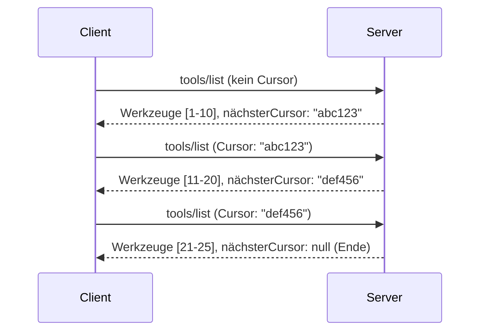

# Paginierung und große Ergebnislisten in MCP

Wenn Ihr MCP-Server große Datensätze verarbeitet - sei es beim Auflisten von Tausenden von Dateien, Datenbankeinträgen oder Suchergebnissen - benötigen Sie Paginierung, um den Speicher effizient zu verwalten und ein reaktionsschnelles Nutzererlebnis zu bieten. Dieser Leitfaden erklärt, wie man Paginierung in MCP implementiert und nutzt.

## Warum Paginierung wichtig ist

Ohne Paginierung können große Antworten Folgendes verursachen:

- **Speichererschöpfung** – Millionen von Einträgen auf einmal laden
- **Langsame Antwortzeiten** – Nutzer warten, während alle Daten geladen werden
- **Timeout-Fehler** – Anfragen überschreiten Zeitlimits
- **Schlechte KI-Leistung** – LLMs haben Schwierigkeiten mit massivem Kontext

MCP verwendet **Cursor-basierte Paginierung** für zuverlässiges und konsistentes Durchblättern von Ergebnismengen.

---

## Wie MCP-Paginierung funktioniert

### Das Cursor-Konzept

Ein **Cursor** ist eine undurchsichtige Zeichenkette, die Ihre Position in einer Ergebnismenge markiert. Man kann ihn sich wie ein Lesezeichen in einem langen Buch vorstellen.


### Paginierung in MCP-Methoden

Diese MCP-Methoden unterstützen Paginierung:

| Methode | Gibt zurück | Cursor-Unterstützung |
|---------|-------------|----------------------|
| `tools/list` | Tool-Definitionen | ✅ |
| `resources/list` | Ressourcen-Definitionen | ✅ |
| `prompts/list` | Prompt-Definitionen | ✅ |
| `resources/templates/list` | Ressourcenvorlagen | ✅ |

---

## Server-Implementierung

### Python (FastMCP)

```python
from mcp.server import Server
from mcp.types import Tool, ListToolsResult
import math

app = Server("paginated-server")

# Simulierter großer Datensatz
ALL_TOOLS = [
    Tool(name=f"tool_{i}", description=f"Tool number {i}", inputSchema={})
    for i in range(100)
]

PAGE_SIZE = 10

@app.list_tools()
async def list_tools(cursor: str | None = None) -> ListToolsResult:
    """List tools with pagination support."""
    
    # Cursor dekodieren, um Startindex zu erhalten
    start_index = 0
    if cursor:
        try:
            start_index = int(cursor)
        except ValueError:
            start_index = 0
    
    # Ergebnisseite abrufen
    end_index = min(start_index + PAGE_SIZE, len(ALL_TOOLS))
    page_tools = ALL_TOOLS[start_index:end_index]
    
    # Nächsten Cursor berechnen
    next_cursor = None
    if end_index < len(ALL_TOOLS):
        next_cursor = str(end_index)
    
    return ListToolsResult(
        tools=page_tools,
        nextCursor=next_cursor
    )
```

### TypeScript

```typescript
import { Server } from "@modelcontextprotocol/sdk/server/index.js";
import { ListToolsResultSchema } from "@modelcontextprotocol/sdk/types.js";

const server = new Server({
  name: "paginated-server",
  version: "1.0.0"
});

// Simuliertes großes Datenset
const ALL_TOOLS = Array.from({ length: 100 }, (_, i) => ({
  name: `tool_${i}`,
  description: `Tool number ${i}`,
  inputSchema: { type: "object", properties: {} }
}));

const PAGE_SIZE = 10;

server.setRequestHandler(ListToolsResultSchema, async (request) => {
  // Cursor dekodieren
  let startIndex = 0;
  if (request.params?.cursor) {
    startIndex = parseInt(request.params.cursor, 10) || 0;
  }
  
  // Ergebnisseite abrufen
  const endIndex = Math.min(startIndex + PAGE_SIZE, ALL_TOOLS.length);
  const pageTools = ALL_TOOLS.slice(startIndex, endIndex);
  
  // Nächsten Cursor berechnen
  const nextCursor = endIndex < ALL_TOOLS.length ? String(endIndex) : undefined;
  
  return {
    tools: pageTools,
    nextCursor
  };
});
```

### Java (Spring MCP)

```java
@Service
public class PaginatedToolService {
    
    private static final int PAGE_SIZE = 10;
    private final List<Tool> allTools;
    
    public PaginatedToolService() {
        // Großen Datensatz initialisieren
        this.allTools = IntStream.range(0, 100)
            .mapToObj(i -> new Tool("tool_" + i, "Tool number " + i, Map.of()))
            .collect(Collectors.toList());
    }
    
    @McpMethod("tools/list")
    public ListToolsResult listTools(@Param("cursor") String cursor) {
        // Cursor decodieren
        int startIndex = 0;
        if (cursor != null && !cursor.isEmpty()) {
            try {
                startIndex = Integer.parseInt(cursor);
            } catch (NumberFormatException e) {
                startIndex = 0;
            }
        }
        
        // Ergebnisseite abrufen
        int endIndex = Math.min(startIndex + PAGE_SIZE, allTools.size());
        List<Tool> pageTools = allTools.subList(startIndex, endIndex);
        
        // Nächsten Cursor berechnen
        String nextCursor = endIndex < allTools.size() ? String.valueOf(endIndex) : null;
        
        return new ListToolsResult(pageTools, nextCursor);
    }
}
```

---

## Client-Implementierung

### Python-Client

```python
from mcp import ClientSession

async def get_all_tools(session: ClientSession) -> list:
    """Fetch all tools using pagination."""
    all_tools = []
    cursor = None
    
    while True:
        result = await session.list_tools(cursor=cursor)
        all_tools.extend(result.tools)
        
        if result.nextCursor is None:
            break
        cursor = result.nextCursor
    
    return all_tools

# Verwendung
async with client_session as session:
    tools = await get_all_tools(session)
    print(f"Found {len(tools)} tools")
```

### TypeScript-Client

```typescript
import { Client } from "@modelcontextprotocol/sdk/client/index.js";

async function getAllTools(client: Client): Promise<Tool[]> {
  const allTools: Tool[] = [];
  let cursor: string | undefined = undefined;
  
  do {
    const result = await client.listTools({ cursor });
    allTools.push(...result.tools);
    cursor = result.nextCursor;
  } while (cursor);
  
  return allTools;
}

// Verwendung
const tools = await getAllTools(client);
console.log(`Found ${tools.length} tools`);
```

### Lazy Loading Muster

Für sehr große Datensätze laden Sie Seiten bei Bedarf:

```python
class PaginatedToolIterator:
    """Lazily iterate through paginated tools."""
    
    def __init__(self, session: ClientSession):
        self.session = session
        self.cursor = None
        self.buffer = []
        self.exhausted = False
    
    async def __anext__(self):
        # Rückgabe aus dem Puffer, falls verfügbar
        if self.buffer:
            return self.buffer.pop(0)
        
        # Überprüfen, ob alle Seiten erschöpft sind
        if self.exhausted:
            raise StopAsyncIteration
        
        # Nächste Seite abrufen
        result = await self.session.list_tools(cursor=self.cursor)
        self.buffer = list(result.tools)
        self.cursor = result.nextCursor
        
        if self.cursor is None:
            self.exhausted = True
        
        if not self.buffer:
            raise StopAsyncIteration
        
        return self.buffer.pop(0)
    
    def __aiter__(self):
        return self

# Verwendung - speichereffizient für große Datensätze
async for tool in PaginatedToolIterator(session):
    process_tool(tool)
```

---

## Paginierung für Ressourcen

Ressourcen benötigen oft Paginierung für Verzeichnisse oder große Datensätze:

```python
from mcp.server import Server
from mcp.types import Resource, ListResourcesResult
import os

app = Server("file-server")

@app.list_resources()
async def list_resources(cursor: str | None = None) -> ListResourcesResult:
    """List files in directory with pagination."""
    
    directory = "/data/files"
    all_files = sorted(os.listdir(directory))
    
    # Dekodiere Cursor (Dateiindex)
    start_index = int(cursor) if cursor else 0
    page_size = 20
    end_index = min(start_index + page_size, len(all_files))
    
    # Erstelle Ressourcenliste für diese Seite
    resources = []
    for filename in all_files[start_index:end_index]:
        filepath = os.path.join(directory, filename)
        resources.append(Resource(
            uri=f"file://{filepath}",
            name=filename,
            mimeType="application/octet-stream"
        ))
    
    # Berechne nächsten Cursor
    next_cursor = str(end_index) if end_index < len(all_files) else None
    
    return ListResourcesResult(
        resources=resources,
        nextCursor=next_cursor
    )
```

---

## Cursor-Design-Strategien

### Strategie 1: Index-basiert (Einfach)

```python
# Cursor ist nur der Index
cursor = "50"  # Beginne bei Element 50
```

**Vorteile:** Einfach, zustandslos  
**Nachteile:** Ergebnisse können sich verschieben, wenn Elemente hinzugefügt/entfernt werden

### Strategie 2: ID-basiert (Stabil)

```python
# Cursor ist die zuletzt gesehene ID
cursor = "item_abc123"  # Beginne nach diesem Element
```

**Vorteile:** Stabil, auch wenn sich Elemente ändern  
**Nachteile:** Erfordert sortierte IDs

### Strategie 3: Codierter Zustand (Komplex)

```python
import base64
import json

def encode_cursor(state: dict) -> str:
    return base64.b64encode(json.dumps(state).encode()).decode()

def decode_cursor(cursor: str) -> dict:
    return json.loads(base64.b64decode(cursor).decode())

# Cursor enthält mehrere Statusfelder
cursor = encode_cursor({
    "offset": 50,
    "filter": "active",
    "sort": "name"
})
```

**Vorteile:** Kann komplexen Zustand codieren  
**Nachteile:** Komplexer, längere Cursor-Zeichenketten

---

## Best Practices

### 1. Geeignete Seitengrößen wählen

```python
# Berücksichtigen Sie die Datenmenge
PAGE_SIZE_SMALL_ITEMS = 100   # Einfache Metadaten
PAGE_SIZE_MEDIUM_ITEMS = 20   # Umfangreichere Objekte
PAGE_SIZE_LARGE_ITEMS = 5     # Komplexer Inhalt
```

### 2. Ungültige Cursor elegant behandeln

```python
@app.list_tools()
async def list_tools(cursor: str | None = None) -> ListToolsResult:
    try:
        start_index = int(cursor) if cursor else 0
        if start_index < 0 or start_index >= len(ALL_TOOLS):
            start_index = 0  # Zurück zum Anfang
    except (ValueError, TypeError):
        start_index = 0  # Ungültiger Cursor, neu starten
    # ...
```

### 3. Gesamte Anzahl einbeziehen (Optional)

```python
return ListToolsResult(
    tools=page_tools,
    nextCursor=next_cursor,
    # Einige Implementierungen enthalten eine Gesamtzahl für den UI-Fortschritt
    _meta={"total": len(ALL_TOOLS)}
)
```

### 4. Randfälle testen

```python
async def test_pagination():
    # Leere Ergebnismenge
    result = await session.list_tools()
    assert result.tools == []
    assert result.nextCursor is None
    
    # Einzelne Seite
    result = await session.list_tools()
    assert len(result.tools) <= PAGE_SIZE
    
    # Ungültiger Cursor
    result = await session.list_tools(cursor="invalid")
    assert result.tools  # Sollte die erste Seite zurückgeben
```

---

## Häufige Stolperfallen

### ❌ Alle Ergebnisse zurückgeben und dann clientseitig paginieren

```python
# SCHLECHT: Lädt alles in den Speicher
@app.list_tools()
async def list_tools() -> ListToolsResult:
    all_tools = load_all_tools()  # 1 Million Werkzeuge!
    return ListToolsResult(tools=all_tools)
```

### ✅ Paginierung an der Datenquelle durchführen

```python
# GUT: Lädt nur das, was benötigt wird
@app.list_tools()
async def list_tools(cursor: str | None = None) -> ListToolsResult:
    offset = int(cursor) if cursor else 0
    tools = await db.query_tools(offset=offset, limit=PAGE_SIZE)
    return ListToolsResult(tools=tools, nextCursor=...)
```

---

## Was kommt als Nächstes

- [Modul 5.14 - Kontext-Engineering](../../05-AdvancedTopics/mcp-contextengineering/README.md)
- [Modul 8 - Best Practices](../../08-BestPractices/README.md)
- [3.8 - Testen Ihres MCP-Servers](../../03-GettingStarted/08-testing/README.md)

---

## Zusätzliche Ressourcen

- [MCP-Spezifikation - Paginierung](https://spec.modelcontextprotocol.io/specification/2025-11-25/)
- [Cursor-basierte Paginierung erklärt](https://slack.engineering/evolving-api-pagination-at-slack/)
- [Python SDK Paginierungstests](https://github.com/modelcontextprotocol/python-sdk/blob/main/tests/client/test_list_methods_cursor.py)

---

<!-- CO-OP TRANSLATOR DISCLAIMER START -->
**Haftungsausschluss**:  
Dieses Dokument wurde mit dem KI-Übersetzungsdienst [Co-op Translator](https://github.com/Azure/co-op-translator) übersetzt. Obwohl wir uns um Genauigkeit bemühen, sollten Sie beachten, dass automatisierte Übersetzungen Fehler oder Ungenauigkeiten enthalten können. Das Originaldokument in seiner Ursprungssprache gilt als maßgebliche Quelle. Für wichtige Informationen wird eine professionelle menschliche Übersetzung empfohlen. Wir übernehmen keine Haftung für Missverständnisse oder Fehlinterpretationen, die durch die Nutzung dieser Übersetzung entstehen.
<!-- CO-OP TRANSLATOR DISCLAIMER END -->