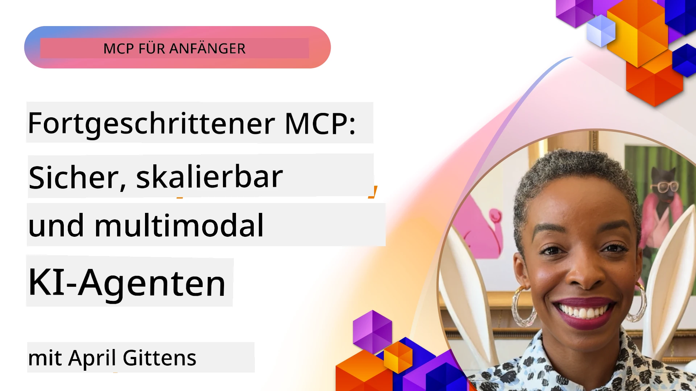

# Erweiterte Themen in MCP

_(Klicken Sie auf das obige Bild, um das Video zu dieser Lektion anzusehen)_

Dieses Kapitel behandelt eine Reihe fortgeschrittener Themen zur Implementierung des Model Context Protocol (MCP), darunter multimodale Integration, Skalierbarkeit, bewährte Sicherheitspraktiken und Unternehmensintegration. Diese Themen sind entscheidend für den Aufbau robuster und produktionsreifer MCP-Anwendungen, die den Anforderungen moderner KI-Systeme gerecht werden können.

## Überblick

Diese Lektion untersucht fortgeschrittene Konzepte in der Implementierung des Model Context Protocol mit dem Schwerpunkt auf multimodaler Integration, Skalierbarkeit, bewährten Sicherheitspraktiken und Unternehmensintegration. Diese Themen sind unerlässlich für den Aufbau von MCP-Anwendungen in Produktionsqualität, die komplexe Anforderungen in Unternehmensumgebungen bewältigen können.

## Lernziele

Am Ende dieser Lektion werden Sie in der Lage sein:

- Multimodale Fähigkeiten innerhalb von MCP-Frameworks zu implementieren
- Skalierbare MCP-Architekturen für anspruchsvolle Szenarien zu entwerfen
- Bewährte Sicherheitspraktiken anzuwenden, die mit den Sicherheitsprinzipien von MCP übereinstimmen
- MCP in unternehmerische KI-Systeme und Frameworks zu integrieren
- Leistung und Zuverlässigkeit in Produktionsumgebungen zu optimieren

## Lektionen und Beispielprojekte

| Link | Titel | Beschreibung |
|------|-------|-------------|
| [5.1 Integration with Azure](./mcp-integration/README.md) | Integration mit Azure | Lernen Sie, wie Sie Ihren MCP-Server auf Azure integrieren |
| [5.2 Multi modal sample](./mcp-multi-modality/README.md) | MCP Multimodale Beispiele | Beispiele für Audio-, Bild- und multimodale Antworten |
| [5.3 MCP OAuth2 sample](../../../05-AdvancedTopics/mcp-oauth2-demo) | MCP OAuth2 Demo | Minimalistische Spring Boot-Anwendung, die OAuth2 mit MCP sowohl als Autorisierungs- als auch Ressourcenserver zeigt. Demonstriert sichere Token-Ausgabe, geschützte Endpunkte, Bereitstellung mit Azure Container Apps und API-Management-Integration. |
| [5.4 Root Contexts](./mcp-root-contexts/README.md) | Root-Kontexte | Erfahren Sie mehr über Root-Kontexte und deren Implementierung |
| [5.5 Routing](./mcp-routing/README.md) | Routing | Lernen Sie verschiedene Arten des Routings kennen |
| [5.6 Sampling](./mcp-sampling/README.md) | Sampling | Lernen Sie, wie Sie mit Sampling arbeiten |
| [5.7 Scaling](./mcp-scaling/README.md) | Skalierung | Lernen Sie alles über Skalierung |
| [5.8 Security](./mcp-security/README.md) | Sicherheit | Sichern Sie Ihren MCP-Server |
| [5.9 Web Search sample](./web-search-mcp/README.md) | Web Search MCP | Python MCP-Server und Client, der SerpAPI für Echtzeit-Web-, Nachrichten-, Produkt-Suche und Q&A integriert. Demonstriert Multi-Tool-Orchestrierung, Integration externer APIs und robuste Fehlerbehandlung. |
| [5.10 Realtime Streaming](./mcp-realtimestreaming/README.md) | Streaming | Echtzeit-Datenstreaming ist in der heutigen datengetriebenen Welt essentiell, in der Unternehmen und Anwendungen sofortigen Zugriff auf Informationen benötigen, um zeitnahe Entscheidungen zu treffen. |
| [5.11 Realtime Web Search](./mcp-realtimesearch/README.md) | Web-Suche | Echtzeit-Websuche – wie MCP die Echtzeit-Websuche durch einen standardisierten Ansatz für Kontextmanagement über KI-Modelle, Suchmaschinen und Anwendungen hinweg transformiert. |
| [5.12 Entra ID Authentication for Model Context Protocol Servers](./mcp-security-entra/README.md) | Entra ID-Authentifizierung | Microsoft Entra ID bietet eine robuste cloudbasierte Lösung für Identitäts- und Zugriffsmanagement und stellt sicher, dass nur autorisierte Benutzer und Anwendungen mit Ihrem MCP-Server interagieren können. |
| [5.13 Azure AI Foundry Agent Integration](./mcp-foundry-agent-integration/README.md) | Azure AI Foundry Integration | Lernen Sie, wie Sie Model Context Protocol-Server mit Azure AI Foundry-Agenten integrieren, um leistungsstarke Tool-Orchestrierung und Unternehmens-KI-Fähigkeiten mit standardisierten Verbindungen zu externen Datenquellen zu ermöglichen. |
| [5.14 Context Engineering](./mcp-contextengineering/README.md) | Kontext-Engineering | Die zukünftigen Möglichkeiten der Kontext-Engineering-Techniken für MCP-Server, einschließlich Kontextoptimierung, dynamischem Kontextmanagement und Strategien für effektives Prompt-Engineering innerhalb von MCP-Frameworks. |
| [5.15 MCP Custom Transport](./mcp-transport/README.md) | Benutzerdefinierter Transport | Lernen Sie, wie Sie benutzerdefinierte Transportmechanismen für spezialisierte MCP-Kommunikationsszenarien implementieren. |
| [5.16 Protocol Features Deep Dive](./mcp-protocol-features/README.md) | Protokollfunktionen | Beherrschen Sie fortgeschrittene Protokollfunktionen einschließlich Fortschrittsbenachrichtigungen, Anfragestorno, Ressourcenvorlagen und Fehlermusterbehandlung. |

> **Neu in der MCP-Spezifikation 2025-11-25**: Die Spezifikation enthält nun experimentelle Unterstützung für **Tasks** (lang laufende Operationen mit Fortschrittsverfolgung), **Tool-Anmerkungen** (Metadaten über das Verhalten von Tools für Sicherheit), **URL-Mode Elicitation** (Anforderung bestimmter URL-Inhalte von Clients) und erweiterte **Roots** (zur Verwaltung des Arbeitsbereichskontexts). Siehe die [MCP-Spezifikations-Änderungshistorie](https://spec.modelcontextprotocol.io/) für vollständige Details.

## Zusätzliche Verweise

Für die aktuellsten Informationen zu erweiterten MCP-Themen siehe:
- [MCP-Dokumentation](https://modelcontextprotocol.io/)
- [MCP-Spezifikation (2025-11-25)](https://spec.modelcontextprotocol.io/specification/2025-11-25/)
- [GitHub-Repository](https://github.com/modelcontextprotocol)
- [OWASP MCP Top 10](https://microsoft.github.io/mcp-azure-security-guide/mcp/) – Sicherheitsrisiken und Gegenmaßnahmen
- [MCP Security Summit Workshop (Sherpa)](https://azure-samples.github.io/sherpa/) – Praktische Sicherheitsschulung

## Wichtige Erkenntnisse

- Multimodale MCP-Implementierungen erweitern die KI-Fähigkeiten über die Textverarbeitung hinaus
- Skalierbarkeit ist entscheidend für den Unternehmenseinsatz und kann durch horizontale und vertikale Skalierung erreicht werden
- Umfassende Sicherheitsmaßnahmen schützen Daten und gewährleisten korrekten Zugriffsschutz
- Unternehmensintegration mit Plattformen wie Azure OpenAI und Microsoft AI Foundry verbessert die MCP-Fähigkeiten
- Fortgeschrittene MCP-Implementierungen profitieren von optimierten Architekturen und sorgfältigem Ressourcenmanagement

## Übung

Entwerfen Sie eine MCP-Implementierung in Unternehmensqualität für einen spezifischen Anwendungsfall:

1. Identifizieren Sie die multimodalen Anforderungen für Ihren Anwendungsfall
2. Skizzieren Sie die erforderlichen Sicherheitskontrollen zum Schutz sensibler Daten
3. Entwerfen Sie eine skalierbare Architektur, die unterschiedlichen Lasten standhalten kann
4. Planen Sie Integrationspunkte mit unternehmerischen KI-Systemen
5. Dokumentieren Sie potenzielle Leistungsengpässe und Strategien zur Behebung

## Zusätzliche Ressourcen

- [Azure OpenAI Dokumentation](https://learn.microsoft.com/en-us/azure/ai-services/openai/)
- [Microsoft AI Foundry Dokumentation](https://learn.microsoft.com/en-us/ai-services/)

---

## Was kommt als Nächstes

Erkunden Sie die Lektionen in diesem Modul beginnend mit: [5.1 MCP Integration](./mcp-integration/README.md)

Nachdem Sie dieses Modul abgeschlossen haben, fahren Sie fort zu: [Modul 6: Community-Beiträge](../06-CommunityContributions/README.md)

---

<!-- CO-OP TRANSLATOR DISCLAIMER START -->
**Haftungsausschluss**:  
Dieses Dokument wurde mithilfe des KI-Übersetzungsdienstes [Co-op Translator](https://github.com/Azure/co-op-translator) übersetzt. Obwohl wir auf Genauigkeit achten, seien Sie bitte darauf aufmerksam, dass automatisierte Übersetzungen Fehler oder Ungenauigkeiten enthalten können. Das Originaldokument in seiner Ursprungssprache gilt als maßgebliche Quelle. Für wichtige Informationen wird eine professionelle Übersetzung durch einen menschlichen Fachübersetzer empfohlen. Wir übernehmen keine Haftung für Missverständnisse oder Fehlinterpretationen, die durch die Verwendung dieser Übersetzung entstehen.
<!-- CO-OP TRANSLATOR DISCLAIMER END -->