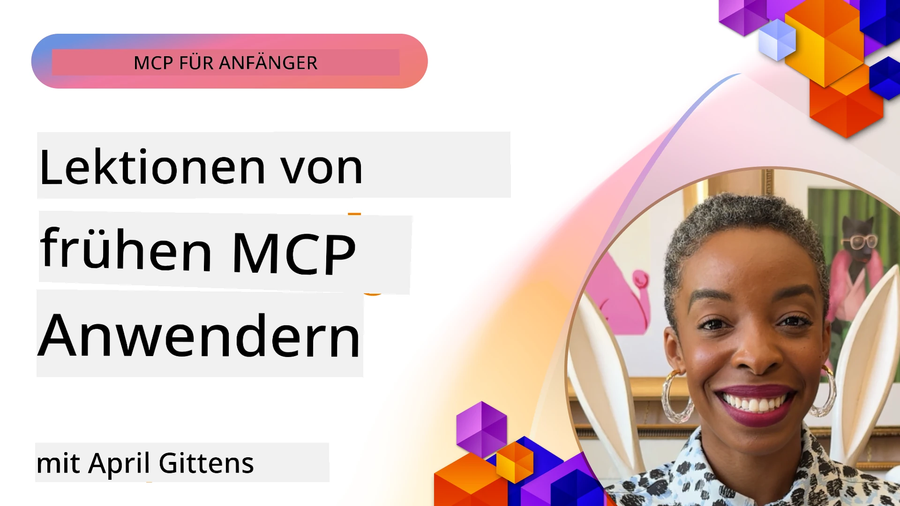

# 🌟 Lektionen von Early Adopters

[](https://youtu.be/jds7dSmNptE)

_(Klicken Sie auf das obige Bild, um das Video zu dieser Lektion anzusehen)_

## 🎯 Was dieses Modul abdeckt

Dieses Modul untersucht, wie reale Organisationen und Entwickler das Model Context Protocol (MCP) nutzen, um tatsächliche Herausforderungen zu bewältigen und Innovationen voranzutreiben. Durch detaillierte Fallstudien, praktische Projekte und anschauliche Beispiele entdecken Sie, wie MCP eine sichere, skalierbare KI-Integration ermöglicht, die Sprachmodelle, Tools und Unternehmensdaten verbindet.

### 📚 Sehen Sie MCP in Aktion

Möchten Sie diese Prinzipien in einsatzbereiten Tools sehen? Schauen Sie sich unsere [**10 Microsoft MCP-Server an, die die Produktivität von Entwicklern verändern**](microsoft-mcp-servers.md) an, die reale Microsoft MCP-Server vorstellen, die Sie heute verwenden können.

## Übersicht

Diese Lektion zeigt, wie Early Adopters das Model Context Protocol (MCP) genutzt haben, um reale Herausforderungen zu meistern und branchenübergreifend Innovationen zu fördern. Durch detaillierte Fallstudien und praktische Projekte sehen Sie, wie MCP standardisierte, sichere und skalierbare KI-Integration ermöglicht – indem große Sprachmodelle, Tools und Unternehmensdaten in einem einheitlichen Rahmen verbunden werden. Sie erhalten praktische Erfahrungen beim Entwerfen und Erstellen von MCP-basierten Lösungen, lernen bewährte Implementierungsmuster kennen und entdecken Best Practices für den Einsatz von MCP in Produktionsumgebungen. Die Lektion hebt außerdem aufkommende Trends, zukünftige Entwicklungen und Open-Source-Ressourcen hervor, die Ihnen helfen, an der Spitze der MCP-Technologie und ihres sich entwickelnden Ökosystems zu bleiben.

## Lernziele

- Analyse realer MCP-Implementierungen in verschiedenen Branchen
- Entwerfen und Erstellen kompletter MCP-basierter Anwendungen
- Erkundung aufkommender Trends und zukünftiger Richtungen in der MCP-Technologie
- Anwendung bewährter Praktiken in tatsächlichen Entwicklungsszenarien

## Reale MCP-Implementierungen

### Fallstudie 1: Automatisierung des Kundensupports in Unternehmen

Ein multinationales Unternehmen implementierte eine MCP-basierte Lösung, um KI-Interaktionen über ihre Kundensupport-Systeme hinweg zu standardisieren. Dadurch konnten sie:

- Eine einheitliche Schnittstelle für mehrere LLM-Anbieter schaffen
- Konsistentes Prompt-Management über Abteilungen hinweg gewährleisten
- Robuste Sicherheits- und Compliance-Kontrollen implementieren
- Einfach zwischen verschiedenen KI-Modellen je nach Bedürfnis wechseln

**Technische Umsetzung:**

```python
# Python MCP Server-Implementierung für Kundensupport
import logging
import asyncio
from modelcontextprotocol import create_server, ServerConfig
from modelcontextprotocol.server import MCPServer
from modelcontextprotocol.transports import create_http_transport
from modelcontextprotocol.resources import ResourceDefinition
from modelcontextprotocol.prompts import PromptDefinition
from modelcontextprotocol.tool import ToolDefinition

# Logging konfigurieren
logging.basicConfig(level=logging.INFO)

async def main():
    # Serverkonfiguration erstellen
    config = ServerConfig(
        name="Enterprise Customer Support Server",
        version="1.0.0",
        description="MCP server for handling customer support inquiries"
    )
    
    # MCP-Server initialisieren
    server = create_server(config)
    
    # Wissensdatenbankressourcen registrieren
    server.resources.register(
        ResourceDefinition(
            name="customer_kb",
            description="Customer knowledge base documentation"
        ),
        lambda params: get_customer_documentation(params)
    )
    
    # Prompt-Vorlagen registrieren
    server.prompts.register(
        PromptDefinition(
            name="support_template",
            description="Templates for customer support responses"
        ),
        lambda params: get_support_templates(params)
    )
    
    # Support-Tools registrieren
    server.tools.register(
        ToolDefinition(
            name="ticketing",
            description="Create and update support tickets"
        ),
        handle_ticketing_operations
    )
    
    # Server mit HTTP-Transport starten
    transport = create_http_transport(port=8080)
    await server.run(transport)

if __name__ == "__main__":
    asyncio.run(main())
```
  
**Ergebnisse:** 30 % Reduzierung der Modellkosten, 45 % Verbesserung der Antwortkonsistenz und verstärkte Compliance in den globalen Geschäftsbereichen.

### Fallstudie 2: Diagnostischer Assistent im Gesundheitswesen

Ein Gesundheitsanbieter entwickelte eine MCP-Infrastruktur zur Integration mehrerer spezialisierter medizinischer KI-Modelle bei gleichzeitiger Sicherstellung des Schutzes sensibler Patientendaten:

- Nahtloser Wechsel zwischen allgemeinen und spezialisierten medizinischen Modellen  
- Strenge Datenschutzkontrollen und Prüfpfade  
- Integration mit bestehenden elektronischen Patientenakten-Systemen (EHR)  
- Konsistentes Prompt-Engineering für medizinische Terminologie  

**Technische Umsetzung:**

```csharp
// C# MCP host application implementation in healthcare application
using Microsoft.Extensions.DependencyInjection;
using ModelContextProtocol.SDK.Client;
using ModelContextProtocol.SDK.Security;
using ModelContextProtocol.SDK.Resources;

public class DiagnosticAssistant
{
    private readonly MCPHostClient _mcpClient;
    private readonly PatientContext _patientContext;
    
    public DiagnosticAssistant(PatientContext patientContext)
    {
        _patientContext = patientContext;
        
        // Configure MCP client with healthcare-specific settings
        var clientOptions = new ClientOptions
        {
            Name = "Healthcare Diagnostic Assistant",
            Version = "1.0.0",
            Security = new SecurityOptions
            {
                Encryption = EncryptionLevel.Medical,
                AuditEnabled = true
            }
        };
        
        _mcpClient = new MCPHostClientBuilder()
            .WithOptions(clientOptions)
            .WithTransport(new HttpTransport("https://healthcare-mcp.example.org"))
            .WithAuthentication(new HIPAACompliantAuthProvider())
            .Build();
    }
    
    public async Task<DiagnosticSuggestion> GetDiagnosticAssistance(
        string symptoms, string patientHistory)
    {
        // Create request with appropriate resources and tool access
        var resourceRequest = new ResourceRequest
        {
            Name = "patient_records",
            Parameters = new Dictionary<string, object>
            {
                ["patientId"] = _patientContext.PatientId,
                ["requestingProvider"] = _patientContext.ProviderId
            }
        };
        
        // Request diagnostic assistance using appropriate prompt
        var response = await _mcpClient.SendPromptRequestAsync(
            promptName: "diagnostic_assistance",
            parameters: new Dictionary<string, object>
            {
                ["symptoms"] = symptoms,
                patientHistory = patientHistory,
                relevantGuidelines = _patientContext.GetRelevantGuidelines()
            });
            
        return DiagnosticSuggestion.FromMCPResponse(response);
    }
}
```
  
**Ergebnisse:** Verbesserte diagnostische Vorschläge für Ärzte bei voller Einhaltung der HIPAA-Vorschriften und erhebliche Verringerung des Kontextwechsels zwischen Systemen.

### Fallstudie 3: Risikoanalyse im Finanzdienstleistungssektor

Eine Finanzinstitution implementierte MCP, um ihre Risikoanalyseprozesse über verschiedene Abteilungen zu standardisieren:

- Einheitliche Schnittstelle für Kreditrisiko-, Betrugserkennungs- und Investitionsrisikomodelle geschaffen  
- Strenge Zugriffskontrollen und Modellversionierung implementiert  
- Nachvollziehbarkeit aller KI-Empfehlungen sichergestellt  
- Einheitliche Datenformatierung über diverse Systeme aufrechterhalten  

**Technische Umsetzung:**

```java
// Java MCP-Server für finanzielle Risikobewertung
import org.mcp.server.*;
import org.mcp.security.*;

public class FinancialRiskMCPServer {
    public static void main(String[] args) {
        // Erstelle MCP-Server mit Funktionen zur finanziellen Compliance
        MCPServer server = new MCPServerBuilder()
            .withModelProviders(
                new ModelProvider("risk-assessment-primary", new AzureOpenAIProvider()),
                new ModelProvider("risk-assessment-audit", new LocalLlamaProvider())
            )
            .withPromptTemplateDirectory("./compliance/templates")
            .withAccessControls(new SOCCompliantAccessControl())
            .withDataEncryption(EncryptionStandard.FINANCIAL_GRADE)
            .withVersionControl(true)
            .withAuditLogging(new DatabaseAuditLogger())
            .build();
            
        server.addRequestValidator(new FinancialDataValidator());
        server.addResponseFilter(new PII_RedactionFilter());
        
        server.start(9000);
        
        System.out.println("Financial Risk MCP Server running on port 9000");
    }
}
```
  
**Ergebnisse:** Verbesserte regulatorische Compliance, 40 % schnellere Modellbereitstellungszyklen und erhöhte Konsistenz der Risikobewertung in den Abteilungen.

### Fallstudie 4: Microsoft Playwright MCP-Server für Browserautomatisierung

Microsoft entwickelte den [Playwright MCP Server](https://github.com/microsoft/playwright-mcp), um eine sichere, standardisierte Browserautomatisierung über das Model Context Protocol zu ermöglichen. Dieser produktionsreife Server erlaubt es KI-Agenten und LLMs, kontrolliert, prüfbar und erweiterbar mit Webbrowsern zu interagieren – und unterstützt Anwendungsfälle wie automatisiertes Web-Testing, Datenauszug und End-to-End-Workflows.

> **🎯 Produktionsreifes Tool**  
>  
> Diese Fallstudie zeigt einen realen MCP-Server, den Sie heute nutzen können! Erfahren Sie mehr über den Playwright MCP Server und 9 weitere produktionsreife Microsoft MCP-Server in unserem [**Microsoft MCP Servers Guide**](microsoft-mcp-servers.md#8--playwright-mcp-server).

**Hauptmerkmale:**  
- Stellt Browserautomatisierungsfunktionen (Navigation, Formularausfüllung, Screenshot-Erstellung etc.) als MCP-Tools bereit  
- Implementiert strenge Zugriffskontrollen und Sandboxing, um unautorisierte Aktionen zu verhindern  
- Bietet detaillierte Prüfprotokolle für alle Browserinteraktionen  
- Unterstützt Integration mit Azure OpenAI und anderen LLM-Anbietern für agentengesteuerte Automatisierung  
- Ermöglicht GitHub Copilots Coding Agent mit Web-Browsing-Fähigkeiten  

**Technische Umsetzung:**

```typescript
// TypeScript: Registrierung der Playwright-Browserautomatisierungstools in einem MCP-Server
import { createServer, ToolDefinition } from 'modelcontextprotocol';
import { launch } from 'playwright';

const server = createServer({
  name: 'Playwright MCP Server',
  version: '1.0.0',
  description: 'MCP server for browser automation using Playwright'
});

// Registrierung eines Tools zum Navigieren zu einer URL und Aufnehmen eines Screenshots
server.tools.register(
  new ToolDefinition({
    name: 'navigate_and_screenshot',
    description: 'Navigate to a URL and capture a screenshot',
    parameters: {
      url: { type: 'string', description: 'The URL to visit' }
    }
  }),
  async ({ url }) => {
    const browser = await launch();
    const page = await browser.newPage();
    await page.goto(url);
    const screenshot = await page.screenshot();
    await browser.close();
    return { screenshot };
  }
);

// Starten des MCP-Servers
server.listen(8080);
```
  
**Ergebnisse:**  

- Ermöglichte sichere, programmatische Browserautomatisierung für KI-Agenten und LLMs  
- Verringerte manuellen Testaufwand und verbesserte Testabdeckung von Webanwendungen  
- Bietet ein wiederverwendbares, erweiterbares Framework für browserbasierte Tool-Integration in Unternehmensumgebungen  
- Treibt GitHub Copilots Web-Browsing-Funktionen an  

**Referenzen:**  

- [Playwright MCP Server GitHub Repository](https://github.com/microsoft/playwright-mcp)  
- [Microsoft AI and Automation Solutions](https://azure.microsoft.com/en-us/products/ai-services/)

### Fallstudie 5: Azure MCP – Enterprise-Grade Model Context Protocol als Dienst

Der Azure MCP Server ([https://aka.ms/azmcp](https://aka.ms/azmcp)) ist Microsofts verwaltete, enterprise-taugliche Implementierung des Model Context Protocol, konzipiert, um skalierbare, sichere und konforme MCP-Serverfähigkeiten als Cloud-Dienst bereitzustellen. Azure MCP ermöglicht Organisationen, MCP-Server schnell bereitzustellen, zu verwalten und mit Azure AI, Daten- und Sicherheitsdiensten zu integrieren, wodurch der Betriebsaufwand reduziert und die KI-Einführung beschleunigt wird.

> **🎯 Produktionsreifes Tool**  
>  
> Dies ist ein realer MCP-Server, den Sie heute nutzen können! Erfahren Sie mehr über den Azure AI Foundry MCP Server in unserem [**Microsoft MCP Servers Guide**](microsoft-mcp-servers.md).

- Vollständig verwaltetes MCP-Server-Hosting mit integrierter Skalierung, Überwachung und Sicherheit  
- Native Integration mit Azure OpenAI, Azure AI Search und anderen Azure-Diensten  
- Unternehmensauthentifizierung und -autorisierung über Microsoft Entra ID  
- Unterstützung für benutzerdefinierte Tools, Prompt-Vorlagen und Ressourcen-Connectors  
- Einhaltung von Sicherheits- und regulatorischen Anforderungen für Unternehmen  

**Technische Umsetzung:**

```yaml
# Example: Azure MCP server deployment configuration (YAML)
apiVersion: mcp.microsoft.com/v1
kind: McpServer
metadata:
  name: enterprise-mcp-server
spec:
  modelProviders:
    - name: azure-openai
      type: AzureOpenAI
      endpoint: https://<your-openai-resource>.openai.azure.com/
      apiKeySecret: <your-azure-keyvault-secret>
  tools:
    - name: document_search
      type: AzureAISearch
      endpoint: https://<your-search-resource>.search.windows.net/
      apiKeySecret: <your-azure-keyvault-secret>
  authentication:
    type: EntraID
    tenantId: <your-tenant-id>
  monitoring:
    enabled: true
    logAnalyticsWorkspace: <your-log-analytics-id>
```
  
**Ergebnisse:**  
- Verkürzte Time-to-Value für Enterprise-KI-Projekte durch Bereitstellung einer einsatzbereiten, konformen MCP-Serverplattform  
- Vereinfachte Integration von LLMs, Tools und Unternehmenseigenen Datenquellen  
- Verbesserte Sicherheit, Beobachtbarkeit und Betriebseffizienz für MCP-Arbeitslasten  
- Verbesserte Codequalität durch Azure SDK-Best Practices und aktuelle Authentifizierungsmuster  

**Referenzen:**  
- [Azure MCP Dokumentation](https://aka.ms/azmcp)  
- [Azure MCP Server GitHub Repository](https://github.com/Azure/azure-mcp)  
- [Azure AI Services](https://azure.microsoft.com/en-us/products/ai-services/)  
- [Microsoft MCP Center](https://mcp.azure.com)

## Fallstudie 6: NLWeb  
MCP (Model Context Protocol) ist ein aufkommendes Protokoll, mit dem Chatbots und KI-Assistenten mit Tools interagieren können. Jede NLWeb-Instanz ist auch ein MCP-Server, der eine Kernmethode unterstützt, „ask“, mit der eine Website in natürlicher Sprache befragt wird. Die zurückgegebene Antwort nutzt schema.org, ein weit verbreitetes Vokabular zur Beschreibung von Webdaten. Vereinfacht gesagt ist MCP zu NLWeb wie Http zu HTML. NLWeb kombiniert Protokolle, schema.org-Formate und Beispielcode, um Websites schnell solche Endpunkte bereitstellen zu lassen, was sowohl Menschen durch konversationelle Schnittstellen als auch Maschinen durch natürliche Agent-zu-Agent-Interaktion zugutekommt.

Es gibt zwei unterschiedliche Komponenten von NLWeb.  
- Ein Protokoll, sehr einfach zu Beginn, um mit einer Website in natürlicher Sprache über ein Format zu kommunizieren, das json und schema.org für die Antwort nutzt. Weitere Details gibt es in der REST-API-Dokumentation.  
- Eine unkomplizierte Implementierung von (1), die bestehende Markups nutzt, für Websites, die als Listen von Elementen abstrahiert werden können (Produkte, Rezepte, Attraktionen, Bewertungen usw.). Zusammen mit einer Reihe von Benutzeroberflächen-Widgets können Websites einfach konversationelle Schnittstellen zu ihren Inhalten bereitstellen. Weitere Details finden Sie in der Dokumentation zu Life of a chat query.

**Referenzen:**  
- [Azure MCP Dokumentation](https://aka.ms/azmcp)  
- [NLWeb](https://github.com/microsoft/NlWeb)

### Fallstudie 7: Azure AI Foundry MCP Server – Integration von Enterprise-KI-Agenten

Azure AI Foundry MCP-Server zeigen, wie MCP genutzt werden kann, um KI-Agenten und Workflows in Unternehmensumgebungen zu orchestrieren und zu verwalten. Durch die Integration von MCP mit Azure AI Foundry können Organisationen Agenteninteraktionen standardisieren, Foundrys Workflow-Management nutzen und sichere, skalierbare Bereitstellungen sicherstellen.

> **🎯 Produktionsreifes Tool**  
>  
> Dies ist ein realer MCP-Server, den Sie heute nutzen können! Erfahren Sie mehr über den Azure AI Foundry MCP Server in unserem [**Microsoft MCP Servers Guide**](microsoft-mcp-servers.md#9--azure-ai-foundry-mcp-server).

**Hauptmerkmale:**  
- Umfassender Zugriff auf das Azure-KI-Ökosystem, einschließlich Modellkatalogen und Bereitstellungsmanagement  
- Wissensindizierung mit Azure AI Search für RAG-Anwendungen  
- Evaluierungswerkzeuge für KI-Modellleistung und Qualitätssicherung  
- Integration mit Azure AI Foundry Catalog und Labs für modernste Forschungsmodelle  
- Agentenverwaltung und Evaluierungsfunktionen für Produktionsszenarien  

**Ergebnisse:**  
- Schnelles Prototyping und robuste Überwachung von KI-Agenten-Workflows  
- Nahtlose Integration mit Azure AI-Diensten für erweiterte Szenarien  
- Einheitliche Schnittstelle zum Erstellen, Bereitstellen und Überwachen von Agenten-Pipelines  
- Verbesserte Sicherheit, Compliance und Betriebseffizienz in Unternehmen  
- Beschleunigte KI-Einführung bei gleichzeitiger Kontrolle komplexer agentengesteuerter Prozesse  

**Referenzen:**  
- [Azure AI Foundry MCP Server GitHub Repository](https://github.com/azure-ai-foundry/mcp-foundry)  
- [Integration von Azure AI Agents mit MCP (Microsoft Foundry Blog)](https://devblogs.microsoft.com/foundry/integrating-azure-ai-agents-mcp/)

### Fallstudie 8: Foundry MCP Playground – Experimentieren und Prototyping

Der Foundry MCP Playground bietet eine einsatzbereite Umgebung zum Experimentieren mit MCP-Servern und Azure AI Foundry-Integrationen. Entwickler können schnell Prototypen erstellen, testen und KI-Modelle sowie Agenten-Workflows mit Ressourcen aus dem Azure AI Foundry Catalog und Labs evaluieren. Der Playground vereinfacht die Einrichtung, stellt Beispielprojekte bereit und unterstützt kollaborative Entwicklung, wodurch es einfach wird, Best Practices und neue Szenarien mit minimalem Aufwand zu erkunden. Besonders nützlich ist er für Teams, die Ideen validieren, Experimente teilen und das Lernen beschleunigen möchten, ohne komplexe Infrastruktur aufzubauen. Durch die Senkung der Zugangshürden fördert der Playground Innovation und Community-Beiträge im MCP- und Azure AI Foundry-Ökosystem.

**Referenzen:**

- [Foundry MCP Playground GitHub Repository](https://github.com/azure-ai-foundry/foundry-mcp-playground)

### Fallstudie 9: Microsoft Learn Docs MCP Server – KI-gestützter Dokumentationszugriff

Der Microsoft Learn Docs MCP Server ist ein cloudbereitgestellter Dienst, der KI-Assistenten den Echtzeitzugriff auf offizielle Microsoft-Dokumentationen über das Model Context Protocol ermöglicht. Dieser produktionsreife Server verbindet sich mit dem umfassenden Microsoft Learn-Ökosystem und ermöglicht semantische Suche über alle offiziellen Microsoft-Quellen.

> **🎯 Produktionsreifes Tool**  
>  
> Dies ist ein realer MCP-Server, den Sie heute nutzen können! Erfahren Sie mehr über den Microsoft Learn Docs MCP Server in unserem [**Microsoft MCP Servers Guide**](microsoft-mcp-servers.md#1--microsoft-learn-docs-mcp-server).

**Hauptmerkmale:**  
- Echtzeitzugriff auf offizielle Microsoft-Dokumentationen, Azure-Dokumente und Microsoft 365-Dokumentationen  
- Erweiterte semantische Suchfunktionen, die Kontext und Absicht verstehen  
- Immer aktuelle Informationen, da Microsoft Learn-Inhalte zeitnah veröffentlicht werden  
- Umfassende Abdeckung von Microsoft Learn, Azure-Dokumentation und Microsoft 365-Quellen  
- Liefert bis zu 10 hochwertige Inhaltssegmente mit Artikeltiteln und URLs  

**Warum es wichtig ist:**  
- Löst das Problem veralteten KI-Wissens zu Microsoft-Technologien  
- Stellt sicher, dass KI-Assistenten Zugriff auf die neuesten Features von .NET, C#, Azure und Microsoft 365 haben  
- Bietet autoritative, erstklassige Informationen für präzise Codegenerierung  
- Unverzichtbar für Entwickler, die mit schnell entwickelnden Microsoft-Technologien arbeiten  

**Ergebnisse:**  
- Dramatisch verbesserte Genauigkeit KI-generierten Codes für Microsoft-Technologien  
- Verringerte Zeit für die Suche nach aktuellen Dokumentationen und Best Practices  
- Erhöhte Entwicklerproduktivität durch kontextbezogenen Dokumentationsabruf  
- Nahtlose Integration in Entwicklungs-Workflows ohne Verlassen der IDE  

**Referenzen:**  
- [Microsoft Learn Docs MCP Server GitHub Repository](https://github.com/MicrosoftDocs/mcp)  
- [Microsoft Learn Dokumentation](https://learn.microsoft.com/)

## Praxisprojekte

### Projekt 1: Erstellen Sie einen Multi-Provider-MCP-Server

**Ziel:** Erstellen Sie einen MCP-Server, der Anfragen basierend auf bestimmten Kriterien an mehrere KI-Modellanbieter weiterleiten kann.

**Anforderungen:**  

- Unterstützung von mindestens drei verschiedenen Modellanbietern (z. B. OpenAI, Anthropic, lokale Modelle)  
- Implementierung eines Routing-Mechanismus basierend auf Anfrage-Metadaten  
- Erstellung eines Konfigurationssystems zur Verwaltung von Anbieter-Anmeldedaten  
- Hinzufügen von Caching zur Optimierung von Leistung und Kosten  
- Aufbau eines einfachen Dashboards zur Überwachung der Nutzung  

**Implementierungsschritte:**  

1. Einrichtung der grundlegenden MCP-Server-Infrastruktur  
2. Implementierung von Anbieteradaptern für jeden KI-Modell-Service  
3. Erstellung der Routing-Logik basierend auf Anfrageattributen  
4. Hinzufügen von Caching-Mechanismen für häufige Anfragen  
5. Entwicklung des Überwachungs-Dashboards  
6. Testen mit verschiedenen Anfrage-Mustern  

**Technologien:** Wahlweise Python (.NET/Java/Python je nach Präferenz), Redis für Caching und ein einfaches Web-Framework für das Dashboard.

### Projekt 2: Enterprise Prompt Management System
**Ziel:** Entwicklung eines MCP-basierten Systems zum Verwalten, Versionieren und Bereitstellen von Prompt-Vorlagen innerhalb einer Organisation.

**Anforderungen:**

- Erstellung eines zentralen Repositories für Prompt-Vorlagen
- Implementierung von Versionierungs- und Freigabeworkflows
- Aufbau von Testfunktionen für Vorlagen mit Beispiel-Eingaben
- Entwicklung rollenbasierter Zugriffskontrollen
- Erstellung einer API für den Vorlagenabruf und die Bereitstellung

**Implementierungsschritte:**

1. Entwurf des Datenbankschemas für die Vorlagenverwaltung
2. Erstellung der Kern-API für CRUD-Operationen von Vorlagen
3. Implementierung des Versionsverwaltungssystems
4. Aufbau des Freigabeworkflows
5. Entwicklung des Test-Frameworks
6. Erstellung einer einfachen Web-Oberfläche für das Management
7. Integration mit einem MCP-Server

**Technologien:** Wahl des Backend-Frameworks, SQL- oder NoSQL-Datenbanksystems und eines Frontend-Frameworks für die Verwaltungsoberfläche.

### Projekt 3: MCP-basierte Plattform zur Inhaltserstellung

**Ziel:** Entwicklung einer Plattform für Inhaltserstellung, die MCP nutzt, um konsistente Ergebnisse für verschiedene Inhaltstypen zu liefern.

**Anforderungen:**

- Unterstützung mehrerer Inhaltsformate (Blogbeiträge, soziale Medien, Marketingtexte)
- Implementierung einer vorlagenbasierten Generierung mit Anpassungsoptionen
- Erstellung eines Systems zur Inhaltsprüfung und Feedback
- Erfassung von Leistungskennzahlen für Inhalte
- Unterstützung von Versionsverwaltung und Iteration von Inhalten

**Implementierungsschritte:**

1. Aufbau der MCP-Client-Infrastruktur
2. Erstellung von Vorlagen für verschiedene Inhaltstypen
3. Aufbau der Pipeline zur Inhaltserstellung
4. Implementierung des Prüfsystems
5. Entwicklung des Systems zur Metrikerfassung
6. Erstellung einer Benutzeroberfläche für Vorlagenverwaltung und Inhaltserstellung

**Technologien:** Bevorzugte Programmiersprache, Web-Framework und Datenbanksystem.

## Zukünftige Entwicklungen der MCP-Technologie

### Aufkommende Trends

1. **Multi-modaler MCP**
   - Erweiterung von MCP zur Standardisierung der Interaktionen mit Bild-, Audio- und Videomodellen
   - Entwicklung von Fähigkeiten für cross-modales Reasoning
   - Standardisierte Prompt-Formate für verschiedene Modalitäten

2. **Föderierte MCP-Infrastruktur**
   - Verteilte MCP-Netzwerke, die Ressourcen über Organisationen hinweg teilen können
   - Standardisierte Protokolle für sicheren Modell-Austausch
   - Datenschutzwahrende Berechnungsmethoden

3. **MCP-Marktplätze**
   - Ökosysteme für das Teilen und Monetarisieren von MCP-Vorlagen und Plugins
   - Qualitätssicherungs- und Zertifizierungsprozesse
   - Integration mit Modell-Marktplätzen

4. **MCP für Edge Computing**
   - Anpassung der MCP-Standards für ressourcenbeschränkte Edge-Geräte
   - Optimierte Protokolle für Umgebungen mit geringer Bandbreite
   - Spezialisierte MCP-Implementierungen für IoT-Ökosysteme

5. **Regulatorische Rahmenwerke**
   - Entwicklung von MCP-Erweiterungen zur Einhaltung regulatorischer Anforderungen
   - Standardisierte Audit-Trails und Erklärbarkeits-Schnittstellen
   - Integration in aufkommende KI-Governance-Rahmenwerke

### MCP-Lösungen von Microsoft

Microsoft und Azure haben mehrere Open-Source-Repositories entwickelt, die Entwicklern helfen, MCP in verschiedenen Szenarien umzusetzen:

#### Microsoft-Organisation

1. [playwright-mcp](https://github.com/microsoft/playwright-mcp) – Ein Playwright MCP-Server für Browser-Automatisierung und Tests
2. [files-mcp-server](https://github.com/microsoft/files-mcp-server) – Eine OneDrive-MCP-Serverimplementierung für lokale Tests und Community-Beiträge
3. [NLWeb](https://github.com/microsoft/NlWeb) – NLWeb ist eine Sammlung offener Protokolle und zugehöriger Open-Source-Tools. Der Schwerpunkt liegt auf der Etablierung einer Basisschicht für das AI-Web

#### Azure-Samples Organisation

1. [mcp](https://github.com/Azure-Samples/mcp) – Links zu Beispielen, Tools und Ressourcen für den Aufbau und die Integration von MCP-Servern auf Azure mit mehreren Sprachen
2. [mcp-auth-servers](https://github.com/Azure-Samples/mcp-auth-servers) – Referenz-MCP-Server mit Authentifizierung basierend auf der aktuellen Model Context Protocol Spezifikation
3. [remote-mcp-functions](https://github.com/Azure-Samples/remote-mcp-functions) – Landing-Page für Remote-MCP-Server-Implementierungen in Azure Functions mit Links zu sprachspezifischen Repositories
4. [remote-mcp-functions-python](https://github.com/Azure-Samples/remote-mcp-functions-python) – Quickstart-Vorlage zum Aufbau und zur Bereitstellung kundenspezifischer Remote-MCP-Server mit Azure Functions und Python
5. [remote-mcp-functions-dotnet](https://github.com/Azure-Samples/remote-mcp-functions-dotnet) – Quickstart-Vorlage zum Aufbau und zur Bereitstellung kundenspezifischer Remote-MCP-Server mit Azure Functions und .NET/C#
6. [remote-mcp-functions-typescript](https://github.com/Azure-Samples/remote-mcp-functions-typescript) – Quickstart-Vorlage zum Aufbau und zur Bereitstellung kundenspezifischer Remote-MCP-Server mit Azure Functions und TypeScript
7. [remote-mcp-apim-functions-python](https://github.com/Azure-Samples/remote-mcp-apim-functions-python) – Azure API Management als AI-Gateway zu Remote-MCP-Servern mit Python
8. [AI-Gateway](https://github.com/Azure-Samples/AI-Gateway) – APIM ❤️ AI-Experimente einschließlich MCP-Funktionalitäten, Integration mit Azure OpenAI und AI Foundry

Diese Repositories bieten verschiedene Implementierungen, Vorlagen und Ressourcen für die Arbeit mit dem Model Context Protocol in unterschiedlichen Programmiersprachen und Azure-Diensten. Sie decken eine Vielzahl von Anwendungsfällen ab, von einfachen Serverimplementierungen über Authentifizierung, Cloud-Bereitstellung bis hin zu Enterprise-Integrationsszenarien.

#### MCP Resources Verzeichnis

Das [MCP Resources-Verzeichnis](https://github.com/microsoft/mcp/tree/main/Resources) im offiziellen Microsoft MCP-Repository stellt eine kuratierte Sammlung von Beispielressourcen, Prompt-Vorlagen und Tool-Definitionen für die Nutzung mit Model Context Protocol-Servern bereit. Dieses Verzeichnis unterstützt Entwickler beim schnellen Einstieg in MCP, indem es wiederverwendbare Bausteine und Best-Practice-Beispiele für folgende Bereiche bietet:

- **Prompt-Vorlagen:** Fertig nutzbare Vorlagen für gängige KI-Aufgaben und Szenarien, die an eigene MCP-Server angepasst werden können.
- **Tool-Definitionen:** Beispielhafte Toolschemas und Metadaten, um die Tool-Integration und -Aufrufe über verschiedene MCP-Server hinweg zu standardisieren.
- **Resource-Beispiele:** Beispiel-Resource-Definitionen zur Verbindung mit Datenquellen, APIs und externen Diensten innerhalb des MCP-Rahmens.
- **Referenzimplementierungen:** Praktische Beispiele, die zeigen, wie man Ressourcen, Prompts und Tools in realen MCP-Projekten strukturiert und organisiert.

Diese Ressourcen beschleunigen die Entwicklung, fördern die Standardisierung und unterstützen Best Practices beim Bauen und Bereitstellen MCP-basierter Lösungen.

#### MCP Resources Verzeichnis

- [MCP Resources (Beispiel-Prompts, Tools und Resource-Definitionen)](https://github.com/microsoft/mcp/tree/main/Resources)

### Forschungsperspektiven

- Effiziente Prompt-Optimierungstechniken innerhalb von MCP-Frameworks
- Sicherheitsmodelle für Multi-Tenant MCP-Bereitstellungen
- Leistungsvergleiche zwischen verschiedenen MCP-Implementierungen
- Formale Verifikationsmethoden für MCP-Server

## Fazit

Das Model Context Protocol (MCP) gestaltet die Zukunft einer standardisierten, sicheren und interoperablen KI-Integration innerhalb verschiedener Branchen maßgeblich mit. Durch die Fallstudien und praxisnahen Projekte in dieser Lektion haben Sie gesehen, wie frühe Anwender – darunter Microsoft und Azure – MCP nutzen, um reale Herausforderungen zu lösen, die KI-Einführung zu beschleunigen und Compliance, Sicherheit sowie Skalierbarkeit zu gewährleisten. Der modulare Aufbau von MCP ermöglicht es Organisationen, große Sprachmodelle, Tools und Unternehmensdaten in einem einheitlichen, auditierbaren Rahmen zu verbinden. Während MCP sich weiterentwickelt, sind Engagement in der Community, die Nutzung von Open-Source-Ressourcen und die Anwendung bewährter Verfahren entscheidend, um robuste, zukunftssichere KI-Lösungen zu bauen.

## Zusätzliche Ressourcen

- [MCP Foundry GitHub Repository](https://github.com/azure-ai-foundry/mcp-foundry)
- [Foundry MCP Playground](https://github.com/azure-ai-foundry/foundry-mcp-playground)
- [Integration von Azure AI Agents mit MCP (Microsoft Foundry Blog)](https://devblogs.microsoft.com/foundry/integrating-azure-ai-agents-mcp/)
- [MCP GitHub Repository (Microsoft)](https://github.com/microsoft/mcp)
- [MCP Resources Directory (Beispiel-Prompts, Tools und Resource-Definitionen)](https://github.com/microsoft/mcp/tree/main/Resources)
- [MCP Community & Dokumentation](https://modelcontextprotocol.io/introduction)
- [MCP Spezifikation (2025-11-25)](https://spec.modelcontextprotocol.io/specification/2025-11-25/)
- [Azure MCP Dokumentation](https://aka.ms/azmcp)
- [OWASP MCP Top 10](https://microsoft.github.io/mcp-azure-security-guide/mcp/) – Sicherheitsempfehlungen
- [Playwright MCP Server GitHub Repository](https://github.com/microsoft/playwright-mcp)
- [Files MCP Server (OneDrive)](https://github.com/microsoft/files-mcp-server)
- [Azure-Samples MCP](https://github.com/Azure-Samples/mcp)
- [MCP Auth Servers (Azure-Samples)](https://github.com/Azure-Samples/mcp-auth-servers)
- [Remote MCP Functions (Azure-Samples)](https://github.com/Azure-Samples/remote-mcp-functions)
- [Remote MCP Functions Python (Azure-Samples)](https://github.com/Azure-Samples/remote-mcp-functions-python)
- [Remote MCP Functions .NET (Azure-Samples)](https://github.com/Azure-Samples/remote-mcp-functions-dotnet)
- [Remote MCP Functions TypeScript (Azure-Samples)](https://github.com/Azure-Samples/remote-mcp-functions-typescript)
- [Remote MCP APIM Functions Python (Azure-Samples)](https://github.com/Azure-Samples/remote-mcp-apim-functions-python)
- [AI-Gateway (Azure-Samples)](https://github.com/Azure-Samples/AI-Gateway)
- [Microsoft AI- und Automatisierungslösungen](https://azure.microsoft.com/en-us/products/ai-services/)

## Übungen

1. Analysieren Sie eine der Fallstudien und schlagen Sie einen alternativen Implementierungsansatz vor.
2. Wählen Sie eine der Projektideen und erstellen Sie eine detaillierte technische Spezifikation.
3. Recherchieren Sie eine Branche, die in den Fallstudien nicht behandelt wurde, und skizzieren Sie, wie MCP deren spezifische Herausforderungen lösen könnte.
4. Erkunden Sie eine der zukünftigen Entwicklungen und entwickeln Sie ein Konzept für eine neue MCP-Erweiterung zur Unterstützung davon.

## Was kommt als Nächstes

Mehr entdecken: [Microsoft MCP Servers](./microsoft-mcp-servers.md)

Weiter zu: [Modul 8: Best Practices](../08-BestPractices/README.md)

---

<!-- CO-OP TRANSLATOR DISCLAIMER START -->
**Haftungsausschluss**:  
Dieses Dokument wurde mit dem KI-Übersetzungsdienst [Co-op Translator](https://github.com/Azure/co-op-translator) übersetzt. Obwohl wir um Genauigkeit bemüht sind, beachten Sie bitte, dass automatisierte Übersetzungen Fehler oder Ungenauigkeiten enthalten können. Das Originaldokument in seiner Ursprungssprache gilt als maßgebliche Quelle. Bei wichtigen Informationen wird eine professionelle menschliche Übersetzung empfohlen. Wir übernehmen keine Haftung für Missverständnisse oder Fehlinterpretationen, die durch die Nutzung dieser Übersetzung entstehen.
<!-- CO-OP TRANSLATOR DISCLAIMER END -->