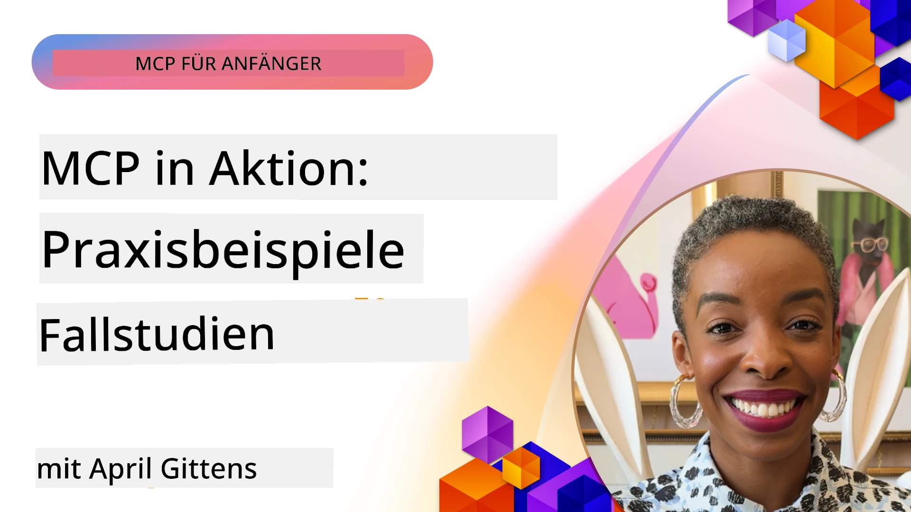

# MCP in Aktion: Praxisbeispiele

_(Klicken Sie auf das obige Bild, um das Video zu dieser Lektion anzusehen)_

Das Model Context Protocol (MCP) revolutioniert die Art und Weise, wie KI-Anwendungen mit Daten, Tools und Diensten interagieren. Dieser Abschnitt präsentiert praxisnahe Fallstudien, die den Einsatz von MCP in verschiedenen Unternehmensszenarien veranschaulichen.

## Überblick

Dieser Abschnitt zeigt konkrete Beispiele für MCP-Implementierungen und hebt hervor, wie Organisationen dieses Protokoll nutzen, um komplexe geschäftliche Herausforderungen zu lösen. Durch die Betrachtung dieser Fallstudien erhalten Sie Einblicke in die Vielseitigkeit, Skalierbarkeit und praktischen Vorteile von MCP in realen Szenarien.

## Wichtige Lernziele

Durch die Erkundung dieser Fallstudien werden Sie:

- Verstehen, wie MCP zur Lösung spezifischer Geschäftsprobleme eingesetzt werden kann
- Verschiedene Integrationsmuster und architektonische Ansätze kennenlernen
- Best Practices für die Implementierung von MCP in Unternehmensumgebungen erkennen
- Einblicke in Herausforderungen und Lösungen bei realen Implementierungen gewinnen
- Chancen identifizieren, ähnliche Muster in Ihren eigenen Projekten anzuwenden

## Ausgewählte Fallstudien

### 1. [Azure AI Travel Agents – Referenzimplementierung](./travelagentsample.md)

Diese Fallstudie untersucht Microsofts umfassende Referenzlösung, die zeigt, wie man eine Multi-Agenten-basierte, KI-gestützte Reiseplanungsanwendung mit MCP, Azure OpenAI und Azure AI Search aufbaut. Das Projekt zeigt:

- Multi-Agenten-Orchestrierung durch MCP
- Unternehmensdataintegration mit Azure AI Search
- Sichere, skalierbare Architektur unter Verwendung von Azure-Diensten
- Erweiterbare Werkzeuge mit wiederverwendbaren MCP-Komponenten
- Konversationelles Benutzererlebnis durch Azure OpenAI

Die Architektur- und Implementierungsdetails bieten wertvolle Einblicke in den Aufbau komplexer Multi-Agenten-Systeme mit MCP als Koordinationsschicht.

### 2. [Aktualisierung von Azure DevOps Items mit YouTube-Daten](./UpdateADOItemsFromYT.md)

Diese Fallstudie zeigt eine praktische Anwendung von MCP zur Automatisierung von Workflow-Prozessen. Sie demonstriert, wie MCP-Tools verwendet werden können, um:

- Daten von Online-Plattformen (YouTube) zu extrahieren
- Arbeitselemente in Azure DevOps Systemen zu aktualisieren
- Wiederholbare Automatisierungs-Workflows zu erstellen
- Daten über verschiedene Systeme hinweg zu integrieren

Dieses Beispiel veranschaulicht, wie selbst relativ einfache MCP-Implementierungen signifikante Effizienzsteigerungen durch Automatisierung routinemäßiger Aufgaben und Verbesserung der Datenkonsistenz zwischen Systemen bieten können.

### 3. [Echtzeit-Dokumentationsabruf mit MCP](./docs-mcp/README.md)

Diese Fallstudie führt Sie durch die Anbindung eines Python-Konsolenclients an einen Model Context Protocol (MCP) Server, um Echtzeit, kontextbezogene Microsoft-Dokumentation abzurufen und zu protokollieren. Sie lernen, wie man:

- Sich mit einem MCP-Server mittels Python-Client und offizieller MCP SDK verbindet
- Streaming HTTP Clients für effizienten, Echtzeit-Datenabruf verwendet
- Dokumentations-Tools auf dem Server aufruft und die Antworten direkt in der Konsole protokolliert
- Aktuelle Microsoft-Dokumentation in den Workflow integriert, ohne das Terminal zu verlassen

Das Kapitel enthält eine praktische Aufgabe, ein minimales funktionierendes Codebeispiel und Links zu zusätzlichen Ressourcen für vertieftes Lernen. Sehen Sie sich die vollständige Anleitung und den Code im verlinkten Kapitel an, um zu verstehen, wie MCP den Zugriff auf Dokumentation und die Entwicklerproduktivität in Konsolenumgebungen verändern kann.

### 4. [Interaktive Studienplan-Generator-Webanwendung mit MCP](./docs-mcp/README.md)

Diese Fallstudie zeigt, wie man eine interaktive Webanwendung mit Chainlit und dem Model Context Protocol (MCP) baut, um personalisierte Studienpläne zu jedem Thema zu generieren. Nutzer können ein Thema (wie „AI-900 Zertifizierung“) und eine Studiendauer (z. B. 8 Wochen) angeben, und die App liefert eine wöchentliche Aufschlüsselung empfohlener Inhalte. Chainlit ermöglicht eine konversationelle Chat-Oberfläche, die die Erfahrung ansprechend und adaptiv gestaltet.

- Konversationelle Web-App powered by Chainlit
- Nutzergetriebene Eingaben für Thema und Dauer
- Wöchentliche Inhalts-Empfehlungen unter Verwendung von MCP
- Echtzeit, adaptive Antworten in einer Chat-Oberfläche

Das Projekt zeigt, wie konversationelle KI und MCP kombiniert werden können, um dynamische, nutzerorientierte Bildungswerkzeuge in einer modernen Webumgebung zu schaffen.

### 5. [In-Editor-Dokumentation mit MCP-Server in VS Code](./docs-mcp/README.md)

Diese Fallstudie zeigt, wie Sie Microsoft Learn Docs direkt in Ihre VS Code Umgebung mit dem MCP-Server bringen – kein Wechseln zwischen Browser-Tabs mehr! Sie erfahren, wie Sie:

- Dokumentation sofort in VS Code durchsuchen und lesen, mit dem MCP-Panel oder der Befehls-Palette
- Dokumentation referenzieren und Links direkt in README- oder Kurs-Markdown-Dateien einfügen
- GitHub Copilot und MCP zusammen für nahtlose, KI-gestützte Dokumentations- und Codeworkflows verwenden
- Ihre Dokumentation mit Echtzeit-Feedback und Microsoft-qualitätsgesicherter Genauigkeit validieren und verbessern
- MCP mit GitHub-Workflows für kontinuierliche Dokumentationsvalidierung integrieren

Die Implementierung beinhaltet:

- Beispiel-Konfiguration `.vscode/mcp.json` für einfache Einrichtung
- Screenshot-basierte Anleitungen zur In-Editor-Erfahrung
- Tipps zur Kombination von Copilot und MCP für maximale Produktivität

Dieses Szenario eignet sich ideal für Kursautoren, Dokumentationsschreiber und Entwickler, die fokussiert im Editor mit Docs, Copilot und Validierungstools arbeiten möchten – alles powered by MCP.

### 6. [APIM MCP Server Erstellung](./apimsample.md)

Diese Fallstudie bietet eine Schritt-für-Schritt-Anleitung, wie man einen MCP-Server mit Azure API Management (APIM) erstellt. Sie behandelt:

- Einrichtung eines MCP-Servers in Azure API Management
- Exponieren von API-Operationen als MCP-Tools
- Konfiguration von Richtlinien für Ratenbegrenzung und Sicherheit
- Testen des MCP-Servers mit Visual Studio Code und GitHub Copilot

Dieses Beispiel zeigt, wie man die Möglichkeiten von Azure nutzt, um einen robusten MCP-Server zu erstellen, der in verschiedenen Anwendungen eingesetzt werden kann und die Integration von KI-Systemen mit Unternehmens-APIs verbessert.

### 7. [GitHub MCP Registry — Beschleunigung der agentischen Integration](https://github.com/mcp)

Diese Fallstudie untersucht, wie das GitHub MCP Registry, das im September 2025 gestartet wurde, eine kritische Herausforderung im KI-Ökosystem adressiert: die fragmentierte Entdeckung und Bereitstellung von Model Context Protocol (MCP) Servern.

#### Überblick
Das **MCP Registry** löst das wachsende Problem verstreuter MCP-Server über Repositories und Registries hinweg, was zuvor Integration langsam und fehleranfällig machte. Diese Server ermöglichen KI-Agenten die Interaktion mit externen Systemen wie APIs, Datenbanken und Dokumentationsquellen.

#### Problemstellung
Entwickler, die agentische Workflows erstellen, standen vor mehreren Herausforderungen:
- **Schlechte Auffindbarkeit** von MCP-Servern auf unterschiedlichen Plattformen
- **Redundante Einrichtungshinweise** verstreut über Foren und Dokumentationen
- **Sicherheitsrisiken** durch nicht verifizierte und nicht vertrauenswürdige Quellen
- **Fehlende Standardisierung** bei Serverqualität und Kompatibilität

#### Lösungsarchitektur
GitHubs MCP Registry zentralisiert vertrauenswürdige MCP-Server mit den Kernfeatures:
- **One-Click-Install** Integration über VS Code für unkomplizierte Einrichtung
- **Signal-über-Rauschen Sortierung** nach Sternen, Aktivität und Community-Validierung
- **Direkte Integration** mit GitHub Copilot und weiteren MCP-kompatiblen Tools
- **Offenes Beitragsmodell** ermöglicht Community- und Unternehmenspartnern die Mitwirkung

#### Geschäftlicher Impact
Das Registry hat messbare Verbesserungen gebracht:
- **Schnellere Einarbeitung** für Entwickler dank Tools wie dem Microsoft Learn MCP Server, der offizielle Dokumentation direkt in Agenten streamt
- **Erhöhte Produktivität** durch spezialisierte Server wie `github-mcp-server`, der natürliche Sprachautomation für GitHub (PR-Erstellung, CI-Neustarts, Code-Scanning) ermöglicht
- **Stärkeres Ökosystemvertrauen** durch kuratierte Listen und transparente Konfigurationsstandards

#### Strategischer Wert
Für Praktiker mit Spezialisierung auf Agenten-Lifecycle-Management und reproduzierbare Workflows bietet das MCP Registry:
- **Modulare Agentenbereitstellung** mit standardisierten Komponenten
- **Registrierungs-gestützte Evaluierungspipelines** für konsistente Tests und Validierungen
- **Tool-übergreifende Interoperabilität** für nahtlose Integration verschiedener KI-Plattformen

Diese Fallstudie zeigt, dass das MCP Registry mehr als nur ein Verzeichnis ist – es ist eine fundamentale Plattform für skalierbare, reale Modellintegration und agentische Systembereitstellung.

## Fazit

Diese sieben umfassenden Fallstudien zeigen die bemerkenswerte Vielseitigkeit und praktischen Anwendungen des Model Context Protocol in vielfältigen realen Szenarien. Von komplexen Multi-Agenten-Reiseplanungssystemen und Enterprise-API-Management über optimierte Dokumentations-Workflows bis hin zum revolutionären GitHub MCP Registry demonstrieren diese Beispiele, wie MCP eine standardisierte, skalierbare Verbindung von KI-Systemen mit den benötigten Tools, Daten und Diensten ermöglicht, um außergewöhnlichen Mehrwert zu liefern.

Die Fallstudien umfassen verschiedene Dimensionen der MCP-Implementierung:
- **Enterprise-Integration**: Azure API Management und Azure DevOps Automation
- **Multi-Agenten-Orchestrierung**: Reiseplanung mit koordinierten KI-Agenten
- **Entwicklerproduktivität**: VS Code Integration und Echtzeit-Dokumentenzugriff
- **Ökosystementwicklung**: GitHubs MCP Registry als fundamentale Plattform
- **Bildungsanwendungen**: Interaktive Studienplan-Generatoren und konversationelle Schnittstellen

Durch die Analyse dieser Implementierungen erhalten Sie wichtige Einblicke in:
- **Architekturmuster** für verschiedene Größenordnungen und Anwendungsfälle
- **Implementierungsstrategien** zur Balance von Funktionalität und Wartbarkeit
- **Sicherheits- und Skalierbarkeitsaspekte** für Produktionseinsätze
- **Best Practices** für MCP-Serverentwicklung und Clientintegration
- **Ökosystemdenken** beim Aufbau vernetzter KI-basierter Lösungen

Diese Beispiele zeigen gemeinsam, dass MCP nicht nur ein theoretisches Framework, sondern ein ausgereiftes, produktionsfähiges Protokoll ist, das praktische Lösungen für komplexe geschäftliche Herausforderungen ermöglicht. Ob Sie einfache Automatisierungstools oder komplexe Multi-Agenten-Systeme bauen – die hier gezeigten Muster und Ansätze bieten eine solide Grundlage für Ihre eigenen MCP-Projekte.

## Zusätzliche Ressourcen

- [Azure AI Travel Agents GitHub Repository](https://github.com/Azure-Samples/azure-ai-travel-agents)
- [Azure DevOps MCP Tool](https://github.com/microsoft/azure-devops-mcp)
- [Playwright MCP Tool](https://github.com/microsoft/playwright-mcp)
- [Microsoft Docs MCP Server](https://github.com/MicrosoftDocs/mcp)
- [GitHub MCP Registry — Beschleunigung der agentischen Integration](https://github.com/mcp)
- [MCP Community Examples](https://github.com/microsoft/mcp)

## Was kommt als Nächstes

- Vorheriger: [Modul 8: Best Practices](../08-BestPractices/README.md)
- Nächster: [Modul 10: Optimierung von KI-Workflows: Aufbau eines MCP-Servers mit AI Toolkit](../10-StreamliningAIWorkflowsBuildingAnMCPServerWithAIToolkit/README.md)

---

<!-- CO-OP TRANSLATOR DISCLAIMER START -->
**Haftungsausschluss**:  
Dieses Dokument wurde mithilfe des KI-Übersetzungsdienstes [Co-op Translator](https://github.com/Azure/co-op-translator) übersetzt. Obwohl wir auf Genauigkeit achten, weisen wir darauf hin, dass automatisierte Übersetzungen Fehler oder Ungenauigkeiten enthalten können. Das Originaldokument in seiner Ursprungssprache gilt als maßgebliche Quelle. Für wichtige Informationen wird eine professionelle menschliche Übersetzung empfohlen. Wir übernehmen keine Haftung für Missverständnisse oder Fehlinterpretationen, die aus der Verwendung dieser Übersetzung entstehen.
<!-- CO-OP TRANSLATOR DISCLAIMER END -->