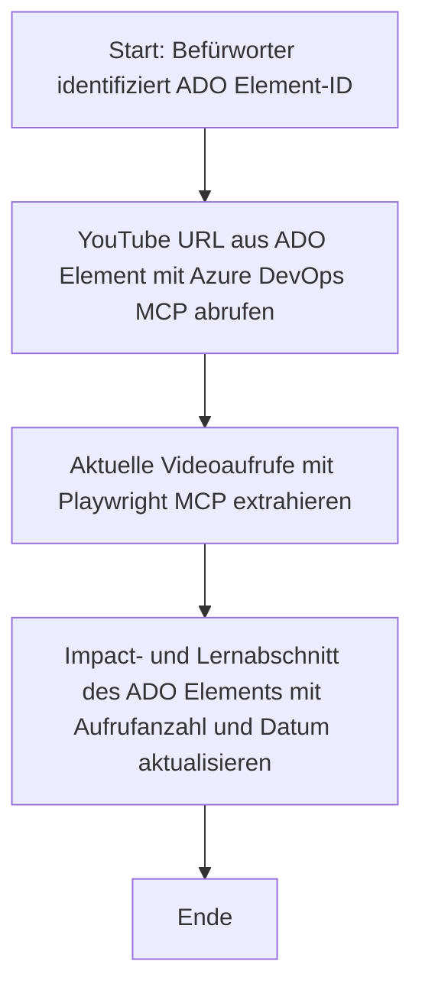

# Fallstudie: Aktualisierung von Azure DevOps-Elementen mit YouTube-Daten mittels MCP

> **Haftungsausschluss:** Es gibt bestehende Online-Tools und Berichte, die den Prozess der Aktualisierung von Azure DevOps-Elementen mit Daten von Plattformen wie YouTube automatisieren können. Das folgende Szenario dient ausschließlich als Beispiel, um zu veranschaulichen, wie MCP-Tools für Automatisierungs- und Integrationsaufgaben eingesetzt werden können.

## Überblick

Diese Fallstudie zeigt ein Beispiel dafür, wie das Model Context Protocol (MCP) und seine Tools verwendet werden können, um den Prozess der Aktualisierung von Azure DevOps (ADO)-Arbeitsaufgaben mit Informationen aus Online-Plattformen wie YouTube zu automatisieren. Das beschriebene Szenario ist nur eine Illustration der umfassenderen Möglichkeiten dieser Tools, die an viele ähnliche Automatisierungsanforderungen angepasst werden können.

In diesem Beispiel verfolgt ein Advocate Online-Sessions mit ADO-Elementen, wobei jedes Element eine YouTube-Video-URL enthält. Durch den Einsatz von MCP-Tools kann der Advocate die ADO-Elemente auf dem neuesten Stand mit den aktuellen Videostatistiken, wie z.B. der Anzahl der Aufrufe, in einer wiederholbaren und automatisierten Weise halten. Dieser Ansatz lässt sich auf andere Anwendungsfälle verallgemeinern, in denen Informationen aus Online-Quellen in ADO oder andere Systeme integriert werden müssen.

## Szenario

Ein Advocate ist verantwortlich für die Nachverfolgung der Wirkung von Online-Sessions und Community-Engagements. Jede Session wird als ADO-Arbeitsaufgabe im Projekt „DevRel“ protokolliert, und die Arbeitsaufgabe enthält ein Feld für die YouTube-Video-URL. Um die Reichweite der Session genau zu berichten, muss der Advocate das ADO-Element mit der aktuellen Anzahl an Videoaufrufen und dem Datum der Informationsabfrage aktualisieren.

## Verwendete Tools

- [Azure DevOps MCP](https://github.com/microsoft/azure-devops-mcp): Ermöglicht den programmatischen Zugriff und Updates von ADO-Arbeitsaufgaben über MCP.
- [Playwright MCP](https://github.com/microsoft/playwright-mcp): Automatisiert Browseraktionen, um Live-Daten von Webseiten, wie YouTube-Video-Statistiken, zu extrahieren.

## Schritt-für-Schritt-Ablauf

1. **ADO-Element identifizieren**: Beginnen Sie mit der ADO-Arbeitsaufgaben-ID (z. B. 1234) im Projekt „DevRel“.
2. **YouTube-URL abrufen**: Verwenden Sie das Azure DevOps MCP-Tool, um die YouTube-URL aus der Arbeitsaufgabe zu erhalten.
3. **Videoaufrufe extrahieren**: Verwenden Sie das Playwright MCP-Tool, um die YouTube-URL zu öffnen und die aktuelle Aufrufzahl auszulesen.
4. **ADO-Element aktualisieren**: Schreiben Sie die aktuelle Aufrufzahl und das Abrufdatum in den Abschnitt „Impact and Learnings“ der ADO-Arbeitsaufgabe mithilfe des Azure DevOps MCP-Tools.

## Beispiel Prompt

```bash
- Work with the ADO Item ID: 1234
- The project is '2025-Awesome'
- Get the YouTube URL for the ADO item
- Use Playwright to get the current views from the YouTube video
- Update the ADO item with the current video views and the updated date of the information
```

## Mermaid-Diagramm


## Technische Umsetzung

- **MCP-Orchestrierung**: Der Workflow wird von einem MCP-Server koordiniert, der die Nutzung sowohl von Azure DevOps MCP als auch Playwright MCP orchestriert.
- **Automatisierung**: Der Prozess kann manuell ausgelöst oder so geplant werden, dass er in regelmäßigen Abständen läuft, um die ADO-Elemente aktuell zu halten.
- **Erweiterbarkeit**: Dasselbe Muster kann erweitert werden, um ADO-Elemente mit anderen Online-Metriken (z. B. Likes, Kommentare) oder von anderen Plattformen zu aktualisieren.

## Ergebnisse und Auswirkungen

- **Effizienz**: Verringert den manuellen Aufwand für Advocates durch Automatisierung der Abfrage und Aktualisierung von Videometadaten.
- **Genauigkeit**: Stellt sicher, dass die ADO-Elemente die aktuellsten verfügbaren Daten aus Online-Quellen widerspiegeln.
- **Wiederholbarkeit**: Bietet einen wiederverwendbaren Workflow für ähnliche Szenarien mit anderen Datenquellen oder Metriken.

## Referenzen

- [Azure DevOps MCP](https://github.com/microsoft/azure-devops-mcp)
- [Playwright MCP](https://github.com/microsoft/playwright-mcp)
- [Model Context Protocol (MCP)](https://modelcontextprotocol.io/)

## Was folgt als Nächstes

- Zurück zu: [Fallstudien Überblick](./README.md)
- Weiter zu: [Echtzeit-Dokumentenabfrage mit MCP](./docs-mcp/README.md)

---

<!-- CO-OP TRANSLATOR DISCLAIMER START -->
**Haftungsausschluss**:
Dieses Dokument wurde mit dem KI-Übersetzungsdienst [Co-op Translator](https://github.com/Azure/co-op-translator) übersetzt. Obwohl wir uns um Genauigkeit bemühen, können automatisierte Übersetzungen Fehler oder Ungenauigkeiten enthalten. Das Originaldokument in seiner ursprünglichen Sprache gilt als maßgebliche Quelle. Für kritische Informationen wird eine professionelle menschliche Übersetzung empfohlen. Wir übernehmen keine Haftung für Missverständnisse oder Fehlinterpretationen, die aus der Nutzung dieser Übersetzung entstehen.
<!-- CO-OP TRANSLATOR DISCLAIMER END -->