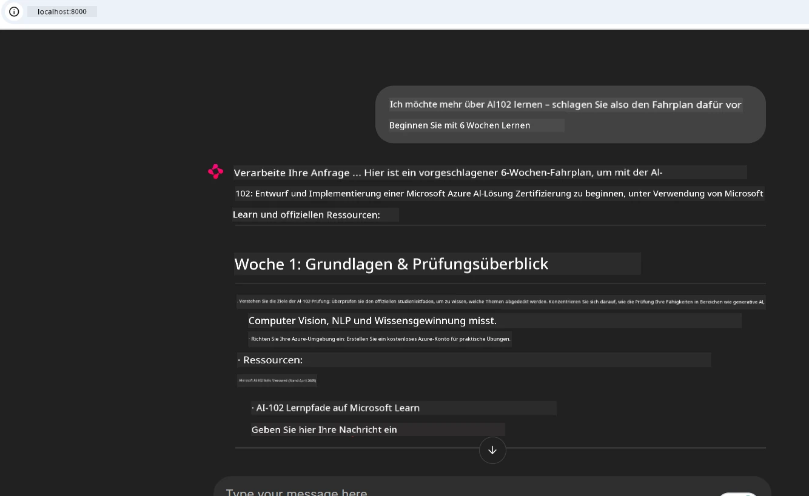
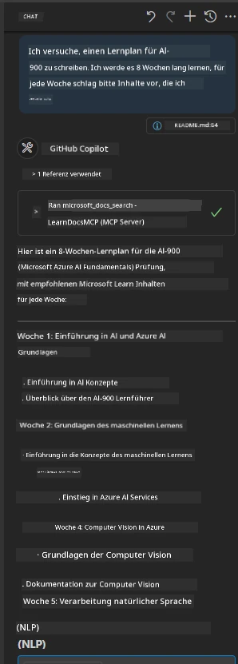

# Fallstudie: Verbindung mit dem Microsoft Learn Docs MCP-Server von einem Client aus

Haben Sie sich schon einmal dabei ertappt, zwischen Dokumentationsseiten, Stack Overflow und endlosen Suchmaschinen-Tabs zu jonglieren, während Sie versuchen, ein Problem in Ihrem Code zu lösen? Vielleicht behalten Sie einen zweiten Monitor nur für Dokumentationen oder wechseln ständig per Alt-Tab zwischen Ihrer IDE und einem Browser. Wäre es nicht besser, wenn Sie die Dokumentation direkt in Ihren Workflow integrieren könnten – eingebettet in Ihre Apps, Ihre IDE oder sogar Ihre eigenen benutzerdefinierten Tools? In dieser Fallstudie werden wir genau das untersuchen, indem wir direkt von Ihrer eigenen Client-Anwendung aus eine Verbindung zum Microsoft Learn Docs MCP-Server herstellen.

## Überblick

Modernes Entwickeln bedeutet mehr als nur Code zu schreiben – es geht darum, genau zur richtigen Zeit die richtigen Informationen zu finden. Dokumentationen sind überall, aber selten genau dort, wo Sie sie am meisten brauchen: in Ihren Tools und Workflows. Durch die direkte Integration der Dokumentationsabfrage in Ihre Anwendungen können Sie Zeit sparen, Kontextwechsel reduzieren und die Produktivität steigern. In diesem Abschnitt zeigen wir Ihnen, wie Sie einen Client mit dem Microsoft Learn Docs MCP-Server verbinden, damit Sie Echtzeit- und kontextabhängige Dokumentationen erhalten, ohne jemals Ihre App zu verlassen.

Wir führen Sie durch den Prozess, eine Verbindung herzustellen, eine Anfrage zu senden und Streaming-Antworten effizient zu verarbeiten. Dieser Ansatz optimiert nicht nur Ihren Workflow, sondern eröffnet auch die Möglichkeit, intelligentere und hilfreichere Entwickler-Tools zu entwickeln.

## Lernziele

Warum machen wir das? Weil die besten Entwicklererfahrungen diejenigen sind, die Reibung beseitigen. Stellen Sie sich eine Welt vor, in der Ihr Code-Editor, Ihr Chatbot oder Ihre Web-App Ihre Dokumentationsfragen sofort beantwortet – unter Verwendung der neuesten Inhalte von Microsoft Learn. Am Ende dieses Kapitels werden Sie wissen, wie Sie:

- Die Grundlagen der Kommunikation zwischen MCP-Server und Client für Dokumentationen verstehen
- Eine Konsolen- oder Webanwendung implementieren, um eine Verbindung zum Microsoft Learn Docs MCP-Server herzustellen
- Streaming-HTTP-Clients für die Echtzeit-Dokumentationsabfrage verwenden
- Dokumentationsantworten in Ihrer Anwendung protokollieren und interpretieren

Sie werden sehen, wie diese Fähigkeiten Ihnen helfen können, Tools zu erstellen, die nicht nur reaktiv, sondern wirklich interaktiv und kontextbewusst sind.

## Szenario 1 – Echtzeit-Dokumentationsabruf mit MCP

In diesem Szenario zeigen wir Ihnen, wie Sie einen Client mit dem Microsoft Learn Docs MCP-Server verbinden, damit Sie Echtzeit- und kontextabhängige Dokumentation ohne Verlassen Ihrer App abrufen können.

Lassen Sie uns das in die Praxis umsetzen. Ihre Aufgabe ist es, eine App zu schreiben, die eine Verbindung zum Microsoft Learn Docs MCP-Server herstellt, das Tool `microsoft_docs_search` aufruft und die Streaming-Antwort in der Konsole protokolliert.

### Warum dieser Ansatz?  
Weil es die Grundlage für die Entwicklung fortschrittlicherer Integrationen ist – egal, ob Sie einen Chatbot, eine IDE-Erweiterung oder ein Web-Dashboard betreiben möchten.

Den Code und die Anweisungen für dieses Szenario finden Sie im Ordner [`solution`](./solution/README.md) innerhalb dieser Fallstudie. Die Schritte führen Sie durch die Einrichtung der Verbindung:  
- Verwenden Sie das offizielle MCP-SDK und einen streamingfähigen HTTP-Client für die Verbindung  
- Rufen Sie das Tool `microsoft_docs_search` mit einem Abfrageparameter auf, um Dokumentationen abzurufen  
- Implementieren Sie geeignetes Logging und Fehlerbehandlung  
- Erstellen Sie eine interaktive Konsolenschnittstelle, die es Nutzern ermöglicht, mehrere Suchanfragen einzugeben  

Dieses Szenario demonstriert, wie Sie:  
- Eine Verbindung zum Docs MCP-Server herstellen  
- Eine Anfrage senden  
- Die Ergebnisse analysieren und ausgeben  

So könnte die Ausführung der Lösung aussehen:

```
Prompt> What is Azure Key Vault?
Answer> Azure Key Vault is a cloud service for securely storing and accessing secrets. ...
```
  
Unten sehen Sie eine minimalistische Beispielösung. Der vollständige Code und weitere Details sind im Lösung-Ordner verfügbar.

<details>
<summary>Python</summary>

```python
import asyncio
from mcp.client.streamable_http import streamablehttp_client
from mcp import ClientSession

async def main():
    async with streamablehttp_client("https://learn.microsoft.com/api/mcp") as (read_stream, write_stream, _):
        async with ClientSession(read_stream, write_stream) as session:
            await session.initialize()
            result = await session.call_tool("microsoft_docs_search", {"query": "Azure Functions best practices"})
            print(result.content)

if __name__ == "__main__":
    asyncio.run(main())
```
  
- Für die vollständige Implementierung und das Logging siehe [`scenario1.py`](../../../../09-CaseStudy/docs-mcp/solution/python/scenario1.py).  
- Installations- und Nutzungshinweise finden Sie in der Datei [`README.md`](./solution/python/README.md) im selben Ordner.  
</details>

## Szenario 2 – Interaktive Web-App zum Erzeugen eines Lernplans mit MCP

In diesem Szenario lernen Sie, wie Sie Docs MCP in ein Webentwicklungsprojekt integrieren. Ziel ist es, Benutzern zu ermöglichen, Microsoft Learn Dokumentation direkt über eine Weboberfläche zu durchsuchen, sodass die Dokumentation sofort innerhalb Ihrer App oder Website zugänglich ist.

Sie lernen, wie Sie:  
- Eine Web-App einrichten  
- Eine Verbindung zum Docs MCP-Server herstellen  
- Benutzereingaben verarbeiten und Ergebnisse anzeigen  

So könnte die Ausführung der Lösung aussehen:

```
User> I want to learn about AI102 - so suggest the roadmap to get it started from learn for 6 weeks

Assistant> Here’s a detailed 6-week roadmap to start your preparation for the AI-102: Designing and Implementing a Microsoft Azure AI Solution certification, using official Microsoft resources and focusing on exam skills areas:

---
## Week 1: Introduction & Fundamentals
- **Understand the Exam**: Review the [AI-102 exam skills outline](https://learn.microsoft.com/en-us/credentials/certifications/exams/ai-102/).
- **Set up Azure**: Sign up for a free Azure account if you don't have one.
- **Learning Path**: [Introduction to Azure AI services](https://learn.microsoft.com/en-us/training/modules/intro-to-azure-ai/)
- **Focus**: Get familiar with Azure portal, AI capabilities, and necessary tools.

....more weeks of the roadmap...

Let me know if you want module-specific recommendations or need more customized weekly tasks!
```
  
Unten sehen Sie eine minimalistische Beispielösung. Der vollständige Code und weitere Details sind im Lösung-Ordner verfügbar.



<details>
<summary>Python (Chainlit)</summary>

Chainlit ist ein Framework zur Erstellung von konversationellen KI-Web-Apps. Es ermöglicht einfach interaktive Chatbots und Assistenten zu bauen, die MCP-Tools aufrufen und Ergebnisse in Echtzeit anzeigen können. Es eignet sich hervorragend für schnelle Prototypen und benutzerfreundliche Oberflächen.

```python
import chainlit as cl
import requests

MCP_URL = "https://learn.microsoft.com/api/mcp"

@cl.on_message
def handle_message(message):
    query = {"question": message}
    response = requests.post(MCP_URL, json=query)
    if response.ok:
        result = response.json()
        cl.Message(content=result.get("answer", "No answer found.")).send()
    else:
        cl.Message(content="Error: " + response.text).send()
```
  
- Für die vollständige Implementierung siehe [`scenario2.py`](../../../../09-CaseStudy/docs-mcp/solution/python/scenario2.py).  
- Setup- und Startanweisungen finden Sie im [`README.md`](./solution/python/README.md).  
</details>

## Szenario 3: In-Editor-Dokumentation mit MCP-Server in VS Code

Wenn Sie Microsoft Learn Docs direkt in VS Code erhalten möchten (anstatt zwischen Browser-Tabs zu wechseln), können Sie den MCP-Server in Ihrem Editor nutzen. So können Sie:  
- Dokumentationen in VS Code durchsuchen und lesen, ohne Ihre Programmierumgebung zu verlassen.  
- Dokumentationen referenzieren und Links direkt in Ihre README- oder Kursdateien einfügen.  
- GitHub Copilot und MCP zusammen für einen nahtlosen, KI-gestützten Dokumentationsworkflow nutzen.

**Sie lernen, wie man:**  
- Eine gültige Datei `.vscode/mcp.json` im Stammverzeichnis Ihres Arbeitsbereichs hinzufügt (siehe Beispiel unten).  
- Das MCP-Panel öffnet oder die Befehls-Palette in VS Code verwendet, um Dokumentationen zu suchen und einzufügen.  
- Dokumentationen direkt in Ihren Markdown-Dateien referenziert, während Sie arbeiten.  
- Diesen Workflow mit GitHub Copilot kombiniert, um die Produktivität weiter zu steigern.

Hier ein Beispiel, wie man den MCP-Server in VS Code einrichtet:

```json
{
  "servers": {
    "LearnDocsMCP": {
      "url": "https://learn.microsoft.com/api/mcp"
    }
  }
}
```
  
</details>

> Für eine detaillierte Schritt-für-Schritt-Anleitung mit Screenshots siehe [`README.md`](./solution/scenario3/README.md).



Dieser Ansatz ist ideal für alle, die technische Kurse erstellen, Dokumentationen schreiben oder Code mit häufigen Referenzen entwickeln.

## Zentrale Erkenntnisse

Die Integration von Dokumentationen direkt in Ihre Tools ist nicht nur ein Komfort, sondern ein echter Produktivitätsschub. Durch die Verbindung mit dem Microsoft Learn Docs MCP-Server von Ihrem Client aus können Sie:

- Kontextwechsel zwischen Code und Dokumentation eliminieren  
- Aktuelle, kontextabhängige Dokumentationen in Echtzeit abrufen  
- Intelligente, interaktive Entwickler-Tools entwickeln  

Diese Fähigkeiten helfen Ihnen, Lösungen zu erstellen, die nicht nur effizient, sondern auch angenehm zu bedienen sind.

## Zusätzliche Ressourcen

Um Ihr Verständnis zu vertiefen, nutzen Sie diese offiziellen Ressourcen:

- [Microsoft Learn Docs MCP Server (GitHub)](https://github.com/MicrosoftDocs/mcp)  
- [Erste Schritte mit Azure MCP Server (mcp-python)](https://learn.microsoft.com/en-us/azure/developer/azure-mcp-server/get-started#create-the-python-app)  
- [Was ist der Azure MCP Server?](https://learn.microsoft.com/en-us/azure/developer/azure-mcp-server/)  
- [Model Context Protocol (MCP) Einführung](https://modelcontextprotocol.io/introduction)  
- [Plugins von einem MCP Server hinzufügen (Python)](https://learn.microsoft.com/en-us/semantic-kernel/concepts/plugins/adding-mcp-plugins)  

## Wie geht es weiter

- Zurück zu: [Fallstudien Übersicht](../README.md)  
- Weiter zu: [Modul 10: Workflow-Optimierung mit AI Toolkit](../../10-StreamliningAIWorkflowsBuildingAnMCPServerWithAIToolkit/README.md)

---

<!-- CO-OP TRANSLATOR DISCLAIMER START -->
**Haftungsausschluss**:
Dieses Dokument wurde mit dem KI-Übersetzungsdienst [Co-op Translator](https://github.com/Azure/co-op-translator) übersetzt. Obwohl wir uns um Genauigkeit bemühen, beachten Sie bitte, dass automatisierte Übersetzungen Fehler oder Ungenauigkeiten enthalten können. Das Originaldokument in der Ursprungssprache gilt als maßgebliche Quelle. Für kritische Informationen wird eine professionelle menschliche Übersetzung empfohlen. Wir haften nicht für Missverständnisse oder Fehlinterpretationen, die durch die Nutzung dieser Übersetzung entstehen.
<!-- CO-OP TRANSLATOR DISCLAIMER END -->