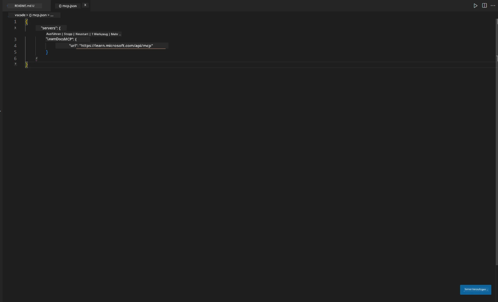
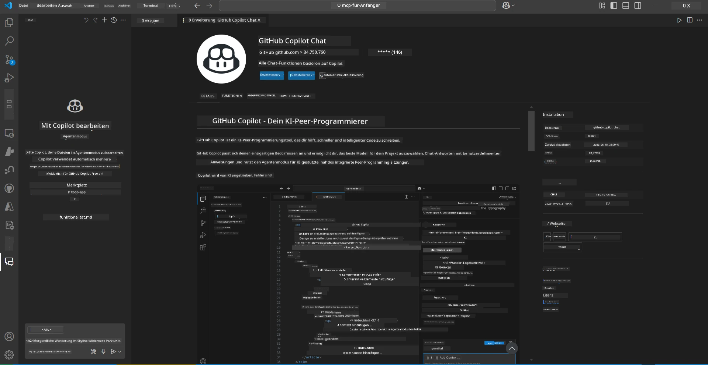
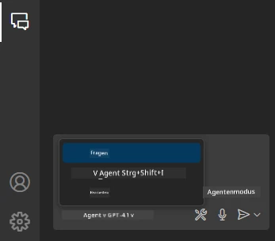
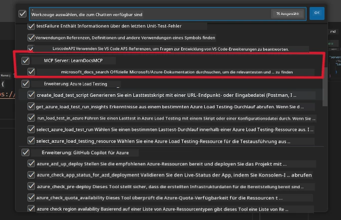
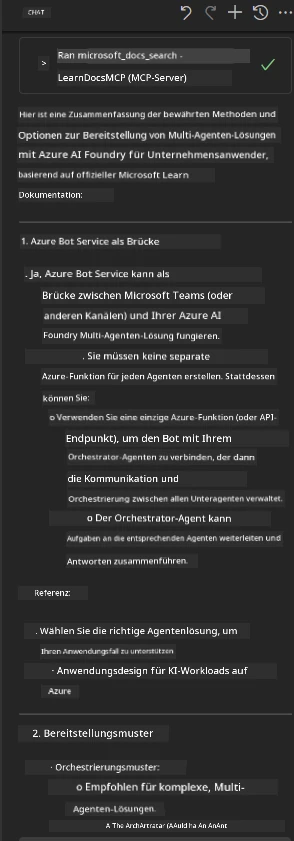

# Szenario 3: In-Editor-Dokumentation mit MCP-Server in VS Code

## Überblick

In diesem Szenario lernst du, wie du Microsoft Learn Docs direkt in deine Visual Studio Code-Umgebung bringst – und zwar mithilfe des MCP-Servers. Anstatt ständig zwischen Browser-Tabs zu wechseln, um Dokumentationen zu suchen, kannst du offizielle Docs direkt in deinem Editor aufrufen, durchsuchen und referenzieren. Dieser Ansatz optimiert deinen Workflow, hält dich fokussiert und ermöglicht eine nahtlose Integration mit Tools wie GitHub Copilot.

- Suche und lese Dokumentationen direkt in VS Code, ohne deine Programmierumgebung zu verlassen.
- Verweise auf Dokumentationen und füge Links direkt in deine README- oder Kursdateien ein.
- Nutze GitHub Copilot und MCP gemeinsam für einen reibungslosen, KI-gestützten Dokumentationsworkflow.

## Lernziele

Am Ende dieses Kapitels wirst du wissen, wie du den MCP-Server in VS Code einrichtest und nutzt, um deinen Dokumentations- und Entwicklungsworkflow zu verbessern. Du wirst in der Lage sein:

- Deinen Workspace so zu konfigurieren, dass der MCP-Server für die Dokumentationssuche verwendet wird.
- Dokumentationen direkt aus VS Code heraus zu suchen und einzufügen.
- Die Vorteile von GitHub Copilot und MCP zu kombinieren, um produktiver mit KI-Unterstützung zu arbeiten.

Diese Fähigkeiten helfen dir, fokussiert zu bleiben, die Qualität deiner Dokumentation zu verbessern und deine Produktivität als Entwickler oder technischer Redakteur zu steigern.

## Lösung

Um den Zugriff auf Dokumentationen direkt im Editor zu ermöglichen, folgst du einer Reihe von Schritten, die den MCP-Server mit VS Code und GitHub Copilot verbinden. Diese Lösung eignet sich ideal für Kursautoren, Dokumentationsschreiber und Entwickler, die beim Arbeiten mit Docs und Copilot im Editor bleiben möchten.

- Füge schnell Referenzlinks zu einer README hinzu, während du eine Kurs- oder Projektdokumentation schreibst.
- Nutze Copilot, um Code zu generieren, und MCP, um relevante Dokumentationen sofort zu finden und zu zitieren.
- Bleibe im Editor fokussiert und steigere deine Produktivität.

### Schritt-für-Schritt-Anleitung

Um loszulegen, folge diesen Schritten. Zu jedem Schritt kannst du einen Screenshot aus dem Assets-Ordner hinzufügen, um den Vorgang visuell zu veranschaulichen.

1. **Füge die MCP-Konfiguration hinzu:**  
   Erstelle im Projektstammverzeichnis eine Datei `.vscode/mcp.json` und füge folgende Konfiguration ein:  
   ```json
   {
     "servers": {
       "LearnDocsMCP": {
         "url": "https://learn.microsoft.com/api/mcp"
       }
     }
   }
   ```  
   Diese Konfiguration teilt VS Code mit, wie die Verbindung zum [`Microsoft Learn Docs MCP server`](https://github.com/MicrosoftDocs/mcp) hergestellt wird.  
   
   
    
2. **Öffne das GitHub Copilot Chat-Panel:**  
   Falls du die GitHub Copilot-Erweiterung noch nicht installiert hast, öffne die Erweiterungsansicht in VS Code und installiere sie. Du kannst sie direkt aus dem [Visual Studio Code Marketplace](https://marketplace.visualstudio.com/items?itemName=GitHub.copilot-chat) herunterladen. Öffne anschließend das Copilot Chat-Panel über die Seitenleiste.  

   

3. **Aktiviere den Agent-Modus und überprüfe die Tools:**  
   Aktiviere im Copilot Chat-Panel den Agent-Modus.  

   

   Nach der Aktivierung solltest du überprüfen, ob der MCP-Server als verfügbares Tool gelistet ist. So stellst du sicher, dass der Copilot-Agent auf den Dokumentationsserver zugreifen kann, um relevante Informationen abzurufen.  
   
   

4. **Starte einen neuen Chat und stelle dem Agenten Fragen:**  
   Öffne im Copilot Chat-Panel einen neuen Chat. Du kannst dem Agenten nun deine Dokumentationsanfragen stellen. Der Agent nutzt den MCP-Server, um relevante Microsoft Learn-Dokumentationen direkt in deinem Editor abzurufen und anzuzeigen.

   - *„Ich möchte einen Lernplan für Thema X erstellen. Ich werde es über 8 Wochen lernen. Für jede Woche schlage mir bitte Inhalte vor, die ich bearbeiten sollte.“*

   

5. **Live-Abfrage:**  

   > Hier ein Beispiel einer Live-Abfrage aus dem [#get-help](https://discord.gg/D6cRhjHWSC)-Bereich im Azure AI Foundry Discord ([Originalnachricht ansehen](https://discord.com/channels/1113626258182504448/1385498306720829572)):  
   
   *„Ich suche Antworten dazu, wie man eine Multi-Agenten-Lösung mit AI-Agenten, die auf Azure AI Foundry entwickelt wurden, bereitstellt. Es gibt keine direkte Bereitstellungsmethode wie Copilot Studio Channels. Welche verschiedenen Möglichkeiten gibt es, diese Bereitstellung für Unternehmenskunden zu realisieren, damit sie interagieren und ihre Aufgaben erledigen können?  
   Es gibt zahlreiche Artikel und Blogs, die sagen, man könne den Azure Bot Service als Brücke zwischen MS Teams und Azure AI Foundry Agents nutzen. Funktioniert das, wenn ich einen Azure Bot einrichte, der über eine Azure Function mit dem Orchestrator Agent auf Azure AI Foundry verbunden ist, um die Orchestrierung durchzuführen? Oder muss ich für jeden AI-Agenten der Multi-Agenten-Lösung eine eigene Azure Function erstellen, um die Orchestrierung im Bot Framework zu übernehmen? Andere Vorschläge sind ebenfalls willkommen.“*

   

   Der Agent antwortet mit passenden Dokumentationslinks und Zusammenfassungen, die du direkt in deine Markdown-Dateien einfügen oder als Referenzen in deinem Code verwenden kannst.

### Beispielanfragen

Hier einige Beispielanfragen, die du ausprobieren kannst. Sie zeigen, wie MCP-Server und Copilot zusammenarbeiten, um sofort kontextbezogene Dokumentationen und Verweise bereitzustellen, ohne VS Code zu verlassen:

- „Zeig mir, wie man Azure Functions Triggers verwendet.“
- „Füge einen Link zur offiziellen Dokumentation für Azure Key Vault ein.“
- „Was sind die Best Practices zur Absicherung von Azure-Ressourcen?“
- „Finde ein Quickstart für Azure AI Services.“

Diese Anfragen demonstrieren, wie MCP-Server und Copilot zusammenarbeiten, um sofort kontextbezogene Dokumentationen und Verweise bereitzustellen, ohne VS Code zu verlassen.

---

**Haftungsausschluss**:  
Dieses Dokument wurde mit dem KI-Übersetzungsdienst [Co-op Translator](https://github.com/Azure/co-op-translator) übersetzt. Obwohl wir uns um Genauigkeit bemühen, beachten Sie bitte, dass automatisierte Übersetzungen Fehler oder Ungenauigkeiten enthalten können. Das Originaldokument in seiner Ursprungssprache ist als maßgebliche Quelle zu betrachten. Für wichtige Informationen wird eine professionelle menschliche Übersetzung empfohlen. Wir übernehmen keine Haftung für Missverständnisse oder Fehlinterpretationen, die aus der Nutzung dieser Übersetzung entstehen.