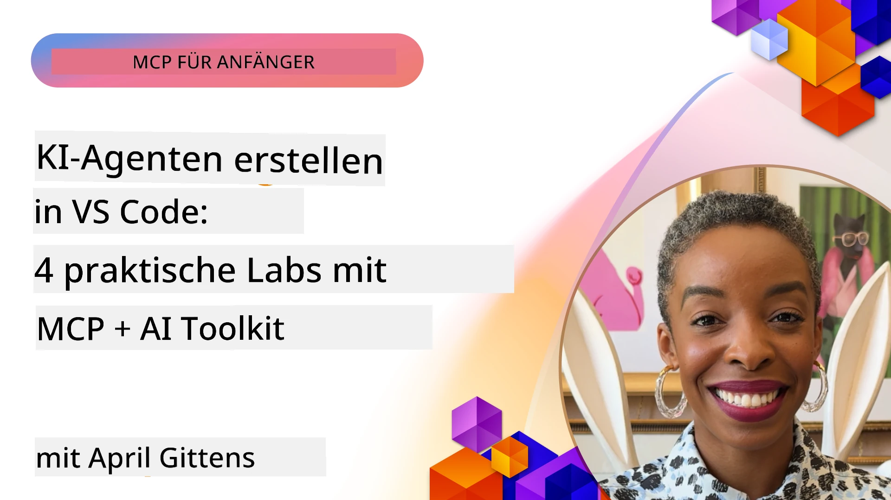

# Optimierung von KI-Workflows: Aufbau eines MCP-Servers mit AI Toolkit

## 🎯 Überblick

_(Klicken Sie auf das obige Bild, um das Video dieser Lektion anzusehen)_

Willkommen zum **Model Context Protocol (MCP) Workshop**! Dieser umfassende praktische Workshop verbindet zwei innovative Technologien, um die Entwicklung von KI-Anwendungen zu revolutionieren:

- **🔗 Model Context Protocol (MCP)**: Ein offener Standard für nahtlose KI-Werkzeugintegration
- **🛠️ AI Toolkit für Visual Studio Code (AITK)**: Microsofts leistungsstarke KI-Entwicklungserweiterung

### 🎓 Was Sie lernen werden

Am Ende dieses Workshops beherrschen Sie die Kunst, intelligente Anwendungen zu bauen, die KI-Modelle mit realen Werkzeugen und Diensten verbinden. Von automatisiertem Testen bis hin zu benutzerdefinierten API-Integrationen erwerben Sie praktische Fähigkeiten zur Lösung komplexer Geschäftsprobleme.

## 🏗️ Technologiestapel

### 🔌 Model Context Protocol (MCP)

MCP ist der **„USB-C für KI“** – ein universeller Standard, der KI-Modelle mit externen Werkzeugen und Datenquellen verbindet.

**✨ Hauptmerkmale:**

- 🔄 **Standardisierte Integration**: Universelle Schnittstelle für KI-Werkzeugverbindungen
- 🏛️ **Flexible Architektur**: Lokale & Remote-Server über stdio/SSE Transport
- 🧰 **Reiches Ökosystem**: Werkzeuge, Prompts und Ressourcen in einem Protokoll
- 🔒 **Unternehmensbereit**: Eingebaute Sicherheit und Zuverlässigkeit

**🎯 Warum MCP wichtig ist:**
So wie USB-C Kabelchaos beseitigt hat, eliminiert MCP die Komplexität von KI-Integrationen. Ein Protokoll, unendliche Möglichkeiten.

### 🤖 AI Toolkit für Visual Studio Code (AITK)

Microsofts Flaggschiff-KI-Entwicklungserweiterung, die VS Code in eine KI-Powerhouse verwandelt.

**🚀 Kernfunktionen:**

- 📦 **Modellkatalog**: Zugriff auf Modelle von Azure AI, GitHub, Hugging Face, Ollama
- ⚡ **Lokale Inferenz**: ONNX-optimierte CPU/GPU/NPU-Ausführung
- 🏗️ **Agent Builder**: Visuelle Entwicklung von KI-Agenten mit MCP-Integration
- 🎭 **Multi-Modal**: Unterstützung für Text, Vision und strukturierte Ausgaben

**💡 Vorteile für die Entwicklung:**

- Modellbereitstellung ohne Konfiguration
- Visuelles Prompt-Engineering
- Echtzeit-Testspielwiese
- Nahtlose MCP-Server-Integration

## 📚 Lernreise

### [🚀 Modul 1: Grundlagen des AI Toolkits](./lab1/README.md)

**Dauer**: 15 Minuten

- 🛠️ Installation und Konfiguration des AI Toolkits für VS Code
- 🗂️ Erkunden des Modellkatalogs (über 100 Modelle von GitHub, ONNX, OpenAI, Anthropic, Google)
- 🎮 Beherrschung des interaktiven Spielplatzes für Echtzeit-Modelltests
- 🤖 Bau deines ersten KI-Agenten mit dem Agent Builder
- 📊 Bewertung der Modellleistung mit integrierten Metriken (F1, Relevanz, Ähnlichkeit, Kohärenz)
- ⚡ Erlernen von Batchverarbeitung und Multi-Modal-Unterstützung

**🎯 Lernergebnis**: Erstellen eines funktionalen KI-Agenten mit umfassendem Verständnis der AITK-Fähigkeiten

### [🌐 Modul 2: MCP mit AI Toolkit Grundlagen](./lab2/README.md)

**Dauer**: 20 Minuten

- 🧠 Beherrschung der Model Context Protocol (MCP) Architektur und Konzepte
- 🌐 Erkunden von Microsofts MCP-Server-Ökosystem
- 🤖 Bau eines Browser-Automatisierungsagenten mit Playwright MCP-Server
- 🔧 Integration von MCP-Servern mit dem AI Toolkit Agent Builder
- 📊 Konfiguration und Test von MCP-Werkzeugen innerhalb deiner Agenten
- 🚀 Export und Bereitstellung von MCP-gestützten Agenten für den Produktionseinsatz

**🎯 Lernergebnis**: Einsatz eines KI-Agenten mit externen Werkzeugen durch MCP

### [🔧 Modul 3: Fortgeschrittene MCP-Entwicklung mit AI Toolkit](./lab3/README.md)

**Dauer**: 20 Minuten

- 💻 Erstellen von benutzerdefinierten MCP-Servern mit AI Toolkit
- 🐍 Konfiguration und Nutzung des neuesten MCP Python SDK (v1.9.3)
- 🔍 Einrichtung und Verwendung des MCP Inspectors zur Fehlerbehebung
- 🛠️ Aufbau eines Weather MCP Servers mit professionellen Debugging-Workflows
- 🧪 Debugging von MCP-Servern sowohl im Agent Builder als auch im Inspector

**🎯 Lernergebnis**: Entwicklung und Fehlerbehebung von benutzerdefinierten MCP-Servern mit modernen Tools

### [🐙 Modul 4: Praktische MCP-Entwicklung – Benutzerdefinierter GitHub Clone Server](./lab4/README.md)

**Dauer**: 30 Minuten

- 🏗️ Aufbau eines realen GitHub Clone MCP-Servers für Entwicklungs-Workflows
- 🔄 Implementierung intelligenter Repository-Klonung mit Validierung und Fehlerbehandlung
- 📁 Erstellung eines intelligenten Verzeichnismanagements und VS Code-Integration
- 🤖 Nutzung des GitHub Copilot Agent Mode mit benutzerdefinierten MCP-Tools
- 🛡️ Anwendung von produktionsreifer Zuverlässigkeit und plattformübergreifender Kompatibilität

**🎯 Lernergebnis**: Einsatz eines produktionsreifen MCP-Servers, der echte Entwicklungs-Workflows optimiert

## 💡 Anwendungen in der Praxis & Auswirkungen

### 🏢 Anwendungsfälle in Unternehmen

#### 🔄 DevOps-Automatisierung

Transformieren Sie Ihren Entwicklungsworkflow mit intelligenter Automatisierung:

- **Intelligentes Repository-Management**: KI-gesteuerte Code-Überprüfung und Merge-Entscheidungen
- **Intelligentes CI/CD**: Automatisierte Pipeline-Optimierung basierend auf Codeänderungen
- **Issue-Triage**: Automatische Fehlerklassifizierung und Zuweisung

#### 🧪 Revolution der Qualitätssicherung

Verbessern Sie das Testen mit KI-gestützter Automatisierung:

- **Intelligente Testgenerierung**: Erstellung umfassender Testsuiten automatisch
- **Visuelles Regressionstesten**: KI-gestützte UI-Änderungserkennung
- **Leistungsüberwachung**: Proaktive Problemerkennung und -lösung

#### 📊 Intelligente Datenpipeline

Bauen Sie intelligentere Datenverarbeitungs-Workflows:

- **Adaptive ETL-Prozesse**: Selbstoptimierende Datenumwandlungen
- **Anomalieerkennung**: Echtzeit-Überwachung der Datenqualität
- **Intelligentes Routing**: Intelligentes Datenflussmanagement

#### 🎧 Verbesserung der Kundenerfahrung

Schaffen Sie außergewöhnliche Kundeninteraktionen:

- **Kontextbewusster Support**: KI-Agenten mit Zugriff auf Kundenhistorie
- **Proaktive Problemlösung**: Vorausschauender Kundendienst
- **Multi-Channel-Integration**: Einheitliche KI-Erfahrung über Plattformen hinweg

## 🛠️ Voraussetzungen & Einrichtung

### 💻 Systemanforderungen

| Komponente             | Anforderung         | Hinweise                 |
|-----------------------|---------------------|--------------------------|
| **Betriebssystem**    | Windows 10+, macOS 10.15+, Linux | Jedes moderne Betriebssystem |
| **Visual Studio Code** | Neueste stabile Version | Erforderlich für AITK     |
| **Node.js**           | v18.0+ und npm       | Für MCP-Server-Entwicklung|
| **Python**            | 3.10+                | Optional für Python MCP-Server |
| **Arbeitsspeicher**   | Mindestens 8GB RAM   | 16GB empfohlen für lokale Modelle |

### 🔧 Entwicklungsumgebung

#### Empfohlene VS Code-Erweiterungen

- **AI Toolkit** (ms-windows-ai-studio.windows-ai-studio)
- **Python** (ms-python.python)
- **Python Debugger** (ms-python.debugpy)
- **GitHub Copilot** (GitHub.copilot) - Optional aber hilfreich

#### Optionale Werkzeuge

- **uv**: Moderner Python-Paketmanager
- **MCP Inspector**: Visuelles Debugging-Tool für MCP-Server
- **Playwright**: Für Webautomatisierungsbeispiele

## 🎖️ Lernziele & Zertifizierungsweg

### 🏆 Checkliste für Kompetenzbeherrschung

Mit Abschluss dieses Workshops erreichen Sie:

#### 🎯 Kernkompetenzen

- [ ] **MCP-Protokollbeherrschung**: Tiefes Verständnis von Architektur und Implementierungsmustern
- [ ] **AITK-Kompetenz**: Expertenniveau in der Nutzung des AI Toolkits für schnelle Entwicklung
- [ ] **Entwicklung kundenspezifischer Server**: Aufbau, Bereitstellung und Wartung produktionsreifer MCP-Server
- [ ] **Exzellente Werkzeugintegration**: Nahtlose Verbindung von KI mit bestehenden Entwicklungs-Workflows
- [ ] **Anwendung von Problemlösungen**: Einsatz erlernter Fähigkeiten zur Lösung realer Geschäftsprobleme

#### 🔧 Technische Fähigkeiten

- [ ] Einrichtung und Konfiguration von AI Toolkit in VS Code
- [ ] Entwurf und Implementierung kundenspezifischer MCP-Server
- [ ] Integration von GitHub-Modellen mit MCP-Architektur
- [ ] Aufbau automatisierter Test-Workflows mit Playwright
- [ ] Bereitstellung von KI-Agenten für den Produktionseinsatz
- [ ] Fehlerbehebung und Leistungsoptimierung von MCP-Servern

#### 🚀 Fortgeschrittene Fähigkeiten

- [ ] Architektur von KI-Integrationen im Unternehmensmaßstab
- [ ] Implementierung von Sicherheitsbest-practices für KI-Anwendungen
- [ ] Entwurf skalierbarer MCP-Server-Architekturen
- [ ] Erstellung maßgeschneiderter Werkzeugketten für spezifische Bereiche
- [ ] Betreuung anderer im KI-nativen Entwicklungsprozess

## 📖 Zusätzliche Ressourcen

- [MCP-Spezifikation (2025-11-25)](https://spec.modelcontextprotocol.io/specification/2025-11-25/)
- [AI Toolkit GitHub-Repository](https://github.com/microsoft/vscode-ai-toolkit)
- [Sammlung von Beispiel-MCP-Servern](https://github.com/modelcontextprotocol/servers)
- [Best Practices Leitfaden](https://modelcontextprotocol.io/docs/best-practices)
- [OWASP MCP Top 10](https://microsoft.github.io/mcp-azure-security-guide/mcp/) – Sicherheitsbestenpraktiken

---

**🚀 Bereit, Ihren KI-Entwicklungsworkflow zu revolutionieren?**

Lassen Sie uns gemeinsam die Zukunft intelligenter Anwendungen mit MCP und AI Toolkit gestalten!

## Was kommt als Nächstes

Fahren Sie fort zu: [Modul 11: MCP Server Hands-On Labs](../11-MCPServerHandsOnLabs/README.md)

---

<!-- CO-OP TRANSLATOR DISCLAIMER START -->
**Haftungsausschluss**:  
Dieses Dokument wurde mit dem KI-Übersetzungsdienst [Co-op Translator](https://github.com/Azure/co-op-translator) übersetzt. Obwohl wir uns um Genauigkeit bemühen, beachten Sie bitte, dass automatisierte Übersetzungen Fehler oder Ungenauigkeiten enthalten können. Das Originaldokument in seiner ursprünglichen Sprache gilt als maßgebliche Quelle. Für wichtige Informationen wird eine professionelle menschliche Übersetzung empfohlen. Wir übernehmen keine Haftung für Missverständnisse oder Fehlinterpretationen, die aus der Verwendung dieser Übersetzung entstehen.
<!-- CO-OP TRANSLATOR DISCLAIMER END -->