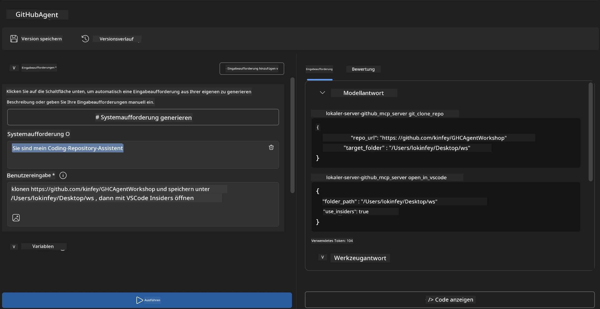
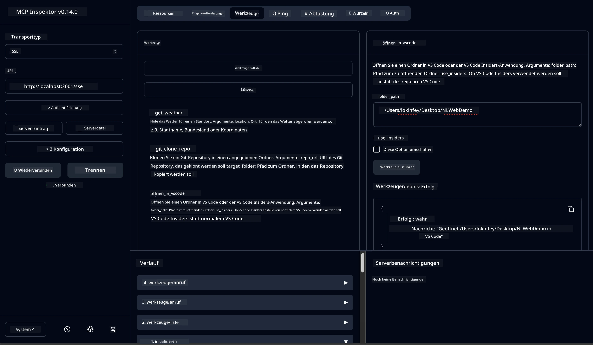

# 🐙 Modul 4: Praktische MCP-Entwicklung – Benutzerdefinierter GitHub-Klonserver


> **⚡ Schnellstart:** Erstelle in nur 30 Minuten einen produktionsreifen MCP-Server, der das Klonen von GitHub-Repositories und die VS Code-Integration automatisiert!

## 🎯 Lernziele

Am Ende dieses Labs wirst du in der Lage sein:

- ✅ Einen benutzerdefinierten MCP-Server für reale Entwicklungs-Workflows zu erstellen
- ✅ Die Funktionalität zum Klonen von GitHub-Repositories über MCP zu implementieren
- ✅ Benutzerdefinierte MCP-Server mit VS Code und Agent Builder zu integrieren
- ✅ GitHub Copilot Agent Mode mit benutzerdefinierten MCP-Tools zu verwenden
- ✅ Benutzerdefinierte MCP-Server in Produktionsumgebungen zu testen und bereitzustellen

## 📋 Voraussetzungen

- Abschluss der Labs 1-3 (MCP-Grundlagen und fortgeschrittene Entwicklung)
- GitHub Copilot-Abonnement ([kostenlose Anmeldung verfügbar](https://github.com/github-copilot/signup))
- VS Code mit AI Toolkit und GitHub Copilot-Erweiterungen
- Installiertes und konfiguriertes Git CLI

## 🏗️ Projektübersicht

### **Reale Entwicklungsherausforderung**
Als Entwickler verwenden wir häufig GitHub, um Repositories zu klonen und in VS Code oder VS Code Insiders zu öffnen. Dieser manuelle Prozess umfasst:
1. Öffnen des Terminals/der Eingabeaufforderung
2. Navigieren zum gewünschten Verzeichnis
3. Ausführen des Befehls `git clone`
4. Öffnen von VS Code im geklonten Verzeichnis

**Unsere MCP-Lösung fasst das in einen einzigen intelligenten Befehl zusammen!**

### **Was du bauen wirst**
Ein **GitHub Clone MCP Server** (`git_mcp_server`), der Folgendes bietet:

| Funktion | Beschreibung | Vorteil |
|---------|-------------|---------|
| 🔄 **Intelligentes Repository-Klonen** | Klont GitHub-Repos mit Validierung | Automatisierte Fehlerüberprüfung |
| 📁 **Intelligentes Verzeichnismanagement** | Prüft und erstellt Verzeichnisse sicher | Verhindert Überschreiben |
| 🚀 **Plattformübergreifende VS Code-Integration** | Öffnet Projekte in VS Code/Insiders | Nahtloser Workflow-Übergang |
| 🛡️ **Robuste Fehlerbehandlung** | Handhabt Netzwerk-, Berechtigungs- und Pfadprobleme | Produktionsreife Zuverlässigkeit |

---

## 📖 Schritt-für-Schritt-Implementierung

### Schritt 1: GitHub-Agent im Agent Builder erstellen

1. **Starte Agent Builder** über die AI Toolkit-Erweiterung
2. **Erstelle einen neuen Agenten** mit folgender Konfiguration:
   ```
   Agent Name: GitHubAgent
   ```

3. **Initialisiere benutzerdefinierten MCP-Server:**
   - Navigiere zu **Tools** → **Add Tool** → **MCP Server**
   - Wähle **"Create A new MCP Server"**
   - Wähle die **Python-Vorlage** für maximale Flexibilität
   - **Servername:** `git_mcp_server`

### Schritt 2: GitHub Copilot Agent Mode konfigurieren

1. **Öffne GitHub Copilot** in VS Code (Strg/Cmd + Shift + P → "GitHub Copilot: Open")
2. **Wähle Agent Model** in der Copilot-Oberfläche
3. **Wähle das Modell Claude 3.7** für erweiterte Ableitungsfähigkeiten
4. **Aktiviere MCP-Integration** für Tool-Zugriff

> **💡 Profi-Tipp:** Claude 3.7 bietet eine überlegene Verständnisfähigkeit für Entwicklungs-Workflows und Fehlerbehandlungsmuster.

### Schritt 3: Kernfunktionalität des MCP-Servers implementieren

**Verwende den folgenden detaillierten Prompt mit GitHub Copilot Agent Mode:**

```
Create two MCP tools with the following comprehensive requirements:

🔧 TOOL A: clone_repository
Requirements:
- Clone any GitHub repository to a specified local folder
- Return the absolute path of the successfully cloned project
- Implement comprehensive validation:
  ✓ Check if target directory already exists (return error if exists)
  ✓ Validate GitHub URL format (https://github.com/user/repo)
  ✓ Verify git command availability (prompt installation if missing)
  ✓ Handle network connectivity issues
  ✓ Provide clear error messages for all failure scenarios

🚀 TOOL B: open_in_vscode
Requirements:
- Open specified folder in VS Code or VS Code Insiders
- Cross-platform compatibility (Windows/Linux/macOS)
- Use direct application launch (not terminal commands)
- Auto-detect available VS Code installations
- Handle cases where VS Code is not installed
- Provide user-friendly error messages

Additional Requirements:
- Follow MCP 1.9.3 best practices
- Include proper type hints and documentation
- Implement logging for debugging purposes
- Add input validation for all parameters
- Include comprehensive error handling
```

### Schritt 4: Teste deinen MCP-Server

#### 4a. Test im Agent Builder

1. **Starte die Debug-Konfiguration** für Agent Builder
2. **Konfiguriere deinen Agenten mit diesem System-Prompt:**

```
SYSTEM_PROMPT:
You are my intelligent coding repository assistant. You help developers efficiently clone GitHub repositories and set up their development environment. Always provide clear feedback about operations and handle errors gracefully.
```

3. **Teste mit realistischen Benutzerszenarien:**

```
USER_PROMPT EXAMPLES:

Scenario : Basic Clone and Open
"Clone {Your GitHub Repo link such as https://github.com/kinfey/GHCAgentWorkshop
 } and save to {The global path you specify}, then open it with VS Code Insiders"
```



**Erwartete Ergebnisse:**
- ✅ Erfolgreiches Klonen mit Pfadbestätigung
- ✅ Automatischer VS Code-Start
- ✅ Klare Fehlermeldungen bei ungültigen Szenarien
- ✅ Korrekte Behandlung von Randfällen

#### 4b. Test im MCP Inspector




---


**🎉 Herzlichen Glückwunsch!** Du hast erfolgreich einen praktischen, produktionsreifen MCP-Server erstellt, der reale Herausforderungen im Entwicklungsworkflow löst. Dein benutzerdefinierter GitHub-Klonserver zeigt die Leistungsfähigkeit von MCP zur Automatisierung und Verbesserung der Entwicklerproduktivität.

### 🏆 Errungenschaft freigeschaltet:
- ✅ **MCP-Entwickler** – Benutzerdefinierten MCP-Server erstellt
- ✅ **Workflow-Automatisierer** – Entwicklungsprozesse optimiert  
- ✅ **Integrations-Experte** – Mehrere Entwicklungstools verbunden
- ✅ **Produktionsreif** – Bereitstellbare Lösungen entwickelt

---

## 🎓 Workshop-Abschluss: Deine Reise mit Model Context Protocol

**Liebe Workshop-Teilnehmerin, lieber Workshop-Teilnehmer,**

herzlichen Glückwunsch zum Abschluss aller vier Module des Model Context Protocol Workshops! Du hast einen großen Weg zurückgelegt – vom Verstehen grundlegender AI Toolkit-Konzepte bis zum Erstellen produktionsreifer MCP-Server, die reale Entwicklungs-Herausforderungen lösen.

### 🚀 Rückblick auf deinen Lernweg:

**[Modul 1](../lab1/README.md)**: Du hast mit den Grundlagen des AI Toolkits, Modelltests und dem Erstellen deines ersten AI-Agenten begonnen.

**[Modul 2](../lab2/README.md)**: Du hast MCP-Architektur kennengelernt, Playwright MCP integriert und deinen ersten Browserautomatisierungs-Agenten gebaut.

**[Modul 3](../lab3/README.md)**: Du bist zu benutzerdefinierter MCP-Serverentwicklung mit dem Weather MCP Server übergegangen und hast Debugging-Tools beherrscht.

**[Modul 4](../lab4/README.md)**: Jetzt hast du alles angewandt, um ein praktisches Automatisierungstool für GitHub-Repository-Workflows zu erstellen.

### 🌟 Was du gemeistert hast:

- ✅ **AI Toolkit-Ökosystem**: Modelle, Agenten und Integrationsmuster
- ✅ **MCP-Architektur**: Client-Server-Design, Transportprotokolle und Sicherheit
- ✅ **Entwicklertools**: Vom Playground über Inspector bis zur Produktionsbereitstellung
- ✅ **Benutzerdefinierte Entwicklung**: Erstellen, Testen und Bereitstellen eigener MCP-Server
- ✅ **Praktische Anwendungen**: Lösung realer Workflow-Herausforderungen mit KI

### 🔮 Deine nächsten Schritte:

1. **Baue deinen eigenen MCP-Server**: Wende diese Fähigkeiten an, um deine individuellen Workflows zu automatisieren
2. **Tritt der MCP-Community bei**: Teile deine Kreationen und lerne von anderen
3. **Erkunde erweiterte Integration**: Verbinde MCP-Server mit Unternehmenssystemen
4. **Trage zu Open Source bei**: Hilf, MCP-Tools und Dokumentation zu verbessern

Denke daran, dieser Workshop ist erst der Anfang. Das Model Context Protocol-Ökosystem entwickelt sich schnell weiter, und du bist jetzt gut gerüstet, um an der Spitze KI-gestützter Entwicklungstools zu stehen.

**Vielen Dank für deine Teilnahme und dein Engagement beim Lernen!**

Wir hoffen, dieser Workshop hat Ideen geweckt, wie du KI-Tools in deinem Entwicklungsprozess neu gestalten und nutzen kannst.

**Viel Erfolg beim Programmieren!**

---

## Was kommt als Nächstes

Herzlichen Glückwunsch zum Abschluss aller Labs im Modul 10!

- Zurück zu: [Modul 10 Übersicht](../README.md)
- Weiter zu: [Modul 11: MCP Server Hands-On Labs](../../11-MCPServerHandsOnLabs/README.md)

---

<!-- CO-OP TRANSLATOR DISCLAIMER START -->
**Haftungsausschluss**:
Dieses Dokument wurde mit dem KI-Übersetzungsdienst [Co-op Translator](https://github.com/Azure/co-op-translator) übersetzt. Obwohl wir uns um Genauigkeit bemühen, können automatisierte Übersetzungen Fehler oder Ungenauigkeiten enthalten. Das Originaldokument in der Ausgangssprache gilt als maßgebliche Quelle. Für kritische Informationen wird eine professionelle menschliche Übersetzung empfohlen. Wir übernehmen keine Haftung für Missverständnisse oder Fehlinterpretationen, die aus der Nutzung dieser Übersetzung entstehen.
<!-- CO-OP TRANSLATOR DISCLAIMER END -->