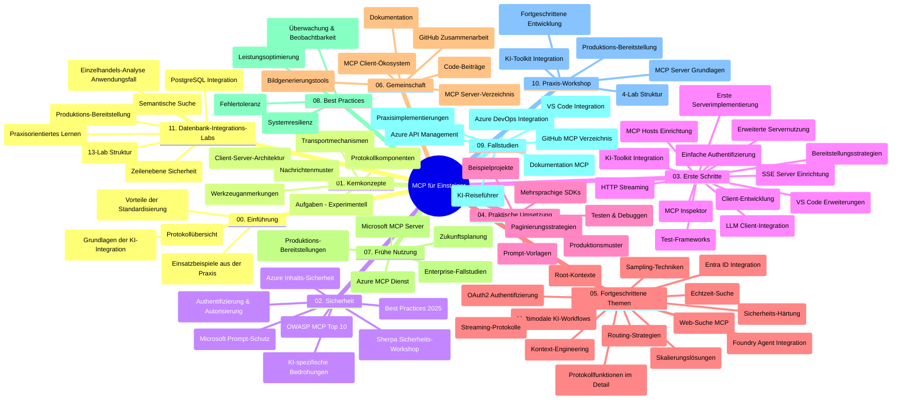

# Model Context Protocol (MCP) für Einsteiger – Lernleitfaden

Dieser Lernleitfaden bietet einen Überblick über die Repository-Struktur und den Inhalt des Lehrplans "Model Context Protocol (MCP) für Einsteiger". Verwenden Sie diesen Leitfaden, um sich effizient im Repository zurechtzufinden und die verfügbaren Ressourcen optimal zu nutzen.

## Überblick über das Repository

Das Model Context Protocol (MCP) ist ein standardisierter Rahmen für die Interaktionen zwischen KI-Modellen und Client-Anwendungen. Ursprünglich von Anthropic erstellt, wird MCP nun von der breiteren MCP-Community über die offizielle GitHub-Organisation gepflegt. Dieses Repository bietet einen umfassenden Lehrplan mit praktischen Codebeispielen in C#, Java, JavaScript, Python und TypeScript, der sich an KI-Entwickler, Systemarchitekten und Softwareingenieure richtet.

## Visuelle Lehrplan-Übersicht

## Repository-Struktur

Das Repository ist in elf Hauptabschnitte gegliedert, die jeweils unterschiedliche Aspekte von MCP behandeln:

1. **Einführung (00-Introduction/)**
   - Überblick über das Model Context Protocol
   - Warum Standardisierung in KI-Pipelines wichtig ist
   - Praktische Anwendungsfälle und Vorteile

2. **Kernkonzepte (01-CoreConcepts/)**
   - Client-Server-Architektur
   - Wichtige Protokollkomponenten
   - Nachrichtenmuster im MCP

3. **Sicherheit (02-Security/)**
   - Sicherheitsbedrohungen in MCP-basierten Systemen
   - Best Practices zur Sicherung von Implementierungen
   - Authentifizierungs- und Autorisierungsstrategien
   - **Umfassende Sicherheitsdokumentation**:
     - MCP Sicherheits-Best Practices 2025
     - Azure Content Safety Implementierungsleitfaden
     - MCP Sicherheitskontrollen und Techniken
     - MCP Best Practices Schnellreferenz
   - **Wichtige Sicherheitsthemen**:
     - Prompt Injection und Werkzeugvergiftungsangriffe
     - Session Hijacking und Confused Deputy Probleme
     - Token-Passthrough-Schwachstellen
     - Übermäßige Berechtigungen und Zugriffskontrolle
     - Lieferkettensicherheit für KI-Komponenten
     - Integration von Microsoft Prompt Shields

4. **Erste Schritte (03-GettingStarted/)**
   - Einrichtung und Konfiguration der Umgebung
   - Erstellung einfacher MCP-Server und -Clients
   - Integration in bestehende Anwendungen
   - Enthält Abschnitte für:
     - Erste Server-Implementierung
     - Client-Entwicklung
     - LLM-Client-Integration
     - VS Code Integration
     - Server-Sent Events (SSE) Server
     - Fortgeschrittene Server-Nutzung
     - HTTP-Streaming
     - AI Toolkit Integration
     - Teststrategien
     - Bereitstellungsrichtlinien

5. **Praktische Umsetzung (04-PracticalImplementation/)**
   - Nutzung von SDKs in verschiedenen Programmiersprachen
   - Debugging-, Test- und Validierungstechniken
   - Erstellung wiederverwendbarer Prompt-Vorlagen und Workflows
   - Beispielprojekte mit Implementierungsbeispielen

6. **Fortgeschrittene Themen (05-AdvancedTopics/)**
   - Kontext-Engineering-Techniken
   - Foundry-Agent-Integration
   - Multimodale KI-Workflows
   - OAuth2-Authentifizierungs-Demos
   - Echtzeitsuche-Funktionalitäten
   - Echtzeit-Streaming
   - Root-Context-Implementierung
   - Routing-Strategien
   - Sampling-Techniken
   - Skalierungsansätze
   - Sicherheitsaspekte
   - Entra ID Sicherheitseinbindung
   - Web-Suche Integration

7. **Community-Beiträge (06-CommunityContributions/)**
   - Wie man Code und Dokumentation beiträgt
   - Zusammenarbeit über GitHub
   - Community-getriebene Verbesserungen und Feedback
   - Nutzung verschiedener MCP-Clients (Claude Desktop, Cline, VSCode)
   - Arbeiten mit populären MCP-Servern inklusive Bildgenerierung

8. **Lernerfahrungen aus frühem Einsatz (07-LessonsfromEarlyAdoption/)**
   - Realwelt-Implementierungen und Erfolgsgeschichten
   - Aufbau und Bereitstellung von MCP-basierten Lösungen
   - Trends und zukünftige Roadmap
   - **Microsoft MCP Server Guide**: Umfassender Leitfaden zu 10 produktionsreifen Microsoft MCP Servern, inklusive:
     - Microsoft Learn Docs MCP Server
     - Azure MCP Server (15+ spezialisierte Konnektoren)
     - GitHub MCP Server
     - Azure DevOps MCP Server
     - MarkItDown MCP Server
     - SQL Server MCP Server
     - Playwright MCP Server
     - Dev Box MCP Server
     - Azure AI Foundry MCP Server
     - Microsoft 365 Agents Toolkit MCP Server

9. **Best Practices (08-BestPractices/)**
   - Leistungsoptimierung und Tuning
   - Design von fehlertoleranten MCP-Systemen
   - Test- und Resilienzstrategien

10. **Fallstudien (09-CaseStudy/)**
    - **Sieben umfassende Fallstudien**, die die Vielseitigkeit von MCP in unterschiedlichen Szenarien zeigen:
    - **Azure AI Travel Agents**: Multi-Agent-Orchestrierung mit Azure OpenAI und AI Search
    - **Azure DevOps Integration**: Automatisierung von Workflow-Prozessen mit YouTube-Datenupdates
    - **Echtzeit-Dokumentationsabruf**: Python-Konsolen-Client mit Streaming-HTTP
    - **Interaktiver Studienplan-Generator**: Chainlit Web-App mit konversationaler KI
    - **In-Editor-Dokumentation**: VS Code Integration mit GitHub Copilot Workflows
    - **Azure API Management**: Unternehmens-API-Integration mit MCP-Server-Erstellung
    - **GitHub MCP Registry**: Ökosystementwicklung und agentische Integrationsplattform
    - Implementierungsbeispiele für Unternehmensintegration, Entwicklerproduktivität und Ökosystementwicklung

11. **Praktischer Workshop (10-StreamliningAIWorkflowsBuildingAnMCPServerWithAIToolkit/)**
    - Umfassender praktischer Workshop zur Kombination von MCP mit AI Toolkit
    - Aufbau intelligenter Anwendungen, die KI-Modelle mit realen Werkzeugen verbinden
    - Praktische Module zu Grundlagen, kundenspezifischer Serverentwicklung und Produktionsbereitstellung
    - **Lab-Aufbau**:
      - Lab 1: MCP Server Grundlagen
      - Lab 2: Fortgeschrittene MCP Server Entwicklung
      - Lab 3: AI Toolkit Integration
      - Lab 4: Produktionsbereitstellung und Skalierung
    - Lab-basierter Lernansatz mit Schritt-für-Schritt-Anleitungen

12. **MCP Server Datenbank-Integrations-Labs (11-MCPServerHandsOnLabs/)**
    - **Umfassender 13-Lab-Lernpfad** zum Aufbau produktionsreifer MCP-Server mit PostgreSQL-Integration
    - **Realwelt-Einzelhandelsanalyse-Implementierung** am Beispiel des Zava Retail Use Cases
    - **Enterprise-Grade Patterns** einschließlich Row Level Security (RLS), semantischer Suche und mandantenfähigem Datenzugriff
    - **Kompletter Lab-Aufbau**:
      - **Labs 00-03: Grundlagen** – Einführung, Architektur, Sicherheit, Umgebungsaufbau
      - **Labs 04-06: Aufbau des MCP-Servers** – Datenbank-Design, MCP Server Implementierung, Tool-Entwicklung
      - **Labs 07-09: Erweiterte Funktionen** – Semantische Suche, Testen & Debugging, VS Code Integration
      - **Labs 10-12: Produktion & Best Practices** – Bereitstellung, Monitoring, Optimierung
    - **Abgedeckte Technologien**: FastMCP Framework, PostgreSQL, Azure OpenAI, Azure Container Apps, Application Insights
    - **Lernergebnisse**: Produktionsreife MCP-Server, Datenbank-Integrationsmuster, KI-gestützte Analysen, Unternehmenssicherheit

## Zusätzliche Ressourcen

Das Repository enthält unterstützende Ressourcen:

- **Bilder-Ordner**: Enthält Diagramme und Illustrationen, die im gesamten Lehrplan verwendet werden
- **Übersetzungen**: Mehrsprachige Unterstützung mit automatisierten Übersetzungen der Dokumentation
- **Offizielle MCP-Ressourcen**:
  - [MCP Dokumentation](https://modelcontextprotocol.io/)
  - [MCP Spezifikation](https://spec.modelcontextprotocol.io/)
  - [MCP GitHub Repository](https://github.com/modelcontextprotocol)

## Wie man dieses Repository nutzt

1. **Sequenzielles Lernen**: Folgen Sie den Kapiteln in der Reihenfolge (00 bis 11) für ein strukturiertes Lernerlebnis.
2. **Sprachspezifischer Fokus**: Wenn Sie an einer bestimmten Programmiersprache interessiert sind, erkunden Sie die Samples-Verzeichnisse für Implementierungen in Ihrer bevorzugten Sprache.
3. **Praktische Umsetzung**: Beginnen Sie mit dem Abschnitt "Erste Schritte", um Ihre Umgebung einzurichten und Ihren ersten MCP-Server und -Client zu erstellen.
4. **Fortgeschrittene Erkundung**: Sobald Sie mit den Grundlagen vertraut sind, tauchen Sie in die fortgeschrittenen Themen ein, um Ihr Wissen zu erweitern.
5. **Community-Engagement**: Treten Sie der MCP-Community über GitHub-Diskussionen und Discord-Kanäle bei, um sich mit Experten und anderen Entwicklern zu vernetzen.

## MCP-Clients und Tools

Der Lehrplan behandelt verschiedene MCP-Clients und Tools:

1. **Offizielle Clients**:
   - Visual Studio Code
   - MCP in Visual Studio Code
   - Claude Desktop
   - Claude in VSCode
   - Claude API

2. **Community-Clients**:
   - Cline (terminalbasiert)
   - Cursor (Code-Editor)
   - ChatMCP
   - Windsurf

3. **MCP Verwaltungstools**:
   - MCP CLI
   - MCP Manager
   - MCP Linker
   - MCP Router

## Beliebte MCP-Server

Das Repository stellt verschiedene MCP-Server vor, darunter:

1. **Offizielle Microsoft MCP Server**:
   - Microsoft Learn Docs MCP Server
   - Azure MCP Server (15+ spezialisierte Konnektoren)
   - GitHub MCP Server
   - Azure DevOps MCP Server
   - MarkItDown MCP Server
   - SQL Server MCP Server
   - Playwright MCP Server
   - Dev Box MCP Server
   - Azure AI Foundry MCP Server
   - Microsoft 365 Agents Toolkit MCP Server

2. **Offizielle Referenzserver**:
   - Filesystem
   - Fetch
   - Memory
   - Sequential Thinking

3. **Bildgenerierung**:
   - Azure OpenAI DALL-E 3
   - Stable Diffusion WebUI
   - Replicate

4. **Entwicklertools**:
   - Git MCP
   - Terminal Control
   - Code Assistant

5. **Spezialisierte Server**:
   - Salesforce
   - Microsoft Teams
   - Jira & Confluence

## Beiträge

Dieses Repository freut sich über Beiträge aus der Community. Siehe den Abschnitt Community-Beiträge für Hinweise, wie man effektiv zum MCP-Ökosystem beiträgt.

----

*Dieser Lernleitfaden wurde zuletzt am 5. Februar 2026 aktualisiert und spiegelt die neueste MCP Spezifikation vom 25.11.2025 wider sowie den Stand des Repositories zu diesem Datum. Der Repository-Inhalt kann nach diesem Datum aktualisiert werden.*

---

<!-- CO-OP TRANSLATOR DISCLAIMER START -->
**Haftungsausschluss**:  
Dieses Dokument wurde mit dem KI-Übersetzungsdienst [Co-op Translator](https://github.com/Azure/co-op-translator) übersetzt. Obwohl wir uns um Genauigkeit bemühen, können automatisierte Übersetzungen Fehler oder Ungenauigkeiten enthalten. Das Originaldokument in der jeweiligen Ursprungssprache gilt als maßgebliche Quelle. Für wichtige Informationen wird eine professionelle menschliche Übersetzung empfohlen. Wir übernehmen keine Haftung für Missverständnisse oder Fehlinterpretationen, die aus der Verwendung dieser Übersetzung entstehen.
<!-- CO-OP TRANSLATOR DISCLAIMER END -->