# Εισαγωγή στο Πρωτόκολλο Πλαισίου Μοντέλου (MCP): Γιατί Είναι Σημαντικό για Εφαρμογές Τεχνητής Νοημοσύνης με Κλιμάκωση

[](https://youtu.be/agBbdiOPLQA)

_(Κάντε κλικ στην παραπάνω εικόνα για να δείτε το βίντεο αυτού του μαθήματος)_

Οι εφαρμογές γεννητικής τεχνητής νοημοσύνης αποτελούν ένα μεγάλο βήμα μπροστά καθώς συχνά επιτρέπουν στον χρήστη να αλληλεπιδρά με την εφαρμογή χρησιμοποιώντας φυσικές γλωσσικές εντολές. Ωστόσο, καθώς επενδύεται περισσότερος χρόνος και πόροι σε τέτοιες εφαρμογές, θέλετε να βεβαιωθείτε ότι μπορείτε εύκολα να ενσωματώσετε λειτουργίες και πόρους με τρόπο που να είναι εύκολο να επεκταθεί, ότι η εφαρμογή σας μπορεί να εξυπηρετήσει περισσότερα από ένα μοντέλα που χρησιμοποιούνται, και να διαχειριστεί διάφορες ιδιομορφίες των μοντέλων. Με λίγα λόγια, το χτίσιμο των εφαρμογών γεννητικής AI είναι εύκολο στην αρχή, αλλά καθώς αυτές μεγαλώνουν και γίνονται πιο πολύπλοκες, πρέπει να αρχίσετε να ορίζετε μια αρχιτεκτονική και πιθανόν να χρειαστεί να βασιστείτε σε ένα πρότυπο για να διασφαλίσετε ότι οι εφαρμογές σας χτίζονται με συνεπή τρόπο. Εδώ έρχεται το MCP για να οργανώσει τα πράγματα και να παρέχει ένα πρότυπο.

---

## **🔍 Τι Είναι το Πρωτόκολλο Πλαισίου Μοντέλου (MCP);**

Το **Πρωτόκολλο Πλαισίου Μοντέλου (MCP)** είναι ένα **ανοικτό, τυποποιημένο περιβάλλον διεπαφής** που επιτρέπει στα Μεγάλα Μοντέλα Γλώσσας (LLMs) να αλληλεπιδρούν απρόσκοπτα με εξωτερικά εργαλεία, APIs και πηγές δεδομένων. Παρέχει μια συνεπή αρχιτεκτονική για να ενισχύσει τη λειτουργικότητα των μοντέλων AI πέρα από τα δεδομένα εκπαίδευσής τους, επιτρέποντας πιο έξυπνα, κλιμακούμενα και πιο ανταποκρινόμενα συστήματα AI.

---

## **🎯 Γιατί η Τυποποίηση στην Τεχνητή Νοημοσύνη Έχει Σημασία**

Καθώς οι εφαρμογές γεννητικής AI γίνονται πιο πολύπλοκες, είναι απαραίτητο να υιοθετηθούν πρότυπα που διασφαλίζουν **κλιμάκωση, επεκτασιμότητα, διαχειρισιμότητα** και **αποφυγή εξάρτησης από συγκεκριμένους προμηθευτές**. Το MCP ανταποκρίνεται σε αυτές τις ανάγκες:

- Ενοποιώντας τις ενσωματώσεις μοντέλου-εργαλείου
- Μειώνοντας τις εύθραυστες, ειδικές λύσεις κατά παραγγελία
- Επιτρέποντας σε πολλαπλά μοντέλα από διαφορετικούς προμηθευτές να συνυπάρξουν σε ένα οικοσύστημα

**Σημείωση:** Παρόλο που το MCP προωθείται ως ανοιχτό πρότυπο, δεν υπάρχουν σχέδια να τυποποιηθεί μέσω υπαρχόντων οργανισμών προτύπων όπως IEEE, IETF, W3C, ISO ή οποιουδήποτε άλλου οργανισμού προτύπων.

---

## **📚 Μαθησιακοί Στόχοι**

Στο τέλος αυτού του άρθρου, θα μπορείτε να:

- Ορίσετε το **Πρωτόκολλο Πλαισίου Μοντέλου (MCP)** και τις περιπτώσεις χρήσης του
- Κατανοήσετε πώς το MCP τυποποιεί την επικοινωνία μοντέλου-εργαλείου
- Αναγνωρίζετε τα βασικά στοιχεία της αρχιτεκτονικής MCP
- Διερευνήσετε πραγματικές εφαρμογές του MCP σε επιχειρήσεις και περιβάλλοντα ανάπτυξης

---

## **💡 Γιατί το Πρωτόκολλο Πλαισίου Μοντέλου (MCP) Αποτελεί Ρήγμα στην Τεχνητή Νοημοσύνη**

### **🔗 Το MCP Λύνει τη Διάσπαση στις Αλληλεπιδράσεις AI**

Πριν το MCP, η ενσωμάτωση μοντέλων με εργαλεία απαιτούσε:

- Ειδικό κώδικα για κάθε ζεύγος μοντέλο-εργαλείο
- Μη τυποποιημένα APIs για κάθε προμηθευτή
- Συχνές αποσυνδέσεις λόγω ενημερώσεων
- Κακή κλιμακωσιμότητα με πληθώρα εργαλείων

### **✅ Οφέλη της Τυποποίησης MCP**

| **Όφελος**               | **Περιγραφή**                                                                 |
|--------------------------|-------------------------------------------------------------------------------|
| Διαλειτουργικότητα       | Τα LLM συνεργάζονται απρόσκοπτα με εργαλεία από διαφορετικούς προμηθευτές    |
| Συνοχή                   | Ομοιόμορφη λειτουργία σε πλατφόρμες και εργαλεία                            |
| Επαναχρησιμοποίηση       | Εργαλεία που δημιουργούνται μία φορά μπορούν να χρησιμοποιηθούν παντού        |
| Επιτάχυνση Ανάπτυξης     | Μείωση χρόνου ανάπτυξης με τυποποιημένες, plug-and-play διεπαφές            |

---

## **🧱 Επισκόπηση Αρχιτεκτονικής MCP Υψηλού Επιπέδου**

Το MCP ακολουθεί ένα **μοντέλο πελάτη-διακομιστή**, όπου:

- **MCP Hosts** τρέχουν τα μοντέλα AI  
- **MCP Clients** ξεκινούν αιτήματα  
- **MCP Servers** παρέχουν πλαίσιο, εργαλεία και δυνατότητες  

### **Κύρια Στοιχεία:**

- **Πόροι** – Στατικά ή δυναμικά δεδομένα για τα μοντέλα  
- **Προτροπές** – Προκαθορισμένες ροές εργασίας για καθοδηγούμενη δημιουργία  
- **Εργαλεία** – Εκτελέσιμες λειτουργίες όπως αναζήτηση, υπολογισμοί  
- **Δειγματοληψία** – Συμπεριφορά αντιπροσώπου μέσω επαναληπτικών αλληλεπιδράσεων  
- **Επιστράτευση** – Αιτήματα που ξεκινούν οι διακομιστές για εισαγωγή χρήστη  
- **Ρίζες** – Όρια στο σύστημα αρχείων για έλεγχο πρόσβασης διακομιστή  

### **Αρχιτεκτονική Πρωτοκόλλου:**

Το MCP χρησιμοποιεί μια διπλή στρώση αρχιτεκτονικής:  
- **Στρώση Δεδομένων**: Επικοινωνία βασισμένη σε JSON-RPC 2.0 με διαχείριση κύκλου ζωής και βασικές λειτουργίες  
- **Στρώση Μεταφοράς**: Κανάλια επικοινωνίας STDIO (τοπικά) και HTTP ροής με SSE (από μακριά)  

---

## Πώς Λειτουργούν οι MCP Servers

Οι MCP servers λειτουργούν ως εξής:

- **Ροή Αιτήματος**:  
    1. Ένα αίτημα ξεκινά από έναν τελικό χρήστη ή λογισμικό που ενεργεί εκ μέρους του.  
    2. Ο **MCP Client** στέλνει το αίτημα σε έναν **MCP Host**, που διαχειρίζεται το περιβάλλον εκτέλεσης του μοντέλου AI.  
    3. Το **Μοντέλο AI** λαμβάνει την προτροπή χρήστη και μπορεί να ζητήσει πρόσβαση σε εξωτερικά εργαλεία ή δεδομένα μέσω ενός ή περισσοτέρων καλών εργαλείων.  
    4. Ο **MCP Host**, όχι το μοντέλο άμεσα, επικοινωνεί με τον κατάλληλο **MCP Server(ους)** χρησιμοποιώντας το τυποποιημένο πρωτόκολλο.  
- **Λειτουργικότητα MCP Host**:  
    - **Μητρώο Εργαλείων**: Διατηρεί κατάλογο διαθέσιμων εργαλείων και δυνατοτήτων τους.  
    - **Πιστοποίηση**: Επαληθεύει δικαιώματα για πρόσβαση σε εργαλεία.  
    - **Διαχειριστής Αιτημάτων**: Επεξεργάζεται εισερχόμενα αιτήματα εργαλείων από το μοντέλο.  
    - **Μορφοποιητής Απαντήσεων**: Δομεί τα αποτελέσματα των εργαλείων σε μορφή που κατανοεί το μοντέλο.  
- **Εκτέλεση MCP Server**:  
    - Ο **MCP Host** προωθεί κλήσεις εργαλείων σε έναν ή περισσότερους **MCP Servers**, καθένας από τους οποίους εκθέτει εξειδικευμένες λειτουργίες (π.χ. αναζήτηση, υπολογισμοί, ερωτήματα βάσης δεδομένων).  
    - Οι **MCP Servers** εκτελούν αντίστοιχες λειτουργίες και επιστρέφουν τα αποτελέσματα στον **MCP Host** σε συνεπή μορφή.  
    - Ο **MCP Host** μορφοποιεί και προωθεί αυτά τα αποτελέσματα στο **Μοντέλο AI**.  
- **Ολοκλήρωση Απάντησης**:  
    - Το **Μοντέλο AI** ενσωματώνει τα αποτελέσματα εργαλείων σε μια τελική απάντηση.  
    - Ο **MCP Host** στέλνει αυτή την απάντηση πίσω στον **MCP Client**, που τη διανέμει στον τελικό χρήστη ή στο καλούν λογισμικό.  

```mermaid
---
title: Αρχιτεκτονική MCP και Αλληλεπιδράσεις Συνιστωσών
description: Ένα διάγραμμα που δείχνει τις ροές των συνιστωσών στο MCP.
---
graph TD
    Client[MCP Πελάτης/Εφαρμογή] -->|Στέλνει Αίτημα| H[MCP Φιλοξενητής]
    H -->|Εκτελεί| A[Μοντέλο AI]
    A -->|Αίτημα Κλήσης Εργαλείου| H
    H -->|Πρωτόκολλο MCP| T1[MCP Εργαλείο Διακομιστή 01: Αναζήτηση Web]
    H -->|Πρωτόκολλο MCP| T2[MCP Εργαλείο Διακομιστή 02: Εργαλείο Υπολογιστή]
    H -->|Πρωτόκολλο MCP| T3[MCP Εργαλείο Διακομιστή 03: Εργαλείο Πρόσβασης Βάσης Δεδομένων]
    H -->|Πρωτόκολλο MCP| T4[MCP Εργαλείο Διακομιστή 04: Εργαλείο Συστήματος Αρχείων]
    H -->|Στέλνει Απόκριση| Client

    subgraph "Συστατικά Φιλοξενητή MCP"
        H
        G[Μητρώο Εργαλείων]
        I[Πιστοποίηση]
        J[Διαχειριστής Αιτήματος]
        K[Μορφοποιητής Απόκρισης]
    end

    H <--> G
    H <--> I
    H <--> J
    H <--> K

    style A fill:#f9d5e5,stroke:#333,stroke-width:2px
    style H fill:#eeeeee,stroke:#333,stroke-width:2px
    style Client fill:#d5e8f9,stroke:#333,stroke-width:2px
    style G fill:#fffbe6,stroke:#333,stroke-width:1px
    style I fill:#fffbe6,stroke:#333,stroke-width:1px
    style J fill:#fffbe6,stroke:#333,stroke-width:1px
    style K fill:#fffbe6,stroke:#333,stroke-width:1px
    style T1 fill:#c2f0c2,stroke:#333,stroke-width:1px
    style T2 fill:#c2f0c2,stroke:#333,stroke-width:1px
    style T3 fill:#c2f0c2,stroke:#333,stroke-width:1px
    style T4 fill:#c2f0c2,stroke:#333,stroke-width:1px
```
    


## 👨‍💻 Πώς να Δημιουργήσετε έναν MCP Server (Με Παραδείγματα)

Οι MCP servers σας επιτρέπουν να επεκτείνετε τις δυνατότητες των LLM παρέχοντας δεδομένα και λειτουργικότητα.

Έτοιμοι να το δοκιμάσετε; Εδώ είναι SDKs γλωσσών και/ή στοίβας με παραδείγματα δημιουργίας απλών MCP servers σε διάφορες γλώσσες/στοίβες:

- **Python SDK**: https://github.com/modelcontextprotocol/python-sdk

- **TypeScript SDK**: https://github.com/modelcontextprotocol/typescript-sdk

- **Java SDK**: https://github.com/modelcontextprotocol/java-sdk

- **C#/.NET SDK**: https://github.com/modelcontextprotocol/csharp-sdk


## 🌍 Πραγματικές Περιπτώσεις Χρήσης για το MCP

Το MCP επιτρέπει ένα ευρύ φάσμα εφαρμογών επεκτείνοντας τις δυνατότητες AI:

| **Εφαρμογή**                 | **Περιγραφή**                                                                 |
|------------------------------|--------------------------------------------------------------------------------|
| Ενσωμάτωση Επιχειρησιακών Δεδομένων | Σύνδεση LLMs με βάσεις δεδομένων, CRM ή εσωτερικά εργαλεία                  |
| Συστήματα Αυτόνομων Πρακτόρων  | Ενεργοποίηση αυτόνομων πρακτόρων με πρόσβαση σε εργαλεία και ροές λήψης αποφάσεων   |
| Πολυτροπικές Εφαρμογές       | Συνδυασμός εργαλείων κειμένου, εικόνας και ήχου σε μία ενοποιημένη AI εφαρμογή      |
| Ενσωμάτωση Δεδομένων σε Πραγματικό Χρόνο | Φέρνει ζωντανά δεδομένα σε αλληλεπιδράσεις AI για πιο ακριβή και σύγχρονη έξοδο  |


### 🧠 MCP = Παγκόσμιο Πρότυπο για Αλληλεπιδράσεις AI

Το Πρωτόκολλο Πλαισίου Μοντέλου (MCP) λειτουργεί ως ένα παγκόσμιο πρότυπο για αλληλεπιδράσεις AI, όπως ακριβώς το USB-C τυποποίησε τις φυσικές συνδέσεις για συσκευές. Στον κόσμο της AI, το MCP παρέχει μια συνεπή διεπαφή, επιτρέποντας στα μοντέλα (πελάτες) να ενσωματώνονται απρόσκοπτα με εξωτερικά εργαλεία και παρόχους δεδομένων (διακομιστές). Αυτό εξαλείφει την ανάγκη για διάφορα, ειδικά πρωτόκολλα για κάθε API ή πηγή δεδομένων.

Υπό το MCP, ένα εργαλείο συμβατό με MCP (αναφερόμενο ως MCP server) ακολουθεί ένα ενιαίο πρότυπο. Αυτοί οι διακομιστές μπορούν να απαριθμούν τα εργαλεία ή τις ενέργειες που προσφέρουν και να εκτελούν αυτές τις ενέργειες όταν ζητούνται από έναν πράκτορα AI. Οι πλατφόρμες πρακτόρων AI που υποστηρίζουν MCP μπορούν να ανακαλύπτουν διαθέσιμα εργαλεία από τους διακομιστές και να τα καλούν μέσω αυτού του τυποποιημένου πρωτοκόλλου.

### 💡 Διευκολύνει την πρόσβαση στη γνώση

Πέρα από την προσφορά εργαλείων, το MCP διευκολύνει επίσης την πρόσβαση στη γνώση. Επιτρέπει στις εφαρμογές να παρέχουν πλαίσιο στα μεγάλα μοντέλα γλώσσας (LLMs) συνδέοντάς τα με διάφορες πηγές δεδομένων. Για παράδειγμα, ένας MCP server μπορεί να αντιπροσωπεύει το αποθετήριο εγγράφων μιας εταιρείας, επιτρέποντας στους πράκτορες να ανακτούν σχετικές πληροφορίες κατ’ απαίτηση. Άλλος διακομιστής μπορεί να διαχειρίζεται συγκεκριμένες ενέργειες, όπως αποστολή email ή ενημέρωση αρχείων. Από την οπτική γωνία του πράκτορα, αυτά είναι απλά εργαλεία που μπορεί να χρησιμοποιήσει — κάποια εργαλεία επιστρέφουν δεδομένα (πλαίσιο γνώσης), ενώ άλλα εκτελούν ενέργειες. Το MCP τα διαχειρίζεται αποδοτικά και τα δύο.

Ένας πράκτορας που συνδέεται σε έναν MCP server μαθαίνει αυτόματα τις διαθέσιμες δυνατότητες και δεδομένα που μπορεί να προσπελάσει μέσω ενός τυποποιημένου μορφοτύπου. Αυτή η τυποποίηση επιτρέπει δυναμική διαθεσιμότητα εργαλείων. Για παράδειγμα, η προσθήκη ενός νέου MCP server στο σύστημα ενός πράκτορα καθιστά τις λειτουργίες του άμεσα χρησιμοποιήσιμες χωρίς να απαιτείται περαιτέρω προσαρμογή των οδηγιών του πράκτορα.

Αυτή η απλοποιημένη ενσωμάτωση ευθυγραμμίζεται με τη ροή που απεικονίζεται στο παρακάτω διάγραμμα, όπου οι διακομιστές παρέχουν τόσο εργαλεία όσο και γνώση, διασφαλίζοντας απρόσκοπτη συνεργασία ανάμεσα στα συστήματα.

### 👉 Παράδειγμα: Λύση Κλιμακούμενου Πράκτορα

```mermaid
---
title: Λύση Κλιμακούμενου Πράκτορα με MCP
description: Ένα διάγραμμα που απεικονίζει πώς ο χρήστης αλληλεπιδρά με ένα LLM που συνδέεται με πολλούς διακομιστές MCP, όπου κάθε διακομιστής παρέχει τόσο γνώση όσο και εργαλεία, δημιουργώντας μια κλιμακούμενη αρχιτεκτονική συστήματος AI
---
graph TD
    User -->|Εφόδιο| LLM
    LLM -->|Απάντηση| User
    LLM -->|MCP| ServerA
    LLM -->|MCP| ServerB
    ServerA -->|Καθολικός σύνδεσμος| ServerB
    ServerA --> KnowledgeA
    ServerA --> ToolsA
    ServerB --> KnowledgeB
    ServerB --> ToolsB

    subgraph Server A
        KnowledgeA[Γνώση]
        ToolsA[Εργαλεία]
    end

    subgraph Server B
        KnowledgeB[Γνώση]
        ToolsB[Εργαλεία]
    end
```Ο Universal Connector επιτρέπει στους MCP servers να επικοινωνούν και να μοιράζονται δυνατότητες μεταξύ τους, επιτρέποντας στον ServerA να αναθέτει εργασίες στον ServerB ή να έχει πρόσβαση στα εργαλεία και τη γνώση του. Αυτό φέρνει ομοσπονδία εργαλείων και δεδομένων ανάμεσα στους διακομιστές, υποστηρίζοντας κλιμακούμενες και αρθρωτές αρχιτεκτονικές πρακτόρων. Επειδή το MCP τυποποιεί την έκθεση εργαλείων, οι πράκτορες μπορούν να ανακαλύπτουν δυναμικά και να διαδρομολογούν αιτήματα ανάμεσα στους διακομιστές χωρίς σκληρή κωδικοποίηση.

Ομοσπονδία εργαλείων και γνώσης: Τα εργαλεία και τα δεδομένα μπορούν να προσπελαστούν μέσω διακομιστών, επιτρέποντας πιο κλιμακούμενες και αρθρωτές αρχιτεκτονικές πρακτόρων.

### 🔄 Προχωρημένα Σενάρια MCP με Ενσωμάτωση LLM στην πλευρά του Πελάτη

Πέρα από την βασική αρχιτεκτονική MCP, υπάρχουν προχωρημένα σενάρια όπου τόσο ο πελάτης όσο και ο διακομιστής περιέχουν LLMs, επιτρέποντας πιο εξελιγμένες αλληλεπιδράσεις. Στο παρακάτω διάγραμμα, η **Εφαρμογή Πελάτη** θα μπορούσε να είναι ένα IDE με αριθμό εργαλείων MCP διαθέσιμα για χρήση από το LLM:

```mermaid
---
title: Προχωρημένα Σενάρια MCP με Ενσωμάτωση Client-Server LLM
description: Ένα διάγραμμα αλληλουχίας που δείχνει τη λεπτομερή ροή αλληλεπίδρασης μεταξύ χρήστη, εφαρμογής πελάτη, LLM πελάτη, πολλών διακομιστών MCP και LLM διακομιστή, απεικονίζοντας την ανακάλυψη εργαλείων, την αλληλεπίδραση με τον χρήστη, την άμεση κλήση εργαλείων και τις φάσεις διαπραγμάτευσης χαρακτηριστικών
---
sequenceDiagram
    autonumber
    actor User as 👤 Χρήστης
    participant ClientApp as 🖥️ Εφαρμογή Πελάτη
    participant ClientLLM as 🧠 LLM Πελάτη
    participant Server1 as 🔧 Διακομιστής MCP 1
    participant Server2 as 📚 Διακομιστής MCP 2
    participant ServerLLM as 🤖 LLM Διακομιστή
    
    %% Discovery Phase
    rect rgb(220, 240, 255)
        Note over ClientApp, Server2: ΦΑΣΗ ΑΝΑΚΑΛΥΨΗΣ ΕΡΓΑΛΕΙΩΝ
        ClientApp->>+Server1: Αίτημα διαθέσιμων εργαλείων/πόρων
        Server1-->>-ClientApp: Επιστροφή λίστας εργαλείων (JSON)
        ClientApp->>+Server2: Αίτημα διαθέσιμων εργαλείων/πόρων
        Server2-->>-ClientApp: Επιστροφή λίστας εργαλείων (JSON)
        Note right of ClientApp: Αποθήκευση συνδυασμένου<br/>καταλόγου εργαλείων τοπικά
    end
    
    %% User Interaction
    rect rgb(255, 240, 220)
        Note over User, ClientLLM: ΦΑΣΗ ΑΛΛΗΛΕΠΙΔΡΑΣΗΣ ΧΡΗΣΤΗ
        User->>+ClientApp: Εισαγωγή προτροπής με φυσική γλώσσα
        ClientApp->>+ClientLLM: Προώθηση προτροπής + κατάλογος εργαλείων
        ClientLLM->>-ClientLLM: Ανάλυση προτροπής & επιλογή εργαλείων
    end
    
    %% Scenario A: Direct Tool Calling
    alt Άμεση Κλήση Εργαλείων
        rect rgb(220, 255, 220)
            Note over ClientApp, Server1: ΣΕΝΑΡΙΟ Α: ΑΜΕΣΗ ΚΛΗΣΗ ΕΡΓΑΛΕΙΩΝ
            ClientLLM->>+ClientApp: Αίτημα εκτέλεσης εργαλείου
            ClientApp->>+Server1: Εκτέλεση συγκεκριμένου εργαλείου
            Server1-->>-ClientApp: Επιστροφή αποτελεσμάτων
            ClientApp->>+ClientLLM: Επεξεργασία αποτελεσμάτων
            ClientLLM-->>-ClientApp: Δημιουργία απάντησης
            ClientApp-->>-User: Εμφάνιση τελικής απάντησης
        end
    
    %% Scenario B: Feature Negotiation (VS Code style)
    else Διαπραγμάτευση Χαρακτηριστικών (Στυλ VS Code)
        rect rgb(255, 220, 220)
            Note over ClientApp, ServerLLM: ΣΕΝΑΡΙΟ Β: ΔΙΑΠΡΑΓΜΑΤΕΥΣΗ ΧΑΡΑΚΤΗΡΙΣΤΙΚΩΝ
            ClientLLM->>+ClientApp: Αναγνώριση απαιτούμενων δυνατοτήτων
            ClientApp->>+Server2: Διαπραγμάτευση χαρακτηριστικών/δυνατοτήτων
            Server2->>+ServerLLM: Αίτημα πρόσθετου πλαισίου
            ServerLLM-->>-Server2: Παροχή πλαισίου
            Server2-->>-ClientApp: Επιστροφή διαθέσιμων χαρακτηριστικών
            ClientApp->>+Server2: Κλήση διαπραγματευμένων εργαλείων
            Server2-->>-ClientApp: Επιστροφή αποτελεσμάτων
            ClientApp->>+ClientLLM: Επεξεργασία αποτελεσμάτων
            ClientLLM-->>-ClientApp: Δημιουργία απάντησης
            ClientApp-->>-User: Εμφάνιση τελικής απάντησης
        end
    end
```
## 🔐 Πρακτικά Οφέλη του MCP

Ακολουθούν τα πρακτικά οφέλη από τη χρήση του MCP:

- **Φρεσκάδα**: Τα μοντέλα μπορούν να λαμβάνουν ενημερωμένες πληροφορίες πέραν των δεδομένων εκπαίδευσής τους  
- **Επέκταση Δυνατοτήτων**: Τα μοντέλα μπορούν να αξιοποιούν εξειδικευμένα εργαλεία για εργασίες που δεν εκπαιδεύτηκαν  
- **Μείωση Παραισθήσεων**: Οι εξωτερικές πηγές δεδομένων παρέχουν αληθινή βάση  
- **Απόρρητο**: Ευαίσθητα δεδομένα μπορούν να παραμένουν σε ασφαλείς περιοχές αντί να ενσωματώνονται σε προτροπές  

## 📌 Κύρια Σημεία

Ακολουθούν τα κύρια σημεία σχετικά με τη χρήση του MCP:

- Το **MCP** τυποποιεί πώς τα μοντέλα AI αλληλεπιδρούν με εργαλεία και δεδομένα  
- Προωθεί **επεκτασιμότητα, συνοχή και διαλειτουργικότητα**  
- Το MCP βοηθά **να μειωθεί ο χρόνος ανάπτυξης, να βελτιωθεί η αξιοπιστία και να επεκταθούν οι δυνατότητες των μοντέλων**  
- Η αρχιτεκτονική πελάτη-διακομιστή **επιτρέπει ευέλικτες, επεκτάσιμες εφαρμογές AI**  

## 🧠 Άσκηση

Σκεφτείτε μια εφαρμογή AI που ενδιαφέρεστε να δημιουργήσετε.

- Ποια **εξωτερικά εργαλεία ή δεδομένα** θα μπορούσαν να ενισχύσουν τις δυνατότητές της;  
- Πώς το MCP μπορεί να κάνει την ενσωμάτωση **απλούστερη και πιο αξιόπιστη**;  

## Πρόσθετοι Πόροι

- [MCP GitHub Repository](https://github.com/modelcontextprotocol)


## Τι ακολουθεί

Επόμενο: [Κεφάλαιο 1: Βασικές Έννοιες](../01-CoreConcepts/README.md)

---

<!-- CO-OP TRANSLATOR DISCLAIMER START -->
**Αποποίηση ευθυνών**:  
Αυτό το έγγραφο έχει μεταφραστεί χρησιμοποιώντας την υπηρεσία μετάφρασης με Τεχνητή Νοημοσύνη [Co-op Translator](https://github.com/Azure/co-op-translator). Παρότι καταβάλλουμε προσπάθεια για ακρίβεια, παρακαλούμε να έχετε υπόψη ότι οι αυτόματες μεταφράσεις μπορεί να περιέχουν σφάλματα ή ανακρίβειες. Το πρωτότυπο έγγραφο στη γλώσσα του θεωρείται η έγκυρη πηγή. Για κρίσιμες πληροφορίες συνιστάται η επαγγελματική ανθρώπινη μετάφραση. Δεν φέρουμε ευθύνη για οποιεσδήποτε παρανοήσεις ή λανθασμένες ερμηνείες προκύψουν από τη χρήση αυτής της μετάφρασης.
<!-- CO-OP TRANSLATOR DISCLAIMER END -->