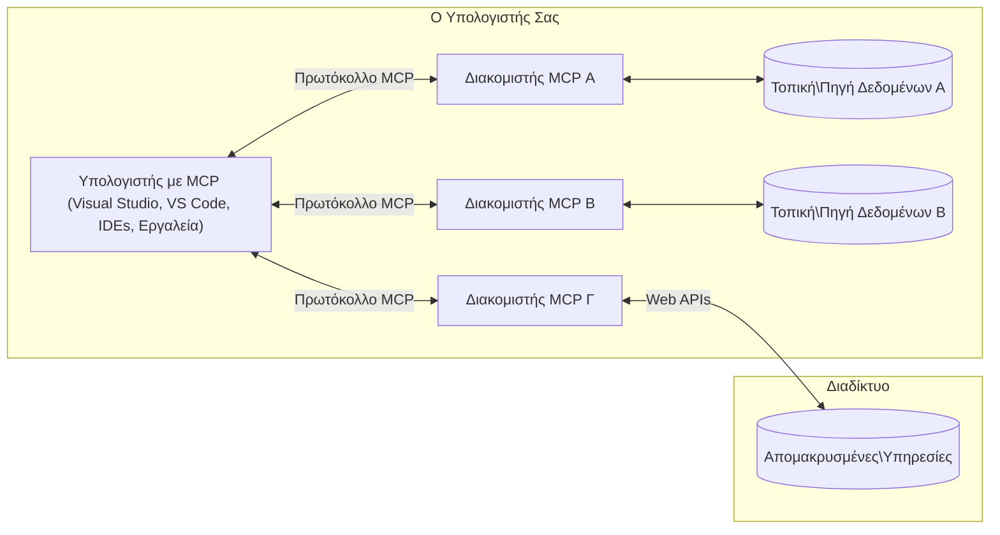

# Βασικές Έννοιες MCP: Κατάκτηση του Πρωτοκόλλου Πλαισίου Μοντέλου για Ενσωμάτωση Τεχνητής Νοημοσύνης

[](https://youtu.be/earDzWGtE84)

_(Κάντε κλικ στην εικόνα παραπάνω για να δείτε το βίντεο αυτού του μαθήματος)_

Το [Πρωτόκολλο Πλαισίου Μοντέλου (MCP)](https://github.com/modelcontextprotocol) είναι ένα ισχυρό, τυποποιημένο πλαίσιο που βελτιστοποιεί την επικοινωνία μεταξύ Μεγάλων Γλωσσικών Μοντέλων (LLMs) και εξωτερικών εργαλείων, εφαρμογών και πηγών δεδομένων.  
Αυτός ο οδηγός θα σας καθοδηγήσει στις βασικές έννοιες του MCP. Θα μάθετε για την αρχιτεκτονική πελάτη-διακομιστή, τα απαραίτητα συστατικά, τους μηχανισμούς επικοινωνίας και τις βέλτιστες πρακτικές υλοποίησης.

- **Ρητή Συγκατάθεση Χρήστη**: Όλη η πρόσβαση σε δεδομένα και οι λειτουργίες απαιτούν ρητή έγκριση του χρήστη πριν την εκτέλεση. Οι χρήστες πρέπει να κατανοούν ξεκάθαρα ποια δεδομένα θα προσπελαστούν και ποιες ενέργειες θα εκτελεστούν, με λεπτομερή έλεγχο δικαιωμάτων και εξουσιοδοτήσεων.

- **Προστασία Απορρήτου Δεδομένων**: Τα δεδομένα των χρηστών εκτίθενται μόνο με ρητή συγκατάθεση και πρέπει να προστατεύονται από ισχυρούς ελέγχους πρόσβασης σε όλη τη διάρκεια της αλληλεπίδρασης. Οι υλοποιήσεις πρέπει να αποτρέπουν μη εξουσιοδοτημένη μετάδοση δεδομένων και να διατηρούν αυστηρά όρια απορρήτου.

- **Ασφάλεια Εκτέλεσης Εργαλείων**: Κάθε κλήση εργαλείου απαιτεί ρητή συγκατάθεση του χρήστη με σαφή κατανόηση της λειτουργικότητας, των παραμέτρων και των πιθανών επιπτώσεών του. Ισχυρά όρια ασφαλείας πρέπει να αποτρέπουν ανεπιθύμητη, επικίνδυνη ή κακόβουλη εκτέλεση εργαλείων.

- **Ασφάλεια Επιπέδου Μεταφοράς**: Όλες οι κανάλια επικοινωνίας θα πρέπει να χρησιμοποιούν κατάλληλους μηχανισμούς κρυπτογράφησης και αυθεντικοποίησης. Οι απομακρυσμένες συνδέσεις πρέπει να εφαρμόζουν ασφαλή πρωτόκολλα μεταφοράς και ορθή διαχείριση διαπιστευτηρίων.

#### Κατευθυντήριες Γραμμές Υλοποίησης:

- **Διαχείριση Δικαιωμάτων**: Υλοποιήστε συστήματα λεπτομερούς διαχείρισης δικαιωμάτων που επιτρέπουν στους χρήστες να ελέγχουν ποιοι διακομιστές, εργαλεία και πόροι είναι προσβάσιμοι  
- **Αυθεντικοποίηση & Εξουσιοδότηση**: Χρησιμοποιήστε ασφαλείς μεθόδους αυθεντικοποίησης (OAuth, API κλειδιά) με ορθή διαχείριση και λήξη διακριτικών  
- **Επαλήθευση Εισόδου**: Επαληθεύστε όλες τις παραμέτρους και τα δεδομένα εισόδου σύμφωνα με τα ορισμένα σχήματα για να αποτραπούν επιθέσεις έγχυσης  
- **Καταγραφή Ελέγχου**: Διατηρήστε ολοκληρωμένα αρχεία όλων των λειτουργιών για παρακολούθηση ασφαλείας και συμμόρφωση

## Επισκόπηση

Αυτό το μάθημα εξετάζει την θεμελιώδη αρχιτεκτονική και τα συστατικά που αποτελούν το οικοσύστημα του Πρωτοκόλλου Πλαισίου Μοντέλου (MCP). Θα μάθετε για την αρχιτεκτονική πελάτη-διακομιστή, τα βασικά συστατικά και τους μηχανισμούς επικοινωνίας που υποστηρίζουν τις αλληλεπιδράσεις MCP.

## Κύριοι Στόχοι Μάθησης

Στο τέλος αυτού του μαθήματος, θα:

- Κατανοήσετε την αρχιτεκτονική πελάτη-διακομιστή του MCP.  
- Αναγνωρίσετε ρόλους και ευθύνες των Κεντρικών Υπολογιστών (Hosts), Πελατών (Clients) και Διακομιστών (Servers).  
- Αναλύσετε τα βασικά χαρακτηριστικά που καθιστούν το MCP ευέλικτο επίπεδο ενσωμάτωσης.  
- Μάθετε πώς ρέει η πληροφορία μέσα στο οικοσύστημα MCP.  
- Αποκτήσετε πρακτικές γνώσεις μέσω παραδειγμάτων κώδικα σε .NET, Java, Python και JavaScript.

## Αρχιτεκτονική MCP: Μια Βαθύτερη Ματιά

Το οικοσύστημα MCP βασίζεται σε ένα μοντέλο πελάτη-διακομιστή. Αυτή η αρθρωτή δομή επιτρέπει στις εφαρμογές AI να αλληλεπιδρούν με εργαλεία, βάσεις δεδομένων, API και συμφραζόμενους πόρους αποτελεσματικά. Ας αναλύσουμε αυτή την αρχιτεκτονική στα βασικά της συστατικά.

Στον πυρήνα του, το MCP ακολουθεί μια αρχιτεκτονική πελάτη-διακομιστή όπου μια εφαρμογή-host μπορεί να συνδεθεί με πολλαπλούς διακομιστές:


- **Κεντρικοί Υπολογιστές MCP (MCP Hosts)**: Προγράμματα όπως το VSCode, Claude Desktop, IDEs ή εργαλεία AI που θέλουν να έχουν πρόσβαση σε δεδομένα μέσω MCP  
- **Πελάτες MCP (MCP Clients)**: Πελάτες πρωτοκόλλου που διατηρούν 1:1 συνδέσεις με διακομιστές  
- **Διακομιστές MCP (MCP Servers)**: Ελαφριά προγράμματα που εκθέτουν συγκεκριμένες δυνατότητες μέσω του τυποποιημένου Πρωτοκόλλου Πλαισίου Μοντέλου  
- **Τοπικές Πηγές Δεδομένων**: Αρχεία, βάσεις δεδομένων και υπηρεσίες του υπολογιστή σας που οι διακομιστές MCP μπορούν να προσπελάσουν με ασφάλεια  
- **Απομακρυσμένες Υπηρεσίες**: Εξωτερικά συστήματα διαθέσιμα μέσω internet που οι διακομιστές MCP μπορούν να συνδεθούν μέσω API.

Το Πρωτόκολλο MCP είναι ένα εξελισσόμενο πρότυπο που χρησιμοποιεί εκδόσεις βάσει ημερομηνίας (μορφή YYYY-MM-DD). Η τρέχουσα έκδοση πρωτοκόλλου είναι **2025-11-25**. Μπορείτε να δείτε τις τελευταίες ενημερώσεις στην [προδιαγραφή πρωτοκόλλου](https://modelcontextprotocol.io/specification/2025-11-25/)

### 1. Κεντρικοί Υπολογιστές (Hosts)

Στο Πρωτόκολλο Πλαισίου Μοντέλου (MCP), οι **Κεντρικοί Υπολογιστές (Hosts)** είναι εφαρμογές AI που λειτουργούν ως η κύρια διεπαφή μέσω της οποίας οι χρήστες αλληλεπιδρούν με το πρωτόκολλο. Οι Hosts συντονίζουν και διαχειρίζονται τις συνδέσεις με πολλούς διακομιστές MCP δημιουργώντας αφιερωμένους πελάτες MCP για κάθε σύνδεση διακομιστή. Παραδείγματα Hosts περιλαμβάνουν:

- **Εφαρμογές AI**: Claude Desktop, Visual Studio Code, Claude Code  
- **Περιβάλλοντα Ανάπτυξης**: IDEs και επεξεργαστές κώδικα με ενσωμάτωση MCP  
- **Προσαρμοσμένες Εφαρμογές**: Ειδικά σχεδιασμένοι AI πράκτορες και εργαλεία

Οι **Hosts** είναι εφαρμογές που συντονίζουν τις αλληλεπιδράσεις με μοντέλα AI. Αυτές:

- **Ορχηστρώνουν τα Μοντέλα AI**: Εκτελούν ή αλληλεπιδρούν με LLMs για να παράγουν απαντήσεις και να συντονίζουν ροές εργασίας AI  
- **Διαχειρίζονται τις Συνδέσεις Πελατών**: Δημιουργούν και διατηρούν έναν πελάτη MCP για κάθε σύνδεση διακομιστή MCP  
- **Ελέγχουν τη Διεπαφή Χρήστη**: Χειρίζονται τη ροή συνομιλίας, τις αλληλεπιδράσεις χρηστών και την παρουσίαση απαντήσεων  
- **Επιβάλλουν Ασφάλεια**: Ελέγχουν δικαιώματα, περιορισμούς ασφαλείας και αυθεντικοποίηση  
- **Διαχειρίζονται τη Συγκατάθεση Χρήστη**: Διαχειρίζονται την έγκριση του χρήστη για κοινή χρήση δεδομένων και εκτέλεση εργαλείων

### 2. Πελάτες (Clients)

Οι **Πελάτες** είναι βασικά συστατικά που διατηρούν αποκλειστικές συνδέσεις ένα προς ένα μεταξύ των Hosts και των διακομιστών MCP. Κάθε πελάτης MCP δημιουργείται από τον Host για να συνδεθεί με συγκεκριμένο διακομιστή MCP, εξασφαλίζοντας οργανωμένα και ασφαλή κανάλια επικοινωνίας. Πολλαπλοί πελάτες επιτρέπουν στους Hosts να συνδεθούν με πολλούς διακομιστές ταυτόχρονα.

Οι **Πελάτες** είναι συνδετικά στοιχεία εντός της εφαρμογής Host. Αυτοί:

- **Επικοινωνία Πρωτοκόλλου**: Στέλνουν αιτήματα JSON-RPC 2.0 προς τους διακομιστές με prompts και οδηγίες  
- **Διαπραγμάτευση Δυνατοτήτων**: Διαπραγματεύονται υποστηριζόμενα χαρακτηριστικά και εκδόσεις πρωτοκόλλου με τους διακομιστές κατά την αρχικοποίηση  
- **Εκτέλεση Εργαλείων**: Διαχειρίζονται αιτήματα εκτέλεσης εργαλείων από τα μοντέλα και επεξεργάζονται απαντήσεις  
- **Ενημερώσεις σε Πραγματικό Χρόνο**: Χειρίζονται ειδοποιήσεις και ενημερώσεις σε πραγματικό χρόνο από τους διακομιστές  
- **Επεξεργασία Απαντήσεων**: Επεξεργάζονται και μορφοποιούν τις απαντήσεις διακομιστή για προβολή στους χρήστες

### 3. Διακομιστές (Servers)

Οι **Διακομιστές** είναι προγράμματα που παρέχουν συμφραζόμενο, εργαλεία και δυνατότητες στους πελάτες MCP. Μπορούν να εκτελούνται τοπικά (στο ίδιο μηχάνημα με τον Host) ή απομακρυσμένα (σε εξωτερικές πλατφόρμες), και είναι υπεύθυνοι για την διαχείριση αιτημάτων πελατών και την παροχή δομημένων απαντήσεων. Οι διακομιστές εκθέτουν συγκεκριμένη λειτουργικότητα μέσω του τυποποιημένου Πρωτοκόλλου Πλαισίου Μοντέλου.

Οι **Διακομιστές** είναι υπηρεσίες που παρέχουν συμφραζόμενο και δυνατότητες. Αυτοί:

- **Καταχώριση Χαρακτηριστικών**: Καταχωρούν και εκθέτουν διαθέσιμα πρωτόγονά (πόρους, prompts, εργαλεία) στους πελάτες  
- **Επεξεργασία Αιτημάτων**: Λαμβάνουν και εκτελούν κλήσεις εργαλείων, αιτήματα πόρων και prompts από πελάτες  
- **Παροχή Συμφραζομένων**: Παρέχουν συμφραζόμενες πληροφορίες και δεδομένα για την ενίσχυση των απαντήσεων μοντέλου  
- **Διαχείριση Κατάστασης**: Διατηρούν κατάσταση συνεδρίας και χειρίζονται αλληλεπιδράσεις με κατάσταση όταν απαιτείται  
- **Ειδοποιήσεις σε Πραγματικό Χρόνο**: Στέλνουν ειδοποιήσεις για αλλαγές δυνατοτήτων και ενημερώσεις προς τους συνδεδεμένους πελάτες

Οι διακομιστές μπορούν να αναπτυχθούν από οποιονδήποτε για να επεκτείνουν τις δυνατότητες μοντέλου με εξειδικευμένη λειτουργικότητα, και υποστηρίζουν τόσο τοπικά όσο και απομακρυσμένα σενάρια ανάπτυξης.

### 4. Πρωτόγονα Διακομιστών

Οι διακομιστές στο Πρωτόκολλο Πλαισίου Μοντέλου (MCP) παρέχουν τρία βασικά **πρωτόγονα** που ορίζουν τα θεμελιώδη δομικά στοιχεία για πλούσιες αλληλεπιδράσεις μεταξύ πελατών, κεντρικών υπολογιστών και γλωσσικών μοντέλων. Αυτά τα πρωτόγονα καθορίζουν τους τύπους συμφραζόμενων πληροφοριών και ενεργειών που είναι διαθέσιμα μέσω του πρωτοκόλλου.

Οι διακομιστές MCP μπορούν να εκθέσουν οποιονδήποτε συνδυασμό των τριών βασικών πρωτόγονων:

#### Πόροι

Οι **Πόροι** είναι πηγές δεδομένων που παρέχουν συμφραζόμενες πληροφορίες σε εφαρμογές AI. Αντιπροσωπεύουν στατικό ή δυναμικό περιεχόμενο που μπορεί να ενισχύσει την κατανόηση του μοντέλου και τη λήψη αποφάσεων:

- **Συμφραζόμενα Δεδομένα**: Δομημένες πληροφορίες και συμφραζόμενα για την κατανάλωση από μοντέλα AI  
- **Βάσεις Γνώσης**: Αποθετήρια εγγράφων, άρθρα, εγχειρίδια και ερευνητικές εργασίες  
- **Τοπικές Πηγές Δεδομένων**: Αρχεία, βάσεις δεδομένων και πληροφορίες τοπικού συστήματος  
- **Εξωτερικά Δεδομένα**: Απαντήσεις API, διαδικτυακές υπηρεσίες και δεδομένα απομακρυσμένων συστημάτων  
- **Δυναμικό Περιεχόμενο**: Δεδομένα σε πραγματικό χρόνο που ενημερώνονται βάσει εξωτερικών συνθηκών

Οι πόροι αναγνωρίζονται από URI και υποστηρίζουν ανίχνευση μέσω των μεθόδων `resources/list` και ανάκτηση μέσω της `resources/read`:

```text
file://documents/project-spec.md
database://production/users/schema
api://weather/current
```

#### Prompts

Τα **Prompts** είναι επαναχρησιμοποιούμενα πρότυπα που βοηθούν στη δομή των αλληλεπιδράσεων με γλωσσικά μοντέλα. Παρέχουν τυποποιημένα μοτίβα αλληλεπίδρασης και τυποποιημένες ροές εργασίας:

- **Αλληλεπιδράσεις με βάση πρότυπα**: Προ-δομημένα μηνύματα και προτάσεις έναρξης συνομιλίας  
- **Πρότυπα Ροών Εργασίας**: Τυποποιημένες ακολουθίες για κοινές εργασίες και αλληλεπιδράσεις  
- **Παραδείγματα με λίγα δείγματα**: Πρότυπα βασισμένα σε παραδείγματα για καθοδήγηση μοντέλου  
- **Σύστημα Prompts**: Βασικά prompts που ορίζουν τη συμπεριφορά και συμφραζόμενα μοντέλου  
- **Δυναμικά Πρότυπα**: Παραμετροποιημένα prompts που προσαρμόζονται σε συγκεκριμένα συμφραζόμενα

Τα prompts υποστηρίζουν υποκατάσταση μεταβλητών και μπορούν να ανιχνευθούν μέσω `prompts/list` και να ανακτηθούν με `prompts/get`:

```markdown
Generate a {{task_type}} for {{product}} targeting {{audience}} with the following requirements: {{requirements}}
```

#### Εργαλεία (Tools)

Τα **Εργαλεία** είναι εκτελέσιμες λειτουργίες που τα μοντέλα AI μπορούν να καλούν για να εκτελέσουν συγκεκριμένες ενέργειες. Αντιπροσωπεύουν τα «ρήματα» του οικοσυστήματος MCP, δίνοντας τη δυνατότητα στα μοντέλα να αλληλεπιδρούν με εξωτερικά συστήματα:

- **Εκτελέσιμες Λειτουργίες**: Διακριτές λειτουργίες που τα μοντέλα μπορούν να εκτελέσουν με συγκεκριμένες παραμέτρους  
- **Ενσωμάτωση σε Εξωτερικά Συστήματα**: Κλήσεις API, ερωτήματα βάσεων δεδομένων, λειτουργίες σε αρχεία, υπολογισμοί  
- **Μοναδική Ταυτότητα**: Κάθε εργαλείο έχει χαρακτηριστικό όνομα, περιγραφή και σχήμα παραμέτρων  
- **Δομημένη Είσοδος/Έξοδος**: Τα εργαλεία δέχονται επικυρωμένες παραμέτρους και επιστρέφουν δομημένες, τυποποιημένες απαντήσεις  
- **Δυνατότητες Ενεργειών**: Επιτρέπουν στα μοντέλα να εκτελούν πραγματικές ενέργειες και να ανακτούν ζωντανά δεδομένα

Τα εργαλεία ορίζονται με JSON Schema για την επικύρωση παραμέτρων και ανιχνεύονται μέσω `tools/list` και εκτελούνται μέσω `tools/call`. Τα εργαλεία μπορούν επίσης να περιλαμβάνουν **εικόνες** ως επιπλέον μεταδεδομένα για καλύτερη παρουσίαση διεπαφής χρήστη.

**Σημειώσεις Εργαλείων**: Τα εργαλεία υποστηρίζουν συμπεριφορικές σημειώσεις (π.χ. `readOnlyHint`, `destructiveHint`) που περιγράφουν αν ένα εργαλείο είναι μόνο για ανάγνωση ή καταστροφικό, βοηθώντας τους πελάτες να παίρνουν ενημερωμένες αποφάσεις για την εκτέλεση του εργαλείου.

Παράδειγμα ορισμού εργαλείου:

```typescript
server.tool(
  "search_products", 
  {
    query: z.string().describe("Search query for products"),
    category: z.string().optional().describe("Product category filter"),
    max_results: z.number().default(10).describe("Maximum results to return")
  }, 
  async (params) => {
    // Εκτέλεση αναζήτησης και επιστροφή δομημένων αποτελεσμάτων
    return await productService.search(params);
  }
);
```

## Πρωτόγονα Πελάτη

Στο Πρωτόκολλο Πλαισίου Μοντέλου (MCP), οι **πελάτες** μπορούν να εκθέτουν πρωτόγονα που επιτρέπουν στους διακομιστές να ζητούν επιπρόσθετες δυνατότητες από την εφαρμογή Host. Αυτά τα πρωτόγονα πελάτη επιτρέπουν πλουσιότερες, πιο αλληλεπιδραστικές υλοποιήσεις διακομιστών που μπορούν να έχουν πρόσβαση σε δυνατότητες μοντέλου AI και αλληλεπιδράσεις χρηστών.

### Δειγματοληψία (Sampling)

Η **δειγματοληψία** επιτρέπει στους διακομιστές να ζητούν συμπληρώσεις γλωσσικού μοντέλου από την εφαρμογή AI του πελάτη. Αυτό το πρωτόγονο επιτρέπει στους διακομιστές να έχουν πρόσβαση σε δυνατότητες LLM χωρίς να ενσωματώνουν δικές τους εξαρτήσεις μοντέλου:

- **Ανεξάρτητη Πρόσβαση Μοντέλου**: Οι διακομιστές μπορούν να ζητούν συμπληρώσεις χωρίς να συμπεριλαμβάνουν SDKs LLM ή να διαχειρίζονται πρόσβαση σε μοντέλα  
- **AI που Ενεργοποιείται από τον Διακομιστή**: Επιτρέπει στους διακομιστές να δημιουργούν αυτόνομα περιεχόμενο χρησιμοποιώντας το μοντέλο AI του πελάτη  
- **Αναδρομικές Αλληλεπιδράσεις LLM**: Υποστηρίζει σύνθετα σενάρια όπου οι διακομιστές χρειάζονται βοήθεια AI για επεξεργασία  
- **Δυναμική Δημιουργία Περιεχομένου**: Επιτρέπει στους διακομιστές να δημιουργούν συμφραζόμενες απαντήσεις χρησιμοποιώντας το μοντέλο του Host  
- **Υποστήριξη Κλήσης Εργαλείων**: Οι διακομιστές μπορούν να περιλαμβάνουν παραμέτρους `tools` και `toolChoice` για να επιτρέψουν στο μοντέλο του πελάτη να καλεί εργαλεία κατά τη διάρκεια της δειγματοληψίας

Η δειγματοληψία ξεκινά μέσω της μεθόδου `sampling/complete`, όπου οι διακομιστές στέλνουν αιτήματα συμπλήρωσης στους πελάτες.

### Ρίζες (Roots)

Οι **Ρίζες** παρέχουν έναν τυποποιημένο τρόπο για τους πελάτες να εκθέτουν όρια συστήματος αρχείων προς τους διακομιστές, βοηθώντας τους διακομιστές να κατανοήσουν σε ποιους φακέλους και αρχεία έχουν πρόσβαση:

- **Όρια Συστήματος Αρχείων**: Ορίζουν το πεδίο όπου οι διακομιστές μπορούν να λειτουργούν εντός του συστήματος αρχείων  
- **Έλεγχος Πρόσβασης**: Βοηθούν τους διακομιστές να κατανοήσουν σε ποιους φακέλους και αρχεία έχουν άδεια πρόσβασης  
- **Δυναμικές Ενημερώσεις**: Οι πελάτες μπορούν να ειδοποιούν τους διακομιστές όταν αλλάζει η λίστα ριζών  
- **Ταυτοποίηση με URI**: Οι ρίζες χρησιμοποιούν URIs τύπου `file://` για την ταυτοποίηση προσβάσιμων φακέλων και αρχείων

Οι ρίζες ανιχνεύονται μέσω της μεθόδου `roots/list`, με τους πελάτες να στέλνουν `notifications/roots/list_changed` όταν οι ρίζες αλλάζουν.

### Εξαγωγή Πληροφοριών (Elicitation)

Η **εξαγωγή πληροφοριών** δίνει τη δυνατότητα στους διακομιστές να ζητούν πρόσθετες πληροφορίες ή επιβεβαίωση από τους χρήστες μέσω της διεπαφής του πελάτη:

- **Αιτήματα Εισαγωγής Χρήστη**: Οι διακομιστές μπορούν να ζητούν περισσότερες πληροφορίες όταν χρειάζεται για την εκτέλεση εργαλείων  
- **Διάλογοι Επιβεβαίωσης**: Ζητούν έγκριση χρήστη για ευαίσθητες ή σημαντικές λειτουργίες  
- **Διαδραστικές Ροές Εργασίας**: Επιτρέπουν στους διακομιστές να δημιουργούν βήμα-βήμα αλληλεπιδράσεις με χρήστες  
- **Δυναμική Συλλογή Παραμέτρων**: Συλλέγουν ελλείπουσες ή προαιρετικές παραμέτρους κατά την εκτέλεση εργαλείων

Τα αιτήματα εξαγωγής πληροφοριών γίνονται μέσω της μεθόδου `elicitation/request` για τη συλλογή εισόδου χρήστη μέσω της διεπαφής πελάτη.

**Εξαγωγή Πληροφοριών μέσω URL**: Οι διακομιστές μπορούν επίσης να ζητούν αλληλεπιδράσεις χρηστών βασισμένες σε URL, επιτρέποντας στους χρήστες να οδηγούνται σε εξωτερικές ιστοσελίδες για αυθεντικοποίηση, επιβεβαίωση ή καταχώριση δεδομένων.

### Καταγραφή (Logging)

Η **καταγραφή** επιτρέπει στους διακομιστές να στέλνουν δομημένα μηνύματα καταγραφής προς τους πελάτες για αποσφαλμάτωση, παρακολούθηση και ορατότητα στη λειτουργία:

- **Υποστήριξη Αποσφαλμάτωσης**: Επιτρέπει στους διακομιστές να παρέχουν λεπτομερή αρχεία εκτέλεσης για αντιμετώπιση προβλημάτων  
- **Λειτουργική Παρακολούθηση**: Στέλνει ενημερώσεις κατάστασης και μετρήσεις απόδοσης προς τους πελάτες  
- **Αναφορά Σφαλμάτων**: Παρέχει λεπτομερή συμφραζόμενα σφαλμάτων και διαγνωστικές πληροφορίες  
- **Αρχείο Ελέγχου**: Δημιουργεί ολοκληρωμένα αρχεία λειτουργιών και αποφάσεων διακομιστή

Τα μηνύματα καταγραφής αποστέλλονται στους πελάτες για να παρέχουν διαφάνεια στις λειτουργίες των διακομιστών και να διευκολύνουν την αποσφαλμάτωση.

## Ροή Πληροφοριών στο MCP

Το Πρωτόκολλο Πλαισίου Μοντέλου (MCP) ορίζει μια δομημένη ροή πληροφοριών μεταξύ hosts, clients, servers και μοντέλων. Η κατανόηση αυτής της ροής βοηθά στη διευκρίνιση του τρόπου με τον οποίο επεξεργάζονται τα αιτήματα των χρηστών και πώς τα εξωτερικά εργαλεία και δεδομένα ενσωματώνονται στις απαντήσεις του μοντέλου.

- **Ο Host Ξεκινά τη Σύνδεση**  
  Η εφαρμογή host (όπως ένα IDE ή διεπαφή συνομιλίας) δημιουργεί σύνδεση με έναν διακομιστή MCP, συνήθως μέσω STDIO, WebSocket ή άλλου υποστηριζόμενου μεταφορικού μέσου.

- **Διαπραγμάτευση Δυνατοτήτων**  
  Ο πελάτης (ενσωματωμένος στον host) και ο διακομιστής ανταλλάσσουν πληροφορίες σχετικά με τις υποστηριζόμενες δυνατότητες, εργαλεία, πόρους και εκδόσεις πρωτοκόλλου. Αυτό εξασφαλίζει ότι αμφότερα τα μέρη κατανοούν ποιες δυνατότητες είναι διαθέσιμες για τη συνεδρία.

- **Αίτημα Χρήστη**  
  Ο χρήστης αλληλεπιδρά με τον host (π.χ. εισάγει prompt ή εντολή). Ο host συλλέγει αυτή την είσοδο και την περνά στον πελάτη για επεξεργασία.

- **Χρήση Πόρου ή Εργαλείου**  
  - Ο πελάτης μπορεί να ζητήσει πρόσθετο συμφραζόμενο ή πόρους από τον διακομιστή (π.χ. αρχεία, καταχωρίσεις βάσεων δεδομένων ή άρθρα βάσεων γνώσης) για να εμπλουτίσει την κατανόηση του μοντέλου.  
  - Αν το μοντέλο κρίνει απαραίτητο να χρησιμοποιήσει εργαλείο (π.χ. για να ανακτήσει δεδομένα, να εκτελέσει υπολογισμό ή να καλέσει API), ο πελάτης στέλνει αίτημα εκτέλεσης εργαλείου στον διακομιστή, καθορίζοντας το όνομα εργαλείου και τις παραμέτρους.

- **Εκτέλεση Διακομιστή**  

Ο διακομιστής λαμβάνει το αίτημα για πόρο ή εργαλείο, εκτελεί τις απαραίτητες ενέργειες (όπως την εκτέλεση μιας συνάρτησης, την ερώτηση σε βάση δεδομένων ή την ανάκτηση ενός αρχείου) και επιστρέφει τα αποτελέσματα στον πελάτη σε μια δομημένη μορφή.

- **Δημιουργία Απάντησης**  
  Ο πελάτης ενσωματώνει τις απαντήσεις του διακομιστή (δεδομένα πόρων, αποτελέσματα εργαλείων κ.ά.) στην τρέχουσα αλληλεπίδραση με το μοντέλο. Το μοντέλο χρησιμοποιεί αυτές τις πληροφορίες για να παράγει μια ολοκληρωμένη και συμφραζόμενα σχετική απάντηση.

- **Παρουσίαση Αποτελέσματος**  
  Ο οικοδεσπότης λαμβάνει το τελικό αποτέλεσμα από τον πελάτη και το παρουσιάζει στον χρήστη, συχνά περιλαμβάνοντας τόσο το παραγόμενο κείμενο από το μοντέλο όσο και τυχόν αποτελέσματα από την εκτέλεση εργαλείων ή αναζητήσεις πόρων.

Αυτή η ροή επιτρέπει στο MCP να υποστηρίζει προηγμένες, διαδραστικές και συμφραζόμενες εφαρμογές ΤΝ συνδέοντας απρόσκοπτα τα μοντέλα με εξωτερικά εργαλεία και πηγές δεδομένων.

## Αρχιτεκτονική Πρωτοκόλλου & Επίπεδα

Το MCP αποτελείται από δύο διακριτά αρχιτεκτονικά επίπεδα που συνεργάζονται για να παρέχουν ένα ολοκληρωμένο πλαίσιο επικοινωνίας:

### Επίπεδο Δεδομένων

Το **Επίπεδο Δεδομένων** υλοποιεί τον βασικό πρωτόκολλο MCP χρησιμοποιώντας ως βάση το **JSON-RPC 2.0**. Αυτό το επίπεδο ορίζει τη δομή των μηνυμάτων, τα σημασιολογικά στοιχεία και τα πρότυπα αλληλεπίδρασης:

#### Βασικά Στοιχεία:

- **Πρωτόκολλο JSON-RPC 2.0**: Όλη η επικοινωνία χρησιμοποιεί τυποποιημένη μορφή μηνυμάτων JSON-RPC 2.0 για κλήσεις μεθόδων, απαντήσεις και ειδοποιήσεις
- **Διαχείριση Κύκλου Ζωής**: Διαχειρίζεται την αρχικοποίηση σύνδεσης, τη διαπραγμάτευση δυνατοτήτων και τον τερματισμό συνεδρίας μεταξύ πελατών και διακομιστών
- **Πρωτόγονα Στοιχεία Διακομιστή**: Επιτρέπουν στους διακομιστές να παρέχουν βασική λειτουργικότητα μέσω εργαλείων, πόρων και προτροπών
- **Πρωτόγονα Στοιχεία Πελάτη**: Επιτρέπουν στους διακομιστές να ζητούν δειγματοληψία από LLM, να λαμβάνουν είσοδο χρήστη και να στέλνουν μηνύματα καταγραφής
- **Ειδοποιήσεις σε Πραγματικό Χρόνο**: Υποστηρίζουν ασύγχρονες ειδοποιήσεις για δυναμικές ενημερώσεις χωρίς polling

#### Βασικά Χαρακτηριστικά:

- **Διαπραγμάτευση Έκδοσης Πρωτοκόλλου**: Χρησιμοποιεί εκδόσεις βάσει ημερομηνίας (ΕΕΕΕ-ΜΜ-ΗΗ) για εξασφάλιση συμβατότητας
- **Ανακάλυψη Δυνατοτήτων**: Πελάτες και διακομιστές ανταλλάσσουν πληροφορίες για υποστηριζόμενα χαρακτηριστικά κατά την αρχικοποίηση
- **Κατάσταση Συνεδριών**: Διατηρεί κατάσταση σύνδεσης σε πολλαπλές αλληλεπιδράσεις για συνέχεια συμφραζομένων

### Επίπεδο Μεταφοράς

Το **Επίπεδο Μεταφοράς** διαχειρίζεται τα κανάλια επικοινωνίας, το πλαισίωμα μηνυμάτων και την αυθεντικοποίηση μεταξύ των συμμετεχόντων στο MCP:

#### Υποστηριζόμενοι Μηχανισμοί Μεταφοράς:

1. **STDIO Μεταφορά**:
   - Χρησιμοποιεί τις ροές εισόδου/εξόδου για άμεση επικοινωνία διαδικασιών  
   - Βέλτιστο για τοπικές διεργασίες στην ίδια μηχανή χωρίς επιβάρυνση δικτύου  
   - Συνηθισμένη χρήση σε τοπικές υλοποιήσεις MCP διακομιστών

2. **Streamable HTTP Μεταφορά**:
   - Χρησιμοποιεί HTTP POST για μηνύματα πελάτη προς διακομιστή  
   - Προαιρετικά Server-Sent Events (SSE) για ροή δεδομένων από διακομιστή προς πελάτη  
   - Επιτρέπει απομακρυσμένη επικοινωνία διακομιστών μέσω δικτύων  
   - Υποστηρίζει τυπική αυθεντικοποίηση HTTP (bearer tokens, κλειδιά API, προσαρμοσμένες κεφαλίδες)  
   - Το MCP συνιστά τη χρήση OAuth για ασφαλή αυθεντικοποίηση με βάση tokens

#### Αφαίρεση Μεταφοράς:

Το επίπεδο μεταφοράς αφαιρεί τις λεπτομέρειες επικοινωνίας από το επίπεδο δεδομένων, επιτρέποντας την ίδια μορφή μηνυμάτων JSON-RPC 2.0 σε όλους τους μηχανισμούς μεταφοράς. Η αφαίρεση αυτή δίνει τη δυνατότητα στις εφαρμογές να εναλλάσσονται απρόσκοπτα μεταξύ τοπικών και απομακρυσμένων διακομιστών.

### Ζητήματα Ασφαλείας

Οι υλοποιήσεις MCP πρέπει να συμμορφώνονται με αρκετές κρίσιμες αρχές ασφαλείας για να εξασφαλίσουν ασφαλείς, αξιόπιστες αλληλεπιδράσεις σε όλες τις λειτουργίες του πρωτοκόλλου:

- **Συναίνεση και Έλεγχος Χρήστη**: Οι χρήστες πρέπει να παρέχουν ρητή συναίνεση πριν από κάθε πρόσβαση σε δεδομένα ή εκτέλεση ενεργειών. Πρέπει να έχουν σαφή έλεγχο για το ποιες πληροφορίες κοινοποιούνται και ποιες ενέργειες εξουσιοδοτούνται, υποστηριζόμενοι από διαισθητικές διεπαφές για ανασκόπηση και έγκριση ενεργειών.

- **Απόρρητο Δεδομένων**: Τα δεδομένα χρηστών πρέπει να αποκαλύπτονται μόνο με ρητή συναίνεση και να προστατεύονται με κατάλληλους μηχανισμούς ελέγχου πρόσβασης. Οι υλοποιήσεις MCP πρέπει να αποτρέπουν τη μη εξουσιοδοτημένη μετάδοση δεδομένων και να διασφαλίζουν τη διατήρηση του απορρήτου σε όλες τις αλληλεπιδράσεις.

- **Ασφάλεια Εργαλείων**: Πριν από την κλήση οποιουδήποτε εργαλείου απαιτείται ρητή συναίνεση χρήστη. Οι χρήστες πρέπει να κατανοούν τη λειτουργικότητα κάθε εργαλείου και να επιβάλλονται αυστηρά όρια ασφαλείας ώστε να αποφεύγεται η ακούσια ή μη ασφαλής εκτέλεση εργαλείων.

Ακολουθώντας αυτές τις αρχές ασφαλείας, το MCP διασφαλίζει την εμπιστοσύνη, το απόρρητο και την ασφάλεια των χρηστών σε όλες τις αλληλεπιδράσεις πρωτοκόλλου, ενώ ταυτόχρονα επιτρέπει ισχυρές ενσωματώσεις ΤΝ.

## Παραδείγματα Κώδικα: Βασικά Στοιχεία

Ακολουθούν παραδείγματα κώδικα σε διάφορες δημοφιλείς γλώσσες προγραμματισμού που δείχνουν πώς να υλοποιήσετε βασικά στοιχεία MCP διακομιστή και εργαλεία.

### Παράδειγμα .NET: Δημιουργία Απλού MCP Διακομιστή με Εργαλεία

Παρακάτω υπάρχει πρακτικό παράδειγμα κώδικα .NET που δείχνει πώς να υλοποιήσετε έναν απλό MCP διακομιστή με προσαρμοσμένα εργαλεία. Το παράδειγμα παρουσιάζει πώς να ορίσετε και να εγγράψετε εργαλεία, να διαχειριστείτε αιτήματα και να συνδέσετε τον διακομιστή χρησιμοποιώντας το Πρωτόκολλο Συμφραζόμενου Μοντέλου.

```csharp
using System;
using System.Threading.Tasks;
using ModelContextProtocol.Server;
using ModelContextProtocol.Server.Transport;
using ModelContextProtocol.Server.Tools;

public class WeatherServer
{
    public static async Task Main(string[] args)
    {
        // Create an MCP server
        var server = new McpServer(
            name: "Weather MCP Server",
            version: "1.0.0"
        );
        
        // Register our custom weather tool
        server.AddTool<string, WeatherData>("weatherTool", 
            description: "Gets current weather for a location",
            execute: async (location) => {
                // Call weather API (simplified)
                var weatherData = await GetWeatherDataAsync(location);
                return weatherData;
            });
        
        // Connect the server using stdio transport
        var transport = new StdioServerTransport();
        await server.ConnectAsync(transport);
        
        Console.WriteLine("Weather MCP Server started");
        
        // Keep the server running until process is terminated
        await Task.Delay(-1);
    }
    
    private static async Task<WeatherData> GetWeatherDataAsync(string location)
    {
        // This would normally call a weather API
        // Simplified for demonstration
        await Task.Delay(100); // Simulate API call
        return new WeatherData { 
            Temperature = 72.5,
            Conditions = "Sunny",
            Location = location
        };
    }
}

public class WeatherData
{
    public double Temperature { get; set; }
    public string Conditions { get; set; }
    public string Location { get; set; }
}
```

### Παράδειγμα Java: Στοιχεία MCP Διακομιστή

Αυτό το παράδειγμα παρουσιάζει τον ίδιο MCP διακομιστή και την εγγραφή εργαλείων όπως στο παράδειγμα .NET παραπάνω, αλλά υλοποιημένο σε Java.

```java
import io.modelcontextprotocol.server.McpServer;
import io.modelcontextprotocol.server.McpToolDefinition;
import io.modelcontextprotocol.server.transport.StdioServerTransport;
import io.modelcontextprotocol.server.tool.ToolExecutionContext;
import io.modelcontextprotocol.server.tool.ToolResponse;

public class WeatherMcpServer {
    public static void main(String[] args) throws Exception {
        // Δημιουργήστε έναν διακομιστή MCP
        McpServer server = McpServer.builder()
            .name("Weather MCP Server")
            .version("1.0.0")
            .build();
            
        // Καταχωρήστε ένα εργαλείο καιρού
        server.registerTool(McpToolDefinition.builder("weatherTool")
            .description("Gets current weather for a location")
            .parameter("location", String.class)
            .execute((ToolExecutionContext ctx) -> {
                String location = ctx.getParameter("location", String.class);
                
                // Λάβετε δεδομένα καιρού (απλοποιημένα)
                WeatherData data = getWeatherData(location);
                
                // Επιστρέψτε μορφοποιημένη απάντηση
                return ToolResponse.content(
                    String.format("Temperature: %.1f°F, Conditions: %s, Location: %s", 
                    data.getTemperature(), 
                    data.getConditions(), 
                    data.getLocation())
                );
            })
            .build());
        
        // Συνδέστε τον διακομιστή χρησιμοποιώντας τη μεταφορά stdio
        try (StdioServerTransport transport = new StdioServerTransport()) {
            server.connect(transport);
            System.out.println("Weather MCP Server started");
            // Διατηρήστε τον διακομιστή σε λειτουργία μέχρι να τερματιστεί η διαδικασία
            Thread.currentThread().join();
        }
    }
    
    private static WeatherData getWeatherData(String location) {
        // Η υλοποίηση θα καλούσε ένα API καιρού
        // Απλοποιημένο για σκοπούς παραδείγματος
        return new WeatherData(72.5, "Sunny", location);
    }
}

class WeatherData {
    private double temperature;
    private String conditions;
    private String location;
    
    public WeatherData(double temperature, String conditions, String location) {
        this.temperature = temperature;
        this.conditions = conditions;
        this.location = location;
    }
    
    public double getTemperature() {
        return temperature;
    }
    
    public String getConditions() {
        return conditions;
    }
    
    public String getLocation() {
        return location;
    }
}
```

### Παράδειγμα Python: Κατασκευή MCP Διακομιστή

Αυτό το παράδειγμα χρησιμοποιεί το fastmcp, οπότε παρακαλώ βεβαιωθείτε ότι το έχετε εγκαταστήσει πρώτα:

```python
pip install fastmcp
```
Παράδειγμα Κώδικα:

```python
#!/usr/bin/env python3
import asyncio
from fastmcp import FastMCP
from fastmcp.transports.stdio import serve_stdio

# Δημιουργήστε έναν διακομιστή FastMCP
mcp = FastMCP(
    name="Weather MCP Server",
    version="1.0.0"
)

@mcp.tool()
def get_weather(location: str) -> dict:
    """Gets current weather for a location."""
    return {
        "temperature": 72.5,
        "conditions": "Sunny",
        "location": location
    }

# Εναλλακτική προσέγγιση χρησιμοποιώντας μία κλάση
class WeatherTools:
    @mcp.tool()
    def forecast(self, location: str, days: int = 1) -> dict:
        """Gets weather forecast for a location for the specified number of days."""
        return {
            "location": location,
            "forecast": [
                {"day": i+1, "temperature": 70 + i, "conditions": "Partly Cloudy"}
                for i in range(days)
            ]
        }

# Καταχώριση εργαλείων κλάσης
weather_tools = WeatherTools()

# Εκκινήστε τον διακομιστή
if __name__ == "__main__":
    asyncio.run(serve_stdio(mcp))
```

### Παράδειγμα JavaScript: Δημιουργία MCP Διακομιστή

Αυτό το παράδειγμα δείχνει τη δημιουργία MCP διακομιστή σε JavaScript και πώς να εγγράψετε δύο εργαλεία σχετιζόμενα με τον καιρό.

```javascript
// Χρήση του επίσημου Model Context Protocol SDK
import { McpServer } from "@modelcontextprotocol/sdk/server/mcp.js";
import { StdioServerTransport } from "@modelcontextprotocol/sdk/server/stdio.js";
import { z } from "zod"; // Για την επαλήθευση παραμέτρων

// Δημιουργία ενός MCP διακομιστή
const server = new McpServer({
  name: "Weather MCP Server",
  version: "1.0.0"
});

// Ορισμός εργαλείου καιρού
server.tool(
  "weatherTool",
  {
    location: z.string().describe("The location to get weather for")
  },
  async ({ location }) => {
    // Κανονικά θα καλούσε ένα API καιρού
    // Απλοποιημένο για επίδειξη
    const weatherData = await getWeatherData(location);
    
    return {
      content: [
        { 
          type: "text", 
          text: `Temperature: ${weatherData.temperature}°F, Conditions: ${weatherData.conditions}, Location: ${weatherData.location}` 
        }
      ]
    };
  }
);

// Ορισμός εργαλείου πρόγνωσης
server.tool(
  "forecastTool",
  {
    location: z.string(),
    days: z.number().default(3).describe("Number of days for forecast")
  },
  async ({ location, days }) => {
    // Κανονικά θα καλούσε ένα API καιρού
    // Απλοποιημένο για επίδειξη
    const forecast = await getForecastData(location, days);
    
    return {
      content: [
        { 
          type: "text", 
          text: `${days}-day forecast for ${location}: ${JSON.stringify(forecast)}` 
        }
      ]
    };
  }
);

// Βοηθητικές συναρτήσεις
async function getWeatherData(location) {
  // Προσομοίωση κλήσης API
  return {
    temperature: 72.5,
    conditions: "Sunny",
    location: location
  };
}

async function getForecastData(location, days) {
  // Προσομοίωση κλήσης API
  return Array.from({ length: days }, (_, i) => ({
    day: i + 1,
    temperature: 70 + Math.floor(Math.random() * 10),
    conditions: i % 2 === 0 ? "Sunny" : "Partly Cloudy"
  }));
}

// Σύνδεση του διακομιστή χρησιμοποιώντας σύνδεση stdio
const transport = new StdioServerTransport();
server.connect(transport).catch(console.error);

console.log("Weather MCP Server started");
```

Το συγκεκριμένο παράδειγμα JavaScript παρουσιάζει πώς να δημιουργήσετε έναν MCP πελάτη που συνδέεται με διακομιστή, στέλνει μια προτροπή και επεξεργάζεται την απάντηση συμπεριλαμβανομένων των όποιων κλήσεων εργαλείων έγιναν.

## Ασφάλεια και Εξουσιοδότηση

Το MCP περιλαμβάνει αρκετές ενσωματωμένες έννοιες και μηχανισμούς για τη διαχείριση της ασφάλειας και της εξουσιοδότησης σε όλο το πρωτόκολλο:

1. **Έλεγχος Δικαιωμάτων Εργαλείων**:  
  Οι πελάτες μπορούν να καθορίσουν ποια εργαλεία επιτρέπεται να χρησιμοποιεί ένα μοντέλο κατά τη διάρκεια μιας συνεδρίας. Αυτό διασφαλίζει ότι μόνο εργαλεία με ρητή άδεια είναι προσβάσιμα, μειώνοντας τον κίνδυνο ανεπιθύμητων ή μη ασφαλών ενεργειών. Τα δικαιώματα μπορούν να ρυθμίζονται δυναμικά βάσει προτιμήσεων χρήστη, πολιτικών οργανισμού ή συμφραζομένων της αλληλεπίδρασης.

2. **Αυθεντικοποίηση**:  
  Οι διακομιστές μπορούν να απαιτήσουν αυθεντικοποίηση πριν χορηγήσουν πρόσβαση σε εργαλεία, πόρους ή ευαίσθητες λειτουργίες. Αυτό μπορεί να περιλαμβάνει κλειδιά API, tokens OAuth ή άλλα σχήματα αυθεντικοποίησης. Η σωστή αυθεντικοποίηση εξασφαλίζει ότι μόνο αξιόπιστοι πελάτες και χρήστες μπορούν να ενεργοποιήσουν λειτουργίες στον διακομιστή.

3. **Επικύρωση**:  
  Επιβάλλεται επικύρωση παραμέτρων για όλες τις κλήσεις εργαλείων. Κάθε εργαλείο ορίζει τους αναμενόμενους τύπους, μορφές και περιορισμούς για τις παραμέτρους του, και ο διακομιστής επικυρώνει αναλόγως τα εισερχόμενα αιτήματα. Αυτό αποτρέπει την παράνομη ή κακόβουλη εισαγωγή και βοηθά στη διατήρηση της ακεραιότητας των λειτουργιών.

4. **Περιορισμός Ροής**:  
  Για την αποτροπή κατάχρησης και τη διασφάλιση δίκαιης χρήσης των πόρων του διακομιστή, οι MCP διακομιστές μπορούν να εφαρμόσουν περιορισμό ρυθμού κλήσεων εργαλείων και πρόσβασης σε πόρους. Οι περιορισμοί μπορούν να οριστούν ανά χρήστη, συνεδρία ή συνολικά, προστατεύοντας από επιθέσεις άρνησης υπηρεσίας ή υπερβολική κατανάλωση πόρων.

Συνδυάζοντας αυτούς τους μηχανισμούς, το MCP προσφέρει μια ασφαλή βάση για την ενσωμάτωση γλωσσικών μοντέλων με εξωτερικά εργαλεία και πηγές δεδομένων, ενώ παρέχει σε χρήστες και προγραμματιστές λεπτομερή έλεγχο πρόσβασης και χρήσης.

## Μηνύματα Πρωτοκόλλου & Ροή Επικοινωνίας

Η επικοινωνία MCP χρησιμοποιεί δομημένα μηνύματα **JSON-RPC 2.0** για να διευκολύνει σαφείς και αξιόπιστες αλληλεπιδράσεις μεταξύ οικοδεσποτών, πελατών και διακομιστών. Το πρωτόκολλο ορίζει συγκεκριμένα πρότυπα μηνυμάτων για διαφορετικούς τύπους λειτουργιών:

### Βασικοί Τύποι Μηνυμάτων:

#### **Μηνύματα Αρχικοποίησης**
- **`initialize` Αίτημα**: Εγκαθιστά σύνδεση και διαπραγματεύεται έκδοση πρωτοκόλλου και δυνατότητες  
- **`initialize` Απάντηση**: Επιβεβαιώνει υποστηριζόμενα χαρακτηριστικά και πληροφορίες διακομιστή  
- **`notifications/initialized`**: Σηματοδοτεί ότι η αρχικοποίηση ολοκληρώθηκε και η συνεδρία είναι έτοιμη

#### **Μηνύματα Ανακάλυψης**
- **`tools/list` Αίτημα**: Ανακαλύπτει διαθέσιμα εργαλεία από τον διακομιστή  
- **`resources/list` Αίτημα**: Αποτυπώνει διαθέσιμους πόρους (πηγές δεδομένων)  
- **`prompts/list` Αίτημα**: Ανακτά διαθέσιμα πρότυπα προτροπών

#### **Μηνύματα Εκτέλεσης**  
- **`tools/call` Αίτημα**: Εκτελεί συγκεκριμένο εργαλείο με παρεχόμενες παραμέτρους  
- **`resources/read` Αίτημα**: Ανακτά περιεχόμενο από συγκεκριμένο πόρο  
- **`prompts/get` Αίτημα**: Αποκτά πρότυπο προτροπής με προαιρετικές παραμέτρους

#### **Μηνύματα Από την Πλευρά του Πελάτη**
- **`sampling/complete` Αίτημα**: Ο διακομιστής ζητά ολοκλήρωση LLM από τον πελάτη  
- **`elicitation/request`**: Ο διακομιστής ζητά είσοδο χρήστη μέσω της διεπαφής πελάτη  
- **Μηνύματα Καταγραφής**: Ο διακομιστής στέλνει δομημένα μηνύματα καταγραφής στον πελάτη

#### **Μηνύματα Ειδοποίησης**
- **`notifications/tools/list_changed`**: Ο διακομιστής ενημερώνει τον πελάτη για αλλαγές στα εργαλεία  
- **`notifications/resources/list_changed`**: Ο διακομιστής ενημερώνει για αλλαγές στους πόρους  
- **`notifications/prompts/list_changed`**: Ο διακομιστής ενημερώνει για αλλαγές στα πρότυπα προτροπών

### Δομή Μηνύματος:

Όλα τα μηνύματα MCP ακολουθούν το πρότυπο JSON-RPC 2.0 με:
- **Αιτήματα**: Περιλαμβάνουν `id`, `method` και προαιρετικά `params`  
- **Απαντήσεις**: Περιλαμβάνουν `id` και είτε `result` είτε `error`  
- **Ειδοποιήσεις**: Περιλαμβάνουν `method` και προαιρετικά `params` (χωρίς `id` ή αναμενόμενη απάντηση)

Αυτή η δομημένη επικοινωνία εξασφαλίζει αξιόπιστες, ιχνηλάσιμες και επεκτάσιμες αλληλεπιδράσεις που υποστηρίζουν σύνθετα σενάρια όπως ενημερώσεις σε πραγματικό χρόνο, αλυσιδωτές κλήσεις εργαλείων και ανθεκτικό χειρισμό σφαλμάτων.

### Εργασίες (Πειραματικό)

Οι **Εργασίες** είναι ένα πειραματικό χαρακτηριστικό που παρέχει ανθεκτικά περιτυλίγματα εκτέλεσης, επιτρέποντας την αναβαλλόμενη ανάκτηση αποτελεσμάτων και την παρακολούθηση κατάστασης για αιτήματα MCP:

- **Εργασίες Μεγάλης Διάρκειας**: Παρακολουθούν απαιτητικούς υπολογισμούς, αυτοματοποίηση ροών εργασίας και μαζική επεξεργασία  
- **Αναβαλλόμενα Αποτελέσματα**: Επιτρέπουν polling για κατάσταση εργασίας και ανάκτηση αποτελεσμάτων όταν ολοκληρωθεί η λειτουργία  
- **Παρακολούθηση Κατάστασης**: Παρακολουθούν πρόοδο εργασίας μέσω ορισμένων σταδίων κύκλου ζωής  
- **Εργασίες Πολύ-Βηματικές**: Υποστηρίζουν σύνθετες ροές εργασίας που εκτείνονται σε πολλαπλές αλληλεπιδράσεις

Οι Εργασίες τυλίγουν τα στάνταρ MCP αιτήματα για να επιτρέψουν ασύγχρονα πρότυπα εκτέλεσης σε λειτουργίες που δεν μπορούν να ολοκληρωθούν αμέσως.

## Βασικά Συμπεράσματα

- **Αρχιτεκτονική**: Το MCP χρησιμοποιεί αρχιτεκτονική πελάτη-διακομιστή όπου οι οικοδεσπότες διαχειρίζονται πολλαπλές συνδέσεις πελατών με διακομιστές  
- **Συμμετέχοντες**: Το οικοσύστημα περιλαμβάνει οικοδεσπότες (εφαρμογές ΤΝ), πελάτες (συνδέσμους πρωτοκόλλου) και διακομιστές (παρόχους δυνατότητας)  
- **Μηχανισμοί Μεταφοράς**: Η επικοινωνία υποστηρίζει STDIO (τοπικό) και Streamable HTTP με προαιρετικό SSE (απομακρυσμένο)  
- **Βασικά Πρωτόγονα Στοιχεία**: Οι διακομιστές εκθέτουν εργαλεία (εκτελέσιμες συναρτήσεις), πόρους (πηγές δεδομένων) και προτροπές (πρότυπα)  
- **Πρωτόγονα Πελάτη**: Οι διακομιστές μπορούν να ζητούν δειγματοληψία (LLM ολοκληρώσεις με υποστήριξη κλήσεων εργαλείων), είσοδο (συμπεριλαμβανομένου λειτουργίας URL), όρια συστήματος αρχείων και καταγραφή από πελάτες  
- **Πειραματικά Χαρακτηριστικά**: Οι Εργασίες παρέχουν ανθεκτικά περιτυλίγματα εκτέλεσης για λειτουργίες μεγάλης διάρκειας  
- **Βάση Πρωτοκόλλου**: Βασίζεται σε JSON-RPC 2.0 με εκδόσεις βάσει ημερομηνίας (τρέχουσα: 2025-11-25)  
- **Δυνατότητες Πραγματικού Χρόνου**: Υποστηρίζει ειδοποιήσεις για δυναμικές ενημερώσεις και συγχρονισμό σε πραγματικό χρόνο  
- **Προτεραιότητα Ασφάλειας**: Ρητή συναίνεση χρήστη, προστασία απορρήτου και ασφαλής μεταφορά αποτελούν βασικές προϋποθέσεις

## Άσκηση

Σχεδιάστε ένα απλό εργαλείο MCP που θα ήταν χρήσιμο στον τομέα σας. Ορίστε:
1. Πώς θα ονομαζόταν το εργαλείο  
2. Ποιες παραμέτρους θα δεχόταν  
3. Τι είδους έξοδο θα επιστρέφει  
4. Πώς ένα μοντέλο θα μπορούσε να χρησιμοποιήσει αυτό το εργαλείο για να επιλύσει προβλήματα χρηστών


---

## Τι ακολουθεί

Επόμενο: [Κεφάλαιο 2: Ασφάλεια](../02-Security/README.md)

---

<!-- CO-OP TRANSLATOR DISCLAIMER START -->
**Αποποίηση ευθυνών**:
Αυτό το έγγραφο έχει μεταφραστεί χρησιμοποιώντας την υπηρεσία μετάφρασης AI [Co-op Translator](https://github.com/Azure/co-op-translator). Ενώ καταβάλλουμε προσπάθεια για ακρίβεια, παρακαλούμε να λάβετε υπόψη ότι οι αυτοματοποιημένες μεταφράσεις ενδέχεται να περιέχουν λάθη ή ανακρίβειες. Το πρωτότυπο έγγραφο στην αρχική του γλώσσα πρέπει να θεωρείται η αυθεντική πηγή. Για κρίσιμες πληροφορίες, συνιστάται επαγγελματική μετάφραση από ανθρώπους. Δεν φέρουμε ευθύνη για τυχόν παρεξηγήσεις ή εσφαλμένες ερμηνείες που προκύπτουν από τη χρήση αυτής της μετάφρασης.
<!-- CO-OP TRANSLATOR DISCLAIMER END -->