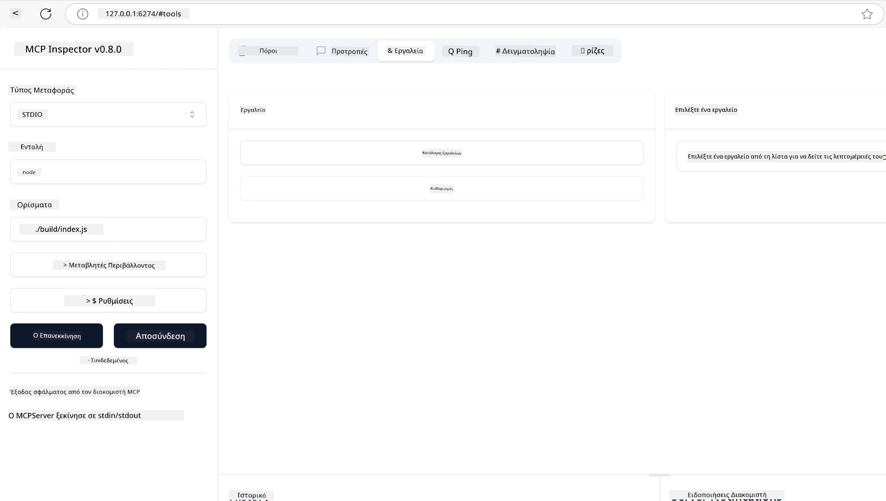
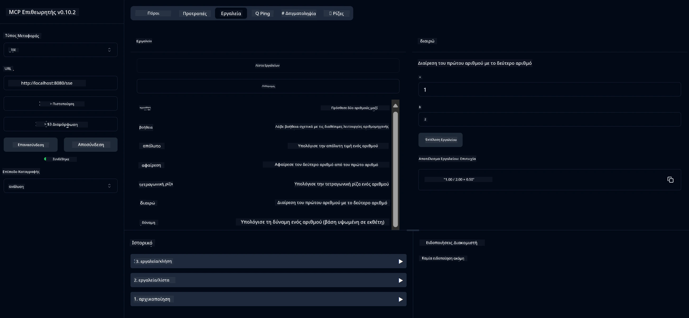
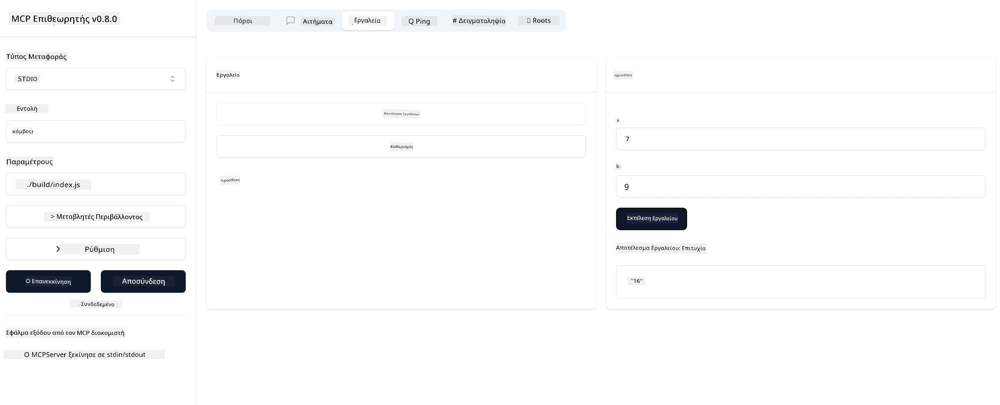

# Ξεκινώντας με το MCP

Καλώς ήρθατε στα πρώτα σας βήματα με το Model Context Protocol (MCP)! Είτε είστε νέοι στο MCP είτε θέλετε να εμβαθύνετε την κατανόησή σας, αυτός ο οδηγός θα σας καθοδηγήσει στη βασική διαδικασία εγκατάστασης και ανάπτυξης. Θα ανακαλύψετε πώς το MCP επιτρέπει την απρόσκοπτη ενσωμάτωση μεταξύ μοντέλων AI και εφαρμογών, και θα μάθετε πώς να προετοιμάσετε γρήγορα το περιβάλλον σας για την κατασκευή και δοκιμή λύσεων με υποστήριξη MCP.

> TLDR; Αν δημιουργείτε εφαρμογές AI, γνωρίζετε ότι μπορείτε να προσθέσετε εργαλεία και άλλους πόρους στο LLM (μεγάλο γλωσσικό μοντέλο), για να κάνετε το LLM πιο ενημερωμένο. Ωστόσο, αν τοποθετήσετε αυτά τα εργαλεία και πόρους σε έναν διακομιστή, οι δυνατότητες της εφαρμογής και του διακομιστή μπορούν να χρησιμοποιηθούν από οποιονδήποτε πελάτη με/χωρίς LLM.

## Επισκόπηση

Αυτό το μάθημα παρέχει πρακτικές οδηγίες για τη ρύθμιση περιβαλλόντων MCP και την κατασκευή των πρώτων εφαρμογών MCP. Θα μάθετε πώς να ρυθμίζετε τα απαραίτητα εργαλεία και πλαίσια, να δημιουργείτε βασικούς MCP διακομιστές, να φτιάχνετε εφαρμογές υποδοχής και να δοκιμάζετε τις υλοποιήσεις σας.

Το Model Context Protocol (MCP) είναι ένα ανοιχτό πρωτόκολλο που τυποποιεί τον τρόπο με τον οποίο οι εφαρμογές παρέχουν πλαίσιο στα LLM. Σκεφτείτε το MCP σαν μια θύρα USB-C για εφαρμογές AI - παρέχει έναν τυποποιημένο τρόπο σύνδεσης μοντέλων AI με διαφορετικές πηγές δεδομένων και εργαλεία.

## Στόχοι Μάθησης

Στο τέλος αυτού του μαθήματος, θα μπορείτε να:

- Ρυθμίζετε περιβάλλοντα ανάπτυξης για MCP σε C#, Java, Python, TypeScript και Rust
- Δημιουργείτε και αναπτύσσετε βασικούς MCP διακομιστές με προσαρμοσμένες λειτουργίες (πόροι, προτροπές και εργαλεία)
- Δημιουργείτε εφαρμογές υποδοχής που συνδέονται με MCP διακομιστές
- Δοκιμάζετε και αποσφαλματώνετε υλοποιήσεις MCP

## Ρύθμιση του Περιβάλλοντος MCP

Πριν ξεκινήσετε να εργάζεστε με το MCP, είναι σημαντικό να προετοιμάσετε το περιβάλλον ανάπτυξής σας και να κατανοήσετε τη βασική ροή εργασίας. Αυτή η ενότητα θα σας καθοδηγήσει στα αρχικά βήματα ρύθμισης για να εξασφαλίσετε μια ομαλή εκκίνηση με το MCP.

### Προαπαιτούμενα

Πριν βουτήξετε στην ανάπτυξη MCP, βεβαιωθείτε ότι έχετε:

- **Περιβάλλον Ανάπτυξης**: Για τη γλώσσα που έχετε επιλέξει (C#, Java, Python, TypeScript ή Rust)
- **IDE/Επεξεργαστή**: Visual Studio, Visual Studio Code, IntelliJ, Eclipse, PyCharm ή οποιονδήποτε σύγχρονο επεξεργαστή κώδικα
- **Διαχειριστές Πακέτων**: NuGet, Maven/Gradle, pip, npm/yarn ή Cargo
- **Κλειδιά API**: Για οποιεσδήποτε υπηρεσίες AI σκοπεύετε να χρησιμοποιήσετε στις εφαρμογές υποδοχής σας

## Βασική Δομή MCP Διακομιστή

Ένας MCP διακομιστής συνήθως περιλαμβάνει:

- **Διαμόρφωση Διακομιστή**: Ρύθμιση θύρας, αυθεντικοποίησης και άλλων ρυθμίσεων
- **Πόροι**: Δεδομένα και πλαίσιο διαθέσιμα στα LLM
- **Εργαλεία**: Λειτουργικότητα που μπορούν να καλούν τα μοντέλα
- **Προτροπές**: Πρότυπα για τη δημιουργία ή τη δομή κειμένου

Ακολουθεί ένα απλοποιημένο παράδειγμα σε TypeScript:

```typescript
import { McpServer, ResourceTemplate } from "@modelcontextprotocol/sdk/server/mcp.js";
import { StdioServerTransport } from "@modelcontextprotocol/sdk/server/stdio.js";
import { z } from "zod";

// Δημιουργήστε έναν διακομιστή MCP
const server = new McpServer({
  name: "Demo",
  version: "1.0.0"
});

// Προσθέστε ένα εργαλείο πρόσθεσης
server.tool("add",
  { a: z.number(), b: z.number() },
  async ({ a, b }) => ({
    content: [{ type: "text", text: String(a + b) }]
  })
);

// Προσθέστε μια δυναμική πηγή χαιρετισμού
server.resource(
  "file",
  // Η παράμετρος 'list' ελέγχει πώς η πηγή απαριθμεί τα διαθέσιμα αρχεία. Η ρύθμιση σε undefined απενεργοποιεί την απαρίθμηση για αυτήν την πηγή.
  new ResourceTemplate("file://{path}", { list: undefined }),
  async (uri, { path }) => ({
    contents: [{
      uri: uri.href,
      text: `File, ${path}!`
    }]
  })
);

// Προσθέστε μια πηγή αρχείου που διαβάζει τα περιεχόμενα του αρχείου
server.resource(
  "file",
  new ResourceTemplate("file://{path}", { list: undefined }),
  async (uri, { path }) => {
    let text;
    try {
      text = await fs.readFile(path, "utf8");
    } catch (err) {
      text = `Error reading file: ${err.message}`;
    }
    return {
      contents: [{
        uri: uri.href,
        text
      }]
    };
  }
);

server.prompt(
  "review-code",
  { code: z.string() },
  ({ code }) => ({
    messages: [{
      role: "user",
      content: {
        type: "text",
        text: `Please review this code:\n\n${code}`
      }
    }]
  })
);

// Ξεκινήστε τη λήψη μηνυμάτων από το stdin και την αποστολή μηνυμάτων στο stdout
const transport = new StdioServerTransport();
await server.connect(transport);
```

Στον παραπάνω κώδικα:

- Εισάγουμε τις απαραίτητες κλάσεις από το MCP TypeScript SDK.
- Δημιουργούμε και διαμορφώνουμε μια νέα παρουσία MCP διακομιστή.
- Καταχωρούμε ένα προσαρμοσμένο εργαλείο (`calculator`) με μια συνάρτηση χειρισμού.
- Ξεκινάμε τον διακομιστή για να ακούει εισερχόμενα αιτήματα MCP.

## Δοκιμές και Αποσφαλμάτωση

Πριν ξεκινήσετε να δοκιμάζετε τον MCP διακομιστή σας, είναι σημαντικό να κατανοήσετε τα διαθέσιμα εργαλεία και τις βέλτιστες πρακτικές για αποσφαλμάτωση. Η αποτελεσματική δοκιμή εξασφαλίζει ότι ο διακομιστής σας συμπεριφέρεται όπως αναμένεται και σας βοηθά να εντοπίσετε και να επιλύσετε γρήγορα προβλήματα. Η επόμενη ενότητα περιγράφει προτεινόμενες προσεγγίσεις για την επικύρωση της υλοποίησης MCP.

Το MCP παρέχει εργαλεία για να σας βοηθήσει να δοκιμάσετε και να αποσφαλματώσετε τους διακομιστές σας:

- **Εργαλείο Inspector**, αυτή η γραφική διεπαφή σας επιτρέπει να συνδεθείτε στον διακομιστή σας και να δοκιμάσετε τα εργαλεία, τις προτροπές και τους πόρους σας.
- **curl**, μπορείτε επίσης να συνδεθείτε στον διακομιστή σας χρησιμοποιώντας ένα εργαλείο γραμμής εντολών όπως το curl ή άλλους πελάτες που μπορούν να δημιουργήσουν και να εκτελέσουν εντολές HTTP.

### Χρήση του MCP Inspector

Το [MCP Inspector](https://github.com/modelcontextprotocol/inspector) είναι ένα οπτικό εργαλείο δοκιμών που σας βοηθά να:

1. **Ανακαλύψετε τις Δυνατότητες του Διακομιστή**: Αυτόματη ανίχνευση διαθέσιμων πόρων, εργαλείων και προτροπών
2. **Δοκιμάσετε την Εκτέλεση Εργαλείων**: Δοκιμάστε διαφορετικές παραμέτρους και δείτε τις απαντήσεις σε πραγματικό χρόνο
3. **Προβάλετε Μεταδεδομένα Διακομιστή**: Εξετάστε πληροφορίες διακομιστή, σχήματα και ρυθμίσεις

```bash
# από TypeScript, εγκατάσταση και εκτέλεση MCP Inspector
npx @modelcontextprotocol/inspector node build/index.js
```

Όταν εκτελέσετε τις παραπάνω εντολές, ο MCP Inspector θα ξεκινήσει μια τοπική διεπαφή ιστού στον περιηγητή σας. Μπορείτε να περιμένετε να δείτε έναν πίνακα ελέγχου που εμφανίζει τους καταχωρημένους MCP διακομιστές σας, τα διαθέσιμα εργαλεία, πόρους και προτροπές τους. Η διεπαφή σας επιτρέπει να δοκιμάζετε διαδραστικά την εκτέλεση εργαλείων, να επιθεωρείτε τα μεταδεδομένα του διακομιστή και να βλέπετε απαντήσεις σε πραγματικό χρόνο, καθιστώντας ευκολότερη την επικύρωση και αποσφαλμάτωση των υλοποιήσεων MCP διακομιστή σας.

Ακολουθεί ένα στιγμιότυπο οθόνης του πώς μπορεί να μοιάζει:



## Συνηθισμένα Προβλήματα Ρύθμισης και Λύσεις

| Πρόβλημα | Πιθανή Λύση |
|----------|-------------|
| Απόρριψη σύνδεσης | Ελέγξτε αν ο διακομιστής τρέχει και αν η θύρα είναι σωστή |
| Σφάλματα εκτέλεσης εργαλείου | Επανεξετάστε την επικύρωση παραμέτρων και τη διαχείριση σφαλμάτων |
| Αποτυχίες αυθεντικοποίησης | Επαληθεύστε τα κλειδιά API και τα δικαιώματα |
| Σφάλματα επικύρωσης σχήματος | Βεβαιωθείτε ότι οι παράμετροι ταιριάζουν με το ορισμένο σχήμα |
| Ο διακομιστής δεν ξεκινά | Ελέγξτε για συγκρούσεις θυρών ή ελλείποντες εξαρτήσεις |
| Σφάλματα CORS | Διαμορφώστε σωστά τις κεφαλίδες CORS για αιτήματα από άλλες προελεύσεις |
| Προβλήματα αυθεντικοποίησης | Επαληθεύστε την εγκυρότητα του token και τα δικαιώματα |

## Τοπική Ανάπτυξη

Για τοπική ανάπτυξη και δοκιμές, μπορείτε να τρέξετε MCP διακομιστές απευθείας στον υπολογιστή σας:

1. **Ξεκινήστε τη διαδικασία διακομιστή**: Εκτελέστε την εφαρμογή MCP διακομιστή σας
2. **Διαμορφώστε το δίκτυο**: Βεβαιωθείτε ότι ο διακομιστής είναι προσβάσιμος στη αναμενόμενη θύρα
3. **Συνδέστε πελάτες**: Χρησιμοποιήστε τοπικά URLs σύνδεσης όπως `http://localhost:3000`

```bash
# Παράδειγμα: Εκτέλεση ενός TypeScript MCP διακομιστή τοπικά
npm run start
# Ο διακομιστής τρέχει στο http://localhost:3000
```

## Δημιουργία του πρώτου σας MCP Διακομιστή

Έχουμε καλύψει τα [Βασικά Στοιχεία](/01-CoreConcepts/README.md) σε προηγούμενο μάθημα, τώρα είναι ώρα να εφαρμόσουμε αυτή τη γνώση.

### Τι μπορεί να κάνει ένας διακομιστής

Πριν ξεκινήσουμε να γράφουμε κώδικα, ας θυμηθούμε τι μπορεί να κάνει ένας διακομιστής:

Ένας MCP διακομιστής μπορεί, για παράδειγμα:

- Να έχει πρόσβαση σε τοπικά αρχεία και βάσεις δεδομένων
- Να συνδέεται με απομακρυσμένα APIs
- Να εκτελεί υπολογισμούς
- Να ενσωματώνεται με άλλα εργαλεία και υπηρεσίες
- Να παρέχει διεπαφή χρήστη για αλληλεπίδραση

Τέλεια, τώρα που ξέρουμε τι μπορεί να κάνει, ας ξεκινήσουμε τον κώδικα.

## Άσκηση: Δημιουργία διακομιστή

Για να δημιουργήσετε έναν διακομιστή, πρέπει να ακολουθήσετε τα εξής βήματα:

- Εγκαταστήστε το MCP SDK.
- Δημιουργήστε ένα έργο και ρυθμίστε τη δομή του έργου.
- Γράψτε τον κώδικα του διακομιστή.
- Δοκιμάστε τον διακομιστή.

### -1- Δημιουργία έργου

#### TypeScript

```sh
# Δημιουργήστε τον κατάλογο έργου και αρχικοποιήστε το έργο npm
mkdir calculator-server
cd calculator-server
npm init -y
```

#### Python

```sh
# Δημιουργήστε τον φάκελο έργου
mkdir calculator-server
cd calculator-server
# Ανοίξτε το φάκελο στο Visual Studio Code - Παραλείψτε αυτό αν χρησιμοποιείτε διαφορετικό IDE
code .
```

#### .NET

```sh
dotnet new console -n McpCalculatorServer
cd McpCalculatorServer
```

#### Java

Για Java, δημιουργήστε ένα έργο Spring Boot:

```bash
curl https://start.spring.io/starter.zip \
  -d dependencies=web \
  -d javaVersion=21 \
  -d type=maven-project \
  -d groupId=com.example \
  -d artifactId=calculator-server \
  -d name=McpServer \
  -d packageName=com.microsoft.mcp.sample.server \
  -o calculator-server.zip
```

Αποσυμπιέστε το αρχείο zip:

```bash
unzip calculator-server.zip -d calculator-server
cd calculator-server
# προαιρετικά αφαιρέστε τη μη χρησιμοποιημένη δοκιμή
rm -rf src/test/java
```

Προσθέστε την παρακάτω πλήρη διαμόρφωση στο αρχείο *pom.xml*:

```xml
<?xml version="1.0" encoding="UTF-8"?>
<project xmlns="http://maven.apache.org/POM/4.0.0"
    xmlns:xsi="http://www.w3.org/2001/XMLSchema-instance"
    xsi:schemaLocation="http://maven.apache.org/POM/4.0.0 http://maven.apache.org/xsd/maven-4.0.0.xsd">
    <modelVersion>4.0.0</modelVersion>
    
    <!-- Spring Boot parent for dependency management -->
    <parent>
        <groupId>org.springframework.boot</groupId>
        <artifactId>spring-boot-starter-parent</artifactId>
        <version>3.5.0</version>
        <relativePath />
    </parent>

    <!-- Project coordinates -->
    <groupId>com.example</groupId>
    <artifactId>calculator-server</artifactId>
    <version>0.0.1-SNAPSHOT</version>
    <name>Calculator Server</name>
    <description>Basic calculator MCP service for beginners</description>

    <!-- Properties -->
    <properties>
        <java.version>21</java.version>
        <maven.compiler.source>21</maven.compiler.source>
        <maven.compiler.target>21</maven.compiler.target>
    </properties>

    <!-- Spring AI BOM for version management -->
    <dependencyManagement>
        <dependencies>
            <dependency>
                <groupId>org.springframework.ai</groupId>
                <artifactId>spring-ai-bom</artifactId>
                <version>1.0.0-SNAPSHOT</version>
                <type>pom</type>
                <scope>import</scope>
            </dependency>
        </dependencies>
    </dependencyManagement>

    <!-- Dependencies -->
    <dependencies>
        <dependency>
            <groupId>org.springframework.ai</groupId>
            <artifactId>spring-ai-starter-mcp-server-webflux</artifactId>
        </dependency>
        <dependency>
            <groupId>org.springframework.boot</groupId>
            <artifactId>spring-boot-starter-actuator</artifactId>
        </dependency>
        <dependency>
         <groupId>org.springframework.boot</groupId>
         <artifactId>spring-boot-starter-test</artifactId>
         <scope>test</scope>
      </dependency>
    </dependencies>

    <!-- Build configuration -->
    <build>
        <plugins>
            <plugin>
                <groupId>org.springframework.boot</groupId>
                <artifactId>spring-boot-maven-plugin</artifactId>
            </plugin>
            <plugin>
                <groupId>org.apache.maven.plugins</groupId>
                <artifactId>maven-compiler-plugin</artifactId>
                <configuration>
                    <release>21</release>
                </configuration>
            </plugin>
        </plugins>
    </build>

    <!-- Repositories for Spring AI snapshots -->
    <repositories>
        <repository>
            <id>spring-milestones</id>
            <name>Spring Milestones</name>
            <url>https://repo.spring.io/milestone</url>
            <snapshots>
                <enabled>false</enabled>
            </snapshots>
        </repository>
        <repository>
            <id>spring-snapshots</id>
            <name>Spring Snapshots</name>
            <url>https://repo.spring.io/snapshot</url>
            <releases>
                <enabled>false</enabled>
            </releases>
        </repository>
    </repositories>
</project>
```

#### Rust

```sh
mkdir calculator-server
cd calculator-server
cargo init
```

### -2- Προσθήκη εξαρτήσεων

Τώρα που έχετε δημιουργήσει το έργο σας, ας προσθέσουμε τις εξαρτήσεις:

#### TypeScript

```sh
# Εάν δεν είναι ήδη εγκατεστημένο, εγκαταστήστε το TypeScript παγκοσμίως
npm install typescript -g

# Εγκαταστήστε το MCP SDK και το Zod για επικύρωση σχήματος
npm install @modelcontextprotocol/sdk zod
npm install -D @types/node typescript
```

#### Python

```sh
# Δημιουργήστε ένα εικονικό περιβάλλον και εγκαταστήστε τις εξαρτήσεις
python -m venv venv
venv\Scripts\activate
pip install "mcp[cli]"
```

#### Java

```bash
cd calculator-server
./mvnw clean install -DskipTests
```

#### Rust

```sh
cargo add rmcp --features server,transport-io
cargo add serde
cargo add tokio --features rt-multi-thread
```

### -3- Δημιουργία αρχείων έργου

#### TypeScript

Ανοίξτε το αρχείο *package.json* και αντικαταστήστε το περιεχόμενο με το παρακάτω για να εξασφαλίσετε ότι μπορείτε να χτίσετε και να τρέξετε τον διακομιστή:

```json
{
  "name": "calculator-server",
  "version": "1.0.0",
  "main": "index.js",
  "type": "module",
  "scripts": {
    "build": "tsc",
    "start": "npm run build && node ./build/index.js",
  },
  "keywords": [],
  "author": "",
  "license": "ISC",
  "description": "A simple calculator server using Model Context Protocol",
  "dependencies": {
    "@modelcontextprotocol/sdk": "^1.16.0",
    "zod": "^3.25.76"
  },
  "devDependencies": {
    "@types/node": "^24.0.14",
    "typescript": "^5.8.3"
  }
}
```

Δημιουργήστε ένα *tsconfig.json* με το παρακάτω περιεχόμενο:

```json
{
  "compilerOptions": {
    "target": "ES2022",
    "module": "Node16",
    "moduleResolution": "Node16",
    "outDir": "./build",
    "rootDir": "./src",
    "strict": true,
    "esModuleInterop": true,
    "skipLibCheck": true,
    "forceConsistentCasingInFileNames": true
  },
  "include": ["src/**/*"],
  "exclude": ["node_modules"]
}
```

Δημιουργήστε έναν φάκελο για τον πηγαίο κώδικα:

```sh
mkdir src
touch src/index.ts
```

#### Python

Δημιουργήστε ένα αρχείο *server.py*

```sh
touch server.py
```

#### .NET

Εγκαταστήστε τα απαιτούμενα πακέτα NuGet:

```sh
dotnet add package ModelContextProtocol --prerelease
dotnet add package Microsoft.Extensions.Hosting
```

#### Java

Για έργα Java Spring Boot, η δομή του έργου δημιουργείται αυτόματα.

#### Rust

Για Rust, ένα αρχείο *src/main.rs* δημιουργείται από προεπιλογή όταν τρέχετε `cargo init`. Ανοίξτε το αρχείο και διαγράψτε τον προεπιλεγμένο κώδικα.

### -4- Δημιουργία κώδικα διακομιστή

#### TypeScript

Δημιουργήστε ένα αρχείο *index.ts* και προσθέστε τον παρακάτω κώδικα:

```typescript
import { McpServer, ResourceTemplate } from "@modelcontextprotocol/sdk/server/mcp.js";
import { StdioServerTransport } from "@modelcontextprotocol/sdk/server/stdio.js";
import { z } from "zod";
 
// Δημιουργήστε έναν διακομιστή MCP
const server = new McpServer({
  name: "Calculator MCP Server",
  version: "1.0.0"
});
```

Τώρα έχετε έναν διακομιστή, αλλά δεν κάνει πολλά, ας το διορθώσουμε.

#### Python

```python
# server.py
from mcp.server.fastmcp import FastMCP

# Δημιουργήστε έναν διακομιστή MCP
mcp = FastMCP("Demo")
```

#### .NET

```csharp
using Microsoft.Extensions.DependencyInjection;
using Microsoft.Extensions.Hosting;
using Microsoft.Extensions.Logging;
using ModelContextProtocol.Server;
using System.ComponentModel;

var builder = Host.CreateApplicationBuilder(args);
builder.Logging.AddConsole(consoleLogOptions =>
{
    // Configure all logs to go to stderr
    consoleLogOptions.LogToStandardErrorThreshold = LogLevel.Trace;
});

builder.Services
    .AddMcpServer()
    .WithStdioServerTransport()
    .WithToolsFromAssembly();
await builder.Build().RunAsync();

// add features
```

#### Java

Για Java, δημιουργήστε τα βασικά στοιχεία του διακομιστή. Πρώτα, τροποποιήστε την κύρια κλάση εφαρμογής:

*src/main/java/com/microsoft/mcp/sample/server/McpServerApplication.java*:

```java
package com.microsoft.mcp.sample.server;

import org.springframework.ai.tool.ToolCallbackProvider;
import org.springframework.ai.tool.method.MethodToolCallbackProvider;
import org.springframework.boot.SpringApplication;
import org.springframework.boot.autoconfigure.SpringBootApplication;
import org.springframework.context.annotation.Bean;
import com.microsoft.mcp.sample.server.service.CalculatorService;

@SpringBootApplication
public class McpServerApplication {

    public static void main(String[] args) {
        SpringApplication.run(McpServerApplication.class, args);
    }
    
    @Bean
    public ToolCallbackProvider calculatorTools(CalculatorService calculator) {
        return MethodToolCallbackProvider.builder().toolObjects(calculator).build();
    }
}
```

Δημιουργήστε την υπηρεσία calculator *src/main/java/com/microsoft/mcp/sample/server/service/CalculatorService.java*:

```java
package com.microsoft.mcp.sample.server.service;

import org.springframework.ai.tool.annotation.Tool;
import org.springframework.stereotype.Service;

/**
 * Service for basic calculator operations.
 * This service provides simple calculator functionality through MCP.
 */
@Service
public class CalculatorService {

    /**
     * Add two numbers
     * @param a The first number
     * @param b The second number
     * @return The sum of the two numbers
     */
    @Tool(description = "Add two numbers together")
    public String add(double a, double b) {
        double result = a + b;
        return formatResult(a, "+", b, result);
    }

    /**
     * Subtract one number from another
     * @param a The number to subtract from
     * @param b The number to subtract
     * @return The result of the subtraction
     */
    @Tool(description = "Subtract the second number from the first number")
    public String subtract(double a, double b) {
        double result = a - b;
        return formatResult(a, "-", b, result);
    }

    /**
     * Multiply two numbers
     * @param a The first number
     * @param b The second number
     * @return The product of the two numbers
     */
    @Tool(description = "Multiply two numbers together")
    public String multiply(double a, double b) {
        double result = a * b;
        return formatResult(a, "*", b, result);
    }

    /**
     * Divide one number by another
     * @param a The numerator
     * @param b The denominator
     * @return The result of the division
     */
    @Tool(description = "Divide the first number by the second number")
    public String divide(double a, double b) {
        if (b == 0) {
            return "Error: Cannot divide by zero";
        }
        double result = a / b;
        return formatResult(a, "/", b, result);
    }

    /**
     * Calculate the power of a number
     * @param base The base number
     * @param exponent The exponent
     * @return The result of raising the base to the exponent
     */
    @Tool(description = "Calculate the power of a number (base raised to an exponent)")
    public String power(double base, double exponent) {
        double result = Math.pow(base, exponent);
        return formatResult(base, "^", exponent, result);
    }

    /**
     * Calculate the square root of a number
     * @param number The number to find the square root of
     * @return The square root of the number
     */
    @Tool(description = "Calculate the square root of a number")
    public String squareRoot(double number) {
        if (number < 0) {
            return "Error: Cannot calculate square root of a negative number";
        }
        double result = Math.sqrt(number);
        return String.format("√%.2f = %.2f", number, result);
    }

    /**
     * Calculate the modulus (remainder) of division
     * @param a The dividend
     * @param b The divisor
     * @return The remainder of the division
     */
    @Tool(description = "Calculate the remainder when one number is divided by another")
    public String modulus(double a, double b) {
        if (b == 0) {
            return "Error: Cannot divide by zero";
        }
        double result = a % b;
        return formatResult(a, "%", b, result);
    }

    /**
     * Calculate the absolute value of a number
     * @param number The number to find the absolute value of
     * @return The absolute value of the number
     */
    @Tool(description = "Calculate the absolute value of a number")
    public String absolute(double number) {
        double result = Math.abs(number);
        return String.format("|%.2f| = %.2f", number, result);
    }

    /**
     * Get help about available calculator operations
     * @return Information about available operations
     */
    @Tool(description = "Get help about available calculator operations")
    public String help() {
        return "Basic Calculator MCP Service\n\n" +
               "Available operations:\n" +
               "1. add(a, b) - Adds two numbers\n" +
               "2. subtract(a, b) - Subtracts the second number from the first\n" +
               "3. multiply(a, b) - Multiplies two numbers\n" +
               "4. divide(a, b) - Divides the first number by the second\n" +
               "5. power(base, exponent) - Raises a number to a power\n" +
               "6. squareRoot(number) - Calculates the square root\n" + 
               "7. modulus(a, b) - Calculates the remainder of division\n" +
               "8. absolute(number) - Calculates the absolute value\n\n" +
               "Example usage: add(5, 3) will return 5 + 3 = 8";
    }

    /**
     * Format the result of a calculation
     */
    private String formatResult(double a, String operator, double b, double result) {
        return String.format("%.2f %s %.2f = %.2f", a, operator, b, result);
    }
}
```

**Προαιρετικά στοιχεία για μια υπηρεσία έτοιμη για παραγωγή:**

Δημιουργήστε μια ρύθμιση εκκίνησης *src/main/java/com/microsoft/mcp/sample/server/config/StartupConfig.java*:

```java
package com.microsoft.mcp.sample.server.config;

import org.springframework.boot.CommandLineRunner;
import org.springframework.context.annotation.Bean;
import org.springframework.context.annotation.Configuration;

@Configuration
public class StartupConfig {
    
    @Bean
    public CommandLineRunner startupInfo() {
        return args -> {
            System.out.println("\n" + "=".repeat(60));
            System.out.println("Calculator MCP Server is starting...");
            System.out.println("SSE endpoint: http://localhost:8080/sse");
            System.out.println("Health check: http://localhost:8080/actuator/health");
            System.out.println("=".repeat(60) + "\n");
        };
    }
}
```

Δημιουργήστε έναν ελεγκτή υγείας *src/main/java/com/microsoft/mcp/sample/server/controller/HealthController.java*:

```java
package com.microsoft.mcp.sample.server.controller;

import org.springframework.http.ResponseEntity;
import org.springframework.web.bind.annotation.GetMapping;
import org.springframework.web.bind.annotation.RestController;
import java.time.LocalDateTime;
import java.util.HashMap;
import java.util.Map;

@RestController
public class HealthController {
    
    @GetMapping("/health")
    public ResponseEntity<Map<String, Object>> healthCheck() {
        Map<String, Object> response = new HashMap<>();
        response.put("status", "UP");
        response.put("timestamp", LocalDateTime.now().toString());
        response.put("service", "Calculator MCP Server");
        return ResponseEntity.ok(response);
    }
}
```

Δημιουργήστε έναν χειριστή εξαιρέσεων *src/main/java/com/microsoft/mcp/sample/server/exception/GlobalExceptionHandler.java*:

```java
package com.microsoft.mcp.sample.server.exception;

import org.springframework.http.HttpStatus;
import org.springframework.http.ResponseEntity;
import org.springframework.web.bind.annotation.ExceptionHandler;
import org.springframework.web.bind.annotation.RestControllerAdvice;

@RestControllerAdvice
public class GlobalExceptionHandler {

    @ExceptionHandler(IllegalArgumentException.class)
    public ResponseEntity<ErrorResponse> handleIllegalArgumentException(IllegalArgumentException ex) {
        ErrorResponse error = new ErrorResponse(
            "Invalid_Input", 
            "Invalid input parameter: " + ex.getMessage());
        return new ResponseEntity<>(error, HttpStatus.BAD_REQUEST);
    }

    public static class ErrorResponse {
        private String code;
        private String message;

        public ErrorResponse(String code, String message) {
            this.code = code;
            this.message = message;
        }

        // Μέθοδοι ανάκτησης δεδομένων
        public String getCode() { return code; }
        public String getMessage() { return message; }
    }
}
```

Δημιουργήστε ένα προσαρμοσμένο banner *src/main/resources/banner.txt*:

```text
_____      _            _       _             
 / ____|    | |          | |     | |            
| |     __ _| | ___ _   _| | __ _| |_ ___  _ __ 
| |    / _` | |/ __| | | | |/ _` | __/ _ \| '__|
| |___| (_| | | (__| |_| | | (_| | || (_) | |   
 \_____\__,_|_|\___|\__,_|_|\__,_|\__\___/|_|   
                                                
Calculator MCP Server v1.0
Spring Boot MCP Application
```

</details>

#### Rust

Προσθέστε τον παρακάτω κώδικα στην κορυφή του αρχείου *src/main.rs*. Αυτό εισάγει τις απαραίτητες βιβλιοθήκες και μονάδες για τον MCP διακομιστή σας.

```rust
use rmcp::{
    handler::server::{router::tool::ToolRouter, tool::Parameters},
    model::{ServerCapabilities, ServerInfo},
    schemars, tool, tool_handler, tool_router,
    transport::stdio,
    ServerHandler, ServiceExt,
};
use std::error::Error;
```

Ο διακομιστής calculator θα είναι απλός και θα μπορεί να προσθέτει δύο αριθμούς. Ας δημιουργήσουμε μια δομή για να αναπαριστά το αίτημα calculator.

```rust
#[derive(Debug, serde::Deserialize, schemars::JsonSchema)]
pub struct CalculatorRequest {
    pub a: f64,
    pub b: f64,
}
```

Στη συνέχεια, δημιουργήστε μια δομή για να αναπαριστά τον διακομιστή calculator. Αυτή η δομή θα κρατά τον δρομολογητή εργαλείων, που χρησιμοποιείται για την καταχώρηση εργαλείων.

```rust
#[derive(Debug, Clone)]
pub struct Calculator {
    tool_router: ToolRouter<Self>,
}
```

Τώρα, μπορούμε να υλοποιήσουμε τη δομή `Calculator` για να δημιουργήσουμε μια νέα παρουσία του διακομιστή και να υλοποιήσουμε τον χειριστή διακομιστή για να παρέχουμε πληροφορίες διακομιστή.

```rust
#[tool_router]
impl Calculator {
    pub fn new() -> Self {
        Self {
            tool_router: Self::tool_router(),
        }
    }
}

#[tool_handler]
impl ServerHandler for Calculator {
    fn get_info(&self) -> ServerInfo {
        ServerInfo {
            instructions: Some("A simple calculator tool".into()),
            capabilities: ServerCapabilities::builder().enable_tools().build(),
            ..Default::default()
        }
    }
}
```

Τέλος, πρέπει να υλοποιήσουμε τη βασική συνάρτηση για να ξεκινήσει ο διακομιστής. Αυτή η συνάρτηση θα δημιουργήσει μια παρουσία της δομής `Calculator` και θα την εξυπηρετήσει μέσω τυπικής εισόδου/εξόδου.

```rust
#[tokio::main]
async fn main() -> Result<(), Box<dyn Error>> {
    let service = Calculator::new().serve(stdio()).await?;
    service.waiting().await?;
    Ok(())
}
```

Ο διακομιστής είναι τώρα ρυθμισμένος να παρέχει βασικές πληροφορίες για τον εαυτό του. Στη συνέχεια, θα προσθέσουμε ένα εργαλείο για να εκτελεί πρόσθεση.

### -5- Προσθήκη εργαλείου και πόρου

Προσθέστε ένα εργαλείο και έναν πόρο προσθέτοντας τον παρακάτω κώδικα:

#### TypeScript

```typescript
server.tool(
  "add",
  { a: z.number(), b: z.number() },
  async ({ a, b }) => ({
    content: [{ type: "text", text: String(a + b) }]
  })
);

server.resource(
  "greeting",
  new ResourceTemplate("greeting://{name}", { list: undefined }),
  async (uri, { name }) => ({
    contents: [{
      uri: uri.href,
      text: `Hello, ${name}!`
    }]
  })
);
```

Το εργαλείο σας παίρνει παραμέτρους `a` και `b` και εκτελεί μια συνάρτηση που παράγει μια απάντηση στη μορφή:

```typescript
{
  contents: [{
    type: "text", content: "some content"
  }]
}
```

Ο πόρος σας προσπελαύνεται μέσω της συμβολοσειράς "greeting" και παίρνει μια παράμετρο `name` και παράγει μια παρόμοια απάντηση με το εργαλείο:

```typescript
{
  uri: "<href>",
  text: "a text"
}
```

#### Python

```python
# Προσθέστε ένα εργαλείο πρόσθεσης
@mcp.tool()
def add(a: int, b: int) -> int:
    """Add two numbers"""
    return a + b


# Προσθέστε μια δυναμική πηγή χαιρετισμού
@mcp.resource("greeting://{name}")
def get_greeting(name: str) -> str:
    """Get a personalized greeting"""
    return f"Hello, {name}!"
```

Στον παραπάνω κώδικα έχουμε:

- Ορίσει ένα εργαλείο `add` που παίρνει παραμέτρους `a` και `b`, και οι δύο ακέραιοι.
- Δημιουργήσει έναν πόρο με όνομα `greeting` που παίρνει παράμετρο `name`.

#### .NET

Προσθέστε αυτό στο αρχείο Program.cs:

```csharp
[McpServerToolType]
public static class CalculatorTool
{
    [McpServerTool, Description("Adds two numbers")]
    public static string Add(int a, int b) => $"Sum {a + b}";
}
```

#### Java

Τα εργαλεία έχουν ήδη δημιουργηθεί στο προηγούμενο βήμα.

#### Rust

Προσθέστε
βεβαιωθείτε ότι έχετε ορίσει `python` στο πεδίο `Command` και `server.py` ως `Arguments`. Αυτό διασφαλίζει ότι το σενάριο εκτελείται σωστά.

#### .NET

Βεβαιωθείτε ότι βρίσκεστε στον κατάλογο του έργου σας:

```sh
cd McpCalculatorServer
npx @modelcontextprotocol/inspector dotnet run
```

#### Java

Βεβαιωθείτε ότι ο διακομιστής calculator σας λειτουργεί
Στη συνέχεια, εκτελέστε τον επιθεωρητή:

```cmd
npx @modelcontextprotocol/inspector
```

Στην ιστοσελίδα του επιθεωρητή:

1. Επιλέξτε "SSE" ως τύπο μεταφοράς
2. Ορίστε το URL σε: `http://localhost:8080/sse`
3. Κάντε κλικ στο "Connect"



**Τώρα είστε συνδεδεμένοι με τον διακομιστή**
**Η ενότητα δοκιμής του Java διακομιστή ολοκληρώθηκε**

Η επόμενη ενότητα αφορά την αλληλεπίδραση με τον διακομιστή.

Θα πρέπει να δείτε την ακόλουθη διεπαφή χρήστη:


1. Συνδεθείτε με τον διακομιστή επιλέγοντας το κουμπί Connect
  Μόλις συνδεθείτε με τον διακομιστή, θα πρέπει να δείτε το εξής:

  

1. Επιλέξτε "Tools" και "listTools", θα πρέπει να εμφανιστεί το "Add", επιλέξτε "Add" και συμπληρώστε τις τιμές των παραμέτρων.

  Θα δείτε την ακόλουθη απάντηση, δηλαδή ένα αποτέλεσμα από το εργαλείο "add":

  

Συγχαρητήρια, καταφέρατε να δημιουργήσετε και να εκτελέσετε τον πρώτο σας διακομιστή!

#### Rust

Για να εκτελέσετε τον Rust διακομιστή με το MCP Inspector CLI, χρησιμοποιήστε την ακόλουθη εντολή:

```sh
npx @modelcontextprotocol/inspector cargo run --cli --method tools/call --tool-name add --tool-arg a=1 b=2
```

### Επίσημα SDKs

Το MCP παρέχει επίσημα SDKs για πολλές γλώσσες:

- [C# SDK](https://github.com/modelcontextprotocol/csharp-sdk) - Συντηρείται σε συνεργασία με τη Microsoft
- [Java SDK](https://github.com/modelcontextprotocol/java-sdk) - Συντηρείται σε συνεργασία με την Spring AI
- [TypeScript SDK](https://github.com/modelcontextprotocol/typescript-sdk) - Η επίσημη υλοποίηση TypeScript
- [Python SDK](https://github.com/modelcontextprotocol/python-sdk) - Η επίσημη υλοποίηση Python
- [Kotlin SDK](https://github.com/modelcontextprotocol/kotlin-sdk) - Η επίσημη υλοποίηση Kotlin
- [Swift SDK](https://github.com/modelcontextprotocol/swift-sdk) - Συντηρείται σε συνεργασία με την Loopwork AI
- [Rust SDK](https://github.com/modelcontextprotocol/rust-sdk) - Η επίσημη υλοποίηση Rust

## Βασικά Σημεία

- Η ρύθμιση ενός περιβάλλοντος ανάπτυξης MCP είναι απλή με τα γλωσσικά SDKs
- Η δημιουργία MCP διακομιστών περιλαμβάνει τη δημιουργία και καταχώρηση εργαλείων με σαφή σχήματα
- Οι δοκιμές και ο εντοπισμός σφαλμάτων είναι απαραίτητα για αξιόπιστες υλοποιήσεις MCP

## Παραδείγματα

- [Java Calculator](../samples/java/calculator/README.md)
- [.Net Calculator](../../../../03-GettingStarted/samples/csharp)
- [JavaScript Calculator](../samples/javascript/README.md)
- [TypeScript Calculator](../samples/typescript/README.md)
- [Python Calculator](../../../../03-GettingStarted/samples/python)
- [Rust Calculator](../../../../03-GettingStarted/samples/rust)

## Ανάθεση

Δημιουργήστε έναν απλό MCP διακομιστή με ένα εργαλείο της επιλογής σας:

1. Υλοποιήστε το εργαλείο στη γλώσσα που προτιμάτε (.NET, Java, Python, TypeScript ή Rust).
2. Ορίστε τις παραμέτρους εισόδου και τις τιμές επιστροφής.
3. Εκτελέστε το εργαλείο επιθεώρησης για να βεβαιωθείτε ότι ο διακομιστής λειτουργεί όπως αναμένεται.
4. Δοκιμάστε την υλοποίηση με διάφορες εισόδους.

## Λύση

[Solution](./solution/README.md)

## Πρόσθετοι Πόροι

- [Δημιουργία Agents με το Model Context Protocol στο Azure](https://learn.microsoft.com/azure/developer/ai/intro-agents-mcp)
- [Απομακρυσμένο MCP με Azure Container Apps (Node.js/TypeScript/JavaScript)](https://learn.microsoft.com/samples/azure-samples/mcp-container-ts/mcp-container-ts/)
- [.NET OpenAI MCP Agent](https://learn.microsoft.com/samples/azure-samples/openai-mcp-agent-dotnet/openai-mcp-agent-dotnet/)

## Τι ακολουθεί

Επόμενο: [Ξεκινώντας με τους MCP Clients](../02-client/README.md)

---

<!-- CO-OP TRANSLATOR DISCLAIMER START -->
**Αποποίηση ευθυνών**:  
Αυτό το έγγραφο έχει μεταφραστεί χρησιμοποιώντας την υπηρεσία αυτόματης μετάφρασης AI [Co-op Translator](https://github.com/Azure/co-op-translator). Παρόλο που επιδιώκουμε την ακρίβεια, παρακαλούμε να λάβετε υπόψη ότι οι αυτόματες μεταφράσεις ενδέχεται να περιέχουν λάθη ή ανακρίβειες. Το πρωτότυπο έγγραφο στη μητρική του γλώσσα πρέπει να θεωρείται η αυθεντική πηγή. Για κρίσιμες πληροφορίες, συνιστάται επαγγελματική ανθρώπινη μετάφραση. Δεν φέρουμε ευθύνη για τυχόν παρεξηγήσεις ή λανθασμένες ερμηνείες που προκύπτουν από τη χρήση αυτής της μετάφρασης.
<!-- CO-OP TRANSLATOR DISCLAIMER END -->