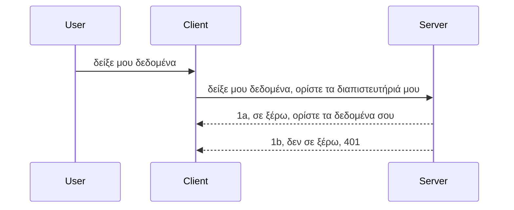

# Απλή αυθεντικοποίηση

Τα SDK MCP υποστηρίζουν τη χρήση του OAuth 2.1 που, για να είμαστε δίκαιοι, είναι μια αρκετά περίπλοκη διαδικασία που περιλαμβάνει έννοιες όπως διακομιστή αυθεντικοποίησης, διακομιστή πόρων, αποστολή στοιχείων πιστοποίησης, λήψη κωδικού, ανταλλαγή του κωδικού με ένα διακριτικό πρόσβασης μέχρι να μπορέσετε τελικά να λάβετε τα δεδομένα πόρων σας. Αν δεν είστε εξοικειωμένοι με το OAuth, το οποίο είναι κάτι πολύ καλό να υλοποιηθεί, είναι καλή ιδέα να ξεκινήσετε με κάποιο βασικό επίπεδο αυθεντικοποίησης και να προχωρήσετε σε καλύτερη και καλύτερη ασφάλεια. Γι' αυτό υπάρχει αυτό το κεφάλαιο, για να σας προετοιμάσει για πιο προηγμένη αυθεντικοποίηση.

## Αυθεντικοποίηση, τι εννοούμε;

Το Auth είναι συντομογραφία για την αυθεντικοποίηση και την εξουσιοδότηση. Η ιδέα είναι ότι πρέπει να κάνουμε δύο πράγματα:

- **Αυθεντικοποίηση**, που είναι η διαδικασία της διαπίστωσης αν επιτρέπουμε σε ένα άτομο να μπει στο σπίτι μας, ότι έχει το δικαίωμα να είναι "εδώ", δηλαδή να έχει πρόσβαση στον διακομιστή πόρων όπου ζουν οι δυνατότητες του MCP Server μας.
- **Εξουσιοδότηση**, είναι η διαδικασία να διαπιστώσουμε αν ένας χρήστης θα πρέπει να έχει πρόσβαση σε αυτούς τους συγκεκριμένους πόρους που ζητά, για παράδειγμα αυτές οι παραγγελίες ή αυτά τα προϊόντα ή αν του επιτρέπεται να διαβάζει το περιεχόμενο αλλά όχι να διαγράφει, ως ένα άλλο παράδειγμα.

## Πιστοποιητικά: πώς λέμε στο σύστημα ποιοι είμαστε

Λοιπόν, οι περισσότεροι προγραμματιστές ιστού αρχίζουν να σκέφτονται με όρους παροχής ενός πιστοποιητικού στον διακομιστή, συνήθως ενός μυστικού που λέει αν επιτρέπεται να βρίσκεται εδώ "Αυθεντικοποίηση". Αυτό το πιστοποιητικό είναι συνήθως μια κωδικοποιημένη σε base64 έκδοση του ονόματος χρήστη και του κωδικού πρόσβασης ή ένα κλειδί API που αναγνωρίζει μοναδικά έναν συγκεκριμένο χρήστη.

Αυτό περιλαμβάνει την αποστολή του μέσω ενός header που ονομάζεται "Authorization" ως εξής:

```json
{ "Authorization": "secret123" }
```

Αυτό αναφέρεται συνήθως ως βασική αυθεντικοποίηση. Πώς δουλεύει συνολικά η ροή στη συνέχεια είναι ως εξής:


Τώρα που καταλαβαίνουμε πως δουλεύει από άποψη ροής, πώς το υλοποιούμε; Λοιπόν, οι περισσότεροι web servers έχουν μια έννοια που ονομάζεται middleware, ένα κομμάτι κώδικα που τρέχει ως μέρος του αιτήματος και μπορεί να επαληθεύσει τα πιστοποιητικά, και αν τα πιστοποιητικά είναι έγκυρα μπορεί να αφήσει το αίτημα να περάσει. Αν το αίτημα δεν έχει έγκυρα πιστοποιητικά τότε λαμβάνετε σφάλμα αυθεντικοποίησης. Ας δούμε πώς μπορεί να υλοποιηθεί αυτό:

**Python**

```python
class AuthMiddleware(BaseHTTPMiddleware):
    async def dispatch(self, request, call_next):

        has_header = request.headers.get("Authorization")
        if not has_header:
            print("-> Missing Authorization header!")
            return Response(status_code=401, content="Unauthorized")

        if not valid_token(has_header):
            print("-> Invalid token!")
            return Response(status_code=403, content="Forbidden")

        print("Valid token, proceeding...")
       
        response = await call_next(request)
        # προσθέστε οποιεσδήποτε κεφαλίδες πελάτη ή αλλάξτε με κάποιο τρόπο την απόκριση
        return response


starlette_app.add_middleware(CustomHeaderMiddleware)
```

Εδώ έχουμε:

- Δημιουργήσει ένα middleware που ονομάζεται `AuthMiddleware` όπου η μέθοδος `dispatch` καλείται από τον web server.
- Προσθέσει το middleware στον web server:

    ```python
    starlette_app.add_middleware(AuthMiddleware)
    ```

- Γράψει λογική επικύρωσης που ελέγχει αν υπάρχει το header Authorization και αν το μυστικό που αποστέλλεται είναι έγκυρο:

    ```python
    has_header = request.headers.get("Authorization")
    if not has_header:
        print("-> Missing Authorization header!")
        return Response(status_code=401, content="Unauthorized")

    if not valid_token(has_header):
        print("-> Invalid token!")
        return Response(status_code=403, content="Forbidden")
    ```

    αν το μυστικό είναι παρόν και έγκυρο τότε αφήνουμε το αίτημα να περάσει καλώντας `call_next` και επιστρέφουμε την απόκριση.

    ```python
    response = await call_next(request)
    # προσθέστε οποιεσδήποτε κεφαλίδες πελάτη ή αλλάξτε την απόκριση με κάποιον τρόπο
    return response
    ```

Πώς δουλεύει είναι ότι αν γίνει ένα αίτημα web προς τον server τότε το middleware θα κληθεί και βάσει της υλοποίησής του είτε θα αφήσει το αίτημα να περάσει είτε θα επιστρέψει σφάλμα που υποδεικνύει ότι ο πελάτης δεν έχει δικαίωμα να προχωρήσει.

**TypeScript**

Εδώ δημιουργούμε ένα middleware με το δημοφιλές framework Express και παρεμβαίνουμε στο αίτημα πριν φτάσει στο MCP Server. Εδώ είναι ο κώδικας για αυτό:

```typescript
function isValid(secret) {
    return secret === "secret123";
}

app.use((req, res, next) => {
    // 1. Υπάρχει κεφαλίδα εξουσιοδότησης;
    if(!req.headers["Authorization"]) {
        res.status(401).send('Unauthorized');
    }
    
    let token = req.headers["Authorization"];

    // 2. Έλεγχος εγκυρότητας.
    if(!isValid(token)) {
        res.status(403).send('Forbidden');
    }

   
    console.log('Middleware executed');
    // 3. Περνά το αίτημα στο επόμενο βήμα στην αλυσίδα επεξεργασίας αιτημάτων.
    next();
});
```

Σε αυτόν τον κώδικα:

1. Ελέγχουμε αν υπάρχει το header Authorization αρχικά, αν όχι, στέλνουμε σφάλμα 401.
2. Διασφαλίζουμε ότι το πιστοποιητικό/το token είναι έγκυρο, αν όχι, στέλνουμε σφάλμα 403.
3. Τέλος περνάμε το αίτημα στο pipeline και επιστρέφουμε τον ζητούμενο πόρο.

## Άσκηση: Υλοποιήστε αυθεντικοποίηση

Ας πάρουμε τις γνώσεις μας και ας προσπαθήσουμε να το υλοποιήσουμε. Να το σχέδιο:

Server

- Δημιουργήστε έναν web server και μια MCP instance.
- Υλοποιήστε ένα middleware για τον server.

Πελάτης

- Στείλτε αίτημα web, με πιστοποιητικό, μέσω header.

### -1- Δημιουργία web server και instance MCP

Στο πρώτο μας βήμα, πρέπει να δημιουργήσουμε την instance του web server και του MCP Server.

**Python**

Εδώ δημιουργούμε μια instance MCP server, δημιουργούμε μια starlette web εφαρμογή και τη φιλοξενούμε με uvicorn.

```python
# δημιουργία διακομιστή MCP

app = FastMCP(
    name="MCP Resource Server",
    instructions="Resource Server that validates tokens via Authorization Server introspection",
    host=settings["host"],
    port=settings["port"],
    debug=True
)

# δημιουργία εφαρμογής web starlette
starlette_app = app.streamable_http_app()

# εξυπηρέτηση εφαρμογής μέσω uvicorn
async def run(starlette_app):
    import uvicorn
    config = uvicorn.Config(
            starlette_app,
            host=app.settings.host,
            port=app.settings.port,
            log_level=app.settings.log_level.lower(),
        )
    server = uvicorn.Server(config)
    await server.serve()

run(starlette_app)
```

Σε αυτόν τον κώδικα:

- Δημιουργούμε τον MCP Server.
- Κατασκευάζουμε τη starlette web εφαρμογή από τον MCP Server, `app.streamable_http_app()`.
- Φιλοξενούμε και εξυπηρετούμε την web εφαρμογή χρησιμοποιώντας uvicorn `server.serve()`.

**TypeScript**

Εδώ δημιουργούμε μια instance MCP Server.

```typescript
const server = new McpServer({
      name: "example-server",
      version: "1.0.0"
    });

    // ... ρύθμιση πόρων διακομιστή, εργαλείων και προτροπών ...
```

Αυτή η δημιουργία MCP Server θα πρέπει να γίνει μέσα στον ορισμό της διαδρομής POST /mcp, οπότε παίρνουμε τον παραπάνω κώδικα και τον μετακινούμε έτσι:

```typescript
import express from "express";
import { randomUUID } from "node:crypto";
import { McpServer } from "@modelcontextprotocol/sdk/server/mcp.js";
import { StreamableHTTPServerTransport } from "@modelcontextprotocol/sdk/server/streamableHttp.js";
import { isInitializeRequest } from "@modelcontextprotocol/sdk/types.js"

const app = express();
app.use(express.json());

// Χάρτης για την αποθήκευση μεταφορών ανά αναγνωριστικό συνεδρίας
const transports: { [sessionId: string]: StreamableHTTPServerTransport } = {};

// Διαχείριση αιτήσεων POST για επικοινωνία πελάτη-εξυπηρετητή
app.post('/mcp', async (req, res) => {
  // Έλεγχος για υπάρχον αναγνωριστικό συνεδρίας
  const sessionId = req.headers['mcp-session-id'] as string | undefined;
  let transport: StreamableHTTPServerTransport;

  if (sessionId && transports[sessionId]) {
    // Επαναχρησιμοποίηση υπάρχουσας μεταφοράς
    transport = transports[sessionId];
  } else if (!sessionId && isInitializeRequest(req.body)) {
    // Νέο αίτημα αρχικοποίησης
    transport = new StreamableHTTPServerTransport({
      sessionIdGenerator: () => randomUUID(),
      onsessioninitialized: (sessionId) => {
        // Αποθήκευση της μεταφοράς ανά αναγνωριστικό συνεδρίας
        transports[sessionId] = transport;
      },
      // Η προστασία DNS rebinding είναι απενεργοποιημένη από προεπιλογή για λόγους συμβατότητας με παλαιότερες εκδόσεις. Αν εκτελείτε αυτόν τον εξυπηρετητή
      // τοπικά, βεβαιωθείτε ότι έχετε ρυθμίσει:
      // enableDnsRebindingProtection: true,
      // allowedHosts: ['127.0.0.1'],
    });

    // Καθαρισμός της μεταφοράς όταν κλείσει
    transport.onclose = () => {
      if (transport.sessionId) {
        delete transports[transport.sessionId];
      }
    };
    const server = new McpServer({
      name: "example-server",
      version: "1.0.0"
    });

    // ... ρύθμιση πόρων, εργαλείων και προτροπών του εξυπηρετητή ...

    // Σύνδεση με τον MCP εξυπηρετητή
    await server.connect(transport);
  } else {
    // Μη έγκυρο αίτημα
    res.status(400).json({
      jsonrpc: '2.0',
      error: {
        code: -32000,
        message: 'Bad Request: No valid session ID provided',
      },
      id: null,
    });
    return;
  }

  // Διαχείριση του αιτήματος
  await transport.handleRequest(req, res, req.body);
});

// Επαναχρησιμοποιήσιμος χειριστής για αιτήσεις GET και DELETE
const handleSessionRequest = async (req: express.Request, res: express.Response) => {
  const sessionId = req.headers['mcp-session-id'] as string | undefined;
  if (!sessionId || !transports[sessionId]) {
    res.status(400).send('Invalid or missing session ID');
    return;
  }
  
  const transport = transports[sessionId];
  await transport.handleRequest(req, res);
};

// Διαχείριση αιτήσεων GET για ειδοποιήσεις από εξυπηρετητή σε πελάτη μέσω SSE
app.get('/mcp', handleSessionRequest);

// Διαχείριση αιτήσεων DELETE για τερματισμό συνεδρίας
app.delete('/mcp', handleSessionRequest);

app.listen(3000);
```

Τώρα βλέπετε πως η δημιουργία του MCP Server μετακινήθηκε μέσα στο `app.post("/mcp")`.

Ας προχωρήσουμε στο επόμενο βήμα της δημιουργίας του middleware ώστε να μπορούμε να επικυρώσουμε το εισερχόμενο πιστοποιητικό.

### -2- Υλοποιήστε ένα middleware για τον server

Πάμε στο κομμάτι του middleware. Εδώ θα δημιουργήσουμε ένα middleware που ψάχνει για ένα πιστοποιητικό στο header `Authorization` και το επικυρώνει. Αν γίνει αποδεκτό τότε το αίτημα θα προχωρήσει να κάνει ό,τι χρειάζεται (π.χ. λίστα εργαλείων, ανάγνωση πόρου ή όποια MCP λειτουργία ζητά ο πελάτης).

**Python**

Για να δημιουργήσουμε το middleware, πρέπει να φτιάξουμε μια κλάση που να κληρονομεί από `BaseHTTPMiddleware`. Υπάρχουν δύο ενδιαφέροντα κομμάτια:

- Το αίτημα `request`, από το οποίο διαβάζουμε τις πληροφορίες των headers.
- Το `call_next`, το callback που πρέπει να καλέσουμε αν ο πελάτης έχει φέρει ένα αποδεκτό πιστοποιητικό.

Πρώτα, πρέπει να χειριστούμε την περίπτωση που λείπει το header `Authorization`:

```python
has_header = request.headers.get("Authorization")

# δεν υπάρχει επικεφαλίδα, αποτυχία με 401, διαφορετικά προχωρήστε.
if not has_header:
    print("-> Missing Authorization header!")
    return Response(status_code=401, content="Unauthorized")
```

Εδώ στέλνουμε μήνυμα 401 unauthorized καθώς ο πελάτης αποτυγχάνει στην αυθεντικοποίηση.

Έπειτα, αν υποβλήθηκε πιστοποιητικό, πρέπει να ελέγξουμε την εγκυρότητά του ως εξής:

```python
 if not valid_token(has_header):
    print("-> Invalid token!")
    return Response(status_code=403, content="Forbidden")
```

Σημειώστε πως στέλνουμε μήνυμα 403 forbidden παραπάνω. Ας δούμε ολόκληρο το middleware παρακάτω που υλοποιεί ό,τι αναφέραμε:

```python
class AuthMiddleware(BaseHTTPMiddleware):
    async def dispatch(self, request, call_next):

        has_header = request.headers.get("Authorization")
        if not has_header:
            print("-> Missing Authorization header!")
            return Response(status_code=401, content="Unauthorized")

        if not valid_token(has_header):
            print("-> Invalid token!")
            return Response(status_code=403, content="Forbidden")

        print("Valid token, proceeding...")
        print(f"-> Received {request.method} {request.url}")
        response = await call_next(request)
        response.headers['Custom'] = 'Example'
        return response

```

Τέλεια, αλλά τι γίνεται με τη συνάρτηση `valid_token`; Εδώ είναι παρακάτω:

```python
# ΜΗΝ το χρησιμοποιείτε για παραγωγή - βελτιώστε το !!
def valid_token(token: str) -> bool:
    # αφαιρέστε το πρόθεμα "Bearer "
    if token.startswith("Bearer "):
        token = token[7:]
        return token == "secret-token"
    return False
```

Προφανώς αυτό θα πρέπει να βελτιωθεί.

IMPORTANT: Δεν πρέπει ΠΟΤΕ να έχετε μυστικά σαν αυτά μέσα στον κώδικα. Ιδανικά, πρέπει να ανακτάτε την τιμή με την οποία συγκρίνετε από μια πηγή δεδομένων ή από έναν παροχέα ταυτότητας (IDP) ή καλύτερα, να αφήσετε τον IDP να κάνει την επικύρωση.

**TypeScript**

Για να το υλοποιήσουμε αυτό με Express, πρέπει να καλέσουμε τη μέθοδο `use` η οποία παίρνει middleware συναρτήσεις.

Πρέπει να:

- Αλληλεπιδράσουμε με την μεταβλητή του αιτήματος για να ελέγξουμε το διαβιβασμένο πιστοποιητικό στην ιδιότητα `Authorization`.
- Επικυρώσουμε το πιστοποιητικό, και αν είναι έγκυρο να αφήσουμε το αίτημα να προχωρήσει και να κάνει ο πελάτης την MCP αίτηση που πρέπει (π.χ. λίστα εργαλείων, ανάγνωση πόρου ή οτιδήποτε σχετίζεται με MCP).

Εδώ ελέγχουμε αν το header `Authorization` είναι παρόν και αν όχι, σταματάμε το αίτημα να περάσει:

```typescript
if(!req.headers["authorization"]) {
    res.status(401).send('Unauthorized');
    return;
}
```

Αν το header δεν σταλεί από την αρχή, λαμβάνετε σφάλμα 401.

Έπειτα, ελέγχουμε αν το πιστοποιητικό είναι έγκυρο, αν όχι σταματάμε ξανά το αίτημα αλλά με άλλο μήνυμα:

```typescript
if(!isValid(token)) {
    res.status(403).send('Forbidden');
    return;
} 
```

Σημειώστε πως τώρα λαμβάνετε σφάλμα 403.

Ακολουθεί ο πλήρης κώδικας:

```typescript
app.use((req, res, next) => {
    console.log('Request received:', req.method, req.url, req.headers);
    console.log('Headers:', req.headers["authorization"]);
    if(!req.headers["authorization"]) {
        res.status(401).send('Unauthorized');
        return;
    }
    
    let token = req.headers["authorization"];

    if(!isValid(token)) {
        res.status(403).send('Forbidden');
        return;
    }  

    console.log('Middleware executed');
    next();
});
```

Έχουμε ρυθμίσει τον web server να αποδέχεται ένα middleware που ελέγχει το πιστοποιητικό που ελπίζουμε ότι στέλνει ο πελάτης. Τι γίνεται με τον ίδιο τον πελάτη;

### -3- Στείλτε web αίτημα με πιστοποιητικό μέσω header

Πρέπει να διασφαλίσουμε ότι ο πελάτης περνά το πιστοποιητικό μέσα από το header. Καθώς θα χρησιμοποιήσουμε έναν MCP πελάτη για αυτό, πρέπει να δούμε πώς γίνεται.

**Python**

Για τον πελάτη, πρέπει να περάσουμε ένα header με το πιστοποιητικό μας ως εξής:

```python
# ΜΗΝ σκληροκωδικοποιείτε την τιμή, έχετε την τουλάχιστον σε μια μεταβλητή περιβάλλοντος ή σε μια πιο ασφαλή αποθήκευση
token = "secret-token"

async with streamablehttp_client(
        url = f"http://localhost:{port}/mcp",
        headers = {"Authorization": f"Bearer {token}"}
    ) as (
        read_stream,
        write_stream,
        session_callback,
    ):
        async with ClientSession(
            read_stream,
            write_stream
        ) as session:
            await session.initialize()
      
            # TODO, τι θέλετε να γίνει στον πελάτη, π.χ. λίστα εργαλείων, κλήση εργαλείων κλπ.
```

Σημειώστε πως θέτουμε την ιδιότητα `headers` όπως ` headers = {"Authorization": f"Bearer {token}"}`.

**TypeScript**

Μπορούμε να το λύσουμε σε δύο βήματα:

1. Συμπληρώστε ένα αντικείμενο ρυθμίσεων με το πιστοποιητικό μας.
2. Περνάμε το αντικείμενο ρυθμίσεων στο transport.

```typescript

// ΜΗΝ σκληροκωδικοποιείτε την τιμή όπως φαίνεται εδώ. Τουλάχιστον να την έχετε ως μεταβλητή περιβάλλοντος και να χρησιμοποιείτε κάτι σαν το dotenv (σε λειτουργία ανάπτυξης).
let token = "secret123"

// ορίστε ένα αντικείμενο επιλογών μεταφοράς πελάτη
let options: StreamableHTTPClientTransportOptions = {
  sessionId: sessionId,
  requestInit: {
    headers: {
      "Authorization": "secret123"
    }
  }
};

// περάστε το αντικείμενο επιλογών στη μεταφορά
async function main() {
   const transport = new StreamableHTTPClientTransport(
      new URL(serverUrl),
      options
   );
```

Εδώ φαίνεται πώς δημιουργήσαμε ένα αντικείμενο `options` και βάλαμε τα headers κάτω από την ιδιότητα `requestInit`.

IMPORTANT: Πώς βελτιώνουμε από εδώ και πέρα; Η τρέχουσα υλοποίηση έχει κάποια προβλήματα. Κατ’ αρχάς, η αποστολή ενός πιστοποιητικού με αυτόν τον τρόπο είναι αρκετά ριψοκίνδυνη εκτός αν έχετε HTTPS. Ακόμα και τότε, το πιστοποιητικό μπορεί να κλαπεί οπότε χρειάζεστε σύστημα που θα επιτρέπει εύκολα την ανάκληση του token και πρόσθετους ελέγχους όπως από πού στον κόσμο προέρχεται, αν το αίτημα συμβαίνει υπερβολικά συχνά (συμπεριφορά bot), συνοπτικά υπάρχουν πολλά ζητήματα.

Πρέπει να ειπωθεί όμως, για πολύ απλά API όπου δεν θέλετε κανείς να καλεί το API σας χωρίς να έχει αυθεντικοποιηθεί, αυτό που έχουμε εδώ είναι μια καλή αρχή.

Με αυτά τα δεδομένα, ας προσπαθήσουμε να ενισχύσουμε λίγο την ασφάλεια χρησιμοποιώντας ένα τυποποιημένο φορμάτ όπως το JSON Web Token, γνωστό και ως JWT ή "JOT" tokens.

## JSON Web Tokens, JWT

Οπότε, προσπαθούμε να βελτιώσουμε τα πράγματα από την αποστολή πολύ απλών διαπιστευτηρίων. Ποιες είναι οι άμεσες βελτιώσεις που αποκτούμε υιοθετώντας JWT;

- **Βελτιώσεις ασφαλείας**. Στη βασική αυθεντικοποίηση, στέλνετε το όνομα χρήστη και τον κωδικό σαν κωδικοποιημένο token base64 (ή στέλνετε ένα API key) ξανά και ξανά, κάτι που αυξάνει τον κίνδυνο. Με το JWT στέλνετε το όνομα χρήστη και τον κωδικό σας και παίρνετε ένα token ανταπόκρισης που επίσης έχει χρονικό όριο, δηλαδή λήγει. Το JWT επιτρέπει εύκολη χρήση λεπτομερούς ελέγχου πρόσβασης με ρόλους, πεδία και δικαιώματα.
- **Κατάσταση μηδενική και κλιμάκωση**. Τα JWT είναι αυτόνομα, φέρουν όλες τις πληροφορίες χρήστη και εξαλείφουν την ανάγκη για αποθήκευση συνεδριών στον διακομιστή. Τα tokens μπορούν επίσης να επικυρωθούν τοπικά.
- **Διαλειτουργικότητα και ομοσπονδία**. Τα JWT είναι κεντρικό κομμάτι του Open ID Connect και χρησιμοποιούνται με γνωστούς παροχείς ταυτότητας όπως Entra ID, Google Identity και Auth0. Επιτρέπουν επίσης χρήση single sign-on και πολλά άλλα, καθιστώντας τα επιπέδου επιχείρησης.
- **Ευελιξία και διαμόρφωση**. Τα JWT μπορούν να χρησιμοποιηθούν με API Gateways όπως Azure API Management, NGINX και άλλα. Υποστηρίζουν σενάρια αυθεντικοποίησης και επικοινωνίας server-to-service συμπεριλαμβανομένων σεναρίων αντιπροσώπευσης και ανάθεσης.
- **Απόδοση και caching**. Τα JWT μπορούν να αποθηκευτούν στην cache μετά την αποκωδικοποίηση μειώνοντας την ανάγκη για parsing. Αυτό βοηθάει ειδικά εφαρμογές με υψηλή κίνηση καθώς αυξάνει την απόδοση και μειώνει το φορτίο στην υποδομή σας.
- **Προηγμένες δυνατότητες**. Υποστηρίζουν επίσης introspection (έλεγχο εγκυρότητας στον διακομιστή) και ανάκληση (σηματοδότηση token ως άκυρου).

Με όλα αυτά τα οφέλη, ας δούμε πώς μπορούμε να ανεβάσουμε την υλοποίησή μας στο επόμενο επίπεδο.

## Μετατροπή της βασικής αυθεντικοποίησης σε JWT

Άρα, οι αλλαγές που πρέπει να κάνουμε σε υψηλό επίπεδο είναι:

- **Μάθετε να κατασκευάζετε ένα JWT token** και να το έχετε έτοιμο για αποστολή από τον πελάτη προς τον server.
- **Επικύρωση JWT token**, και αν είναι έγκυρο, αφήστε τον πελάτη να έχει πρόσβαση στους πόρους μας.
- **Ασφαλής αποθήκευση token**. Πώς αποθηκεύουμε αυτό το token.
- **Προστασία των διαδρομών**. Πρέπει να προστατεύσουμε τις διαδρομές, στην περίπτωσή μας, να προστατεύσουμε συγκεκριμένα routes και MCP δυνατότητες.
- **Προσθήκη refresh tokens**. Βεβαιωθείτε ότι δημιουργείτε tokens βραχείας ζωής αλλά και refresh tokens μακράς ζωής που μπορούν να χρησιμοποιηθούν για να αποκτήσουν νέα tokens αν λήξουν. Επίσης βεβαιωθείτε πως υπάρχει ένα refresh endpoint και στρατηγική περιστροφής.

### -1- Κατασκευή JWT token

Κατ’ αρχάς, ένα JWT token έχει τα παρακάτω μέρη:

- **header**, αλγόριθμος που χρησιμοποιείται και τύπος token.
- **payload**, δηλώσεις (claims), όπως sub (ο χρήστης ή οντότητα που αντιπροσωπεύει το token, σε σενάριο αυθεντικοποίησης συνήθως user ID), exp (πότε λήγει), role (ρόλος).
- **signature**, υπογεγραμμένο με ένα μυστικό ή ιδιωτικό κλειδί.

Για αυτό, θα χρειαστούμε να κατασκευάσουμε το header, το payload και το κωδικοποιημένο token.

**Python**

```python

import jwt
import jwt
from jwt.exceptions import ExpiredSignatureError, InvalidTokenError
import datetime

# Μυστικό κλειδί που χρησιμοποιείται για την υπογραφή του JWT
secret_key = 'your-secret-key'

header = {
    "alg": "HS256",
    "typ": "JWT"
}

# οι πληροφορίες του χρήστη και οι αξιώσεις και ο χρόνος λήξης του
payload = {
    "sub": "1234567890",               # Υποκείμενο (ταυτότητα χρήστη)
    "name": "User Userson",                # Προσαρμοσμένη αξίωση
    "admin": True,                     # Προσαρμοσμένη αξίωση
    "iat": datetime.datetime.utcnow(),# Εκδόθηκε στις
    "exp": datetime.datetime.utcnow() + datetime.timedelta(hours=1)  # Λήξη
}

# κωδικοποιήστε το
encoded_jwt = jwt.encode(payload, secret_key, algorithm="HS256", headers=header)
```

Στον παραπάνω κώδικα έχουμε:

- Ορίσει ένα header χρησιμοποιώντας HS256 ως αλγόριθμο και τύπο JWT.
- Κατασκευάσει ένα payload που περιέχει subject ή user id, ένα όνομα χρήστη, ένα ρόλο, πότε εκδόθηκε και πότε πρόκειται να λήξει, υλοποιώντας έτσι την χρονική δέσμευση που αναφέραμε προηγουμένως.

**TypeScript**

Εδώ θα χρειαστούμε κάποιες εξαρτήσεις που θα μας βοηθήσουν να κατασκευάσουμε το JWT token.

Εξαρτήσεις

```sh

npm install jsonwebtoken
npm install --save-dev @types/jsonwebtoken
```

Τώρα που τα έχουμε, ας δημιουργήσουμε το header, το payload και μέσω αυτών το κωδικοποιημένο token.

```typescript
import jwt from 'jsonwebtoken';

const secretKey = 'your-secret-key'; // Χρησιμοποιήστε μεταβλητές περιβάλλοντος στην παραγωγή

// Ορίστε το περιεχόμενο
const payload = {
  sub: '1234567890',
  name: 'User usersson',
  admin: true,
  iat: Math.floor(Date.now() / 1000), // Εκδόθηκε στο
  exp: Math.floor(Date.now() / 1000) + 60 * 60 // Λήγει σε 1 ώρα
};

// Ορίστε την κεφαλίδα (προαιρετικό, το jsonwebtoken ορίζει προεπιλογές)
const header = {
  alg: 'HS256',
  typ: 'JWT'
};

// Δημιουργήστε το διακριτικό
const token = jwt.sign(payload, secretKey, {
  algorithm: 'HS256',
  header: header
});

console.log('JWT:', token);
```

Αυτό το token είναι:

Υπογεγραμμένο με HS256  
Έγκυρο για 1 ώρα  
Περιλαμβάνει claims όπως sub, name, admin, iat και exp.

### -2- Επικύρωση token

Θα χρειαστεί επίσης να επικυρώσουμε ένα token, κάτι που πρέπει να κάνουμε στον server για να διασφαλίσουμε ότι αυτό που στέλνει ο πελάτης είναι πράγματι έγκυρο. Υπάρχουν πολλοί έλεγχοι που πρέπει να γίνουν, από την επικύρωση της δομής ως την εγκυρότητα. Συνιστάται επίσης να προσθέσετε ελέγχους για να βεβαιωθείτε ότι ο χρήστης υπάρχει στο σύστημά σας και άλλα.

Για να επικυρώσετε το token, πρέπει να το αποκωδικοποιήσετε ώστε να το διαβάσετε και μετά να ξεκινήσετε τους ελέγχους εγκυρότητας:

**Python**

```python

# Αποκωδικοποιήστε και επαληθεύστε το JWT
try:
    decoded = jwt.decode(token, secret_key, algorithms=["HS256"])
    print("✅ Token is valid.")
    print("Decoded claims:")
    for key, value in decoded.items():
        print(f"  {key}: {value}")
except ExpiredSignatureError:
    print("❌ Token has expired.")
except InvalidTokenError as e:
    print(f"❌ Invalid token: {e}")

```

Σε αυτόν τον κώδικα, καλούμε `jwt.decode` χρησιμοποιώντας το token, το μυστικό κλειδί και τον αλγόριθμο ως είσοδο. Σημειώστε πως χρησιμοποιούμε try-catch καθώς αποτυχημένη επικύρωση προκαλεί σφάλμα.

**TypeScript**

Εδώ πρέπει να καλέσουμε `jwt.verify` για να πάρουμε μια αποκωδικοποιημένη έκδοση του token που μπορούμε να αναλύσουμε περαιτέρω. Αν αυτή η κλήση αποτύχει, σημαίνει ότι η δομή του token είναι εσφαλμένη ή δεν είναι πλέον έγκυρο.

```typescript

try {
  const decoded = jwt.verify(token, secretKey);
  console.log('Decoded Payload:', decoded);
} catch (err) {
  console.error('Token verification failed:', err);
}
```

ΣΗΜΕΙΩΣΗ: όπως αναφέρθηκε προηγουμένως, θα πρέπει να εκτελέσετε επιπλέον ελέγχους για να βεβαιωθείτε ότι το token αντιστοιχεί σε χρήστη στο σύστημά σας και ότι ο χρήστης έχει τα δικαιώματα που δηλώνει ότι έχει.
Ας δούμε στη συνέχεια τον έλεγχο πρόσβασης βάσει ρόλου, επίσης γνωστό ως RBAC.

## Προσθήκη ελέγχου πρόσβασης βάσει ρόλου

Η ιδέα είναι ότι θέλουμε να εκφράσουμε ότι διαφορετικοί ρόλοι έχουν διαφορετικά δικαιώματα. Για παράδειγμα, υποθέτουμε ότι ένας διαχειριστής μπορεί να κάνει τα πάντα, ένας κανονικός χρήστης μπορεί να διαβάζει/γράφει και ένας επισκέπτης μπορεί μόνο να διαβάζει. Επομένως, εδώ είναι μερικά πιθανά επίπεδα δικαιωμάτων:

- Admin.Write 
- User.Read
- Guest.Read

Ας δούμε πώς μπορούμε να υλοποιήσουμε έναν τέτοιο έλεγχο με middleware. Τα middleware μπορούν να προστεθούν ανά διαδρομή καθώς και για όλες τις διαδρομές.

**Python**

```python
from starlette.middleware.base import BaseHTTPMiddleware
from starlette.responses import JSONResponse
import jwt

# ΜΗΝ έχετε το μυστικό μέσα στον κώδικα, αυτό είναι μόνο για σκοπούς επίδειξης. Διαβάστε το από ένα ασφαλές μέρος.
SECRET_KEY = "your-secret-key" # βάλτε το αυτό σε μεταβλητή περιβάλλοντος
REQUIRED_PERMISSION = "User.Read"

class JWTPermissionMiddleware(BaseHTTPMiddleware):
    async def dispatch(self, request, call_next):
        auth_header = request.headers.get("Authorization")
        if not auth_header or not auth_header.startswith("Bearer "):
            return JSONResponse({"error": "Missing or invalid Authorization header"}, status_code=401)

        token = auth_header.split(" ")[1]
        try:
            decoded = jwt.decode(token, SECRET_KEY, algorithms=["HS256"])
        except jwt.ExpiredSignatureError:
            return JSONResponse({"error": "Token expired"}, status_code=401)
        except jwt.InvalidTokenError:
            return JSONResponse({"error": "Invalid token"}, status_code=401)

        permissions = decoded.get("permissions", [])
        if REQUIRED_PERMISSION not in permissions:
            return JSONResponse({"error": "Permission denied"}, status_code=403)

        request.state.user = decoded
        return await call_next(request)


```

Υπάρχουν μερικοί διαφορετικοί τρόποι να προστεθεί το middleware όπως παρακάτω:

```python

# Εναλλακτική 1: προσθήκη middleware κατά την κατασκευή της εφαρμογής starlette
middleware = [
    Middleware(JWTPermissionMiddleware)
]

app = Starlette(routes=routes, middleware=middleware)

# Εναλλακτική 2: προσθήκη middleware μετά την κατασκευή της εφαρμογής starlette
starlette_app.add_middleware(JWTPermissionMiddleware)

# Εναλλακτική 3: προσθήκη middleware ανά διαδρομή
routes = [
    Route(
        "/mcp",
        endpoint=..., # διαχειριστής
        middleware=[Middleware(JWTPermissionMiddleware)]
    )
]
```

**TypeScript**

Μπορούμε να χρησιμοποιήσουμε `app.use` και ένα middleware που θα εκτελείται για όλα τα αιτήματα. 

```typescript
app.use((req, res, next) => {
    console.log('Request received:', req.method, req.url, req.headers);
    console.log('Headers:', req.headers["authorization"]);

    // 1. Ελέγξτε αν έχει σταλεί η κεφαλίδα εξουσιοδότησης

    if(!req.headers["authorization"]) {
        res.status(401).send('Unauthorized');
        return;
    }
    
    let token = req.headers["authorization"];

    // 2. Ελέγξτε αν το διακριτικό είναι έγκυρο
    if(!isValid(token)) {
        res.status(403).send('Forbidden');
        return;
    }  

    // 3. Ελέγξτε αν ο χρήστης του διακριτικού υπάρχει στο σύστημά μας
    if(!isExistingUser(token)) {
        res.status(403).send('Forbidden');
        console.log("User does not exist");
        return;
    }
    console.log("User exists");

    // 4. Επαληθεύστε ότι το διακριτικό έχει τα σωστά δικαιώματα
    if(!hasScopes(token, ["User.Read"])){
        res.status(403).send('Forbidden - insufficient scopes');
    }

    console.log("User has required scopes");

    console.log('Middleware executed');
    next();
});

```

Υπάρχουν αρκετά πράγματα που μπορούμε να αφήσουμε το middleware μας να κάνει και που το middleware μας ΠΡΕΠΕΙ να κάνει, συγκεκριμένα:

1. Έλεγχος αν το header εξουσιοδότησης είναι παρόν
2. Έλεγχος αν το token είναι έγκυρο, καλούμε τη `isValid` που είναι μία μέθοδος που γράψαμε και ελέγχει την ακεραιότητα και την εγκυρότητα του JWT token.
3. Επιβεβαίωση ότι ο χρήστης υπάρχει στο σύστημά μας, πρέπει να το ελέγξουμε.

   ```typescript
    // χρήστες στη ΒΔ
   const users = [
     "user1",
     "User usersson",
   ]

   function isExistingUser(token) {
     let decodedToken = verifyToken(token);

     // TODO, έλεγξε αν ο χρήστης υπάρχει στη ΒΔ
     return users.includes(decodedToken?.name || "");
   }
   ```

   Πάνω, έχουμε δημιουργήσει μια πολύ απλή λίστα `users`, η οποία φυσικά θα έπρεπε να είναι σε μία βάση δεδομένων.

4. Επιπλέον, πρέπει να ελέγξουμε ότι το token έχει τα σωστά δικαιώματα.

   ```typescript
   if(!hasScopes(token, ["User.Read"])){
        res.status(403).send('Forbidden - insufficient scopes');
   }
   ```

   Σε αυτόν τον κώδικα παραπάνω από το middleware, ελέγχουμε ότι το token περιέχει την άδεια User.Read, αν όχι στέλνουμε σφάλμα 403. Παρακάτω είναι η βοηθητική μέθοδος `hasScopes`.

   ```typescript
   function hasScopes(scope: string, requiredScopes: string[]) {
     let decodedToken = verifyToken(scope);
    return requiredScopes.every(scope => decodedToken?.scopes.includes(scope));
  }
   ```

Have a think which additional checks you should be doing, but these are the absolute minimum of checks you should be doing.

Using Express as a web framework is a common choice. There are helpers library when you use JWT so you can write less code.

- `express-jwt`, helper library that provides a middleware that helps decode your token.
- `express-jwt-permissions`, this provides a middleware `guard` that helps check if a certain permission is on the token.

Here's what these libraries can look like when used:

```typescript
const express = require('express');
const jwt = require('express-jwt');
const guard = require('express-jwt-permissions')();

const app = express();
const secretKey = 'your-secret-key'; // put this in env variable

// Decode JWT and attach to req.user
app.use(jwt({ secret: secretKey, algorithms: ['HS256'] }));

// Check for User.Read permission
app.use(guard.check('User.Read'));

// multiple permissions
// app.use(guard.check(['User.Read', 'Admin.Access']));

app.get('/protected', (req, res) => {
  res.json({ message: `Welcome ${req.user.name}` });
});

// Error handler
app.use((err, req, res, next) => {
  if (err.code === 'permission_denied') {
    return res.status(403).send('Forbidden');
  }
  next(err);
});

```

Τώρα που είδατε πώς το middleware μπορεί να χρησιμοποιηθεί τόσο για αυθεντικοποίηση όσο και για εξουσιοδότηση, τι γίνεται με το MCP όμως, αλλάζει τον τρόπο που κάνουμε auth; Ας το ανακαλύψουμε στο επόμενο τμήμα.

### -3- Προσθήκη RBAC στο MCP

Έχετε δει μέχρι τώρα πώς μπορείτε να προσθέσετε RBAC μέσω middleware, ωστόσο, για το MCP δεν υπάρχει εύκολος τρόπος να προστεθεί RBAC ανά δυνατότητα MCP, οπότε τι κάνουμε; Λοιπόν, απλώς πρέπει να προσθέσουμε κώδικα σαν αυτόν που ελέγχει σε αυτήν την περίπτωση αν ο πελάτης έχει τα δικαιώματα να καλέσει ένα συγκεκριμένο εργαλείο:

Έχετε μερικές διαφορετικές επιλογές για το πώς να πετύχετε RBAC ανά λειτουργία, εδώ είναι μερικές:

- Προσθήκη ενός ελέγχου για κάθε εργαλείο, πόρο, prompt όπου χρειάζεται να ελέγξετε το επίπεδο δικαιωμάτων.

   **python**

   ```python
   @tool()
   def delete_product(id: int):
      try:
          check_permissions(role="Admin.Write", request)
      catch:
        pass # ο πελάτης απέτυχε στην εξουσιοδότηση, προκαλέστε σφάλμα εξουσιοδότησης
   ```

   **typescript**

   ```typescript
   server.registerTool(
    "delete-product",
    {
      title: Delete a product",
      description: "Deletes a product",
      inputSchema: { id: z.number() }
    },
    async ({ id }) => {
      
      try {
        checkPermissions("Admin.Write", request);
        // να γίνει, στείλτε το αναγνωριστικό στο productService και το remote entry
      } catch(Exception e) {
        console.log("Authorization error, you're not allowed");  
      }

      return {
        content: [{ type: "text", text: `Deletected product with id ${id}` }]
      };
    }
   );
   ```


- Χρήση προχωρημένης προσέγγισης server και των request handlers ώστε να ελαχιστοποιήσετε τα σημεία όπου πρέπει να γίνει ο έλεγχος.

   **Python**

   ```python
   
   tool_permission = {
      "create_product": ["User.Write", "Admin.Write"],
      "delete_product": ["Admin.Write"]
   }

   def has_permission(user_permissions, required_permissions) -> bool:
      # user_permissions: λίστα δικαιωμάτων που έχει ο χρήστης
      # required_permissions: λίστα δικαιωμάτων που απαιτούνται για το εργαλείο
      return any(perm in user_permissions for perm in required_permissions)

   @server.call_tool()
   async def handle_call_tool(
     name: str, arguments: dict[str, str] | None
   ) -> list[types.TextContent]:
    # Υποθέστε ότι το request.user.permissions είναι μια λίστα δικαιωμάτων για τον χρήστη
     user_permissions = request.user.permissions
     required_permissions = tool_permission.get(name, [])
     if not has_permission(user_permissions, required_permissions):
        # Σηκώστε σφάλμα "Δεν έχετε δικαίωμα να καλέσετε το εργαλείο {name}"
        raise Exception(f"You don't have permission to call tool {name}")
     # συνεχίστε και καλέστε το εργαλείο
     # ...
   ```   
   

   **TypeScript**

   ```typescript
   function hasPermission(userPermissions: string[], requiredPermissions: string[]): boolean {
       if (!Array.isArray(userPermissions) || !Array.isArray(requiredPermissions)) return false;
       // Επιστρέψτε true αν ο χρήστης έχει τουλάχιστον μία απαιτούμενη άδεια
       
       return requiredPermissions.some(perm => userPermissions.includes(perm));
   }
  
   server.setRequestHandler(CallToolRequestSchema, async (request) => {
      const { params: { name } } = request;
  
      let permissions = request.user.permissions;
  
      if (!hasPermission(permissions, toolPermissions[name])) {
         return new Error(`You don't have permission to call ${name}`);
      }
  
      // συνέχισε..
   });
   ```

   Σημειώστε, θα χρειαστεί να βεβαιωθείτε ότι το middleware σας αναθέτει ένα αποκωδικοποιημένο token στην ιδιότητα user του request ώστε ο παραπάνω κώδικας να γίνει απλός.

### Σύνοψη

Τώρα που συζητήσαμε πώς να προσθέσουμε υποστήριξη για RBAC γενικά και για MCP συγκεκριμένα, είναι καιρός να προσπαθήσετε να υλοποιήσετε ασφάλεια μόνοι σας για να βεβαιωθείτε ότι κατανοήσατε τις έννοιες που παρουσιάστηκαν σε εσάς.

## Άσκηση 1: Δημιουργήστε έναν MCP server και MCP client με βασική αυθεντικοποίηση

Εδώ θα εφαρμόσετε όσα μάθατε σχετικά με την αποστολή διαπιστευτηρίων μέσω headers.

## Λύση 1

[Solution 1](./code/basic/README.md)

## Άσκηση 2: Αναβαθμίστε τη λύση από την Άσκηση 1 για να χρησιμοποιεί JWT

Πάρτε την πρώτη λύση αλλά αυτή τη φορά, ας την βελτιώσουμε. 

Αντί να χρησιμοποιήσουμε Basic Auth, ας χρησιμοποιήσουμε JWT. 

## Λύση 2

[Solution 2](./solution/jwt-solution/README.md)

## Πρόκληση

Προσθέστε RBAC ανά εργαλείο όπως περιγράφουμε στην ενότητα "Προσθήκη RBAC στο MCP".

## Περίληψη

Ελπίζουμε να μάθατε πολλά σε αυτό το κεφάλαιο, από μηδενική ασφάλεια, σε βασική ασφάλεια, σε JWT και πώς μπορεί να προστεθεί στο MCP.

Έχουμε χτίσει μια στέρεη βάση με προσαρμοσμένα JWTs, αλλά καθώς μεγαλώνουμε, προχωράμε σε ένα μοντέλο ταυτότητας βασισμένο σε πρότυπα. Η υιοθέτηση ενός IdP όπως το Entra ή το Keycloak μας επιτρέπει να αναθέσουμε την έκδοση, επαλήθευση και διαχείριση ζωής των token σε μια αξιόπιστη πλατφόρμα — ώστε να εστιάσουμε στη λογική εφαρμογής και την εμπειρία χρήστη.

Για αυτό, έχουμε ένα πιο [προχωρημένο κεφάλαιο για το Entra](../../05-AdvancedTopics/mcp-security-entra/README.md)

## Τι ακολουθεί

- Επόμενο: [Ρύθμιση MCP Hosts](../12-mcp-hosts/README.md)

---

<!-- CO-OP TRANSLATOR DISCLAIMER START -->
**Αποποίηση Ευθύνης**:  
Αυτό το έγγραφο έχει μεταφραστεί χρησιμοποιώντας την υπηρεσία αυτόματης μετάφρασης AI [Co-op Translator](https://github.com/Azure/co-op-translator). Παρόλο που επιδιώκουμε ακρίβεια, παρακαλούμε λάβετε υπόψη ότι οι αυτόματες μεταφράσεις ενδέχεται να περιέχουν λάθη ή ανακρίβειες. Το πρωτότυπο έγγραφο στη γλώσσα του πρέπει να θεωρείται η επίσημη πηγή. Για κρίσιμες πληροφορίες, συνιστάται επαγγελματική μετάφραση από άνθρωπο. Δεν φέρουμε ευθύνη για τυχόν παρεξηγήσεις ή λανθασμένες ερμηνείες που προκύπτουν από τη χρήση αυτής της μετάφρασης.
<!-- CO-OP TRANSLATOR DISCLAIMER END -->