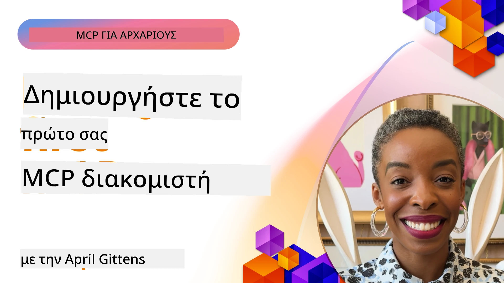

## Ξεκινώντας  

_(Κάντε κλικ στην εικόνα παραπάνω για να δείτε το βίντεο αυτού του μαθήματος)_

Αυτή η ενότητα αποτελείται από αρκετά μαθήματα:

- **1 Ο πρώτος σας διακομιστής**, σε αυτό το πρώτο μάθημα, θα μάθετε πώς να δημιουργήσετε τον πρώτο σας διακομιστή και να τον εξετάσετε με το εργαλείο επιθεώρησης, έναν πολύτιμο τρόπο για να δοκιμάσετε και να εντοπίσετε σφάλματα στον διακομιστή σας, [στο μάθημα](01-first-server/README.md)

- **2 Πελάτης**, σε αυτό το μάθημα, θα μάθετε πώς να γράψετε έναν πελάτη που μπορεί να συνδεθεί με τον διακομιστή σας, [στο μάθημα](02-client/README.md)

- **3 Πελάτης με LLM**, ένας ακόμη καλύτερος τρόπος γραφής πελάτη είναι προσθέτοντας ένα LLM ώστε να μπορεί να «διαπραγματευτεί» με τον διακομιστή σας τι να κάνει, [στο μάθημα](03-llm-client/README.md)

- **4 Χρήση καταναλωτικού λειτουργίας GitHub Copilot Agent με MCP σε Visual Studio Code**. Εδώ, εξετάζουμε τη λειτουργία του MCP Server εντός του Visual Studio Code, [στο μάθημα](04-vscode/README.md)

- **5 Διακομιστής stdio Transport** stdio transport είναι το προτεινόμενο πρότυπο για τοπική επικοινωνία MCP μεταξύ διακομιστή και πελάτη, παρέχοντας ασφαλή επικοινωνία μέσω υποδιαδικασιών με ενσωματωμένη απομόνωση διαδικασιών [στο μάθημα](05-stdio-server/README.md)

- **6 HTTP Streaming με MCP (Streamable HTTP)**. Μάθετε για τα σύγχρονα πρωτόκολλα ροής HTTP (η προτεινόμενη προσέγγιση για απομακρυσμένους MCP διακομιστές σύμφωνα με το [MCP Specification 2025-11-25](https://spec.modelcontextprotocol.io/specification/2025-11-25/basic/transports/#streamable-http)), ειδοποιήσεις προόδου, και πώς να υλοποιήσετε κλιμακούμενους, πραγματικού χρόνου MCP διακομιστές και πελάτες με χρήση Streamable HTTP. [στο μάθημα](06-http-streaming/README.md)

- **7 Χρήση του AI Toolkit για VSCode** για να καταναλώσετε και να δοκιμάσετε τους MCP Πελάτες και Διακομιστές σας [στο μάθημα](07-aitk/README.md)

- **8 Δοκιμές**. Εδώ θα εστιάσουμε ειδικά στο πώς να δοκιμάζουμε τον διακομιστή και τον πελάτη μας με διαφορετικούς τρόπους, [στο μάθημα](08-testing/README.md)

- **9 Ανάπτυξη**. Αυτό το κεφάλαιο εξετάζει διαφορετικούς τρόπους ανάπτυξης των λύσεων MCP σας, [στο μάθημα](09-deployment/README.md)

- **10 Προχωρημένη χρήση διακομιστή**. Αυτό το κεφάλαιο καλύπτει προχωρημένη χρήση διακομιστή, [στο μάθημα](./10-advanced/README.md)

- **11 Αυθεντικοποίηση**. Αυτό το κεφάλαιο καλύπτει πώς να προσθέσετε απλή αυθεντικοποίηση, από Basic Auth μέχρι τη χρήση JWT και RBAC. Συνιστάται να ξεκινήσετε εδώ και στη συνέχεια να δείτε τα Προχωρημένα Θέματα στο Κεφάλαιο 5 και να εφαρμόσετε πρόσθετα μέτρα ασφαλείας βάσει συστάσεων στο Κεφάλαιο 2, [στο μάθημα](./11-simple-auth/README.md)

- **12 Hosts MCP**. Ρυθμίστε και χρησιμοποιήστε δημοφιλείς πελάτες MCP hosts όπως Claude Desktop, Cursor, Cline, και Windsurf. Μάθετε τους τύπους μεταφοράς και αντιμετωπίστε προβλήματα, [στο μάθημα](./12-mcp-hosts/README.md)

- **13 Επιθεωρητής MCP**. Εντοπίστε σφάλματα και δοκιμάστε αλληλεπιδραστικά τους MCP διακομιστές σας χρησιμοποιώντας το εργαλείο MCP Inspector. Μάθετε εργαλεία αντιμετώπισης προβλημάτων, πόρους και μηνύματα πρωτοκόλλου, [στο μάθημα](./13-mcp-inspector/README.md)

Το Model Context Protocol (MCP) είναι ένα ανοιχτό πρωτόκολλο που τυποποιεί τον τρόπο με τον οποίο οι εφαρμογές παρέχουν πλαίσιο στα LLM. Σκεφτείτε το MCP σαν μια θύρα USB-C για εφαρμογές AI - παρέχει έναν τυποποιημένο τρόπο σύνδεσης μοντέλων AI με διάφορες πηγές δεδομένων και εργαλεία.

## Στόχοι Μάθησης

Μέχρι το τέλος αυτού του μαθήματος, θα μπορείτε να:

- Ρυθμίσετε περιβάλλοντα ανάπτυξης για MCP σε C#, Java, Python, TypeScript και JavaScript
- Δημιουργήσετε και αναπτύξετε βασικούς MCP διακομιστές με προσαρμοσμένες λειτουργίες (πόροι, προτροπές και εργαλεία)
- Δημιουργήσετε εφαρμογές host που συνδέονται με MCP διακομιστές
- Δοκιμάσετε και εντοπίσετε σφάλματα υλοποιήσεων MCP
- Κατανοήσετε κοινές προκλήσεις ρύθμισης και τις λύσεις τους
- Συνδέσετε τις υλοποιήσεις MCP με δημοφιλείς υπηρεσίες LLM

## Ρύθμιση του Περιβάλλοντος MCP

Πριν ξεκινήσετε να εργάζεστε με το MCP, είναι σημαντικό να προετοιμάσετε το περιβάλλον ανάπτυξής σας και να κατανοήσετε τη βασική ροή εργασίας. Αυτή η ενότητα θα σας καθοδηγήσει στα αρχικά βήματα ρύθμισης για μια ομαλή εκκίνηση με MCP.

### Προαπαιτούμενα

Πριν από την εμβάθυνση στην ανάπτυξη MCP, βεβαιωθείτε ότι διαθέτετε:

- **Περιβάλλον Ανάπτυξης**: Για τη γλώσσα που έχετε επιλέξει (C#, Java, Python, TypeScript ή JavaScript)
- **IDE/Επεξεργαστής**: Visual Studio, Visual Studio Code, IntelliJ, Eclipse, PyCharm ή οποιονδήποτε σύγχρονο επεξεργαστή κώδικα
- **Διαχειριστές Πακέτων**: NuGet, Maven/Gradle, pip ή npm/yarn
- **Κλειδιά API**: Για οποιεσδήποτε υπηρεσίες AI σκοπεύετε να χρησιμοποιήσετε στις εφαρμογές host

### Επίσημα SDK

Στα επόμενα κεφάλαια θα δείτε λύσεις που έχουν κατασκευαστεί χρησιμοποιώντας Python, TypeScript, Java και .NET. Εδώ είναι όλα τα επίσημα υποστηριζόμενα SDK.

Το MCP παρέχει επίσημα SDK για πολλαπλές γλώσσες (σύμφωνα με [MCP Specification 2025-11-25](https://spec.modelcontextprotocol.io/specification/2025-11-25/)):
- [C# SDK](https://github.com/modelcontextprotocol/csharp-sdk) - Συντηρείται σε συνεργασία με τη Microsoft
- [Java SDK](https://github.com/modelcontextprotocol/java-sdk) - Συντηρείται σε συνεργασία με τη Spring AI
- [TypeScript SDK](https://github.com/modelcontextprotocol/typescript-sdk) - Η επίσημη υλοποίηση TypeScript
- [Python SDK](https://github.com/modelcontextprotocol/python-sdk) - Η επίσημη υλοποίηση Python (FastMCP)
- [Kotlin SDK](https://github.com/modelcontextprotocol/kotlin-sdk) - Η επίσημη υλοποίηση Kotlin
- [Swift SDK](https://github.com/modelcontextprotocol/swift-sdk) - Συντηρείται σε συνεργασία με την Loopwork AI
- [Rust SDK](https://github.com/modelcontextprotocol/rust-sdk) - Η επίσημη υλοποίηση Rust
- [Go SDK](https://github.com/modelcontextprotocol/go-sdk) - Η επίσημη υλοποίηση Go

## Σημαντικά Σημεία

- Η ρύθμιση περιβάλλοντος ανάπτυξης MCP είναι απλή με τη χρήση γλωσσικά-ειδικών SDK
- Η δημιουργία MCP διακομιστών περιλαμβάνει τη δημιουργία και εγγραφή εργαλείων με ξεκάθαρα σχήματα
- Οι MCP πελάτες συνδέονται με διακομιστές και μοντέλα για να αξιοποιήσουν εκτεταμένες δυνατότητες
- Οι δοκιμές και ο εντοπισμός σφαλμάτων είναι απαραίτητα για αξιόπιστες υλοποιήσεις MCP
- Οι επιλογές ανάπτυξης ποικίλλουν από τοπική ανάπτυξη μέχρι λύσεις βασισμένες στο cloud

## Πρακτική

Διαθέτουμε ένα σύνολο δειγμάτων που συμπληρώνουν τις ασκήσεις που θα δείτε σε όλα τα κεφάλαια αυτής της ενότητας. Επιπλέον, κάθε κεφάλαιο έχει τις δικές του ασκήσεις και εργασίες

- [Java Calculator](./samples/java/calculator/README.md)
- [.Net Calculator](../../../03-GettingStarted/samples/csharp)
- [JavaScript Calculator](./samples/javascript/README.md)
- [TypeScript Calculator](./samples/typescript/README.md)
- [Python Calculator](../../../03-GettingStarted/samples/python)

## Πρόσθετοι Πόροι

- [Δημιουργία Agents χρησιμοποιώντας το Model Context Protocol στο Azure](https://learn.microsoft.com/azure/developer/ai/intro-agents-mcp)
- [Απομακρυσμένο MCP με Azure Container Apps (Node.js/TypeScript/JavaScript)](https://learn.microsoft.com/samples/azure-samples/mcp-container-ts/mcp-container-ts/)
- [.NET OpenAI MCP Agent](https://learn.microsoft.com/samples/azure-samples/openai-mcp-agent-dotnet/openai-mcp-agent-dotnet/)

## Τι ακολουθεί

Ξεκινήστε με το πρώτο μάθημα: [Δημιουργία του πρώτου σας MCP Διακομιστή](01-first-server/README.md)

Μόλις ολοκληρώσετε αυτή τη μονάδα, συνεχίστε στο: [Μονάδα 4: Πρακτική Εφαρμογή](../04-PracticalImplementation/README.md)

---

<!-- CO-OP TRANSLATOR DISCLAIMER START -->
**Αποποίηση ευθυνών**:  
Αυτό το έγγραφο έχει μεταφραστεί χρησιμοποιώντας την υπηρεσία αυτόματης μετάφρασης με τεχνητή νοημοσύνη [Co-op Translator](https://github.com/Azure/co-op-translator). Παρόλο που καταβάλλουμε προσπάθεια για ακρίβεια, παρακαλούμε να σημειώσετε ότι οι αυτοματοποιημένες μεταφράσεις ενδέχεται να περιέχουν λάθη ή ανακρίβειες. Το πρωτότυπο έγγραφο στη μητρική του γλώσσα πρέπει να θεωρείται η επίσημη πηγή. Για κρίσιμες πληροφορίες συνιστάται επαγγελματική μετάφραση από ανθρώπινο μεταφραστή. Δεν φέρουμε ευθύνη για οποιεσδήποτε παρεξηγήσεις ή παρερμηνείες προκύψουν από τη χρήση αυτής της μετάφρασης.
<!-- CO-OP TRANSLATOR DISCLAIMER END -->