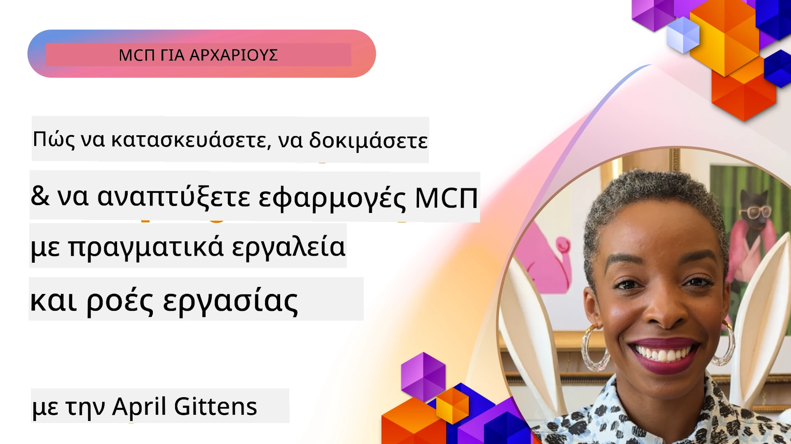

# Πρακτική Εφαρμογή

[](https://youtu.be/vCN9-mKBDfQ)

_(Κάντε κλικ στην παραπάνω εικόνα για να δείτε βίντεο αυτής της ενότητας)_

Η πρακτική εφαρμογή είναι όπου η δύναμη του Model Context Protocol (MCP) γίνεται απτή. Ενώ η κατανόηση της θεωρίας και της αρχιτεκτονικής πίσω από το MCP είναι σημαντική, η πραγματική αξία προκύπτει όταν εφαρμόζετε αυτές τις έννοιες για να δημιουργήσετε, να δοκιμάσετε και να αναπτύξετε λύσεις που επιλύουν πραγματικά προβλήματα. Αυτό το κεφάλαιο γεφυρώνει το χάσμα μεταξύ εννοιολογικής γνώσης και πρακτικής ανάπτυξης, καθοδηγώντας σας στη διαδικασία της υλοποίησης εφαρμογών βασισμένων σε MCP.

Είτε αναπτύσσετε έξυπνους βοηθούς, ενσωματώνετε τεχνητή νοημοσύνη στις επιχειρησιακές ροές εργασίας, είτε κατασκευάζετε προσαρμοσμένα εργαλεία για επεξεργασία δεδομένων, το MCP παρέχει ένα ευέλικτο θεμέλιο. Ο σχεδιασμός χωρίς γλώσσα και τα επίσημα SDK για δημοφιλείς γλώσσες προγραμματισμού το καθιστούν προσβάσιμο σε ένα ευρύ φάσμα προγραμματιστών. Με την αξιοποίηση αυτών των SDK, μπορείτε να δημιουργείτε γρήγορα πρωτότυπα, να επαναλαμβάνετε και να κλιμακώνετε τις λύσεις σας σε διαφορετικές πλατφόρμες και περιβάλλοντα.

Στις επόμενες ενότητες, θα βρείτε πρακτικά παραδείγματα, δείγματα κώδικα και στρατηγικές ανάπτυξης που δείχνουν πώς να υλοποιήσετε MCP σε C#, Java με Spring, TypeScript, JavaScript και Python. Θα μάθετε επίσης πώς να εντοπίζετε σφάλματα και να δοκιμάζετε τους MCP διακομιστές σας, να διαχειρίζεστε APIs και να αναπτύσσετε λύσεις στο cloud χρησιμοποιώντας Azure. Αυτοί οι πρακτικοί πόροι έχουν σχεδιαστεί ώστε να επιταχύνουν τη μαθησιακή σας διαδικασία και να σας βοηθήσουν να δημιουργήσετε με αυτοπεποίθηση ανθεκτικές, έτοιμες για παραγωγή εφαρμογές MCP.

## Επισκόπηση

Αυτό το μάθημα εστιάζει σε πρακτικές πτυχές της υλοποίησης MCP σε πολλές γλώσσες προγραμματισμού. Θα εξερευνήσουμε πώς να χρησιμοποιήσουμε τα MCP SDK σε C#, Java με Spring, TypeScript, JavaScript και Python για να κατασκευάσουμε ανθεκτικές εφαρμογές, να εντοπίσουμε και να δοκιμάσουμε τους MCP διακομιστές και να δημιουργήσουμε επαναχρησιμοποιήσιμους πόρους, προτροπές και εργαλεία.

## Στόχοι μάθησης

Μέχρι το τέλος του μαθήματος, θα μπορείτε να:

- Υλοποιείτε λύσεις MCP χρησιμοποιώντας επίσημα SDK σε διάφορες γλώσσες προγραμματισμού
- Εντοπίζετε σφάλματα και δοκιμάζετε συστηματικά τους MCP διακομιστές
- Δημιουργείτε και χρησιμοποιείτε δυνατότητες διακομιστή (Πόροι, Προτροπές και Εργαλεία)
- Σχεδιάζετε αποτελεσματικές ροές εργασίας MCP για σύνθετες εργασίες
- Βελτιστοποιείτε τις υλοποιήσεις MCP για απόδοση και αξιοπιστία

## Επίσημοι Πόροι SDK

Το Model Context Protocol προσφέρει επίσημα SDK για πολλές γλώσσες (σύμφωνα με [MCP Specification 2025-11-25](https://spec.modelcontextprotocol.io/specification/2025-11-25/)):

- [C# SDK](https://github.com/modelcontextprotocol/csharp-sdk)
- [Java με Spring SDK](https://github.com/modelcontextprotocol/java-sdk) **Σημείωση:** απαιτεί εξάρτηση από [Project Reactor](https://projectreactor.io). (Δείτε [συζήτηση θέμα 246](https://github.com/orgs/modelcontextprotocol/discussions/246).)
- [TypeScript SDK](https://github.com/modelcontextprotocol/typescript-sdk)
- [Python SDK](https://github.com/modelcontextprotocol/python-sdk)
- [Kotlin SDK](https://github.com/modelcontextprotocol/kotlin-sdk)
- [Go SDK](https://github.com/modelcontextprotocol/go-sdk)

## Εργασία με τα MCP SDKs

Αυτή η ενότητα παρέχει πρακτικά παραδείγματα υλοποίησης MCP σε πολλές γλώσσες προγραμματισμού. Μπορείτε να βρείτε δείγματα κώδικα στον φάκελο `samples` οργανωμένα ανά γλώσσα.

### Διαθέσιμα Δείγματα

Το αποθετήριο περιλαμβάνει [δείγματα υλοποίησης](../../../04-PracticalImplementation/samples) στις ακόλουθες γλώσσες:

- [C#](./samples/csharp/README.md)
- [Java με Spring](./samples/java/containerapp/README.md)
- [TypeScript](./samples/typescript/README.md)
- [JavaScript](./samples/javascript/README.md)
- [Python](./samples/python/README.md)

Κάθε δείγμα παρουσιάζει βασικές έννοιες MCP και πρότυπα υλοποίησης για αυτή τη συγκεκριμένη γλώσσα και οικοσύστημα.

### Πρακτικοί Οδηγοί

Επιπρόσθετοι οδηγοί για πρακτική εφαρμογή MCP:

- [Σελιδοποίηση και Μεγάλα Σύνολα Αποτελεσμάτων](./pagination/README.md) - Διαχείριση σελιδοποίησης βάσει δρομέα για εργαλεία, πόρους και μεγάλα σύνολα δεδομένων

## Κύριες Δυνατότητες Διακομιστή

Οι MCP διακομιστές μπορούν να υλοποιήσουν οποιονδήποτε συνδυασμό αυτών των δυνατοτήτων:

### Πόροι

Οι πόροι παρέχουν περιβάλλον και δεδομένα για χρήση από τον χρήστη ή το μοντέλο AI:

- Αποθετήρια εγγράφων
- Βάσεις γνώσεων
- Πηγές δομημένων δεδομένων
- Συστήματα αρχείων

### Προτροπές

Οι προτροπές είναι προτυποποιημένα μηνύματα και ροές εργασίας για τους χρήστες:

- Προκαθορισμένα πρότυπα συνομιλίας
- Καθοδηγούμενα πρότυπα αλληλεπίδρασης
- Εξειδικευμένες δομές διαλόγου

### Εργαλεία

Τα εργαλεία είναι λειτουργίες για το μοντέλο AI να εκτελέσει:

- Βοηθητικά εργαλεία επεξεργασίας δεδομένων
- Ενσωματώσεις εξωτερικών API
- Υπολογιστικές δυνατότητες
- Λειτουργικότητα αναζήτησης

## Παραδείγματα υλοποίησης: Υλοποίηση σε C#

Το επίσημο αποθετήριο MCP C# SDK περιέχει αρκετά παραδείγματα υλοποίησης που παρουσιάζουν διαφορετικές πτυχές του MCP:

- **Βασικός Πελάτης MCP**: Απλό παράδειγμα που δείχνει πώς να δημιουργήσετε πελάτη MCP και να καλέσετε εργαλεία
- **Βασικός Διακομιστής MCP**: Ελάχιστη υλοποίηση διακομιστή με βασική εγγραφή εργαλείων
- **Προχωρημένος Διακομιστής MCP**: Πλήρως εξοπλισμένος διακομιστής με εγγραφή εργαλείων, αυθεντικοποίηση και διαχείριση σφαλμάτων
- **Ενσωμάτωση ASP.NET**: Παραδείγματα ενσωμάτωσης με ASP.NET Core
- **Πρότυπα Υλοποίησης Εργαλείων**: Διάφορα πρότυπα για την υλοποίηση εργαλείων με διαφορετικά επίπεδα πολυπλοκότητας

Το MCP C# SDK είναι σε preview και οι APIs ενδέχεται να αλλάξουν. Θα ενημερώνουμε συνεχώς αυτό το blog καθώς το SDK εξελίσσεται.

### Κύρια Χαρακτηριστικά

- [C# MCP Nuget ModelContextProtocol](https://www.nuget.org/packages/ModelContextProtocol)
- Δημιουργία του [πρώτου MCP Διακομιστή](https://devblogs.microsoft.com/dotnet/build-a-model-context-protocol-mcp-server-in-csharp/).

Για πλήρη δείγματα υλοποίησης σε C#, επισκεφτείτε το [επίσημο αποθετήριο δειγμάτων C# SDK](https://github.com/modelcontextprotocol/csharp-sdk)

## Παράδειγμα υλοποίησης: Υλοποίηση σε Java με Spring

Το Java με Spring SDK προσφέρει ισχυρές επιλογές υλοποίησης MCP με λειτουργίες επιπέδου επιχείρησης.

### Κύρια Χαρακτηριστικά

- Ενσωμάτωση Spring Framework
- Ισχυρή ασφάλεια τύπων
- Υποστήριξη αντιδραστικού προγραμματισμού
- Ολοκληρωμένη διαχείριση σφαλμάτων

Για πλήρες παράδειγμα υλοποίησης Java με Spring, δείτε [το δείγμα Java με Spring](samples/java/containerapp/README.md) στον φάκελο δειγμάτων.

## Παράδειγμα υλοποίησης: Υλοποίηση σε JavaScript

Το JavaScript SDK παρέχει μια ελαφριά και ευέλικτη προσέγγιση στην υλοποίηση MCP.

### Κύρια Χαρακτηριστικά

- Υποστήριξη Node.js και browser
- API βασισμένο σε Promise
- Εύκολη ενσωμάτωση με Express και άλλα frameworks
- Υποστήριξη WebSocket για streaming

Για πλήρες παράδειγμα υλοποίησης JavaScript, δείτε [το δείγμα JavaScript](samples/javascript/README.md) στον φάκελο δειγμάτων.

## Παράδειγμα υλοποίησης: Υλοποίηση σε Python

Το Python SDK προσφέρει μια Pythonic προσέγγιση στην υλοποίηση MCP με εξαιρετικές ενσωματώσεις ML frameworks.

### Κύρια Χαρακτηριστικά

- Υποστήριξη async/await με asyncio
- Ενσωμάτωση FastAPI
- Απλή εγγραφή εργαλείων
- Φυτική ενσωμάτωση με δημοφιλείς ML βιβλιοθήκες

Για πλήρες παράδειγμα υλοποίησης Python, δείτε [το δείγμα Python](samples/python/README.md) στον φάκελο δειγμάτων.

## Διαχείριση API

Το Azure API Management είναι μια εξαιρετική λύση για το πώς μπορούμε να ασφαλίσουμε MCP Διακομιστές. Η ιδέα είναι να τοποθετήσετε ένα instance του Azure API Management μπροστά από τον MCP διακομιστή σας και να αφήσετε αυτό να διαχειρίζεται λειτουργίες που πιθανώς θα θέλατε, όπως:

- περιορισμό ρυθμού
- διαχείριση διακριτικών (tokens)
- παρακολούθηση
- ισοστάθμιση φορτίου
- ασφάλεια

### Παράδειγμα Azure

Εδώ είναι ένα Παράδειγμα Azure που κάνει ακριβώς αυτό, δηλαδή [δημιουργεί έναν MCP Διακομιστή και τον ασφαλίζει με Azure API Management](https://github.com/Azure-Samples/remote-mcp-apim-functions-python).

Δείτε πώς γίνεται η ροή εξουσιοδότησης στην παρακάτω εικόνα:


Στην προηγούμενη εικόνα, συμβαίνουν τα εξής:

- Η αυθεντικοποίηση/εξουσιοδότηση πραγματοποιείται μέσω Microsoft Entra.
- Το Azure API Management λειτουργεί ως πύλη και χρησιμοποιεί πολιτικές για τη δρομολόγηση και διαχείριση της κυκλοφορίας.
- Το Azure Monitor καταγράφει όλα τα αιτήματα για περαιτέρω ανάλυση.

#### Ροή Εξουσιοδότησης

Ας δούμε πιο αναλυτικά τη ροή εξουσιοδότησης:


#### Προδιαγραφή εξουσιοδότησης MCP

Μάθετε περισσότερα για την [προδιαγραφή Εξουσιοδότησης MCP](https://spec.modelcontextprotocol.io/specification/2025-11-25/basic/authorization/)

## Ανάπτυξη Απομακρυσμένου MCP Διακομιστή στο Azure

Ας δούμε αν μπορούμε να αναπτύξουμε το παράδειγμα που αναφέραμε προηγουμένως:

1. Κλωνοποιήστε το αποθετήριο

    ```bash
    git clone https://github.com/Azure-Samples/remote-mcp-apim-functions-python.git
    cd remote-mcp-apim-functions-python
    ```

1. Εγγραφείτε στον πάροχο πόρων `Microsoft.App`.

   - Αν χρησιμοποιείτε Azure CLI, τρέξτε `az provider register --namespace Microsoft.App --wait`.
   - Αν χρησιμοποιείτε Azure PowerShell, τρέξτε `Register-AzResourceProvider -ProviderNamespace Microsoft.App`. Έπειτα τρέξτε `(Get-AzResourceProvider -ProviderNamespace Microsoft.App).RegistrationState` μετά από λίγο για να ελέγξετε αν η εγγραφή ολοκληρώθηκε.

1. Τρέξτε την ακόλουθη εντολή [azd](https://aka.ms/azd) για να προμηθευτείτε την υπηρεσία διαχείρισης API, το function app (με κώδικα) και όλους τους απαιτούμενους πόρους Azure

    ```shell
    azd up
    ```

    Αυτή η εντολή θα αναπτύξει όλους τους cloud πόρους στο Azure

### Δοκιμή του διακομιστή σας με MCP Inspector

1. Σε **νέο τερματικό παράθυρο**, εγκαταστήστε και τρέξτε το MCP Inspector

    ```shell
    npx @modelcontextprotocol/inspector
    ```

    Θα δείτε μια διεπαφή παρόμοια με:

    

1. Κάντε κλικ με CTRL για να φορτώσετε το web app MCP Inspector από το URL που εμφανίζεται από την εφαρμογή (π.χ. [http://127.0.0.1:6274/#resources](http://127.0.0.1:6274/#resources))
1. Ορίστε τον τύπο μεταφοράς σε `SSE`
1. Ορίστε το URL στο endpoint SSE της υπηρεσίας API Management που τρέχει και εμφανίστηκε μετά το `azd up` και **Συνδεθείτε**:

    ```shell
    https://<apim-servicename-from-azd-output>.azure-api.net/mcp/sse
    ```

1. **Καταχώρηση Εργαλείων**. Κάντε κλικ σε ένα εργαλείο και **Τρέξτε το Εργαλείο**.  

Αν όλα τα βήματα έχουν ολοκληρωθεί σωστά, πρέπει τώρα να είστε συνδεδεμένοι στον MCP διακομιστή και να έχετε καταφέρει να καλέσετε ένα εργαλείο.

## MCP διακομιστές για Azure

[Remote-mcp-functions](https://github.com/Azure-Samples/remote-mcp-functions-dotnet): Αυτό το σύνολο αποθετηρίων είναι ένα πρότυπο γρήγορης εκκίνησης για την κατασκευή και ανάπτυξη προσαρμοσμένων απομακρυσμένων MCP (Model Context Protocol) διακομιστών χρησιμοποιώντας Azure Functions με Python, C# .NET ή Node/TypeScript.

Τα δείγματα παρέχουν μια ολοκληρωμένη λύση που επιτρέπει στους προγραμματιστές να:

- Κατασκευάζουν και τρέχουν τοπικά: Αναπτύσσουν και εντοπίζουν προβλήματα σε έναν MCP διακομιστή σε τοπικό μηχάνημα
- Αναπτύσσουν στο Azure: Απλά αναπτύσσουν στο cloud με μια απλή εντολή azd up
- Συνδέονται από πελάτες: Συνδέονται στον MCP διακομιστή από διάφορους πελάτες συμπεριλαμβανομένου του mode agent Copilot του VS Code και το εργαλείο MCP Inspector

### Κύρια Χαρακτηριστικά

- Ασφάλεια εγγενώς: Ο MCP διακομιστής ασφαλίζεται με κλειδιά και HTTPS
- Επιλογές αυθεντικοποίησης: Υποστηρίζει OAuth χρησιμοποιώντας ενσωματωμένη αυθεντικοποίηση και/ή API Management
- Δικτυακή απομόνωση: Επιτρέπει απομόνωση δικτύου χρησιμοποιώντας Azure Virtual Networks (VNET)
- Αρχιτεκτονική χωρίς διακομιστή: Χρησιμοποιεί Azure Functions για κλιμακούμενη, εκτέλεση βάσει γεγονότων
- Τοπική ανάπτυξη: Ολοκληρωμένη υποστήριξη ανάπτυξης και εντοπισμού σφαλμάτων τοπικά
- Απλή ανάπτυξη: Απλοποιημένη διαδικασία ανάπτυξης στο Azure

Το αποθετήριο περιλαμβάνει όλα τα απαραίτητα αρχεία ρύθμισης, πηγαίο κώδικα και ορισμούς υποδομής για να ξεκινήσετε γρήγορα με μια παραγωγική υλοποίηση MCP διακομιστή.

- [Azure Remote MCP Functions Python](https://github.com/Azure-Samples/remote-mcp-functions-python) - Παράδειγμα υλοποίησης MCP χρησιμοποιώντας Azure Functions με Python

- [Azure Remote MCP Functions .NET](https://github.com/Azure-Samples/remote-mcp-functions-dotnet) - Παράδειγμα υλοποίησης MCP χρησιμοποιώντας Azure Functions με C# .NET

- [Azure Remote MCP Functions Node/Typescript](https://github.com/Azure-Samples/remote-mcp-functions-typescript) - Παράδειγμα υλοποίησης MCP χρησιμοποιώντας Azure Functions με Node/TypeScript.

## Βασικά Συμπεράσματα

- Τα MCP SDK προσφέρουν γλωσσικές ειδικές εργαλεία για την υλοποίηση ανθεκτικών λύσεων MCP
- Η διαδικασία εντοπισμού και δοκιμής είναι κρίσιμη για αξιόπιστες εφαρμογές MCP
- Τα επαναχρησιμοποιήσιμα πρότυπα προτροπών επιτρέπουν συνεπείς αλληλεπιδράσεις AI
- Καλοσχεδιασμένες ροές εργασίας μπορούν να οργανώσουν σύνθετες εργασίες χρησιμοποιώντας πολλαπλά εργαλεία
- Η υλοποίηση λύσεων MCP απαιτεί προσοχή σε ζητήματα ασφάλειας, απόδοσης και διαχείρισης σφαλμάτων

## Άσκηση

Σχεδιάστε μια πρακτική ροή εργασίας MCP που αντιμετωπίζει ένα πραγματικό πρόβλημα στον τομέα σας:

1. Προσδιορίστε 3-4 εργαλεία που θα ήταν χρήσιμα για την επίλυση αυτού του προβλήματος
2. Δημιουργήστε ένα διάγραμμα ροής που δείχνει πώς αυτά τα εργαλεία αλληλεπιδρούν
3. Υλοποιήστε μια βασική έκδοση ενός από τα εργαλεία χρησιμοποιώντας την προτιμώμενη γλώσσα σας
4. Δημιουργήστε ένα πρότυπο προτροπής που θα βοηθούσε το μοντέλο να χρησιμοποιήσει αποτελεσματικά το εργαλείο σας

## Πρόσθετοι Πόροι

---

## Τι Ακολουθεί

Επόμενο: [Για Προχωρημένους Θέματα](../05-AdvancedTopics/README.md)

---

<!-- CO-OP TRANSLATOR DISCLAIMER START -->
**Αποποίηση Ευθύνης**:  
Αυτό το έγγραφο έχει μεταφραστεί χρησιμοποιώντας την υπηρεσία αυτόματης μετάφρασης AI [Co-op Translator](https://github.com/Azure/co-op-translator). Ενώ καταβάλλουμε προσπάθεια για ακρίβεια, παρακαλούμε να λάβετε υπόψη ότι οι αυτοματοποιημένες μεταφράσεις μπορεί να περιέχουν λάθη ή ανακρίβειες. Το πρωτότυπο έγγραφο στη γλώσσα του θεωρείται η αυθεντική πηγή. Για κρίσιμες πληροφορίες συνιστάται επαγγελματική ανθρώπινη μετάφραση. Δεν φέρουμε ευθύνη για τυχόν παρεξηγήσεις ή λανθασμένες ερμηνείες που προκύπτουν από τη χρήση αυτής της μετάφρασης.
<!-- CO-OP TRANSLATOR DISCLAIMER END -->