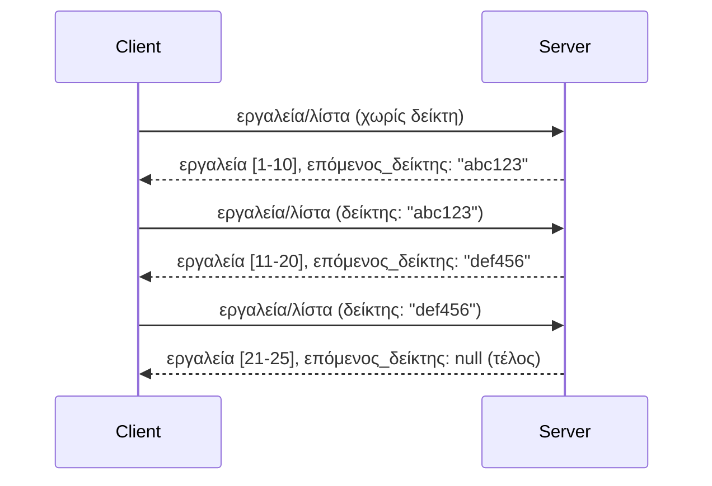

# Σελιδοποίηση και Μεγάλα Σύνολα Αποτελεσμάτων στο MCP

Όταν ο διακομιστής MCP χειρίζεται μεγάλα σύνολα δεδομένων - είτε καταλογογραφώντας χιλιάδες αρχεία, εγγραφές βάσεων δεδομένων ή αποτελέσματα αναζητήσεων - χρειάζεστε σελιδοποίηση για να διαχειρίζεστε τη μνήμη αποτελεσματικά και να παρέχετε ανταποκρινόμενες εμπειρίες χρήστη. Ο οδηγός αυτός καλύπτει πώς να υλοποιήσετε και να χρησιμοποιήσετε σελιδοποίηση στο MCP.

## Γιατί έχει σημασία η Σελιδοποίηση

Χωρίς σελιδοποίηση, οι μεγάλες απαντήσεις μπορούν να προκαλέσουν:

- **Εξαντληση μνήμης** - Φόρτωση εκατομμυρίων εγγραφών ταυτόχρονα
- **Αργές χρόνοι απόκρισης** - Οι χρήστες περιμένουν ενώ φορτώνουν όλα τα δεδομένα
- **Σφάλματα χρονικού ορίου** - Αιτήματα που υπερβαίνουν τα όρια χρόνου
- **Κακή απόδοση AI** - Τα LLM δυσκολεύονται με τεράστιο πλαίσιο

Το MCP χρησιμοποιεί **σελιδοποίηση βάσει δείκτη (cursor-based pagination)** για αξιόπιστη, συνεπή πλοήγηση μέσα σε σύνολα αποτελεσμάτων.

---

## Πώς Λειτουργεί η Σελιδοποίηση στο MCP

### Η Έννοια του Δείκτη (Cursor)

Ένας **δείκτης (cursor)** είναι μια αδιαφανής συμβολοσειρά που σημειώνει τη θέση σας σε ένα σύνολο αποτελεσμάτων. Σκεφτείτε το σαν μια σελιδοδείκτη σε ένα μεγάλο βιβλίο.


### Σελιδοποίηση στις Μεθόδους MCP

Αυτές οι μέθοδοι MCP υποστηρίζουν σελιδοποίηση:

| Μέθοδος | Επιστρέφει | Υποστήριξη Δείκτη |
|---------|------------|-------------------|
| `tools/list` | Ορισμούς εργαλείων | ✅ |
| `resources/list` | Ορισμούς πόρων | ✅ |
| `prompts/list` | Ορισμούς prompt | ✅ |
| `resources/templates/list` | Πρότυπα πόρων | ✅ |

---

## Υλοποίηση Διακομιστή

### Python (FastMCP)

```python
from mcp.server import Server
from mcp.types import Tool, ListToolsResult
import math

app = Server("paginated-server")

# Προσομοιωμένο μεγάλο σύνολο δεδομένων
ALL_TOOLS = [
    Tool(name=f"tool_{i}", description=f"Tool number {i}", inputSchema={})
    for i in range(100)
]

PAGE_SIZE = 10

@app.list_tools()
async def list_tools(cursor: str | None = None) -> ListToolsResult:
    """List tools with pagination support."""
    
    # Αποκωδικοποίηση δρομέα για λήψη αρχικού δείκτη
    start_index = 0
    if cursor:
        try:
            start_index = int(cursor)
        except ValueError:
            start_index = 0
    
    # Λήψη σελίδας αποτελεσμάτων
    end_index = min(start_index + PAGE_SIZE, len(ALL_TOOLS))
    page_tools = ALL_TOOLS[start_index:end_index]
    
    # Υπολογισμός επόμενου δρομέα
    next_cursor = None
    if end_index < len(ALL_TOOLS):
        next_cursor = str(end_index)
    
    return ListToolsResult(
        tools=page_tools,
        nextCursor=next_cursor
    )
```

### TypeScript

```typescript
import { Server } from "@modelcontextprotocol/sdk/server/index.js";
import { ListToolsResultSchema } from "@modelcontextprotocol/sdk/types.js";

const server = new Server({
  name: "paginated-server",
  version: "1.0.0"
});

// Προσομοιωμένο μεγάλο σύνολο δεδομένων
const ALL_TOOLS = Array.from({ length: 100 }, (_, i) => ({
  name: `tool_${i}`,
  description: `Tool number ${i}`,
  inputSchema: { type: "object", properties: {} }
}));

const PAGE_SIZE = 10;

server.setRequestHandler(ListToolsResultSchema, async (request) => {
  // Αποκωδικοποίηση δρομέα
  let startIndex = 0;
  if (request.params?.cursor) {
    startIndex = parseInt(request.params.cursor, 10) || 0;
  }
  
  // Λήψη σελίδας αποτελεσμάτων
  const endIndex = Math.min(startIndex + PAGE_SIZE, ALL_TOOLS.length);
  const pageTools = ALL_TOOLS.slice(startIndex, endIndex);
  
  // Υπολογισμός επόμενου δρομέα
  const nextCursor = endIndex < ALL_TOOLS.length ? String(endIndex) : undefined;
  
  return {
    tools: pageTools,
    nextCursor
  };
});
```

### Java (Spring MCP)

```java
@Service
public class PaginatedToolService {
    
    private static final int PAGE_SIZE = 10;
    private final List<Tool> allTools;
    
    public PaginatedToolService() {
        // Αρχικοποίηση μεγάλου συνόλου δεδομένων
        this.allTools = IntStream.range(0, 100)
            .mapToObj(i -> new Tool("tool_" + i, "Tool number " + i, Map.of()))
            .collect(Collectors.toList());
    }
    
    @McpMethod("tools/list")
    public ListToolsResult listTools(@Param("cursor") String cursor) {
        // Αποκωδικοποίηση δείκτη
        int startIndex = 0;
        if (cursor != null && !cursor.isEmpty()) {
            try {
                startIndex = Integer.parseInt(cursor);
            } catch (NumberFormatException e) {
                startIndex = 0;
            }
        }
        
        // Λήψη σελίδας αποτελεσμάτων
        int endIndex = Math.min(startIndex + PAGE_SIZE, allTools.size());
        List<Tool> pageTools = allTools.subList(startIndex, endIndex);
        
        // Υπολογισμός επόμενου δείκτη
        String nextCursor = endIndex < allTools.size() ? String.valueOf(endIndex) : null;
        
        return new ListToolsResult(pageTools, nextCursor);
    }
}
```

---

## Υλοποίηση Πελάτη

### Python Πελάτης

```python
from mcp import ClientSession

async def get_all_tools(session: ClientSession) -> list:
    """Fetch all tools using pagination."""
    all_tools = []
    cursor = None
    
    while True:
        result = await session.list_tools(cursor=cursor)
        all_tools.extend(result.tools)
        
        if result.nextCursor is None:
            break
        cursor = result.nextCursor
    
    return all_tools

# Χρήση
async with client_session as session:
    tools = await get_all_tools(session)
    print(f"Found {len(tools)} tools")
```

### TypeScript Πελάτης

```typescript
import { Client } from "@modelcontextprotocol/sdk/client/index.js";

async function getAllTools(client: Client): Promise<Tool[]> {
  const allTools: Tool[] = [];
  let cursor: string | undefined = undefined;
  
  do {
    const result = await client.listTools({ cursor });
    allTools.push(...result.tools);
    cursor = result.nextCursor;
  } while (cursor);
  
  return allTools;
}

// Χρήση
const tools = await getAllTools(client);
console.log(`Found ${tools.length} tools`);
```

### Πρότυπο Lazy Loading

Για πολύ μεγάλα σύνολα, φορτώστε σελίδες κατόπιν ζήτησης:

```python
class PaginatedToolIterator:
    """Lazily iterate through paginated tools."""
    
    def __init__(self, session: ClientSession):
        self.session = session
        self.cursor = None
        self.buffer = []
        self.exhausted = False
    
    async def __anext__(self):
        # Επιστροφή από το buffer αν είναι διαθέσιμο
        if self.buffer:
            return self.buffer.pop(0)
        
        # Έλεγχος αν έχουμε εξαντλήσει όλες τις σελίδες
        if self.exhausted:
            raise StopAsyncIteration
        
        # Ανάκτηση της επόμενης σελίδας
        result = await self.session.list_tools(cursor=self.cursor)
        self.buffer = list(result.tools)
        self.cursor = result.nextCursor
        
        if self.cursor is None:
            self.exhausted = True
        
        if not self.buffer:
            raise StopAsyncIteration
        
        return self.buffer.pop(0)
    
    def __aiter__(self):
        return self

# Χρήση - αποδοτική μνήμη για μεγάλα σύνολα δεδομένων
async for tool in PaginatedToolIterator(session):
    process_tool(tool)
```

---

## Σελιδοποίηση για Πόρους

Οι πόροι συχνά χρειάζονται σελιδοποίηση για καταλόγους ή μεγάλα σύνολα δεδομένων:

```python
from mcp.server import Server
from mcp.types import Resource, ListResourcesResult
import os

app = Server("file-server")

@app.list_resources()
async def list_resources(cursor: str | None = None) -> ListResourcesResult:
    """List files in directory with pagination."""
    
    directory = "/data/files"
    all_files = sorted(os.listdir(directory))
    
    # Αποκωδικοποίηση δρομέα (ευρετήριο αρχείου)
    start_index = int(cursor) if cursor else 0
    page_size = 20
    end_index = min(start_index + page_size, len(all_files))
    
    # Δημιουργία λίστας πόρων για αυτή τη σελίδα
    resources = []
    for filename in all_files[start_index:end_index]:
        filepath = os.path.join(directory, filename)
        resources.append(Resource(
            uri=f"file://{filepath}",
            name=filename,
            mimeType="application/octet-stream"
        ))
    
    # Υπολογισμός επόμενου δρομέα
    next_cursor = str(end_index) if end_index < len(all_files) else None
    
    return ListResourcesResult(
        resources=resources,
        nextCursor=next_cursor
    )
```

---

## Στρατηγικές Σχεδίασης Δείκτη

### Στρατηγική 1: Βασισμένη σε ευρετήριο (Απλή)

```python
# Ο δείκτης είναι απλώς ο αριθμός θέσης
cursor = "50"  # Ξεκινήστε από το στοιχείο 50
```

**Πλεονεκτήματα:** Απλή, χωρίς κατάσταση  
**Μειονεκτήματα:** Τα αποτελέσματα μπορεί να μετακινηθούν αν προστεθούν ή αφαιρεθούν στοιχεία

### Στρατηγική 2: Βασισμένη σε ID (Σταθερή)

```python
# Ο δείκτης είναι το τελευταίο εμφανισμένο αναγνωριστικό
cursor = "item_abc123"  # Ξεκινήστε μετά από αυτό το στοιχείο
```

**Πλεονεκτήματα:** Σταθερή ακόμα και αν αλλάξουν τα στοιχεία  
**Μειονεκτήματα:** Απαιτεί ταχτοποιημένα IDs

### Στρατηγική 3: Κωδικοποιημένη Κατάσταση (Σύνθετη)

```python
import base64
import json

def encode_cursor(state: dict) -> str:
    return base64.b64encode(json.dumps(state).encode()).decode()

def decode_cursor(cursor: str) -> dict:
    return json.loads(base64.b64decode(cursor).decode())

# Ο κέρσορας περιέχει πολλαπλά πεδία κατάστασης
cursor = encode_cursor({
    "offset": 50,
    "filter": "active",
    "sort": "name"
})
```

**Πλεονεκτήματα:** Μπορεί να κωδικοποιήσει σύνθετη κατάσταση  
**Μειονεκτήματα:** Πιο σύνθετη, μεγαλύτερες συμβολοσειρές δείκτη

---

## Καλές Πρακτικές

### 1. Επιλέξτε Κατάλληλα Μεγέθη Σελίδων

```python
# Λάβετε υπόψη το μέγεθος των δεδομένων
PAGE_SIZE_SMALL_ITEMS = 100   # Απλά μεταδεδομένα
PAGE_SIZE_MEDIUM_ITEMS = 20   # Πιο εκλεπτυσμένα αντικείμενα
PAGE_SIZE_LARGE_ITEMS = 5     # Πολύπλοκο περιεχόμενο
```

### 2. Διαχειριστείτε τους Άκυρους Δείκτες Απαλά

```python
@app.list_tools()
async def list_tools(cursor: str | None = None) -> ListToolsResult:
    try:
        start_index = int(cursor) if cursor else 0
        if start_index < 0 or start_index >= len(ALL_TOOLS):
            start_index = 0  # Επαναφορά στην αρχή
    except (ValueError, TypeError):
        start_index = 0  # Άκυρος δρομέας, ξεκινήστε από την αρχή
    # ...
```

### 3. Περιλάβετε Συνολικό Αριθμό (Προαιρετικά)

```python
return ListToolsResult(
    tools=page_tools,
    nextCursor=next_cursor,
    # Μερικές υλοποιήσεις περιλαμβάνουν το σύνολο για την πρόοδο της διεπαφής χρήστη
    _meta={"total": len(ALL_TOOLS)}
)
```

### 4. Δοκιμάστε Ακραίες Περιπτώσεις

```python
async def test_pagination():
    # Κενό σύνολο αποτελεσμάτων
    result = await session.list_tools()
    assert result.tools == []
    assert result.nextCursor is None
    
    # Μονή σελίδα
    result = await session.list_tools()
    assert len(result.tools) <= PAGE_SIZE
    
    # Μη έγκυρος δείκτης
    result = await session.list_tools(cursor="invalid")
    assert result.tools  # Πρέπει να επιστρέψει την πρώτη σελίδα
```

---

## Συνήθη Σφάλματα

### ❌ Επιστροφή Όλων των Αποτελεσμάτων και Σελιδοποίηση στην Πλευρά του Πελάτη

```python
# ΚΑΚΟ: Φορτώνει τα πάντα στη μνήμη
@app.list_tools()
async def list_tools() -> ListToolsResult:
    all_tools = load_all_tools()  # 1 εκατομμύριο εργαλεία!
    return ListToolsResult(tools=all_tools)
```

### ✅ Σελιδοποίηση στην Πηγή Δεδομένων

```python
# ΚΑΛΟ: Φορτώνει μόνο ό,τι χρειάζεται
@app.list_tools()
async def list_tools(cursor: str | None = None) -> ListToolsResult:
    offset = int(cursor) if cursor else 0
    tools = await db.query_tools(offset=offset, limit=PAGE_SIZE)
    return ListToolsResult(tools=tools, nextCursor=...)
```

---

## Τι Ακολουθεί

- [Module 5.14 - Context Engineering](../../05-AdvancedTopics/mcp-contextengineering/README.md)
- [Module 8 - Best Practices](../../08-BestPractices/README.md)
- [3.8 - Testing Your MCP Server](../../03-GettingStarted/08-testing/README.md)

---

## Επιπλέον Πόροι

- [MCP Specification - Pagination](https://spec.modelcontextprotocol.io/specification/2025-11-25/)
- [Cursor-Based Pagination Explained](https://slack.engineering/evolving-api-pagination-at-slack/)
- [Python SDK pagination tests](https://github.com/modelcontextprotocol/python-sdk/blob/main/tests/client/test_list_methods_cursor.py)

---

<!-- CO-OP TRANSLATOR DISCLAIMER START -->
**Αποποίηση ευθυνών**:  
Αυτό το έγγραφο έχει μεταφραστεί χρησιμοποιώντας την υπηρεσία μετάφρασης με τεχνητή νοημοσύνη [Co-op Translator](https://github.com/Azure/co-op-translator). Παρότι επιδιώκουμε ακρίβεια, παρακαλούμε να έχετε υπόψη ότι οι αυτοματοποιημένες μεταφράσεις μπορεί να περιέχουν λάθη ή ανακρίβειες. Το πρωτότυπο έγγραφο στη μητρική του γλώσσα πρέπει να θεωρείται η αυθεντική πηγή. Για κρίσιμες πληροφορίες συνιστάται επαγγελματική μετάφραση από ανθρώπους. Δεν φέρουμε καμία ευθύνη για τυχόν παρεξηγήσεις ή λανθασμένες ερμηνείες που προκύπτουν από τη χρήση αυτής της μετάφρασης.
<!-- CO-OP TRANSLATOR DISCLAIMER END -->