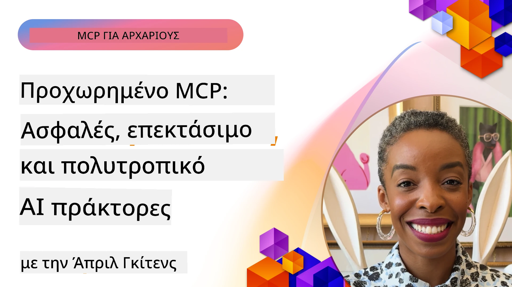

# Προχωρημένα Θέματα στο MCP

_(Κάντε κλικ στην εικόνα παραπάνω για να δείτε το βίντεο αυτού του μαθήματος)_

Αυτό το κεφάλαιο καλύπτει μια σειρά προχωρημένων θεμάτων στην υλοποίηση του Πρωτοκόλλου Συμφραζομένου Μοντέλου (MCP), περιλαμβάνοντας πολυμορφική ενσωμάτωση, κλιμακωσιμότητα, βέλτιστες πρακτικές ασφάλειας και ενσωμάτωση σε επιχειρήσεις. Αυτά τα θέματα είναι κρίσιμα για την κατασκευή ανθεκτικών και έτοιμων για παραγωγή εφαρμογών MCP που μπορούν να ανταποκριθούν στις απαιτήσεις των σύγχρονων συστημάτων τεχνητής νοημοσύνης.

## Επισκόπηση

Αυτό το μάθημα εξερευνά προχωρημένες έννοιες στην υλοποίηση του Πρωτοκόλλου Συμφραζομένου Μοντέλου, εστιάζοντας στην πολυμορφική ενσωμάτωση, την κλιμακωσιμότητα, τις βέλτιστες πρακτικές ασφάλειας και την ενσωμάτωση σε επιχειρήσεις. Αυτά τα θέματα είναι απαραίτητα για την κατασκευή εφαρμογών MCP παραγωγικής ποιότητας που μπορούν να χειριστούν πολύπλοκες απαιτήσεις σε επιχειρησιακά περιβάλλοντα.

## Στόχοι Μάθησης

Στο τέλος αυτού του μαθήματος, θα μπορείτε να:

- Υλοποιήσετε πολυμορφικές δυνατότητες εντός των πλαισίων MCP
- Σχεδιάσετε κλιμακούμενες αρχιτεκτονικές MCP για σενάρια υψηλής ζήτησης
- Εφαρμόσετε βέλτιστες πρακτικές ασφάλειας σύμφωνες με τις αρχές ασφάλειας του MCP
- Ενσωματώσετε το MCP με επιχειρησιακά συστήματα και πλαίσια τεχνητής νοημοσύνης
- Βελτιστοποιήσετε την απόδοση και αξιοπιστία σε παραγωγικά περιβάλλοντα

## Μαθήματα και Παραδείγματα Έργων

| Link | Τίτλος | Περιγραφή |
|------|-------|-------------|
| [5.1 Integration with Azure](./mcp-integration/README.md) | Ενσωμάτωση με Azure | Μάθετε πώς να ενσωματώνετε τον MCP Server σας στο Azure |
| [5.2 Multi modal sample](./mcp-multi-modality/README.md) | Παραδείγματα MCP Πολυμορφικότητας | Παραδείγματα για ήχο, εικόνα και πολυμορφικές απαντήσεις |
| [5.3 MCP OAuth2 sample](../../../05-AdvancedTopics/mcp-oauth2-demo) | Παράδειγμα MCP OAuth2 | Ελάχιστη εφαρμογή Spring Boot που δείχνει το OAuth2 με MCP, ως Authorization και Resource Server. Επιδεικνύει ασφαλή έκδοση διακριτικών, προστατευμένα endpoints, ανάπτυξη Azure Container Apps, και ενσωμάτωση με API Management. |
| [5.4 Root Contexts](./mcp-root-contexts/README.md) | Βασικά συμφραζόμενα | Μάθετε περισσότερα για τα βασικά συμφραζόμενα και πώς να τα υλοποιήσετε |
| [5.5 Routing](./mcp-routing/README.md) | Κατευθυντήριες Οδηγίες | Μάθετε διαφορετικούς τύπους δρομολόγησης |
| [5.6 Sampling](./mcp-sampling/README.md) | Δειγματοληψία | Μάθετε πώς να εργάζεστε με δειγματοληψία |
| [5.7 Scaling](./mcp-scaling/README.md) | Κλιμάκωση | Μάθετε για την κλιμάκωση |
| [5.8 Security](./mcp-security/README.md) | Ασφάλεια | Ασφαλίστε τον MCP Server σας |
| [5.9 Web Search sample](./web-search-mcp/README.md) | Αναζήτηση Web MCP | Python MCP server και client που ενσωματώνει το SerpAPI για πραγματικού χρόνου αναζήτηση στο διαδίκτυο, ειδήσεις, προϊόντα και Q&A. Επιδεικνύει πολυεργαλειακή ορχήστρωση, ενσωμάτωση εξωτερικών API, και ανθεκτικό χειρισμό σφαλμάτων. |
| [5.10 Realtime Streaming](./mcp-realtimestreaming/README.md) | Ροή δεδομένων | Η ροή δεδομένων πραγματικού χρόνου έχει γίνει απαραίτητη στον σημερινό κόσμο βασισμένο στα δεδομένα, όπου επιχειρήσεις και εφαρμογές απαιτούν άμεση πρόσβαση σε πληροφορίες για έγκαιρες αποφάσεις.|
| [5.11 Realtime Web Search](./mcp-realtimesearch/README.md) | Αναζήτηση Web | Πραγματικού χρόνου αναζήτηση στο διαδίκτυο και πως το MCP μετασχηματίζει την αναζήτηση παρέχοντας έναν τυποποιημένο τρόπο διαχείρισης συμφραζομένων ανάμεσα σε μοντέλα AI, μηχανές αναζήτησης και εφαρμογές.| 
| [5.12  Entra ID Authentication for Model Context Protocol Servers](./mcp-security-entra/README.md) | Πιστοποίηση Entra ID | Το Microsoft Entra ID παρέχει μια ισχυρή λύση διαχείρισης ταυτότητας και πρόσβασης με βάση το cloud, βοηθώντας να διασφαλιστεί ότι μόνο εξουσιοδοτημένοι χρήστες και εφαρμογές μπορούν να αλληλεπιδρούν με τον MCP server σας.|
| [5.13 Azure AI Foundry Agent Integration](./mcp-foundry-agent-integration/README.md) | Ενσωμάτωση Azure AI Foundry | Μάθετε πώς να ενσωματώνετε MCP servers με τους agents Azure AI Foundry, επιτρέποντας ισχυρή ορχήστρωση εργαλείων και επιχειρησιακές δυνατότητες AI με τυποποιημένες συνδέσεις σε εξωτερικές πηγές δεδομένων.|
| [5.14 Context Engineering](./mcp-contextengineering/README.md) | Μηχανική Συμφραζομένου | Η μελλοντική ευκαιρία των τεχνικών μηχανικής συμφραζομένου για MCP servers, συμπεριλαμβανομένης της βελτιστοποίησης συμφραζομένου, δυναμικής διαχείρισης συμφραζομένων, και στρατηγικών για αποτελεσματική μηχανική οδηγιών (prompt engineering) εντός των πλαισίων MCP.|
| [5.15 MCP Custom Transport](./mcp-transport/README.md) | Προσαρμοσμένη Μεταφορά | Μάθετε πώς να υλοποιείτε προσαρμοσμένους μηχανισμούς μεταφοράς για εξειδικευμένα σενάρια επικοινωνίας MCP.|
| [5.16 Protocol Features Deep Dive](./mcp-protocol-features/README.md) | Εμβάθυνση Χαρακτηριστικών Πρωτοκόλλου | Κυριαρχήστε σε προχωρημένα χαρακτηριστικά πρωτοκόλλου όπως ειδοποιήσεις προόδου, ακύρωση αιτήσεων, πρότυπα πόρων, και μοτίβα χειρισμού σφαλμάτων.|

> **Νέο στην Προδιαγραφή MCP 2025-11-25**: Η προδιαγραφή πλέον περιλαμβάνει πειραματική υποστήριξη για **Εργασίες** (μακροχρόνιες λειτουργίες με παρακολούθηση προόδου), **Σχόλια Εργαλείων** (μεταδεδομένα σχετικά με τη συμπεριφορά εργαλείων για ασφάλεια), **Εκζήτηση Λειτουργίας URL** (αίτηση συγκεκριμένου περιεχομένου URL από τους πελάτες), και βελτιωμένα **Roots** (για διαχείριση συμφραζομένων εργασίας). Δείτε το [αρχείο αλλαγών της Προδιαγραφής MCP](https://spec.modelcontextprotocol.io/) για πλήρεις λεπτομέρειες.

## Επιπλέον Αναφορές

Για τις πιο ενημερωμένες πληροφορίες σχετικά με προχωρημένα θέματα MCP, ανατρέξτε σε:
- [Τεκμηρίωση MCP](https://modelcontextprotocol.io/)
- [Προδιαγραφή MCP (2025-11-25)](https://spec.modelcontextprotocol.io/specification/2025-11-25/)
- [Αποθετήριο GitHub](https://github.com/modelcontextprotocol)
- [OWASP MCP Top 10](https://microsoft.github.io/mcp-azure-security-guide/mcp/) - Κίνδυνοι ασφάλειας και μέτρα αντιμετώπισης
- [Εργαστήριο Ασφάλειας MCP Summit (Sherpa)](https://azure-samples.github.io/sherpa/) - Εκπαιδευτικό εργαστήριο ασφάλειας

## Κύρια Σημεία

- Οι πολυμορφικές υλοποιήσεις MCP επεκτείνουν τις δυνατότητες AI πέρα από την επεξεργασία κειμένου
- Η κλιμακωσιμότητα είναι απαραίτητη για επιχειρησιακές αναπτύξεις και μπορεί να αντιμετωπιστεί μέσω οριζόντιας και κάθετης κλιμάκωσης
- Ολοκληρωμένα μέτρα ασφάλειας προστατεύουν τα δεδομένα και εξασφαλίζουν κατάλληλο έλεγχο πρόσβασης
- Η ενσωμάτωση επιχειρήσεων με πλατφόρμες όπως Azure OpenAI και Microsoft AI Foundry ενισχύει τις δυνατότητες MCP
- Οι προχωρημένες υλοποιήσεις MCP ωφελούνται από βελτιστοποιημένες αρχιτεκτονικές και προσεκτική διαχείριση πόρων

## Άσκηση

Σχεδιάστε μια υλοποίηση MCP επιχειρησιακής κλάσης για ένα συγκεκριμένο σενάριο:

1. Προσδιορίστε πολυμορφικές απαιτήσεις για το σενάριο χρήσης σας
2. Περιγράψτε τους ελέγχους ασφαλείας που απαιτούνται για την προστασία ευαίσθητων δεδομένων
3. Σχεδιάστε μια κλιμακούμενη αρχιτεκτονική που μπορεί να χειριστεί μεταβαλλόμενο φόρτο
4. Προγραμματίστε τα σημεία ενσωμάτωσης με επιχειρησιακά συστήματα AI
5. Τεκμηριώστε ενδεχόμενα σημεία συμφόρησης στην απόδοση και στρατηγικές αντιμετώπισης

## Επιπλέον Πόροι

- [Τεκμηρίωση Azure OpenAI](https://learn.microsoft.com/en-us/azure/ai-services/openai/)
- [Τεκμηρίωση Microsoft AI Foundry](https://learn.microsoft.com/en-us/ai-services/)

---

## Τι ακολουθεί

Εξερευνήστε τα μαθήματα σε αυτό το module ξεκινώντας με: [5.1 MCP Integration](./mcp-integration/README.md)

Μετά την ολοκλήρωση αυτού του module, συνεχίστε στο: [Module 6: Community Contributions](../06-CommunityContributions/README.md)

---

<!-- CO-OP TRANSLATOR DISCLAIMER START -->
**Αποποίηση ευθυνών**:  
Αυτό το έγγραφο έχει μεταφραστεί χρησιμοποιώντας υπηρεσία αυτόματης μετάφρασης AI [Co-op Translator](https://github.com/Azure/co-op-translator). Παρόλο που καταβάλλουμε προσπάθεια για ακρίβεια, παρακαλούμε να λάβετε υπόψη ότι οι αυτόματες μεταφράσεις ενδέχεται να περιέχουν λάθη ή ανακρίβειες. Το πρωτότυπο έγγραφο στη μητρική του γλώσσα θα πρέπει να θεωρείται η επίσημη πηγή. Για κρίσιμες πληροφορίες, συνιστάται επαγγελματική ανθρώπινη μετάφραση. Δεν φέρουμε ευθύνη για τυχόν παρεξηγήσεις ή λανθασμένες ερμηνείες που προκύπτουν από τη χρήση αυτής της μετάφρασης.
<!-- CO-OP TRANSLATOR DISCLAIMER END -->