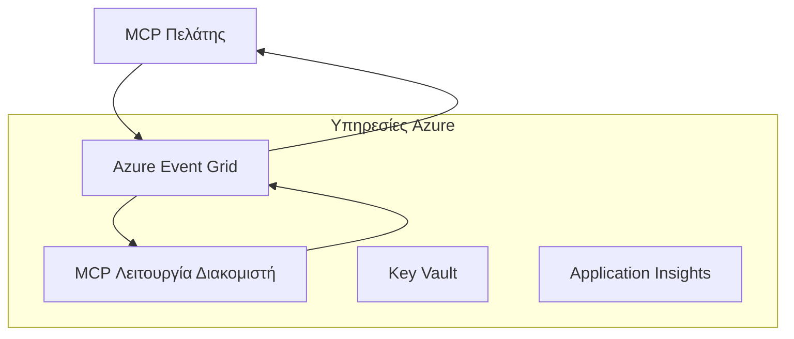
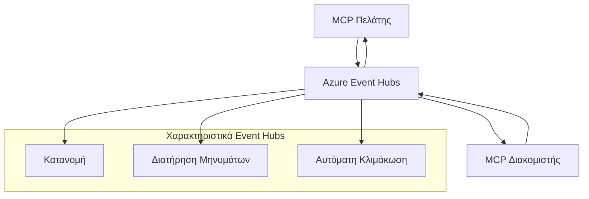

# MCP Προσαρμοσμένα Μέσα Μεταφοράς - Οδηγός Προχωρημένης Υλοποίησης

Το Πρωτόκολλο Πλαισίου Μοντέλου (MCP) παρέχει ευελιξία στους μηχανισμούς μεταφοράς, επιτρέποντας προσαρμοσμένες υλοποιήσεις για εξειδικευμένα επιχειρησιακά περιβάλλοντα. Αυτός ο προχωρημένος οδηγός εξερευνά προσαρμοσμένες υλοποιήσεις μέσων μεταφοράς χρησιμοποιώντας το Azure Event Grid και το Azure Event Hubs ως πρακτικά παραδείγματα για την κατασκευή κλιμακούμενων, εγγενών στο cloud λύσεων MCP.

## Εισαγωγή

Ενώ τα τυπικά μέσα μεταφοράς του MCP (stdio και HTTP streaming) εξυπηρετούν τις περισσότερες περιπτώσεις χρήσης, τα επιχειρησιακά περιβάλλοντα συχνά απαιτούν εξειδικευμένους μηχανισμούς μεταφοράς για βελτιωμένη κλιμάκωση, αξιοπιστία και ενσωμάτωση με την υπάρχουσα υποδομή cloud. Τα προσαρμοσμένα μέσα μεταφοράς επιτρέπουν στο MCP να αξιοποιεί εγγενείς υπηρεσίες μηνυμάτων cloud για ασύγχρονη επικοινωνία, αρχιτεκτονικές που βασίζονται σε γεγονότα και κατανεμημένη επεξεργασία.

Αυτό το μάθημα εξερευνά προχωρημένες υλοποιήσεις μέσων μεταφοράς βασισμένες στην τελευταία προδιαγραφή MCP (2025-11-25), τις υπηρεσίες μηνυμάτων Azure και καθιερωμένα πρότυπα ενσωμάτωσης επιχειρήσεων.

### **Αρχιτεκτονική Μέσων Μεταφοράς MCP**

**Από την Προδιαγραφή MCP (2025-11-25):**

- **Τυπικά Μέσα Μεταφοράς**: stdio (συνιστώμενο), HTTP streaming (για απομακρυσμένα σενάρια)
- **Προσαρμοσμένα Μέσα Μεταφοράς**: Οποιοδήποτε μέσο μεταφοράς που υλοποιεί το πρωτόκολλο ανταλλαγής μηνυμάτων MCP
- **Μορφή Μηνύματος**: JSON-RPC 2.0 με επεκτάσεις ειδικές για MCP
- **Αμφίδρομη Επικοινωνία**: Απαιτείται πλήρης διπλής κατεύθυνσης επικοινωνία για ειδοποιήσεις και απαντήσεις

## Στόχοι Μάθησης

Στο τέλος αυτού του προχωρημένου μαθήματος, θα μπορείτε να:

- **Κατανοήσετε τις Απαιτήσεις Προσαρμοσμένων Μέσων Μεταφοράς**: Υλοποιήστε το πρωτόκολλο MCP πάνω από οποιοδήποτε επίπεδο μεταφοράς διατηρώντας τη συμμόρφωση
- **Κατασκευάσετε Μέσο Μεταφοράς Azure Event Grid**: Δημιουργήστε MCP servers που βασίζονται σε γεγονότα χρησιμοποιώντας το Azure Event Grid για κλιμακούμενη λειτουργία χωρίς διακομιστή
- **Υλοποιήσετε Μέσο Μεταφοράς Azure Event Hubs**: Σχεδιάστε λύσεις MCP υψηλής απόδοσης χρησιμοποιώντας το Azure Event Hubs για ροή σε πραγματικό χρόνο
- **Εφαρμόσετε Επιχειρησιακά Πρότυπα**: Ενσωματώστε προσαρμοσμένα μέσα μεταφοράς με την υπάρχουσα υποδομή και μοντέλα ασφάλειας Azure
- **Διαχειριστείτε την Αξιοπιστία των Μέσων Μεταφοράς**: Υλοποιήστε ανθεκτικότητα μηνυμάτων, σειρά και διαχείριση σφαλμάτων για επιχειρησιακά σενάρια
- **Βελτιστοποιήσετε την Απόδοση**: Σχεδιάστε λύσεις μέσων μεταφοράς για απαιτήσεις κλίμακας, καθυστέρησης και διαμέσου ροής

## **Απαιτήσεις Μέσων Μεταφοράς**

### **Βασικές Απαιτήσεις από την Προδιαγραφή MCP (2025-11-25):**

```yaml
Message Protocol:
  format: "JSON-RPC 2.0 with MCP extensions"
  bidirectional: "Full duplex communication required"
  ordering: "Message ordering must be preserved per session"
  
Transport Layer:
  reliability: "Transport MUST handle connection failures gracefully"
  security: "Transport MUST support secure communication"
  identification: "Each session MUST have unique identifier"
  
Custom Transport:
  compliance: "MUST implement complete MCP message exchange"
  extensibility: "MAY add transport-specific features"
  interoperability: "MUST maintain protocol compatibility"
```

## **Υλοποίηση Μέσου Μεταφοράς Azure Event Grid**

Το Azure Event Grid παρέχει μια υπηρεσία δρομολόγησης γεγονότων χωρίς διακομιστή ιδανική για αρχιτεκτονικές MCP που βασίζονται σε γεγονότα. Αυτή η υλοποίηση δείχνει πώς να κατασκευάσετε κλιμακούμενα, χαλαρά συνδεδεμένα συστήματα MCP.

### **Επισκόπηση Αρχιτεκτονικής**


### **Υλοποίηση σε C# - Μέσο Μεταφοράς Event Grid**

```csharp
using Azure.Messaging.EventGrid;
using Microsoft.Extensions.Azure;
using System.Text.Json;

public class EventGridMcpTransport : IMcpTransport
{
    private readonly EventGridPublisherClient _publisher;
    private readonly string _topicEndpoint;
    private readonly string _clientId;
    
    public EventGridMcpTransport(string topicEndpoint, string accessKey, string clientId)
    {
        _publisher = new EventGridPublisherClient(
            new Uri(topicEndpoint), 
            new AzureKeyCredential(accessKey));
        _topicEndpoint = topicEndpoint;
        _clientId = clientId;
    }
    
    public async Task SendMessageAsync(McpMessage message)
    {
        var eventGridEvent = new EventGridEvent(
            subject: $"mcp/{_clientId}",
            eventType: "MCP.MessageReceived",
            dataVersion: "1.0",
            data: JsonSerializer.Serialize(message))
        {
            Id = Guid.NewGuid().ToString(),
            EventTime = DateTimeOffset.UtcNow
        };
        
        await _publisher.SendEventAsync(eventGridEvent);
    }
    
    public async Task<McpMessage> ReceiveMessageAsync(CancellationToken cancellationToken)
    {
        // Event Grid is push-based, so implement webhook receiver
        // This would typically be handled by Azure Functions trigger
        throw new NotImplementedException("Use EventGridTrigger in Azure Functions");
    }
}

// Azure Function for receiving Event Grid events
[FunctionName("McpEventGridReceiver")]
public async Task<IActionResult> HandleEventGridMessage(
    [EventGridTrigger] EventGridEvent eventGridEvent,
    ILogger log)
{
    try
    {
        var mcpMessage = JsonSerializer.Deserialize<McpMessage>(
            eventGridEvent.Data.ToString());
        
        // Process MCP message
        var response = await _mcpServer.ProcessMessageAsync(mcpMessage);
        
        // Send response back via Event Grid
        await _transport.SendMessageAsync(response);
        
        return new OkResult();
    }
    catch (Exception ex)
    {
        log.LogError(ex, "Error processing Event Grid MCP message");
        return new BadRequestResult();
    }
}
```

### **Υλοποίηση σε TypeScript - Μέσο Μεταφοράς Event Grid**

```typescript
import { EventGridPublisherClient, AzureKeyCredential } from "@azure/eventgrid";
import { McpTransport, McpMessage } from "./mcp-types";

export class EventGridMcpTransport implements McpTransport {
    private publisher: EventGridPublisherClient;
    private clientId: string;
    
    constructor(
        private topicEndpoint: string,
        private accessKey: string,
        clientId: string
    ) {
        this.publisher = new EventGridPublisherClient(
            topicEndpoint,
            new AzureKeyCredential(accessKey)
        );
        this.clientId = clientId;
    }
    
    async sendMessage(message: McpMessage): Promise<void> {
        const event = {
            id: crypto.randomUUID(),
            source: `mcp-client-${this.clientId}`,
            type: "MCP.MessageReceived",
            time: new Date(),
            data: message
        };
        
        await this.publisher.sendEvents([event]);
    }
    
    // Λήψη με βάση τα γεγονότα μέσω Azure Functions
    onMessage(handler: (message: McpMessage) => Promise<void>): void {
        // Η υλοποίηση θα χρησιμοποιούσε το Event Grid trigger των Azure Functions
        // Αυτή είναι μια εννοιολογική διεπαφή για τον δέκτη webhook
    }
}

// Υλοποίηση Azure Functions
import { app, InvocationContext, EventGridEvent } from "@azure/functions";

app.eventGrid("mcpEventGridHandler", {
    handler: async (event: EventGridEvent, context: InvocationContext) => {
        try {
            const mcpMessage = event.data as McpMessage;
            
            // Επεξεργασία μηνύματος MCP
            const response = await mcpServer.processMessage(mcpMessage);
            
            // Αποστολή απάντησης μέσω Event Grid
            await transport.sendMessage(response);
            
        } catch (error) {
            context.error("Error processing MCP message:", error);
            throw error;
        }
    }
});
```

### **Υλοποίηση σε Python - Μέσο Μεταφοράς Event Grid**

```python
from azure.eventgrid import EventGridPublisherClient, EventGridEvent
from azure.core.credentials import AzureKeyCredential
import asyncio
import json
from typing import Callable, Optional
import uuid
from datetime import datetime

class EventGridMcpTransport:
    def __init__(self, topic_endpoint: str, access_key: str, client_id: str):
        self.client = EventGridPublisherClient(
            topic_endpoint, 
            AzureKeyCredential(access_key)
        )
        self.client_id = client_id
        self.message_handler: Optional[Callable] = None
    
    async def send_message(self, message: dict) -> None:
        """Send MCP message via Event Grid"""
        event = EventGridEvent(
            data=message,
            subject=f"mcp/{self.client_id}",
            event_type="MCP.MessageReceived",
            data_version="1.0"
        )
        
        await self.client.send(event)
    
    def on_message(self, handler: Callable[[dict], None]) -> None:
        """Register message handler for incoming events"""
        self.message_handler = handler

# Υλοποίηση Azure Functions
import azure.functions as func
import logging

def main(event: func.EventGridEvent) -> None:
    """Azure Functions Event Grid trigger for MCP messages"""
    try:
        # Ανάλυση μηνύματος MCP από το συμβάν Event Grid
        mcp_message = json.loads(event.get_body().decode('utf-8'))
        
        # Επεξεργασία μηνύματος MCP
        response = process_mcp_message(mcp_message)
        
        # Αποστολή απάντησης μέσω Event Grid
        # (Η υλοποίηση θα δημιουργούσε νέο πελάτη Event Grid)
        
    except Exception as e:
        logging.error(f"Error processing MCP Event Grid message: {e}")
        raise
```

## **Υλοποίηση Μέσου Μεταφοράς Azure Event Hubs**

Το Azure Event Hubs παρέχει δυνατότητες ροής υψηλής απόδοσης και σε πραγματικό χρόνο για σενάρια MCP που απαιτούν χαμηλή καθυστέρηση και μεγάλο όγκο μηνυμάτων.

### **Επισκόπηση Αρχιτεκτονικής**


### **Υλοποίηση σε C# - Μέσο Μεταφοράς Event Hubs**

```csharp
using Azure.Messaging.EventHubs;
using Azure.Messaging.EventHubs.Producer;
using Azure.Messaging.EventHubs.Consumer;
using System.Text;

public class EventHubsMcpTransport : IMcpTransport, IDisposable
{
    private readonly EventHubProducerClient _producer;
    private readonly EventHubConsumerClient _consumer;
    private readonly string _consumerGroup;
    private readonly CancellationTokenSource _cancellationTokenSource;
    
    public EventHubsMcpTransport(
        string connectionString, 
        string eventHubName,
        string consumerGroup = "$Default")
    {
        _producer = new EventHubProducerClient(connectionString, eventHubName);
        _consumer = new EventHubConsumerClient(
            consumerGroup, 
            connectionString, 
            eventHubName);
        _consumerGroup = consumerGroup;
        _cancellationTokenSource = new CancellationTokenSource();
    }
    
    public async Task SendMessageAsync(McpMessage message)
    {
        var messageBody = JsonSerializer.Serialize(message);
        var eventData = new EventData(Encoding.UTF8.GetBytes(messageBody));
        
        // Add MCP-specific properties
        eventData.Properties.Add("MessageType", message.Method ?? "response");
        eventData.Properties.Add("MessageId", message.Id);
        eventData.Properties.Add("Timestamp", DateTimeOffset.UtcNow);
        
        await _producer.SendAsync(new[] { eventData });
    }
    
    public async Task StartReceivingAsync(
        Func<McpMessage, Task> messageHandler)
    {
        await foreach (PartitionEvent partitionEvent in _consumer.ReadEventsAsync(
            _cancellationTokenSource.Token))
        {
            try
            {
                var messageBody = Encoding.UTF8.GetString(
                    partitionEvent.Data.EventBody.ToArray());
                var mcpMessage = JsonSerializer.Deserialize<McpMessage>(messageBody);
                
                await messageHandler(mcpMessage);
            }
            catch (Exception ex)
            {
                // Handle deserialization or processing errors
                Console.WriteLine($"Error processing message: {ex.Message}");
            }
        }
    }
    
    public void Dispose()
    {
        _cancellationTokenSource?.Cancel();
        _producer?.DisposeAsync().AsTask().Wait();
        _consumer?.DisposeAsync().AsTask().Wait();
        _cancellationTokenSource?.Dispose();
    }
}
```

### **Υλοποίηση σε TypeScript - Μέσο Μεταφοράς Event Hubs**

```typescript
import { 
    EventHubProducerClient, 
    EventHubConsumerClient, 
    EventData 
} from "@azure/event-hubs";

export class EventHubsMcpTransport implements McpTransport {
    private producer: EventHubProducerClient;
    private consumer: EventHubConsumerClient;
    private isReceiving = false;
    
    constructor(
        private connectionString: string,
        private eventHubName: string,
        private consumerGroup: string = "$Default"
    ) {
        this.producer = new EventHubProducerClient(
            connectionString, 
            eventHubName
        );
        this.consumer = new EventHubConsumerClient(
            consumerGroup,
            connectionString,
            eventHubName
        );
    }
    
    async sendMessage(message: McpMessage): Promise<void> {
        const eventData: EventData = {
            body: JSON.stringify(message),
            properties: {
                messageType: message.method || "response",
                messageId: message.id,
                timestamp: new Date().toISOString()
            }
        };
        
        await this.producer.sendBatch([eventData]);
    }
    
    async startReceiving(
        messageHandler: (message: McpMessage) => Promise<void>
    ): Promise<void> {
        if (this.isReceiving) return;
        
        this.isReceiving = true;
        
        const subscription = this.consumer.subscribe({
            processEvents: async (events, context) => {
                for (const event of events) {
                    try {
                        const messageBody = event.body as string;
                        const mcpMessage: McpMessage = JSON.parse(messageBody);
                        
                        await messageHandler(mcpMessage);
                        
                        // Ενημέρωση σημείου ελέγχου για παράδοση τουλάχιστον μία φορά
                        await context.updateCheckpoint(event);
                    } catch (error) {
                        console.error("Error processing Event Hubs message:", error);
                    }
                }
            },
            processError: async (err, context) => {
                console.error("Event Hubs error:", err);
            }
        });
    }
    
    async close(): Promise<void> {
        this.isReceiving = false;
        await this.producer.close();
        await this.consumer.close();
    }
}
```

### **Υλοποίηση σε Python - Μέσο Μεταφοράς Event Hubs**

```python
from azure.eventhub import EventHubProducerClient, EventHubConsumerClient
from azure.eventhub import EventData
import json
import asyncio
from typing import Callable, Dict, Any
import logging

class EventHubsMcpTransport:
    def __init__(
        self, 
        connection_string: str, 
        eventhub_name: str,
        consumer_group: str = "$Default"
    ):
        self.producer = EventHubProducerClient.from_connection_string(
            connection_string, 
            eventhub_name=eventhub_name
        )
        self.consumer = EventHubConsumerClient.from_connection_string(
            connection_string,
            consumer_group=consumer_group,
            eventhub_name=eventhub_name
        )
        self.is_receiving = False
    
    async def send_message(self, message: Dict[str, Any]) -> None:
        """Send MCP message via Event Hubs"""
        event_data = EventData(json.dumps(message))
        
        # Προσθέστε ιδιότητες ειδικές για MCP
        event_data.properties = {
            "messageType": message.get("method", "response"),
            "messageId": message.get("id"),
            "timestamp": "2025-01-14T10:30:00Z"  # Χρησιμοποιήστε πραγματικό χρονικό σήμα
        }
        
        async with self.producer:
            event_data_batch = await self.producer.create_batch()
            event_data_batch.add(event_data)
            await self.producer.send_batch(event_data_batch)
    
    async def start_receiving(
        self, 
        message_handler: Callable[[Dict[str, Any]], None]
    ) -> None:
        """Start receiving MCP messages from Event Hubs"""
        if self.is_receiving:
            return
        
        self.is_receiving = True
        
        async with self.consumer:
            await self.consumer.receive(
                on_event=self._on_event_received(message_handler),
                starting_position="-1"  # Ξεκινήστε από την αρχή
            )
    
    def _on_event_received(self, handler: Callable):
        """Internal event handler wrapper"""
        async def handle_event(partition_context, event):
            try:
                # Αναλύστε το μήνυμα MCP από το συμβάν Event Hubs
                message_body = event.body_as_str(encoding='UTF-8')
                mcp_message = json.loads(message_body)
                
                # Επεξεργαστείτε το μήνυμα MCP
                await handler(mcp_message)
                
                # Ενημερώστε το σημείο ελέγχου για παράδοση τουλάχιστον μία φορά
                await partition_context.update_checkpoint(event)
                
            except Exception as e:
                logging.error(f"Error processing Event Hubs message: {e}")
        
        return handle_event
    
    async def close(self) -> None:
        """Clean up transport resources"""
        self.is_receiving = False
        await self.producer.close()
        await self.consumer.close()
```

## **Προχωρημένα Πρότυπα Μέσων Μεταφοράς**

### **Ανθεκτικότητα και Αξιοπιστία Μηνυμάτων**

```csharp
// Implementing message durability with retry logic
public class ReliableTransportWrapper : IMcpTransport
{
    private readonly IMcpTransport _innerTransport;
    private readonly RetryPolicy _retryPolicy;
    
    public async Task SendMessageAsync(McpMessage message)
    {
        await _retryPolicy.ExecuteAsync(async () =>
        {
            try
            {
                await _innerTransport.SendMessageAsync(message);
            }
            catch (TransportException ex) when (ex.IsRetryable)
            {
                // Log and retry
                throw;
            }
        });
    }
}
```

### **Ενσωμάτωση Ασφάλειας Μέσων Μεταφοράς**

```csharp
// Integrating Azure Key Vault for transport security
public class SecureTransportFactory
{
    private readonly SecretClient _keyVaultClient;
    
    public async Task<IMcpTransport> CreateEventGridTransportAsync()
    {
        var accessKey = await _keyVaultClient.GetSecretAsync("EventGridAccessKey");
        var topicEndpoint = await _keyVaultClient.GetSecretAsync("EventGridTopic");
        
        return new EventGridMcpTransport(
            topicEndpoint.Value.Value,
            accessKey.Value.Value,
            Environment.MachineName
        );
    }
}
```

### **Παρακολούθηση και Παρατηρησιμότητα Μέσων Μεταφοράς**

```csharp
// Adding telemetry to custom transports
public class ObservableTransport : IMcpTransport
{
    private readonly IMcpTransport _transport;
    private readonly ILogger _logger;
    private readonly TelemetryClient _telemetryClient;
    
    public async Task SendMessageAsync(McpMessage message)
    {
        using var activity = Activity.StartActivity("MCP.Transport.Send");
        activity?.SetTag("transport.type", "EventGrid");
        activity?.SetTag("message.method", message.Method);
        
        var stopwatch = Stopwatch.StartNew();
        
        try
        {
            await _transport.SendMessageAsync(message);
            
            _telemetryClient.TrackDependency(
                "EventGrid",
                "SendMessage",
                DateTime.UtcNow.Subtract(stopwatch.Elapsed),
                stopwatch.Elapsed,
                true
            );
        }
        catch (Exception ex)
        {
            _telemetryClient.TrackException(ex);
            throw;
        }
    }
}
```

## **Σενάρια Επιχειρησιακής Ενσωμάτωσης**

### **Σενάριο 1: Κατανεμημένη Επεξεργασία MCP**

Χρήση του Azure Event Grid για διανομή αιτημάτων MCP σε πολλούς κόμβους επεξεργασίας:

```yaml
Architecture:
  - MCP Client sends requests to Event Grid topic
  - Multiple Azure Functions subscribe to process different tool types
  - Results aggregated and returned via separate response topic
  
Benefits:
  - Horizontal scaling based on message volume
  - Fault tolerance through redundant processors
  - Cost optimization with serverless compute
```

### **Σενάριο 2: Ροή MCP σε Πραγματικό Χρόνο**

Χρήση του Azure Event Hubs για αλληλεπιδράσεις MCP υψηλής συχνότητας:

```yaml
Architecture:
  - MCP Client streams continuous requests via Event Hubs
  - Stream Analytics processes and routes messages
  - Multiple consumers handle different aspect of processing
  
Benefits:
  - Low latency for real-time scenarios
  - High throughput for batch processing
  - Built-in partitioning for parallel processing
```

### **Σενάριο 3: Υβριδική Αρχιτεκτονική Μέσων Μεταφοράς**

Συνδυασμός πολλαπλών μέσων μεταφοράς για διαφορετικές περιπτώσεις χρήσης:

```csharp
public class HybridMcpTransport : IMcpTransport
{
    private readonly IMcpTransport _realtimeTransport; // Event Hubs
    private readonly IMcpTransport _batchTransport;    // Event Grid
    private readonly IMcpTransport _fallbackTransport; // HTTP Streaming
    
    public async Task SendMessageAsync(McpMessage message)
    {
        // Route based on message characteristics
        var transport = message.Method switch
        {
            "tools/call" when IsRealtime(message) => _realtimeTransport,
            "resources/read" when IsBatch(message) => _batchTransport,
            _ => _fallbackTransport
        };
        
        await transport.SendMessageAsync(message);
    }
}
```

## **Βελτιστοποίηση Απόδοσης**

### **Ομαδοποίηση Μηνυμάτων για Event Grid**

```csharp
public class BatchingEventGridTransport : IMcpTransport
{
    private readonly List<McpMessage> _messageBuffer = new();
    private readonly Timer _flushTimer;
    private const int MaxBatchSize = 100;
    
    public async Task SendMessageAsync(McpMessage message)
    {
        lock (_messageBuffer)
        {
            _messageBuffer.Add(message);
            
            if (_messageBuffer.Count >= MaxBatchSize)
            {
                _ = Task.Run(FlushMessages);
            }
        }
    }
    
    private async Task FlushMessages()
    {
        List<McpMessage> toSend;
        lock (_messageBuffer)
        {
            toSend = new List<McpMessage>(_messageBuffer);
            _messageBuffer.Clear();
        }
        
        if (toSend.Any())
        {
            var events = toSend.Select(CreateEventGridEvent);
            await _publisher.SendEventsAsync(events);
        }
    }
}
```

### **Στρατηγική Κατανομής για Event Hubs**

```csharp
public class PartitionedEventHubsTransport : IMcpTransport
{
    public async Task SendMessageAsync(McpMessage message)
    {
        // Partition by client ID for session affinity
        var partitionKey = ExtractClientId(message);
        
        var eventData = new EventData(JsonSerializer.SerializeToUtf8Bytes(message))
        {
            PartitionKey = partitionKey
        };
        
        await _producer.SendAsync(new[] { eventData });
    }
}
```

## **Δοκιμές Προσαρμοσμένων Μέσων Μεταφοράς**

### **Μονάδα Δοκιμών με Διπλά Αντικείμενα**

```csharp
[Test]
public async Task EventGridTransport_SendMessage_PublishesCorrectEvent()
{
    // Arrange
    var mockPublisher = new Mock<EventGridPublisherClient>();
    var transport = new EventGridMcpTransport(mockPublisher.Object);
    var message = new McpMessage { Method = "tools/list", Id = "test-123" };
    
    // Act
    await transport.SendMessageAsync(message);
    
    // Assert
    mockPublisher.Verify(
        x => x.SendEventAsync(
            It.Is<EventGridEvent>(e => 
                e.EventType == "MCP.MessageReceived" &&
                e.Subject == "mcp/test-client"
            )
        ),
        Times.Once
    );
}
```

### **Ολοκληρωμένες Δοκιμές με Azure Test Containers**

```csharp
[Test]
public async Task EventHubsTransport_IntegrationTest()
{
    // Using Testcontainers for integration testing
    var eventHubsContainer = new EventHubsContainer()
        .WithEventHub("test-hub");
    
    await eventHubsContainer.StartAsync();
    
    var transport = new EventHubsMcpTransport(
        eventHubsContainer.GetConnectionString(),
        "test-hub"
    );
    
    // Test message round-trip
    var sentMessage = new McpMessage { Method = "test", Id = "123" };
    McpMessage receivedMessage = null;
    
    await transport.StartReceivingAsync(msg => {
        receivedMessage = msg;
        return Task.CompletedTask;
    });
    
    await transport.SendMessageAsync(sentMessage);
    await Task.Delay(1000); // Allow for message processing
    
    Assert.That(receivedMessage?.Id, Is.EqualTo("123"));
}
```

## **Καλές Πρακτικές και Οδηγίες**

### **Αρχές Σχεδιασμού Μέσων Μεταφοράς**

1. **Αποδοτικότητα**: Διασφαλίστε ότι η επεξεργασία μηνυμάτων είναι αποδοτική για να χειρίζεται διπλότυπα
2. **Διαχείριση Σφαλμάτων**: Υλοποιήστε ολοκληρωμένη διαχείριση σφαλμάτων και ουρές νεκρών μηνυμάτων
3. **Παρακολούθηση**: Προσθέστε λεπτομερή τηλεμετρία και ελέγχους υγείας
4. **Ασφάλεια**: Χρησιμοποιήστε διαχειριζόμενες ταυτότητες και πρόσβαση με ελάχιστα προνόμια
5. **Απόδοση**: Σχεδιάστε για τις συγκεκριμένες απαιτήσεις καθυστέρησης και διαμέσου ροής

### **Συστάσεις Ειδικές για Azure**

1. **Χρησιμοποιήστε Διαχειριζόμενη Ταυτότητα**: Αποφύγετε τις συμβολοσειρές σύνδεσης στην παραγωγή
2. **Υλοποιήστε Διακόπτες Κυκλώματος**: Προστατέψτε από διακοπές υπηρεσιών Azure
3. **Παρακολουθήστε Κόστη**: Παρακολουθήστε όγκο μηνυμάτων και κόστη επεξεργασίας
4. **Σχεδιάστε για Κλίμακα**: Σχεδιάστε στρατηγικές κατανομής και κλιμάκωσης νωρίς
5. **Δοκιμάστε Ενδελεχώς**: Χρησιμοποιήστε το Azure DevTest Labs για ολοκληρωμένες δοκιμές

## **Συμπέρασμα**

Τα προσαρμοσμένα μέσα μεταφοράς MCP επιτρέπουν ισχυρά επιχειρησιακά σενάρια χρησιμοποιώντας τις υπηρεσίες μηνυμάτων του Azure. Με την υλοποίηση των μέσων μεταφοράς Event Grid ή Event Hubs, μπορείτε να κατασκευάσετε κλιμακούμενες, αξιόπιστες λύσεις MCP που ενσωματώνονται απρόσκοπτα με την υπάρχουσα υποδομή Azure.

Τα παραδείγματα που παρέχονται δείχνουν πρότυπα έτοιμα για παραγωγή για την υλοποίηση προσαρμοσμένων μέσων μεταφοράς διατηρώντας τη συμμόρφωση με το πρωτόκολλο MCP και τις βέλτιστες πρακτικές Azure.

## **Επιπλέον Πόροι**

- [Προδιαγραφή MCP 2025-06-18](https://spec.modelcontextprotocol.io/specification/2025-06-18/)
- [Τεκμηρίωση Azure Event Grid](https://docs.microsoft.com/azure/event-grid/)
- [Τεκμηρίωση Azure Event Hubs](https://docs.microsoft.com/azure/event-hubs/)
- [Azure Functions Event Grid Trigger](https://docs.microsoft.com/azure/azure-functions/functions-bindings-event-grid)
- [Azure SDK για .NET](https://github.com/Azure/azure-sdk-for-net)
- [Azure SDK για TypeScript](https://github.com/Azure/azure-sdk-for-js)
- [Azure SDK για Python](https://github.com/Azure/azure-sdk-for-python)

---

> *Αυτός ο οδηγός εστιάζει σε πρακτικά πρότυπα υλοποίησης για παραγωγικά συστήματα MCP. Πάντα να επικυρώνετε τις υλοποιήσεις μέσων μεταφοράς έναντι των συγκεκριμένων απαιτήσεών σας και των ορίων υπηρεσιών Azure.*
> **Τρέχον Πρότυπο**: Αυτός ο οδηγός αντικατοπτρίζει τις απαιτήσεις μέσων μεταφοράς και τα προχωρημένα πρότυπα μέσων μεταφοράς για επιχειρησιακά περιβάλλοντα της [Προδιαγραφής MCP 2025-06-18](https://spec.modelcontextprotocol.io/specification/2025-06-18/).


## Τι Ακολουθεί
- [6. Συνεισφορές Κοινότητας](../../06-CommunityContributions/README.md)

---

<!-- CO-OP TRANSLATOR DISCLAIMER START -->
**Αποποίηση ευθυνών**:  
Αυτό το έγγραφο έχει μεταφραστεί χρησιμοποιώντας την υπηρεσία αυτόματης μετάφρασης AI [Co-op Translator](https://github.com/Azure/co-op-translator). Παρόλο που επιδιώκουμε την ακρίβεια, παρακαλούμε να λάβετε υπόψη ότι οι αυτόματες μεταφράσεις ενδέχεται να περιέχουν λάθη ή ανακρίβειες. Το πρωτότυπο έγγραφο στη μητρική του γλώσσα πρέπει να θεωρείται η αυθεντική πηγή. Για κρίσιμες πληροφορίες, συνιστάται επαγγελματική ανθρώπινη μετάφραση. Δεν φέρουμε ευθύνη για τυχόν παρεξηγήσεις ή λανθασμένες ερμηνείες που προκύπτουν από τη χρήση αυτής της μετάφρασης.
<!-- CO-OP TRANSLATOR DISCLAIMER END -->