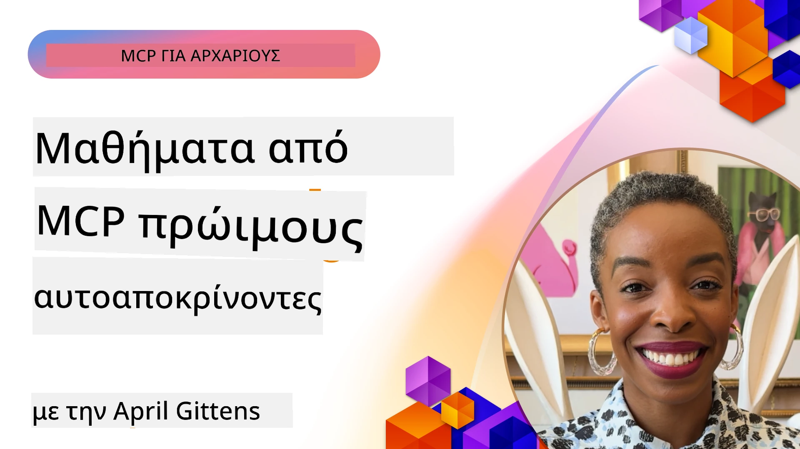

# 🌟 Μαθήματα από Πρωτοπόρους Χρήστες

[](https://youtu.be/jds7dSmNptE)

_(Κάντε κλικ στην εικόνα παραπάνω για να δείτε το βίντεο αυτού του μαθήματος)_

## 🎯 Τι Καλύπτει Αυτό το Μάθημα

Αυτό το μάθημα εξερευνά πώς πραγματικοί οργανισμοί και προγραμματιστές αξιοποιούν το Model Context Protocol (MCP) για την επίλυση πραγματικών προκλήσεων και την προώθηση της καινοτομίας. Μέσα από αναλυτικές μελέτες περίπτωσης, πρακτικά έργα και παραδείγματα, θα ανακαλύψετε πώς το MCP επιτρέπει ασφαλή, κλιμακούμενη ενσωμάτωση AI που συνδέει μεγάλα μοντέλα γλώσσας, εργαλεία και επιχειρησιακά δεδομένα.

### 📚 Δείτε το MCP σε Δράση

Θέλετε να δείτε αυτές τις αρχές να εφαρμόζονται σε παραγωγικά εργαλεία; Ρίξτε μια ματιά στους [**10 Microsoft MCP Servers που Μεταμορφώνουν την Παραγωγικότητα των Προγραμματιστών**](microsoft-mcp-servers.md), όπου παρουσιάζονται πραγματικοί Microsoft MCP servers που μπορείτε να χρησιμοποιήσετε σήμερα.

## Επισκόπηση

Αυτό το μάθημα εξερευνά πώς πρωτοπόροι χρήστες αξιοποίησαν το Model Context Protocol (MCP) για να επιλύσουν πραγματικές προκλήσεις και να προωθήσουν την καινοτομία σε διάφορες βιομηχανίες. Μέσα από λεπτομερείς μελέτες περίπτωσης και πρακτικά έργα, θα δείτε πώς το MCP επιτρέπει τυποποιημένη, ασφαλή και κλιμακούμενη ενσωμάτωση AI — συνδέοντας μεγάλα μοντέλα γλώσσας, εργαλεία και επιχειρησιακά δεδομένα σε ένα ενιαίο πλαίσιο. Θα αποκτήσετε πρακτική εμπειρία στον σχεδιασμό και την κατασκευή λύσεων βασισμένων σε MCP, θα μάθετε από δοκιμασμένα πρότυπα υλοποίησης και θα ανακαλύψετε βέλτιστες πρακτικές για την ανάπτυξη MCP σε περιβάλλοντα παραγωγής. Το μάθημα αναδεικνύει επίσης αναδυόμενες τάσεις, μελλοντικές κατευθύνσεις και πόρους ανοιχτού κώδικα για να παραμείνετε στην αιχμή της τεχνολογίας MCP και του εξελισσόμενου οικοσυστήματός της.

## Στόχοι Εκμάθησης

- Ανάλυση πραγματικών υλοποιήσεων MCP σε διάφορες βιομηχανίες  
- Σχεδιασμός και κατασκευή ολοκληρωμένων εφαρμογών βασισμένων σε MCP  
- Εξερεύνηση αναδυόμενων τάσεων και μελλοντικών κατευθύνσεων στην τεχνολογία MCP  
- Εφαρμογή βέλτιστων πρακτικών σε πραγματικά σενάρια ανάπτυξης  

## Πραγματικές Υλοποιήσεις MCP

### Μελέτη Περίπτωσης 1: Αυτοματοποίηση Υποστήριξης Πελατών Επιχειρήσεων

Μια πολυεθνική εταιρεία υλοποίησε λύση βασισμένη σε MCP για την τυποποίηση των αλληλεπιδράσεων AI σε όλα τα συστήματα υποστήριξης πελατών τους. Αυτό τους επέτρεψε να:  

- Δημιουργήσουν μια ενιαία διεπαφή για πολλούς παρόχους LLM  
- Διατηρήσουν συνεπή διαχείριση ερωτημάτων σε όλα τα τμήματα  
- Εφαρμόσουν ισχυρούς ελέγχους ασφαλείας και συμμόρφωσης  
- Εύκολα να εναλλάσσονται μεταξύ διαφορετικών μοντέλων AI βάσει συγκεκριμένων αναγκών  

**Τεχνική Υλοποίηση:**  

```python
# Υλοποίηση διακομιστή MCP σε Python για υποστήριξη πελατών
import logging
import asyncio
from modelcontextprotocol import create_server, ServerConfig
from modelcontextprotocol.server import MCPServer
from modelcontextprotocol.transports import create_http_transport
from modelcontextprotocol.resources import ResourceDefinition
from modelcontextprotocol.prompts import PromptDefinition
from modelcontextprotocol.tool import ToolDefinition

# Διαμόρφωση καταγραφής
logging.basicConfig(level=logging.INFO)

async def main():
    # Δημιουργία διαμόρφωσης διακομιστή
    config = ServerConfig(
        name="Enterprise Customer Support Server",
        version="1.0.0",
        description="MCP server for handling customer support inquiries"
    )
    
    # Αρχικοποίηση διακομιστή MCP
    server = create_server(config)
    
    # Καταχώρηση πόρων γνώσης
    server.resources.register(
        ResourceDefinition(
            name="customer_kb",
            description="Customer knowledge base documentation"
        ),
        lambda params: get_customer_documentation(params)
    )
    
    # Καταχώρηση προτύπων προτροπών
    server.prompts.register(
        PromptDefinition(
            name="support_template",
            description="Templates for customer support responses"
        ),
        lambda params: get_support_templates(params)
    )
    
    # Καταχώρηση εργαλείων υποστήριξης
    server.tools.register(
        ToolDefinition(
            name="ticketing",
            description="Create and update support tickets"
        ),
        handle_ticketing_operations
    )
    
    # Εκκίνηση διακομιστή με μεταφορά HTTP
    transport = create_http_transport(port=8080)
    await server.run(transport)

if __name__ == "__main__":
    asyncio.run(main())
```
  
**Αποτελέσματα:** Μείωση 30% στο κόστος των μοντέλων, βελτίωση 45% στην συνέπεια των απαντήσεων, και αυξημένη συμμόρφωση σε παγκόσμιες λειτουργίες.

### Μελέτη Περίπτωσης 2: Βοηθός Διαγνωστικής στην Υγεία

Ένας πάροχος υγειονομικής περίθαλψης ανέπτυξε υποδομή MCP για να ενσωματώσει πολλαπλά εξειδικευμένα μοντέλα AI ιατρικής ενώ διασφάλιζε την προστασία των ευαίσθητων δεδομένων ασθενών:  

- Ομαλή εναλλαγή μεταξύ γενικών και εξειδικευμένων ιατρικών μοντέλων  
- Αυστηροί έλεγχοι απορρήτου και ιχνηλάτηση  
- Ενσωμάτωση με υπάρχοντα Συστήματα Ηλεκτρονικών Ιατρικών Αρχείων (ΗIA)  
- Ομοιόμορφη αντιμετώπιση ερωτημάτων για ιατρική ορολογία  

**Τεχνική Υλοποίηση:**  

```csharp
// C# MCP host application implementation in healthcare application
using Microsoft.Extensions.DependencyInjection;
using ModelContextProtocol.SDK.Client;
using ModelContextProtocol.SDK.Security;
using ModelContextProtocol.SDK.Resources;

public class DiagnosticAssistant
{
    private readonly MCPHostClient _mcpClient;
    private readonly PatientContext _patientContext;
    
    public DiagnosticAssistant(PatientContext patientContext)
    {
        _patientContext = patientContext;
        
        // Configure MCP client with healthcare-specific settings
        var clientOptions = new ClientOptions
        {
            Name = "Healthcare Diagnostic Assistant",
            Version = "1.0.0",
            Security = new SecurityOptions
            {
                Encryption = EncryptionLevel.Medical,
                AuditEnabled = true
            }
        };
        
        _mcpClient = new MCPHostClientBuilder()
            .WithOptions(clientOptions)
            .WithTransport(new HttpTransport("https://healthcare-mcp.example.org"))
            .WithAuthentication(new HIPAACompliantAuthProvider())
            .Build();
    }
    
    public async Task<DiagnosticSuggestion> GetDiagnosticAssistance(
        string symptoms, string patientHistory)
    {
        // Create request with appropriate resources and tool access
        var resourceRequest = new ResourceRequest
        {
            Name = "patient_records",
            Parameters = new Dictionary<string, object>
            {
                ["patientId"] = _patientContext.PatientId,
                ["requestingProvider"] = _patientContext.ProviderId
            }
        };
        
        // Request diagnostic assistance using appropriate prompt
        var response = await _mcpClient.SendPromptRequestAsync(
            promptName: "diagnostic_assistance",
            parameters: new Dictionary<string, object>
            {
                ["symptoms"] = symptoms,
                patientHistory = patientHistory,
                relevantGuidelines = _patientContext.GetRelevantGuidelines()
            });
            
        return DiagnosticSuggestion.FromMCPResponse(response);
    }
}
```
  
**Αποτελέσματα:** Βελτιωμένες διαγνωστικές προτάσεις για τους γιατρούς με πλήρη συμμόρφωση HIPAA και σημαντική μείωση στην εναλλαγή συμφραζομένων μεταξύ συστημάτων.

### Μελέτη Περίπτωσης 3: Ανάλυση Κινδύνου Χρηματοπιστωτικών Υπηρεσιών

Ένας χρηματοπιστωτικός οργανισμός υλοποίησε MCP για την τυποποίηση των διαδικασιών ανάλυσης κινδύνου σε διάφορα τμήματα:  

- Δημιούργησε ενιαία διεπαφή για μοντέλα πιστωτικού κινδύνου, ανίχνευσης απάτης και κινδύνου επενδύσεων  
- Εφάρμοσε αυστηρούς ελέγχους πρόσβασης και εκδόσεις μοντέλων  
- Διασφάλισε την ιχνηλασιμότητα όλων των AI προτάσεων  
- Διατήρησε συνεπή μορφοποίηση δεδομένων σε ποικίλα συστήματα  

**Τεχνική Υλοποίηση:**  

```java
// Java MCP διακομιστής για αξιολόγηση χρηματοοικονομικού κινδύνου
import org.mcp.server.*;
import org.mcp.security.*;

public class FinancialRiskMCPServer {
    public static void main(String[] args) {
        // Δημιουργία MCP διακομιστή με λειτουργίες συμμόρφωσης χρηματοοικονομικών
        MCPServer server = new MCPServerBuilder()
            .withModelProviders(
                new ModelProvider("risk-assessment-primary", new AzureOpenAIProvider()),
                new ModelProvider("risk-assessment-audit", new LocalLlamaProvider())
            )
            .withPromptTemplateDirectory("./compliance/templates")
            .withAccessControls(new SOCCompliantAccessControl())
            .withDataEncryption(EncryptionStandard.FINANCIAL_GRADE)
            .withVersionControl(true)
            .withAuditLogging(new DatabaseAuditLogger())
            .build();
            
        server.addRequestValidator(new FinancialDataValidator());
        server.addResponseFilter(new PII_RedactionFilter());
        
        server.start(9000);
        
        System.out.println("Financial Risk MCP Server running on port 9000");
    }
}
```
  
**Αποτελέσματα:** Βελτιωμένη συμμόρφωση με κανονισμούς, 40% ταχύτεροι κύκλοι ανάπτυξης μοντέλων, και αυξημένη συνέπεια αξιολόγησης κινδύνου μεταξύ τμημάτων.

### Μελέτη Περίπτωσης 4: Microsoft Playwright MCP Server για Αυτοματοποίηση Browser

Η Microsoft ανέπτυξε τον [Playwright MCP server](https://github.com/microsoft/playwright-mcp) για να επιτρέψει ασφαλή, τυποποιημένη αυτοματοποίηση browser μέσω του Model Context Protocol. Αυτός ο έτοιμος προς παραγωγή server επιτρέπει σε agents AI και LLMs να αλληλεπιδρούν με φυλλομετρητές διαδικτύου με ελεγχόμενο, ιχνηλάσιμο και επεκτάσιμο τρόπο—δυναμώνοντας περιπτώσεις χρήσης όπως αυτοματοποιημένο testing, εξαγωγή δεδομένων και end-to-end ροές εργασίας.

> **🎯 Παραγωγικό Έτοιμο Εργαλείο**  
>  
> Αυτή η μελέτη περίπτωσης παρουσιάζει έναν πραγματικό MCP server που μπορείτε να χρησιμοποιήσετε σήμερα! Μάθετε περισσότερα για τον Playwright MCP Server και άλλους 9 παραγωγικούς Microsoft MCP servers στον [**Οδηγό Microsoft MCP Servers**](microsoft-mcp-servers.md#8--playwright-mcp-server).

**Κύρια Χαρακτηριστικά:**  
- Παρουσιάζει δυνατότητες αυτοματοποίησης browser (πλοήγηση, συμπλήρωση φορμών, καταγραφή οθόνης κ.ά.) ως εργαλεία MCP  
- Εφαρμόζει αυστηρούς ελέγχους πρόσβασης και sandboxing για πρόληψη μη εξουσιοδοτημένων ενεργειών  
- Παρέχει λεπτομερή αρχεία ελέγχου για όλες τις αλληλεπιδράσεις με τον browser  
- Υποστηρίζει ενσωμάτωση με Azure OpenAI και άλλους παρόχους LLM για αυτοματοποίηση με γνώμονα agents  
- Τροφοδοτεί τον Coding Agent του GitHub Copilot με δυνατότητες περιήγησης web  

**Τεχνική Υλοποίηση:**  

```typescript
// TypeScript: Καταχώρηση εργαλείων αυτοματοποίησης προγράμματος περιήγησης Playwright σε έναν διακομιστή MCP
import { createServer, ToolDefinition } from 'modelcontextprotocol';
import { launch } from 'playwright';

const server = createServer({
  name: 'Playwright MCP Server',
  version: '1.0.0',
  description: 'MCP server for browser automation using Playwright'
});

// Καταχώρηση εργαλείου για πλοήγηση σε μια διεύθυνση URL και λήψη στιγμιότυπου οθόνης
server.tools.register(
  new ToolDefinition({
    name: 'navigate_and_screenshot',
    description: 'Navigate to a URL and capture a screenshot',
    parameters: {
      url: { type: 'string', description: 'The URL to visit' }
    }
  }),
  async ({ url }) => {
    const browser = await launch();
    const page = await browser.newPage();
    await page.goto(url);
    const screenshot = await page.screenshot();
    await browser.close();
    return { screenshot };
  }
);

// Εκκίνηση του διακομιστή MCP
server.listen(8080);
```
  
**Αποτελέσματα:**  

- Ενεργοποίηση ασφαλούς, προγραμματιστικής αυτοματοποίησης browser για AI agents και LLMs  
- Μείωση στον χειροκίνητο φόρτο δοκιμών και βελτίωση της κάλυψης για web εφαρμογές  
- Παροχή επαναχρησιμοποιήσιμου, επεκτάσιμου πλαισίου για ενσωμάτωση εργαλείων browser σε επιχειρησιακά περιβάλλοντα  
- Τροφοδοτεί τις δυνατότητες περιήγησης web του GitHub Copilot  

**Αναφορές:**  

- [Playwright MCP Server GitHub Αποθετήριο](https://github.com/microsoft/playwright-mcp)  
- [Microsoft AI και Λύσεις Αυτοματισμού](https://azure.microsoft.com/en-us/products/ai-services/)

### Μελέτη Περίπτωσης 5: Azure MCP – Επιχειρηματικού Επιπέδου Model Context Protocol ως Υπηρεσία

Ο Azure MCP Server ([https://aka.ms/azmcp](https://aka.ms/azmcp)) είναι η διαχειριζόμενη, επιχειρηματικού επιπέδου υλοποίηση του Model Context Protocol από τη Microsoft, σχεδιασμένη να παρέχει κλιμακούμενες, ασφαλείς και συμβατές δυνατότητες MCP server ως υπηρεσία cloud. Το Azure MCP επιτρέπει σε οργανισμούς να αναπτύσσουν, να διαχειρίζονται και να ενσωματώνουν MCP servers με τις υπηρεσίες Azure AI, δεδομένων και ασφάλειας, μειώνοντας το λειτουργικό βάρος και επιταχύνοντας την υιοθέτηση AI.

> **🎯 Παραγωγικό Έτοιμο Εργαλείο**  
>  
> Αυτός είναι ένας πραγματικός MCP server που μπορείτε να χρησιμοποιήσετε σήμερα! Μάθετε περισσότερα για τον Azure AI Foundry MCP Server στον [**Οδηγό Microsoft MCP Servers**](microsoft-mcp-servers.md).

- Πλήρως διαχειριζόμενη φιλοξενία MCP server με ενσωματωμένη κλιμάκωση, παρακολούθηση και ασφάλεια  
- Αυτόματη ενσωμάτωση με Azure OpenAI, Azure AI Search και άλλες υπηρεσίες Azure  
- Επιχειρησιακός έλεγχος ταυτότητας και εξουσιοδότησης μέσω Microsoft Entra ID  
- Υποστήριξη προσαρμοσμένων εργαλείων, προτύπων ερωτημάτων και συνδετήρων πόρων  
- Συμμόρφωση με επιχειρησιακές απαιτήσεις ασφαλείας και κανονισμών  

**Τεχνική Υλοποίηση:**  

```yaml
# Example: Azure MCP server deployment configuration (YAML)
apiVersion: mcp.microsoft.com/v1
kind: McpServer
metadata:
  name: enterprise-mcp-server
spec:
  modelProviders:
    - name: azure-openai
      type: AzureOpenAI
      endpoint: https://<your-openai-resource>.openai.azure.com/
      apiKeySecret: <your-azure-keyvault-secret>
  tools:
    - name: document_search
      type: AzureAISearch
      endpoint: https://<your-search-resource>.search.windows.net/
      apiKeySecret: <your-azure-keyvault-secret>
  authentication:
    type: EntraID
    tenantId: <your-tenant-id>
  monitoring:
    enabled: true
    logAnalyticsWorkspace: <your-log-analytics-id>
```
  
**Αποτελέσματα:**  
- Μείωση χρόνου αξιοποίησης σε έργα AI επιχειρήσεων παρέχοντας μια έτοιμη προς χρήση, συμβατή πλατφόρμα MCP server  
- Απλοποίηση ενσωμάτωσης LLMs, εργαλείων και πηγών δεδομένων επιχειρήσεων  
- Ενίσχυση της ασφάλειας, παρατηρησιμότητας και λειτουργικής αποδοτικότητας για εργασίες MCP  
- Βελτιωμένη ποιότητα κώδικα με βέλτιστες πρακτικές Azure SDK και σύγχρονα πρότυπα ταυτοποίησης  

**Αναφορές:**  
- [Τεκμηρίωση Azure MCP](https://aka.ms/azmcp)  
- [Azure MCP Server GitHub Αποθετήριο](https://github.com/Azure/azure-mcp)  
- [Υπηρεσίες Azure AI](https://azure.microsoft.com/en-us/products/ai-services/)  
- [Κέντρο Microsoft MCP](https://mcp.azure.com)

## Μελέτη Περίπτωσης 6: NLWeb  
Το MCP (Model Context Protocol) είναι ένα αναδυόμενο πρωτόκολλο για Chatbots και βοηθούς AI που αλληλεπιδρούν με εργαλεία. Κάθε περίπτωση NLWeb είναι επίσης ένας MCP server, που υποστηρίζει μια βασική μέθοδο, την ask, η οποία χρησιμοποιείται για να ρωτήσει ένα ιστότοπο μια ερώτηση σε φυσική γλώσσα. Η απάντηση βασίζεται σε schema.org, ένα ευρέως χρησιμοποιούμενο λεξιλόγιο για την περιγραφή δεδομένων web. Χονδρικά, το MCP είναι το NLWeb όπως το Http είναι στο HTML. Το NLWeb συνδυάζει πρωτόκολλα, μορφές Schema.org και δείγματα κώδικα για να βοηθήσει τους ιστότοπους να δημιουργήσουν γρήγορα αυτά τα endpoints, ωφελώντας τόσο τους ανθρώπους μέσω διαλογικών διεπαφών όσο και τις μηχανές μέσω φυσικής αλληλεπίδρασης agent-to-agent.

Υπάρχουν δύο διακριτά στοιχεία στο NLWeb.  
- Ένα πρωτόκολλο, πολύ απλό στην αρχή, για διεπαφή με έναν ιστότοπο σε φυσική γλώσσα και μια μορφή που χρησιμοποιεί json και schema.org για την απάντηση που επιστρέφεται. Δείτε την τεκμηρίωση για το REST API για περισσότερες λεπτομέρειες.  
- Μια απλή υλοποίηση του (1) που αξιοποιεί υπάρχουσες σημάνσεις, για ιστότοπους που μπορούν να αφαιρεθούν ως λίστες αντικειμένων (προϊόντα, συνταγές, αξιοθέατα, κριτικές κ.ά.). Μαζί με ένα σύνολο widget διεπαφής χρήστη, οι ιστότοποι μπορούν να παρέχουν εύκολα διαλογικές διεπαφές στο περιεχόμενό τους. Δείτε την τεκμηρίωση για το Life of a chat query για περισσότερες λεπτομέρειες σχετικά με τη λειτουργία.  

**Αναφορές:**  
- [Τεκμηρίωση Azure MCP](https://aka.ms/azmcp)  
- [NLWeb](https://github.com/microsoft/NlWeb)

### Μελέτη Περίπτωσης 7: Azure AI Foundry MCP Server – Ενσωμάτωση Επιχειρηματικών AI Agents

Οι MCP servers του Azure AI Foundry δείχνουν πώς το MCP μπορεί να χρησιμοποιηθεί για τον συντονισμό και τη διαχείριση agents AI και ροών εργασιών σε επιχειρησιακά περιβάλλοντα. Μέσω της ενσωμάτωσης MCP με το Azure AI Foundry, οι οργανισμοί μπορούν να τυποποιήσουν τις αλληλεπιδράσεις των agents, να αξιοποιήσουν τη διαχείριση ροών εργασιών του Foundry και να διασφαλίσουν ασφαλείς, κλιμακούμενες αναπτύξεις.

> **🎯 Παραγωγικό Έτοιμο Εργαλείο**  
>  
> Αυτό είναι ένας πραγματικός MCP server που μπορείτε να χρησιμοποιήσετε σήμερα! Μάθετε περισσότερα για τον Azure AI Foundry MCP Server στον [**Οδηγό Microsoft MCP Servers**](microsoft-mcp-servers.md#9--azure-ai-foundry-mcp-server).

**Κύρια Χαρακτηριστικά:**  
- Πλήρης πρόσβαση στο οικοσύστημα AI του Azure, συμπεριλαμβανομένων καταλόγων μοντέλων και διαχείρισης ανάπτυξης  
- Ευρετηρίαση γνώσης με Azure AI Search για εφαρμογές RAG  
- Εργαλεία αξιολόγησης απόδοσης μοντέλων AI και διασφάλισης ποιότητας  
- Ενσωμάτωση με τους καταλόγους και εργαστήρια του Azure AI Foundry για εξελιγμένα ερευνητικά μοντέλα  
- Διαχείριση agents και δυνατότητες αξιολόγησης για παραγωγικά σενάρια  

**Αποτελέσματα:**  
- Γρήγορη πρωτοτυποποίηση και αξιόπιστη παρακολούθηση ροών εργασιών AI agents  
- Απρόσκοπτη ενσωμάτωση με υπηρεσίες Azure AI για προχωρημένα σενάρια  
- Ενιαία διεπαφή για κατασκευή, ανάπτυξη και παρακολούθηση pipelines agents  
- Βελτιωμένη ασφάλεια, συμμόρφωση και λειτουργική αποδοτικότητα για επιχειρήσεις  
- Επιτάχυνση της υιοθέτησης AI διατηρώντας τον έλεγχο σε πολύπλοκες διαδικασίες agent-driven  

**Αναφορές:**  
- [Azure AI Foundry MCP Server GitHub Αποθετήριο](https://github.com/azure-ai-foundry/mcp-foundry)  
- [Ενσωμάτωση Azure AI Agents με MCP (Microsoft Foundry Blog)](https://devblogs.microsoft.com/foundry/integrating-azure-ai-agents-mcp/)

### Μελέτη Περίπτωσης 8: Foundry MCP Playground – Πειραματισμός και Πρωτοτυποποίηση

Το Foundry MCP Playground προσφέρει ένα έτοιμο προς χρήση περιβάλλον για πειραματισμό με MCP servers και ενσωματώσεις Azure AI Foundry. Οι προγραμματιστές μπορούν γρήγορα να πρωτοτυπήσουν, να δοκιμάσουν και να αξιολογήσουν μοντέλα AI και ροές εργασιών agents χρησιμοποιώντας πόρους από τους καταλόγους και εργαστήρια του Azure AI Foundry. Το playground απλοποιεί τη ρύθμιση, παρέχει δείγματα έργων και υποστηρίζει συνεργατική ανάπτυξη, καθιστώντας εύκολη την εξερεύνηση βέλτιστων πρακτικών και νέων σεναρίων με ελάχιστο κόστος. Είναι ιδιαίτερα χρήσιμο για ομάδες που θέλουν να επικυρώσουν ιδέες, να μοιραστούν πειράματα και να επιταχύνουν τη μάθηση χωρίς ανάγκη σύνθετης υποδομής. Με τη μείωση των εμποδίων εισόδου, το playground προωθεί την καινοτομία και τη συνεισφορά της κοινότητας στο οικοσύστημα MCP και Azure AI Foundry.

**Αναφορές:**

- [Foundry MCP Playground GitHub Αποθετήριο](https://github.com/azure-ai-foundry/foundry-mcp-playground)

### Μελέτη Περίπτωσης 9: Microsoft Learn Docs MCP Server – Πρόσβαση σε Τεκμηρίωση με AI

Ο Microsoft Learn Docs MCP Server είναι μια υπηρεσία φιλοξενούμενη στο cloud που παρέχει σε βοηθούς AI πρόσβαση σε πραγματικό χρόνο στην επίσημη τεκμηρίωση της Microsoft μέσω του Model Context Protocol. Αυτός ο παραγωγικός server συνδέεται με το ολοκληρωμένο οικοσύστημα Microsoft Learn και επιτρέπει σημασιολογική αναζήτηση σε όλες τις επίσημες πηγές Microsoft.

> **🎯 Παραγωγικό Έτοιμο Εργαλείο**  
>  
> Αυτό είναι ένας πραγματικός MCP server που μπορείτε να χρησιμοποιήσετε σήμερα! Μάθετε περισσότερα για τον Microsoft Learn Docs MCP Server στον [**Οδηγό Microsoft MCP Servers**](microsoft-mcp-servers.md#1--microsoft-learn-docs-mcp-server).

**Κύρια Χαρακτηριστικά:**  
- Πρόσβαση σε πραγματικό χρόνο σε επίσημη τεκμηρίωση Microsoft, τεκμηρίωση Azure και Microsoft 365  
- Προηγμένες δυνατότητες σημασιολογικής αναζήτησης που κατανοούν το πλαίσιο και την πρόθεση  
- Πληροφορίες πάντα ενημερωμένες καθώς το περιεχόμενο της Microsoft Learn δημοσιεύεται  
- Ολοκληρωμένη κάλυψη σε Microsoft Learn, τεκμηρίωση Azure και πηγές Microsoft 365  
- Επιστρέφει έως 10 υψηλής ποιότητας κομμάτια περιεχομένου με τίτλους άρθρων και URLs  

**Γιατί Είναι Κρίσιμο:**  
- Λύνει το πρόβλημα «παρωχημένης γνώσης AI» για τεχνολογίες Microsoft  
- Διασφαλίζει την πρόσβαση των βοηθών AI στα πιο πρόσφατα χαρακτηριστικά .NET, C#, Azure και Microsoft 365  
- Παρέχει αξιόπιστες, πρώτης πηγής πληροφορίες για ακριβή παραγωγή κώδικα  
- Απαραίτητο για προγραμματιστές που δουλεύουν με ραγδαία εξελισσόμενες τεχνολογίες Microsoft  

**Αποτελέσματα:**  
- Δραματική βελτίωση της ακρίβειας στον AI-generated κώδικα για τεχνολογίες Microsoft  
- Μείωση χρόνου αναζήτησης για τρέχουσα τεκμηρίωση και βέλτιστες πρακτικές  
- Αυξημένη παραγωγικότητα προγραμματιστών με πρόσβαση σε τεκμηρίωση επί τη βάσει του πλαισίου  
- Απρόσκοπτη ενσωμάτωση σε ροές ανάπτυξης χωρίς έξοδο από το IDE  

**Αναφορές:**  
- [Microsoft Learn Docs MCP Server GitHub Αποθετήριο](https://github.com/MicrosoftDocs/mcp)  
- [Microsoft Learn Documentation](https://learn.microsoft.com/)

## Πρακτικά Έργα

### Έργο 1: Δημιουργία πάροχου MCP server πολλαπλών παρόχων

**Στόχος:** Δημιουργήστε έναν MCP server που να μπορεί να δρομολογεί αιτήματα σε πολλούς παρόχους μοντέλων AI βάσει συγκεκριμένων κριτηρίων.

**Απαιτήσεις:**  

- Υποστήριξη τουλάχιστον τριών διαφορετικών παρόχων μοντέλων (π.χ., OpenAI, Anthropic, τοπικά μοντέλα)  
- Υλοποίηση μηχανισμού δρομολόγησης βάσει μεταδεδομένων αιτημάτων  
- Δημιουργία συστήματος ρύθμισης παραμέτρων για τη διαχείριση διαπιστευτηρίων παρόχων  
- Προσθήκη caching για βελτιστοποίηση απόδοσης και κόστους  
- Κατασκευή απλού πίνακα ελέγχου για παρακολούθηση χρήσης  

**Βήματα Υλοποίησης:**  

1. Εγκατάσταση βασικής υποδομής MCP server  
2. Υλοποίηση adapters παρόχων για κάθε υπηρεσία μοντέλων AI  
3. Δημιουργία λογικής δρομολόγησης βασισμένη σε χαρακτηριστικά αιτημάτων  
4. Προσθήκη μηχανισμών caching για συχνά αιτήματα  
5. Ανάπτυξη πίνακα παρακολούθησης  
6. Δοκιμές με διάφορα μοτίβα αιτημάτων  

**Τεχνολογίες:** Επιλογή από Python (.NET/Java/Python ανάλογα με την προτίμησή σας), Redis για caching, και ένα απλό web framework για τον πίνακα ελέγχου.

### Έργο 2: Σύστημα Διαχείρισης Ερωτημάτων Επιχειρήσεων
**Στόχος:** Ανάπτυξη ενός συστήματος βασισμένου στο MCP για τη διαχείριση, την εκδοχή και την ανάπτυξη προτύπων υποκινήσεων σε έναν οργανισμό.

**Απαιτήσεις:**

- Δημιουργία ενός κεντρικού αποθετηρίου για πρότυπα υποκινήσεων
- Υλοποίηση ροών εργασίας εκδόσεων και έγκρισης
- Ανάπτυξη δυνατοτήτων δοκιμής προτύπων με δείγματα εισόδων
- Ανάπτυξη ελέγχων πρόσβασης βάσει ρόλων
- Δημιουργία API για ανάκτηση και ανάπτυξη προτύπων

**Βήματα υλοποίησης:**

1. Σχεδίαση του σχήματος βάσης δεδομένων για αποθήκευση προτύπων
2. Δημιουργία του κύριου API για λειτουργίες CRUD προτύπων
3. Υλοποίηση του συστήματος εκδόσεων
4. Κατασκευή της ροής εργασίας έγκρισης
5. Ανάπτυξη του πλαισίου δοκιμών
6. Δημιουργία απλής διεπαφής web για διαχείριση
7. Ενσωμάτωση με διακομιστή MCP

**Τεχνολογίες:** Επιλογή του backend framework, SQL ή NoSQL βάσης δεδομένων, και ενός frontend framework για τη διεπαφή διαχείρισης.

### Project 3: Πλατφόρμα Δημιουργίας Περιεχομένου Βασισμένη σε MCP

**Στόχος:** Κατασκευή πλατφόρμας δημιουργίας περιεχομένου που αξιοποιεί το MCP για παροχή συνεπών αποτελεσμάτων σε διαφορετικούς τύπους περιεχομένου.

**Απαιτήσεις:**

- Υποστήριξη πολλαπλών μορφών περιεχομένου (αναρτήσεις blog, social media, διαφημιστικά κείμενα)
- Υλοποίηση δημιουργίας βασισμένης σε πρότυπα με επιλογές προσαρμογής
- Δημιουργία συστήματος αναθεώρησης περιεχομένου και ανατροφοδότησης
- Παρακολούθηση μετρικών απόδοσης περιεχομένου
- Υποστήριξη εκδόσεων και επαναλήψεων περιεχομένου

**Βήματα υλοποίησης:**

1. Ρύθμιση υποδομής πελάτη MCP
2. Δημιουργία προτύπων για διαφορετικούς τύπους περιεχομένου
3. Κατασκευή της αλυσίδας παραγωγής περιεχομένου
4. Υλοποίηση του συστήματος αναθεώρησης
5. Ανάπτυξη του συστήματος παρακολούθησης μετρικών
6. Δημιουργία διεπαφής χρήστη για διαχείριση προτύπων και παραγωγή περιεχομένου

**Τεχνολογίες:** Η προτιμώμενη γλώσσα προγραμματισμού, web framework και σύστημα βάσης δεδομένων.

## Μελλοντικές Κατευθύνσεις για την Τεχνολογία MCP

### Αναδυόμενες Τάσεις

1. **Πολυτροπικό MCP**
   - Επέκταση του MCP για τυποποίηση αλληλεπιδράσεων με μοντέλα εικόνας, ήχου και βίντεο
   - Ανάπτυξη δυνατοτήτων δια-τροπικής λογικής
   - Τυποποιημένα πρότυπα υποκίνησης για διαφορετικές μορφές

2. **Διανεμημένη Υποδομή MCP**
   - Κατανεμημένα δίκτυα MCP που μπορούν να μοιράζονται πόρους μεταξύ οργανισμών
   - Τυποποιημένα πρωτόκολλα για ασφαλή κοινή χρήση μοντέλων
   - Τεχνικές υπολογισμού που διαφυλάσσουν το απόρρητο

3. **Αγορές MCP**
   - Οικοσυστήματα για κοινή χρήση και εμπορευματοποίηση προτύπων και προσθέτων MCP
   - Διαδικασίες διασφάλισης ποιότητας και πιστοποίησης
   - Ενσωμάτωση με αγορές μοντέλων

4. **MCP για Edge Computing**
   - Προσαρμογή των προτύπων MCP για συσκευές με περιορισμένους πόρους edge
   - Βελτιστοποιημένα πρωτόκολλα για περιβάλλοντα χαμηλού εύρους ζώνης
   - Εξειδικευμένες υλοποιήσεις MCP για οικοσυστήματα IoT

5. **Κανονιστικά Πλαίσια**
   - Ανάπτυξη επεκτάσεων MCP για συμμόρφωση με κανονισμούς
   - Τυποποιημένα αρχεία ελέγχου και διεπαφές επεξηγηματικότητας
   - Ενσωμάτωση με αναδυόμενα πλαίσια διακυβέρνησης AI

### Λύσεις MCP από τη Microsoft

Η Microsoft και η Azure έχουν αναπτύξει διάφορα ανοιχτού κώδικα αποθετήρια για να βοηθήσουν τους προγραμματιστές να υλοποιήσουν MCP σε διάφορα σενάρια:

#### Οργανισμός Microsoft

1. [playwright-mcp](https://github.com/microsoft/playwright-mcp) - Ένας διακομιστής Playwright MCP για αυτοματοποίηση και δοκιμές browser
2. [files-mcp-server](https://github.com/microsoft/files-mcp-server) - Υλοποίηση MCP διακομιστή OneDrive για τοπικές δοκιμές και συνεισφορά από την κοινότητα
3. [NLWeb](https://github.com/microsoft/NlWeb) - Το NLWeb είναι συλλογή ανοιχτών πρωτοκόλλων και σχετικών εργαλείων ανοιχτού κώδικα. Ο βασικός του στόχος είναι η δημιουργία ενός θεμελιώδους επιπέδου για το AI Web

#### Οργανισμός Azure-Samples

1. [mcp](https://github.com/Azure-Samples/mcp) - Σύνδεσμοι σε δείγματα, εργαλεία και πόρους για ανάπτυξη και ενσωμάτωση διακομιστών MCP στο Azure χρησιμοποιώντας πολλαπλές γλώσσες
2. [mcp-auth-servers](https://github.com/Azure-Samples/mcp-auth-servers) - Αναφορά διακομιστών MCP που επιδεικνύουν πιστοποίηση με το τρέχον πρωτόκολλο Model Context Protocol
3. [remote-mcp-functions](https://github.com/Azure-Samples/remote-mcp-functions) - Σελίδα υποδοχής για υλοποιήσεις απομακρυσμένων διακομιστών MCP σε Azure Functions με συνδέσμους σε αποθετήρια κατά γλώσσα
4. [remote-mcp-functions-python](https://github.com/Azure-Samples/remote-mcp-functions-python) - Πρότυπο γρήγορης εκκίνησης για ανάπτυξη και διανομή προσαρμοσμένων απομακρυσμένων διακομιστών MCP σε Azure Functions με Python
5. [remote-mcp-functions-dotnet](https://github.com/Azure-Samples/remote-mcp-functions-dotnet) - Πρότυπο γρήγορης εκκίνησης για ανάπτυξη και διανομή με .NET/C# σε Azure Functions
6. [remote-mcp-functions-typescript](https://github.com/Azure-Samples/remote-mcp-functions-typescript) - Πρότυπο γρήγορης εκκίνησης για ανάπτυξη και διανομή με TypeScript σε Azure Functions
7. [remote-mcp-apim-functions-python](https://github.com/Azure-Samples/remote-mcp-apim-functions-python) - Διαχείριση API Azure ως πύλη AI σε απομακρυσμένους διακομιστές MCP με Python
8. [AI-Gateway](https://github.com/Azure-Samples/AI-Gateway) - Πειράματα APIM ❤️ AI που περιλαμβάνουν δυνατότητες MCP, ενσωματώσεις με Azure OpenAI και AI Foundry

Αυτά τα αποθετήρια παρέχουν διάφορες υλοποιήσεις, πρότυπα και πόρους για την εργασία με το Model Context Protocol σε διαφορετικές γλώσσες προγραμματισμού και υπηρεσίες Azure. Καλύπτουν ένα φάσμα χρήσεων από βασικές υλοποιήσεις διακομιστών έως πιστοποίηση, ανάπτυξη στο cloud και σενάρια ενσωμάτωσης επιχειρήσεων.

#### Κατάλογος Πόρων MCP

Ο [Κατάλογος Πόρων MCP](https://github.com/microsoft/mcp/tree/main/Resources) στο επίσημο αποθετήριο Microsoft MCP παρέχει επιμελημένη συλλογή δειγμάτων πόρων, προτύπων υποκινήσεων και ορισμών εργαλείων για χρήση με διακομιστές Model Context Protocol. Αυτός ο κατάλογος έχει σχεδιαστεί για να βοηθά τους προγραμματιστές να ξεκινήσουν γρήγορα με το MCP προσφέροντας επαναχρησιμοποιήσιμα δομικά στοιχεία και παραδείγματα βέλτιστων πρακτικών για:

- **Πρότυπα Υποκίνησης:** Έτοιμα πρότυπα υποκινήσεων για κοινές εργασίες και σενάρια AI, που μπορούν να προσαρμοστούν για τις δικές σας υλοποιήσεις MCP.
- **Ορισμοί Εργαλείων:** Παραδείγματα σχημάτων εργαλείων και μεταδεδομένων για τυποποίηση ενσωμάτωσης και κλήσης εργαλείων σε διαφορετικούς διακομιστές MCP.
- **Δείγματα Πόρων:** Παραδείγματα ορισμών πόρων για σύνδεση σε πηγές δεδομένων, APIs και εξωτερικές υπηρεσίες στο πλαίσιο MCP.
- **Αναφορικές Υλοποιήσεις:** Πρακτικά δείγματα που δείχνουν πώς να δομήσετε και να οργανώσετε πόρους, υποκίνησεις και εργαλεία σε πραγματικά έργα MCP.

Αυτοί οι πόροι επιταχύνουν την ανάπτυξη, προάγουν την τυποποίηση και βοηθούν να διασφαλιστούν βέλτιστες πρακτικές κατά την οικοδόμηση και ανάπτυξη λύσεων βασισμένων στο MCP.

#### Κατάλογος Πόρων MCP

- [Πόροι MCP (Δείγματα υποκινήσεων, Εργαλεία και Ορισμοί Πόρων)](https://github.com/microsoft/mcp/tree/main/Resources)

### Ερευνητικές Ευκαιρίες

- Αποτελεσματικές τεχνικές βελτιστοποίησης υποκίνησης εντός πλαισίων MCP
- Μοντέλα ασφάλειας για αναπτύξεις MCP πολλαπλών ενοικιαστών
- Μέτρηση επιδόσεων σε διαφορετικές υλοποιήσεις MCP
- Μέθοδοι επίσημης επαλήθευσης για διακομιστές MCP

## Συμπέρασμα

Το Model Context Protocol (MCP) διαμορφώνει γρήγορα το μέλλον της τυποποιημένης, ασφαλούς και διαλειτουργικής ενσωμάτωσης AI μεταξύ κλάδων. Μέσα από τις μελέτες περιπτώσεων και τα πρακτικά έργα αυτού του μαθήματος, είδατε πώς οι πρώιμοι υιοθετητές—συμπεριλαμβανομένης της Microsoft και της Azure—χρησιμοποιούν το MCP για να λύσουν πραγματικά προβλήματα, να επιταχύνουν την υιοθέτηση AI και να διασφαλίσουν συμμόρφωση, ασφάλεια και κλιμακωσιμότητα. Η αρθρωτή προσέγγιση του MCP επιτρέπει στους οργανισμούς να συνδέουν μεγάλα μοντέλα γλώσσας, εργαλεία και επιχειρησιακά δεδομένα σε ένα ενιαίο, ελεγχόμενο πλαίσιο. Καθώς το MCP εξελίσσεται, η συνεχής εμπλοκή με την κοινότητα, η εξερεύνηση πόρων ανοιχτού κώδικα και η εφαρμογή βέλτιστων πρακτικών θα είναι κρίσιμες για την κατασκευή ανθεκτικών, έτοιμων για το μέλλον λύσεων AI.

## Επιπλέον Πόροι

- [Αποθετήριο MCP Foundry GitHub](https://github.com/azure-ai-foundry/mcp-foundry)
- [Foundry MCP Playground](https://github.com/azure-ai-foundry/foundry-mcp-playground)
- [Ενσωμάτωση πρακτόρων Azure AI με MCP (Microsoft Foundry Blog)](https://devblogs.microsoft.com/foundry/integrating-azure-ai-agents-mcp/)
- [Αποθετήριο MCP GitHub (Microsoft)](https://github.com/microsoft/mcp)
- [Κατάλογος Πόρων MCP (Δείγματα, Εργαλεία, Ορισμοί Πόρων)](https://github.com/microsoft/mcp/tree/main/Resources)
- [Κοινότητα & Τεκμηρίωση MCP](https://modelcontextprotocol.io/introduction)
- [Προδιαγραφή MCP (2025-11-25)](https://spec.modelcontextprotocol.io/specification/2025-11-25/)
- [Τεκμηρίωση Azure MCP](https://aka.ms/azmcp)
- [OWASP MCP Top 10](https://microsoft.github.io/mcp-azure-security-guide/mcp/) - Καλύτερες πρακτικές ασφάλειας
- [Playwright MCP Server Αποθετήριο GitHub](https://github.com/microsoft/playwright-mcp)
- [Files MCP Server (OneDrive)](https://github.com/microsoft/files-mcp-server)
- [Azure-Samples MCP](https://github.com/Azure-Samples/mcp)
- [MCP Auth Servers (Azure-Samples)](https://github.com/Azure-Samples/mcp-auth-servers)
- [Remote MCP Functions (Azure-Samples)](https://github.com/Azure-Samples/remote-mcp-functions)
- [Remote MCP Functions Python (Azure-Samples)](https://github.com/Azure-Samples/remote-mcp-functions-python)
- [Remote MCP Functions .NET (Azure-Samples)](https://github.com/Azure-Samples/remote-mcp-functions-dotnet)
- [Remote MCP Functions TypeScript (Azure-Samples)](https://github.com/Azure-Samples/remote-mcp-functions-typescript)
- [Remote MCP APIM Functions Python (Azure-Samples)](https://github.com/Azure-Samples/remote-mcp-apim-functions-python)
- [AI-Gateway (Azure-Samples)](https://github.com/Azure-Samples/AI-Gateway)
- [Microsoft AI και Λύσεις Αυτοματοποίησης](https://azure.microsoft.com/en-us/products/ai-services/)

## Ασκήσεις

1. Αναλύστε μία από τις μελέτες περίπτωσης και προτείνετε μια εναλλακτική προσέγγιση υλοποίησης.
2. Επιλέξτε μία από τις ιδέες έργων και δημιουργήστε μια λεπτομερή τεχνική προδιαγραφή.
3. Ερευνήστε έναν κλάδο που δεν καλύφθηκε στις μελέτες περίπτωσης και παρουσιάστε πώς το MCP θα μπορούσε να αντιμετωπίσει τις ειδικές προκλήσεις του.
4. Εξερευνήστε μία από τις μελλοντικές κατευθύνσεις και δημιουργήστε ένα concept για μια νέα επέκταση MCP που να την υποστηρίζει.

## Τι Ακολουθεί

Εξερευνήστε περισσότερα: [Microsoft MCP Servers](./microsoft-mcp-servers.md)

Συνεχίστε στο: [Module 8: Best Practices](../08-BestPractices/README.md)

---

<!-- CO-OP TRANSLATOR DISCLAIMER START -->
**Αποποίηση ευθυνών**:  
Αυτό το έγγραφο έχει μεταφραστεί χρησιμοποιώντας την υπηρεσία αυτόματης μετάφρασης AI [Co-op Translator](https://github.com/Azure/co-op-translator). Παρόλο που επιδιώκουμε την ακρίβεια, παρακαλούμε να λάβετε υπόψη ότι οι αυτόματες μεταφράσεις ενδέχεται να περιέχουν σφάλματα ή ανακρίβειες. Το πρωτότυπο έγγραφο στη μητρική του γλώσσα πρέπει να θεωρείται η αυθεντική πηγή. Για κρίσιμες πληροφορίες συνιστάται επαγγελματική μετάφραση από ανθρώπους. Δεν φέρουμε ευθύνη για τυχόν παρεξηγήσεις ή λανθασμένες ερμηνείες που προκύπτουν από τη χρήση αυτής της μετάφρασης.
<!-- CO-OP TRANSLATOR DISCLAIMER END -->