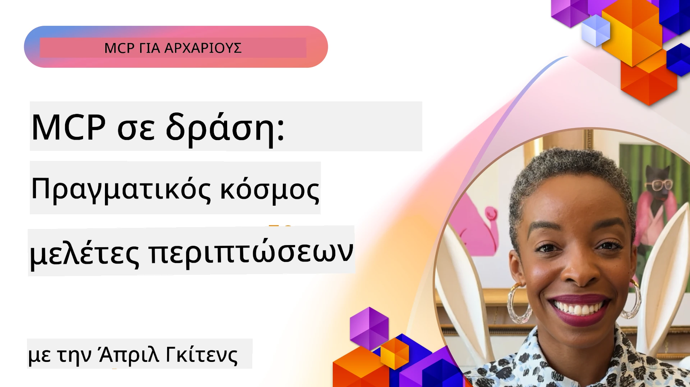

# MCP σε Δράση: Μελέτες Περίπτωσης Πραγματικού Κόσμου

_(Κάντε κλικ στην παραπάνω εικόνα για να δείτε βίντεο αυτού του μαθήματος)_

Το Πρωτόκολλο Πλαισίου Μοντέλου (Model Context Protocol - MCP) μετασχηματίζει τον τρόπο με τον οποίο οι εφαρμογές τεχνητής νοημοσύνης αλληλεπιδρούν με δεδομένα, εργαλεία και υπηρεσίες. Αυτό το τμήμα παρουσιάζει μελέτες περιπτώσεων πραγματικού κόσμου που επιδεικνύουν πρακτικές εφαρμογές του MCP σε διάφορα επιχειρησιακά σενάρια.

## Επισκόπηση

Αυτή η ενότητα παρουσιάζει συγκεκριμένα παραδείγματα υλοποιήσεων MCP, επισημαίνοντας πώς οι οργανισμοί αξιοποιούν αυτό το πρωτόκολλο για να λύσουν πολύπλοκες επιχειρησιακές προκλήσεις. Εξετάζοντας αυτές τις μελέτες περίπτωσης, θα αποκτήσετε πληροφορίες για την ευελιξία, την επεκτασιμότητα και τα πρακτικά οφέλη του MCP σε πραγματικά σενάρια.

## Κύριοι Στόχοι Μάθησης

Εξερευνώντας αυτές τις μελέτες περίπτωσης, θα:

- Κατανοήσετε πώς το MCP μπορεί να εφαρμοστεί για την επίλυση συγκεκριμένων επιχειρησιακών προβλημάτων
- Μάθετε για διάφορα μοτίβα ενσωμάτωσης και αρχιτεκτονικές προσεγγίσεις
- Αναγνωρίσετε τις βέλτιστες πρακτικές για την υλοποίηση MCP σε επιχειρησιακά περιβάλλοντα
- Αποκτήσετε εικόνα για τις προκλήσεις και τις λύσεις που αντιμετωπίστηκαν σε υλοποιήσεις πραγματικού κόσμου
- Αναγνωρίσετε ευκαιρίες να εφαρμόσετε παρόμοια μοτίβα στα δικά σας έργα

## Επιλεγμένες Μελέτες Περίπτωσης

### 1. [Azure AI Travel Agents – Αναφορά Υλοποίησης](./travelagentsample.md)

Αυτή η μελέτη περίπτωσης εξετάζει την ολοκληρωμένη λύση αναφοράς της Microsoft που επιδεικνύει πώς να δημιουργήσετε μια εφαρμογή σχεδιασμού ταξιδιών με πολλαπλούς πράκτορες, υποστηριζόμενη από τεχνητή νοημοσύνη, χρησιμοποιώντας MCP, Azure OpenAI και Azure AI Search. Το έργο παρουσιάζει:

- Ορχήστρωση πολλαπλών πρακτόρων μέσω MCP
- Ενσωμάτωση επιχειρησιακών δεδομένων με Azure AI Search
- Ασφαλή, επεκτάσιμη αρχιτεκτονική με χρήση υπηρεσιών Azure
- Επεκτάσιμα εργαλεία με επαναχρησιμοποιήσιμα συστατικά MCP
- Εμπειρία χρήστη συνομιλίας υποστηριζόμενη από Azure OpenAI

Η αρχιτεκτονική και οι λεπτομέρειες υλοποίησης παρέχουν πολύτιμες γνώσεις για την κατασκευή πολύπλοκων συστημάτων πολλαπλών πρακτόρων με το MCP ως το επίπεδο συντονισμού.

### 2. [Ενημέρωση Αντικειμένων Azure DevOps από Δεδομένα YouTube](./UpdateADOItemsFromYT.md)

Αυτή η μελέτη περίπτωσης δείχνει μια πρακτική εφαρμογή του MCP για την αυτοματοποίηση διαδικασιών ροής εργασίας. Δείχνει πώς τα εργαλεία MCP μπορούν να χρησιμοποιηθούν για:

- Εξαγωγή δεδομένων από διαδικτυακές πλατφόρμες (YouTube)
- Ενημέρωση εργασιών σε συστήματα Azure DevOps
- Δημιουργία επαναλαμβανόμενων αυτοματοποιημένων ροών εργασίας
- Ενσωμάτωση δεδομένων μεταξύ διαφορετικών συστημάτων

Αυτό το παράδειγμα δείχνει πώς ακόμα και σχετικά απλές υλοποιήσεις MCP μπορούν να προσφέρουν σημαντικά κέρδη αποδοτικότητας αυτοματοποιώντας ρουτίνες και βελτιώνοντας τη συνέπεια δεδομένων.

### 3. [Ανάκτηση Τεκμηρίωσης σε Πραγματικό Χρόνο με MCP](./docs-mcp/README.md)

Αυτή η μελέτη περίπτωσης σας καθοδηγεί στη σύνδεση ενός πελάτη κονσόλας Python με έναν διακομιστή Model Context Protocol (MCP) για την ανάκτηση και καταγραφή τεκμηρίωσης της Microsoft σε πραγματικό χρόνο και βασισμένη σε συμφραζόμενα. Θα μάθετε πώς να:

- Συνδεθείτε σε MCP server χρησιμοποιώντας πελάτη Python και το επίσημο SDK MCP
- Χρησιμοποιήσετε streaming HTTP clients για αποδοτική ανάκτηση δεδομένων σε πραγματικό χρόνο
- Καλείτε εργαλεία τεκμηρίωσης στον server και καταγράφετε απαντήσεις απευθείας στην κονσόλα
- Ενσωματώσετε ενημερωμένη τεκμηρίωση της Microsoft στη ροή εργασίας σας χωρίς να εγκαταλείπετε το τερματικό

Το κεφάλαιο περιλαμβάνει μια πρακτική άσκηση, ένα ελάχιστο λειτουργικό δείγμα κώδικα, και συνδέσμους σε επιπλέον πόρους για βαθύτερη μάθηση. Δείτε την πλήρη καθοδήγηση και τον κώδικα στο συνδεδεμένο κεφάλαιο για να κατανοήσετε πώς το MCP μπορεί να μεταμορφώσει την πρόσβαση στην τεκμηρίωση και την παραγωγικότητα προγραμματιστών σε περιβάλλοντα γραμμής εντολών.

### 4. [Διαδραστική Εφαρμογή Γεννήτριας Σχεδίου Μελέτης με MCP](./docs-mcp/README.md)

Αυτή η μελέτη περίπτωσης δείχνει πώς να δημιουργήσετε μια διαδραστική web εφαρμογή χρησιμοποιώντας Chainlit και το Model Context Protocol (MCP) για να παράγετε εξατομικευμένα σχέδια μελέτης για οποιοδήποτε θέμα. Οι χρήστες μπορούν να ορίσουν ένα αντικείμενο (όπως «πιστοποίηση AI-900») και διάρκεια μελέτης (π.χ. 8 εβδομάδες), και η εφαρμογή θα παρέχει αναλυτικό σχεδιασμό ανά εβδομάδα του προτεινόμενου περιεχομένου. Το Chainlit παρέχει μια διεπαφή συνομιλίας, καθιστώντας την εμπειρία ελκυστική και προσαρμοστική.

- Διαδραστική εφαρμογή συνομιλίας powered by Chainlit
- Εντολές από χρήστη για θέμα και διάρκεια
- Προτάσεις περιεχομένου εβδομάδα-εβδομάδα χρησιμοποιώντας MCP
- Προσαρμοστικές απαντήσεις σε πραγματικό χρόνο σε διεπαφή συνομιλίας

Το έργο δείχνει πώς η συνομιλητική τεχνητή νοημοσύνη και το MCP μπορούν να συνδυαστούν για τη δημιουργία δυναμικών, χρήστη-κατευθυνόμενων εκπαιδευτικών εργαλείων σε σύγχρονο web περιβάλλον.

### 5. [Έγγραφα Εντός Επεξεργαστή με MCP Server στο VS Code](./docs-mcp/README.md)

Αυτή η μελέτη περίπτωσης δείχνει πώς μπορείτε να φέρετε τα Microsoft Learn Docs απευθείας στο περιβάλλον VS Code χρησιμοποιώντας τον MCP server — χωρίς να αλλάζετε καρτέλες προγράμματος περιήγησης! Θα δείτε πώς να:

- Αναζητάτε και να διαβάζετε έγγραφα αμέσως μέσα στο VS Code χρησιμοποιώντας το πάνελ MCP ή την παλέτα εντολών
- Αναφέρετε τεκμηρίωση και εισάγετε συνδέσμους απευθείας στα README ή αρχεία markdown μαθημάτων
- Χρησιμοποιείτε GitHub Copilot και MCP μαζί για ομαλές, με τεχνητή νοημοσύνη υποστηριζόμενες ροές εργασίας τεκμηρίωσης και κώδικα
- Επικυρώνετε και βελτιώνετε την τεκμηρίωσή σας με ανατροφοδότηση σε πραγματικό χρόνο και ακρίβεια προερχόμενη από τη Microsoft
- Ενσωματώνετε το MCP με ροές εργασίας GitHub για συνεχή επικύρωση τεκμηρίωσης

Η υλοποίηση περιλαμβάνει:

- Παράδειγμα ρύθμισης `.vscode/mcp.json` για εύκολη διαμόρφωση
- Περιηγήσεις με screenshots της εμπειρίας εντός επεξεργαστή
- Συμβουλές για το συνδυασμό Copilot και MCP για μέγιστη παραγωγικότητα

Αυτό το σενάριο είναι ιδανικό για συγγραφείς μαθημάτων, συγγραφείς τεκμηρίωσης και προγραμματιστές που θέλουν να παραμένουν συγκεντρωμένοι στον επεξεργαστή τους ενώ δουλεύουν με έγγραφα, Copilot και εργαλεία επικύρωσης — όλα υποστηριζόμενα από MCP.

### 6. [Δημιουργία MCP Server με APIM](./apimsample.md)

Αυτή η μελέτη περίπτωσης παρέχει βήμα-βήμα καθοδήγηση για το πώς να δημιουργήσετε έναν MCP server χρησιμοποιώντας το Azure API Management (APIM). Καλύπτει:

- Ρύθμιση MCP server στο Azure API Management
- Έκθεση λειτουργιών API ως εργαλεία MCP
- Διαμόρφωση πολιτικών για περιορισμό ρυθμού και ασφάλεια
- Δοκιμές του MCP server με χρήση Visual Studio Code και GitHub Copilot

Αυτό το παράδειγμα δείχνει πώς να αξιοποιήσετε τις δυνατότητες του Azure για τη δημιουργία ενός ανθεκτικού MCP server που μπορεί να χρησιμοποιηθεί σε διάφορες εφαρμογές, ενισχύοντας την ενσωμάτωση συστημάτων AI με επιχειρησιακά API.

### 7. [GitHub MCP Registry — Επιτάχυνση Ολοκλήρωσης Πρακτόρων](https://github.com/mcp)

Αυτή η μελέτη περίπτωσης εξετάζει πώς το GitHub MCP Registry, που ξεκίνησε τον Σεπτέμβριο του 2025, αντιμετωπίζει μια κρίσιμη πρόκληση στο οικοσύστημα AI: τον κατακερματισμένο εντοπισμό και ανάπτυξη διακομιστών Model Context Protocol (MCP).

#### Επισκόπηση
Το **MCP Registry** λύνει τον αυξανόμενο πόνο των διάσπαρτων MCP servers σε αποθετήρια και καταλόγους, που προηγουμένως καθιστούσαν αργή και επιρρεπή σε λάθη την ενσωμάτωση. Αυτοί οι servers επιτρέπουν σε πράκτορες τεχνητής νοημοσύνης να αλληλεπιδρούν με εξωτερικά συστήματα όπως API, βάσεις δεδομένων και πηγές τεκμηρίωσης.

#### Διατύπωση Προβλήματος
Οι προγραμματιστές που κατασκευάζουν ροές εργασίας πρακτόρων αντιμετώπιζαν πολλές προκλήσεις:
- **Κακή εντοπισιμότητα** MCP servers σε διάφορες πλατφόρμες
- **Περιοδικές ερωτήσεις εγκατάστασης** διάσπαρτες σε φόρουμ και τεκμηρίωση
- **Κίνδυνοι ασφάλειας** από μη επαληθευμένες και μη αξιόπιστες πηγές
- **Έλλειψη τυποποίησης** στην ποιότητα και συμβατότητα διακομιστών

#### Αρχιτεκτονική Λύσης
Το GitHub MCP Registry συγκεντρώνει αξιόπιστους MCP servers με βασικά χαρακτηριστικά:
- **Εγκατάσταση με ένα κλικ** μέσω VS Code για απλοποιημένη ρύθμιση
- **Ταξινόμηση σήματος-θορύβου** με βάση αστέρια, δραστηριότητα και κοινότητα
- **Άμεση ενσωμάτωση** με GitHub Copilot και άλλα συμβατά εργαλεία MCP
- **Ανοιχτό μοντέλο συνεισφοράς** που επιτρέπει σε κοινότητα και επιχειρησιακούς συνεργάτες να συμμετέχουν

#### Επιχειρηματικός Αντίκτυπος
Το registry έχει φέρει μετρήσιμες βελτιώσεις:
- **Ταχύτερη εισαγωγή** για προγραμματιστές που χρησιμοποιούν εργαλεία όπως ο Microsoft Learn MCP Server, που παρέχει επίσημη τεκμηρίωση απευθείας στους πράκτορες
- **Αυξημένη παραγωγικότητα** μέσω εξειδικευμένων servers όπως `github-mcp-server`, που επιτρέπουν αυτοματοποίηση GitHub με φυσική γλώσσα (δημιουργία PR, επανεκκίνηση CI, δειγματοληψία κώδικα)
- **Ενισχυμένη εμπιστοσύνη οικοσυστήματος** μέσω εκτενών καταλόγων και διαφανών προτύπων διαμόρφωσης

#### Στρατηγική Αξία
Για τους επαγγελματίες που ειδικεύονται στη διαχείριση κύκλου ζωής πρακτόρων και αναπαραγώγιμες ροές εργασίας, το MCP Registry παρέχει:
- **Ευέλικτη ανάπτυξη πρακτόρων** με τυποποιημένα συστατικά
- **Πίσω από το registry pipelines αξιολόγησης** για συνεπή δοκιμές και επικύρωση
- **Διαλειτουργικότητα εργαλείων** που επιτρέπει ομαλή ενσωμάτωση σε διαφορετικές πλατφόρμες AI

Αυτή η μελέτη περίπτωσης αποδεικνύει ότι το MCP Registry δεν είναι απλώς ένας κατάλογος — είναι μια θεμελιώδης πλατφόρμα για την κλιμακούμενη, ρεαλιστική ενσωμάτωση μοντέλων και ανάπτυξη συστημάτων πρακτόρων.

## Συμπέρασμα

Αυτές οι επτά ολοκληρωμένες μελέτες περίπτωσης αποδεικνύουν την αξιοσημείωτη ευελιξία και πρακτικές εφαρμογές του Πρωτοκόλλου Πλαισίου Μοντέλου σε διάφορα ρεαλιστικά σενάρια. Από πολύπλοκα συστήματα σχεδιασμού ταξιδιών με πολλούς πράκτορες και διαχείριση επιχειρησιακών API μέχρι απλοποιημένες ροές εργασίας τεκμηρίωσης και το επαναστατικό GitHub MCP Registry, αυτά τα παραδείγματα δείχνουν πώς το MCP παρέχει έναν τυποποιημένο, επεκτάσιμο τρόπο σύνδεσης συστημάτων AI με τα εργαλεία, δεδομένα και υπηρεσίες που χρειάζονται για να προσφέρουν εξαιρετική αξία.

Οι μελέτες περιπτώσεων καλύπτουν πολλαπλές διαστάσεις της υλοποίησης MCP:
- **Ενσωμάτωση Επιχειρήσεων**: Διαχείριση Azure API και αυτοματοποίηση Azure DevOps
- **Ορχήστρωση Πολλαπλών Πρακτόρων**: Σχεδιασμός ταξιδιών με συντονισμένους AI πράκτορες
- **Παραγωγικότητα Προγραμματιστών**: Ενσωμάτωση VS Code και πρόσβαση σε τεκμηρίωση σε πραγματικό χρόνο
- **Ανάπτυξη Οικοσυστήματος**: Το GitHub MCP Registry ως θεμελιώδης πλατφόρμα
- **Εκπαιδευτικές Εφαρμογές**: Διαδραστικοί γεννήτορες σχεδίων μελέτης και διεπαφές συνομιλίας

Μελετώντας αυτές τις υλοποιήσεις, αποκτάτε κρίσιμες γνώσεις για:
- **Αρχιτεκτονικά μοτίβα** για διαφορετικές κλίμακες και χρήσεις
- **Στρατηγικές υλοποίησης** που ισορροπούν λειτουργικότητα και διαχειρισιμότητα
- **Ζητήματα ασφάλειας και κλιμάκωσης** για παραγωγικές αναπτύξεις
- **Βέλτιστες πρακτικές** ανάπτυξης MCP server και ενσωμάτωσης πελατών
- **Σκέψη οικοσυστήματος** για την κατασκευή διασυνδεδεμένων λύσεων με τεχνητή νοημοσύνη

Αυτά τα παραδείγματα αποδεικνύουν συλλογικά ότι το MCP δεν είναι απλώς ένα θεωρητικό πλαίσιο, αλλά ένα ώριμο, έτοιμο για παραγωγή πρωτόκολλο που επιτρέπει πρακτικές λύσεις σε πολύπλοκες επιχειρησιακές προκλήσεις. Είτε κατασκευάζετε απλά εργαλεία αυτοματοποίησης είτε εξελιγμένα συστήματα πολλαπλών πρακτόρων, τα μοτίβα και οι προσεγγίσεις που απεικονίζονται εδώ παρέχουν μια σταθερή βάση για τα δικά σας έργα MCP.

## Επιπλέον Πόροι

- [Azure AI Travel Agents GitHub Αποθετήριο](https://github.com/Azure-Samples/azure-ai-travel-agents)
- [Azure DevOps MCP Tool](https://github.com/microsoft/azure-devops-mcp)
- [Playwright MCP Tool](https://github.com/microsoft/playwright-mcp)
- [Microsoft Docs MCP Server](https://github.com/MicrosoftDocs/mcp)
- [GitHub MCP Registry — Επιτάχυνση Ολοκλήρωσης Πρακτόρων](https://github.com/mcp)
- [Παραδείγματα Κοινότητας MCP](https://github.com/microsoft/mcp)

## Τι Ακολουθεί

- Προηγούμενο: [Ενότητα 8: Βέλτιστες Πρακτικές](../08-BestPractices/README.md)
- Επόμενο: [Ενότητα 10: Απλοποίηση Ροών Εργασίας AI: Δημιουργία MCP Server με AI Toolkit](../10-StreamliningAIWorkflowsBuildingAnMCPServerWithAIToolkit/README.md)

---

<!-- CO-OP TRANSLATOR DISCLAIMER START -->
**Αποποίηση ευθύνης**:  
Αυτό το έγγραφο έχει μεταφραστεί χρησιμοποιώντας την υπηρεσία αυτόματης μετάφρασης AI [Co-op Translator](https://github.com/Azure/co-op-translator). Παρότι επιδιώκουμε ακρίβεια, παρακαλούμε να έχετε υπόψη ότι οι αυτόματες μεταφράσεις μπορεί να περιέχουν λάθη ή ανακρίβειες. Το πρωτότυπο έγγραφο στη γλώσσα του πρέπει να θεωρείται η αυθεντική πηγή. Για κρίσιμες πληροφορίες συνιστάται επαγγελματική ανθρώπινη μετάφραση. Δεν φέρουμε ευθύνη για τυχόν παρανοήσεις ή λανθασμένες ερμηνείες που προκύπτουν από τη χρήση αυτής της μετάφρασης.
<!-- CO-OP TRANSLATOR DISCLAIMER END -->