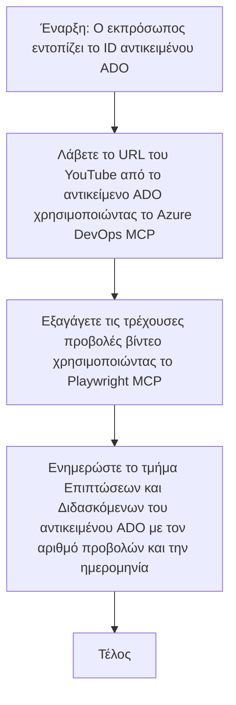

# Case Study: Ενημέρωση αντικειμένων Azure DevOps από δεδομένα YouTube με MCP

> **Αποποίηση ευθύνης:** Υπάρχουν υπάρχοντα εργαλεία και αναφορές στο διαδίκτυο που μπορούν να αυτοματοποιήσουν τη διαδικασία ενημέρωσης των αντικειμένων Azure DevOps με δεδομένα από πλατφόρμες όπως το YouTube. Το ακόλουθο σενάριο παρέχεται καθαρά ως παράδειγμα χρήσης για να δείξει πώς μπορούν να εφαρμοστούν τα εργαλεία MCP για εργασίες αυτοματισμού και ενσωμάτωσης.

## Επισκόπηση

Η παρούσα μελέτη περίπτωσης παρουσιάζει ένα παράδειγμα για το πώς το Model Context Protocol (MCP) και τα εργαλεία του μπορούν να χρησιμοποιηθούν για να αυτοματοποιήσουν τη διαδικασία ενημέρωσης των αντικειμένων εργασίας Azure DevOps (ADO) με πληροφορίες που προέρχονται από διαδικτυακές πλατφόρμες, όπως το YouTube. Το περιγραφόμενο σενάριο είναι απλώς μια απεικόνιση των ευρύτερων δυνατοτήτων αυτών των εργαλείων, τα οποία μπορούν να προσαρμοστούν για πολλές παρόμοιες ανάγκες αυτοματισμού.

Σε αυτό το παράδειγμα, ένας Υποστηρικτής παρακολουθεί διαδικτυακές συνεδρίες χρησιμοποιώντας αντικείμενα ADO, όπου κάθε αντικείμενο περιλαμβάνει μια διεύθυνση URL βίντεο YouTube. Με την αξιοποίηση των εργαλείων MCP, ο Υποστηρικτής μπορεί να διατηρεί τα αντικείμενα ADO ενημερωμένα με τις πιο πρόσφατες μετρήσεις βίντεο, όπως οι μετρήσεις προβολών, με έναν επαναλήψιμο και αυτοματοποιημένο τρόπο. Αυτή η προσέγγιση μπορεί να γενικευτεί και σε άλλες περιπτώσεις όπου απαιτείται η ενσωμάτωση πληροφοριών από διαδικτυακές πηγές στο ADO ή σε άλλα συστήματα.

## Σενάριο

Ένας Υποστηρικτής είναι υπεύθυνος για την παρακολούθηση της επίδρασης των διαδικτυακών συνεδριών και της εμπλοκής της κοινότητας. Κάθε συνεδρία καταγράφεται ως αντικείμενο εργασίας ADO στο έργο 'DevRel', και το αντικείμενο εργασίας περιέχει ένα πεδίο για τη διεύθυνση URL βίντεο του YouTube. Για να αναφέρει με ακρίβεια την εμβέλεια της συνεδρίας, ο Υποστηρικτής πρέπει να ενημερώνει το αντικείμενο ADO με τον τρέχοντα αριθμό προβολών του βίντεο και την ημερομηνία ανάκτησης αυτών των πληροφοριών.

## Χρησιμοποιούμενα Εργαλεία

- [Azure DevOps MCP](https://github.com/microsoft/azure-devops-mcp): Ενεργοποιεί προγραμματιστική πρόσβαση και ενημερώσεις σε αντικείμενα εργασίας ADO μέσω MCP.
- [Playwright MCP](https://github.com/microsoft/playwright-mcp): Αυτοματοποιεί ενέργειες προγράμματος περιήγησης για την εξαγωγή ζωντανών δεδομένων από ιστοσελίδες, όπως στατιστικά βίντεο YouTube.

## Διαδικασία Βήμα προς Βήμα

1. **Εντοπισμός του αντικειμένου ADO**: Ξεκινήστε με το αναγνωριστικό του αντικειμένου εργασίας ADO (π.χ., 1234) στο έργο 'DevRel'.  
2. **Ανάκτηση της διεύθυνσης URL YouTube**: Χρησιμοποιήστε το εργαλείο Azure DevOps MCP για να πάρετε τη διεύθυνση URL YouTube από το αντικείμενο εργασίας.  
3. **Εξαγωγή αριθμού προβολών βίντεο**: Χρησιμοποιήστε το εργαλείο Playwright MCP για να μεταβείτε στη διεύθυνση URL του YouTube και να εξαγάγετε τον τρέχοντα αριθμό προβολών.  
4. **Ενημέρωση του αντικειμένου ADO**: Καταγράψτε τον πιο πρόσφατο αριθμό προβολών και την ημερομηνία ανάκτησης στην ενότητα 'Impact and Learnings' του αντικειμένου εργασίας ADO χρησιμοποιώντας το εργαλείο Azure DevOps MCP.

## Παράδειγμα Εντολής

```bash
- Work with the ADO Item ID: 1234
- The project is '2025-Awesome'
- Get the YouTube URL for the ADO item
- Use Playwright to get the current views from the YouTube video
- Update the ADO item with the current video views and the updated date of the information
```

## Mermaid Flowchart


## Τεχνική Υλοποίηση

- **Ορχήστρωση MCP**: Η ροή εργασίας ορχηστρώνεται από έναν διακομιστή MCP, ο οποίος συντονίζει τη χρήση των εργαλείων Azure DevOps MCP και Playwright MCP.  
- **Αυτοματοποίηση**: Η διαδικασία μπορεί να ξεκινήσει χειροκίνητα ή προγραμματισμένα να εκτελείται σε τακτικά διαστήματα για να διατηρεί τα αντικείμενα ADO ενημερωμένα.  
- **Επεκτασιμότητα**: Το ίδιο μοτίβο μπορεί να επεκταθεί για την ενημέρωση αντικειμένων ADO με άλλες διαδικτυακές μετρήσεις (π.χ., likes, σχόλια) ή από άλλες πλατφόρμες.

## Αποτελέσματα και Αντίκτυπος

- **Αποτελεσματικότητα**: Μειώνει την χειροκίνητη προσπάθεια για τους Υποστηρικτές, αυτοματοποιώντας την ανάκτηση και ενημέρωση των μετρήσεων βίντεο.  
- **Ακρίβεια**: Διασφαλίζει ότι τα αντικείμενα ADO αντικατοπτρίζουν τα πιο πρόσφατα δεδομένα διαθέσιμα από διαδικτυακές πηγές.  
- **Επαναληψιμότητα**: Προσφέρει μια επαναχρησιμοποιήσιμη ροή εργασίας για παρόμοια σενάρια που αφορούν άλλες πηγές δεδομένων ή μετρήσεις.

## Αναφορές

- [Azure DevOps MCP](https://github.com/microsoft/azure-devops-mcp)  
- [Playwright MCP](https://github.com/microsoft/playwright-mcp)  
- [Model Context Protocol (MCP)](https://modelcontextprotocol.io/)

## Τι ακολουθεί

- Επιστροφή στο: [Case Studies Overview](./README.md)  
- Επόμενο: [Real-Time Documentation Retrieval with MCP](./docs-mcp/README.md)

---

<!-- CO-OP TRANSLATOR DISCLAIMER START -->
**Αποποίηση ευθυνών**:  
Αυτό το έγγραφο έχει μεταφραστεί χρησιμοποιώντας την υπηρεσία αυτόματης μετάφρασης μέσω AI [Co-op Translator](https://github.com/Azure/co-op-translator). Παρόλο που επιδιώκουμε την ακρίβεια, παρακαλούμε να έχετε υπόψη ότι οι αυτοματοποιημένες μεταφράσεις μπορεί να περιέχουν σφάλματα ή ανακρίβειες. Το πρωτότυπο έγγραφο στη γλώσσα προέλευσής του θα πρέπει να θεωρείται η επίσημη πηγή. Για κρίσιμες πληροφορίες συνιστάται η επαγγελματική μετάφραση από ανθρώπους. Δεν φέρουμε ευθύνη για τυχόν παρεξηγήσεις ή λανθασμένες ερμηνείες που προκύπτουν από τη χρήση αυτής της μετάφρασης.
<!-- CO-OP TRANSLATOR DISCLAIMER END -->