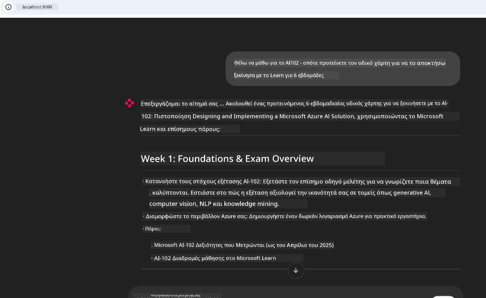
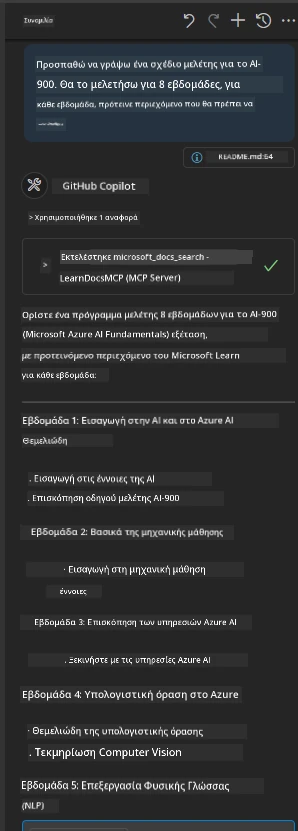

# Μελέτη Περίπτωσης: Σύνδεση με τον Microsoft Learn Docs MCP Server από έναν Client

Έχετε βρεθεί ποτέ να πηγαινοέρχεστε μεταξύ των ιστότοπων τεκμηρίωσης, του Stack Overflow και ατελείωτων καρτελών μηχανών αναζήτησης, προσπαθώντας να λύσετε ένα πρόβλημα στον κώδικά σας; Ίσως κρατάτε μια δεύτερη οθόνη μόνο για τις τεκμηριώσεις, ή κάνετε συνεχώς alt-tab μεταξύ του IDE σας και ενός προγράμματος περιήγησης. Δεν θα ήταν καλύτερα αν θα μπορούσατε να ενσωματώσετε την τεκμηρίωση απευθείας στη ροή εργασίας σας—ενσωματωμένη στις εφαρμογές σας, στο IDE σας ή ακόμα και στα δικά σας προσαρμοσμένα εργαλεία; Σε αυτή τη μελέτη περίπτωσης, θα εξερευνήσουμε πώς να το κάνετε ακριβώς αυτό συνδεόμενοι απευθείας στον Microsoft Learn Docs MCP server από τη δική σας εφαρμογή πελάτη.

## Επισκόπηση

Η σύγχρονη ανάπτυξη δεν είναι απλώς η γραφή κώδικα—είναι η εύρεση της σωστής πληροφορίας τη σωστή στιγμή. Η τεκμηρίωση είναι παντού, αλλά σπάνια εκεί που τη χρειάζεστε περισσότερο: μέσα στα εργαλεία και τις ροές εργασίας σας. Με την ενσωμάτωση της ανάκτησης τεκμηρίωσης απευθείας στις εφαρμογές σας, μπορείτε να εξοικονομήσετε χρόνο, να μειώσετε τις αλλαγές συμφραζομένων και να αυξήσετε την παραγωγικότητα. Σε αυτήν την ενότητα, θα σας δείξουμε πώς να συνδέσετε έναν client με τον Microsoft Learn Docs MCP server, ώστε να αποκτήσετε πρόσβαση σε τεκμηρίωση σε πραγματικό χρόνο και επίκαιρο περιεχόμενο, χωρίς να βγείτε από την εφαρμογή σας.

Θα περιγράψουμε τη διαδικασία εγκαθίδρυσης μιας σύνδεσης, αποστολής αιτήματος και αποτελεσματικής διαχείρισης ροής απαντήσεων. Αυτή η προσέγγιση όχι μόνο απλοποιεί τη ροή εργασίας σας, αλλά ανοίγει επίσης τον δρόμο για τη δημιουργία πιο έξυπνων, χρήσιμων εργαλείων ανάπτυξης.

## Μαθησιακοί Στόχοι

Γιατί το κάνουμε αυτό; Επειδή οι καλύτερες εμπειρίες προγραμματιστών είναι αυτές που αφαιρούν τους τριβές. Φανταστείτε έναν κόσμο όπου ο κωδικογράφος σας, το chatbot ή η web εφαρμογή σας μπορούν να απαντούν αμέσως στις ερωτήσεις τεκμηρίωσης, χρησιμοποιώντας το πιο πρόσφατο περιεχόμενο από το Microsoft Learn. Μέχρι το τέλος αυτού του κεφαλαίου, θα ξέρετε πώς να:

- Κατανοείτε τις βασικές αρχές επικοινωνίας πελάτη-διακομιστή MCP για τεκμηρίωση
- Υλοποιήσετε μια κονσόλα ή web εφαρμογή που συνδέεται με τον Microsoft Learn Docs MCP server
- Χρησιμοποιήσετε ροές HTTP πελάτη για την ανάκτηση τεκμηρίωσης σε πραγματικό χρόνο
- Καταγράφετε και ερμηνεύετε τις απαντήσεις τεκμηρίωσης στην εφαρμογή σας

Θα δείτε πώς αυτές οι δεξιότητες μπορούν να σας βοηθήσουν να δημιουργήσετε εργαλεία που δεν είναι απλά αντιδραστικά, αλλά πραγματικά διαδραστικά και ευαίσθητα στο πλαίσιο.

## Σενάριο 1 - Ανάκτηση Τεκμηρίωσης σε Πραγματικό Χρόνο με MCP

Σε αυτό το σενάριο, θα σας δείξουμε πώς να συνδέσετε έναν client με τον Microsoft Learn Docs MCP server, ώστε να μπορείτε να αποκτήσετε πρόσβαση σε τεκμηρίωση σε πραγματικό χρόνο, επίκαιρη και στοχευμένη, χωρίς να βγείτε ποτέ από την εφαρμογή σας.

Ας το εφαρμόσουμε στην πράξη. Η εργασία σας είναι να γράψετε μια εφαρμογή που συνδέεται με τον Microsoft Learn Docs MCP server, καλεί το εργαλείο `microsoft_docs_search` και καταγράφει την ροή απάντησης στην κονσόλα.

### Γιατί αυτή η προσέγγιση;
Επειδή είναι η βάση για την κατασκευή πιο προηγμένων ενσωματώσεων—είτε θέλετε να τροφοδοτήσετε ένα chatbot, μια επέκταση IDE ή έναν πίνακα ελέγχου web.

Θα βρείτε τον κώδικα και τις οδηγίες για αυτό το σενάριο στο φάκελο [`solution`](./solution/README.md) μέσα στη μελέτη περίπτωσης. Τα βήματα θα σας καθοδηγήσουν στη ρύθμιση της σύνδεσης:
- Χρήση του επίσημου SDK MCP και streamable HTTP client για τη σύνδεση
- Κλήση του εργαλείου `microsoft_docs_search` με παράμετρο αναζήτησης για λήψη τεκμηρίωσης
- Υλοποίηση κατάλληλης καταγραφής και διαχείρισης σφαλμάτων
- Δημιουργία διαδραστικού περιβάλλοντος κονσόλας για να επιτρέπει στους χρήστες εισαγωγή πολλαπλών όρων αναζήτησης

Αυτό το σενάριο δείχνει πώς να:
- Συνδεθείτε με τον Docs MCP server
- Στείλετε ένα ερώτημα
- Αναλύσετε και εκτυπώσετε τα αποτελέσματα

Ακολουθεί ένα παράδειγμα εκτέλεσης της λύσης:

```
Prompt> What is Azure Key Vault?
Answer> Azure Key Vault is a cloud service for securely storing and accessing secrets. ...
```

Παρακάτω φαίνεται ένα ελάχιστο παράδειγμα λύσης. Ο πλήρης κώδικας και λεπτομέρειες είναι διαθέσιμα στο φάκελο λύσης.

<details>
<summary>Python</summary>

```python
import asyncio
from mcp.client.streamable_http import streamablehttp_client
from mcp import ClientSession

async def main():
    async with streamablehttp_client("https://learn.microsoft.com/api/mcp") as (read_stream, write_stream, _):
        async with ClientSession(read_stream, write_stream) as session:
            await session.initialize()
            result = await session.call_tool("microsoft_docs_search", {"query": "Azure Functions best practices"})
            print(result.content)

if __name__ == "__main__":
    asyncio.run(main())
```

- Για την πλήρη υλοποίηση και την καταγραφή, δείτε το αρχείο [`scenario1.py`](../../../../09-CaseStudy/docs-mcp/solution/python/scenario1.py).
- Για οδηγίες εγκατάστασης και χρήσης, δείτε το αρχείο [`README.md`](./solution/python/README.md) στον ίδιο φάκελο.
</details>


## Σενάριο 2 - Διαδραστική Εφαρμογή Web Παραγωγής Σπουδαστικού Σχεδίου με MCP

Σε αυτό το σενάριο, θα μάθετε πώς να ενσωματώσετε το Docs MCP σε ένα έργο ανάπτυξης web. Στόχος είναι να επιτρέψετε στους χρήστες να αναζητούν τεκμηρίωση Microsoft Learn απευθείας από μια διεπαφή web, καθιστώντας την τεκμηρίωση άμεσα προσβάσιμη μέσα στην εφαρμογή ή τον ιστότοπό σας.

Θα δείτε πώς να:
- Ρυθμίσετε μια web εφαρμογή
- Συνδεθείτε με τον Docs MCP server
- Διαχειριστείτε την είσοδο χρήστη και να εμφανίσετε τα αποτελέσματα

Ακολουθεί ένα παράδειγμα εκτέλεσης της λύσης:

```
User> I want to learn about AI102 - so suggest the roadmap to get it started from learn for 6 weeks

Assistant> Here’s a detailed 6-week roadmap to start your preparation for the AI-102: Designing and Implementing a Microsoft Azure AI Solution certification, using official Microsoft resources and focusing on exam skills areas:

---
## Week 1: Introduction & Fundamentals
- **Understand the Exam**: Review the [AI-102 exam skills outline](https://learn.microsoft.com/en-us/credentials/certifications/exams/ai-102/).
- **Set up Azure**: Sign up for a free Azure account if you don't have one.
- **Learning Path**: [Introduction to Azure AI services](https://learn.microsoft.com/en-us/training/modules/intro-to-azure-ai/)
- **Focus**: Get familiar with Azure portal, AI capabilities, and necessary tools.

....more weeks of the roadmap...

Let me know if you want module-specific recommendations or need more customized weekly tasks!
```

Παρακάτω φαίνεται ένα ελάχιστο παράδειγμα λύσης. Ο πλήρης κώδικας και λεπτομέρειες είναι διαθέσιμα στο φάκελο λύσης.



<details>
<summary>Python (Chainlit)</summary>

Το Chainlit είναι ένα πλαίσιο εργασίας για τη δημιουργία διαδραστικών εφαρμογών συνομιλίας AI web. Απλοποιεί τη δημιουργία διαδραστικών chatbots και βοηθών που μπορούν να καλούν εργαλεία MCP και να εμφανίζουν αποτελέσματα σε πραγματικό χρόνο. Είναι ιδανικό για γρήγορη πρωτοτυποποίηση και φιλικές προς τον χρήστη διεπαφές.

```python
import chainlit as cl
import requests

MCP_URL = "https://learn.microsoft.com/api/mcp"

@cl.on_message
def handle_message(message):
    query = {"question": message}
    response = requests.post(MCP_URL, json=query)
    if response.ok:
        result = response.json()
        cl.Message(content=result.get("answer", "No answer found.")).send()
    else:
        cl.Message(content="Error: " + response.text).send()
```

- Για την πλήρη υλοποίηση, δείτε το αρχείο [`scenario2.py`](../../../../09-CaseStudy/docs-mcp/solution/python/scenario2.py).
- Για οδηγίες ρύθμισης και εκτέλεσης, δείτε το [`README.md`](./solution/python/README.md).
</details>


## Σενάριο 3: Τεκμηρίωση μέσα στον Επεξεργαστή με MCP Server στο VS Code

Εάν θέλετε να λαμβάνετε τα Microsoft Learn Docs απευθείας μέσα στο VS Code σας (αντί να αλλάζετε καρτέλες περιηγητή), μπορείτε να χρησιμοποιήσετε τον MCP server μέσα στον επεξεργαστή σας. Αυτό σας επιτρέπει να:
- Αναζητάτε και διαβάζετε τεκμηρίωση στο VS Code χωρίς να βγείτε από το περιβάλλον κωδικοποίησης.
- Κάνετε αναφορές σε τεκμηρίωση και εισάγετε συνδέσμους απευθείας στα αρχεία README ή μαθήματός σας.
- Αξιοποιήσετε το GitHub Copilot και MCP μαζί για μια αδιάλειπτη ροή εργασίας τεκμηρίωσης με ισχύ AI.

**Θα δείτε πώς να:**
- Προσθέσετε ένα έγκυρο αρχείο `.vscode/mcp.json` στη ρίζα του χώρου εργασίας σας (δείτε το παράδειγμα παρακάτω).
- Ανοίξετε τον πίνακα MCP ή να χρησιμοποιήσετε την παλέτα εντολών στο VS Code για να αναζητήσετε και να εισάγετε τεκμηρίωση.
- Αναφέρετε τεκμηρίωση απευθείας σε αρχεία markdown καθώς εργάζεστε.
- Συνδυάσετε αυτή τη ροή εργασίας με το GitHub Copilot για ακόμη μεγαλύτερη παραγωγικότητα.

Ακολουθεί ένα παράδειγμα ρύθμισης του MCP server στο VS Code:

```json
{
  "servers": {
    "LearnDocsMCP": {
      "url": "https://learn.microsoft.com/api/mcp"
    }
  }
}
```

</details>

> Για αναλυτική περιήγηση με στιγμιότυπα οθόνης και βήμα προς βήμα οδηγίες, δείτε το αρχείο [`README.md`](./solution/scenario3/README.md).



Αυτή η προσέγγιση είναι ιδανική για όποιον δημιουργεί τεχνικά μαθήματα, γράφει τεκμηρίωση ή αναπτύσσει κώδικα με συχνές ανάγκες αναφοράς.

## Κύρια Σημεία

Η ενσωμάτωση τεκμηρίωσης απευθείας στα εργαλεία σας δεν είναι απλώς μια ευκολία—είναι μια αλλαγή παιγνιδιού για την παραγωγικότητα. Με τη σύνδεση στον Microsoft Learn Docs MCP server από τον client σας, μπορείτε να:

- Εξαλείψετε τη μετάβαση μεταξύ κώδικα και τεκμηρίωσης
- Ανακτάτε επικαιροποιημένη, επίκαιρη τεκμηρίωση σε πραγματικό χρόνο
- Δημιουργήσετε πιο έξυπνα, διαδραστικά εργαλεία για προγραμματιστές

Αυτές οι δεξιότητες θα σας βοηθήσουν να δημιουργήσετε λύσεις που δεν είναι μόνο αποδοτικές, αλλά και ευχάριστες στη χρήση.

## Επιπλέον Πόροι

Για να εμβαθύνετε την κατανόησή σας, εξερευνήστε αυτούς τους επίσημους πόρους:

- [Microsoft Learn Docs MCP Server (GitHub)](https://github.com/MicrosoftDocs/mcp)
- [Ξεκινήστε με τον Azure MCP Server (mcp-python)](https://learn.microsoft.com/en-us/azure/developer/azure-mcp-server/get-started#create-the-python-app)
- [Τι είναι ο Azure MCP Server;](https://learn.microsoft.com/en-us/azure/developer/azure-mcp-server/)
- [Εισαγωγή στο Model Context Protocol (MCP)](https://modelcontextprotocol.io/introduction)
- [Προσθήκη plugins από MCP Server (Python)](https://learn.microsoft.com/en-us/semantic-kernel/concepts/plugins/adding-mcp-plugins)

## Τι Ακολουθεί

- Επιστροφή στο: [Επισκόπηση Μελετών Περιπτώσεων](../README.md)
- Συνέχεια στο: [Ενότητα 10: Βελτιστοποίηση Ροών Εργασίας AI με AI Toolkit](../../10-StreamliningAIWorkflowsBuildingAnMCPServerWithAIToolkit/README.md)

---

<!-- CO-OP TRANSLATOR DISCLAIMER START -->
**Αποποίηση Ευθυνών**:  
Αυτό το έγγραφο έχει μεταφραστεί χρησιμοποιώντας την υπηρεσία μετάφρασης AI [Co-op Translator](https://github.com/Azure/co-op-translator). Παρόλο που προσπαθούμε για ακρίβεια, παρακαλούμε να λάβετε υπόψη ότι οι αυτοματοποιημένες μεταφράσεις ενδέχεται να περιέχουν λάθη ή ανακρίβειες. Το αρχικό έγγραφο στην πρωτότυπη γλώσσα πρέπει να θεωρείται η επίσημη πηγή. Για κρίσιμες πληροφορίες συνιστάται επαγγελματική μετάφραση από ανθρώπινο μεταφραστή. Δεν φέρουμε ευθύνη για τυχόν παρεξηγήσεις ή λανθασμένες ερμηνείες που προκύπτουν από τη χρήση αυτής της μετάφρασης.
<!-- CO-OP TRANSLATOR DISCLAIMER END -->