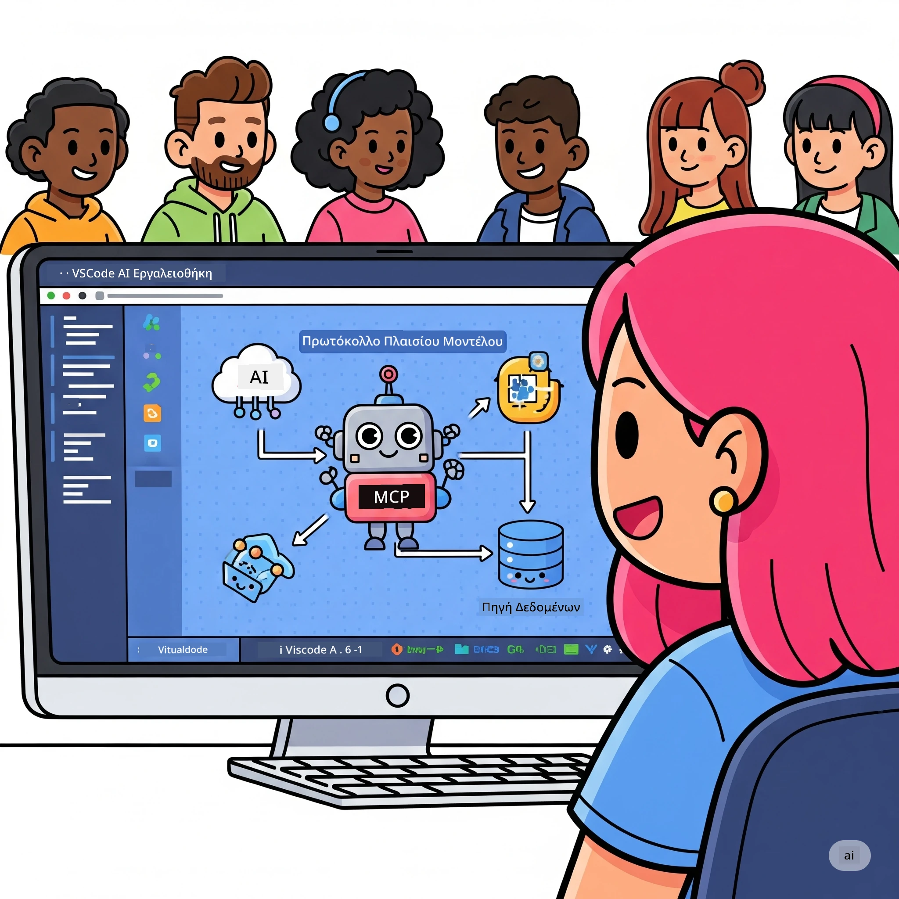
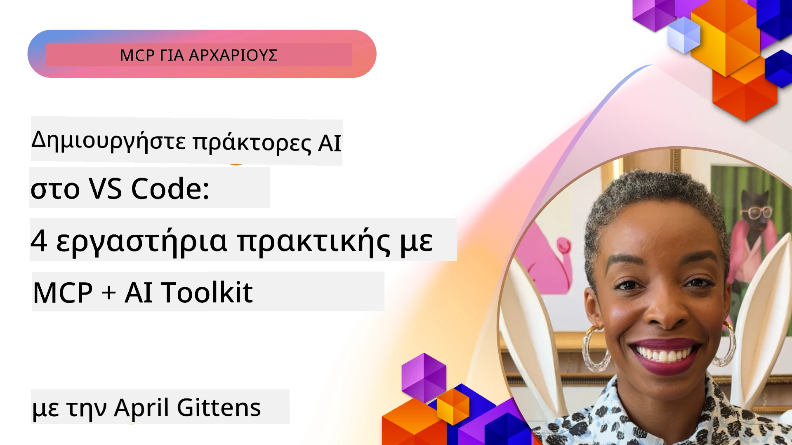

# Βελτιστοποίηση Ροών Εργασίας Τεχνητής Νοημοσύνης: Δημιουργία ενός MCP Server με το AI Toolkit

## 🎯  Επισκόπηση

_(Κάντε κλικ στην εικόνα παραπάνω για να δείτε το βίντεο αυτού του μαθήματος)_

Καλώς ήρθατε στο **Model Context Protocol (MCP) Workshop**! Αυτό το ολοκληρωμένο εργαστήριο συνδυάζει δύο πρωτοποριακές τεχνολογίες για να φέρει επανάσταση στην ανάπτυξη εφαρμογών AI:

- **🔗 Model Context Protocol (MCP)**: Ένα ανοιχτό πρότυπο για αδιάλειπτη ενσωμάτωση εργαλείων AI
- **🛠️ AI Toolkit για Visual Studio Code (AITK)**: Το ισχυρό extension της Microsoft για ανάπτυξη AI

### 🎓 Τι θα μάθετε

Μέχρι το τέλος αυτού του εργαστηρίου, θα έχετε κατακτήσει την τέχνη της δημιουργίας ευφυών εφαρμογών που γεφυρώνουν μοντέλα AI με πραγματικά εργαλεία και υπηρεσίες. Από αυτοματοποιημένες δοκιμές έως εξατομικευμένες ενσωματώσεις API, θα αποκτήσετε πρακτικές δεξιότητες για την επίλυση σύνθετων επιχειρηματικών προκλήσεων.

## 🏗️ Τεχνολογικό Υπόβαθρο

### 🔌 Model Context Protocol (MCP)

Το MCP είναι το **«USB-C για την Τεχνητή Νοημοσύνη»** - ένα καθολικό πρότυπο που συνδέει τα μοντέλα AI με εξωτερικά εργαλεία και πηγές δεδομένων.

**✨ Βασικά Χαρακτηριστικά:**

- 🔄 **Τυποποιημένη Ενσωμάτωση**: Καθολικό interface για συνδέσεις εργαλείων AI
- 🏛️ **Ευέλικτη Αρχιτεκτονική**: Τοπικοί και απομακρυσμένοι servers μέσω stdio/SSE μεταφοράς
- 🧰 **Πλούσιο Οικοσύστημα**: Εργαλεία, προτροπές και πόροι σε ένα πρωτόκολλο
- 🔒 **Έτοιμο για Επιχειρήσεις**: Ενσωματωμένη ασφάλεια και αξιοπιστία

**🎯 Γιατί το MCP Έχει Σημασία:**
Όπως το USB-C ξεκαθάρισε το χάος με τα καλώδια, έτσι το MCP απλοποιεί την πολυπλοκότητα των ενσωματώσεων AI. Ένα πρωτόκολλο, απεριόριστες δυνατότητες.

### 🤖 AI Toolkit για Visual Studio Code (AITK)

Το βασικό extension AI της Microsoft που μετατρέπει το VS Code σε μια δυνατή πλατφόρμα AI.

**🚀 Βασικές Δυνατότητες:**

- 📦 **Κατάλογος Μοντέλων**: Πρόσβαση σε μοντέλα από Azure AI, GitHub, Hugging Face, Ollama
- ⚡ **Τοπική Επεξεργασία**: Εκτέλεση ONNX-βελτιστοποιημένη σε CPU/GPU/NPU
- 🏗️ **Agent Builder**: Οπτική ανάπτυξη πράκτορα AI με ενσωμάτωση MCP
- 🎭 **Πολυτροπικότητα**: Υποστήριξη κειμένου, εικόνας και δομημένης εξόδου

**💡 Οφέλη Ανάπτυξης:**

- Ανάπτυξη μοντέλων χωρίς ρυθμίσεις
- Μηχανική προτροπών μέσω οπτικού περιβάλλοντος
- Playground δοκιμών σε πραγματικό χρόνο
- Αδιάλειπτη ενσωμάτωση MCP servers

## 📚 Διαδρομή Μάθησης

### [🚀 Ενότητα 1: Θεμελιώδεις έννοιες AI Toolkit](./lab1/README.md)

**Διάρκεια**: 15 λεπτά

- 🛠️ Εγκατάσταση και ρύθμιση του AI Toolkit για VS Code
- 🗂️ Εξερεύνηση του Καταλόγου Μοντέλων (100+ μοντέλα από GitHub, ONNX, OpenAI, Anthropic, Google)
- 🎮 Εξοικείωση με το Interactive Playground για δοκιμές σε πραγματικό χρόνο
- 🤖 Δημιουργία του πρώτου AI agent με το Agent Builder
- 📊 Αξιολόγηση απόδοσης μοντέλων με ενσωματωμένους δείκτες (F1, σχετικότητα, ομοιότητα, συνοχή)
- ⚡ Εκμάθηση λειτουργιών παρτίδων και πολυτροπικής υποστήριξης

**🎯 Αποτέλεσμα Μάθησης**: Δημιουργία λειτουργικού AI agent με πλήρη κατανόηση των δυνατοτήτων του AITK

### [🌐 Ενότητα 2: MCP με AI Toolkit Θεμελιώδεις Έννοιες](./lab2/README.md)

**Διάρκεια**: 20 λεπτά

- 🧠 Κατανόηση αρχιτεκτονικής και εννοιών Model Context Protocol (MCP)
- 🌐 Εξερεύνηση οικοσυστήματος MCP server της Microsoft
- 🤖 Δημιουργία πράκτορα αυτοματισμού browser με Playwright MCP server
- 🔧 Ενσωμάτωση MCP servers με το AI Toolkit Agent Builder
- 📊 Ρύθμιση και δοκιμή MCP εργαλείων μέσα στους πράκτορές σας
- 🚀 Εξαγωγή και ανάπτυξη πράκτορων με MCP για παραγωγική χρήση

**🎯 Αποτέλεσμα Μάθησης**: Ανάπτυξη AI agent ενισχυμένου με εξωτερικά εργαλεία μέσω MCP

### [🔧 Ενότητα 3: Προχωρημένη Ανάπτυξη MCP με AI Toolkit](./lab3/README.md)

**Διάρκεια**: 20 λεπτά

- 💻 Δημιουργία custom MCP servers με το AI Toolkit
- 🐍 Ρύθμιση και χρήση της πιο πρόσφατης MCP Python SDK (v1.9.3)
- 🔍 Εγκατάσταση και χρήση MCP Inspector για debugging
- 🛠️ Δημιουργία Weather MCP Server με επαγγελματικά debugging workflows
- 🧪 Debug MCP servers σε περιβάλλοντα Agent Builder και Inspector

**🎯 Αποτέλεσμα Μάθησης**: Ανάπτυξη και αποσφαλμάτωση custom MCP servers με σύγχρονα εργαλεία

### [🐙 Ενότητα 4: Πρακτική Ανάπτυξη MCP - Custom GitHub Clone Server](./lab4/README.md)

**Διάρκεια**: 30 λεπτά

- 🏗️ Δημιουργία ενός ολοκληρωμένου GitHub Clone MCP Server για ροές εργασίας ανάπτυξης
- 🔄 Υλοποίηση έξυπνης κλωνοποίησης αποθετηρίων με επικύρωση και διαχείριση σφαλμάτων
- 📁 Δημιουργία ευφυούς διαχείρισης φακέλων και ενσωμάτωση με VS Code
- 🤖 Χρήση GitHub Copilot Agent Mode με custom MCP εργαλεία
- 🛡️ Εφαρμογή παραγωγικής αξιοπιστίας και συμβατότητας πολλαπλών πλατφορμών

**🎯 Αποτέλεσμα Μάθησης**: Ανάπτυξη παραγωγικού MCP server που απλοποιεί πραγματικές ροές εργασίας ανάπτυξης

## 💡 Πραγματικές Εφαρμογές & Επιπτώσεις

### 🏢 Επιχειρησιακές Χρήσεις

#### 🔄 Αυτοματοποίηση DevOps

Μεταμορφώστε τη ροή εργασίας ανάπτυξής σας με ευφυή αυτοματοποίηση:

- **Έξυπνη Διαχείριση Αποθετηρίων**: Αξιολόγηση κώδικα και αποφάσεις συγχώνευσης με AI
- **Ευφυές CI/CD**: Αυτόματη βελτιστοποίηση pipeline βάσει αλλαγών κώδικα
- **Ταξινόμηση Θεμάτων**: Αυτόματη κατηγοριοποίηση και ανάθεση σφαλμάτων

#### 🧪 Επανάσταση Ποιοτικού Ελέγχου

Αναβαθμίστε τις δοκιμές με αυτοματοποίηση βασισμένη σε AI:

- **Έξυπνη Δημιουργία Δοκιμών**: Αυτόματη δημιουργία πλήρων σετ δοκιμών
- **Οπτική Δοκιμή Οπισθοδρόμησης**: Ανίχνευση αλλαγών UI με AI
- **Παρακολούθηση Απόδοσης**: Προληπτική ανίχνευση και επίλυση προβλημάτων

#### 📊 Ευφυΐα Ροής Δεδομένων

Κατασκευάστε πιο έξυπνες ροές επεξεργασίας δεδομένων:

- **Προσαρμοστικές ETL Διαδικασίες**: Αυτοβελτιστοποίηση μετατροπών δεδομένων
- **Ανίχνευση Ανωμαλιών**: Παρακολούθηση ποιότητας δεδομένων σε πραγματικό χρόνο
- **Έξυπνος Δρομολογητής**: Διαχείριση ροής δεδομένων με ευφυΐα

#### 🎧 Βελτίωση Εμπειρίας Πελάτη

Δημιουργήστε εξαιρετικές αλληλεπιδράσεις με πελάτες:

- **Υποστήριξη Με Συνειδητοποίηση Πλαισίου**: Πράκτορες AI με πρόσβαση σε ιστορικό πελάτη
- **Προληπτική Επίλυση Προβλημάτων**: Προβλεπτική εξυπηρέτηση πελατών
- **Ενσωμάτωση Πολλαπλών Καναλιών**: Ενοποιημένη εμπειρία AI σε πλατφόρμες

## 🛠️ Προαπαιτούμενα & Ρύθμιση

### 💻 Απαιτήσεις Συστήματος

| Συστατικό | Απαίτηση | Σημειώσεις |
|-----------|----------|------------|
| **Λειτουργικό Σύστημα** | Windows 10+, macOS 10.15+, Linux | Οποιοδήποτε σύγχρονο OS |
| **Visual Studio Code** | Τελευταία σταθερή έκδοση | Απαραίτητο για AITK |
| **Node.js** | v18.0+ και npm | Για ανάπτυξη MCP server |
| **Python** | 3.10+ | Προαιρετικό για Python MCP servers |
| **Μνήμη** | Ελάχιστο 8GB RAM | Συνιστώνται 16GB για τοπικά μοντέλα |

### 🔧 Περιβάλλον Ανάπτυξης

#### Συνιστώμενα Extensions VS Code

- **AI Toolkit** (ms-windows-ai-studio.windows-ai-studio)
- **Python** (ms-python.python)
- **Python Debugger** (ms-python.debugpy)
- **GitHub Copilot** (GitHub.copilot) - Προαιρετικό αλλά χρήσιμο

#### Προαιρετικά Εργαλεία

- **uv**: Σύγχρονος διαχειριστής πακέτων Python
- **MCP Inspector**: Οπτικό εργαλείο debugging για MCP servers
- **Playwright**: Για παραδείγματα αυτοματισμού web

## 🎖️ Αποτελέσματα Μάθησης & Διαδρομή Πιστοποίησης

### 🏆 Λίστα Ελέγχου Δεξιοτήτων

Με την ολοκλήρωση αυτού του εργαστηρίου, θα επιτύχετε δεξιότητες σε:

#### 🎯 Βασικές Ικανότητες

- [ ] **Αριστεία στο Πρωτόκολλο MCP**: Βαθιά κατανόηση αρχιτεκτονικής και μοτίβων υλοποίησης
- [ ] **Επάρκεια AITK**: Εξειδικευμένη χρήση AI Toolkit για ταχεία ανάπτυξη
- [ ] **Ανάπτυξη Custom Server**: Δημιουργία, ανάπτυξη και διαχείριση παραγωγικών MCP servers
- [ ] **Άριστη Ενσωμάτωση Εργαλείων**: Αδιάλειπτη σύνδεση AI με υπάρχουσες ροές εργασίας
- [ ] **Εφαρμογή επίλυσης προβλημάτων**: Χρήση δεξιοτήτων σε πραγματικές επιχειρηματικές προκλήσεις

#### 🔧 Τεχνικές Δεξιότητες

- [ ] Ρύθμιση και διαμόρφωση AI Toolkit στο VS Code
- [ ] Σχεδιασμός και υλοποίηση custom MCP servers
- [ ] Ενσωμάτωση μοντέλων GitHub με αρχιτεκτονική MCP
- [ ] Δημιουργία αυτοματοποιημένων ροών δοκιμών με Playwright
- [ ] Ανάπτυξη AI πρακτόρων για παραγωγική χρήση
- [ ] Debug και βελτιστοποίηση απόδοσης MCP server

#### 🚀 Προχωρημένες Ικανότητες

- [ ] Αρχιτεκτονική ευρείας κλίμακας ενσωματώσεων AI
- [ ] Εφαρμογή βέλτιστων πρακτικών ασφάλειας για AI εφαρμογές
- [ ] Σχεδιασμός κλιμακούμενων αρχιτεκτονικών MCP server
- [ ] Δημιουργία custom αλυσίδων εργαλείων για ειδικούς τομείς
- [ ] Καθοδήγηση άλλων σε AI-native ανάπτυξη

## 📖 Επιπλέον Πόροι

- [MCP Specification (2025-11-25)](https://spec.modelcontextprotocol.io/specification/2025-11-25/)
- [AI Toolkit GitHub Repository](https://github.com/microsoft/vscode-ai-toolkit)
- [Sample MCP Servers Collection](https://github.com/modelcontextprotocol/servers)
- [Best Practices Guide](https://modelcontextprotocol.io/docs/best-practices)
- [OWASP MCP Top 10](https://microsoft.github.io/mcp-azure-security-guide/mcp/) - Βέλτιστες πρακτικές ασφαλείας

---

**🚀 Είστε έτοιμοι να φέρετε επανάσταση στη ροή εργασίας ανάπτυξης AI;**

Ας χτίσουμε μαζί το μέλλον των ευφυών εφαρμογών με MCP και AI Toolkit!

## Τι Ακολουθεί

Συνεχίστε με: [Ενότητα 11: Εργαστήρια MCP Server](../11-MCPServerHandsOnLabs/README.md)

---

<!-- CO-OP TRANSLATOR DISCLAIMER START -->
**Αποποίηση ευθυνών**:
Αυτό το έγγραφο έχει μεταφραστεί χρησιμοποιώντας την υπηρεσία τεχνητής νοημοσύνης μετάφρασης [Co-op Translator](https://github.com/Azure/co-op-translator). Παρόλο που επιδιώκουμε την ακρίβεια, παρακαλούμε να σημειώσετε ότι οι αυτόματες μεταφράσεις ενδέχεται να περιέχουν λάθη ή ανακρίβειες. Το πρωτότυπο έγγραφο στη μητρική του γλώσσα πρέπει να θεωρείται η έγκυρη πηγή. Για κρίσιμες πληροφορίες, συνιστάται η επαγγελματική ανθρώπινη μετάφραση. Δεν φέρουμε ευθύνη για τυχόν παρεξηγήσεις ή παρανοήσεις που προκύπτουν από τη χρήση αυτής της μετάφρασης.
<!-- CO-OP TRANSLATOR DISCLAIMER END -->