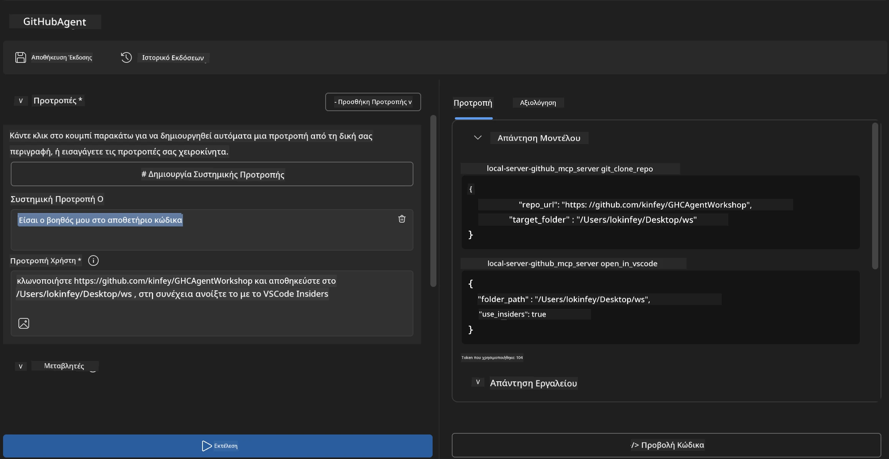
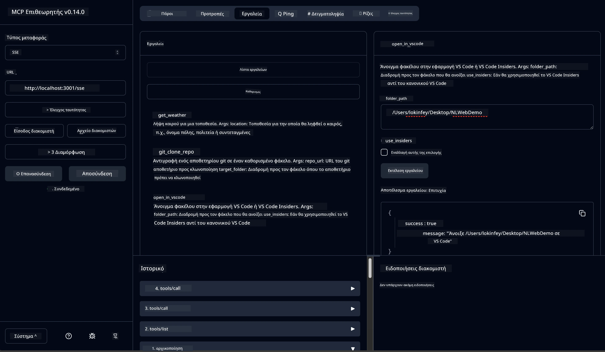

# 🐙 Ενότητα 4: Πρακτική Ανάπτυξη MCP - Προσαρμοσμένος Διακομιστής Κλωνοποίησης GitHub


> **⚡ Γρήγορη Εκκίνηση:** Δημιουργήστε έναν MCP διακομιστή έτοιμο για παραγωγή που αυτοματοποιεί την κλωνοποίηση αποθετηρίων GitHub και την ενσωμάτωση με το VS Code σε μόλις 30 λεπτά!

## 🎯 Μαθησιακοί Στόχοι

Στο τέλος αυτού του εργαστηρίου, θα είστε ικανοί να:

- ✅ Δημιουργήσετε προσαρμοσμένο MCP διακομιστή για πραγματικά αναπτυξιακά workflows
- ✅ Υλοποιήσετε λειτουργικότητα κλωνοποίησης αποθετηρίων GitHub μέσω MCP
- ✅ Ενσωματώσετε προσαρμοσμένους MCP διακομιστές με VS Code και Agent Builder
- ✅ Χρησιμοποιείτε το GitHub Copilot Agent Mode με προσαρμοσμένα εργαλεία MCP
- ✅ Δοκιμάσετε και αναπτύξετε προσαρμοσμένους MCP διακομιστές σε περιβάλλοντα παραγωγής

## 📋 Προαπαιτούμενα

- Ολοκλήρωση των εργαστηρίων 1-3 (θεμελιώδη MCP και προχωρημένη ανάπτυξη)
- Συνδρομή GitHub Copilot ([διαθέσιμη δωρεάν εγγραφή](https://github.com/github-copilot/signup))
- VS Code με επεκτάσεις AI Toolkit και GitHub Copilot
- Εγκατεστημένο και ρυθμισμένο Git CLI

## 🏗️ Επισκόπηση Έργου

### **Πραγματική Πρόκληση Ανάπτυξης**
Ως προγραμματιστές, χρησιμοποιούμε συχνά το GitHub για να κλωνοποιούμε αποθετήρια και να τα ανοίγουμε στο VS Code ή VS Code Insiders. Αυτή η χειροκίνητη διαδικασία περιλαμβάνει:
1. Άνοιγμα τερματικού/γραμμής εντολών
2. Πλοήγηση στον επιθυμητό φάκελο
3. Εκτέλεση εντολής `git clone`
4. Άνοιγμα του VS Code στον κλωνοποιημένο φάκελο

**Η λύση MCP που δημιουργούμε απλοποιεί όλα αυτά σε μια μόνη έξυπνη εντολή!**

### **Τι θα Δημιουργήσετε**
Έναν **GitHub Clone MCP Server** (`git_mcp_server`) που παρέχει:

| Χαρακτηριστικό | Περιγραφή | Όφελος |
|---------|-------------|---------|
| 🔄 **Έξυπνη Κλωνοποίηση Αποθετηρίων** | Κλωνοποίηση αποθετηρίων GitHub με επικύρωση | Αυτοματοποιημένος έλεγχος λαθών |
| 📁 **Έξυπνη Διαχείριση Φακέλων** | Έλεγχος και δημιουργία φακέλων με ασφάλεια | Αποτρέπει την υπερεγγραφή |
| 🚀 **Διαλειτουργική Ενσωμάτωση VS Code** | Άνοιγμα έργων σε VS Code/Insiders | Ομαλή μετάβαση στο workflow |
| 🛡️ **Αξιόπιστος Χειρισμός Σφαλμάτων** | Διαχείριση προβλημάτων δικτύου, δικαιωμάτων και διαδρομών | Ετοιμότητα για παραγωγή |

---

## 📖 Βήμα-Βήμα Υλοποίηση

### Βήμα 1: Δημιουργία GitHub Agent στο Agent Builder

1. **Ξεκινήστε τον Agent Builder** μέσω της επέκτασης AI Toolkit
2. **Δημιουργήστε έναν νέο agent** με την ακόλουθη διαμόρφωση:
   ```
   Agent Name: GitHubAgent
   ```

3. **Αρχικοποιήστε τον προσαρμοσμένο MCP διακομιστή:**
   - Μεταβείτε σε **Tools** → **Add Tool** → **MCP Server**
   - Επιλέξτε **"Create A new MCP Server"**
   - Επέλεξτε **Python template** για μέγιστη ευελιξία
   - **Όνομα Διακομιστή:** `git_mcp_server`

### Βήμα 2: Ρύθμιση GitHub Copilot Agent Mode

1. **Ανοίξτε το GitHub Copilot** στο VS Code (Ctrl/Cmd + Shift + P → "GitHub Copilot: Open")
2. **Επιλέξτε το Agent Model** στην διεπαφή του Copilot
3. **Επιλέξτε το μοντέλο Claude 3.7** για βελτιωμένες δυνατότητες συλλογιστικής
4. **Ενεργοποιήστε την ενσωμάτωση MCP** για πρόσβαση σε εργαλεία

> **💡 Επαγγελματική Συμβουλή:** Το Claude 3.7 παρέχει ανώτερη κατανόηση ροών εργασίας ανάπτυξης και προτύπων χειρισμού σφαλμάτων.

### Βήμα 3: Υλοποιήστε βασική λειτουργικότητα MCP διακομιστή

**Χρησιμοποιήστε την παρακάτω λεπτομερή προτροπή με το GitHub Copilot Agent Mode:**

```
Create two MCP tools with the following comprehensive requirements:

🔧 TOOL A: clone_repository
Requirements:
- Clone any GitHub repository to a specified local folder
- Return the absolute path of the successfully cloned project
- Implement comprehensive validation:
  ✓ Check if target directory already exists (return error if exists)
  ✓ Validate GitHub URL format (https://github.com/user/repo)
  ✓ Verify git command availability (prompt installation if missing)
  ✓ Handle network connectivity issues
  ✓ Provide clear error messages for all failure scenarios

🚀 TOOL B: open_in_vscode
Requirements:
- Open specified folder in VS Code or VS Code Insiders
- Cross-platform compatibility (Windows/Linux/macOS)
- Use direct application launch (not terminal commands)
- Auto-detect available VS Code installations
- Handle cases where VS Code is not installed
- Provide user-friendly error messages

Additional Requirements:
- Follow MCP 1.9.3 best practices
- Include proper type hints and documentation
- Implement logging for debugging purposes
- Add input validation for all parameters
- Include comprehensive error handling
```

### Βήμα 4: Δοκιμάστε τον MCP Server σας

#### 4α. Δοκιμή στο Agent Builder

1. **Εκκινήστε τη διαμόρφωση αποσφαλμάτωσης** για τον Agent Builder
2. **Διαμορφώστε τον agent σας με αυτή την προτροπή συστήματος:**

```
SYSTEM_PROMPT:
You are my intelligent coding repository assistant. You help developers efficiently clone GitHub repositories and set up their development environment. Always provide clear feedback about operations and handle errors gracefully.
```

3. **Δοκιμάστε με ρεαλιστικά σενάρια χρήστη:**

```
USER_PROMPT EXAMPLES:

Scenario : Basic Clone and Open
"Clone {Your GitHub Repo link such as https://github.com/kinfey/GHCAgentWorkshop
 } and save to {The global path you specify}, then open it with VS Code Insiders"
```



**Αναμενόμενα Αποτελέσματα:**
- ✅ Επιτυχής κλωνοποίηση με επιβεβαίωση διαδρομής
- ✅ Αυτόματη εκκίνηση VS Code
- ✅ Καθαρά μηνύματα σφάλματος για μη έγκυρες περιπτώσεις
- ✅ Σωστή διαχείριση οριακών περιπτώσεων

#### 4β. Δοκιμή στο MCP Inspector




---


**🎉 Συγχαρητήρια!** Δημιουργήσατε επιτυχώς έναν πρακτικό MCP διακομιστή έτοιμο για παραγωγή που επιλύει πραγματικά προβλήματα ανάπτυξης. Ο προσαρμοσμένος διακομιστής κλωνοποίησης GitHub αποδεικνύει τη δύναμη του MCP για αυτοματοποίηση και βελτίωση της παραγωγικότητας των προγραμματιστών.

### 🏆 Επιτεύγματα:
- ✅ **MCP Developer** - Δημιουργία προσαρμοσμένου MCP διακομιστή
- ✅ **Workflow Automator** - Βελτιστοποίηση αναπτυξιακών διαδικασιών  
- ✅ **Integration Expert** - Σύνδεση πολλαπλών εργαλείων ανάπτυξης
- ✅ **Production Ready** - Δημιουργία λύσεων για ανάπτυξη σε παραγωγή

---

## 🎓 Ολοκλήρωση Εργαστηρίου: Το Ταξίδι σας με το Model Context Protocol

**Αγαπητέ συμμετέχοντα,**

Συγχαρητήρια για την ολοκλήρωση και των τεσσάρων ενοτήτων του εργαστηρίου Model Context Protocol! Έχετε διανύσει μεγάλη απόσταση από την κατανόηση βασικών εννοιών του AI Toolkit μέχρι την κατασκευή MCP διακομιστών έτοιμων για παραγωγή που επιλύουν προβλήματα πραγματικού κόσμου.

### 🚀 Ανακεφαλαίωση Διαδρομής Μάθησης:

**[Ενότητα 1](../lab1/README.md)**: Ξεκινήσατε με θεμελιώδεις έννοιες του AI Toolkit, τη δοκιμή μοντέλων και τη δημιουργία του πρώτου σας AI agent.

**[Ενότητα 2](../lab2/README.md)**: Μάθατε την αρχιτεκτονική MCP, ενσωματώσατε το Playwright MCP, και δημιουργήσατε τον πρώτο σας agent αυτοματοποίησης περιηγητή.

**[Ενότητα 3](../lab3/README.md)**: Προχωρήσατε στην ανάπτυξη προσαρμοσμένων MCP διακομιστών με το Weather MCP server και μάθατε να χρησιμοποιείτε εργαλεία αποσφαλμάτωσης.

**[Ενότητα 4](../lab4/README.md)**: Εφαρμόσατε όλα όσα μάθατε για να δημιουργήσετε εργαλείο αυτοματοποίησης κλωνοποίησης αποθετηρίων GitHub πρακτικής χρήσης.

### 🌟 Τι έχετε κατακτήσει:

- ✅ **Οικοσύστημα AI Toolkit**: Μοντέλα, agents, και πρότυπα ενσωμάτωσης
- ✅ **Αρχιτεκτονική MCP**: Client-server σχεδίαση, πρωτόκολλα μεταφοράς, και ασφάλεια
- ✅ **Εργαλεία Προγραμματιστών**: Από Playground, Inspector μέχρι ανάπτυξη σε παραγωγή
- ✅ **Προσαρμοσμένη Ανάπτυξη**: Δημιουργία, δοκιμή, και ανάπτυξη των δικών σας MCP servers
- ✅ **Πρακτικές Εφαρμογές**: Επίλυση πραγματικών προκλήσεων workflow με την βοήθεια της AI

### 🔮 Τα Επόμενα Βήματά σας:

1. **Δημιουργήστε τον δικό σας MCP Server**: Εφαρμόστε αυτές τις δεξιότητες για να αυτοματοποιήσετε τα μοναδικά σας workflows
2. **Ενταχθείτε στην Κοινότητα MCP**: Μοιραστείτε τις δημιουργίες σας και μάθετε από άλλους
3. **Εξερευνήστε Προχωρημένες Ενσωματώσεις**: Συνδέστε MCP servers με εταιρικά συστήματα
4. **Συμβάλλετε στο Open Source**: Βοηθήστε στη βελτίωση των εργαλείων και της τεκμηρίωσης MCP

Να θυμάστε, αυτό το εργαστήριο είναι μόνο η αρχή. Το οικοσύστημα Model Context Protocol εξελίσσεται ραγδαία, και τώρα είστε εξοπλισμένοι να βρίσκεστε στην πρώτη γραμμή των εργαλείων ανάπτυξης με AI.

**Ευχαριστούμε για τη συμμετοχή και την αφοσίωσή σας στη μάθηση!**

Ελπίζουμε αυτό το εργαστήριο να έχει πυροδοτήσει ιδέες που θα μεταμορφώσουν τον τρόπο που δημιουργείτε και αλληλεπιδράτε με εργαλεία AI στην πορεία ανάπτυξής σας.

**Καλή κωδικοποίηση!**

---

## Τι Ακολουθεί

Συγχαρητήρια για την ολοκλήρωση όλων των εργαστηρίων στην Ενότητα 10!

- Επιστροφή στο: [Επισκόπηση Ενότητας 10](../README.md)
- Συνεχίστε με: [Ενότητα 11: MCP Server Hands-On Labs](../../11-MCPServerHandsOnLabs/README.md)

---

<!-- CO-OP TRANSLATOR DISCLAIMER START -->
**Αποποίηση ευθυνών**:
Αυτό το έγγραφο έχει μεταφραστεί χρησιμοποιώντας την υπηρεσία αυτόματης μετάφρασης AI [Co-op Translator](https://github.com/Azure/co-op-translator). Παρόλο που προσπαθούμε για ακρίβεια, παρακαλείστε να λάβετε υπόψη ότι οι αυτοματοποιημένες μεταφράσεις μπορεί να περιέχουν λάθη ή ανακρίβειες. Το πρωτότυπο έγγραφο στη μητρική του γλώσσα πρέπει να θεωρείται η αυθεντική πηγή. Για κρίσιμες πληροφορίες, συνιστάται επαγγελματική ανθρώπινη μετάφραση. Δεν φέρουμε ευθύνη για τυχόν παρεξηγήσεις ή λανθασμένες ερμηνείες που προκύπτουν από τη χρήση αυτής της μετάφρασης.
<!-- CO-OP TRANSLATOR DISCLAIMER END -->